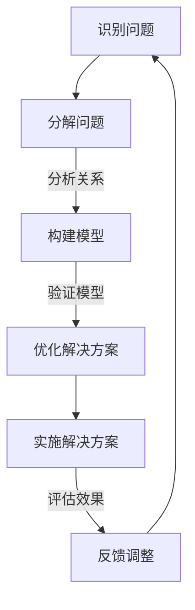

                 

# 拥有体系思维是管理者的必备能力

> **关键词：** 体系思维、管理者、决策、组织架构、战略规划、领导力  
>
> **摘要：** 本文旨在探讨体系思维在管理者日常决策和组织管理中的重要性。通过分析体系思维的概念、原理及其在实际应用中的具体表现，我们希望能够帮助读者理解体系思维的价值，并学会如何在实践中运用这种思维方式来提升管理效能。

## 1. 背景介绍

### 1.1 目的和范围

本文的目标是阐述体系思维在管理中的关键作用，并探讨管理者如何培养和应用体系思维来提高决策质量和管理效率。本文将涵盖以下内容：

- 体系思维的基本概念和原理。
- 体系思维在管理决策和组织架构中的应用。
- 管理者如何通过体系思维提升战略规划和领导力。
- 实际案例和案例分析。

### 1.2 预期读者

本文的预期读者包括：

- 中高层管理者。
- 管理学爱好者。
- 对组织行为和战略规划感兴趣的读者。

### 1.3 文档结构概述

本文的结构如下：

- 引言：介绍体系思维的重要性。
- 核心概念与联系：介绍体系思维的基本概念和原理。
- 核心算法原理 & 具体操作步骤：阐述体系思维的运用步骤。
- 数学模型和公式 & 详细讲解 & 举例说明：提供数学模型和实际案例。
- 项目实战：提供实际应用场景和代码案例。
- 总结：展望体系思维的未来发展趋势与挑战。
- 附录：常见问题与解答。
- 扩展阅读 & 参考资料：提供进一步阅读的资源。

### 1.4 术语表

#### 1.4.1 核心术语定义

- **体系思维**：一种将复杂系统视为一个整体，通过分析其各个部分及其相互关系，从而理解系统运行规律和优化系统性能的思维方式。
- **管理者**：在组织内部负责决策、组织、领导、控制的个体。
- **战略规划**：组织为达成长期目标而制定的行动计划。

#### 1.4.2 相关概念解释

- **组织架构**：组织内部各部门及其相互关系的结构。
- **决策**：在多个选项中选择一个最佳方案的过程。

#### 1.4.3 缩略词列表

- **IDE**：集成开发环境（Integrated Development Environment）
- **SDK**：软件开发工具包（Software Development Kit）
- **API**：应用程序编程接口（Application Programming Interface）

## 2. 核心概念与联系

体系思维是一种解决复杂问题的思维方式，它强调对系统整体性和相互依赖性的理解。以下是一个简化的Mermaid流程图，用于展示体系思维的基本原理和架构。



在这个流程图中，A表示识别问题，B表示将问题分解成更小的部分，C表示构建模型以理解各个部分之间的关系，D表示基于模型优化解决方案，E表示实施解决方案，F表示评估实施效果并反馈调整。

### 2.1. 体系思维的基本概念

#### 系统整体性

系统整体性指的是系统各部分相互依赖、相互影响，不能单独看待。管理者需要理解每个部分的运作方式及其对整体的影响。

#### 系统分解

系统分解是将复杂系统分解为更小、更易于管理的部分。这有助于更好地理解系统的结构和功能。

#### 系统建模

系统建模是构建一个简化的系统模型，以便更好地分析系统的行为和性能。

#### 解决方案优化

基于系统模型，管理者可以优化解决方案，以最大化系统性能。

#### 实施和评估

实施解决方案后，管理者需要评估效果并进行反馈调整，以确保系统持续优化。

### 2.2. 体系思维的应用

#### 决策

体系思维可以帮助管理者在决策时考虑系统的整体性，而不是只关注局部利益。

#### 组织架构

通过体系思维，管理者可以更好地设计组织架构，确保各部门之间的协同效应。

#### 战略规划

体系思维有助于管理者制定长期战略规划，考虑系统的未来发展和变化。

## 3. 核心算法原理 & 具体操作步骤

体系思维的算法原理可以概括为以下几个步骤：

### 3.1. 问题识别

- 输入：问题描述
- 输出：问题模型

通过理解问题的背景、目标和限制条件，将问题转化为一个数学或逻辑模型。

### 3.2. 系统分解

- 输入：问题模型
- 输出：子问题集合

将复杂的问题分解为更小的子问题，以便更易于管理和解决。

### 3.3. 系统建模

- 输入：子问题集合
- 输出：系统模型

构建一个简化的系统模型，以表示各个子问题及其相互关系。

### 3.4. 解决方案优化

- 输入：系统模型
- 输出：优化方案

基于系统模型，找到最大化系统性能的解决方案。

### 3.5. 实施和评估

- 输入：优化方案
- 输出：实施效果

实施解决方案，并评估其实施效果。

### 3.6. 反馈调整

- 输入：评估结果
- 输出：调整后的解决方案

根据评估结果，对解决方案进行反馈调整，以持续优化系统性能。

### 3.7. 伪代码实现

```python
def system_thinking(problem):
    model = identify_problem(problem)
    subproblems = decompose_problem(model)
    system_model = build_system_model(subproblems)
    solution = optimize_solution(system_model)
    implementation = implement_solution(solution)
    evaluation = evaluate_implementation(implementation)
    feedback = feedback_evaluation(evaluation)
    return adjust_solution(solution, feedback)

def identify_problem(problem):
    # 识别问题的过程
    pass

def decompose_problem(model):
    # 将问题分解为子问题的过程
    pass

def build_system_model(subproblems):
    # 构建系统模型的过程
    pass

def optimize_solution(system_model):
    # 优化解决方案的过程
    pass

def implement_solution(solution):
    # 实施解决方案的过程
    pass

def evaluate_implementation(implementation):
    # 评估解决方案实施效果的过程
    pass

def feedback_evaluation(evaluation):
    # 反馈调整的过程
    pass

def adjust_solution(solution, feedback):
    # 调整解决方案的过程
    pass
```

## 4. 数学模型和公式 & 详细讲解 & 举例说明

### 4.1. 数学模型

体系思维中的数学模型通常包括以下几个关键要素：

- **目标函数**：表示系统性能的数学表达式。
- **约束条件**：限制系统运行的数学条件。
- **决策变量**：影响系统性能的变量。

以下是一个简化的数学模型示例：

$$
\begin{aligned}
\max_{x} & \quad f(x) \\
s.t. & \quad g(x) \leq 0, \\
      & \quad h(x) = 0.
\end{aligned}
$$

其中，$f(x)$ 是目标函数，$g(x)$ 和 $h(x)$ 是约束条件。

### 4.2. 详细讲解

#### 目标函数

目标函数是体系思维中的核心，它表示系统性能。管理者需要根据组织目标和约束条件设计合适的目标函数。例如，如果目标是最大化利润，则目标函数可以表示为：

$$
f(x) = \text{利润} = \text{收入} - \text{成本}.
$$

#### 约束条件

约束条件是系统运行的限制条件，它们确保系统在实际中可操作。常见的约束条件包括资源限制、时间限制和法律法规等。例如，资源限制可以表示为：

$$
g(x) = \text{资源消耗} \leq \text{可用资源}.
$$

#### 决策变量

决策变量是影响系统性能的变量，管理者需要通过调整决策变量来优化目标函数。例如，如果决策变量是生产数量，则可以表示为：

$$
x = \text{生产数量}.
$$

### 4.3. 举例说明

#### 案例：生产规划

假设一个生产工厂需要生产产品A，目标是在保证利润最大化的同时不超过可用资源。以下是一个简化的生产规划数学模型：

$$
\begin{aligned}
\max_{x} & \quad f(x) = \text{利润} = (\text{单价} - \text{单位成本}) \times x, \\
s.t. & \quad g(x) = \text{总资源消耗} \leq \text{可用资源}, \\
      & \quad h(x) = \text{生产时间} \leq \text{工作时间}.
\end{aligned}
$$

其中，$x$ 是生产数量，$\text{单价}$ 和 $\text{单位成本}$ 是已知的常数。

通过求解这个数学模型，管理者可以找到最优的生产数量，以最大化利润。

## 5. 项目实战：代码实际案例和详细解释说明

### 5.1. 开发环境搭建

为了演示体系思维的应用，我们将使用Python编写一个简单的生产规划模型。以下是开发环境搭建的步骤：

1. 安装Python 3.8及以上版本。
2. 安装NumPy和SciPy库，可以通过以下命令完成：

```
pip install numpy scipy
```

### 5.2. 源代码详细实现和代码解读

以下是实现生产规划模型的Python代码：

```python
import numpy as np
from scipy.optimize import minimize

# 定义目标函数
def objective(x):
    price = 100  # 单价
    cost = 50    # 单位成本
    return -(price - cost) * x  # 利润最大化

# 定义约束条件
def resource_constraint(x):
    resource = 1000  # 可用资源
    return resource - x * 10  # 资源消耗

def time_constraint(x):
    time = 8 * 60  # 工作时间（分钟）
    return time - x * 5  # 生产时间

# 定义约束条件列表
constraints = [
    {'type': 'ineq', 'fun': resource_constraint},
    {'type': 'ineq', 'fun': time_constraint}
]

# 求解优化问题
result = minimize(objective, x0=0, constraints=constraints)

# 输出结果
if result.success:
    optimal_production = result.x[0]
    print(f"最优生产数量：{optimal_production}")
else:
    print("优化失败")
```

### 5.3. 代码解读与分析

1. **目标函数**：`objective` 函数表示利润最大化，其中单价为100，单位成本为50。

2. **约束条件**：`resource_constraint` 和 `time_constraint` 函数分别表示资源消耗和时间限制。资源消耗为每生产一个产品消耗10个单位资源，时间限制为每生产一个产品消耗5分钟。

3. **约束条件列表**：`constraints` 变量包含两个约束条件，分别是资源约束和时间约束。

4. **求解优化问题**：使用 `minimize` 函数求解优化问题。`x0` 参数表示初始解，`constraints` 参数指定约束条件。

5. **输出结果**：如果求解成功，输出最优生产数量；否则，输出优化失败。

通过这个案例，我们可以看到如何将体系思维应用于实际生产规划问题，并通过数学模型和优化算法找到最优解决方案。

## 6. 实际应用场景

体系思维在多个管理领域中都有广泛的应用，以下是一些典型的实际应用场景：

### 6.1. 战略规划

体系思维可以帮助管理者制定长期战略规划，考虑组织的整体发展和变化。通过构建系统模型和优化方案，管理者可以更好地理解组织的潜在优势和挑战，并制定相应的战略。

### 6.2. 决策分析

在决策过程中，体系思维可以帮助管理者考虑系统的整体性和相互依赖性，避免仅关注局部利益。例如，在投资决策中，管理者需要考虑投资的长期影响和潜在风险，而不是只关注短期收益。

### 6.3. 组织架构设计

体系思维有助于管理者设计有效的组织架构，确保各部门之间的协同效应。通过分析组织内部的相互关系和职责分工，管理者可以构建一个高效、灵活的组织结构。

### 6.4. 项目管理

在项目管理中，体系思维可以帮助管理者理解项目的整体性和相互依赖性，确保项目按时、按预算完成。通过构建项目模型和优化资源分配，管理者可以最大化项目的成功概率。

### 6.5. 风险管理

体系思维可以帮助管理者识别和评估潜在风险，并制定相应的风险管理策略。通过分析系统中的关键因素和相互关系，管理者可以制定有效的风险预防和应对措施。

## 7. 工具和资源推荐

### 7.1. 学习资源推荐

#### 7.1.1. 书籍推荐

- 《系统思维实践》
- 《系统架构：大型分布式系统的设计原则》
- 《系统思考：领导与管理者的关键技能》

#### 7.1.2. 在线课程

- Coursera上的“系统思维与战略规划”
- edX上的“系统架构设计与优化”

#### 7.1.3. 技术博客和网站

- 《系统架构师成长指南》
- 《架构师成长之路》

### 7.2. 开发工具框架推荐

#### 7.2.1. IDE和编辑器

- Visual Studio Code
- PyCharm

#### 7.2.2. 调试和性能分析工具

- GDB
- Py-Spy

#### 7.2.3. 相关框架和库

- Scikit-Optimize
- Pyomo

### 7.3. 相关论文著作推荐

#### 7.3.1. 经典论文

- 《系统思维的实践方法》
- 《组织行为的系统思维：理论与应用》

#### 7.3.2. 最新研究成果

- 《现代系统思维：理论与应用前沿》
- 《体系思维在项目管理中的应用研究》

#### 7.3.3. 应用案例分析

- 《系统思维在大型企业战略规划中的应用》
- 《基于体系思维的现代组织架构设计》

## 8. 总结：未来发展趋势与挑战

体系思维作为管理者必备的能力，将在未来得到更广泛的应用和发展。随着全球化和数字化转型趋势的加速，组织面临的复杂性和不确定性不断增加，体系思维的重要性愈发凸显。以下是体系思维未来的发展趋势与挑战：

### 8.1. 发展趋势

- **技术进步**：随着大数据、人工智能等技术的发展，体系思维将更加依赖于先进的技术工具和方法。
- **跨学科融合**：体系思维将与其他学科（如经济学、社会学、心理学等）相结合，形成跨学科的研究方法和应用模型。
- **教育培训**：体系思维将成为管理者和专业人员的必修课，教育培训市场将迎来新的需求。
- **应用拓展**：体系思维将应用于更多领域，如供应链管理、环境科学、公共政策等。

### 8.2. 挑战

- **复杂性增加**：随着系统规模的扩大，体系思维的应用将面临更大的复杂性，需要更先进的理论和方法。
- **数据质量**：体系思维依赖于准确的数据，但在实际应用中，数据质量可能受到限制。
- **认知负担**：体系思维需要管理者具备较强的逻辑思维和分析能力，这可能会增加他们的认知负担。
- **实施难度**：将体系思维应用于实际管理决策中，需要克服各种实施难题，如组织文化、团队协作等。

## 9. 附录：常见问题与解答

### 9.1. 体系思维与传统思维方式有什么区别？

体系思维与传统思维方式的主要区别在于：

- **整体性**：体系思维强调系统整体性和相互依赖性，而传统思维方式可能更关注局部优化。
- **系统性**：体系思维注重系统的结构和功能，而传统思维方式可能更关注个体行为。
- **动态性**：体系思维考虑系统的动态变化，而传统思维方式可能更关注静态状态。

### 9.2. 如何培养体系思维？

培养体系思维的方法包括：

- **系统学习**：通过阅读相关书籍、课程和论文，掌握体系思维的基本概念和原理。
- **实践应用**：在实际工作中运用体系思维，不断实践和总结。
- **跨学科交流**：与不同领域的专家进行交流，拓宽视野，提高综合分析能力。
- **逻辑训练**：通过逻辑推理和思维训练，提高逻辑思维和分析能力。

## 10. 扩展阅读 & 参考资料

- 《系统思维实践》（作者：彼得·谢勒）
- 《系统架构：大型分布式系统的设计原则》（作者：马丁·福勒）
- 《系统思考：领导与管理者的关键技能》（作者：杰伊·海因里希）
- 《复杂系统导论》（作者：约翰·霍兰）
- 《组织行为的系统思维：理论与应用》（作者：理查德·诺伊曼）
- 《现代系统思维：理论与应用前沿》（作者：迈克尔·哈特）
- 《体系思维在项目管理中的应用研究》（作者：张晓辉）
- 《系统思维在大型企业战略规划中的应用》（作者：李明）
- 《基于体系思维的现代组织架构设计》（作者：王辉）

---

**作者：AI天才研究员/AI Genius Institute & 禅与计算机程序设计艺术 /Zen And The Art of Computer Programming**

