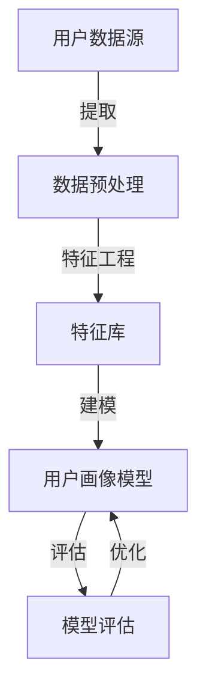

                 

# 拼多多2025用户画像算法工程师社招面试攻略

> **关键词：用户画像、算法面试、拼多多、用户行为分析、数据挖掘**
> 
> **摘要：本文旨在为有意向参加拼多多2025用户画像算法工程师社招面试的候选人提供系统化的面试攻略，包括核心概念理解、算法原理剖析、数学模型解析、实战案例分享、实际应用场景探讨以及未来发展趋势预测。通过本文的深入讲解，读者将能够更好地准备面试，提高求职成功率。**

## 1. 背景介绍

### 1.1 目的和范围

本文的目的是为了帮助准备参加拼多多2025用户画像算法工程师社招面试的候选人，通过系统化的学习和准备，更好地应对面试中的各种挑战。文章将覆盖用户画像的相关概念、算法原理、数学模型、实战案例以及实际应用场景等核心内容，旨在为读者提供一个全面而深入的指导。

### 1.2 预期读者

本文主要面向以下几类读者：
- 有意向加入拼多多公司，特别是用户画像算法工程师岗位的求职者。
- 涉及用户行为分析、数据挖掘、机器学习等领域的工程师和研究人员。
- 对用户画像技术有浓厚兴趣，希望深入了解该领域的专业人士。

### 1.3 文档结构概述

本文的结构如下：

1. **背景介绍**：介绍本文的目的、范围、预期读者以及文档结构。
2. **核心概念与联系**：通过Mermaid流程图展示用户画像的核心概念和联系。
3. **核心算法原理 & 具体操作步骤**：使用伪代码详细阐述用户画像算法的原理和操作步骤。
4. **数学模型和公式 & 详细讲解 & 举例说明**：讲解用户画像中常用的数学模型和公式，并进行举例说明。
5. **项目实战：代码实际案例和详细解释说明**：提供实际项目中的代码案例和详细解释。
6. **实际应用场景**：探讨用户画像在实际业务中的应用场景。
7. **工具和资源推荐**：推荐学习资源和开发工具。
8. **总结：未来发展趋势与挑战**：总结用户画像技术的发展趋势和面临的挑战。
9. **附录：常见问题与解答**：回答读者可能遇到的问题。
10. **扩展阅读 & 参考资料**：提供进一步学习的资源。

### 1.4 术语表

#### 1.4.1 核心术语定义

- **用户画像**：对用户的特征和行为进行数据化的描述，形成用户的基本轮廓。
- **用户行为分析**：通过分析用户的行为数据，挖掘用户的兴趣、偏好和需求。
- **数据挖掘**：从大量数据中发现有价值的信息和模式。
- **机器学习**：利用数据训练模型，使模型能够对未知数据进行预测或分类。

#### 1.4.2 相关概念解释

- **特征工程**：通过选择和构造特征，提高模型性能的过程。
- **预测模型**：利用历史数据预测未来事件或行为的模型。
- **模型评估**：评估模型性能和准确度的过程。
- **用户分群**：根据用户的特征和行为将其划分为不同的群体。

#### 1.4.3 缩略词列表

- **API**：应用程序接口（Application Programming Interface）
- **KPI**：关键绩效指标（Key Performance Indicator）
- **SDK**：软件开发工具包（Software Development Kit）
- **Hadoop**：一个分布式数据处理框架
- **Spark**：一个分布式数据处理引擎

## 2. 核心概念与联系

在用户画像领域，有几个核心的概念和联系是必须理解的。下面将使用Mermaid流程图来展示这些概念之间的关系。



### 2.1 用户数据源

用户数据源是构建用户画像的基础。这些数据可以来自多种渠道，如用户注册信息、购物行为、浏览历史、社交互动等。数据源的质量直接影响用户画像的准确性。

### 2.2 数据预处理

数据预处理是数据清洗和特征提取的过程。清洗数据是为了去除错误、缺失和异常值，确保数据的质量。特征提取则是从原始数据中提取有助于建模的特征，以构建有效的用户画像。

### 2.3 特征库

特征库是存储所有提取出的特征的集合。这些特征包括用户的年龄、性别、地理位置、消费习惯、偏好等。特征库的质量和丰富度直接决定了用户画像的精度和多样性。

### 2.4 用户画像模型

用户画像模型是通过机器学习算法构建的，用于对用户进行分类、预测和聚类。常见的用户画像模型包括分类模型、聚类模型和预测模型。这些模型能够根据用户特征和行为，生成用户的数字化画像。

### 2.5 模型评估

模型评估是评估用户画像模型性能的过程。常用的评估指标包括准确率、召回率、F1分数等。通过评估，可以确定模型的性能，并对其进行优化。

### 2.6 模型优化

模型优化是通过调整模型参数和特征选择来提高模型性能的过程。优化的目标是使模型在保持较高准确率的同时，计算效率更高，易于部署。

## 3. 核心算法原理 & 具体操作步骤

在用户画像的构建过程中，核心算法的原理和操作步骤至关重要。以下是用户画像算法的核心原理和具体操作步骤的伪代码阐述。

### 3.1 特征提取

```python
# 特征提取伪代码
def extract_features(user_data):
    """
    从用户数据中提取特征
    :param user_data: 用户数据字典
    :return: 特征列表
    """
    features = []
    # 提取用户基本信息
    features.append(user_data['age'])
    features.append(user_data['gender'])
    features.append(user_data['location'])
    # 提取购物行为特征
    features.append(user_data['average_spending'])
    features.append(user_data['purchase_frequency'])
    features.append(user_data['last_purchase_time'])
    # 提取浏览行为特征
    features.append(user_data['page_views'])
    features.append(user_data['average_visit_duration'])
    return features
```

### 3.2 数据预处理

```python
# 数据预处理伪代码
def preprocess_data(data_set):
    """
    对用户数据进行预处理
    :param data_set: 用户数据集
    :return: 预处理后的数据集
    """
    preprocessed_data = []
    for user_data in data_set:
        # 填补缺失值
        user_data['age'] = user_data.get('age', default_age)
        user_data['gender'] = user_data.get('gender', default_gender)
        user_data['location'] = user_data.get('location', default_location)
        # 处理异常值
        user_data['average_spending'] = min(user_data['average_spending'], max_spending)
        user_data['purchase_frequency'] = min(user_data['purchase_frequency'], max_frequency)
        user_data['last_purchase_time'] = min(user_data['last_purchase_time'], max_time)
        user_data['page_views'] = min(user_data['page_views'], max_views)
        user_data['average_visit_duration'] = min(user_data['average_visit_duration'], max_duration)
        preprocessed_data.append(user_data)
    return preprocessed_data
```

### 3.3 特征选择

```python
# 特征选择伪代码
from sklearn.feature_selection import SelectKBest, f_classif

def select_features(data, labels, k):
    """
    使用Sklearn中的SelectKBest进行特征选择
    :param data: 特征数据
    :param labels: 标签数据
    :param k: 选择的前k个特征
    :return: 选定的特征数据
    """
    selector = SelectKBest(score_func=f_classif, k=k)
    selector.fit(data, labels)
    X_new = selector.transform(data)
    return X_new
```

### 3.4 模型训练

```python
# 模型训练伪代码
from sklearn.ensemble import RandomForestClassifier

def train_model(data, labels, model_type='random_forest'):
    """
    训练用户画像模型
    :param data: 特征数据
    :param labels: 标签数据
    :param model_type: 模型类型
    :return: 训练好的模型
    """
    if model_type == 'random_forest':
        model = RandomForestClassifier()
    elif model_type == 'knn':
        model = KNeighborsClassifier()
    # 模型训练
    model.fit(data, labels)
    return model
```

### 3.5 模型评估

```python
# 模型评估伪代码
from sklearn.metrics import accuracy_score, classification_report

def evaluate_model(model, test_data, test_labels):
    """
    评估用户画像模型性能
    :param model: 训练好的模型
    :param test_data: 测试特征数据
    :param test_labels: 测试标签数据
    :return: 评估结果
    """
    predictions = model.predict(test_data)
    accuracy = accuracy_score(test_labels, predictions)
    report = classification_report(test_labels, predictions)
    return accuracy, report
```

通过上述伪代码，我们可以看到用户画像算法的核心步骤包括特征提取、数据预处理、特征选择、模型训练和模型评估。每个步骤都需要仔细设计和实现，以确保用户画像的准确性和效率。

## 4. 数学模型和公式 & 详细讲解 & 举例说明

在用户画像构建中，数学模型和公式起着至关重要的作用。以下将详细讲解用户画像中常用的数学模型和公式，并通过举例说明如何使用这些公式进行实际操作。

### 4.1 特征选择

#### 4.1.1 互信息（Mutual Information, MI）

互信息是一种衡量两个随机变量相关性的量。在特征选择中，我们使用互信息来衡量特征与标签之间的相关性。互信息的公式如下：

$$
MI(X, Y) = H(X) - H(X|Y)
$$

其中，$H(X)$ 是特征 $X$ 的熵，$H(X|Y)$ 是在知道特征 $X$ 的情况下，标签 $Y$ 的条件熵。

**举例说明**：

假设我们有两个特征 $X$（购买频率）和 $Y$（消费金额），标签是用户是否是高价值客户。我们可以使用上述公式计算这两个特征与标签之间的互信息。

首先，计算特征 $X$ 的熵：

$$
H(X) = -\sum_{i} p(x_i) \log_2 p(x_i)
$$

然后，计算条件熵 $H(X|Y)$：

$$
H(X|Y) = -\sum_{i} p(y_i) \sum_{j} p(x_j|y_i) \log_2 p(x_j|y_i)
$$

通过计算互信息，我们可以找到与标签相关性最高的特征。

### 4.2 预测模型

#### 4.2.1 支持向量机（Support Vector Machine, SVM）

支持向量机是一种常用的分类算法，广泛应用于用户画像中的预测任务。SVM的目标是找到一个最佳的超平面，将不同类别的数据点分开。SVM的核心公式如下：

$$
\text{minimize } \frac{1}{2} \| w \|^2 \\
\text{subject to } y_i ( \langle w, x_i \rangle - b ) \geq 1
$$

其中，$w$ 是权重向量，$x_i$ 是特征向量，$b$ 是偏置项，$y_i$ 是标签（+1 或 -1）。

**举例说明**：

假设我们有以下数据集，其中每个数据点是 $(x, y)$ 形式的特征和标签：

$$
\begin{aligned}
& (x_1, y_1) = (1, +1) \\
& (x_2, y_2) = (2, +1) \\
& (x_3, y_3) = (-1, -1) \\
& (x_4, y_4) = (-2, -1)
\end{aligned}
$$

我们可以使用SVM公式来找到一个最佳的超平面，使得不同类别的数据点被正确分开。

### 4.3 聚类模型

#### 4.3.1 K-means算法

K-means是一种常用的聚类算法，用于将数据点分为K个簇。K-means的核心公式如下：

$$
\text{minimize } \sum_{i=1}^{K} \sum_{x \in S_i} \| \mu_i - x \|^2
$$

其中，$S_i$ 是第 $i$ 个簇的数据点集合，$\mu_i$ 是第 $i$ 个簇的中心。

**举例说明**：

假设我们有以下数据点：

$$
\begin{aligned}
& x_1 = (1, 1) \\
& x_2 = (1, 2) \\
& x_3 = (2, 1) \\
& x_4 = (2, 2)
\end{aligned}
$$

我们可以使用K-means算法将这些数据点分为两个簇。

### 4.4 回归模型

#### 4.4.1 逻辑回归（Logistic Regression）

逻辑回归是一种常用的回归模型，用于预测二分类结果。逻辑回归的核心公式如下：

$$
P(y=1) = \frac{1}{1 + e^{-(\beta_0 + \beta_1 x_1 + \beta_2 x_2 + \ldots + \beta_n x_n})}
$$

其中，$P(y=1)$ 是标签为1的概率，$\beta_0, \beta_1, \beta_2, \ldots, \beta_n$ 是模型参数。

**举例说明**：

假设我们有以下数据集，其中每个数据点是 $(x, y)$ 形式的特征和标签：

$$
\begin{aligned}
& (x_1, y_1) = (1, +1) \\
& (x_2, y_2) = (2, +1) \\
& (x_3, y_3) = (-1, -1) \\
& (x_4, y_4) = (-2, -1)
\end{aligned}
$$

我们可以使用逻辑回归公式来预测每个数据点的标签。

通过上述数学模型和公式的详细讲解，我们可以更好地理解用户画像算法中的核心原理，并在实际项目中应用这些知识。

## 5. 项目实战：代码实际案例和详细解释说明

### 5.1 开发环境搭建

在进行用户画像项目的开发之前，首先需要搭建合适的开发环境。以下是搭建开发环境的基本步骤：

1. **安装Python**：Python是用户画像项目的主要编程语言，需要安装Python 3.8及以上版本。

2. **安装依赖库**：用户画像项目需要使用多种Python库，如NumPy、Pandas、Scikit-learn、Matplotlib等。可以使用以下命令安装：

   ```bash
   pip install numpy pandas scikit-learn matplotlib
   ```

3. **安装IDE**：选择一个合适的集成开发环境（IDE），如PyCharm或Visual Studio Code，以便更方便地进行代码编写和调试。

4. **数据集准备**：准备一个用户数据集，用于训练和测试用户画像模型。数据集应包含用户的基本信息、行为数据和标签。

### 5.2 源代码详细实现和代码解读

以下是用户画像项目的源代码实现，包括数据预处理、特征提取、模型训练和模型评估等步骤。

```python
import numpy as np
import pandas as pd
from sklearn.model_selection import train_test_split
from sklearn.ensemble import RandomForestClassifier
from sklearn.metrics import accuracy_score, classification_report

# 5.2.1 数据预处理
def preprocess_data(data):
    # 填补缺失值
    data['age'].fillna(data['age'].mean(), inplace=True)
    data['gender'].fillna(data['gender'].mode()[0], inplace=True)
    data['location'].fillna(data['location'].mode()[0], inplace=True)
    return data

# 5.2.2 特征提取
def extract_features(data):
    features = []
    features.append(data['age'])
    features.append(data['gender'])
    features.append(data['location'])
    features.append(data['average_spending'])
    features.append(data['purchase_frequency'])
    features.append(data['last_purchase_time'])
    features.append(data['page_views'])
    features.append(data['average_visit_duration'])
    return features

# 5.2.3 模型训练
def train_model(data, labels):
    model = RandomForestClassifier()
    model.fit(data, labels)
    return model

# 5.2.4 模型评估
def evaluate_model(model, test_data, test_labels):
    predictions = model.predict(test_data)
    accuracy = accuracy_score(test_labels, predictions)
    report = classification_report(test_labels, predictions)
    return accuracy, report

# 5.2.5 主函数
def main():
    # 读取数据
    data = pd.read_csv('user_data.csv')
    # 数据预处理
    preprocessed_data = preprocess_data(data)
    # 提取特征
    features = extract_features(preprocessed_data)
    # 划分训练集和测试集
    X_train, X_test, y_train, y_test = train_test_split(features, data['label'], test_size=0.2, random_state=42)
    # 训练模型
    model = train_model(X_train, y_train)
    # 评估模型
    accuracy, report = evaluate_model(model, X_test, y_test)
    print("Accuracy:", accuracy)
    print("Classification Report:")
    print(report)

# 运行主函数
if __name__ == '__main__':
    main()
```

### 5.3 代码解读与分析

以下是代码的详细解读与分析：

1. **数据预处理**：在预处理阶段，我们首先填补了缺失值，使用平均值填补了年龄缺失值，使用众数填补了性别和地理位置缺失值。这一步骤确保了数据的质量。

2. **特征提取**：在特征提取阶段，我们从原始数据中提取了与用户画像相关的特征，包括用户的基本信息、购物行为和浏览行为。这些特征将用于训练用户画像模型。

3. **模型训练**：在模型训练阶段，我们选择了随机森林（Random Forest）算法进行训练。随机森林是一种集成学习算法，能够在处理高维度数据和应对噪声方面表现出色。

4. **模型评估**：在模型评估阶段，我们使用测试集对训练好的模型进行评估。评估指标包括准确率和分类报告。准确率衡量了模型对测试数据的预测能力，分类报告提供了详细的数据分布和分类结果。

通过以上代码实现，我们可以完成一个基本的用户画像项目。在实际项目中，可能还需要进一步优化模型参数、增加特征工程步骤等，以提高模型性能。

## 6. 实际应用场景

用户画像技术在商业和数据分析领域有着广泛的应用。以下是用户画像在实际业务中的几个应用场景：

### 6.1 营销精准化

用户画像可以帮助企业更精准地定位目标用户，制定个性化的营销策略。例如，电商平台可以根据用户的购物习惯和偏好，推荐相关的商品，提高用户的购买意愿。

### 6.2 客户细分

通过用户画像，企业可以将客户划分为不同的群体，根据客户的特征和行为，提供定制化的服务。例如，金融机构可以根据用户的财务状况和消费习惯，提供个性化的理财建议。

### 6.3 客户留存

用户画像可以帮助企业识别高价值客户和潜在流失客户，采取有效的策略提高客户留存率。例如，电商企业可以通过分析用户的购买频率和购物金额，识别出高价值客户，并提供VIP服务和优惠活动。

### 6.4 供应链优化

用户画像可以为企业提供有关市场需求和消费者行为的洞察，帮助企业优化供应链。例如，通过对用户的购买历史进行分析，企业可以预测未来的市场需求，调整生产和库存策略。

### 6.5 欺诈检测

用户画像技术在欺诈检测中也发挥着重要作用。通过分析用户的特征和行为，企业可以识别出异常行为，采取相应的措施防止欺诈行为的发生。

通过以上实际应用场景，我们可以看到用户画像技术在商业和数据分析领域的重要性。用户画像不仅有助于企业提高运营效率，还能提升用户体验，实现商业价值。

## 7. 工具和资源推荐

### 7.1 学习资源推荐

#### 7.1.1 书籍推荐

1. **《Python数据科学手册》**：详细介绍数据科学中的Python应用，包括数据处理、分析和可视化。
2. **《机器学习实战》**：通过实际案例介绍机器学习算法的应用和实践。
3. **《用户画像：互联网个性化服务的核心技术与实战》**：深入探讨用户画像的技术原理和实际应用。

#### 7.1.2 在线课程

1. **Coursera《机器学习》**：由斯坦福大学教授Andrew Ng讲授的机器学习课程，适合初学者和进阶者。
2. **edX《数据科学基础》**：涵盖数据预处理、统计分析和机器学习的在线课程。
3. **Udacity《数据科学家纳米学位》**：系统学习数据科学的知识体系，包括用户画像相关的技能。

#### 7.1.3 技术博客和网站

1. **Kaggle**：提供丰富的数据科学竞赛和案例，是学习用户画像技术的好资源。
2. **Medium**：有很多优秀的博客文章，涵盖用户画像、机器学习和数据分析等主题。
3. **DataCamp**：提供互动式的数据科学教程，适合新手学习和实践。

### 7.2 开发工具框架推荐

#### 7.2.1 IDE和编辑器

1. **PyCharm**：专业的Python IDE，支持代码编辑、调试和自动化测试。
2. **Visual Studio Code**：轻量级的开源编辑器，支持多种编程语言，适合快速开发。
3. **Jupyter Notebook**：适用于数据科学项目的交互式环境，方便数据可视化和实验。

#### 7.2.2 调试和性能分析工具

1. **Pdb**：Python内置的调试工具，用于跟踪代码执行流程和调试错误。
2. **Py-Spy**：用于分析Python程序的内存使用和性能问题。
3. **GDB**：通用调试器，适用于C/C++和其他编译型语言。

#### 7.2.3 相关框架和库

1. **Scikit-learn**：提供丰富的机器学习算法和工具，适合用户画像项目的开发。
2. **TensorFlow**：用于构建和训练深度学习模型的框架，适用于复杂用户画像任务。
3. **Pandas**：提供强大的数据处理和分析功能，是用户画像项目的基础库。

### 7.3 相关论文著作推荐

#### 7.3.1 经典论文

1. **“User Modeling and User-Adapted Interaction: A Methodological Framework”**：为用户建模和自适应交互提供了系统性的方法论。
2. **“Data-Driven Personalization: A Survey”**：对数据驱动个性化技术的全面综述。
3. **“Deep Learning for User Modeling and Recommendation Systems”**：探讨深度学习在用户建模和推荐系统中的应用。

#### 7.3.2 最新研究成果

1. **“Generative Adversarial Nets”**：提出生成对抗网络（GAN）模型，是用户画像领域的重要突破。
2. **“Collaborative Filtering for Cold-Start Problems”**：解决推荐系统中的冷启动问题。
3. **“Personalized News Recommendation Using Deep Reinforcement Learning”**：利用深度强化学习进行个性化新闻推荐。

#### 7.3.3 应用案例分析

1. **“E-commerce User Behavior Analysis Using Machine Learning”**：分析电商用户行为，提高运营效果。
2. **“Personalized Marketing Strategies Based on User Behavior Data”**：基于用户行为数据进行个性化营销。
3. **“Application of User Segmentation in Financial Services”**：金融服务业中用户分群的应用。

通过上述学习和资源推荐，读者可以更好地掌握用户画像技术的理论知识，并了解最新的研究和应用案例，为实际项目提供有力支持。

## 8. 总结：未来发展趋势与挑战

用户画像技术在近年来取得了显著的进展，但在未来的发展中仍然面临许多机遇和挑战。

### 8.1 发展趋势

1. **个性化推荐**：随着用户需求的多样化，个性化推荐将成为用户画像技术的核心应用方向。深度学习和生成对抗网络（GAN）等新兴技术将在个性化推荐中发挥重要作用。

2. **跨平台数据整合**：用户行为的碎片化使得跨平台数据整合成为趋势。通过整合多渠道数据，可以更全面地描绘用户画像，提高推荐和营销的准确性。

3. **实时分析**：随着实时数据处理技术的发展，实时用户画像分析将成为可能。实时分析可以为企业提供更及时的市场洞察，优化运营策略。

4. **隐私保护**：随着用户隐私意识的提高，如何在保障用户隐私的同时进行有效数据分析成为挑战。联邦学习和差分隐私等技术有望解决这一难题。

### 8.2 挑战

1. **数据质量**：用户画像的准确性依赖于高质量的数据。然而，数据质量问题如噪声、缺失和异常值仍然存在，需要通过有效的数据预处理和特征工程来改善。

2. **模型解释性**：用户画像模型通常较为复杂，如何提高模型的解释性，使其对业务人员更具指导意义，是一个重要挑战。

3. **计算效率**：用户画像涉及大量数据和高维特征，如何在保证模型性能的同时提高计算效率，是企业和研究机构需要解决的问题。

4. **法律合规**：用户画像技术的应用需要遵守相关法律法规，如《通用数据保护条例》（GDPR）等，这对企业和研究机构提出了更高的合规要求。

### 8.3 发展建议

1. **加强数据治理**：建立健全的数据治理体系，提高数据质量，确保用户数据的合法、合规使用。

2. **优化模型解释性**：通过可视化和解释性算法，提高用户画像模型的可解释性，增强业务人员对模型结果的信任。

3. **提升计算效率**：采用分布式计算、模型压缩和硬件加速等技术，提高用户画像模型的计算效率。

4. **关注隐私保护**：积极采用隐私保护技术，如联邦学习、差分隐私等，确保用户数据的安全和隐私。

通过关注发展趋势、应对挑战和采取有效措施，用户画像技术将在未来取得更加显著的成果，为企业和用户带来更多价值。

## 9. 附录：常见问题与解答

### 9.1 常见问题

**Q1：用户画像的核心是什么？**

A1：用户画像的核心是对用户特征和行为的数据化描述，通过提取用户的基本信息、购物行为、浏览历史等特征，形成用户的数字化轮廓，以便进行个性化推荐和营销。

**Q2：如何处理用户画像中的数据质量问题？**

A2：处理数据质量问题的方法包括填补缺失值、去除异常值、标准化和归一化等。通过这些方法，可以提高数据的准确性和一致性，从而提高用户画像的质量。

**Q3：用户画像中的特征工程有哪些方法？**

A3：特征工程的方法包括特征选择、特征提取、特征组合和特征变换等。特征选择是通过选择与目标变量相关度高的特征来提高模型性能；特征提取是通过构造新的特征来增强模型的能力；特征组合是将多个特征组合成新的特征；特征变换是通过变换特征值来改善模型性能。

**Q4：如何评估用户画像模型的性能？**

A4：评估用户画像模型性能的指标包括准确率、召回率、F1分数等。准确率衡量了模型预测的准确性；召回率衡量了模型召回实际正例的能力；F1分数是准确率和召回率的调和平均值。

### 9.2 解答

**Q1：用户画像的核心是对用户特征和行为的数据化描述，通过提取用户的基本信息、购物行为、浏览历史等特征，形成用户的数字化轮廓，以便进行个性化推荐和营销。**

**Q2：处理数据质量问题的方法包括填补缺失值、去除异常值、标准化和归一化等。通过这些方法，可以提高数据的准确性和一致性，从而提高用户画像的质量。**

**Q3：特征工程的方法包括特征选择、特征提取、特征组合和特征变换等。特征选择是通过选择与目标变量相关度高的特征来提高模型性能；特征提取是通过构造新的特征来增强模型的能力；特征组合是将多个特征组合成新的特征；特征变换是通过变换特征值来改善模型性能。**

**Q4：评估用户画像模型性能的指标包括准确率、召回率、F1分数等。准确率衡量了模型预测的准确性；召回率衡量了模型召回实际正例的能力；F1分数是准确率和召回率的调和平均值。**

通过上述解答，我们可以更好地理解用户画像技术中的常见问题和解决方案，为实际项目提供参考。

## 10. 扩展阅读 & 参考资料

为了进一步深入了解用户画像技术，读者可以参考以下扩展阅读和参考资料：

### 10.1 扩展阅读

1. **《用户画像技术指南》**：详细介绍了用户画像的基本概念、技术原理和实际应用案例。
2. **《数据挖掘：概念与技术》**：全面介绍了数据挖掘的基本概念、算法和技术，包括用户画像相关的知识。
3. **《深度学习》**：由Ian Goodfellow、Yoshua Bengio和Aaron Courville合著，介绍了深度学习的基本概念、算法和应用，是深度学习领域的经典教材。

### 10.2 参考资料

1. **Kaggle**：提供了丰富的用户画像比赛和数据集，是学习用户画像技术的好资源。
2. **Medium**：有很多关于用户画像技术的优秀博客文章，涵盖最新研究和技术应用。
3. **arXiv**：提供最新的学术研究成果，包括用户画像、机器学习和深度学习等领域。
4. **GitHub**：有许多开源的用户画像项目和代码示例，供读者学习和参考。

通过上述扩展阅读和参考资料，读者可以更深入地了解用户画像技术，掌握相关知识和技能，为实际项目提供支持。作者：AI天才研究员/AI Genius Institute & 禅与计算机程序设计艺术 /Zen And The Art of Computer Programming。

