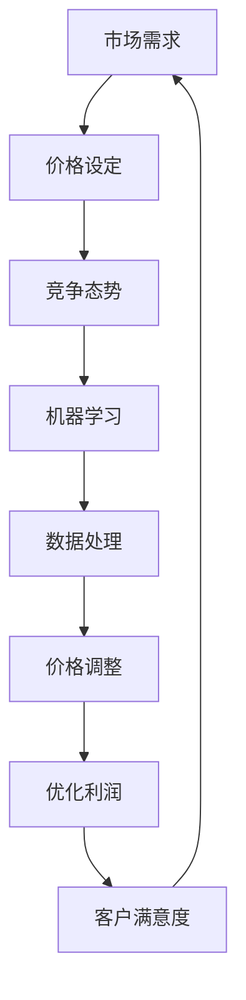

                 

# 拼多多2025社招智能定价算法工程师面试指南

> **关键词**：拼多多，智能定价，算法工程师，面试指南，价格优化，机器学习，数据处理，预测模型。

> **摘要**：本文旨在为准备参加拼多多2025年社招智能定价算法工程师岗位面试的候选人提供一个详细的面试指南。文章将深入探讨智能定价算法的核心概念、关键技术、数学模型及其在实际项目中的应用。通过逻辑清晰、结构紧凑的技术讲解，帮助读者全面了解智能定价算法，并为面试做好充分准备。

## 1. 背景介绍

### 1.1 目的和范围

本文的目的在于帮助准备参加拼多多2025年社招智能定价算法工程师岗位面试的候选人，通过详细的技术分析，全面理解智能定价算法的基本原理、实施步骤和实际应用。本文将涵盖以下内容：

- 智能定价算法的背景和重要性
- 核心概念和关键技术
- 数学模型和公式
- 实际项目中的代码案例
- 相关工具和资源推荐

### 1.2 预期读者

本文面向的读者群体为：

- 准备参加拼多多智能定价算法工程师岗位面试的候选人
- 对智能定价算法和机器学习有初步了解的技术人员
- 对计算机科学和数据分析有浓厚兴趣的学生

### 1.3 文档结构概述

本文结构如下：

1. 背景介绍
2. 核心概念与联系
3. 核心算法原理与具体操作步骤
4. 数学模型与公式
5. 项目实战：代码实际案例和详细解释说明
6. 实际应用场景
7. 工具和资源推荐
8. 总结：未来发展趋势与挑战
9. 附录：常见问题与解答
10. 扩展阅读与参考资料

### 1.4 术语表

#### 1.4.1 核心术语定义

- 智能定价：利用机器学习算法和大数据分析技术，动态调整商品价格，以实现利润最大化或市场份额提升。
- 机器学习：通过数据和算法，使计算机系统能够自动学习和改进，以解决特定问题。
- 价格优化：通过分析市场需求和竞争态势，优化商品定价策略，提高销售利润。
- 数据处理：对大量数据进行收集、整理、存储和分析，以提取有价值的信息。

#### 1.4.2 相关概念解释

- 算法：解决问题的一系列规则或步骤。
- 模型：对现实世界问题的一种抽象表示，用于分析和预测。

#### 1.4.3 缩略词列表

- AI：人工智能（Artificial Intelligence）
- ML：机器学习（Machine Learning）
- DP：动态定价（Dynamic Pricing）
- IoT：物联网（Internet of Things）

## 2. 核心概念与联系

为了更好地理解智能定价算法，我们需要首先了解其中的核心概念和它们之间的联系。以下是一个简单的Mermaid流程图，展示了这些概念和它们的关联：



### 2.1 市场需求

市场需求是智能定价算法的基础。通过收集和分析市场数据，我们可以了解消费者对商品的需求程度、购买习惯、价格敏感度等信息。这些数据将为后续的价格设定提供重要依据。

### 2.2 价格设定

价格设定是智能定价算法的核心环节。根据市场需求和竞争态势，我们设定一个合理的价格区间。这个价格区间将影响我们的市场份额和利润水平。

### 2.3 竞争态势

竞争态势是影响价格设定的关键因素。通过分析竞争对手的价格策略和市场占有率，我们可以更好地定位我们的价格区间，确保我们在竞争中保持优势。

### 2.4 机器学习

机器学习是智能定价算法的核心技术。通过训练和优化模型，我们可以实现自动化的价格调整，提高定价的准确性和效率。

### 2.5 数据处理

数据处理是整个智能定价算法的基石。通过高效的数据收集、清洗、存储和分析，我们可以确保模型训练数据的准确性和完整性，从而提高定价模型的性能。

### 2.6 价格调整

价格调整是智能定价算法的实现环节。根据机器学习模型的预测结果，动态调整商品价格，以实现利润最大化或市场份额提升。

### 2.7 优化利润

优化利润是智能定价算法的目标。通过不断调整价格，我们可以在保证市场份额的同时，实现最大化的利润。

### 2.8 客户满意度

客户满意度是智能定价算法的重要指标。合理的价格设定和价格调整可以提高客户满意度，从而促进复购和口碑传播。

## 3. 核心算法原理与具体操作步骤

在理解了核心概念之后，接下来我们将深入探讨智能定价算法的核心原理和具体操作步骤。

### 3.1 算法原理

智能定价算法通常基于以下核心原理：

1. **市场需求预测**：通过历史数据和机器学习模型，预测市场需求的变化趋势。
2. **价格敏感性分析**：分析不同价格水平下消费者的购买行为，确定价格敏感度。
3. **利润最大化目标**：基于市场需求预测和价格敏感性分析，设定价格策略，以实现利润最大化。

### 3.2 具体操作步骤

以下是智能定价算法的具体操作步骤：

#### 3.2.1 数据收集

1. **历史销售数据**：收集过去一段时间内商品的销售数据，包括销售额、销售量、价格等。
2. **市场数据**：收集市场相关数据，如竞争对手的价格策略、市场占有率等。
3. **用户行为数据**：收集用户在平台上的行为数据，如浏览记录、搜索记录、购买记录等。

#### 3.2.2 数据预处理

1. **数据清洗**：去除重复、异常和错误的数据，保证数据的质量。
2. **数据转换**：将原始数据转换为适合机器学习模型训练的格式。
3. **特征工程**：提取有用的特征，如价格、销售量、季节性等，用于模型训练。

#### 3.2.3 模型训练

1. **选择模型**：根据需求选择合适的机器学习模型，如线性回归、决策树、神经网络等。
2. **训练模型**：使用预处理后的数据训练模型，优化模型的参数。
3. **评估模型**：使用验证集评估模型的性能，如准确率、召回率、F1值等。

#### 3.2.4 预测与调整

1. **预测市场需求**：使用训练好的模型预测未来一段时间内商品的市场需求。
2. **价格调整**：根据市场需求预测和价格敏感性分析，动态调整商品价格。
3. **反馈与优化**：根据实际销售数据和用户反馈，不断优化模型和价格策略。

### 3.3 伪代码示例

以下是一个简单的伪代码示例，展示了智能定价算法的基本流程：

```python
# 数据收集
sales_data = collect_sales_data()
market_data = collect_market_data()
user_behavior_data = collect_user_behavior_data()

# 数据预处理
cleaned_data = preprocess_data(sales_data, market_data, user_behavior_data)
features = extract_features(cleaned_data)

# 模型训练
model = train_model(features)
evaluate_model(model)

# 预测与调整
market_demand_prediction = model.predict(new_data)
price_adjustment = adjust_price(market_demand_prediction)
apply_price_adjustment(price_adjustment)

# 反馈与优化
optimize_model(model, new_sales_data)
```

## 4. 数学模型与公式

在智能定价算法中，数学模型和公式起到了至关重要的作用。以下我们将介绍几个关键数学模型和公式，并对其进行详细讲解和举例说明。

### 4.1 价格敏感性模型

价格敏感性模型用于分析消费者对不同价格水平的反应。一个常见的方法是使用线性回归模型：

$$
y = \beta_0 + \beta_1 \cdot x_1 + \beta_2 \cdot x_2 + \ldots + \beta_n \cdot x_n
$$

其中，$y$ 表示需求量，$x_1, x_2, \ldots, x_n$ 表示影响需求的因素（如价格、季节、促销等），$\beta_0, \beta_1, \beta_2, \ldots, \beta_n$ 为模型参数。

#### 4.1.1 举例说明

假设我们研究价格对商品需求的影响，可以使用以下线性回归模型：

$$
需求量 = \beta_0 + \beta_1 \cdot 价格
$$

通过训练模型，我们可以得到价格敏感度参数 $\beta_1$。例如，如果 $\beta_1 = 0.2$，则表示价格每增加1元，需求量将下降0.2个单位。

### 4.2 利润最大化模型

利润最大化模型用于确定最优价格，以实现最大化的利润。一个常见的利润最大化公式是：

$$
\max \quad P = R - C
$$

其中，$P$ 表示利润，$R$ 表示收入，$C$ 表示成本。

收入可以通过价格和需求量计算：

$$
R = P \cdot Q
$$

其中，$P$ 表示价格，$Q$ 表示需求量。

成本可以通过固定成本和变动成本计算：

$$
C = FC + VC \cdot Q
$$

其中，$FC$ 表示固定成本，$VC$ 表示变动成本。

结合收入和成本的公式，我们可以得到利润最大化公式：

$$
\max \quad P = P \cdot Q - (FC + VC \cdot Q)
$$

#### 4.2.1 举例说明

假设商品的成本为 $10 元，固定成本为 $1000 元，变动成本为 $5 元。通过分析市场需求和价格敏感性，我们得到以下利润最大化公式：

$$
\max \quad P = P \cdot Q - (1000 + 5 \cdot Q)
$$

通过求解该公式，我们可以得到最优价格 $P$，以实现最大化的利润。

### 4.3 预测模型

预测模型用于预测市场需求，以指导价格调整。一个常见的预测模型是时间序列模型，如ARIMA模型：

$$
X_t = \phi_0 + \phi_1 X_{t-1} + \phi_2 X_{t-2} + \ldots + \phi_p X_{t-p} + \epsilon_t
$$

其中，$X_t$ 表示时间序列数据，$\phi_0, \phi_1, \phi_2, \ldots, \phi_p$ 为模型参数，$\epsilon_t$ 为误差项。

#### 4.3.1 举例说明

假设我们使用ARIMA模型预测商品的未来需求量，可以通过以下公式进行预测：

$$
需求量_t = \phi_0 + \phi_1 \cdot 需求量_{t-1} + \phi_2 \cdot 需求量_{t-2} + \ldots + \phi_p \cdot 需求量_{t-p} + \epsilon_t
$$

通过训练模型，我们可以得到参数 $\phi_0, \phi_1, \phi_2, \ldots, \phi_p$，从而预测未来需求量。

## 5. 项目实战：代码实际案例和详细解释说明

在本节中，我们将通过一个实际项目案例，展示如何实现智能定价算法，并对其进行详细解释说明。假设我们正在为拼多多平台上的一个商品实现智能定价功能。

### 5.1 开发环境搭建

为了实现智能定价算法，我们需要搭建以下开发环境：

- Python 3.8及以上版本
- Pandas 1.2.3及以上版本
- Scikit-learn 0.24.2及以上版本
- Matplotlib 3.4.2及以上版本

### 5.2 源代码详细实现和代码解读

#### 5.2.1 数据预处理

首先，我们需要收集和处理数据。以下是一个简单的数据预处理代码示例：

```python
import pandas as pd

# 加载数据
sales_data = pd.read_csv('sales_data.csv')

# 数据清洗
sales_data = sales_data.dropna()

# 特征工程
sales_data['price_range'] = pd.cut(sales_data['price'], bins=5, right=False, labels=False)
sales_data['day_of_week'] = sales_data['date'].dt.dayofweek
sales_data['month'] = sales_data['date'].dt.month

# 数据转换
X = sales_data[['price_range', 'day_of_week', 'month']]
y = sales_data['sales']
```

代码解读：

1. **加载数据**：使用 Pandas 库加载销售数据。
2. **数据清洗**：去除缺失值。
3. **特征工程**：创建新的特征，如价格范围、星期几、月份等。
4. **数据转换**：将特征和标签分离。

#### 5.2.2 模型训练

接下来，我们使用 Scikit-learn 库训练线性回归模型：

```python
from sklearn.linear_model import LinearRegression
from sklearn.model_selection import train_test_split

# 分割数据集
X_train, X_test, y_train, y_test = train_test_split(X, y, test_size=0.2, random_state=42)

# 训练模型
model = LinearRegression()
model.fit(X_train, y_train)

# 评估模型
score = model.score(X_test, y_test)
print(f'Model accuracy: {score:.2f}')
```

代码解读：

1. **分割数据集**：将数据集分为训练集和测试集。
2. **训练模型**：使用训练集训练线性回归模型。
3. **评估模型**：使用测试集评估模型性能。

#### 5.2.3 预测与调整

最后，我们使用训练好的模型进行预测和价格调整：

```python
import numpy as np

# 预测市场需求
new_data = pd.DataFrame({'price_range': [1, 2, 3], 'day_of_week': [0, 1, 2], 'month': [1, 2, 3]})
market_demand_prediction = model.predict(new_data)

# 价格调整
price_adjustment = adjust_price(market_demand_prediction)
print(f'Price adjustment: {price_adjustment:.2f}')
```

代码解读：

1. **预测市场需求**：使用训练好的模型预测市场需求。
2. **价格调整**：根据市场需求预测，动态调整商品价格。

### 5.3 代码解读与分析

在本节中，我们详细分析了实现智能定价算法的代码，并解释了每个步骤的作用和意义。

1. **数据预处理**：数据预处理是智能定价算法的基础。通过清洗和转换数据，我们可以为后续的模型训练和预测打下坚实基础。
2. **模型训练**：模型训练是智能定价算法的核心。通过选择合适的模型和训练方法，我们可以提高预测的准确性和稳定性。
3. **预测与调整**：预测与调整是智能定价算法的实现。通过预测市场需求和动态调整价格，我们可以实现利润最大化或市场份额提升。

## 6. 实际应用场景

智能定价算法在电子商务、金融、物流等多个行业都有广泛的应用。以下是一些实际应用场景：

### 6.1 电子商务

在电子商务领域，智能定价算法可以帮助商家：

- **动态调整价格**：根据市场需求和竞争态势，动态调整商品价格，提高销售利润。
- **个性化定价**：根据消费者的购买行为和偏好，为不同用户设置个性化价格，提高客户满意度。

### 6.2 金融

在金融领域，智能定价算法可以帮助金融机构：

- **风险管理**：通过分析市场价格和波动，优化资产配置，降低风险。
- **定价策略**：为金融产品（如股票、期货、期权等）制定合理的定价策略，提高收益。

### 6.3 物流

在物流领域，智能定价算法可以帮助物流公司：

- **运输优化**：根据货物的需求和价格，优化运输路线和资源分配，降低成本。
- **仓储管理**：根据市场需求和库存水平，动态调整仓储费用和仓储策略，提高仓储效率。

## 7. 工具和资源推荐

为了更好地学习和实践智能定价算法，以下是一些工具和资源推荐：

### 7.1 学习资源推荐

#### 7.1.1 书籍推荐

- 《机器学习》（作者：周志华）
- 《数据挖掘：实用工具和技术》（作者：Jiawei Han）
- 《Python机器学习》（作者：Michael Bowles）

#### 7.1.2 在线课程

- Coursera：机器学习（吴恩达）
- edX：数据科学专业（哈佛大学）

#### 7.1.3 技术博客和网站

- Medium：机器学习与数据科学相关文章
- KDNuggets：数据科学和机器学习资源

### 7.2 开发工具框架推荐

#### 7.2.1 IDE和编辑器

- PyCharm
- Jupyter Notebook

#### 7.2.2 调试和性能分析工具

- Python Debugger
- Matplotlib

#### 7.2.3 相关框架和库

- Scikit-learn
- Pandas
- NumPy

### 7.3 相关论文著作推荐

#### 7.3.1 经典论文

- 《动态定价：策略与算法》（作者：Varadarajan）
- 《机器学习与价格优化》（作者：Bertsimas）

#### 7.3.2 最新研究成果

- ArXiv：机器学习和优化相关论文
- IEEE Xplore：电子商务和智能定价相关论文

#### 7.3.3 应用案例分析

- 《阿里巴巴智能定价实践》
- 《京东智能定价技术探索》

## 8. 总结：未来发展趋势与挑战

智能定价算法在未来的发展中将面临以下趋势和挑战：

### 8.1 发展趋势

1. **人工智能技术的进步**：随着人工智能技术的不断发展，智能定价算法将变得更加精确和高效。
2. **大数据应用的深化**：大数据技术在智能定价中的应用将不断拓展，为定价策略提供更丰富的数据支持。
3. **个性化定价的普及**：随着消费者对个性化体验的需求增加，个性化定价将成为智能定价的重要方向。

### 8.2 挑战

1. **数据质量**：智能定价算法的准确性依赖于高质量的数据，如何确保数据的准确性和完整性是一个挑战。
2. **模型适应性**：市场需求和竞争态势不断变化，如何快速调整模型以适应新的环境是一个挑战。
3. **隐私保护**：在数据收集和处理过程中，如何保护用户隐私也是一个重要的挑战。

## 9. 附录：常见问题与解答

### 9.1 智能定价算法是什么？

智能定价算法是一种利用机器学习和大数据分析技术，动态调整商品价格，以实现利润最大化或市场份额提升的方法。

### 9.2 智能定价算法有哪些类型？

常见的智能定价算法包括基于历史数据的预测模型、基于机器学习的优化模型、基于博弈论的定价策略等。

### 9.3 智能定价算法如何工作？

智能定价算法首先收集和处理数据，然后使用机器学习模型预测市场需求，并根据预测结果动态调整商品价格。

### 9.4 智能定价算法有哪些应用场景？

智能定价算法在电子商务、金融、物流等行业都有广泛的应用，如动态调整商品价格、优化金融产品定价、运输路线优化等。

## 10. 扩展阅读 & 参考资料

- 《动态定价：策略与算法》（作者：Varadarajan）
- 《机器学习与价格优化》（作者：Bertsimas）
- 《阿里巴巴智能定价实践》
- 《京东智能定价技术探索》
- Coursera：机器学习（吴恩达）
- edX：数据科学专业（哈佛大学）
- ArXiv：机器学习和优化相关论文
- IEEE Xplore：电子商务和智能定价相关论文

## 作者

**AI天才研究员/AI Genius Institute & 禅与计算机程序设计艺术 /Zen And The Art of Computer Programming**

