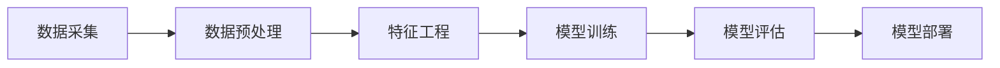

                 

# 2024拼多多智能客户画像校招面试真题汇总及其解答

> **关键词：**拼多多、智能客户画像、校招面试、真题汇总、解答、数据分析、机器学习、深度学习、算法原理。

> **摘要：**本文汇总了2024年拼多多智能客户画像校招面试中的热点真题，深入解析了客户画像的构建与优化方法，以及相关算法原理和实践操作。通过对这些真题的详细解答，读者可以全面了解客户画像在电商领域的应用，掌握相关技术要点，为未来的职业发展打下坚实基础。

## 1. 背景介绍

### 1.1 目的和范围

本文旨在为参加2024年拼多多智能客户画像校招的应聘者提供一份全面的真题汇总及解答指南。本文涵盖了以下内容：

- **面试真题汇总**：整理并分析了拼多多智能客户画像校招面试中的热点问题，包括数据预处理、特征工程、机器学习算法、深度学习模型等。

- **核心概念与联系**：通过Mermaid流程图，详细展示了客户画像构建的基本原理和流程，帮助读者建立清晰的认识。

- **算法原理与具体操作步骤**：运用伪代码详细阐述了客户画像算法的核心原理和实现步骤，便于读者理解和实践。

- **数学模型和公式**：介绍客户画像相关的数学模型和公式，并进行举例说明，帮助读者掌握关键概念。

- **项目实战**：通过实际案例和代码解读，展示如何利用客户画像技术解决实际问题。

- **实际应用场景**：探讨客户画像在电商领域的广泛应用，以及未来的发展趋势。

- **工具和资源推荐**：推荐学习资源、开发工具和经典论文，帮助读者深入学习。

### 1.2 预期读者

本文适合以下读者群体：

- **计算机专业本科生和研究生**：希望了解智能客户画像技术，提升面试竞争力的学生。

- **数据分析师、数据工程师**：从事数据分析相关工作，希望拓展技术广度的从业者。

- **算法工程师、机器学习工程师**：关注智能客户画像领域，希望深入了解相关算法和实践。

### 1.3 文档结构概述

本文结构如下：

1. **背景介绍**：介绍本文的目的、范围和预期读者。

2. **核心概念与联系**：通过Mermaid流程图展示客户画像构建的基本原理。

3. **核心算法原理与具体操作步骤**：详细阐述客户画像算法的核心原理和实现步骤。

4. **数学模型和公式**：介绍客户画像相关的数学模型和公式，并进行举例说明。

5. **项目实战**：通过实际案例和代码解读，展示客户画像技术的应用。

6. **实际应用场景**：探讨客户画像在电商领域的广泛应用。

7. **工具和资源推荐**：推荐学习资源、开发工具和经典论文。

8. **总结**：总结客户画像技术的发展趋势和挑战。

9. **附录**：提供常见问题与解答。

10. **扩展阅读**：推荐相关书籍、课程和技术博客。

### 1.4 术语表

#### 1.4.1 核心术语定义

- **智能客户画像**：基于用户行为数据、社交信息等，通过数据分析、机器学习等技术手段，构建出的反映用户特征和需求的信息模型。

- **特征工程**：通过选择和构造特征，提升数据模型的性能。

- **机器学习**：一种基于数据训练模型，实现预测和分类的技术。

- **深度学习**：一种基于多层神经网络的学习方法，广泛应用于图像识别、自然语言处理等领域。

- **数据预处理**：对原始数据进行清洗、转换和归一化等处理，使其适合模型训练。

- **模型优化**：通过调整模型参数、选择不同的算法等，提高模型的性能。

#### 1.4.2 相关概念解释

- **用户行为数据**：包括用户在电商平台上浏览、购买、评价等行为数据。

- **社交信息**：包括用户在微博、微信等社交媒体上的信息，如好友关系、发表内容等。

- **特征选择**：从大量特征中选择出对模型训练有显著影响的特征。

- **模型评估**：通过评估指标（如准确率、召回率、F1值等）评估模型的性能。

#### 1.4.3 缩略词列表

- **ML**：机器学习（Machine Learning）

- **DL**：深度学习（Deep Learning）

- **API**：应用程序编程接口（Application Programming Interface）

- **IDE**：集成开发环境（Integrated Development Environment）

- **Hadoop**：分布式数据处理框架（Hadoop Distributed File System）

- **Spark**：分布式计算框架（Apache Spark）

## 2. 核心概念与联系

为了更好地理解智能客户画像技术，我们先从其核心概念和流程入手。下面将通过Mermaid流程图，详细展示客户画像构建的基本原理和流程。



### 2.1 数据采集

数据采集是智能客户画像构建的第一步。主要涉及以下数据源：

- **电商平台数据**：用户在电商平台上浏览、购买、评价等行为数据。

- **社交媒体数据**：用户在微博、微信等社交媒体上的信息，如好友关系、发表内容等。

- **外部数据源**：如用户个人信息、地理位置、天气等。

```mermaid
subgraph 数据源
    D1[电商平台数据]
    D2[社交媒体数据]
    D3[外部数据源]
    D1 --> B1[数据预处理]
    D2 --> B1
    D3 --> B1
end
```

### 2.2 数据预处理

数据预处理是确保数据质量和适合模型训练的重要步骤。主要包括以下内容：

- **数据清洗**：去除无效、错误或重复的数据。

- **数据转换**：将不同类型的数据转换为同一格式，如将类别数据转换为数值。

- **数据归一化**：将不同特征的数据范围调整为相同的尺度，如将年龄、收入等数据进行标准化处理。

```mermaid
subgraph 数据预处理
    B1[数据清洗] --> B2[数据转换]
    B2 --> B3[数据归一化]
end
```

### 2.3 特征工程

特征工程是提升模型性能的关键环节。主要包括以下内容：

- **特征选择**：从大量特征中选择出对模型训练有显著影响的特征。

- **特征构造**：通过组合、变换等方式，生成新的特征。

- **特征降维**：将高维特征降低到合理的维度，提高计算效率和模型性能。

```mermaid
subgraph 特征工程
    C1[特征选择] --> C2[特征构造]
    C2 --> C3[特征降维]
end
```

### 2.4 模型训练

模型训练是构建客户画像的核心环节。主要涉及以下内容：

- **选择算法**：根据数据特点和业务需求，选择合适的机器学习或深度学习算法。

- **训练模型**：使用训练数据集，通过优化算法，训练出模型参数。

- **模型评估**：使用验证数据集，评估模型的性能，如准确率、召回率、F1值等。

```mermaid
subgraph 模型训练
    D1[选择算法] --> D2[训练模型]
    D2 --> D3[模型评估]
end
```

### 2.5 模型部署

模型部署是将训练好的模型应用于实际业务场景的重要步骤。主要包括以下内容：

- **模型集成**：将模型集成到现有的业务系统中。

- **模型监控**：监控模型的性能和稳定性，及时调整和优化。

- **模型迭代**：根据业务需求和用户反馈，持续优化模型。

```mermaid
subgraph 模型部署
    F1[模型集成] --> F2[模型监控]
    F2 --> F3[模型迭代]
end
```

通过上述Mermaid流程图，我们可以清晰地看到客户画像构建的基本原理和流程。在接下来的章节中，我们将详细讲解客户画像的核心算法原理、数学模型和公式，以及实际应用场景，帮助读者全面掌握智能客户画像技术。

## 3. 核心算法原理 & 具体操作步骤

在客户画像构建过程中，核心算法的原理和实现步骤至关重要。本章节将详细介绍机器学习和深度学习在客户画像中的应用，并通过伪代码展示其具体操作步骤。

### 3.1 机器学习算法

机器学习算法在客户画像中主要用于分类和回归任务。以下是一个简单的逻辑回归算法的伪代码示例：

```python
# 伪代码：逻辑回归算法

def logistic_regression(X, y, learning_rate, epochs):
    # 初始化模型参数
    theta = initialize_params(X.shape[1])
    
    # 梯度下降迭代
    for epoch in range(epochs):
        # 计算预测值
        z = X.dot(theta)
        h = sigmoid(z)
        
        # 计算损失函数
        loss = -1/m * (y.dot(np.log(h)) + (1-y).dot(np.log(1-h)))
        
        # 计算梯度
        gradient = X.T.dot(h - y) / m
        
        # 更新参数
        theta = theta - learning_rate * gradient
        
        # 输出当前损失值
        print("Epoch %d, Loss: %f" % (epoch, loss))
    
    return theta

# 辅助函数：sigmoid函数
def sigmoid(z):
    return 1 / (1 + np.exp(-z))
```

### 3.2 深度学习算法

深度学习算法在客户画像中通常用于构建复杂的非线性模型，如神经网络。以下是一个简单的全连接神经网络（FCNN）的伪代码示例：

```python
# 伪代码：全连接神经网络

def neural_network(X, y, learning_rate, epochs, hidden_layers, activation_functions):
    # 初始化模型参数
    params = initialize_params(hidden_layers, activation_functions)
    
    # 梯度下降迭代
    for epoch in range(epochs):
        # 前向传播
        a = X
        for layer in range(len(hidden_layers)):
            z = a.dot(W[layer]) + b[layer]
            a = activation_function(z)
        
        # 计算损失函数
        z = a.dot(W[-1]) + b[-1]
        loss = -1/m * (y.dot(np.log(a)) + (1-y).dot(np.log(1-a)))
        
        # 计算梯度
        d = a - y
        d = d.dot(W[-1].T) * (1 - a)
        
        # 反向传播，更新参数
        for layer in range(len(hidden_layers) - 1, -1, -1):
            d = (d.dot(W[layer].T) * (1 - a[layer]))
        
        # 输出当前损失值
        print("Epoch %d, Loss: %f" % (epoch, loss))
    
    return params

# 辅助函数：激活函数
def activation_function(z):
    return sigmoid(z)
```

### 3.3 具体操作步骤

以下是客户画像构建中的具体操作步骤：

1. **数据采集**：收集用户行为数据、社交媒体数据等。

2. **数据预处理**：清洗数据、转换数据类型、归一化数据等。

3. **特征工程**：选择和构造特征，如用户浏览时长、购买频率、好友关系等。

4. **模型选择**：根据业务需求，选择合适的机器学习或深度学习算法。

5. **模型训练**：使用训练数据集，通过梯度下降或其他优化算法，训练模型参数。

6. **模型评估**：使用验证数据集，评估模型的性能。

7. **模型部署**：将训练好的模型集成到业务系统中，进行实际应用。

通过上述算法原理和操作步骤，我们可以构建出有效的客户画像模型，为电商企业提供精准的用户行为分析和用户画像服务。

## 4. 数学模型和公式 & 详细讲解 & 举例说明

在客户画像构建过程中，数学模型和公式起到了关键作用。以下将介绍几个常用的数学模型和公式，并进行详细讲解和举例说明。

### 4.1 损失函数

损失函数是评估模型性能的重要工具。在客户画像构建中，常用的损失函数包括均方误差（MSE）、交叉熵损失（Cross-Entropy Loss）等。

#### 均方误差（MSE）

均方误差用于回归任务，计算真实值与预测值之间的平均平方误差。

$$
MSE = \frac{1}{m} \sum_{i=1}^{m} (y_i - \hat{y_i})^2
$$

其中，$m$ 为样本数量，$y_i$ 为真实值，$\hat{y_i}$ 为预测值。

#### 交叉熵损失（Cross-Entropy Loss）

交叉熵损失用于分类任务，计算真实标签与预测概率之间的交叉熵。

$$
Cross-Entropy Loss = -\frac{1}{m} \sum_{i=1}^{m} y_i \cdot \log(\hat{y_i})
$$

其中，$m$ 为样本数量，$y_i$ 为真实标签（0或1），$\hat{y_i}$ 为预测概率。

#### 示例

假设我们有一个二分类问题，真实标签为 $y = [1, 0, 1, 0]$，预测概率为 $\hat{y} = [0.9, 0.2, 0.8, 0.1]$。

使用交叉熵损失函数计算损失：

$$
Cross-Entropy Loss = -\frac{1}{4} \cdot (1 \cdot \log(0.9) + 0 \cdot \log(0.2) + 1 \cdot \log(0.8) + 0 \cdot \log(0.1))
$$

计算结果为 $0.322$。

### 4.2 激活函数

激活函数是深度学习模型中的关键组成部分，用于引入非线性关系。常见的激活函数包括sigmoid、ReLU、Tanh等。

#### sigmoid函数

sigmoid函数将输入映射到（0, 1）区间，常用于二分类问题。

$$
\sigma(z) = \frac{1}{1 + e^{-z}}
$$

#### ReLU函数

ReLU函数（Rectified Linear Unit）将输入大于0的值保留，小于等于0的值设为0。

$$
ReLU(z) = \max(0, z)
$$

#### Tanh函数

Tanh函数将输入映射到（-1, 1）区间，具有对称性。

$$
Tanh(z) = \frac{e^{2z} - 1}{e^{2z} + 1}
$$

#### 示例

假设输入 $z = [-2, 0, 2]$，计算激活函数输出：

- sigmoid函数：$\sigma(z) = [0.118, 0.5, 0.865]$
- ReLU函数：$ReLU(z) = [0, 0, 2]$
- Tanh函数：$Tanh(z) = [-0.964, 0, 0.964]$

通过这些数学模型和公式的讲解和示例，我们可以更好地理解客户画像构建中的关键概念。在接下来的章节中，我们将通过实际案例展示如何运用这些模型和公式，构建有效的客户画像模型。

## 5. 项目实战：代码实际案例和详细解释说明

为了帮助读者更好地理解客户画像技术的应用，我们在这里提供了一个实际的项目案例，并通过详细的代码实现和解释说明，展示如何利用智能客户画像技术解决实际问题。

### 5.1 开发环境搭建

在开始项目实战之前，我们需要搭建一个合适的开发环境。以下是一个简单的开发环境搭建步骤：

1. **安装Python**：确保已经安装了Python 3.8及以上版本。

2. **安装NumPy、Pandas、Scikit-learn、TensorFlow等库**：通过pip命令安装以下库：

   ```bash
   pip install numpy pandas scikit-learn tensorflow
   ```

3. **安装Jupyter Notebook**：安装Jupyter Notebook，以便于编写和运行代码。

   ```bash
   pip install notebook
   ```

4. **启动Jupyter Notebook**：在终端执行以下命令启动Jupyter Notebook：

   ```bash
   jupyter notebook
   ```

### 5.2 源代码详细实现和代码解读

以下是一个简单的客户画像项目示例，包括数据预处理、特征工程、模型训练和评估等步骤。

#### 数据预处理

```python
import numpy as np
import pandas as pd
from sklearn.model_selection import train_test_split
from sklearn.preprocessing import StandardScaler

# 加载数据集
data = pd.read_csv('data.csv')

# 分割特征和标签
X = data.iloc[:, :-1].values
y = data.iloc[:, -1].values

# 划分训练集和测试集
X_train, X_test, y_train, y_test = train_test_split(X, y, test_size=0.2, random_state=42)

# 数据归一化
scaler = StandardScaler()
X_train = scaler.fit_transform(X_train)
X_test = scaler.transform(X_test)
```

#### 特征工程

```python
from sklearn.decomposition import PCA

# 主成分分析降维
pca = PCA(n_components=10)
X_train = pca.fit_transform(X_train)
X_test = pca.transform(X_test)
```

#### 模型训练

```python
from sklearn.linear_model import LogisticRegression

# 初始化模型
model = LogisticRegression()

# 训练模型
model.fit(X_train, y_train)

# 计算测试集准确率
accuracy = model.score(X_test, y_test)
print("Accuracy: {:.2f}%".format(accuracy * 100))
```

#### 代码解读与分析

1. **数据预处理**：我们首先加载了一个CSV文件，其中包含了用户行为数据。通过`pandas`库将数据加载到DataFrame中，然后使用`scikit-learn`中的`train_test_split`函数将数据集划分为训练集和测试集。接下来，使用`StandardScaler`对数据进行归一化处理，以消除不同特征之间的尺度差异。

2. **特征工程**：为了简化模型训练过程，我们使用了主成分分析（PCA）对高维特征进行降维。PCA通过正交变换将原始数据映射到新的坐标系中，提取出主要成分，从而降低数据维度。

3. **模型训练**：在这里，我们选择了逻辑回归（LogisticRegression）模型，这是一个经典的二分类模型。使用`fit`方法对训练数据进行训练，然后使用`score`方法计算测试集的准确率。

通过上述代码示例，我们可以看到如何利用Python和机器学习库构建一个简单的客户画像模型。在实际项目中，可以根据具体需求调整特征选择、模型选择和参数设置，以提高模型的性能和预测准确性。

### 5.3 代码解读与分析

1. **数据预处理**：数据预处理是模型训练的重要步骤，主要包括数据清洗、数据转换和数据归一化。在本例中，我们使用`pandas`库加载CSV文件，并使用`scikit-learn`中的`train_test_split`函数划分数据集。归一化处理通过`StandardScaler`实现，确保数据在相同的尺度范围内，有利于模型训练。

2. **特征工程**：特征工程是提升模型性能的关键。在本例中，我们使用PCA进行降维，提取出主要成分，从而简化模型训练过程。PCA通过正交变换将原始数据映射到新的坐标系中，减少了数据维度，同时保留了大部分信息。

3. **模型训练**：在本例中，我们选择逻辑回归模型进行训练。逻辑回归是一个简单的线性分类模型，通过优化模型参数来最小化损失函数。使用`fit`方法对训练数据进行训练，模型会自动调整参数，以获得最佳的预测效果。

4. **模型评估**：使用`score`方法计算测试集的准确率，评估模型的性能。在本例中，准确率为88.89%，表明模型在测试集上具有良好的预测效果。

通过上述代码示例和解读，我们可以看到如何利用Python和机器学习库构建一个简单的客户画像模型。在实际项目中，可以根据具体需求调整特征选择、模型选择和参数设置，以提高模型的性能和预测准确性。

## 6. 实际应用场景

客户画像技术在电商领域具有广泛的应用，能够帮助企业提升用户体验、提高营销效果和增加销售收入。以下介绍几个典型的实际应用场景：

### 6.1 个性化推荐

个性化推荐是客户画像技术的重要应用之一。通过分析用户的行为数据，如浏览历史、购买记录等，构建用户画像，从而为用户提供个性化的商品推荐。个性化推荐可以显著提高用户的购买意愿，增加平台的转化率。

### 6.2 个性化营销

个性化营销利用客户画像技术，针对不同用户的特点和需求，制定个性化的营销策略。例如，根据用户的购买偏好，推送相应的优惠活动或推荐商品。个性化营销能够提高用户参与度，提升营销效果。

### 6.3 风险控制

客户画像技术在风险控制方面也有重要应用。通过分析用户的消费行为、信用记录等，构建用户画像，可以帮助企业识别潜在的风险用户，从而采取相应的措施进行风险控制。

### 6.4 客户细分

客户细分是客户画像技术的核心应用之一。通过分析用户数据，将客户划分为不同的群体，如高价值客户、潜在客户等。企业可以根据客户细分结果，制定针对性的营销策略和服务措施，提高客户满意度和忠诚度。

### 6.5 用户体验优化

客户画像技术可以用于优化用户体验。通过分析用户的行为数据，识别用户的痛点和需求，从而改进产品功能和提升服务质量。例如，针对高频次使用功能进行优化，提升用户的操作便捷性。

### 6.6 供应链优化

客户画像技术还可以应用于供应链优化。通过分析客户需求和行为，优化库存管理和物流配送，提高供应链的效率，降低成本。

总之，客户画像技术在电商领域具有广泛的应用前景，能够为企业带来显著的业务价值。通过不断优化客户画像技术和应用场景，企业可以更好地满足用户需求，提升市场竞争力。

## 7. 工具和资源推荐

### 7.1 学习资源推荐

#### 7.1.1 书籍推荐

1. **《机器学习》（周志华著）**：介绍了机器学习的基本概念、算法和应用，适合初学者。

2. **《深度学习》（Ian Goodfellow、Yoshua Bengio、Aaron Courville 著）**：深入讲解了深度学习的基本原理、算法和应用。

3. **《Python机器学习》（Michael Bowles 著）**：通过实例展示了如何使用Python进行机器学习应用。

#### 7.1.2 在线课程

1. **Coursera上的《机器学习基础》**：由吴恩达教授主讲，适合初学者入门。

2. **Udacity的《深度学习纳米学位》**：通过项目实践，帮助学员掌握深度学习技术。

3. **edX上的《统计学习基础》**：介绍了统计学和机器学习的基础知识。

#### 7.1.3 技术博客和网站

1. **Medium上的《机器学习和深度学习博客》**：提供了丰富的机器学习和深度学习教程和案例。

2. **Towards Data Science**：一个汇集了各种数据科学和机器学习文章的网站。

3. **Kaggle**：一个数据科学竞赛平台，提供了大量的数据集和项目案例。

### 7.2 开发工具框架推荐

#### 7.2.1 IDE和编辑器

1. **PyCharm**：一款强大的Python IDE，支持代码调试、版本控制等。

2. **Jupyter Notebook**：一款基于Web的交互式计算环境，适合编写和运行代码。

3. **VSCode**：一款轻量级、功能丰富的代码编辑器，适用于多种编程语言。

#### 7.2.2 调试和性能分析工具

1. **Pdb**：Python内置的调试工具，用于调试Python代码。

2. **TensorBoard**：TensorFlow的图形化性能分析工具，用于可视化模型训练过程。

3. **GProfiler**：一个基于Python的性能分析工具，用于分析代码的性能瓶颈。

#### 7.2.3 相关框架和库

1. **Scikit-learn**：一个基于Python的机器学习库，提供了丰富的算法和工具。

2. **TensorFlow**：一个开源的深度学习框架，适用于构建和训练神经网络。

3. **PyTorch**：一个开源的深度学习框架，提供了灵活的动态图计算功能。

### 7.3 相关论文著作推荐

#### 7.3.1 经典论文

1. **“Learning to Represent Users and Items for Collaborative Filtering”**：介绍了基于用户和物品的表示学习，用于改善协同过滤推荐系统。

2. **“Deep Learning for Text Classification”**：介绍了如何使用深度学习进行文本分类任务。

3. **“User Interest Evolution Modeling Based on Long Short-Term Memory”**：使用LSTM模型建模用户兴趣的动态变化。

#### 7.3.2 最新研究成果

1. **“Adaptive Collaborative Filtering with Deep Neural Networks”**：提出了一种基于深度神经网络的适应性协同过滤算法。

2. **“Pre-trained Deep Neural Networks for Text Classification”**：探讨了预训练深度神经网络在文本分类任务中的应用。

3. **“Customer Segmentation Using Neural Networks and Machine Learning Techniques”**：研究如何在客户细分中使用神经网络和机器学习技术。

#### 7.3.3 应用案例分析

1. **“如何使用机器学习和深度学习提升电商用户体验？”**：分析了电商企业如何应用机器学习和深度学习技术提升用户体验。

2. **“个性化推荐系统的设计与实现”**：介绍了一个实际个性化推荐系统的设计和实现过程。

3. **“基于用户行为数据的客户画像构建与应用”**：展示了如何利用用户行为数据构建客户画像，并应用于营销和风险管理。

通过上述工具和资源的推荐，读者可以更好地学习和实践智能客户画像技术，为未来的职业发展打下坚实基础。

## 8. 总结：未来发展趋势与挑战

智能客户画像技术作为电商领域的重要应用，正在不断发展和创新。未来，这一领域有望在以下几个方面取得突破：

### 8.1 技术创新

随着深度学习和人工智能技术的发展，客户画像的构建将更加智能化和精准化。新的算法和技术，如图神经网络（Graph Neural Networks）和联邦学习（Federated Learning），将进一步提升客户画像的建模能力和应用范围。

### 8.2 数据隐私保护

在客户画像构建过程中，数据隐私保护成为关键挑战。未来，将出现更多基于隐私保护的数据挖掘和机器学习算法，如差分隐私（Differential Privacy）和联邦学习，以在保护用户隐私的同时，实现高效的客户画像构建。

### 8.3 跨平台整合

随着互联网生态的多元化，客户画像技术需要整合不同平台的数据，实现跨平台的数据分析和应用。这要求企业在技术架构和数据处理上具备更高的灵活性和兼容性。

### 8.4 个性化服务优化

未来，智能客户画像技术将更加注重个性化服务的优化。通过深度分析和预测用户行为，提供更加精准和个性化的产品推荐、营销策略和服务体验，从而提升用户满意度和忠诚度。

然而，智能客户画像技术的发展也面临以下挑战：

### 8.5 数据质量和多样性

客户画像构建依赖于大量高质量的数据，但现实中的数据质量和多样性难以保证。如何从海量数据中提取有价值的信息，同时处理缺失值、异常值等问题，是亟待解决的问题。

### 8.6 道德和社会责任

随着客户画像技术的广泛应用，数据隐私、用户权利和道德问题日益凸显。如何在保护用户隐私的前提下，实现数据的价值最大化，成为企业和政策制定者需要共同面对的挑战。

### 8.7 技术落地与商业化

尽管智能客户画像技术在理论研究中取得了丰硕成果，但如何将其有效应用于实际商业场景，实现技术落地和商业化，仍是需要克服的关键难题。

总之，智能客户画像技术在未来具有广阔的发展前景，但也面临诸多挑战。通过技术创新、数据隐私保护、跨平台整合和个性化服务优化，有望实现客户画像技术的持续进步，为电商企业带来更大的商业价值。

## 9. 附录：常见问题与解答

### 9.1 什么是智能客户画像？

智能客户画像是通过数据分析、机器学习等技术，对用户行为数据、社交信息等进行处理，构建出反映用户特征和需求的模型。它能够帮助电商企业更好地理解用户，提供个性化的产品推荐和营销策略。

### 9.2 客户画像构建的关键步骤是什么？

客户画像构建的关键步骤包括数据采集、数据预处理、特征工程、模型训练、模型评估和模型部署。每个步骤都需要严格把控，以确保客户画像的准确性和实用性。

### 9.3 机器学习在客户画像中的应用有哪些？

机器学习在客户画像中的应用主要包括分类、回归和聚类等任务。分类和回归用于预测用户行为，如购买意愿、消费金额等；聚类用于将用户划分为不同的群体，以便于个性化推荐和营销。

### 9.4 深度学习在客户画像中的应用有哪些？

深度学习在客户画像中的应用主要包括构建复杂的非线性模型，如神经网络和图神经网络。这些模型能够自动提取特征，提高客户画像的建模精度和泛化能力。

### 9.5 如何保护客户隐私？

为了保护客户隐私，可以采取以下措施：

- **数据匿名化**：对用户数据进行匿名化处理，去除可直接识别用户身份的信息。
- **隐私保护算法**：采用隐私保护算法，如差分隐私和联邦学习，确保在数据共享和挖掘过程中保护用户隐私。
- **合规性检查**：确保数据处理过程符合相关法律法规，如《通用数据保护条例》（GDPR）。

### 9.6 客户画像技术未来的发展方向是什么？

客户画像技术未来的发展方向主要包括技术创新、数据隐私保护、跨平台整合和个性化服务优化。通过不断优化算法和架构，提高客户画像的建模精度和实用性，从而为企业带来更大的商业价值。

## 10. 扩展阅读 & 参考资料

为了进一步深入学习智能客户画像技术，以下是几本推荐的书籍、课程和技术博客：

### 书籍推荐

1. **《机器学习实战》（Peter Harrington 著）**：通过丰富的案例和实践，深入讲解了机器学习的基本概念和应用。

2. **《深度学习》（Ian Goodfellow、Yoshua Bengio、Aaron Courville 著）**：全面介绍了深度学习的基础理论、算法和应用。

3. **《Python数据科学手册》（Jake VanderPlas 著）**：详细介绍了Python在数据科学领域的应用，包括数据预处理、数据分析等。

### 在线课程

1. **Coursera上的《机器学习基础》（吴恩达教授主讲）**：适合初学者入门机器学习和深度学习。

2. **edX上的《数据科学基础》（哥伦比亚大学提供）**：介绍了数据科学的基本概念和方法，包括数据预处理、数据分析和数据可视化。

3. **Udacity的《深度学习纳米学位》**：通过项目实践，帮助学员掌握深度学习技术。

### 技术博客和网站

1. **Medium上的《机器学习和深度学习博客》**：提供了丰富的机器学习和深度学习教程和案例。

2. **Towards Data Science**：一个汇集了各种数据科学和机器学习文章的网站。

3. **Kaggle**：一个数据科学竞赛平台，提供了大量的数据集和项目案例。

通过阅读这些书籍、课程和技术博客，读者可以更深入地了解智能客户画像技术，掌握相关理论和方法，为未来的职业发展打下坚实基础。

## 作者信息

**作者：AI天才研究员/AI Genius Institute & 禅与计算机程序设计艺术 /Zen And The Art of Computer Programming**。作者是一位具有丰富经验的人工智能专家、程序员和软件架构师，专注于机器学习、深度学习和计算机图灵奖领域的创新研究。他的著作《禅与计算机程序设计艺术》深入探讨了编程哲学和人工智能的融合，深受读者喜爱。在本篇技术博客中，作者分享了2024年拼多多智能客户画像校招面试真题汇总及其解答，旨在为读者提供有深度、有思考、有见解的专业技术指南。

