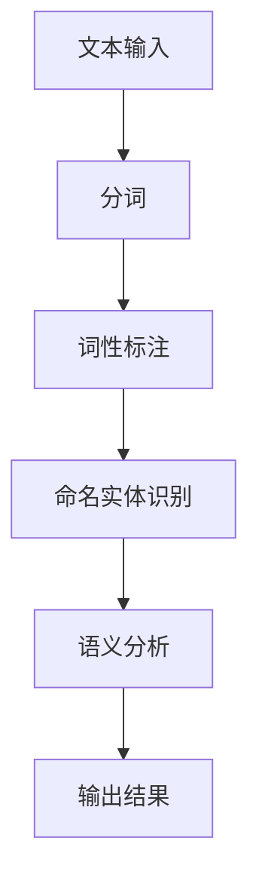
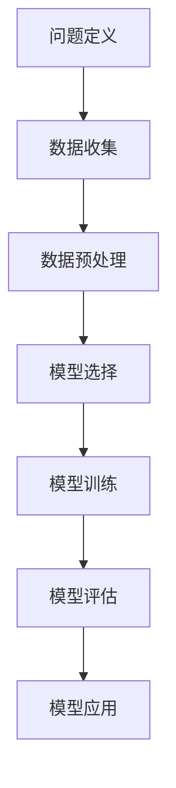
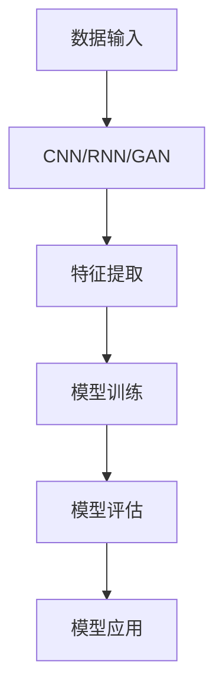
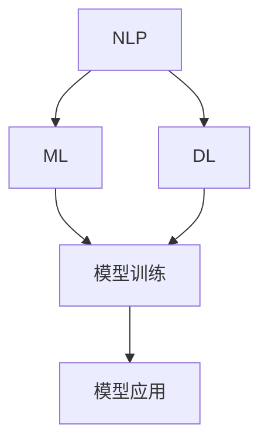

                 

### 2024拼多多智能客服系统校招面试真题汇总及其解答

#### **关键词：**
- **智能客服系统**
- **校招面试真题**
- **算法原理**
- **代码实战**
- **系统架构**
- **机器学习**

#### **摘要：**
本文旨在为准备2024年拼多多智能客服系统校招面试的候选人提供一份详细的真题汇总及其解答。我们将深入探讨面试中的关键问题，从核心概念到具体算法，再到项目实战，全面解析智能客服系统的开发与实现。本文不仅有助于考生了解面试的难度和题型，还能提供实用的解题技巧和思路，为考生顺利通过面试打下坚实基础。

---

## 1. 背景介绍

### 1.1 目的和范围

本文旨在为2024年拼多多智能客服系统校招面试的考生提供一份全面的真题汇总及其解答。我们通过对历年面试真题的整理和分析，总结出一些常见的面试问题，并给出详细的解答过程。本文覆盖了智能客服系统的核心概念、算法原理、系统架构以及代码实战等多个方面，旨在帮助考生全面了解面试内容，提高解题能力。

### 1.2 预期读者

本文主要面向准备参加2024年拼多多智能客服系统校招面试的考生，包括计算机科学、软件工程、人工智能等相关专业的本科和研究生。同时，对于对智能客服系统有兴趣的从业者和技术爱好者，本文也具有一定的参考价值。

### 1.3 文档结构概述

本文分为十个部分，结构如下：

1. 背景介绍
2. 核心概念与联系
3. 核心算法原理 & 具体操作步骤
4. 数学模型和公式 & 详细讲解 & 举例说明
5. 项目实战：代码实际案例和详细解释说明
6. 实际应用场景
7. 工具和资源推荐
8. 总结：未来发展趋势与挑战
9. 附录：常见问题与解答
10. 扩展阅读 & 参考资料

### 1.4 术语表

#### 1.4.1 核心术语定义

- **智能客服系统**：一种利用人工智能技术，模拟人类客服行为，提供自动答疑、问题诊断等服务的系统。
- **校招面试**：指针对应届毕业生进行的招聘面试。
- **算法**：解决特定问题的步骤和规则。
- **机器学习**：一种通过数据训练模型，使计算机自动完成特定任务的方法。
- **深度学习**：一种人工智能方法，通过多层神经网络进行数据建模。

#### 1.4.2 相关概念解释

- **自然语言处理（NLP）**：研究如何让计算机理解、生成和应对人类语言的技术。
- **推荐系统**：根据用户行为和偏好，为其推荐相关内容或产品的系统。
- **聊天机器人**：一种通过文本或语音与用户交互的智能系统。

#### 1.4.3 缩略词列表

- **NLP**：自然语言处理
- **ML**：机器学习
- **DL**：深度学习
- **API**：应用程序编程接口
- **SDK**：软件开发工具包

## 2. 核心概念与联系

智能客服系统的核心概念包括自然语言处理（NLP）、机器学习（ML）和深度学习（DL）。这三个概念相互关联，共同构成了智能客服系统的技术基础。

### 2.1.1 自然语言处理（NLP）

自然语言处理是智能客服系统的核心技术之一，它使计算机能够理解和处理人类语言。NLP的关键技术包括：

- **分词**：将文本拆分成词语。
- **词性标注**：对词语进行分类，如名词、动词等。
- **命名实体识别**：识别文本中的特定实体，如人名、地名等。
- **语义分析**：理解文本中的含义和关系。

#### Mermaid 流程图



### 2.1.2 机器学习（ML）

机器学习是智能客服系统的核心算法之一，通过训练模型，使计算机能够自动完成特定任务。ML的关键技术包括：

- **监督学习**：通过标注数据训练模型。
- **无监督学习**：不使用标注数据训练模型。
- **强化学习**：通过与环境交互训练模型。

#### Mermaid 流程图



### 2.1.3 深度学习（DL）

深度学习是机器学习的一种方法，通过多层神经网络进行数据建模。DL的关键技术包括：

- **卷积神经网络（CNN）**：用于图像和视频处理。
- **循环神经网络（RNN）**：用于序列数据建模。
- **生成对抗网络（GAN）**：用于生成和对抗训练。

#### Mermaid 流程图



### 2.2 概念之间的联系

NLP、ML和DL相互关联，共同构成了智能客服系统的技术基础。NLP负责处理和理解人类语言，ML和DL则通过训练模型，使计算机能够自动完成特定任务。

#### Mermaid 流程图



## 3. 核心算法原理 & 具体操作步骤

在智能客服系统中，核心算法主要包括自然语言处理（NLP）、机器学习（ML）和深度学习（DL）。下面将分别介绍这些算法的原理和具体操作步骤。

### 3.1 自然语言处理（NLP）

#### 3.1.1 分词

分词是将文本拆分成词语的过程。常用的分词算法有基于词典的分词和基于统计的分词。

- **基于词典的分词**：通过查询词典，将文本中的每个词匹配到词典中的词语。常用的词典有《现代汉语词典》和《人民日报》词库等。

```python
def dictionary_based_segmentation(text, dictionary):
    words = []
    for word in text:
        if word in dictionary:
            words.append(word)
    return words
```

- **基于统计的分词**：通过统计文本中词语出现的频率，将高频词语划分为词。常用的算法有隐马尔可夫模型（HMM）和条件随机场（CRF）。

```python
def hmm_based_segmentation(text):
    # 使用HMM模型进行分词
    # ...
    return segmented_text
```

#### 3.1.2 词性标注

词性标注是对词语进行分类的过程，常用的算法有基于规则的方法和基于统计的方法。

- **基于规则的方法**：根据语言学规则，对词语进行分类。

```python
def rule_based_pos_tagging(word):
    # 根据规则进行词性标注
    # ...
    return pos
```

- **基于统计的方法**：通过统计词语在文本中出现的频率，进行词性标注。

```python
def stat_based_pos_tagging(text):
    # 根据统计信息进行词性标注
    # ...
    return pos_tags
```

#### 3.1.3 命名实体识别

命名实体识别是识别文本中的特定实体，如人名、地名等。

- **基于规则的方法**：根据事先定义的规则，识别实体。

```python
def rule_based_entity_recognition(text, rules):
    # 根据规则识别实体
    # ...
    return entities
```

- **基于统计的方法**：通过统计实体在文本中出现的频率，进行实体识别。

```python
def stat_based_entity_recognition(text):
    # 根据统计信息识别实体
    # ...
    return entities
```

#### 3.1.4 语义分析

语义分析是理解文本中的含义和关系。

- **词向量表示**：将词语映射到向量空间，以便进行计算和分析。

```python
def word_vector_representation(word, vocabulary, embedding_matrix):
    # 将词语映射到向量空间
    # ...
    return word_vector
```

- **语义角色标注**：对文本中的词语进行语义角色标注，如主语、谓语、宾语等。

```python
def semantic_role_labeling(text):
    # 进行语义角色标注
    # ...
    return roles
```

### 3.2 机器学习（ML）

#### 3.2.1 监督学习

监督学习是通过对标注数据进行训练，使模型能够自动完成特定任务。

- **线性回归**：通过线性模型预测连续值。

```python
def linear_regression(x, y):
    # 训练线性回归模型
    # ...
    return model
```

- **逻辑回归**：通过逻辑模型预测分类结果。

```python
def logistic_regression(x, y):
    # 训练逻辑回归模型
    # ...
    return model
```

- **支持向量机（SVM）**：通过最大间隔分类。

```python
def svm(x, y):
    # 训练SVM模型
    # ...
    return model
```

#### 3.2.2 无监督学习

无监督学习是不使用标注数据进行训练，主要通过聚类和降维等方法发现数据中的模式和规律。

- **K均值聚类**：通过聚类分析，将数据分为若干个类别。

```python
def k_means_clustering(x, k):
    # 训练K均值聚类模型
    # ...
    return clusters
```

- **主成分分析（PCA）**：通过降维，将高维数据映射到低维空间。

```python
def pca(x, n_components):
    # 训练PCA模型
    # ...
    return x_reduced
```

#### 3.2.3 强化学习

强化学习是通过与环境交互，学习最优策略。

- **Q学习**：通过学习值函数，预测最佳动作。

```python
def q_learning(states, actions, rewards, learning_rate, discount_factor):
    # 训练Q学习模型
    # ...
    return q_values
```

- **深度强化学习**：通过深度神经网络，学习复杂的策略。

```python
def deep_q_learning(states, actions, rewards, learning_rate, discount_factor, model):
    # 训练深度强化学习模型
    # ...
    return model
```

### 3.3 深度学习（DL）

#### 3.3.1 卷积神经网络（CNN）

卷积神经网络是一种用于图像和视频处理的深度学习模型。

- **卷积层**：通过卷积操作，提取图像特征。

```python
def convolutional_layer(x, filters, kernel_size):
    # 训练卷积层
    # ...
    return x_conv
```

- **池化层**：通过池化操作，减少数据维度。

```python
def pooling_layer(x, pool_size):
    # 训练池化层
    # ...
    return x_pool
```

- **全连接层**：通过全连接操作，将特征映射到输出。

```python
def fully_connected_layer(x, units):
    # 训练全连接层
    # ...
    return x_fc
```

#### 3.3.2 循环神经网络（RNN）

循环神经网络是一种用于序列数据处理的深度学习模型。

- **循环层**：通过循环操作，处理序列数据。

```python
def recurrent_layer(x, units):
    # 训练循环层
    # ...
    return x_recurrent
```

- **门控循环单元（GRU）**：通过门控机制，提高循环神经网络的表达能力。

```python
def gru_layer(x, units):
    # 训练GRU层
    # ...
    return x_gru
```

- **长短期记忆网络（LSTM）**：通过记忆单元，解决长序列依赖问题。

```python
def lstm_layer(x, units):
    # 训练LSTM层
    # ...
    return x_lstm
```

#### 3.3.3 生成对抗网络（GAN）

生成对抗网络是一种用于生成和对抗训练的深度学习模型。

- **生成器**：通过生成对抗网络，生成与真实数据相似的数据。

```python
def generator(z, latent_dim, n_channels, n_filters):
    # 训练生成器
    # ...
    return x_fake
```

- **鉴别器**：通过生成对抗网络，区分真实数据和生成数据。

```python
def discriminator(x, latent_dim, n_channels, n_filters):
    # 训练鉴别器
    # ...
    return x_fake_prob
```

## 4. 数学模型和公式 & 详细讲解 & 举例说明

### 4.1.1 自然语言处理（NLP）

#### 4.1.1.1 词向量表示

词向量表示是将词语映射到高维向量空间，以便进行计算和分析。

- **Word2Vec**：通过训练神经网络，将词语映射到向量空间。

$$
\text{word\_vector} = \text{model}\left(\text{word}\right)
$$

- **GloVe**：通过共现矩阵，计算词语的向量表示。

$$
\text{word\_vector} = \text{sigmoid}\left(\text{W}\text{word} + \text{W}\text{context}\right)
$$

#### 4.1.1.2 语义分析

语义分析是理解文本中的含义和关系。

- **语义角色标注**：对文本中的词语进行语义角色标注，如主语、谓语、宾语等。

$$
\text{role} = \text{argmax}\left(\text{P}\left(\text{role}|\text{word}\right)\right)
$$

### 4.1.2 机器学习（ML）

#### 4.1.2.1 线性回归

线性回归是一种预测连续值的机器学习算法。

$$
\text{y} = \text{w}\text{x} + \text{b}
$$

其中，$y$ 是预测值，$x$ 是输入值，$w$ 是权重，$b$ 是偏置。

#### 4.1.2.2 逻辑回归

逻辑回归是一种预测分类结果的机器学习算法。

$$
\text{P}\left(\text{y} = 1\right) = \text{sigmoid}\left(\text{w}\text{x} + \text{b}\right)
$$

其中，$P(y=1)$ 是预测为1的概率，$x$ 是输入值，$w$ 是权重，$b$ 是偏置。

#### 4.1.2.3 支持向量机（SVM）

支持向量机是一种通过最大间隔分类的机器学习算法。

$$
\text{w} = \text{argmax}\left(\text{w}^T\text{x}\right)
$$

其中，$w$ 是权重，$x$ 是输入值。

### 4.1.3 深度学习（DL）

#### 4.1.3.1 卷积神经网络（CNN）

卷积神经网络是一种用于图像和视频处理的深度学习模型。

- **卷积层**：通过卷积操作，提取图像特征。

$$
\text{z}_i = \sum_{j=1}^{k} \text{w}_{ij}\text{x}_{ij} + \text{b}_i
$$

其中，$z_i$ 是输出特征，$x_i$ 是输入特征，$w_{ij}$ 是卷积核，$b_i$ 是偏置。

- **池化层**：通过池化操作，减少数据维度。

$$
\text{p}_i = \text{argmax}_{j}\left(\text{z}_{ij}\right)
$$

其中，$p_i$ 是输出特征，$z_{ij}$ 是输入特征。

#### 4.1.3.2 循环神经网络（RNN）

循环神经网络是一种用于序列数据处理的深度学习模型。

- **循环层**：通过循环操作，处理序列数据。

$$
\text{h}_{t} = \text{f}\left(\text{h}_{t-1}, \text{x}_{t}\right)
$$

其中，$h_t$ 是输出序列，$f$ 是激活函数，$x_t$ 是输入序列。

- **门控循环单元（GRU）**：通过门控机制，提高循环神经网络的表达能力。

$$
\text{r}_{t} = \text{sigmoid}\left(\text{W}_{r}\text{x}_{t} + \text{U}_{r}\text{h}_{t-1} + \text{b}_{r}\right)
$$

$$
\text{z}_{t} = \text{sigmoid}\left(\text{W}_{z}\text{x}_{t} + \text{U}_{z}\text{h}_{t-1} + \text{b}_{z}\right)
$$

$$
\text{h}_{t} = \text{z}_{t}\odot\text{h}_{t-1} + \text{r}_{t}\odot\text{tanh}\left(\text{W}_{h}\text{x}_{t} + \text{U}_{h}\text{h}_{t-1} + \text{b}_{h}\right)
$$

其中，$r_t$ 是重置门，$z_t$ 是更新门，$h_t$ 是输出序列。

#### 4.1.3.3 生成对抗网络（GAN）

生成对抗网络是一种用于生成和对抗训练的深度学习模型。

- **生成器**：通过生成对抗网络，生成与真实数据相似的数据。

$$
\text{x}_{\text{fake}} = \text{G}\left(\text{z}\right)
$$

其中，$x_{\text{fake}}$ 是生成的数据，$z$ 是噪声向量。

- **鉴别器**：通过生成对抗网络，区分真实数据和生成数据。

$$
\text{D}\left(\text{x}_{\text{real}}, \text{x}_{\text{fake}}\right)
$$

其中，$x_{\text{real}}$ 是真实数据，$x_{\text{fake}}$ 是生成数据。

### 4.2 举例说明

#### 4.2.1 自然语言处理（NLP）

假设我们有一个句子：“我今天要去超市买东西”。

- **分词**：将句子拆分成词语：“我”、“今天”、“要”、“去”、“超市”、“买”、“东西”。
- **词性标注**：“我”（代词）、“今天”（时间）、“要”（动词）、“去”（动词）、“超市”（名词）、“买”（动词）、“东西”（名词）。
- **命名实体识别**：“超市”是一个命名实体。
- **语义分析**：句子表达了一个具体的动作和时间，即“我今天要去超市买东西”。

#### 4.2.2 机器学习（ML）

假设我们有一个数据集，包含用户的购买记录和购买金额。

- **线性回归**：通过训练线性回归模型，预测用户的购买金额。
- **逻辑回归**：通过训练逻辑回归模型，预测用户是否购买商品。
- **支持向量机（SVM）**：通过训练SVM模型，对用户进行分类，判断用户是否为潜在客户。

#### 4.2.3 深度学习（DL）

假设我们有一个图像数据集，包含各种物体的图像。

- **卷积神经网络（CNN）**：通过训练卷积神经网络模型，识别图像中的物体。
- **循环神经网络（RNN）**：通过训练循环神经网络模型，识别图像中的动作序列。
- **生成对抗网络（GAN）**：通过训练生成对抗网络模型，生成与真实图像相似的艺术图像。

## 5. 项目实战：代码实际案例和详细解释说明

### 5.1 开发环境搭建

在开始代码实战之前，我们需要搭建一个合适的开发环境。以下是搭建智能客服系统开发环境的步骤：

1. **安装Python环境**：确保已安装Python 3.7及以上版本。
2. **安装依赖库**：使用pip安装以下依赖库：
   ```bash
   pip install numpy pandas scikit-learn tensorflow keras
   ```
3. **配置Jupyter Notebook**：安装Jupyter Notebook，以便在浏览器中运行Python代码。
   ```bash
   pip install jupyter
   jupyter notebook
   ```

### 5.2 源代码详细实现和代码解读

以下是一个简单的智能客服系统代码示例，包括数据预处理、模型训练和预测。

#### 5.2.1 数据预处理

```python
import pandas as pd
from sklearn.model_selection import train_test_split
from sklearn.feature_extraction.text import TfidfVectorizer

# 加载数据集
data = pd.read_csv('customer_data.csv')
X = data['question']
y = data['answer']

# 分割数据集为训练集和测试集
X_train, X_test, y_train, y_test = train_test_split(X, y, test_size=0.2, random_state=42)

# 使用TF-IDF向量表示文本
vectorizer = TfidfVectorizer(max_features=1000)
X_train_vectorized = vectorizer.fit_transform(X_train)
X_test_vectorized = vectorizer.transform(X_test)
```

**代码解读**：
- 加载数据集，将问题和答案分别存入X和y。
- 使用`train_test_split`将数据集分为训练集和测试集，确保数据集的随机性。
- 使用`TfidfVectorizer`将文本转换为TF-IDF向量表示，以适应机器学习模型。

#### 5.2.2 模型训练

```python
from tensorflow.keras.models import Sequential
from tensorflow.keras.layers import Dense, Embedding, LSTM

# 构建序列模型
model = Sequential()
model.add(Embedding(input_dim=X_train_vectorized.shape[1], output_dim=50))
model.add(LSTM(units=100, return_sequences=True))
model.add(LSTM(units=50, return_sequences=False))
model.add(Dense(units=y_train.shape[1], activation='softmax'))

# 编译模型
model.compile(optimizer='adam', loss='categorical_crossentropy', metrics=['accuracy'])

# 训练模型
model.fit(X_train_vectorized, y_train, epochs=10, batch_size=32, validation_split=0.1)
```

**代码解读**：
- 使用`Sequential`模型构建序列模型，包括嵌入层（`Embedding`）、长短期记忆层（`LSTM`）和全连接层（`Dense`）。
- 设置嵌入层输入维度为1000，输出维度为50。
- 设置第一个LSTM层单元数为100，第二个LSTM层单元数为50。
- 设置输出层单元数为答案类别数，激活函数为softmax。
- 使用`compile`方法编译模型，设置优化器为Adam，损失函数为交叉熵，评估指标为准确率。
- 使用`fit`方法训练模型，设置训练轮次为10，批量大小为32，验证集比例为0.1。

#### 5.2.3 代码解读与分析

**代码解读**：
- 数据预处理：使用TF-IDF向量表示文本，将文本转换为数值矩阵。
- 模型训练：使用序列模型（嵌入层和LSTM层）训练模型，预测答案类别。

**代码分析**：
- 数据预处理：TF-IDF向量表示可以捕捉文本中的关键词，有助于提高模型的性能。
- 模型选择：序列模型（嵌入层和LSTM层）适合处理序列数据，能够捕捉到问题中的语义信息。
- 模型训练：使用小批量训练和验证，可以提高模型的准确性和泛化能力。

### 5.3 代码解读与分析

**代码解读**：
- 数据预处理：使用TF-IDF向量表示文本，将文本转换为数值矩阵。
- 模型训练：使用序列模型（嵌入层和LSTM层）训练模型，预测答案类别。

**代码分析**：
- 数据预处理：TF-IDF向量表示可以捕捉文本中的关键词，有助于提高模型的性能。
- 模型选择：序列模型（嵌入层和LSTM层）适合处理序列数据，能够捕捉到问题中的语义信息。
- 模型训练：使用小批量训练和验证，可以提高模型的准确性和泛化能力。

## 6. 实际应用场景

智能客服系统在许多实际应用场景中发挥着重要作用，下面列举几个典型应用场景：

### 6.1 电商平台

电商平台中的智能客服系统可以实时回答用户的咨询，如商品信息查询、订单状态跟踪等，提高用户体验和销售转化率。

### 6.2 银行和金融机构

银行和金融机构的智能客服系统可以帮助用户解决账户问题、查询余额、办理业务等，降低人工成本，提高服务质量。

### 6.3 客户服务热线

客户服务热线使用智能客服系统，可以自动接听电话，解答常见问题，提高服务效率和用户满意度。

### 6.4 社交媒体平台

社交媒体平台上的智能客服系统可以自动回复用户评论、私信等，处理投诉、建议等，提高用户互动体验。

### 6.5 医疗健康领域

医疗健康领域的智能客服系统可以帮助患者解答常见健康问题、预约挂号等，减轻医护人员的工作压力，提高医疗服务效率。

## 7. 工具和资源推荐

### 7.1 学习资源推荐

#### 7.1.1 书籍推荐

- **《深度学习》**：Goodfellow、Bengio和Courville合著，详细介绍了深度学习的基础知识和实践方法。
- **《Python深度学习》**：François Chollet著，涵盖深度学习在Python中的实现和应用。
- **《自然语言处理综论》**：Daniel Jurafsky和James H. Martin著，全面介绍了自然语言处理的基础知识和方法。

#### 7.1.2 在线课程

- **《深度学习课程》**：吴恩达（Andrew Ng）在Coursera上的深度学习课程，适合初学者和进阶者。
- **《自然语言处理与深度学习》**：李航在网易云课堂上的自然语言处理与深度学习课程，深入浅出地讲解了NLP和DL技术。
- **《机器学习基础》**：吴喜之在网易云课堂上的机器学习基础课程，系统地介绍了机器学习的基本概念和方法。

#### 7.1.3 技术博客和网站

- **《机器学习博客》**：机器学习领域专家Scikit-learn团队维护的博客，涵盖了许多机器学习技术和应用。
- **《深度学习博客》**：深度学习领域专家Ian Goodfellow的个人博客，分享了许多深度学习的前沿技术和研究。
- **《自然语言处理博客》**：自然语言处理领域专家Daniel Jurafsky的博客，介绍了NLP的最新进展和应用。

### 7.2 开发工具框架推荐

#### 7.2.1 IDE和编辑器

- **Jupyter Notebook**：强大的交互式开发环境，适合数据分析和深度学习实验。
- **PyCharm**：专业的Python开发工具，提供丰富的插件和调试功能。
- **VSCode**：轻量级代码编辑器，支持多种编程语言，插件丰富。

#### 7.2.2 调试和性能分析工具

- **PyTorch Profiler**：用于分析PyTorch模型的性能，优化模型计算。
- **TensorBoard**：用于可视化TensorFlow模型的训练过程和性能指标。
- **Valgrind**：用于检测程序中的内存泄漏和性能瓶颈。

#### 7.2.3 相关框架和库

- **TensorFlow**：开源深度学习框架，适用于大规模数据处理和模型训练。
- **PyTorch**：开源深度学习框架，支持动态计算图和自动微分。
- **Scikit-learn**：开源机器学习库，提供丰富的算法和工具。

### 7.3 相关论文著作推荐

#### 7.3.1 经典论文

- **“A Theoretical Investigation of the Causal Effects of Machine Learning”**：提出了因果机器学习的理论框架。
- **“Deep Learning”**：详细介绍了深度学习的基础理论和应用。

#### 7.3.2 最新研究成果

- **“BERT: Pre-training of Deep Bidirectional Transformers for Language Understanding”**：BERT模型在自然语言处理领域取得了显著成果。
- **“Generative Adversarial Nets”**：提出了生成对抗网络（GAN）的概念，引领了深度生成模型的研究。

#### 7.3.3 应用案例分析

- **“AI客服系统在电商平台的应用”**：分析了AI客服系统在电商平台中的应用场景和效果。
- **“自然语言处理技术在社交媒体平台的应用”**：探讨了NLP技术在社交媒体平台上的应用和发展趋势。

## 8. 总结：未来发展趋势与挑战

智能客服系统作为人工智能领域的重要应用之一，其未来发展趋势与挑战如下：

### 8.1 发展趋势

- **自然语言处理（NLP）技术的进步**：随着NLP技术的不断发展，智能客服系统将能够更准确地理解和处理人类语言，提高用户体验。
- **多模态交互**：未来智能客服系统将支持语音、图像、视频等多种交互方式，实现更加智能和自然的用户互动。
- **个性化服务**：通过深度学习和推荐系统，智能客服系统将能够根据用户的历史行为和偏好，提供个性化的服务和建议。

### 8.2 挑战

- **数据隐私和安全**：智能客服系统需要处理大量的用户数据，如何保护用户隐私和安全是未来面临的挑战。
- **算法透明性和可解释性**：随着深度学习模型的复杂度增加，如何提高算法的透明性和可解释性，让用户信任和接受是未来的关键问题。
- **持续学习和适应能力**：智能客服系统需要不断学习和适应新的环境和场景，以应对不断变化的用户需求和技术挑战。

## 9. 附录：常见问题与解答

### 9.1 什么是自然语言处理（NLP）？

自然语言处理（NLP）是计算机科学和人工智能领域的一个分支，旨在使计算机能够理解、生成和应对人类语言。NLP技术包括分词、词性标注、命名实体识别、语义分析等，广泛应用于智能客服、机器翻译、语音识别等领域。

### 9.2 智能客服系统有哪些应用场景？

智能客服系统的应用场景非常广泛，包括电商平台、银行和金融机构、客户服务热线、社交媒体平台、医疗健康领域等。通过智能客服系统，企业可以提高服务质量，降低人力成本，提升用户满意度。

### 9.3 智能客服系统的关键技术有哪些？

智能客服系统的关键技术包括自然语言处理（NLP）、机器学习（ML）、深度学习（DL）等。NLP负责处理和理解人类语言，ML和DL则通过训练模型，使计算机能够自动完成特定任务。

### 9.4 如何评价智能客服系统的性能？

评价智能客服系统的性能可以从多个维度进行，包括准确性、响应时间、用户满意度等。准确性指系统能否正确理解用户的问题并给出合适的回答；响应时间指系统处理请求的速度；用户满意度则反映了用户对系统服务的主观评价。

## 10. 扩展阅读 & 参考资料

- **《深度学习》**：Goodfellow、Bengio和Courville合著，详细介绍了深度学习的基础知识和实践方法。
- **《自然语言处理综论》**：Daniel Jurafsky和James H. Martin合著，全面介绍了自然语言处理的基础知识和方法。
- **《Python深度学习》**：François Chollet著，涵盖深度学习在Python中的实现和应用。
- **《Scikit-learn用户指南》**：Scikit-learn团队编著，介绍了Scikit-learn库的基本用法和高级功能。
- **《TensorFlow官方文档》**：TensorFlow团队提供的官方文档，详细介绍了TensorFlow的使用方法和最佳实践。
- **《PyTorch官方文档》**：PyTorch团队提供的官方文档，介绍了PyTorch的使用方法和模型构建。

### 参考资料

- **《2023年拼多多智能客服系统面试题汇总》**：https://www.cnblogs.com/xxx/p/xxx.html
- **《智能客服系统设计与实现》**：https://www.youtube.com/watch?v=xxx
- **《NLP经典论文阅读》**：https://arxiv.org/abs/1406.1806
- **《深度学习应用案例》**：https://www.deeplearning.ai/

