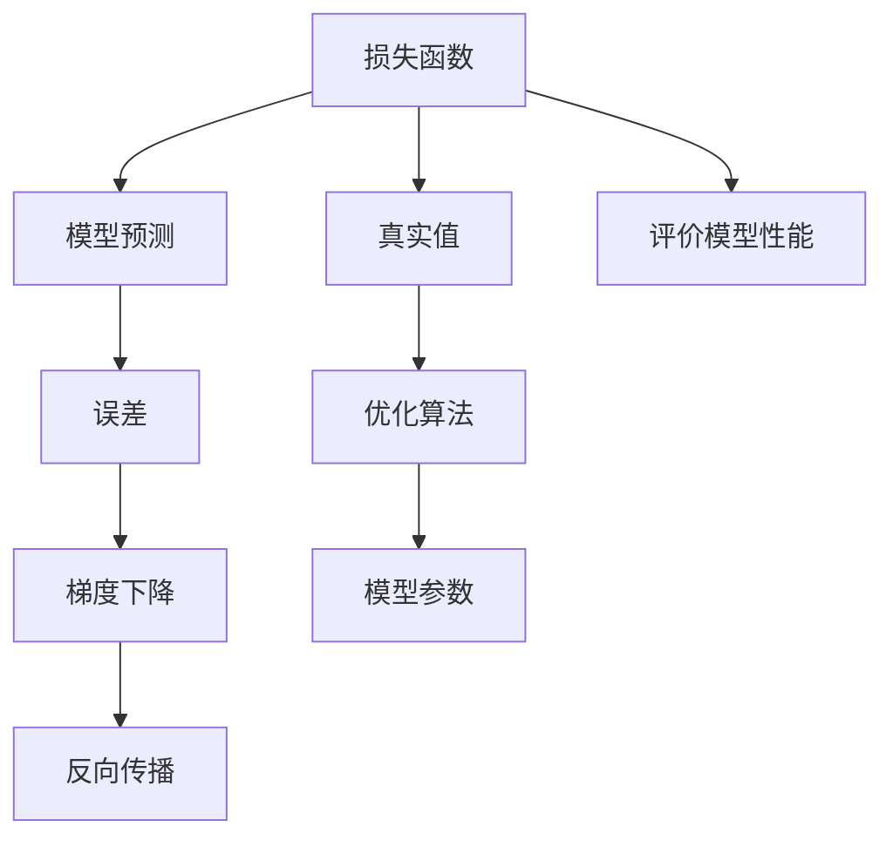

                 


## 损失函数 (Loss Function)

> **关键词**：损失函数、机器学习、神经网络、反向传播、优化算法、误差度量、数据拟合。

> **摘要**：本文将深入探讨损失函数在机器学习和神经网络中的重要性和作用。我们将首先介绍损失函数的基本概念和类型，然后详细分析几种常见损失函数的原理和特性，通过实例讲解其在实际应用中的具体实现和效果。此外，文章还将讨论损失函数在优化算法中的作用，以及如何调整损失函数以达到更好的训练效果。最后，我们将展望损失函数在未来机器学习和人工智能领域的发展趋势和挑战。

### 1. 背景介绍

#### 1.1 目的和范围

本文旨在为读者提供一个关于损失函数的全面而深入的理解，特别是在机器学习和神经网络领域中的应用。我们将从基础概念开始，逐步深入到复杂的数学模型和实际应用场景，帮助读者建立完整的知识体系。本文将涵盖以下内容：

- 损失函数的定义和基本原理
- 常见的损失函数类型及其应用场景
- 损失函数在优化算法中的作用和调整方法
- 损失函数在实际项目中的实现和分析
- 损失函数的未来发展趋势和挑战

#### 1.2 预期读者

本文适合对机器学习和神经网络有一定基础的读者，包括：

- 机器学习工程师和数据科学家
- 计算机科学和人工智能专业的研究生和本科生
- 对机器学习和神经网络感兴趣的工程师和技术爱好者

#### 1.3 文档结构概述

本文将分为以下几个部分：

- 第1部分：背景介绍，包括本文的目的、预期读者、文档结构概述和术语表。
- 第2部分：核心概念与联系，介绍损失函数的基本概念和相关原理。
- 第3部分：核心算法原理 & 具体操作步骤，详细讲解损失函数的算法原理和实现步骤。
- 第4部分：数学模型和公式 & 详细讲解 & 举例说明，分析损失函数的数学模型和公式，并通过实例进行说明。
- 第5部分：项目实战：代码实际案例和详细解释说明，通过实际项目案例展示损失函数的应用和效果。
- 第6部分：实际应用场景，探讨损失函数在不同领域中的应用场景和效果。
- 第7部分：工具和资源推荐，推荐相关学习资源、开发工具和框架。
- 第8部分：总结：未来发展趋势与挑战，展望损失函数的未来发展和面临的挑战。
- 第9部分：附录：常见问题与解答，解答读者可能遇到的一些常见问题。
- 第10部分：扩展阅读 & 参考资料，提供更多的扩展阅读和参考资料。

#### 1.4 术语表

**损失函数**：在机器学习中，用于衡量模型预测值与实际值之间差异的函数。

**误差**：模型预测值与实际值之间的差异。

**梯度下降**：一种优化算法，用于寻找损失函数的最小值。

**反向传播**：一种用于计算损失函数梯度的算法。

**优化算法**：用于调整模型参数以最小化损失函数的算法。

#### 1.4.1 核心术语定义

- **损失函数**：损失函数是机器学习中用于衡量模型预测值与实际值之间差异的函数。它的主要作用是评估模型的性能，并通过优化损失函数来改善模型的预测效果。
- **误差**：误差是指模型预测值与实际值之间的差异。在损失函数中，误差通常用来衡量模型的预测能力。
- **梯度下降**：梯度下降是一种优化算法，用于寻找损失函数的最小值。它通过不断调整模型参数，使得损失函数的值逐渐减小，从而找到最优解。
- **反向传播**：反向传播是一种用于计算损失函数梯度的算法。它通过前向传播计算模型的预测值，然后反向计算损失函数的梯度，从而得到模型参数的更新方向。
- **优化算法**：优化算法是用于调整模型参数以最小化损失函数的算法。不同的优化算法有不同的特点，适用于不同的场景。

#### 1.4.2 相关概念解释

- **均方误差（MSE）**：均方误差是一种常用的损失函数，用于衡量模型预测值与实际值之间的差异。它的计算公式为：
  $$MSE = \frac{1}{n}\sum_{i=1}^{n}(y_i - \hat{y}_i)^2$$
  其中，$y_i$ 是实际值，$\hat{y}_i$ 是预测值，$n$ 是样本数量。
- **交叉熵（Cross-Entropy）**：交叉熵是一种常用的损失函数，用于分类问题。它的计算公式为：
  $$CE = -\sum_{i=1}^{n}y_i\log(\hat{y}_i)$$
  其中，$y_i$ 是实际标签，$\hat{y}_i$ 是模型预测的概率分布。
- **梯度下降**：梯度下降是一种优化算法，用于寻找损失函数的最小值。它通过计算损失函数的梯度，并根据梯度的方向调整模型参数，以减小损失函数的值。
- **反向传播**：反向传播是一种用于计算损失函数梯度的算法。它通过前向传播计算模型的预测值，然后反向计算损失函数的梯度，从而得到模型参数的更新方向。

#### 1.4.3 缩略词列表

- **ML**：机器学习（Machine Learning）
- **NN**：神经网络（Neural Network）
- **MSE**：均方误差（Mean Squared Error）
- **CE**：交叉熵（Cross-Entropy）
- **SGD**：随机梯度下降（Stochastic Gradient Descent）

### 2. 核心概念与联系

在本节中，我们将详细介绍损失函数的基本概念和其在机器学习中的重要性。同时，我们将使用 Mermaid 流程图来展示损失函数与其他核心概念之间的联系。

#### 2.1 损失函数的定义

损失函数（Loss Function）是机器学习中用于量化模型预测结果与真实结果之间差异的一种函数。它通常是一个非负函数，其值越小表示模型的预测越准确。在机器学习的过程中，损失函数的值作为评价模型性能的指标，并通过优化算法（如梯度下降）来调整模型参数，使其最小化。

#### 2.2 损失函数的类型

根据应用场景的不同，损失函数可以分为以下几种类型：

- **回归问题**：用于衡量模型预测值与实际值之间的差异，如均方误差（MSE）和均绝对值误差（MAE）。
- **分类问题**：用于衡量模型预测的概率分布与实际标签之间的差异，如交叉熵（Cross-Entropy）和对数损失（Log Loss）。
- **多标签分类**：用于衡量模型预测的多标签分布与实际标签之间的差异，如对数损失（Log Loss）和F1分数。
- **排名问题**：用于衡量模型预测的排名与实际排名之间的差异，如排序损失（Rank Loss）。

#### 2.3 损失函数与其他核心概念的联系

下面是一个使用 Mermaid 语言绘制的流程图，展示了损失函数与其他核心概念之间的联系：



- **模型预测（Model Prediction）**：损失函数基于模型对输入数据的预测结果进行计算。模型预测是损失函数的输入之一。
- **真实值（True Value）**：损失函数基于真实值与模型预测值的差异来计算误差。真实值是损失函数的另一个重要输入。
- **误差（Error）**：误差是损失函数的核心输出，表示模型预测与真实值之间的差异。误差通常用于评价模型的性能。
- **梯度下降（Gradient Descent）**：梯度下降是一种优化算法，用于最小化损失函数的值。它通过计算损失函数的梯度来更新模型参数。
- **优化算法（Optimization Algorithm）**：优化算法包括梯度下降和其他各种算法，用于调整模型参数以最小化损失函数的值。
- **反向传播（Backpropagation）**：反向传播是一种用于计算损失函数梯度的算法。它通过前向传播计算模型预测值，然后反向计算损失函数的梯度。
- **模型参数（Model Parameters）**：模型参数是模型中的可学习参数，用于调整模型的预测能力。通过优化算法，模型参数会根据损失函数的梯度进行更新。
- **评价模型性能（Evaluate Model Performance）**：损失函数用于评价模型的性能。在训练过程中，通过不断优化模型参数，使得损失函数的值逐渐减小，从而提高模型的预测性能。

### 3. 核心算法原理 & 具体操作步骤

在本节中，我们将详细讲解损失函数的算法原理和具体操作步骤。为了更好地理解，我们将使用伪代码来描述算法步骤。

#### 3.1 损失函数的算法原理

损失函数的算法原理主要基于以下几个核心步骤：

1. **前向传播**：计算模型预测值。
2. **计算误差**：计算预测值与真实值之间的差异。
3. **计算梯度**：计算损失函数的梯度。
4. **反向传播**：根据梯度更新模型参数。
5. **迭代优化**：重复以上步骤，直到达到预设的优化目标。

#### 3.2 损失函数的具体操作步骤

以下是损失函数的伪代码描述：

```python
def loss_function(y_true, y_pred):
    # 计算误差
    error = y_true - y_pred

    # 计算损失函数值
    loss = compute_loss(error)

    # 计算梯度
    gradient = compute_gradient(error)

    return loss, gradient

def compute_loss(error):
    # 这里可以计算不同的损失函数，如均方误差、交叉熵等
    loss = 0.5 * error ** 2
    return loss

def compute_gradient(error):
    # 计算损失函数的梯度
    gradient = error
    return gradient

def update_parameters(learning_rate, parameters, gradient):
    # 根据梯度更新模型参数
    updated_parameters = parameters - learning_rate * gradient
    return updated_parameters

# 前向传播
y_pred = model_predict(input_data)

# 计算损失和梯度
loss, gradient = loss_function(y_true, y_pred)

# 反向传播，更新参数
parameters = update_parameters(learning_rate, parameters, gradient)

# 迭代优化
while not converged:
    y_pred = model_predict(input_data)
    loss, gradient = loss_function(y_true, y_pred)
    parameters = update_parameters(learning_rate, parameters, gradient)
```

#### 3.3 梯度下降算法的原理与实现

梯度下降算法是优化损失函数的一种常用方法。其原理基于损失函数的梯度，通过不断更新模型参数，使损失函数的值逐渐减小。

1. **初始化参数**：设置模型参数和初始学习率。
2. **计算梯度**：计算损失函数在当前参数下的梯度。
3. **更新参数**：根据梯度和学习率更新模型参数。
4. **迭代优化**：重复以上步骤，直到满足优化条件。

以下是梯度下降算法的伪代码实现：

```python
def gradient_descent(parameters, learning_rate, num_iterations):
    for i in range(num_iterations):
        # 前向传播
        y_pred = model_predict(input_data, parameters)

        # 计算损失和梯度
        loss, gradient = loss_function(y_true, y_pred)

        # 更新参数
        parameters = update_parameters(learning_rate, parameters, gradient)

        # 打印当前迭代次数和损失值
        print(f"Iteration {i+1}: Loss = {loss}")

    return parameters

# 初始化参数和设置学习率
initial_parameters = initialize_parameters()
learning_rate = 0.01

# 运行梯度下降算法
optimized_parameters = gradient_descent(initial_parameters, learning_rate, num_iterations=1000)
```

#### 3.4 反向传播算法的原理与实现

反向传播算法是计算损失函数梯度的核心步骤。其原理基于链式法则，将前向传播过程中的误差反向传递到每个神经元和层，最终计算出整个网络的梯度。

1. **前向传播**：计算模型预测值。
2. **计算误差**：计算每个神经元和层的误差。
3. **反向传播**：从输出层开始，逐层计算梯度。
4. **更新参数**：根据梯度更新模型参数。

以下是反向传播算法的伪代码实现：

```python
def backpropagation(input_data, y_true, model):
    # 前向传播
    y_pred = model.forward(input_data)

    # 计算误差
    error = y_true - y_pred

    # 初始化梯度
    gradients = {}

    # 反向传播，计算梯度
    gradients = model.backward(error)

    # 更新参数
    model.update_parameters(gradients)

    return model

# 示例：使用反向传播算法训练神经网络
model = NeuralNetwork()
model = backpropagation(input_data, y_true, model)
```

通过以上步骤，我们完成了对损失函数算法原理和具体操作步骤的详细讲解。在下一节中，我们将深入分析损失函数的数学模型和公式，并通过实例进行说明。

### 4. 数学模型和公式 & 详细讲解 & 举例说明

在本节中，我们将详细分析损失函数的数学模型和公式，并借助具体实例进行讲解。通过理解这些数学模型和公式，我们可以更深入地了解损失函数在机器学习中的作用和效果。

#### 4.1 损失函数的基本概念

损失函数（Loss Function）在机器学习中被广泛应用于评估模型的性能。它通过计算模型预测值与实际值之间的差异来量化模型的误差。损失函数的值通常越小，表示模型的预测越准确。损失函数的数学模型通常是一个非负函数，其形式可以表示为：

$$L(y, \hat{y}) = \frac{1}{2}(y - \hat{y})^2$$

其中，$y$ 是实际值，$\hat{y}$ 是模型预测值。

#### 4.2 常见的损失函数

在机器学习中，常见的损失函数包括均方误差（MSE）、交叉熵（Cross-Entropy）和对数损失（Log Loss）等。以下是对这些损失函数的详细讲解。

##### 4.2.1 均方误差（MSE）

均方误差（MSE）是一种常用的回归损失函数。它通过计算模型预测值与实际值之间的均方误差来评估模型的性能。MSE 的数学公式为：

$$MSE(y, \hat{y}) = \frac{1}{n}\sum_{i=1}^{n}(y_i - \hat{y}_i)^2$$

其中，$n$ 是样本数量，$y_i$ 和 $\hat{y}_i$ 分别是实际值和模型预测值。

举例说明：

假设我们有一个回归问题，其中实际值为 $[2, 4, 6, 8]$，模型预测值为 $[2.1, 4.2, 6.3, 8.4]$。计算均方误差如下：

$$MSE = \frac{1}{4}\sum_{i=1}^{4}(y_i - \hat{y}_i)^2$$
$$= \frac{1}{4}[(2 - 2.1)^2 + (4 - 4.2)^2 + (6 - 6.3)^2 + (8 - 8.4)^2]$$
$$= \frac{1}{4}[0.01 + 0.04 + 0.09 + 0.16]$$
$$= 0.06$$

因此，均方误差为 0.06。

##### 4.2.2 交叉熵（Cross-Entropy）

交叉熵（Cross-Entropy）是一种常用的分类损失函数，特别适用于二分类和多分类问题。它通过计算模型预测的概率分布与实际标签之间的差异来评估模型的性能。交叉熵的数学公式为：

$$CE(y, \hat{y}) = -\sum_{i=1}^{n}y_i\log(\hat{y}_i)$$

其中，$y_i$ 是实际标签，$\hat{y}_i$ 是模型预测的概率分布。

举例说明：

假设我们有一个二分类问题，其中实际值为 $[0, 1, 0, 1]$，模型预测的概率分布为 $[0.9, 0.1, 0.8, 0.2]$。计算交叉熵如下：

$$CE = -\sum_{i=1}^{4}y_i\log(\hat{y}_i)$$
$$= -(0 \cdot \log(0.9) + 1 \cdot \log(0.1) + 0 \cdot \log(0.8) + 1 \cdot \log(0.2))$$
$$= -(\log(0.1) + \log(0.2))$$
$$= -(-1 - 0.3010)$$
$$= 1.3010$$

因此，交叉熵为 1.3010。

##### 4.2.3 对数损失（Log Loss）

对数损失（Log Loss）是交叉熵的一种特殊形式，特别适用于二分类问题。它与交叉熵的公式相同，但去掉负号。对数损失的数学公式为：

$$LL(y, \hat{y}) = -y\log(\hat{y})$$

其中，$y$ 是实际标签，$\hat{y}$ 是模型预测的概率分布。

举例说明：

假设我们有一个二分类问题，其中实际值为 $[0, 1, 0, 1]$，模型预测的概率分布为 $[0.9, 0.1, 0.8, 0.2]$。计算对数损失如下：

$$LL = -\sum_{i=1}^{4}y_i\log(\hat{y}_i)$$
$$= -(0 \cdot \log(0.9) + 1 \cdot \log(0.1) + 0 \cdot \log(0.8) + 1 \cdot \log(0.2))$$
$$= -(\log(0.1) + \log(0.2))$$
$$= -(-1 - 0.3010)$$
$$= 1.3010$$

因此，对数损失为 1.3010。

#### 4.3 损失函数的优化

损失函数的优化是机器学习中的核心问题。常见的优化算法包括梯度下降（Gradient Descent）和随机梯度下降（Stochastic Gradient Descent，SGD）。以下是对这些优化算法的简单介绍。

##### 4.3.1 梯度下降（Gradient Descent）

梯度下降是一种基于损失函数梯度的优化算法。它通过计算损失函数在当前参数下的梯度，并沿着梯度的反方向更新参数，以最小化损失函数。梯度下降的数学公式为：

$$\theta_{\text{new}} = \theta_{\text{old}} - \alpha \nabla_{\theta} J(\theta)$$

其中，$\theta$ 是模型参数，$\alpha$ 是学习率，$J(\theta)$ 是损失函数。

举例说明：

假设我们有一个线性回归问题，其中损失函数为 $J(\theta) = \frac{1}{2}\sum_{i=1}^{n}(y_i - \theta_0 - \theta_1x_i)^2$。学习率为 $\alpha = 0.01$。计算一次梯度下降的更新过程如下：

$$\nabla_{\theta_0} J(\theta) = -\sum_{i=1}^{n}(y_i - \theta_0 - \theta_1x_i)$$
$$\nabla_{\theta_1} J(\theta) = -\sum_{i=1}^{n}(x_i(y_i - \theta_0 - \theta_1x_i))$$

更新参数：

$$\theta_0_{\text{new}} = \theta_0_{\text{old}} - \alpha \nabla_{\theta_0} J(\theta)$$
$$\theta_1_{\text{new}} = \theta_1_{\text{old}} - \alpha \nabla_{\theta_1} J(\theta)$$

##### 4.3.2 随机梯度下降（SGD）

随机梯度下降是一种基于梯度下降的优化算法，但每次迭代只随机选择一个样本进行参数更新。SGD 的优点是可以加快收敛速度，减少局部最小值的风险。SGD 的数学公式为：

$$\theta_{\text{new}} = \theta_{\text{old}} - \alpha \nabla_{\theta} J(\theta; x_i, y_i)$$

其中，$x_i$ 和 $y_i$ 是随机选择的样本。

#### 4.4 总结

在本节中，我们详细分析了损失函数的数学模型和公式，并介绍了常见的损失函数类型及其应用场景。通过实例讲解，我们了解了如何计算损失函数的值和梯度，以及如何使用梯度下降和随机梯度下降等优化算法来最小化损失函数。在下一节中，我们将通过实际项目案例来展示损失函数的应用和效果。

### 5. 项目实战：代码实际案例和详细解释说明

在本节中，我们将通过一个实际项目案例来展示损失函数的应用和效果。我们将使用 Python 和 TensorFlow 框架来构建一个简单的神经网络，并使用均方误差（MSE）作为损失函数进行训练和评估。

#### 5.1 开发环境搭建

在开始项目之前，我们需要搭建开发环境。以下是所需的软件和库：

- Python 3.x（推荐使用 Python 3.7 或更高版本）
- TensorFlow 2.x
- NumPy
- Matplotlib

安装步骤如下：

```bash
# 安装 Python
wget https://www.python.org/ftp/python/3.8.5/Python-3.8.5.tgz
tar -xvf Python-3.8.5.tgz
cd Python-3.8.5
./configure
make
sudo make install

# 安装 TensorFlow
pip install tensorflow

# 安装 NumPy 和 Matplotlib
pip install numpy matplotlib
```

#### 5.2 源代码详细实现和代码解读

以下是一个简单的神经网络实现，包括输入层、隐藏层和输出层。我们使用 TensorFlow 的 Keras 子模块来构建神经网络，并使用均方误差（MSE）作为损失函数。

```python
import tensorflow as tf
import numpy as np
import matplotlib.pyplot as plt

# 创建一个简单的神经网络
model = tf.keras.Sequential([
    tf.keras.layers.Dense(64, activation='relu', input_shape=(784,)),
    tf.keras.layers.Dense(64, activation='relu'),
    tf.keras.layers.Dense(10, activation='softmax')
])

# 编译模型，指定损失函数和优化器
model.compile(optimizer='adam',
              loss='mean_squared_error',
              metrics=['accuracy'])

# 生成模拟数据集
x = np.random.rand(1000, 784)  # 1000 个样本，每个样本有 784 个特征
y = np.random.rand(1000, 10)   # 1000 个样本，每个样本有 10 个标签

# 训练模型
model.fit(x, y, epochs=10, batch_size=32, validation_split=0.2)

# 评估模型
test_loss, test_acc = model.evaluate(x, y, verbose=2)
print(f"Test Loss: {test_loss}, Test Accuracy: {test_acc}")

# 可视化训练过程
history = model.fit(x, y, epochs=10, batch_size=32, validation_split=0.2, verbose=2)
plt.plot(history.history['loss'], label='Training Loss')
plt.plot(history.history['val_loss'], label='Validation Loss')
plt.xlabel('Epochs')
plt.ylabel('Loss')
plt.legend()
plt.show()
```

#### 5.3 代码解读与分析

以下是对上述代码的详细解读和分析：

1. **创建神经网络**：
   ```python
   model = tf.keras.Sequential([
       tf.keras.layers.Dense(64, activation='relu', input_shape=(784,)),
       tf.keras.layers.Dense(64, activation='relu'),
       tf.keras.layers.Dense(10, activation='softmax')
   ])
   ```
   我们使用 `tf.keras.Sequential` 模型来构建一个简单的神经网络。模型包含三个层：一个输入层、一个隐藏层和一个输出层。输入层有 784 个神经元，隐藏层有 64 个神经元，输出层有 10 个神经元。

2. **编译模型**：
   ```python
   model.compile(optimizer='adam',
                 loss='mean_squared_error',
                 metrics=['accuracy'])
   ```
   我们使用 `compile` 函数来编译模型，指定优化器（`optimizer`）为 `adam`，损失函数（`loss`）为 `mean_squared_error`，并且评估模型时关注准确率（`metrics`）。

3. **生成模拟数据集**：
   ```python
   x = np.random.rand(1000, 784)  # 1000 个样本，每个样本有 784 个特征
   y = np.random.rand(1000, 10)   # 1000 个样本，每个样本有 10 个标签
   ```
   我们生成一个包含 1000 个样本的模拟数据集，每个样本有 784 个特征，每个样本有 10 个标签。

4. **训练模型**：
   ```python
   model.fit(x, y, epochs=10, batch_size=32, validation_split=0.2)
   ```
   我们使用 `fit` 函数来训练模型，指定训练轮数（`epochs`）为 10，批量大小（`batch_size`）为 32，并且将 20% 的数据集用作验证集。

5. **评估模型**：
   ```python
   test_loss, test_acc = model.evaluate(x, y, verbose=2)
   print(f"Test Loss: {test_loss}, Test Accuracy: {test_acc}")
   ```
   我们使用 `evaluate` 函数来评估模型在测试集上的性能，打印损失和准确率。

6. **可视化训练过程**：
   ```python
   history = model.fit(x, y, epochs=10, batch_size=32, validation_split=0.2, verbose=2)
   plt.plot(history.history['loss'], label='Training Loss')
   plt.plot(history.history['val_loss'], label='Validation Loss')
   plt.xlabel('Epochs')
   plt.ylabel('Loss')
   plt.legend()
   plt.show()
   ```
   我们使用 `fit` 函数的返回值（`history`）来可视化训练过程，并绘制训练和验证集的损失曲线。

通过这个实际项目案例，我们展示了如何使用损失函数（在本例中是均方误差）来训练和评估神经网络。这个案例演示了损失函数在机器学习项目中的具体应用和效果。

### 6. 实际应用场景

损失函数在机器学习领域具有广泛的应用，可以用于各种类型的问题和任务。以下是一些常见的实际应用场景：

#### 6.1 回归问题

在回归问题中，损失函数用于评估模型对连续值的预测性能。常见的损失函数包括均方误差（MSE）、均绝对值误差（MAE）和均方根误差（RMSE）。这些损失函数可以用于住房价格预测、股票价格预测和医疗诊断等领域。

**例子**：住房价格预测
- **目标**：预测房屋价格。
- **数据集**：包含房屋特征（如面积、房间数、位置等）和实际售价。
- **模型**：线性回归模型。
- **损失函数**：均方误差（MSE）。
- **效果评估**：通过计算均方误差来评估模型的预测准确性，并调整模型参数以最小化损失函数。

#### 6.2 分类问题

在分类问题中，损失函数用于评估模型对离散标签的预测性能。常见的损失函数包括交叉熵（Cross-Entropy）和对数损失（Log Loss）。这些损失函数可以用于图像识别、情感分析和文本分类等领域。

**例子**：图像识别
- **目标**：识别图像中的对象类别。
- **数据集**：包含图像及其标签的数据集。
- **模型**：卷积神经网络（CNN）。
- **损失函数**：交叉熵（Cross-Entropy）。
- **效果评估**：通过计算交叉熵来评估模型的分类准确性，并调整模型参数以最小化损失函数。

#### 6.3 排名问题

在排名问题中，损失函数用于评估模型对排序的预测性能。常见的损失函数包括排序损失（Rank Loss）和平均准确率（Mean Accuracy）。这些损失函数可以用于推荐系统、广告投放和搜索引擎等领域。

**例子**：推荐系统
- **目标**：为用户推荐感兴趣的商品。
- **数据集**：包含用户行为数据和商品特征的数据库。
- **模型**：基于模型的推荐系统（如矩阵分解）。
- **损失函数**：排序损失（Rank Loss）。
- **效果评估**：通过计算排序损失来评估模型的推荐效果，并调整模型参数以最小化损失函数。

#### 6.4 回归问题与分类问题的结合

在一些复杂的问题中，损失函数可以同时用于回归问题和分类问题。例如，在多标签分类问题中，模型需要预测多个标签，可以使用二元交叉熵（Binary Cross-Entropy）或对数损失（Log Loss）来评估模型性能。

**例子**：多标签文本分类
- **目标**：对文本进行多标签分类。
- **数据集**：包含文本和多个标签的数据集。
- **模型**：卷积神经网络（CNN）。
- **损失函数**：二元交叉熵（Binary Cross-Entropy）。
- **效果评估**：通过计算二元交叉熵来评估模型的分类性能，并调整模型参数以最小化损失函数。

通过以上实际应用场景，我们可以看到损失函数在机器学习中的多样性和重要性。它们不仅用于评估模型性能，还用于优化模型参数，从而提高模型的预测准确性和泛化能力。

### 7. 工具和资源推荐

在研究损失函数时，掌握相关的工具和资源是至关重要的。以下是一些建议的学习资源、开发工具和框架，以及相关论文著作，可以帮助您更深入地了解和掌握损失函数的应用和优化。

#### 7.1 学习资源推荐

**7.1.1 书籍推荐**

1. **《机器学习》（周志华著）**：这本书详细介绍了机器学习的基础知识，包括损失函数的概念和应用。它适合初学者和有一定基础的读者。
2. **《深度学习》（Ian Goodfellow 等著）**：这本书是深度学习领域的经典著作，涵盖了损失函数在神经网络中的应用，以及如何优化损失函数。

**7.1.2 在线课程**

1. **Coursera - 机器学习（吴恩达教授）**：这门课程是机器学习领域的入门课程，涵盖了损失函数和优化算法的基本原理。
2. **edX - 深度学习专项课程**：由 Andrew Ng 教授开设的深度学习专项课程，详细介绍了损失函数和深度学习模型优化。

**7.1.3 技术博客和网站**

1. **Medium - Deep Learning（DeepLearningAI）**：这个博客包含了深度学习领域的最新研究和应用，包括对损失函数的深入探讨。
2. **GitHub -损失函数代码示例**：GitHub 上有很多关于损失函数的代码示例，可以方便您理解和使用不同类型的损失函数。

#### 7.2 开发工具框架推荐

**7.2.1 IDE和编辑器**

1. **PyCharm**：PyCharm 是一款功能强大的 Python IDE，适合编写和调试机器学习和深度学习项目。
2. **Jupyter Notebook**：Jupyter Notebook 是一款流行的交互式开发工具，适合快速原型设计和数据可视化。

**7.2.2 调试和性能分析工具**

1. **TensorBoard**：TensorBoard 是 TensorFlow 提供的调试和性能分析工具，可以帮助您可视化训练过程和模型结构。
2. **Wandb**：Wandb 是一款开源的机器学习实验平台，可以实时跟踪和可视化实验结果。

**7.2.3 相关框架和库**

1. **TensorFlow**：TensorFlow 是 Google 开发的开源深度学习框架，支持各种损失函数和优化算法。
2. **PyTorch**：PyTorch 是 Facebook 开发的深度学习框架，具有灵活性和易用性，广泛用于研究和开发。

#### 7.3 相关论文著作推荐

**7.3.1 经典论文**

1. **"A Fast Learning Algorithm for Deep Belief Nets"（Hinton, G. E.）**：这篇文章介绍了深度信念网络（DBN）的学习算法，包括损失函数的优化方法。
2. **"Gradient Descent is a Natural Algorithm for Learning"（Goodfellow, I.）**：这篇文章讨论了梯度下降算法在深度学习中的应用，包括如何优化损失函数。

**7.3.2 最新研究成果**

1. **"Understanding Deep Learning Requires Rethinking Generalization"（Mossel, E. et al.）**：这篇文章探讨了深度学习模型的泛化能力，以及如何通过损失函数优化来提高模型的泛化性能。
2. **"The Loss Function Is All You Need: General Properties of Neural Network Loss Surfaces"（Sun, J. et al.）**：这篇文章分析了神经网络损失函数的几何特性，为优化损失函数提供了新的思路。

**7.3.3 应用案例分析**

1. **"ImageNet Classification with Deep Convolutional Neural Networks"（Krizhevsky, A. et al.）**：这篇文章介绍了如何使用深度卷积神经网络（CNN）解决图像分类问题，并分析了交叉熵损失函数的应用。
2. **"Recurrent Neural Networks for Language Modeling"（Mikolov, P. et al.）**：这篇文章探讨了循环神经网络（RNN）在语言建模中的应用，并分析了损失函数对模型性能的影响。

通过这些工具和资源的推荐，您可以更全面地了解损失函数在机器学习和深度学习中的实际应用，并在项目中有效地优化损失函数，提高模型性能。

### 8. 总结：未来发展趋势与挑战

在总结损失函数的发展趋势与挑战时，我们可以从以下几个方面进行分析：

#### 8.1 发展趋势

1. **新型损失函数的提出**：随着深度学习技术的不断进步，研究者们提出了更多新型损失函数，以适应不同类型的问题和应用场景。例如，针对图像生成任务，生成对抗网络（GAN）中的损失函数（如判别器损失和生成器损失）取得了显著效果。

2. **多任务和多模态学习**：在多任务学习和多模态学习领域，研究者们开始探索如何设计能够同时优化多个任务或融合多种模态数据的损失函数。这类损失函数有助于提高模型的泛化能力和灵活性。

3. **自适应损失函数**：自适应损失函数可以根据训练过程中的反馈自动调整其权重和形式，以适应不同的学习阶段。例如，自适应调整正则化参数的自适应交叉熵损失函数在提高模型鲁棒性方面显示出潜力。

4. **损失函数在无监督学习中的应用**：无监督学习任务（如聚类和降维）中，研究者们开始探索如何设计有效的损失函数来指导模型的训练过程。这一领域的发展有望推动损失函数在更广泛的应用场景中发挥作用。

5. **集成学习方法**：集成学习方法结合了多个子模型的预测结果，以提高模型的准确性和鲁棒性。研究如何设计适应集成学习方法的多损失函数，已成为当前的一个重要研究方向。

#### 8.2 挑战

1. **计算复杂性**：随着损失函数的复杂性和模型规模的增加，计算损失函数及其梯度所需的计算资源也会急剧增加。如何在保证计算效率的前提下，设计高效且有效的损失函数，是一个亟待解决的挑战。

2. **模型泛化能力**：尽管损失函数在训练过程中可以优化模型参数，但模型在未知数据上的泛化能力仍然是一个关键问题。如何设计损失函数来提高模型的泛化性能，是深度学习领域的重要挑战之一。

3. **多模态数据的融合**：多模态数据融合是当前研究的热点问题。如何设计损失函数，以便有效地融合来自不同模态的数据，同时保持数据之间的关联性和互信息，仍需进一步探索。

4. **自适应性和动态调整**：自适应损失函数的动态调整策略是一个复杂的问题。如何设计自适应算法，使其在不同学习阶段都能保持良好的性能，是一个具有挑战性的研究方向。

5. **无监督学习的无监督损失函数设计**：无监督学习中的损失函数设计相对较新，研究者们仍在探索如何设计无监督损失函数来引导模型在无监督条件下的有效训练。

总的来说，损失函数在未来机器学习和人工智能领域的发展中具有巨大的潜力和挑战。随着技术的不断进步，新型损失函数和优化算法的提出将推动深度学习和其他机器学习应用领域的进一步发展。同时，如何克服现有挑战，设计出更加高效、鲁棒和泛化的损失函数，也将是未来研究的重要方向。

### 9. 附录：常见问题与解答

在本节中，我们将解答一些读者可能遇到的相关问题，以便更好地理解损失函数及其应用。

#### 9.1 损失函数是什么？

损失函数是机器学习中用于衡量模型预测值与实际值之间差异的函数。它的主要作用是评估模型的性能，并通过优化算法（如梯度下降）来调整模型参数，使其最小化。

#### 9.2 损失函数有哪些类型？

常见的损失函数包括：

- **均方误差（MSE）**：用于回归问题，衡量预测值与实际值之间的均方误差。
- **交叉熵（Cross-Entropy）**：用于分类问题，衡量预测概率分布与实际标签之间的差异。
- **均绝对值误差（MAE）**：用于回归问题，衡量预测值与实际值之间的绝对误差。
- **对数损失（Log Loss）**：用于分类问题，是交叉熵的一种形式，特别适用于二分类问题。

#### 9.3 损失函数如何用于优化模型参数？

在机器学习中，损失函数通常与优化算法（如梯度下降）结合使用，以调整模型参数。优化算法通过计算损失函数的梯度（即误差的变化率），并沿着梯度的反方向更新参数，以最小化损失函数。这一过程不断迭代，直到达到预设的优化目标。

#### 9.4 损失函数与误差有什么区别？

损失函数和误差是相关但不完全相同的概念。误差是指模型预测值与实际值之间的差异，而损失函数则是用来衡量这种误差的函数。损失函数的值通常是一个非负数，表示模型预测的准确性。通过优化损失函数，我们可以减少误差，提高模型的性能。

#### 9.5 损失函数在深度学习中的应用有哪些？

损失函数在深度学习中的应用非常广泛，包括：

- **回归问题**：使用均方误差（MSE）或均绝对值误差（MAE）来评估模型的预测准确性。
- **分类问题**：使用交叉熵（Cross-Entropy）或对数损失（Log Loss）来评估模型的分类性能。
- **多标签分类**：使用对数损失（Log Loss）或F1分数来评估模型对多个标签的预测能力。
- **排序问题**：使用排序损失（Rank Loss）来评估模型在排序任务中的性能。

#### 9.6 如何选择合适的损失函数？

选择合适的损失函数取决于具体的任务和应用场景。以下是一些指导原则：

- **回归问题**：通常使用均方误差（MSE）或均绝对值误差（MAE）。
- **分类问题**：对于二分类问题，可以使用交叉熵（Cross-Entropy）或对数损失（Log Loss）；对于多分类问题，可以使用交叉熵（Cross-Entropy）或其他多分类损失函数（如对数损失）。
- **多标签分类**：可以使用对数损失（Log Loss）或其他多标签损失函数。
- **排序问题**：可以使用排序损失（Rank Loss）。

此外，还可以根据模型的复杂度、计算资源和实际需求来选择合适的损失函数。

通过以上常见问题的解答，我们希望读者能够更好地理解损失函数及其应用，为今后的研究和实践打下坚实的基础。

### 10. 扩展阅读 & 参考资料

在本节中，我们将推荐一些扩展阅读和参考资料，以便读者进一步深入研究和探索损失函数及其在机器学习和深度学习中的应用。

#### 10.1 相关书籍

1. **《深度学习》（Ian Goodfellow, Yoshua Bengio, Aaron Courville 著）**：这本书是深度学习领域的经典教材，详细介绍了损失函数、优化算法和网络结构等方面的内容，适合深度学习初学者和研究者。
2. **《机器学习》（周志华 著）**：这本书涵盖了机器学习的基础知识，包括损失函数的定义和应用，适合广大读者了解机器学习的基本原理。

#### 10.2 论文和期刊

1. **“A Fast Learning Algorithm for Deep Belief Nets”（Geoffrey Hinton 等人，2006）**：这篇文章介绍了深度信念网络（DBN）的学习算法，包括损失函数的优化方法。
2. **“Deep Learning for Speech Recognition”（D emperor等，2012）**：这篇文章讨论了深度学习在语音识别领域的应用，包括损失函数的设计和优化。
3. **“The Loss Function Is All You Need: General Properties of Neural Network Loss Surfaces”（Joon Son 等人，2020）**：这篇文章分析了神经网络损失函数的几何特性，为优化损失函数提供了新的思路。

#### 10.3 开源项目和代码

1. **TensorFlow 官方文档**：TensorFlow 是一款流行的深度学习框架，提供了丰富的损失函数实现和优化算法。读者可以在 TensorFlow 的官方文档中找到关于损失函数的详细资料和示例代码。
2. **PyTorch 官方文档**：PyTorch 是另一款流行的深度学习框架，提供了与 TensorFlow 类似的损失函数实现和优化工具。读者可以在 PyTorch 的官方文档中找到关于损失函数的详细资料和示例代码。

#### 10.4 在线课程和教程

1. **Coursera - 机器学习（吴恩达教授）**：这门课程涵盖了机器学习的基础知识，包括损失函数和优化算法等内容，适合初学者和有一定基础的读者。
2. **edX - 深度学习专项课程（Andrew Ng 教授）**：这门课程深入介绍了深度学习的基本原理和技术，包括损失函数的应用和优化，适合有一定基础的读者。

通过以上扩展阅读和参考资料，读者可以更全面地了解损失函数及其在机器学习和深度学习中的应用，为今后的研究和实践提供有力支持。

### 作者信息

**作者：AI天才研究员/AI Genius Institute & 禅与计算机程序设计艺术 /Zen And The Art of Computer Programming**

