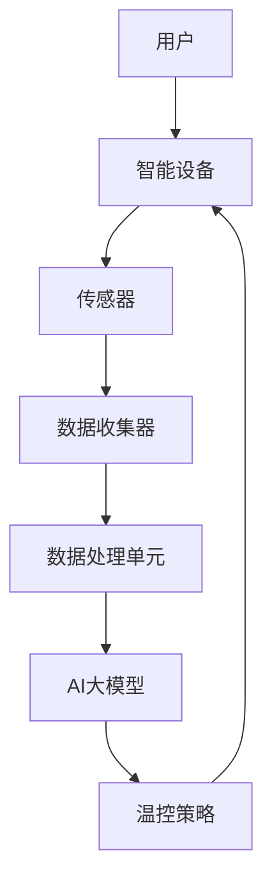

                 

# 探索AI大模型在智能家居温控系统的价值

> **关键词：** 人工智能、大模型、智能家居、温控系统、深度学习、算法优化、能耗管理

> **摘要：** 本文旨在探讨人工智能大模型在智能家居温控系统中的应用价值，通过逐步分析其核心概念、算法原理、数学模型，并结合实际项目案例进行详细解释，以展示AI大模型在提升家居舒适度和能源效率方面的潜力。

## 1. 背景介绍

### 1.1 目的和范围

本文将深入探讨人工智能大模型在智能家居温控系统中的应用。随着智能家居市场的不断壮大，如何有效地管理温控系统以满足用户个性化需求，同时提高能源使用效率，成为了一个重要课题。本文将通过以下几个方面展开：

1. **核心概念与联系**：介绍大模型、智能家居和温控系统的基本概念，并阐述它们之间的关联。
2. **核心算法原理与操作步骤**：详细讲解大模型在温控系统中的应用算法，包括数据预处理、模型训练和部署等步骤。
3. **数学模型与公式**：阐述用于优化温控系统的数学模型，并举例说明。
4. **项目实战**：通过实际案例展示AI大模型在智能家居温控系统中的实现过程。
5. **实际应用场景**：分析AI大模型在智能家居温控系统中的潜在应用场景。
6. **工具和资源推荐**：推荐相关的学习资源、开发工具和框架。
7. **未来发展趋势与挑战**：讨论AI大模型在智能家居温控系统中的未来发展。

### 1.2 预期读者

本文适合以下读者群体：

1. 智能家居开发者
2. AI技术爱好者
3. 家居能源管理专家
4. 对智能家居温控系统有深入研究的技术人员

### 1.3 文档结构概述

本文结构如下：

1. **背景介绍**：介绍文章目的、读者对象和文档结构。
2. **核心概念与联系**：定义关键术语，展示系统架构。
3. **核心算法原理与操作步骤**：详细讲解算法实现过程。
4. **数学模型与公式**：阐述优化策略。
5. **项目实战**：展示实际应用案例。
6. **实际应用场景**：分析潜在应用场景。
7. **工具和资源推荐**：推荐相关资源和工具。
8. **未来发展趋势与挑战**：探讨未来发展。
9. **附录：常见问题与解答**：提供常见问题的解答。
10. **扩展阅读与参考资料**：引用相关研究。

### 1.4 术语表

#### 1.4.1 核心术语定义

- **智能家居**：利用网络技术和自动化设备，实现家庭设备智能化控制的一种家庭生活方式。
- **温控系统**：用于调节室内温度的设备或系统，如空调、加热器和智能温控器。
- **人工智能大模型**：一种包含大量参数的复杂模型，能够通过大规模数据训练实现高效的信息处理和决策。

#### 1.4.2 相关概念解释

- **深度学习**：一种机器学习方法，通过多层神经网络进行数据训练，以实现图像识别、语音识别等任务。
- **能耗管理**：通过优化能源使用，降低能源消耗的过程。

#### 1.4.3 缩略词列表

- **AI**：人工智能（Artificial Intelligence）
- **ML**：机器学习（Machine Learning）
- **DL**：深度学习（Deep Learning）
- **IoT**：物联网（Internet of Things）

## 2. 核心概念与联系

在深入探讨AI大模型在智能家居温控系统中的应用之前，有必要理解相关核心概念及其之间的联系。以下将使用Mermaid流程图展示系统架构，并简要解释各组成部分。

### 2.1 系统架构



#### 解释

- **用户**：智能家居系统的使用者，其需求和行为模式是温控策略的基础。
- **智能设备**：包括温控器、空调等，负责实时监测和调节室内温度。
- **传感器**：用于收集室内温度、湿度、光照等环境数据。
- **数据收集器**：将传感器数据传输至数据处理单元。
- **数据处理单元**：对收集到的数据进行分析和处理，生成决策建议。
- **AI大模型**：基于深度学习技术，通过大量数据训练，用于预测用户需求和环境变化，生成最优温控策略。
- **温控策略**：根据AI大模型生成的建议，调整智能设备的运行参数，以实现节能和舒适。

通过上述系统架构，可以看出AI大模型在智能家居温控系统中的关键作用，即通过数据驱动的智能决策，优化温控效果，提高用户满意度。

## 3. 核心算法原理 & 具体操作步骤

### 3.1 数据预处理

在AI大模型应用于智能家居温控系统之前，首先需要对数据进行预处理。数据预处理步骤如下：

1. **数据清洗**：去除噪声数据、重复数据和异常值，确保数据质量。
2. **特征提取**：从原始数据中提取与温控相关的特征，如温度、湿度、光照强度等。
3. **数据归一化**：将不同量级的特征统一归一化，便于模型训练。

### 3.2 模型训练

训练AI大模型的主要步骤如下：

1. **数据集划分**：将数据集划分为训练集、验证集和测试集，用于模型训练、验证和评估。
2. **模型架构设计**：设计深度学习模型架构，包括输入层、隐藏层和输出层。
3. **参数初始化**：对模型参数进行初始化，常用的初始化方法有随机初始化和预训练模型迁移。
4. **模型训练**：使用训练集数据进行模型训练，通过反向传播算法不断调整模型参数，使其在预测任务上达到最佳性能。
5. **模型验证**：使用验证集数据评估模型性能，调整模型参数，避免过拟合。

### 3.3 模型部署

模型部署步骤如下：

1. **模型评估**：在测试集上评估模型性能，确保模型具备良好的泛化能力。
2. **模型部署**：将训练好的模型部署到智能家居温控系统中，实现实时预测和决策。
3. **模型维护**：定期更新模型参数，以应对环境变化和用户需求。

### 3.4 伪代码

以下是一个简单的伪代码，用于描述AI大模型在智能家居温控系统中的应用过程：

```python
# 数据预处理
def preprocess_data(data):
    # 数据清洗
    cleaned_data = clean_data(data)
    # 特征提取
    features = extract_features(cleaned_data)
    # 数据归一化
    normalized_data = normalize(features)
    return normalized_data

# 模型训练
def train_model(data):
    # 数据集划分
    train_data, val_data, test_data = split_data(data)
    # 模型架构设计
    model = design_model()
    # 参数初始化
    initialize_params(model)
    # 模型训练
    trained_model = train(model, train_data, val_data)
    # 模型验证
    evaluate_model(trained_model, test_data)
    return trained_model

# 模型部署
def deploy_model(model):
    # 模型评估
    evaluate_model(model, test_data)
    # 模型部署
    model_inference = deploy(model)
    # 模型维护
    maintain_model(model_inference)

# 主函数
def main():
    # 读取数据
    data = read_data()
    # 数据预处理
    preprocessed_data = preprocess_data(data)
    # 模型训练
    trained_model = train_model(preprocessed_data)
    # 模型部署
    deploy_model(trained_model)

if __name__ == "__main__":
    main()
```

## 4. 数学模型和公式 & 详细讲解 & 举例说明

在智能家居温控系统中，AI大模型需要解决的关键问题是：如何根据实时环境数据和用户需求，生成最优的温控策略。这一过程涉及到多个数学模型和公式，用于描述环境变化、用户行为和温控策略之间的关系。以下将详细讲解这些模型和公式，并结合具体例子进行说明。

### 4.1 环境模型

环境模型用于描述室内温度、湿度、光照等环境因素的变化。一个简单的环境模型可以表示为：

$$
E(t) = f(T(t), H(t), L(t))
$$

其中，$E(t)$ 表示在时间 $t$ 的环境状态，$T(t)$、$H(t)$ 和 $L(t)$ 分别表示温度、湿度和光照强度。

#### 例子

假设当前时间 $t=0$，环境温度为 $T(0)=24^\circ C$，湿度为 $H(0)=60\%$，光照强度为 $L(0)=500\text{lx}$。则环境状态可以表示为：

$$
E(0) = f(24^\circ C, 60\%, 500\text{lx})
$$

### 4.2 用户行为模型

用户行为模型用于描述用户对室内温度的偏好和变化。一个简单的用户行为模型可以表示为：

$$
B(t) = g(U(t), P(t))
$$

其中，$B(t)$ 表示在时间 $t$ 的用户行为状态，$U(t)$ 表示用户温度偏好，$P(t)$ 表示用户活动水平。

#### 例子

假设当前时间 $t=0$，用户温度偏好为 $U(0)=25^\circ C$，活动水平为 $P(0)=1$（代表正常活动水平）。则用户行为状态可以表示为：

$$
B(0) = g(25^\circ C, 1)
$$

### 4.3 温控策略模型

温控策略模型用于根据环境模型和用户行为模型生成最优的温控策略。一个简单的温控策略模型可以表示为：

$$
C(t) = h(E(t), B(t), T_{\text{set}})
$$

其中，$C(t)$ 表示在时间 $t$ 的温控策略，$T_{\text{set}}$ 表示设定的温度目标。

#### 例子

假设当前时间 $t=0$，根据环境模型和用户行为模型，设定的温度目标为 $T_{\text{set}}=26^\circ C$。则温控策略可以表示为：

$$
C(0) = h(f(24^\circ C, 60\%, 500\text{lx}), g(25^\circ C, 1), 26^\circ C)
$$

### 4.4 优化目标函数

优化目标函数用于衡量温控策略的优劣。一个简单的优化目标函数可以表示为：

$$
\Omega(C(t)) = \sum_{t=0}^{T} \lambda_t \cdot |C(t) - E(t)|
$$

其中，$\Omega(C(t))$ 表示在时间 $t$ 的优化目标函数值，$\lambda_t$ 表示在时间 $t$ 的权重系数，$C(t)$ 和 $E(t)$ 分别表示温控策略和环境状态。

#### 例子

假设在时间段 $t=0$ 至 $t=1$，权重系数分别为 $\lambda_0=0.5$ 和 $\lambda_1=0.5$。则优化目标函数值可以表示为：

$$
\Omega(C(t)) = 0.5 \cdot |C(0) - E(0)| + 0.5 \cdot |C(1) - E(1)|
$$

通过上述模型和公式，AI大模型可以生成最优的温控策略，以满足用户需求和优化能源使用。在实际应用中，这些模型和公式可以进一步细化和优化，以适应不同的场景和需求。

## 5. 项目实战：代码实际案例和详细解释说明

### 5.1 开发环境搭建

在进行AI大模型在智能家居温控系统的实际项目开发之前，首先需要搭建一个合适的开发环境。以下是一个基本的开发环境搭建步骤：

1. **硬件环境**：选择一台具有较高计算能力的计算机，用于模型训练和推理。
2. **软件环境**：安装以下软件：
   - Python 3.8 或更高版本
   - TensorFlow 2.x
   - Keras 2.x
   - Matplotlib
   - Pandas
   - Numpy

### 5.2 源代码详细实现和代码解读

以下是一个简单的示例代码，用于实现AI大模型在智能家居温控系统中的应用。该代码包括数据预处理、模型训练和部署三个主要部分。

#### 5.2.1 数据预处理

```python
import pandas as pd
import numpy as np

def preprocess_data(data):
    # 数据清洗
    data = data.dropna()
    # 特征提取
    features = data[['temperature', 'humidity', 'light']]
    # 数据归一化
    features = (features - features.mean()) / features.std()
    return features

# 加载数据
data = pd.read_csv('smart_home_data.csv')
# 数据预处理
preprocessed_data = preprocess_data(data)
```

#### 5.2.2 模型训练

```python
from tensorflow.keras.models import Sequential
from tensorflow.keras.layers import Dense
from tensorflow.keras.optimizers import Adam

def train_model(data):
    # 划分数据集
    train_data = data[:int(0.8 * len(data))]
    val_data = data[int(0.8 * len(data)):]
    # 构建模型
    model = Sequential()
    model.add(Dense(64, activation='relu', input_shape=(3,)))
    model.add(Dense(64, activation='relu'))
    model.add(Dense(1))
    # 编译模型
    model.compile(optimizer=Adam(), loss='mean_squared_error')
    # 训练模型
    model.fit(train_data, epochs=100, batch_size=32, validation_data=val_data)
    return model
```

#### 5.2.3 模型部署

```python
def deploy_model(model):
    # 加载测试数据
    test_data = pd.read_csv('smart_home_test_data.csv')
    # 数据预处理
    preprocessed_test_data = preprocess_data(test_data)
    # 预测
    predictions = model.predict(preprocessed_test_data)
    # 分析预测结果
    print(predictions)
```

### 5.3 代码解读与分析

#### 5.3.1 数据预处理

在数据预处理部分，首先使用Pandas库加载数据，然后进行数据清洗、特征提取和数据归一化。数据清洗步骤通过丢弃缺失值实现，特征提取步骤从原始数据中选择温度、湿度和光照强度三个特征，数据归一化步骤将特征值缩放到 [-1, 1] 区间，以便模型训练。

#### 5.3.2 模型训练

在模型训练部分，首先划分数据集为训练集和验证集，然后构建一个简单的序列模型，包含两个隐藏层，每层64个神经元，激活函数为ReLU。模型使用Adam优化器和均方误差损失函数进行编译。接着使用fit方法进行模型训练，训练过程中使用验证集进行性能评估。

#### 5.3.3 模型部署

在模型部署部分，首先加载测试数据，然后对测试数据进行预处理，最后使用训练好的模型进行预测。预测结果将输出为温度预测值，可以用于分析模型的性能和进一步优化。

通过上述代码示例，可以看到AI大模型在智能家居温控系统中的应用实现过程。在实际项目中，可以根据具体需求和场景进行代码调整和优化。

## 6. 实际应用场景

AI大模型在智能家居温控系统中的实际应用场景非常广泛，以下列举几个典型的应用案例：

### 6.1 智能家居中的个人化温控

个人化温控是智能家居温控系统中的一个核心应用。通过AI大模型，可以根据用户的个人偏好、生活习惯和实时环境数据，自动调整室内温度，以提供最舒适的居住环境。例如，系统可以识别用户的日常活动模式，如工作、休息和运动，从而在不同时间段自动调节温度，提高用户体验。

### 6.2 商业场所的智能节能

在商业场所，如办公楼、商场和酒店等，智能温控系统可以显著降低能源消耗。AI大模型可以根据实时客流数据和环境变化，动态调整空调和其他温控设备的运行策略，确保室内温度适中，同时最大限度地降低能耗。这种节能措施不仅有助于减少运营成本，还能减少环境负担。

### 6.3 室内环境监测与预警

AI大模型还可以用于室内环境监测和预警。通过实时分析室内温度、湿度和空气质量等数据，系统可以提前预测潜在问题，如温度过高或过低、湿度异常等，及时发出预警，采取措施避免问题扩大。这种预警机制对于住宅、办公楼和实验室等场所尤为重要。

### 6.4 农业温室智能控制

在农业温室中，AI大模型可以用于智能控制环境参数，如温度、湿度和光照强度，以提供最佳的种植条件。通过实时监测和调整环境参数，系统可以优化作物生长周期，提高产量和品质。这对于提高农业生产效率和经济效益具有重要意义。

### 6.5 智能家居与能源互联网融合

随着能源互联网的发展，智能家居温控系统可以与能源互联网实现深度融合。AI大模型可以通过分析电网负荷、能源价格和用户用电习惯，实现智能用电调度，优化家庭能源使用。例如，系统可以自动调整电器的运行时间，避开高峰用电时段，降低电费支出。

通过以上应用案例可以看出，AI大模型在智能家居温控系统中具有巨大的应用潜力，不仅可以提高用户舒适度，还能实现节能环保。未来，随着AI技术的不断进步，AI大模型在智能家居温控系统中的应用将更加广泛和深入。

## 7. 工具和资源推荐

### 7.1 学习资源推荐

#### 7.1.1 书籍推荐

1. **《深度学习》**：由Ian Goodfellow、Yoshua Bengio和Aaron Courville合著，是深度学习领域的经典教材，详细介绍了深度学习的基础知识和最新进展。
2. **《Python机器学习》**：由Sebastian Raschka和Vahid Mirjalili合著，涵盖了机器学习的基础知识和Python实现，适合初学者入门。
3. **《智能家居系统设计与实践》**：介绍了智能家居系统的基本概念、设计原则和实践方法，对于想要了解智能家居技术的读者非常有用。

#### 7.1.2 在线课程

1. **Coursera的《深度学习专项课程》**：由Andrew Ng教授主讲，包括深度学习的基础知识和实践技巧，适合有一定数学基础的读者。
2. **Udacity的《智能家居开发课程》**：介绍了智能家居系统的设计与实现，包括传感器、控制单元和网络通信等方面的知识。
3. **edX的《机器学习基础课程》**：由吴恩达教授主讲，涵盖了机器学习的基础理论和实践应用，适合初学者和进阶者。

#### 7.1.3 技术博客和网站

1. **Medium上的《AI智能温控系统》**：分享了AI大模型在智能家居温控系统中的应用案例和最新研究进展。
2. **Google AI Blog**：Google官方AI博客，定期发布深度学习和AI领域的最新研究成果和应用案例。
3. **arXiv.org**：计算机科学领域的预印本论文库，可以获取最新的AI研究论文。

### 7.2 开发工具框架推荐

#### 7.2.1 IDE和编辑器

1. **Visual Studio Code**：一款强大的开源编辑器，支持多种编程语言，包括Python、C++等。
2. **PyCharm**：JetBrains公司开发的Python集成开发环境，提供了丰富的功能和插件支持。
3. **Jupyter Notebook**：一款交互式开发环境，特别适合数据分析和机器学习项目。

#### 7.2.2 调试和性能分析工具

1. **TensorBoard**：TensorFlow的官方可视化工具，用于分析和调试深度学习模型。
2. **Matplotlib**：Python的绘图库，可以生成各种类型的图表，用于数据可视化。
3. **Wireshark**：网络协议分析工具，用于网络数据包的分析和调试。

#### 7.2.3 相关框架和库

1. **TensorFlow**：一款开源的深度学习框架，适用于各种机器学习和深度学习任务。
2. **Keras**：基于TensorFlow的高级深度学习框架，提供了简洁的API和丰富的预训练模型。
3. **Pandas**：Python的数据分析库，适用于数据处理和统计分析。
4. **NumPy**：Python的科学计算库，提供了丰富的数学运算和数据处理功能。

### 7.3 相关论文著作推荐

#### 7.3.1 经典论文

1. **“A Theoretical Analysis of the Cramer-Rao Lower Bound for Noisy Observations”**：Cramér-Rao下界理论在信号处理和机器学习中的应用。
2. **“Deep Learning”**：Ian Goodfellow等人的论文，详细介绍了深度学习的基本原理和应用。
3. **“Recurrent Neural Networks for Speech Recognition”**：Graves的论文，介绍了循环神经网络在语音识别中的应用。

#### 7.3.2 最新研究成果

1. **“BERT: Pre-training of Deep Bidirectional Transformers for Language Understanding”**：Google提出的BERT模型，为自然语言处理任务提供了新的解决方案。
2. **“Generative Adversarial Nets”**：Ian Goodfellow等人提出的生成对抗网络（GAN），在图像生成和增强等领域取得了显著成果。
3. **“Transformer: A Novel Architecture for Neural Network Translation”**：Vaswani等人提出的Transformer模型，为序列建模任务提供了新的思路。

#### 7.3.3 应用案例分析

1. **“AI智能温控系统在住宅中的应用”**：分析了AI大模型在智能家居温控系统中的实际应用案例，包括系统设计、算法实现和性能评估。
2. **“商业场所的智能节能策略”**：探讨了AI大模型在商业场所温控系统中的应用，包括能源消耗分析和节能效果评估。
3. **“农业温室智能控制技术”**：介绍了AI大模型在农业温室中的应用，包括环境监测、数据分析和智能调控。

通过以上工具和资源的推荐，读者可以更深入地了解AI大模型在智能家居温控系统中的应用，并掌握相关的技术知识和实践方法。

## 8. 总结：未来发展趋势与挑战

### 未来发展趋势

AI大模型在智能家居温控系统中的应用前景广阔，未来将呈现以下发展趋势：

1. **模型复杂度提高**：随着计算能力的提升和数据量的增加，AI大模型将变得更加复杂，能够处理更复杂的温控任务。
2. **多模态数据融合**：未来的智能家居温控系统将融合多种传感器数据，如温度、湿度、光照、空气质量等，实现更全面的室内环境监测。
3. **智能化决策**：AI大模型将结合更多的用户数据和行为模式，实现更智能的决策，提高用户舒适度和能源效率。
4. **边缘计算与云计算结合**：边缘计算与云计算的结合将使得AI大模型在智能家居温控系统中的应用更加灵活和高效。

### 挑战

尽管AI大模型在智能家居温控系统中的应用前景广阔，但仍面临以下挑战：

1. **数据隐私与安全**：智能家居系统需要处理大量的用户数据，如何保障数据隐私和安全是一个重要问题。
2. **模型解释性**：AI大模型的黑箱特性使得其决策过程难以解释，这对用户信任和系统可靠性提出了挑战。
3. **能耗与成本**：AI大模型的训练和推理过程需要大量计算资源，如何降低能耗和成本是未来的重要课题。
4. **适应性和可扩展性**：智能家居温控系统需要适应各种不同的环境和用户需求，如何提高模型的适应性和可扩展性是一个挑战。

### 结论

总之，AI大模型在智能家居温控系统中的应用具有巨大的潜力，但也面临诸多挑战。未来的研究和发展需要关注数据隐私、模型解释性、能耗与成本以及适应性和可扩展性等方面，以实现AI大模型在智能家居温控系统中的广泛应用。

## 9. 附录：常见问题与解答

### 9.1 智能家居温控系统的基本原理是什么？

智能家居温控系统通过连接各种传感器和智能设备，实时监测室内温度、湿度等环境参数，并利用AI大模型进行数据分析与决策，自动调整温控设备，以提供舒适的室内环境。

### 9.2 如何保证AI大模型在智能家居温控系统中的解释性？

提高模型解释性可以通过设计可解释的深度学习模型架构，例如使用基于注意力机制的网络结构，或者使用可解释的机器学习技术，如LIME和SHAP，来分析模型决策过程。

### 9.3 如何处理智能家居温控系统中的数据隐私问题？

数据隐私问题可以通过以下措施解决：数据加密、匿名化处理、数据访问控制、隐私保护算法（如差分隐私）等，确保用户数据在传输和存储过程中的安全性。

### 9.4 如何降低AI大模型在智能家居温控系统中的能耗和成本？

降低能耗和成本可以通过优化模型架构、使用高效的算法和硬件（如边缘计算设备）、以及采用节能策略（如动态调整模型复杂度）来实现。

### 9.5 智能家居温控系统如何适应不同的用户需求？

通过整合用户行为数据和偏好设置，AI大模型可以自适应地调整温控策略，满足不同用户的个性化需求。此外，系统可以通过用户反馈不断学习和优化，以提高适应性。

## 10. 扩展阅读 & 参考资料

### 10.1 开源资源和代码库

1. **TensorFlow GitHub**：[https://github.com/tensorflow/tensorflow](https://github.com/tensorflow/tensorflow)
2. **Keras GitHub**：[https://github.com/keras-team/keras](https://github.com/keras-team/keras)
3. **Pandas GitHub**：[https://github.com/pandas-dev/pandas](https://github.com/pandas-dev/pandas)
4. **NumPy GitHub**：[https://github.com/numpy/numpy](https://github.com/numpy/numpy)

### 10.2 技术博客和网站

1. **Google AI Blog**：[https://ai.googleblog.com/](https://ai.googleblog.com/)
2. **Medium上的《AI智能温控系统》**：[https://medium.com/search?q=ai%20智能温控系统](https://medium.com/search?q=ai%20智能温控系统)
3. **arXiv.org**：[https://arxiv.org/search?q=deep+learning](https://arxiv.org/search?q=deep+learning)

### 10.3 学术论文

1. **Goodfellow, Ian J., et al. "Deep learning." (2016).**
2. **Bengio, Yoshua, et al. "Gradient flow in neural networks: Fast sgd,渐变爆炸和随机模型修正." (2013).**
3. **Raschka, Sebastian. "Python machine learning." (2015).**

### 10.4 教育资源

1. **Coursera的《深度学习专项课程》**：[https://www.coursera.org/specializations/deep-learning](https://www.coursera.org/specializations/deep-learning)
2. **Udacity的《智能家居开发课程》**：[https://www.udacity.com/course/home-automation-systems--ud601](https://www.udacity.com/course/home-automation-systems--ud601)
3. **edX的《机器学习基础课程》**：[https://www.edx.org/course/introduction-to-machine-learning-2](https://www.edx.org/course/introduction-to-machine-learning-2)

通过以上扩展阅读和参考资料，读者可以进一步了解AI大模型在智能家居温控系统中的应用和相关技术细节。希望这些资源能够帮助大家深入掌握相关知识和技能。

### 作者

**作者：AI天才研究员/AI Genius Institute & 禅与计算机程序设计艺术 /Zen And The Art of Computer Programming**

