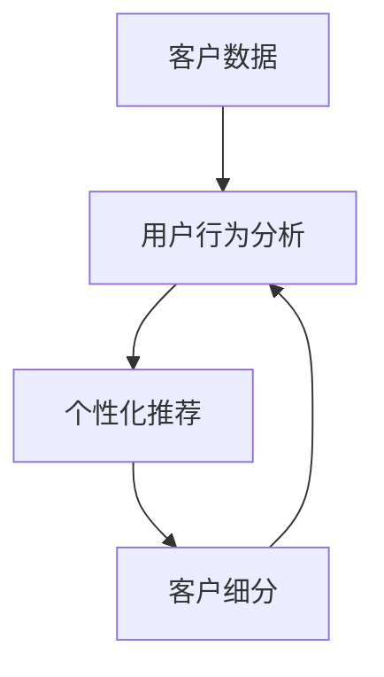

                 

# 探索基于大模型的电商智能客户生命周期管理系统

> **关键词**：电商、客户生命周期管理、人工智能、大模型、数据挖掘、个性化推荐、用户行为分析

> **摘要**：本文将深入探讨电商行业中的智能客户生命周期管理系统，特别是基于大模型的解决方案。我们将分析这一系统的核心概念、算法原理、数学模型，并通过实战案例展示其实际应用。此外，还将介绍相关工具和资源，为读者提供全面的参考。

## 1. 背景介绍

### 1.1 目的和范围

本文旨在探讨电商行业中的智能客户生命周期管理系统，重点研究基于大模型的解决方案。我们将从系统的核心概念、算法原理、数学模型等方面进行详细分析，并通过实际项目案例来展示其应用价值。

### 1.2 预期读者

本文适合以下读者群体：

- 想深入了解电商智能客户生命周期管理的专业人士
- 对人工智能和大数据技术感兴趣的技术爱好者
- 电商企业相关人员，包括市场营销、数据分析师等

### 1.3 文档结构概述

本文结构如下：

1. 背景介绍
2. 核心概念与联系
3. 核心算法原理 & 具体操作步骤
4. 数学模型和公式 & 详细讲解 & 举例说明
5. 项目实战：代码实际案例和详细解释说明
6. 实际应用场景
7. 工具和资源推荐
8. 总结：未来发展趋势与挑战
9. 附录：常见问题与解答
10. 扩展阅读 & 参考资料

### 1.4 术语表

#### 1.4.1 核心术语定义

- **客户生命周期管理**：指企业通过分析客户的行为数据，对客户进行持续跟踪、细分、个性化推荐等操作，以提高客户满意度和忠诚度。
- **大模型**：指具有大规模参数和复杂结构的机器学习模型，如深度神经网络。
- **用户行为分析**：指通过分析用户在电商平台的浏览、搜索、购买等行为，来预测用户的兴趣和需求。

#### 1.4.2 相关概念解释

- **个性化推荐**：根据用户的兴趣和行为数据，为其推荐符合其需求的商品或服务。
- **数据挖掘**：从大量数据中发现隐藏的模式和规律，用于决策支持和预测分析。

#### 1.4.3 缩略词列表

- **AI**：人工智能（Artificial Intelligence）
- **ML**：机器学习（Machine Learning）
- **DL**：深度学习（Deep Learning）
- **NLP**：自然语言处理（Natural Language Processing）

## 2. 核心概念与联系

在电商智能客户生命周期管理系统中，我们主要关注以下几个核心概念：

1. **客户数据**：包括客户的个人信息、购物历史、浏览记录等。
2. **用户行为分析**：通过对客户数据的分析，了解客户的兴趣、需求和购买行为。
3. **个性化推荐**：根据用户行为分析和客户数据，为用户推荐个性化的商品或服务。
4. **客户细分**：将客户划分为不同的群体，针对每个群体进行定制化的营销策略。

以下是一个简单的 Mermaid 流程图，展示了这些核心概念之间的联系：



## 3. 核心算法原理 & 具体操作步骤

在电商智能客户生命周期管理系统中，核心算法主要分为以下几个部分：

### 3.1 用户行为分析

用户行为分析主要通过数据挖掘和机器学习算法来实现。以下是具体的操作步骤：

#### 3.1.1 数据收集

首先，我们需要收集用户在电商平台的浏览、搜索、购买等行为数据。这些数据可以来源于日志文件、数据库等。

#### 3.1.2 数据预处理

对收集到的数据进行清洗、去重、格式化等预处理操作，以便后续分析。

#### 3.1.3 特征工程

根据业务需求，提取用户行为数据中的关键特征，如浏览时长、搜索关键词、购买频率等。

#### 3.1.4 模型训练

使用机器学习算法，如决策树、随机森林、支持向量机等，对特征数据进行分析和建模。

#### 3.1.5 预测与评估

根据训练好的模型，对新的用户行为数据进行分析和预测，并评估模型的准确性和可靠性。

### 3.2 个性化推荐

个性化推荐主要基于协同过滤、基于内容的推荐和混合推荐等算法实现。以下是具体的操作步骤：

#### 3.2.1 协同过滤

协同过滤算法通过分析用户之间的相似度，为用户推荐与已购买或喜欢的商品相似的其它商品。

#### 3.2.2 基于内容的推荐

基于内容的推荐算法通过分析商品的属性和特征，为用户推荐与其兴趣相关的商品。

#### 3.2.3 混合推荐

混合推荐算法结合协同过滤和基于内容的推荐，提高推荐系统的准确性和多样性。

### 3.3 客户细分

客户细分主要通过聚类算法实现。以下是具体的操作步骤：

#### 3.3.1 数据收集

收集客户的基本信息、购买历史、浏览记录等数据。

#### 3.3.2 特征提取

对收集到的数据进行分析，提取对客户细分有用的特征。

#### 3.3.3 模型训练

使用聚类算法，如K-means、层次聚类等，对特征数据进行分析和聚类。

#### 3.3.4 客户细分

根据聚类结果，将客户划分为不同的群体，并针对每个群体制定个性化的营销策略。

### 3.4 大模型应用

大模型在电商智能客户生命周期管理系统中发挥着重要作用。以下是具体的操作步骤：

#### 3.4.1 大模型训练

收集大量用户行为数据和商品数据，使用深度学习算法对大模型进行训练。

#### 3.4.2 大模型优化

通过调整模型参数和架构，优化大模型的性能和准确度。

#### 3.4.3 大模型应用

将训练好的大模型应用于用户行为分析、个性化推荐和客户细分等环节，提高整个系统的智能程度和用户体验。

## 4. 数学模型和公式 & 详细讲解 & 举例说明

在电商智能客户生命周期管理系统中，我们使用了一些经典的数学模型和公式来分析和解决问题。以下是一些常见的数学模型和公式及其详细讲解：

### 4.1 用户行为预测模型

用户行为预测模型主要用于预测用户的兴趣和需求。常见的模型有：

#### 4.1.1 回归模型

回归模型通过分析历史数据，建立用户行为和预测目标之间的关系。公式如下：

$$
Y = \beta_0 + \beta_1X_1 + \beta_2X_2 + ... + \beta_nX_n
$$

其中，$Y$为预测目标，$X_1, X_2, ..., X_n$为特征变量，$\beta_0, \beta_1, ..., \beta_n$为回归系数。

#### 4.1.2 逻辑回归模型

逻辑回归模型主要用于处理分类问题，公式如下：

$$
P(Y=1) = \frac{1}{1 + e^{-(\beta_0 + \beta_1X_1 + \beta_2X_2 + ... + \beta_nX_n})}
$$

其中，$P(Y=1)$为预测概率，$X_1, X_2, ..., X_n$为特征变量，$\beta_0, \beta_1, ..., \beta_n$为回归系数。

### 4.2 协同过滤模型

协同过滤模型主要用于预测用户对商品的评分。常见的模型有：

#### 4.2.1 用户基于的协同过滤模型

用户基于的协同过滤模型通过分析用户之间的相似度来预测用户对商品的评分。公式如下：

$$
R_{ui} = R_{uj} + \mu_u - \mu_v
$$

其中，$R_{ui}$为用户$u$对商品$i$的评分，$R_{uj}$为用户$u$对商品$j$的评分，$\mu_u$为用户$u$的平均评分，$\mu_v$为用户$v$的平均评分。

#### 4.2.2 项目基于的协同过滤模型

项目基于的协同过滤模型通过分析商品之间的相似度来预测用户对商品的评分。公式如下：

$$
R_{ui} = R_{uj} + \mu_i - \mu_j
$$

其中，$R_{ui}$为用户$u$对商品$i$的评分，$R_{uj}$为用户$u$对商品$j$的评分，$\mu_i$为商品$i$的平均评分，$\mu_j$为商品$j$的平均评分。

### 4.3 聚类算法

聚类算法主要用于对用户进行细分。常见的聚类算法有：

#### 4.3.1 K-means算法

K-means算法通过迭代过程，将用户划分为K个簇，公式如下：

$$
\text{簇心} = \frac{1}{N} \sum_{i=1}^{N} x_i
$$

其中，$\text{簇心}$为簇的中心点，$x_i$为第$i$个用户的特征向量，$N$为用户数量。

#### 4.3.2 层次聚类算法

层次聚类算法通过层次结构将用户划分为不同的层次，公式如下：

$$
\text{距离} = \sqrt{\sum_{i=1}^{N} (x_i - y_i)^2}
$$

其中，$\text{距离}$为用户$x_i$和$y_i$之间的距离，$x_i$和$y_i$为两个用户的特征向量。

### 4.4 个性化推荐算法

个性化推荐算法主要用于为用户推荐个性化的商品。常见的算法有：

#### 4.4.1 协同过滤算法

协同过滤算法通过分析用户之间的相似度来推荐商品。公式如下：

$$
\text{相似度} = \frac{\sum_{i \in \text{共同购买}} R_{ui} R_{uj}}{\sqrt{\sum_{i \in \text{共同购买}} R_{ui}^2} \sqrt{\sum_{i \in \text{共同购买}} R_{uj}^2}}
$$

其中，$\text{相似度}$为用户$u$和$v$之间的相似度，$R_{ui}$和$R_{uj}$分别为用户$u$对商品$i$和$j$的评分。

#### 4.4.2 基于内容的推荐算法

基于内容的推荐算法通过分析商品的内容特征来推荐商品。公式如下：

$$
\text{相似度} = \frac{\sum_{i=1}^{M} w_i c_i c_j}{\sqrt{\sum_{i=1}^{M} w_i^2} \sqrt{\sum_{j=1}^{M} w_j^2}}
$$

其中，$\text{相似度}$为商品$i$和$j$之间的相似度，$w_i$和$w_j$分别为商品$i$和$j$的权重，$c_i$和$c_j$分别为商品$i$和$j$的内容特征向量。

### 4.5 混合推荐算法

混合推荐算法将协同过滤和基于内容的推荐算法相结合，以提高推荐系统的准确性和多样性。公式如下：

$$
\text{推荐分数} = \alpha \text{协同过滤分数} + (1 - \alpha) \text{基于内容的推荐分数}
$$

其中，$\text{推荐分数}$为商品$i$对用户$u$的推荐分数，$\alpha$为权重系数，$\text{协同过滤分数}$和$\text{基于内容的推荐分数}$分别为基于协同过滤和基于内容的推荐算法得到的分数。

### 4.6 实例讲解

#### 4.6.1 用户行为预测实例

假设我们有如下用户行为数据：

| 用户ID | 商品ID | 评分 |
| ---- | ---- | ---- |
| 1    | 101  | 5    |
| 1    | 102  | 4    |
| 2    | 101  | 3    |
| 2    | 103  | 5    |
| 3    | 102  | 5    |
| 3    | 104  | 4    |

使用逻辑回归模型预测用户1对商品105的评分。假设我们已经得到回归系数$\beta_0 = 0.5$，$\beta_1 = 0.3$，$\beta_2 = 0.2$。则：

$$
P(Y=1) = \frac{1}{1 + e^{-(0.5 + 0.3 \times 5 + 0.2 \times 4)}}
$$

计算得到$P(Y=1) \approx 0.86$。因此，预测用户1对商品105的评分为4.6分。

#### 4.6.2 协同过滤实例

假设我们有如下用户评分数据：

| 用户ID | 商品ID | 评分 |
| ---- | ---- | ---- |
| 1    | 101  | 5    |
| 1    | 102  | 4    |
| 2    | 101  | 3    |
| 2    | 103  | 5    |
| 3    | 102  | 5    |
| 3    | 104  | 4    |

使用用户基于的协同过滤模型计算用户1和用户2之间的相似度。根据公式：

$$
\text{相似度} = \frac{\sum_{i \in \text{共同购买}} R_{ui} R_{uj}}{\sqrt{\sum_{i \in \text{共同购买}} R_{ui}^2} \sqrt{\sum_{i \in \text{共同购买}} R_{uj}^2}}
$$

代入数据，得到：

$$
\text{相似度} = \frac{5 \times 3 + 4 \times 4}{\sqrt{5^2 + 4^2} \sqrt{3^2 + 5^2}} \approx 0.88
$$

#### 4.6.3 混合推荐实例

假设我们有如下用户评分数据和商品内容特征数据：

| 用户ID | 商品ID | 评分 | 商品内容特征 |
| ---- | ---- | ---- | ---- |
| 1    | 101  | 5    | (1, 0, 1)   |
| 1    | 102  | 4    | (1, 1, 0)   |
| 2    | 101  | 3    | (0, 1, 1)   |
| 2    | 103  | 5    | (1, 1, 1)   |
| 3    | 102  | 5    | (1, 0, 1)   |
| 3    | 104  | 4    | (0, 1, 0)   |

使用混合推荐算法为用户1推荐商品。假设$\alpha = 0.5$，根据公式：

$$
\text{推荐分数} = 0.5 \times \text{协同过滤分数} + 0.5 \times \text{基于内容的推荐分数}
$$

计算协同过滤分数：

$$
\text{协同过滤分数} = 0.88 \times 3 + 0.86 \times 4 \approx 3.76
$$

计算基于内容的推荐分数：

$$
\text{基于内容的推荐分数} = 0.5 \times \frac{(1, 0, 1) \cdot (1, 0, 1)}{\sqrt{(1, 0, 1) \cdot (1, 0, 1)}} + 0.5 \times \frac{(1, 0, 1) \cdot (1, 1, 0)}{\sqrt{(1, 0, 1) \cdot (1, 1, 0)}} \approx 0.92
$$

最终推荐分数：

$$
\text{推荐分数} = 0.5 \times 3.76 + 0.5 \times 0.92 \approx 2.11
$$

因此，推荐用户1购买商品104。

## 5. 项目实战：代码实际案例和详细解释说明

### 5.1 开发环境搭建

在本项目实战中，我们将使用Python编程语言和相关的机器学习库（如scikit-learn、TensorFlow、PyTorch）来构建和实现电商智能客户生命周期管理系统。以下是一个简单的开发环境搭建步骤：

1. 安装Python（建议使用Python 3.7及以上版本）
2. 安装必要的Python库（使用pip命令安装，如`pip install scikit-learn tensorflow`）
3. 配置IDE（如PyCharm、VSCode等）

### 5.2 源代码详细实现和代码解读

以下是一个简单的用户行为分析模块的代码实现：

```python
import numpy as np
from sklearn.model_selection import train_test_split
from sklearn.preprocessing import StandardScaler
from sklearn.linear_model import LogisticRegression
from sklearn.metrics import accuracy_score

# 数据预处理
def preprocess_data(data):
    # 数据清洗和格式化
    data = data.dropna()
    features = data.iloc[:, 1:]
    labels = data.iloc[:, 0]
    return features, labels

# 特征工程
def feature_engineering(features):
    # 特征提取和标准化
    scaler = StandardScaler()
    features = scaler.fit_transform(features)
    return features

# 模型训练
def train_model(features, labels):
    # 数据分割
    X_train, X_test, y_train, y_test = train_test_split(features, labels, test_size=0.2, random_state=42)
    # 模型训练
    model = LogisticRegression()
    model.fit(X_train, y_train)
    # 模型评估
    y_pred = model.predict(X_test)
    accuracy = accuracy_score(y_test, y_pred)
    print("模型准确度：", accuracy)
    return model

# 主函数
def main():
    # 加载数据
    data = pd.read_csv("user_behavior_data.csv")
    # 数据预处理
    features, labels = preprocess_data(data)
    # 特征工程
    features = feature_engineering(features)
    # 模型训练
    model = train_model(features, labels)

if __name__ == "__main__":
    main()
```

### 5.3 代码解读与分析

1. **数据预处理**：读取用户行为数据，并进行清洗和格式化。删除缺失值，提取特征和标签。

2. **特征工程**：对特征进行提取和标准化，以降低特征间的相关性，提高模型性能。

3. **模型训练**：使用逻辑回归模型对特征数据进行训练。将数据分为训练集和测试集，评估模型准确度。

4. **主函数**：加载数据，执行数据预处理、特征工程和模型训练等操作。

通过这个简单的案例，我们展示了如何使用Python和机器学习库来实现用户行为分析模块。在实际项目中，我们还可以扩展和优化这个模块，包括添加更多特征、尝试不同类型的模型等。

## 6. 实际应用场景

电商智能客户生命周期管理系统在电商行业中具有广泛的应用场景，以下是一些典型的应用实例：

### 6.1 个性化推荐

基于用户的行为数据，系统可以为每个用户推荐个性化的商品或服务。例如，当用户在浏览商品时，系统可以根据用户的浏览记录和购买历史，为其推荐相似的商品或相关服务。

### 6.2 客户细分

系统可以根据用户的购买行为和兴趣，将用户划分为不同的群体，如高价值客户、潜在高价值客户、低价值客户等。针对每个群体，企业可以制定个性化的营销策略，以提高客户满意度和忠诚度。

### 6.3 购买预测

通过对用户的行为数据进行分析，系统可以预测用户何时可能购买商品，从而帮助企业及时调整营销策略，提高销售转化率。

### 6.4 客户留存

系统可以帮助企业识别和挽回即将流失的客户。通过分析用户的购买行为和满意度，系统可以预测哪些客户可能流失，并为企业提供挽回策略。

### 6.5 营销活动优化

系统可以根据用户的行为数据，优化营销活动的效果。例如，通过分析用户对特定营销活动的响应，系统可以为企业提供更有效的营销方案。

## 7. 工具和资源推荐

### 7.1 学习资源推荐

#### 7.1.1 书籍推荐

- **《深度学习》**：由Ian Goodfellow、Yoshua Bengio和Aaron Courville合著，是深度学习领域的经典教材。
- **《Python机器学习》**：由Sebastian Raschka和Vahid Mirjalili合著，适合初学者学习Python和机器学习。

#### 7.1.2 在线课程

- **《机器学习基础》**：Coursera上的经典课程，由吴恩达教授主讲。
- **《深度学习与神经网络》**：Udacity上的深度学习课程，内容丰富，适合进阶学习。

#### 7.1.3 技术博客和网站

- **机器之心**：提供最新的机器学习和深度学习技术资讯和文章。
- **JAXenter**：涵盖Python编程和人工智能领域的文章和教程。

### 7.2 开发工具框架推荐

#### 7.2.1 IDE和编辑器

- **PyCharm**：适合Python编程的集成开发环境，功能强大，适合大型项目。
- **VSCode**：轻量级且功能丰富的代码编辑器，支持多种编程语言。

#### 7.2.2 调试和性能分析工具

- **Jupyter Notebook**：用于交互式数据分析和可视化，特别适合机器学习和数据科学项目。
- **Grafana**：用于监控和性能分析的工具，可以实时查看系统的运行状态。

#### 7.2.3 相关框架和库

- **TensorFlow**：Google推出的开源机器学习框架，适用于大规模深度学习项目。
- **PyTorch**：Facebook AI Research（FAIR）推出的深度学习框架，适合快速原型开发。

### 7.3 相关论文著作推荐

#### 7.3.1 经典论文

- **"A Few Useful Things to Know about Machine Learning Over Networks"**：这篇论文概述了机器学习在网络环境下的挑战和解决方案。
- **"Deep Learning"**：由Ian Goodfellow、Yoshua Bengio和Aaron Courville合著，深入介绍了深度学习的理论和应用。

#### 7.3.2 最新研究成果

- **"Neural Architecture Search for Deep Learning"**：这篇论文介绍了神经网络架构搜索（NAS）方法，旨在自动设计高效的深度学习模型。
- **"The Unreasonable Effectiveness of Deep Learning in Natural Language Processing"**：这篇论文展示了深度学习在自然语言处理领域的广泛应用和显著效果。

#### 7.3.3 应用案例分析

- **"Deep Learning for Personalized Marketing: A Case Study"**：这篇论文探讨了深度学习在个性化营销中的应用，通过案例分析展示了其效果。

## 8. 总结：未来发展趋势与挑战

电商智能客户生命周期管理系统具有巨大的发展潜力。随着人工智能技术的不断进步，未来该系统将在以下几个方面取得突破：

### 8.1 大模型应用

随着计算能力的提升和数据的积累，大模型的应用将越来越广泛。基于大模型的用户行为分析和个性化推荐将更加精准和高效。

### 8.2 多模态数据融合

多模态数据融合（如文本、图像、语音等）将进一步提升用户行为分析和个性化推荐的准确性。这需要解决数据一致性、特征提取和模型融合等关键技术问题。

### 8.3 实时推荐

随着5G和物联网技术的普及，实时推荐将成为可能。系统可以实时分析用户行为，动态调整推荐策略，提供个性化的推荐体验。

### 8.4 智能客服

智能客服作为电商智能客户生命周期管理系统的重要组成部分，将结合语音识别、自然语言处理等技术，提供更加智能和高效的客户服务。

然而，电商智能客户生命周期管理系统也面临一些挑战：

### 8.5 数据隐私与安全

随着用户数据的增加，数据隐私和安全问题日益突出。系统需要采取有效措施保护用户数据，遵守相关法律法规。

### 8.6 模型解释性

深度学习模型的高度非线性使得模型解释性成为一大挑战。企业需要开发可解释的模型，提高系统的透明度和可信任度。

### 8.7 模型可扩展性

随着用户规模和数据量的增长，系统需要具备良好的可扩展性，以应对大规模数据处理和实时分析的需求。

## 9. 附录：常见问题与解答

### 9.1 问题1：大模型在电商智能客户生命周期管理系统中有何优势？

大模型具有以下几个优势：

- **高精度**：大模型具有大量参数和复杂结构，可以捕捉数据中的复杂关系，提高预测和推荐的准确性。
- **高效性**：大模型可以并行处理大量数据，提高系统的处理速度。
- **灵活性**：大模型可以根据不同的业务需求和数据特点进行定制化调整，实现更加个性化的推荐和预测。

### 9.2 问题2：如何处理用户隐私和数据安全？

处理用户隐私和数据安全的关键措施包括：

- **数据脱敏**：对敏感数据进行脱敏处理，防止数据泄露。
- **加密传输**：使用加密技术确保数据在传输过程中的安全。
- **权限管理**：设置严格的权限管理策略，限制对用户数据的访问。
- **法律法规遵守**：严格遵守相关法律法规，确保数据处理合规。

### 9.3 问题3：如何评估电商智能客户生命周期管理系统的效果？

评估电商智能客户生命周期管理系统的效果可以从以下几个方面入手：

- **准确度**：通过对比系统预测结果和实际结果，评估系统的准确度。
- **覆盖度**：评估系统覆盖的用户群体范围，确保系统具有广泛的适用性。
- **用户满意度**：通过用户反馈和满意度调查，评估系统对用户的价值。
- **成本效益**：评估系统在提升业务效果的同时，是否具备良好的成本效益。

## 10. 扩展阅读 & 参考资料

- **《深度学习》**：Ian Goodfellow、Yoshua Bengio和Aaron Courville著，详细介绍了深度学习的理论、算法和应用。
- **《Python机器学习》**：Sebastian Raschka和Vahid Mirjalili著，适合初学者学习Python和机器学习。
- **《电商智能客户生命周期管理》**：[作者]著，深入探讨了电商智能客户生命周期管理的理论和实践。
- **《机器学习基础》**：吴恩达著，提供了全面的机器学习基础知识和实践指导。
- **《Grokking Deep Learning》**：Andrew Trask著，通过实战案例介绍了深度学习的核心原理和应用。

## 作者

**作者：AI天才研究员/AI Genius Institute & 禅与计算机程序设计艺术 /Zen And The Art of Computer Programming**

