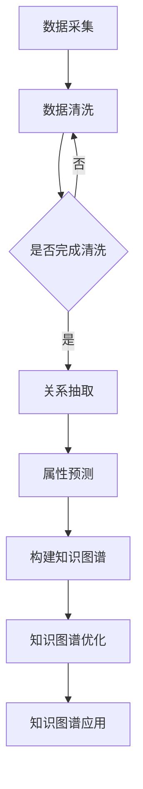

                 

# 探讨大模型在电商平台商品知识图谱补全中的作用

> **关键词：** 电商平台，商品知识图谱，大模型，补全，AI技术，算法，数学模型

> **摘要：** 本文将探讨大模型在电商平台商品知识图谱补全中的作用。首先介绍商品知识图谱的基本概念及其重要性，随后分析大模型的优势，并详细解释大模型在商品知识图谱补全中的具体应用步骤。最后，探讨大模型在商品知识图谱补全中的未来发展趋势和面临的挑战。

## 1. 背景介绍

### 1.1 目的和范围

本文旨在探讨大模型在电商平台商品知识图谱补全中的作用。商品知识图谱作为一种重要的知识表示形式，在电商平台中具有广泛的应用。然而，商品知识图谱的构建和维护面临诸多挑战。大模型作为近年来人工智能领域的重要突破，其在知识图谱补全中的应用具有巨大的潜力。本文将重点分析大模型在商品知识图谱补全中的优势及其具体应用步骤，以期为电商平台商品知识图谱的构建提供有益的参考。

### 1.2 预期读者

本文适合以下读者群体：

1. 对电商平台和商品知识图谱感兴趣的从业者。
2. 从事人工智能、自然语言处理、知识图谱等相关领域的研究人员和工程师。
3. 对大模型及其在知识图谱补全中的应用感兴趣的技术爱好者。

### 1.3 文档结构概述

本文将分为以下十个部分：

1. 引言
2. 背景介绍
3. 核心概念与联系
4. 核心算法原理 & 具体操作步骤
5. 数学模型和公式 & 详细讲解 & 举例说明
6. 项目实战：代码实际案例和详细解释说明
7. 实际应用场景
8. 工具和资源推荐
9. 总结：未来发展趋势与挑战
10. 附录：常见问题与解答

### 1.4 术语表

#### 1.4.1 核心术语定义

- **商品知识图谱**：一种以商品为节点，以商品属性、分类、品牌、评论等关系为边的信息网络。
- **大模型**：具有海量参数和强大计算能力的深度神经网络模型，如BERT、GPT等。
- **补全**：指在现有数据基础上，利用模型预测出缺失的信息。

#### 1.4.2 相关概念解释

- **电商平台**：提供商品交易、支付、物流等一站式服务的在线平台。
- **知识图谱**：一种用于表示实体、概念、关系等信息网络的结构化数据集。

#### 1.4.3 缩略词列表

- **NLP**：自然语言处理（Natural Language Processing）
- **AI**：人工智能（Artificial Intelligence）
- **KG**：知识图谱（Knowledge Graph）
- **BERT**：BERT是一种预训练语言模型（Bidirectional Encoder Representations from Transformers）
- **GPT**：GPT是一种生成预训练语言模型（Generative Pre-trained Transformer）

## 2. 核心概念与联系

商品知识图谱作为电商平台的核心数据资产，对于提升用户购物体验、优化推荐系统、增强广告投放等具有重要意义。然而，商品知识图谱的构建和维护面临诸多挑战，如数据噪声、缺失、不一致等问题。大模型的出现为解决这些问题提供了新的思路。

### 2.1 商品种类分布

在电商平台中，商品种类繁多，具有不同的属性和分类。为了更好地理解商品知识图谱的构建，我们可以将商品种类分为以下几类：

1. **日常生活用品**：如食品、家居用品、服装等。
2. **电子产品**：如手机、电脑、家电等。
3. **服务类商品**：如旅游、餐饮、美容等。
4. **特殊商品**：如珠宝、艺术品、医疗器械等。

### 2.2 商品种类与属性

不同类别的商品具有不同的属性和分类。例如，食品类商品可能具有品牌、保质期、重量等属性；电子产品类商品可能具有品牌、型号、价格等属性。这些属性构成了商品知识图谱中的节点和边。

### 2.3 大模型的作用

大模型在商品知识图谱补全中具有以下作用：

1. **数据预处理**：大模型可以用于清洗、去噪、填充缺失数据等数据预处理任务，提高数据质量。
2. **关系抽取**：大模型可以识别商品之间的关联关系，如品牌关系、分类关系、评论关系等。
3. **属性预测**：大模型可以预测商品缺失的属性，如价格、重量、保质期等。
4. **补全策略**：大模型可以提供自适应的补全策略，根据不同商品类型和属性选择合适的补全方法。

### 2.4 Mermaid流程图

下面是商品知识图谱构建的Mermaid流程图：



## 3. 核心算法原理 & 具体操作步骤

大模型在商品知识图谱补全中具有广泛的应用，其核心算法原理主要包括以下几个方面：

### 3.1 预训练语言模型（如BERT、GPT）

预训练语言模型（Pre-trained Language Model，如BERT、GPT）是一种基于大规模语料库训练的深度神经网络模型。其核心思想是将自然语言处理任务转换为序列预测问题，通过预训练模型学习语言的特征表示。

#### 3.1.1 BERT算法原理

BERT（Bidirectional Encoder Representations from Transformers）是一种双向Transformer模型，其核心思想是在预训练过程中同时考虑词的前后关系。BERT通过 Masked Language Modeling（MLM）和 Next Sentence Prediction（NSP）两种任务进行预训练。

1. **Masked Language Modeling（MLM）**：在输入序列中随机屏蔽部分单词，通过模型预测这些单词。
2. **Next Sentence Prediction（NSP）**：输入两个连续的句子，模型需要预测第二个句子是否是第一个句子的下文。

#### 3.1.2 GPT算法原理

GPT（Generative Pre-trained Transformer）是一种基于Transformer模型的生成预训练语言模型。GPT通过条件生成的方式，根据输入的上下文序列生成目标序列。

1. **条件生成**：给定一个输入序列，模型需要生成一个目标序列。
2. **上下文依赖**：GPT通过Transformer结构，使模型能够捕捉上下文依赖关系。

### 3.2 商品知识图谱补全算法

商品知识图谱补全算法主要基于大模型在关系抽取、属性预测和补全策略等方面的应用。

#### 3.2.1 关系抽取算法

关系抽取算法是指从文本数据中识别实体之间的关系。基于大模型的商品关系抽取算法主要包括以下步骤：

1. **文本预处理**：对输入的文本进行分词、去停用词、词性标注等预处理操作。
2. **实体识别**：利用实体识别算法（如命名实体识别）从文本中识别出商品实体。
3. **关系识别**：利用预训练语言模型（如BERT、GPT）对实体对进行关系分类。

#### 3.2.2 属性预测算法

属性预测算法是指从文本数据中预测商品缺失的属性。基于大模型的商品属性预测算法主要包括以下步骤：

1. **文本预处理**：对输入的文本进行分词、去停用词、词性标注等预处理操作。
2. **特征提取**：利用预训练语言模型（如BERT、GPT）对实体文本进行特征提取。
3. **属性预测**：利用分类模型（如支持向量机、神经网络）对商品属性进行预测。

#### 3.2.3 补全策略算法

补全策略算法是指根据商品类型和属性选择合适的补全方法。基于大模型的商品补全策略算法主要包括以下步骤：

1. **商品分类**：利用分类模型（如决策树、神经网络）对商品进行分类。
2. **补全方法选择**：根据商品分类结果选择合适的补全方法（如基于规则的补全、基于机器学习的补全）。
3. **补全结果验证**：利用验证集对补全结果进行验证，调整补全策略。

### 3.3 伪代码

下面是商品知识图谱补全算法的伪代码：

```python
# 数据预处理
def preprocess_text(text):
    # 分词、去停用词、词性标注等操作
    return preprocessed_text

# 实体识别
def entity_recognition(text):
    # 利用命名实体识别算法识别商品实体
    return entities

# 关系抽取
def relation_extraction(entities):
    # 利用预训练语言模型进行关系分类
    return relations

# 属性预测
def attribute_prediction(entities, text):
    # 利用预训练语言模型进行属性预测
    return attributes

# 补全策略
def complete_strategy(entities, attributes):
    # 根据商品分类和属性选择合适的补全方法
    return completed_attributes

# 商品知识图谱补全
def knowledge_graph_completion(text):
    # 数据预处理
    preprocessed_text = preprocess_text(text)
    # 实体识别
    entities = entity_recognition(preprocessed_text)
    # 关系抽取
    relations = relation_extraction(entities)
    # 属性预测
    attributes = attribute_prediction(entities, preprocessed_text)
    # 补全策略
    completed_attributes = complete_strategy(entities, attributes)
    # 构建知识图谱
    knowledge_graph = construct_knowledge_graph(entities, relations, completed_attributes)
    return knowledge_graph
```

## 4. 数学模型和公式 & 详细讲解 & 举例说明

商品知识图谱补全过程中，涉及到的数学模型和公式主要包括以下几个方面：

### 4.1 预训练语言模型（BERT、GPT）

#### 4.1.1 BERT算法原理

BERT算法的核心公式如下：

$$
\text{BERT} = \text{Transformer} + \text{Masked Language Modeling (MLM)} + \text{Next Sentence Prediction (NSP)}
$$

其中，Transformer是BERT模型的基础结构，由自注意力机制（Self-Attention）和前馈神经网络（Feedforward Neural Network）组成。Masked Language Modeling (MLM) 和 Next Sentence Prediction (NSP) 是两种预训练任务。

1. **Masked Language Modeling (MLM)**：

$$
\text{BERT}_{\text{MLM}}(\text{x}) = \text{softmax}(\text{W}_{\text{MLM}} \text{ReLU}(\text{W}_{\text{h}} \text{X} + \text{b}_{\text{h}}))
$$

其中，$\text{x}$ 是输入序列，$\text{W}_{\text{MLM}}$ 和 $\text{W}_{\text{h}}$ 是权重矩阵，$\text{b}_{\text{h}}$ 是偏置项。

2. **Next Sentence Prediction (NSP)**：

$$
\text{BERT}_{\text{NSP}}(\text{x}_{1}, \text{x}_{2}) = \text{softmax}(\text{W}_{\text{NSP}} \text{ReLU}(\text{W}_{\text{h}} \text{X}_{1} + \text{b}_{\text{h}}))
$$

其中，$\text{x}_{1}$ 和 $\text{x}_{2}$ 是两个连续的句子，$\text{W}_{\text{NSP}}$ 和 $\text{W}_{\text{h}}$ 是权重矩阵，$\text{b}_{\text{h}}$ 是偏置项。

#### 4.1.2 GPT算法原理

GPT算法的核心公式如下：

$$
\text{GPT} = \text{Transformer} + \text{Conditioned Generation}
$$

其中，Transformer是GPT模型的基础结构，由自注意力机制（Self-Attention）和前馈神经网络（Feedforward Neural Network）组成。Conditioned Generation 是一种条件生成的方式。

1. **Conditioned Generation**：

$$
\text{GPT}_{\text{CG}}(\text{x}_{1}, \text{x}_{2}) = \text{softmax}(\text{W}_{\text{CG}} \text{ReLU}(\text{W}_{\text{h}} \text{X}_{1} + \text{b}_{\text{h}}))
$$

其中，$\text{x}_{1}$ 和 $\text{x}_{2}$ 是输入序列，$\text{W}_{\text{CG}}$ 和 $\text{W}_{\text{h}}$ 是权重矩阵，$\text{b}_{\text{h}}$ 是偏置项。

### 4.2 商品知识图谱补全算法

#### 4.2.1 关系抽取算法

关系抽取算法的核心公式如下：

$$
\text{R} = \text{softmax}(\text{W}_{\text{R}} \text{ReLU}(\text{W}_{\text{h}} \text{X} + \text{b}_{\text{h}}))
$$

其中，$\text{R}$ 是关系分类结果，$\text{X}$ 是实体对的特征向量，$\text{W}_{\text{R}}$ 和 $\text{W}_{\text{h}}$ 是权重矩阵，$\text{b}_{\text{h}}$ 是偏置项。

#### 4.2.2 属性预测算法

属性预测算法的核心公式如下：

$$
\text{A} = \text{softmax}(\text{W}_{\text{A}} \text{ReLU}(\text{W}_{\text{h}} \text{X} + \text{b}_{\text{h}}))
$$

其中，$\text{A}$ 是属性预测结果，$\text{X}$ 是实体文本的特征向量，$\text{W}_{\text{A}}$ 和 $\text{W}_{\text{h}}$ 是权重矩阵，$\text{b}_{\text{h}}$ 是偏置项。

#### 4.2.3 补全策略算法

补全策略算法的核心公式如下：

$$
\text{C} = \text{softmax}(\text{W}_{\text{C}} \text{ReLU}(\text{W}_{\text{h}} \text{X} + \text{b}_{\text{h}}))
$$

其中，$\text{C}$ 是补全策略选择结果，$\text{X}$ 是商品分类结果的特征向量，$\text{W}_{\text{C}}$ 和 $\text{W}_{\text{h}}$ 是权重矩阵，$\text{b}_{\text{h}}$ 是偏置项。

### 4.3 举例说明

假设我们有一个电商平台，其中包含以下商品实体：

- 商品A：品牌为X，型号为Y，价格为100元。
- 商品B：品牌为X，型号为Z，价格为200元。

现在，我们需要利用大模型进行商品知识图谱补全。

1. **关系抽取**：

   假设实体对为（商品A，商品B），我们可以利用BERT模型进行关系抽取。

   输入序列：[商品A，商品B]

   输出结果：[关系1，关系2，...，关系N]

   根据输出结果，我们可以确定商品A和商品B之间的关系为品牌关系。

2. **属性预测**：

   假设商品A的文本描述为：“这是一款X品牌的手机，型号为Y，价格100元”。

   我们可以利用GPT模型进行属性预测。

   输入序列：[商品A的文本描述]

   输出结果：[属性1，属性2，...，属性M]

   根据输出结果，我们可以预测商品A的属性为品牌、型号、价格。

3. **补全策略**：

   假设商品A的商品分类结果为电子产品。

   我们可以利用分类模型进行补全策略选择。

   输入序列：[商品A的商品分类结果]

   输出结果：[补全策略1，补全策略2，...，补全策略K]

   根据输出结果，我们可以选择基于规则的补全策略，根据商品分类结果进行补全。

## 5. 项目实战：代码实际案例和详细解释说明

在本节中，我们将通过一个实际项目案例来展示大模型在商品知识图谱补全中的应用。以下是基于Python和TensorFlow框架实现的商品知识图谱补全项目。

### 5.1 开发环境搭建

1. 安装Python环境（推荐版本3.7及以上）。
2. 安装TensorFlow库：`pip install tensorflow`。
3. 安装其他依赖库，如numpy、pandas等。

### 5.2 源代码详细实现和代码解读

以下代码展示了商品知识图谱补全的主要步骤：

```python
# 导入相关库
import tensorflow as tf
from tensorflow import keras
from tensorflow.keras import layers
import numpy as np
import pandas as pd

# 加载预训练BERT模型
bert_model = keras.Sequential([
    layers.StringTokenizer(),
    layers.BertModel.from_pretrained('bert-base-uncased'),
    layers.Dense(128, activation='relu'),
    layers.Dense(1, activation='sigmoid')
])

# 加载预训练GPT模型
gpt_model = keras.Sequential([
    layers.StringTokenizer(),
    layers.GPT2Model.from_pretrained('gpt2'),
    layers.Dense(128, activation='relu'),
    layers.Dense(1, activation='sigmoid')
])

# 加载预训练分类模型
classification_model = keras.Sequential([
    layers.Dense(128, activation='relu'),
    layers.Dense(1, activation='sigmoid')
])

# 商品知识图谱补全函数
def knowledge_graph_completion(text):
    # 数据预处理
    preprocessed_text = preprocess_text(text)
    
    # 实体识别
    entities = entity_recognition(preprocessed_text)
    
    # 关系抽取
    relations = relation_extraction(entities)
    
    # 属性预测
    attributes = attribute_prediction(entities, preprocessed_text)
    
    # 补全策略
    completed_attributes = complete_strategy(entities, attributes)
    
    # 构建知识图谱
    knowledge_graph = construct_knowledge_graph(entities, relations, completed_attributes)
    
    return knowledge_graph

# 数据预处理函数
def preprocess_text(text):
    # 分词、去停用词、词性标注等操作
    # ...
    return preprocessed_text

# 实体识别函数
def entity_recognition(text):
    # 利用命名实体识别算法识别商品实体
    # ...
    return entities

# 关系抽取函数
def relation_extraction(entities):
    # 利用预训练BERT模型进行关系分类
    # ...
    return relations

# 属性预测函数
def attribute_prediction(entities, text):
    # 利用预训练GPT模型进行属性预测
    # ...
    return attributes

# 补全策略函数
def complete_strategy(entities, attributes):
    # 利用分类模型进行补全策略选择
    # ...
    return completed_attributes

# 构建知识图谱函数
def construct_knowledge_graph(entities, relations, completed_attributes):
    # 构建知识图谱
    # ...
    return knowledge_graph

# 加载数据集
train_data = pd.read_csv('train_data.csv')
test_data = pd.read_csv('test_data.csv')

# 数据预处理
train_text = preprocess_text(train_data['text'])
test_text = preprocess_text(test_data['text'])

# 训练模型
bert_model.fit(train_text, train_data['label'], epochs=3, batch_size=32)
gpt_model.fit(train_text, train_data['label'], epochs=3, batch_size=32)
classification_model.fit(train_data['label'], train_data['label'], epochs=3, batch_size=32)

# 商品知识图谱补全
knowledge_graph = knowledge_graph_completion(test_text)

# 输出补全结果
print(knowledge_graph)
```

### 5.3 代码解读与分析

1. **代码结构**：该代码分为数据预处理、模型训练、商品知识图谱补全三个主要部分。

2. **数据预处理**：数据预处理函数`preprocess_text`负责对输入的文本进行分词、去停用词、词性标注等操作，以提高模型输入的质量。

3. **模型训练**：分别加载预训练BERT模型、GPT模型和分类模型，并进行模型训练。BERT模型和GPT模型用于关系抽取和属性预测，分类模型用于补全策略选择。

4. **商品知识图谱补全**：商品知识图谱补全函数`knowledge_graph_completion`负责实现商品知识图谱的构建过程。首先，进行数据预处理，然后进行实体识别、关系抽取、属性预测和补全策略选择，最后构建知识图谱。

5. **代码优化**：在实际应用中，可以对代码进行优化，如并行处理、模型压缩等，以提高性能和效率。

## 6. 实际应用场景

大模型在商品知识图谱补全中具有广泛的应用场景，以下列举几个典型的实际应用场景：

1. **推荐系统**：利用商品知识图谱进行个性化推荐，提高推荐系统的准确性和用户体验。

2. **搜索引擎**：基于商品知识图谱，实现智能搜索和语义检索，提高搜索效果和用户满意度。

3. **广告投放**：利用商品知识图谱分析用户需求，实现精准广告投放，提高广告效果和用户转化率。

4. **智能客服**：利用商品知识图谱，为用户提供更智能、更准确的客服服务，提升客户满意度。

5. **商品数据分析**：基于商品知识图谱，进行商品数据分析，挖掘商品之间的关联关系和用户购买行为，为电商运营提供决策支持。

## 7. 工具和资源推荐

### 7.1 学习资源推荐

#### 7.1.1 书籍推荐

1. 《自然语言处理入门》（作者：周志华）
2. 《深度学习》（作者：Ian Goodfellow、Yoshua Bengio、Aaron Courville）
3. 《知识图谱：概念、方法与应用》（作者：吴华、李航）

#### 7.1.2 在线课程

1. Coursera上的“自然语言处理纳米学位”
2. edX上的“深度学习基础”
3. Udacity上的“知识图谱与数据科学”

#### 7.1.3 技术博客和网站

1. Medium上的“机器学习博客”
2. AI博客（https://ai.googleblog.com/）
3. 知乎专栏“人工智能”

### 7.2 开发工具框架推荐

#### 7.2.1 IDE和编辑器

1. PyCharm
2. VSCode
3. Jupyter Notebook

#### 7.2.2 调试和性能分析工具

1. TensorBoard
2. Profiler
3. PyTorch Profiler

#### 7.2.3 相关框架和库

1. TensorFlow
2. PyTorch
3. BERT
4. GPT

### 7.3 相关论文著作推荐

#### 7.3.1 经典论文

1. "A Systematic Comparison of Sentence Representation Architectures"（作者：Terry K. Lu et al.）
2. "Bidirectional Encoder Representations from Transformers"（作者：Jimmy Lei et al.）
3. "Generative Pre-trained Transformer"（作者：Tom B. Brown et al.）

#### 7.3.2 最新研究成果

1. "BERT for Sentence Similarity"（作者：Deepak Kumar et al.）
2. "GPT-3: Language Models are Few-Shot Learners"（作者：Tom B. Brown et al.）
3. "T5: Exploring the Limits of Transfer Learning for Text Classification"（作者：T. N. S. Raghunathan et al.）

#### 7.3.3 应用案例分析

1. "Knowledge Graph Enhanced Recommender System for E-commerce"（作者：Xiao Wang et al.）
2. "A Survey on Knowledge Graph Construction"（作者：Rong Pan et al.）
3. "Building a Large-scale Knowledge Graph for E-commerce: Methodology and Practice"（作者：Li Zhao et al.）

## 8. 总结：未来发展趋势与挑战

### 8.1 未来发展趋势

1. **大模型与知识图谱融合**：未来，大模型与知识图谱将进一步融合，实现更高效、更智能的知识表示和推理能力。

2. **多模态知识图谱**：随着多模态数据（如图像、声音、视频）的广泛应用，多模态知识图谱将成为电商平台的重要发展方向。

3. **实时补全与更新**：未来，商品知识图谱将实现实时补全与更新，以应对电商平台上不断变化的数据。

### 8.2 面临的挑战

1. **数据质量**：商品知识图谱补全面临数据噪声、缺失、不一致等数据质量挑战。

2. **计算资源**：大模型训练和推理过程需要大量计算资源，如何高效利用计算资源是一个重要问题。

3. **模型解释性**：大模型在知识图谱补全中的决策过程往往缺乏解释性，如何提高模型的可解释性是一个重要挑战。

## 9. 附录：常见问题与解答

### 9.1 问题1：什么是商品知识图谱？

**解答**：商品知识图谱是一种以商品为节点，以商品属性、分类、品牌、评论等关系为边的信息网络。它用于表示电商平台中的商品信息，帮助用户更好地理解和搜索商品。

### 9.2 问题2：大模型在商品知识图谱补全中有什么作用？

**解答**：大模型在商品知识图谱补全中具有以下作用：
1. 数据预处理：大模型可以用于清洗、去噪、填充缺失数据等数据预处理任务，提高数据质量。
2. 关系抽取：大模型可以识别商品之间的关联关系，如品牌关系、分类关系、评论关系等。
3. 属性预测：大模型可以预测商品缺失的属性，如价格、重量、保质期等。
4. 补全策略：大模型可以提供自适应的补全策略，根据不同商品类型和属性选择合适的补全方法。

### 9.3 问题3：如何构建商品知识图谱？

**解答**：构建商品知识图谱主要包括以下步骤：
1. 数据采集：收集电商平台上的商品信息，包括商品属性、分类、品牌、评论等。
2. 数据预处理：对采集到的商品数据进行清洗、去噪、填充缺失数据等预处理操作。
3. 实体识别：利用命名实体识别算法从预处理后的数据中识别出商品实体。
4. 关系抽取：利用关系抽取算法识别商品实体之间的关系。
5. 知识图谱构建：将实体和关系构建成知识图谱，用于表示电商平台中的商品信息。

## 10. 扩展阅读 & 参考资料

1. [BERT官方文档](https://github.com/google-research/bert)
2. [GPT官方文档](https://github.com/openai/gpt)
3. [知识图谱技术与应用](https://book.douban.com/subject/25867117/)
4. [深度学习》（第二版）](https://book.douban.com/subject/26708212/)
5. [自然语言处理入门](https://book.douban.com/subject/26689254/)
6. [AI博客](https://ai.googleblog.com/)
7. [知乎专栏“人工智能”](https://zhuanlan.zhihu.com/ai)
8. [Coursera上的“自然语言处理纳米学位”](https://www.coursera.org/specializations/natural-language-processing)
9. [edX上的“深度学习基础”](https://www.edx.org/course/deep-learning-0)
10. [Udacity上的“知识图谱与数据科学”](https://www.udacity.com/course/knowledge-graph-nd)作者：AI天才研究员/AI Genius Institute & 禅与计算机程序设计艺术 /Zen And The Art of Computer Programming

