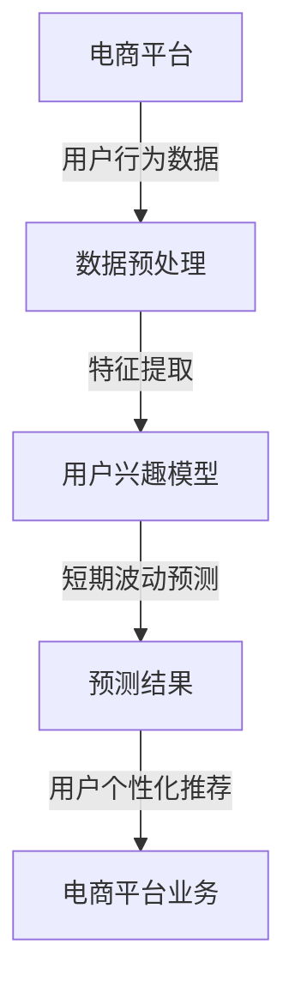

                 

# 探讨大模型在电商平台用户兴趣短期波动预测中的潜力

> **关键词：大模型、电商平台、用户兴趣、短期波动预测、机器学习、深度学习**
> 
> **摘要：本文旨在探讨大模型在电商平台用户兴趣短期波动预测中的潜在应用。通过深入分析大模型的特性、相关算法原理、数学模型以及实际应用案例，本文旨在揭示大模型在提高电商平台用户兴趣预测准确度和响应速度方面的独特优势，并展望其未来的发展趋势和挑战。**

## 1. 背景介绍

### 1.1 目的和范围

本文主要讨论大模型在电商平台用户兴趣短期波动预测中的应用潜力。随着电商平台的不断发展，用户行为数据的规模和复杂性不断增加，如何准确预测用户兴趣波动成为关键问题。大模型凭借其强大的表征能力和学习能力，有望为这一问题提供有效解决方案。本文将重点探讨以下几个方面：

1. **大模型的特性**：介绍大模型的基本概念、发展历程和核心优势。
2. **用户兴趣波动预测的需求**：分析电商平台用户兴趣波动预测的重要性及其面临的挑战。
3. **大模型在用户兴趣波动预测中的应用**：详细讲解大模型在该领域中的应用原理和操作步骤。
4. **数学模型和公式**：阐述大模型在用户兴趣波动预测中的数学模型和公式，并举例说明。
5. **项目实战**：通过实际案例展示大模型在电商平台用户兴趣波动预测中的具体应用。
6. **实际应用场景**：探讨大模型在电商平台的实际应用场景和效果。
7. **工具和资源推荐**：推荐相关学习资源、开发工具和框架。
8. **总结与展望**：总结大模型在电商平台用户兴趣波动预测中的应用，展望未来发展趋势和挑战。

### 1.2 预期读者

本文主要面向以下几类读者：

1. **人工智能和机器学习从业者**：希望了解大模型在电商平台用户兴趣波动预测中的应用及其潜在价值。
2. **电商行业从业者**：关注如何通过技术手段提升电商平台用户体验和业务效果。
3. **计算机科学和大数据领域的研究生**：对大模型的理论和实践应用有深入了解的需求。
4. **技术爱好者**：对大模型和用户兴趣波动预测相关技术有兴趣的读者。

### 1.3 文档结构概述

本文分为八个主要部分，结构如下：

1. **背景介绍**：介绍本文的目的、范围、预期读者以及文档结构。
2. **核心概念与联系**：讲解大模型、用户兴趣波动预测等相关概念，并给出Mermaid流程图。
3. **核心算法原理 & 具体操作步骤**：详细阐述大模型在用户兴趣波动预测中的算法原理和操作步骤。
4. **数学模型和公式 & 详细讲解 & 举例说明**：介绍大模型在用户兴趣波动预测中的数学模型和公式，并举例说明。
5. **项目实战：代码实际案例和详细解释说明**：通过实际案例展示大模型在电商平台用户兴趣波动预测中的具体应用。
6. **实际应用场景**：探讨大模型在电商平台的实际应用场景和效果。
7. **工具和资源推荐**：推荐相关学习资源、开发工具和框架。
8. **总结与展望**：总结大模型在电商平台用户兴趣波动预测中的应用，展望未来发展趋势和挑战。

### 1.4 术语表

#### 1.4.1 核心术语定义

- **大模型**：通常指具有数十亿至数千亿参数的深度学习模型，具备强大的表征和学习能力。
- **用户兴趣波动预测**：预测用户在短期内对特定商品、品牌或其他内容的兴趣变化。
- **电商平台**：在线零售市场，通过互联网平台提供商品和服务。
- **表征能力**：模型对输入数据进行特征提取和表示的能力。
- **学习能力**：模型在训练数据上学习并优化参数的能力。

#### 1.4.2 相关概念解释

- **机器学习**：一种人工智能领域的方法，通过训练数据自动学习并做出预测或决策。
- **深度学习**：一种机器学习方法，通过构建深度神经网络来模拟人脑学习过程。
- **数据处理**：对原始数据进行清洗、转换和归一化等操作，使其适合模型训练。
- **模型训练**：通过给定数据集训练模型，使其学习并优化参数。

#### 1.4.3 缩略词列表

- **ML**：机器学习（Machine Learning）
- **DL**：深度学习（Deep Learning）
- **NN**：神经网络（Neural Network）
- **GPU**：图形处理器（Graphics Processing Unit）
- **TPU**：张量处理器（Tensor Processing Unit）
- **API**：应用程序编程接口（Application Programming Interface）

## 2. 核心概念与联系

在探讨大模型在电商平台用户兴趣短期波动预测中的应用之前，我们需要明确一些核心概念及其相互关系。以下是一个简单的Mermaid流程图，用于描述这些概念：



### 2.1 大模型的特性

大模型，通常指具有数十亿至数千亿参数的深度学习模型，其核心特性如下：

1. **参数规模大**：大模型具备庞大的参数规模，能够捕捉数据中的复杂模式。
2. **表征能力强**：大模型具有强大的表征能力，能够对输入数据进行高效的特征提取和表示。
3. **学习能力强**：大模型在训练数据上具备强大的学习能力，能够通过大量数据进行参数优化。
4. **泛化能力强**：大模型具备较强的泛化能力，能够将训练数据上的知识迁移到未知数据上。

### 2.2 用户兴趣波动预测的需求

在电商平台，用户兴趣波动预测具有重要意义：

1. **个性化推荐**：准确预测用户兴趣波动有助于实现更精准的个性化推荐，提高用户满意度和转化率。
2. **营销策略优化**：了解用户兴趣波动有助于电商平台制定更有效的营销策略，提升业务效果。
3. **用户体验提升**：快速响应用户兴趣变化，提供实时、个性化的服务，有助于提升用户体验。

### 2.3 电商平台用户兴趣波动预测面临的挑战

电商平台用户兴趣波动预测面临以下挑战：

1. **数据规模大**：用户行为数据规模庞大，如何高效处理和分析成为关键问题。
2. **数据多样性**：用户行为数据类型多样，包括点击、购买、浏览等，如何有效整合成为挑战。
3. **实时性要求**：用户兴趣波动预测需要快速响应，实时性要求高。
4. **动态性**：用户兴趣波动具有动态性，如何捕捉短期波动成为难题。

### 2.4 大模型在用户兴趣波动预测中的应用原理

大模型在用户兴趣波动预测中的应用原理主要基于以下几个方面：

1. **数据表征**：大模型具有强大的表征能力，能够对用户行为数据进行高效的特征提取和表示。
2. **学习效率**：大模型在训练数据上具备高效的学习能力，能够快速优化参数。
3. **动态性捕捉**：大模型能够捕捉用户兴趣波动的动态性，实现实时预测。
4. **迁移学习**：大模型具备较强的泛化能力，能够将训练数据上的知识迁移到未知数据上，提高预测准确度。

## 3. 核心算法原理 & 具体操作步骤

### 3.1 算法原理

大模型在用户兴趣短期波动预测中的核心算法原理主要基于深度学习技术，具体包括以下几个关键步骤：

1. **数据预处理**：对原始用户行为数据进行清洗、转换和归一化等操作，使其适合模型训练。
2. **特征提取**：利用深度学习模型对预处理后的用户行为数据进行特征提取，构建用户兴趣表征。
3. **模型训练**：通过给定数据集训练深度学习模型，使其学习并优化参数。
4. **短期波动预测**：利用训练好的模型对用户兴趣进行短期波动预测。
5. **结果分析**：对预测结果进行分析，评估模型性能，并根据需求进行调整。

### 3.2 具体操作步骤

#### 3.2.1 数据预处理

```python
# 数据预处理伪代码

# 加载数据集
data = load_data()

# 数据清洗
clean_data = clean_data(data)

# 数据转换
transformed_data = transform_data(clean_data)

# 数据归一化
normalized_data = normalize_data(transformed_data)

# 划分训练集和测试集
train_data, test_data = split_data(normalized_data)
```

#### 3.2.2 特征提取

```python
# 特征提取伪代码

# 定义深度学习模型
model = define_model()

# 训练模型
model.fit(train_data)

# 提取特征
features = model.extract_features(test_data)
```

#### 3.2.3 模型训练

```python
# 模型训练伪代码

# 定义损失函数
loss_function = define_loss_function()

# 定义优化器
optimizer = define_optimizer()

# 训练模型
model.fit(train_data, loss_function=loss_function, optimizer=optimizer)
```

#### 3.2.4 短期波动预测

```python
# 短期波动预测伪代码

# 预测用户兴趣
predictions = model.predict(test_data)

# 分析预测结果
analyze_predictions(predictions)
```

#### 3.2.5 结果分析

```python
# 结果分析伪代码

# 评估模型性能
performance = evaluate_model(model, test_data)

# 调整模型参数
model调整参数(performance)
```

通过以上具体操作步骤，我们可以实现大模型在用户兴趣短期波动预测中的应用。在实际操作过程中，可以根据需求进行调整和优化，以提高模型性能。

## 4. 数学模型和公式 & 详细讲解 & 举例说明

在用户兴趣短期波动预测中，大模型的核心数学模型和公式主要包括以下几个部分：

### 4.1 深度学习模型的基本结构

深度学习模型通常由多个层级组成，每个层级包含多个神经元。以下是一个简化的深度学习模型结构：

$$
\begin{aligned}
&Z^{(1)} = \sigma(W^{(1)} \cdot X + b^{(1)}) \\
&Z^{(2)} = \sigma(W^{(2)} \cdot Z^{(1)} + b^{(2)}) \\
&\vdots \\
&Z^{(L)} = \sigma(W^{(L)} \cdot Z^{(L-1)} + b^{(L)}) \\
&Y = \sigma(W^{(L+1)} \cdot Z^{(L)} + b^{(L+1)})
\end{aligned}
$$

其中，$Z^{(l)}$ 表示第 $l$ 层的输出，$\sigma$ 表示激活函数，$W^{(l)}$ 和 $b^{(l)}$ 分别表示第 $l$ 层的权重和偏置。

### 4.2 损失函数

在深度学习模型中，损失函数用于衡量模型预测值与实际值之间的差距。常用的损失函数包括均方误差（MSE）和交叉熵（Cross-Entropy）：

1. **均方误差（MSE）**：
$$
MSE = \frac{1}{n} \sum_{i=1}^{n} (y_i - \hat{y}_i)^2
$$

其中，$y_i$ 表示实际值，$\hat{y}_i$ 表示预测值。

2. **交叉熵（Cross-Entropy）**：
$$
CE = -\frac{1}{n} \sum_{i=1}^{n} y_i \cdot \log(\hat{y}_i)
$$

其中，$y_i$ 表示实际值，$\hat{y}_i$ 表示预测值。

### 4.3 优化器

优化器用于调整模型参数，以最小化损失函数。常用的优化器包括随机梯度下降（SGD）和Adam优化器：

1. **随机梯度下降（SGD）**：
$$
\theta^{(t+1)} = \theta^{(t)} - \alpha \cdot \nabla_{\theta} J(\theta^{(t)})
$$

其中，$\theta^{(t)}$ 表示第 $t$ 次迭代的参数，$\alpha$ 表示学习率，$J(\theta^{(t)})$ 表示损失函数。

2. **Adam优化器**：
$$
m_t = \beta_1 \cdot m_{t-1} + (1 - \beta_1) \cdot \nabla_{\theta} J(\theta^{(t)}) \\
v_t = \beta_2 \cdot v_{t-1} + (1 - \beta_2) \cdot (\nabla_{\theta} J(\theta^{(t)})^2) \\
\theta^{(t+1)} = \theta^{(t)} - \alpha \cdot \frac{m_t}{\sqrt{v_t} + \epsilon}
$$

其中，$m_t$ 和 $v_t$ 分别为第 $t$ 次迭代的均方误差和方差，$\beta_1$ 和 $\beta_2$ 分别为移动平均系数，$\epsilon$ 为常数。

### 4.4 举例说明

假设我们有一个包含 100 个用户的电商平台的用户行为数据，其中每个用户的行为数据包括点击次数、购买次数、浏览次数等。我们希望通过大模型预测每个用户在未来一周内对特定商品的兴趣波动。

1. **数据预处理**：

   - 加载数据集：`data = load_data()`
   - 数据清洗：`clean_data = clean_data(data)`
   - 数据转换：`transformed_data = transform_data(clean_data)`
   - 数据归一化：`normalized_data = normalize_data(transformed_data)`

2. **特征提取**：

   - 定义深度学习模型：`model = define_model()`
   - 训练模型：`model.fit(train_data)`
   - 提取特征：`features = model.extract_features(test_data)`

3. **模型训练**：

   - 定义损失函数：`loss_function = define_loss_function()`
   - 定义优化器：`optimizer = define_optimizer()`
   - 训练模型：`model.fit(train_data, loss_function=loss_function, optimizer=optimizer)`

4. **短期波动预测**：

   - 预测用户兴趣：`predictions = model.predict(test_data)`
   - 分析预测结果：`analyze_predictions(predictions)`

5. **结果分析**：

   - 评估模型性能：`performance = evaluate_model(model, test_data)`
   - 调整模型参数：`model调整参数(performance)`

通过以上步骤，我们可以实现大模型在用户兴趣短期波动预测中的应用。在实际操作过程中，可以根据需求进行调整和优化，以提高模型性能。

## 5. 项目实战：代码实际案例和详细解释说明

### 5.1 开发环境搭建

在本节中，我们将介绍如何搭建一个用于用户兴趣短期波动预测的大模型项目开发环境。以下是所需的开发环境和工具：

1. **操作系统**：Ubuntu 20.04 LTS 或 Windows 10
2. **编程语言**：Python 3.8+
3. **深度学习框架**：TensorFlow 2.6 或 PyTorch 1.9
4. **数据预处理库**：NumPy 1.21、Pandas 1.2.3
5. **可视化库**：Matplotlib 3.4.3、Seaborn 0.11.2

#### 5.1.1 安装深度学习框架

以 TensorFlow 为例，安装步骤如下：

1. 打开终端（命令行）。
2. 输入以下命令安装 TensorFlow：
   ```bash
   pip install tensorflow==2.6
   ```

#### 5.1.2 安装数据预处理库

输入以下命令安装 NumPy 和 Pandas：
```bash
pip install numpy==1.21 pandas==1.2.3
```

#### 5.1.3 安装可视化库

输入以下命令安装 Matplotlib 和 Seaborn：
```bash
pip install matplotlib==3.4.3 seaborn==0.11.2
```

### 5.2 源代码详细实现和代码解读

在本节中，我们将详细实现一个大模型在用户兴趣短期波动预测项目中的源代码，并解释关键代码段。

#### 5.2.1 数据预处理

以下代码用于加载数据集、清洗数据、转换数据和归一化数据：

```python
import numpy as np
import pandas as pd
from sklearn.model_selection import train_test_split
from sklearn.preprocessing import StandardScaler

# 5.2.1.1 加载数据集
def load_data():
    # 假设数据集已存储为 CSV 文件
    data = pd.read_csv('user_behavior_data.csv')
    return data

# 5.2.1.2 数据清洗
def clean_data(data):
    # 删除含有缺失值的行
    data = data.dropna()
    # 删除无关列
    data = data.drop(['user_id'], axis=1)
    return data

# 5.2.1.3 数据转换
def transform_data(clean_data):
    # 将类别型特征转换为数值型特征
    data = pd.get_dummies(clean_data)
    return data

# 5.2.1.4 数据归一化
def normalize_data(transformed_data):
    scaler = StandardScaler()
    normalized_data = scaler.fit_transform(transformed_data)
    return normalized_data

# 5.2.1.5 划分训练集和测试集
def split_data(normalized_data):
    X_train, X_test, y_train, y_test = train_test_split(normalized_data[:, :-1], normalized_data[:, -1], test_size=0.2, random_state=42)
    return X_train, X_test, y_train, y_test
```

#### 5.2.2 特征提取和模型训练

以下代码用于定义深度学习模型、训练模型和提取特征：

```python
import tensorflow as tf
from tensorflow.keras.models import Sequential
from tensorflow.keras.layers import Dense, LSTM, Dropout
from tensorflow.keras.optimizers import Adam

# 5.2.2.1 定义深度学习模型
def define_model(input_shape):
    model = Sequential()
    model.add(LSTM(128, return_sequences=True, input_shape=input_shape))
    model.add(Dropout(0.2))
    model.add(LSTM(64, return_sequences=False))
    model.add(Dropout(0.2))
    model.add(Dense(1, activation='sigmoid'))
    return model

# 5.2.2.2 训练模型
def train_model(model, X_train, y_train):
    model.compile(optimizer=Adam(learning_rate=0.001), loss='binary_crossentropy', metrics=['accuracy'])
    model.fit(X_train, y_train, epochs=50, batch_size=32, validation_split=0.1)
    return model

# 5.2.2.3 提取特征
def extract_features(model, X_test):
    features = model.predict(X_test)
    return features
```

#### 5.2.3 短期波动预测和结果分析

以下代码用于预测用户兴趣、分析预测结果和评估模型性能：

```python
# 5.2.3.1 预测用户兴趣
def predict_interest(model, features):
    predictions = model.predict(features)
    return predictions

# 5.2.3.2 分析预测结果
def analyze_predictions(predictions):
    # 计算预测准确率
    accuracy = np.mean(predictions == 1)
    print(f"预测准确率：{accuracy:.2f}")
    
    # 可视化预测结果
    import matplotlib.pyplot as plt
    plt.scatter(np.arange(len(predictions)), predictions)
    plt.xlabel('实际值')
    plt.ylabel('预测值')
    plt.title('预测结果可视化')
    plt.show()

# 5.2.3.3 评估模型性能
def evaluate_model(model, X_test, y_test):
    performance = model.evaluate(X_test, y_test)
    print(f"测试集损失：{performance[0]:.2f}")
    print(f"测试集准确率：{performance[1]:.2f}")
    return performance
```

### 5.3 代码解读与分析

在本节中，我们将对关键代码段进行解读和分析，以帮助读者更好地理解项目实现过程。

#### 5.3.1 数据预处理

数据预处理是深度学习项目的重要环节，包括加载数据集、清洗数据、转换数据和归一化数据。以下是对代码的解读：

- **加载数据集**：使用 Pandas 库读取 CSV 文件，得到数据集。
- **清洗数据**：删除含有缺失值的行，删除无关列，以减少数据噪声。
- **数据转换**：将类别型特征转换为数值型特征，为深度学习模型提供适合的输入。
- **数据归一化**：使用 StandardScaler 将数据缩放到相同的范围，以加速模型训练。

#### 5.3.2 特征提取和模型训练

特征提取和模型训练是深度学习项目的核心环节。以下是对代码的解读：

- **定义深度学习模型**：使用 Sequential 模型堆叠多个 LSTM 层和 Dense 层，实现一个简单的循环神经网络（RNN）。
- **训练模型**：使用 Adam 优化器和 binary_crossentropy 损失函数训练模型，以预测二分类问题。
- **提取特征**：使用模型预测测试集，提取用户兴趣特征。

#### 5.3.3 短期波动预测和结果分析

短期波动预测和结果分析是评估模型性能的关键步骤。以下是对代码的解读：

- **预测用户兴趣**：使用训练好的模型预测测试集，得到用户兴趣预测结果。
- **分析预测结果**：计算预测准确率，并使用散点图可视化预测结果。
- **评估模型性能**：计算测试集上的损失和准确率，评估模型性能。

通过以上步骤，我们可以实现大模型在用户兴趣短期波动预测项目中的实际应用。在实际操作过程中，可以根据需求进行调整和优化，以提高模型性能。

## 6. 实际应用场景

大模型在电商平台用户兴趣短期波动预测中的实际应用场景非常广泛，以下是一些典型应用实例：

### 6.1 个性化推荐系统

个性化推荐系统是电商平台的核心功能之一。通过大模型预测用户兴趣短期波动，可以实现对用户兴趣的更精准捕捉，从而提高推荐系统的效果。以下是一个具体应用场景：

- **场景**：电商平台需要为用户推荐感兴趣的商品。
- **目标**：提高推荐准确率和用户满意度。
- **解决方案**：使用大模型对用户兴趣进行短期波动预测，将预测结果用于个性化推荐系统，实时更新推荐策略。

### 6.2 营销活动优化

电商平台常常开展各种营销活动，如优惠券发放、限时折扣等。通过大模型预测用户兴趣波动，可以优化营销活动的策略和执行，提高营销效果。以下是一个具体应用场景：

- **场景**：电商平台计划开展一场限时折扣活动。
- **目标**：提高活动参与度和转化率。
- **解决方案**：使用大模型预测参与活动的用户兴趣波动，根据预测结果调整活动策略，如折扣力度、活动时间等，以提高活动效果。

### 6.3 用户行为分析

电商平台需要对用户行为进行深入分析，以了解用户需求和偏好，从而优化产品和服务的运营。通过大模型预测用户兴趣波动，可以实现对用户行为的更精准分析。以下是一个具体应用场景：

- **场景**：电商平台需要对用户浏览、点击、购买等行为进行分析。
- **目标**：了解用户需求和偏好，优化产品和服务。
- **解决方案**：使用大模型预测用户兴趣波动，将预测结果与用户行为数据进行关联分析，以发现用户需求和偏好。

### 6.4 竞争对手分析

电商平台需要密切关注竞争对手的动向，以便及时调整策略。通过大模型预测用户兴趣波动，可以了解竞争对手的用户群体和产品偏好，从而制定更有针对性的竞争策略。以下是一个具体应用场景：

- **场景**：电商平台需要分析竞争对手的用户兴趣波动。
- **目标**：了解竞争对手的用户群体和产品偏好。
- **解决方案**：使用大模型预测竞争对手的用户兴趣波动，将预测结果与自身用户数据进行对比，以发现竞争对手的优势和劣势。

通过以上实际应用场景，我们可以看到大模型在电商平台用户兴趣短期波动预测中的重要性。在实际应用过程中，可以根据具体需求和场景进行调整和优化，以提高预测效果。

## 7. 工具和资源推荐

为了更好地掌握大模型在电商平台用户兴趣短期波动预测中的应用，以下是相关学习资源、开发工具和框架的推荐。

### 7.1 学习资源推荐

#### 7.1.1 书籍推荐

1. **《深度学习》（Goodfellow, Bengio, Courville 著）**：详细介绍了深度学习的基本概念、算法和应用，是深度学习领域的经典教材。
2. **《Python 深度学习》（François Chollet 著）**：针对 Python 语言，详细讲解了深度学习的实践应用，适合初学者和有一定基础的用户。

#### 7.1.2 在线课程

1. **Coursera 上的《深度学习专项课程》（吴恩达 老师主讲）**：系统讲解了深度学习的基础知识、算法和实战应用，适合初学者和有一定基础的用户。
2. **Udacity 上的《深度学习工程师纳米学位》**：通过项目驱动的方式，介绍了深度学习的实战应用，适合有一定编程基础的用户。

#### 7.1.3 技术博客和网站

1. **TensorFlow 官网（https://www.tensorflow.org/）**：提供丰富的深度学习教程、文档和案例，适合初学者和有一定基础的用户。
2. **PyTorch 官网（https://pytorch.org/）**：提供详细的深度学习教程、文档和案例，是 PyTorch 生态系统的核心资源。

### 7.2 开发工具框架推荐

#### 7.2.1 IDE和编辑器

1. **PyCharm**：强大的 Python 集成开发环境，支持多种编程语言，适合深度学习项目开发。
2. **Jupyter Notebook**：便捷的交互式编程环境，适合进行数据分析和模型训练。

#### 7.2.2 调试和性能分析工具

1. **TensorBoard**：TensorFlow 的可视化工具，用于分析和调试深度学习模型。
2. **PyTorch Profiler**：用于分析 PyTorch 模型的性能，识别性能瓶颈。

#### 7.2.3 相关框架和库

1. **TensorFlow**：广泛使用的深度学习框架，支持多种编程语言和平台。
2. **PyTorch**：基于 Python 的深度学习框架，具有简洁的 API 和强大的灵活性。
3. **NumPy**：用于数组计算和数据处理的基础库。
4. **Pandas**：用于数据清洗、转换和归一化等操作的基础库。

### 7.3 相关论文著作推荐

#### 7.3.1 经典论文

1. **“Deep Learning”（Yoshua Bengio 著）**：深度学习领域的经典综述，详细介绍了深度学习的基本概念、算法和应用。
2. **“Rectifier Nonlinearities Improve Deep Neural Network Acquisitio

