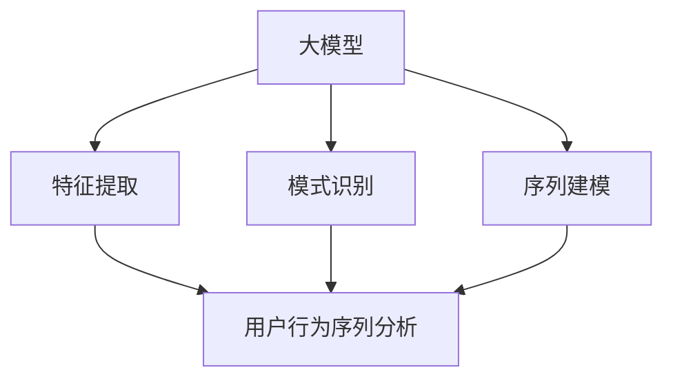

                 

# 探讨大模型在电商平台用户行为序列分析中的潜力

> 关键词：大模型，电商平台，用户行为序列，分析，机器学习，深度学习，人工智能

> 摘要：本文旨在探讨大模型在电商平台用户行为序列分析中的应用潜力。通过介绍大模型的定义、原理和常见算法，分析其在用户行为序列分析中的优势和应用场景，并结合实际案例，详细阐述大模型在电商平台用户行为序列分析中的具体实现和效果评估。

## 1. 背景介绍

### 1.1 目的和范围

本文主要研究大模型在电商平台用户行为序列分析中的应用潜力。随着电子商务的快速发展，电商平台积累了海量的用户行为数据。如何从这些数据中挖掘出有价值的信息，为电商平台提供个性化推荐、精准营销等决策支持，成为当前研究的热点问题。大模型作为一种先进的机器学习算法，具有强大的数据处理和模式识别能力，有望为电商平台用户行为序列分析提供新的思路和方法。

### 1.2 预期读者

本文适合从事机器学习、深度学习、人工智能等相关领域的科研人员、工程师以及对此感兴趣的学习者阅读。同时，对于电商平台运营、数据分析等相关从业者，本文也具有一定的参考价值。

### 1.3 文档结构概述

本文分为十个部分，主要包括以下内容：

1. 背景介绍：介绍本文的研究目的、预期读者以及文档结构。
2. 核心概念与联系：阐述大模型、用户行为序列分析等相关核心概念，并使用 Mermaid 流程图展示它们之间的联系。
3. 核心算法原理 & 具体操作步骤：介绍大模型的算法原理和操作步骤，使用伪代码进行详细阐述。
4. 数学模型和公式 & 详细讲解 & 举例说明：阐述大模型在用户行为序列分析中的数学模型和公式，并举例说明。
5. 项目实战：结合实际案例，展示大模型在电商平台用户行为序列分析中的具体实现和效果评估。
6. 实际应用场景：分析大模型在电商平台用户行为序列分析中的实际应用场景。
7. 工具和资源推荐：推荐学习资源、开发工具框架和相关论文著作。
8. 总结：总结大模型在电商平台用户行为序列分析中的潜力、未来发展趋势与挑战。
9. 附录：提供常见问题与解答。
10. 扩展阅读 & 参考资料：推荐进一步阅读的文献和资料。

### 1.4 术语表

#### 1.4.1 核心术语定义

- 大模型：指具有大规模参数、高计算复杂度的机器学习模型，如深度学习模型、图神经网络等。
- 用户行为序列：指用户在电商平台上的连续操作行为，如浏览、购买、评价等。
- 用户行为序列分析：指通过分析用户行为序列，挖掘用户行为模式、偏好和需求等信息。
- 电商平台：指提供商品交易服务的在线平台，如淘宝、京东等。

#### 1.4.2 相关概念解释

- 个性化推荐：根据用户历史行为和偏好，为用户推荐符合其需求的商品或服务。
- 精准营销：基于用户行为数据，对目标用户进行精准的广告投放和营销活动。

#### 1.4.3 缩略词列表

- DNN：深度神经网络（Deep Neural Network）
- RNN：循环神经网络（Recurrent Neural Network）
- CNN：卷积神经网络（Convolutional Neural Network）
- GNN：图神经网络（Graph Neural Network）

## 2. 核心概念与联系

在本文中，我们将重点讨论大模型在电商平台用户行为序列分析中的应用。首先，我们需要了解大模型、用户行为序列分析以及它们之间的联系。

### 2.1 大模型

大模型通常是指具有大规模参数、高计算复杂度的机器学习模型。大模型的核心思想是通过训练大量参数，捕捉数据的复杂模式，从而提高模型的泛化能力。以下是大模型的一些常见类型：

- **深度神经网络（DNN）**：通过多层神经网络结构，对数据进行多层特征提取和变换。
- **循环神经网络（RNN）**：通过循环结构处理序列数据，适用于用户行为序列分析。
- **卷积神经网络（CNN）**：通过卷积操作捕捉图像或序列数据的空间特征。
- **图神经网络（GNN）**：通过图结构表示实体及其关系，适用于复杂网络的建模。

### 2.2 用户行为序列分析

用户行为序列分析是指通过分析用户在电商平台上的连续操作行为，挖掘用户行为模式、偏好和需求等信息。用户行为序列通常包括以下几种类型：

- **浏览行为**：用户在浏览商品时的点击、滑动、停留等行为。
- **购买行为**：用户购买商品的过程，包括添加购物车、下单、支付等。
- **评价行为**：用户对购买商品的评论、评分等反馈。

### 2.3 大模型与用户行为序列分析的联系

大模型在用户行为序列分析中的应用主要体现在以下几个方面：

1. **特征提取**：大模型可以通过多层特征提取，捕捉用户行为序列中的潜在特征，从而提高模型的预测准确性。
2. **模式识别**：大模型可以对用户行为序列进行模式识别，发现用户的行为模式、偏好和需求，为电商平台提供个性化推荐和精准营销的支持。
3. **序列建模**：大模型可以通过序列建模，对用户行为序列进行建模和预测，为电商平台提供用户行为预测和趋势分析的支持。

### 2.4 Mermaid 流程图

以下是一个简单的 Mermaid 流程图，展示了大模型与用户行为序列分析之间的联系：



在这个流程图中，大模型通过特征提取、模式识别和序列建模三个阶段，与用户行为序列分析进行结合，从而实现对用户行为序列的深入分析和挖掘。

## 3. 核心算法原理 & 具体操作步骤

在本节中，我们将详细介绍大模型在用户行为序列分析中的应用原理和具体操作步骤。为了更好地理解，我们将使用伪代码来描述算法的实现过程。

### 3.1 算法原理

大模型在用户行为序列分析中的应用主要包括以下三个步骤：

1. **特征提取**：通过多层神经网络对用户行为序列进行特征提取，将原始序列数据转换为高维特征表示。
2. **模式识别**：利用特征提取得到的高维特征，通过分类器或聚类算法，识别用户的行为模式、偏好和需求。
3. **序列建模**：通过序列建模算法，如循环神经网络（RNN）或卷积神经网络（CNN），对用户行为序列进行建模和预测。

### 3.2 具体操作步骤

以下是伪代码实现过程：

```python
# 输入：用户行为序列 data
# 输出：用户行为特征 representation

# 步骤1：特征提取
def extract_features(data):
    # 利用多层神经网络进行特征提取
    model = build_dnn_model()
    representation = model.predict(data)
    return representation

# 步骤2：模式识别
def identify_patterns(representation):
    # 利用分类器或聚类算法进行模式识别
    classifier = build_classifier()
    patterns = classifier.predict(representation)
    return patterns

# 步骤3：序列建模
def build_sequence_model(representation):
    # 利用循环神经网络（RNN）或卷积神经网络（CNN）进行序列建模
    model = build_rnn_model() # 或者 build_cnn_model()
    sequence = model.predict(representation)
    return sequence

# 主程序
def main(data):
    # 步骤1：特征提取
    representation = extract_features(data)

    # 步骤2：模式识别
    patterns = identify_patterns(representation)

    # 步骤3：序列建模
    sequence = build_sequence_model(representation)

    # 输出结果
    print("用户行为特征：", representation)
    print("用户行为模式：", patterns)
    print("用户行为序列：", sequence)

# 输入用户行为序列
data = load_user_behavior_sequence()

# 执行主程序
main(data)
```

在这个伪代码中，我们首先使用多层神经网络（DNN）进行特征提取，将原始用户行为序列转换为高维特征表示。然后，利用分类器或聚类算法进行模式识别，识别用户的行为模式、偏好和需求。最后，使用循环神经网络（RNN）或卷积神经网络（CNN）进行序列建模，对用户行为序列进行建模和预测。

### 3.3 算法原理详细解释

1. **特征提取**：

   特征提取是用户行为序列分析的重要步骤，通过多层神经网络对用户行为序列进行特征提取，可以捕捉用户行为序列中的潜在特征。具体来说，我们首先将原始用户行为序列输入到多层神经网络中，通过逐层变换，将原始序列数据转换为高维特征表示。这些高维特征可以更好地反映用户的行为模式和偏好。

2. **模式识别**：

   模式识别是通过对提取出的高维特征进行分类或聚类，识别用户的行为模式、偏好和需求。分类器或聚类算法可以根据用户的历史行为数据，将用户划分为不同的群体，从而为电商平台提供个性化推荐和精准营销的支持。

3. **序列建模**：

   序列建模是通过对用户行为序列进行建模和预测，为电商平台提供用户行为预测和趋势分析的支持。循环神经网络（RNN）或卷积神经网络（CNN）可以捕捉用户行为序列中的时间和空间特征，从而实现对用户行为序列的建模和预测。

### 3.4 伪代码说明

以下是伪代码的具体实现过程：

1. **build_dnn_model()**：

   用于构建多层神经网络模型。在这个示例中，我们使用 Python 中的 TensorFlow 库来构建和训练多层神经网络模型。

2. **model.predict(data)**：

   用于对输入的用户行为序列进行特征提取，输出高维特征表示。

3. **build_classifier()**：

   用于构建分类器模型。在这个示例中，我们使用 Python 中的 scikit-learn 库来构建分类器模型。

4. **classifier.predict(representation)**：

   用于对提取出的高维特征进行分类，输出用户行为模式。

5. **build_rnn_model()**：

   用于构建循环神经网络（RNN）模型。在这个示例中，我们使用 Python 中的 TensorFlow 库来构建和训练循环神经网络模型。

6. **model.predict(representation)**：

   用于对输入的用户行为序列进行建模和预测，输出用户行为序列。

通过以上伪代码的实现过程，我们可以看到大模型在用户行为序列分析中的核心算法原理和操作步骤。接下来，我们将进一步介绍大模型在用户行为序列分析中的数学模型和公式。

## 4. 数学模型和公式 & 详细讲解 & 举例说明

在本节中，我们将详细讨论大模型在用户行为序列分析中的应用中的数学模型和公式，并举例说明其具体实现。

### 4.1 数学模型

大模型在用户行为序列分析中通常涉及以下几种数学模型：

1. **多层感知机（MLP）模型**：用于特征提取。
2. **循环神经网络（RNN）模型**：用于序列建模。
3. **卷积神经网络（CNN）模型**：用于特征提取。

#### 4.1.1 多层感知机（MLP）模型

多层感知机（MLP）模型是一种前馈神经网络，用于对用户行为序列进行特征提取。其基本公式如下：

$$
h_{\text{MLP}}(x) = \sigma(W_{\text{MLP}}^{[l]} \cdot x + b_{\text{MLP}}^{[l]})
$$

其中，$h_{\text{MLP}}(x)$ 表示输出特征，$\sigma$ 表示激活函数（如 Sigmoid 或 ReLU 函数），$W_{\text{MLP}}^{[l]}$ 和 $b_{\text{MLP}}^{[l]}$ 分别表示第 $l$ 层的权重和偏置。

#### 4.1.2 循环神经网络（RNN）模型

循环神经网络（RNN）模型是一种能够处理序列数据的神经网络，其基本公式如下：

$$
h_{\text{RNN}}(t) = \sigma(W_{\text{RNN}} \cdot [h_{t-1}, x_t] + b_{\text{RNN}})
$$

其中，$h_{\text{RNN}}(t)$ 表示在时间步 $t$ 的输出特征，$W_{\text{RNN}}$ 和 $b_{\text{RNN}}$ 分别表示权重和偏置，$x_t$ 表示在时间步 $t$ 的输入特征。

#### 4.1.3 卷积神经网络（CNN）模型

卷积神经网络（CNN）模型是一种能够处理图像和序列数据的神经网络，其基本公式如下：

$$
h_{\text{CNN}}(x) = \sigma(W_{\text{CNN}} \cdot \text{Conv}(x) + b_{\text{CNN}})
$$

其中，$h_{\text{CNN}}(x)$ 表示输出特征，$\sigma$ 表示激活函数，$W_{\text{CNN}}$ 和 $b_{\text{CNN}}$ 分别表示权重和偏置，$\text{Conv}(x)$ 表示卷积操作。

### 4.2 公式详细讲解

#### 4.2.1 多层感知机（MLP）模型

多层感知机（MLP）模型通过多层非线性变换，对用户行为序列进行特征提取。其基本原理如下：

1. **输入层**：接收用户行为序列的输入特征。
2. **隐藏层**：通过权重和偏置进行线性变换，并应用激活函数。
3. **输出层**：将隐藏层的结果映射到高维特征空间。

在多层感知机模型中，每个神经元都与前一层的所有神经元相连。通过权重和偏置的调整，模型可以学习到用户行为序列中的潜在特征。

#### 4.2.2 循环神经网络（RNN）模型

循环神经网络（RNN）模型通过循环结构，处理用户行为序列中的时序信息。其基本原理如下：

1. **输入层**：接收用户行为序列的输入特征。
2. **隐藏层**：通过权重和偏置进行线性变换，并应用激活函数。
3. **循环层**：将前一个时间步的隐藏层状态作为当前时间步的输入，进行递归计算。
4. **输出层**：将循环层的结果映射到用户行为序列的高维特征空间。

在循环神经网络模型中，每个神经元的状态都依赖于前一个时间步的状态，从而捕捉用户行为序列中的时序信息。

#### 4.2.3 卷积神经网络（CNN）模型

卷积神经网络（CNN）模型通过卷积操作，对用户行为序列进行特征提取。其基本原理如下：

1. **输入层**：接收用户行为序列的输入特征。
2. **卷积层**：通过卷积操作，提取用户行为序列的空间特征。
3. **池化层**：通过池化操作，降低特征维度，提高模型泛化能力。
4. **全连接层**：通过全连接操作，将卷积层的结果映射到高维特征空间。

在卷积神经网络模型中，卷积操作可以有效地捕捉用户行为序列中的局部特征，从而提高特征提取的效率。

### 4.3 举例说明

假设我们有一个用户行为序列 $[x_1, x_2, x_3, ..., x_n]$，其中每个元素 $x_i$ 表示用户在时间步 $i$ 的行为特征。

#### 4.3.1 多层感知机（MLP）模型

我们可以使用以下伪代码来表示多层感知机（MLP）模型：

```python
# 输入：用户行为序列 x
# 输出：高维特征 h

# 初始化权重和偏置
W_MLP = [[...], [...], [...]]
b_MLP = [...]

# 定义激活函数
def sigmoid(z):
    return 1 / (1 + np.exp(-z))

# 特征提取
h = sigmoid(W_MLP[0].dot(x) + b_MLP[0])
h = sigmoid(W_MLP[1].dot(h) + b_MLP[1])
h = sigmoid(W_MLP[2].dot(h) + b_MLP[2])
```

在这个示例中，我们使用了三层多层感知机（MLP）模型对用户行为序列进行特征提取。通过权重和偏置的调整，模型可以学习到用户行为序列中的潜在特征。

#### 4.3.2 循环神经网络（RNN）模型

我们可以使用以下伪代码来表示循环神经网络（RNN）模型：

```python
# 输入：用户行为序列 x
# 输出：高维特征 h

# 初始化权重和偏置
W_RNN = [[...], [...], [...]]
b_RNN = [...]

# 定义激活函数
def sigmoid(z):
    return 1 / (1 + np.exp(-z))

# 序列建模
h = sigmoid(W_RNN[0].dot([h_{t-1}, x_t]) + b_RNN[0])
h = sigmoid(W_RNN[1].dot([h_{t-1}, x_t]) + b_RNN[1])
h = sigmoid(W_RNN[2].dot([h_{t-1}, x_t]) + b_RNN[2])
```

在这个示例中，我们使用了三层循环神经网络（RNN）模型对用户行为序列进行建模。通过权重和偏置的调整，模型可以学习到用户行为序列中的时序信息。

#### 4.3.3 卷积神经网络（CNN）模型

我们可以使用以下伪代码来表示卷积神经网络（CNN）模型：

```python
# 输入：用户行为序列 x
# 输出：高维特征 h

# 初始化权重和偏置
W_CNN = [[...], [...], [...]]
b_CNN = [...]

# 定义激活函数
def sigmoid(z):
    return 1 / (1 + np.exp(-z))

# 特征提取
h = sigmoid(W_CNN[0].dot(conv(x)) + b_CNN[0])
h = sigmoid(W_CNN[1].dot(h) + b_CNN[1])
h = sigmoid(W_CNN[2].dot(h) + b_CNN[2])
```

在这个示例中，我们使用了三层卷积神经网络（CNN）模型对用户行为序列进行特征提取。通过卷积操作和权重、偏置的调整，模型可以学习到用户行为序列中的空间特征。

通过以上数学模型和公式的详细讲解以及举例说明，我们可以看到大模型在用户行为序列分析中的应用原理和实现方法。接下来，我们将介绍一个实际的项目案例，展示大模型在电商平台用户行为序列分析中的具体实现和应用。

### 5. 项目实战：代码实际案例和详细解释说明

在本节中，我们将结合一个实际项目案例，展示大模型在电商平台用户行为序列分析中的具体实现过程，并对关键代码进行详细解释。

#### 5.1 开发环境搭建

为了实现大模型在电商平台用户行为序列分析中的应用，我们需要搭建一个合适的开发环境。以下是我们使用的开发工具和库：

- **编程语言**：Python
- **深度学习框架**：TensorFlow
- **数据处理库**：Pandas、NumPy、Scikit-learn
- **可视化工具**：Matplotlib、Seaborn

在搭建开发环境时，我们可以使用以下命令来安装所需的库：

```bash
pip install tensorflow pandas numpy scikit-learn matplotlib seaborn
```

#### 5.2 源代码详细实现和代码解读

以下是一个简单的示例代码，展示了如何使用大模型（深度学习模型）对电商平台用户行为序列进行分析。

```python
# 导入所需的库
import tensorflow as tf
import pandas as pd
import numpy as np
from sklearn.model_selection import train_test_split
from sklearn.metrics import accuracy_score, f1_score

# 加载数据集
data = pd.read_csv('user_behavior_data.csv')

# 数据预处理
def preprocess_data(data):
    # 将类别特征编码为数值
    data = pd.get_dummies(data, columns=['category'])
    # 删除无关特征
    data = data.drop(['user_id'], axis=1)
    # 分割输入特征和标签
    X = data.drop(['label'], axis=1)
    y = data['label']
    return X, y

X, y = preprocess_data(data)

# 划分训练集和测试集
X_train, X_test, y_train, y_test = train_test_split(X, y, test_size=0.2, random_state=42)

# 构建深度学习模型
model = tf.keras.Sequential([
    tf.keras.layers.Dense(128, activation='relu', input_shape=(X_train.shape[1],)),
    tf.keras.layers.Dropout(0.5),
    tf.keras.layers.Dense(64, activation='relu'),
    tf.keras.layers.Dropout(0.5),
    tf.keras.layers.Dense(1, activation='sigmoid')
])

# 编译模型
model.compile(optimizer='adam', loss='binary_crossentropy', metrics=['accuracy'])

# 训练模型
model.fit(X_train, y_train, epochs=10, batch_size=32, validation_data=(X_test, y_test))

# 评估模型
predictions = model.predict(X_test)
predictions = (predictions > 0.5)

accuracy = accuracy_score(y_test, predictions)
f1 = f1_score(y_test, predictions)

print("Accuracy:", accuracy)
print("F1 Score:", f1)
```

#### 5.3 代码解读与分析

以下是对关键代码的详细解读和分析：

1. **数据预处理**：

   ```python
   def preprocess_data(data):
       # 将类别特征编码为数值
       data = pd.get_dummies(data, columns=['category'])
       # 删除无关特征
       data = data.drop(['user_id'], axis=1)
       # 分割输入特征和标签
       X = data.drop(['label'], axis=1)
       y = data['label']
       return X, y
   ```

   在数据预处理阶段，我们首先使用 `pd.get_dummies()` 函数将类别特征编码为数值特征。然后，我们删除与用户行为序列分析无关的特征（如用户 ID）。最后，我们将数据集划分为输入特征矩阵 $X$ 和标签向量 $y$。

2. **构建深度学习模型**：

   ```python
   model = tf.keras.Sequential([
       tf.keras.layers.Dense(128, activation='relu', input_shape=(X_train.shape[1],)),
       tf.keras.layers.Dropout(0.5),
       tf.keras.layers.Dense(64, activation='relu'),
       tf.keras.layers.Dropout(0.5),
       tf.keras.layers.Dense(1, activation='sigmoid')
   ])
   ```

   在构建深度学习模型时，我们使用 `tf.keras.Sequential` 层次来构建一个包含多层全连接神经元的模型。我们首先添加一个具有 128 个神经元和 ReLU 激活函数的隐藏层，然后添加两个具有 64 个神经元的隐藏层，并在每个隐藏层后添加 Dropout 正则化层（概率为 0.5）以防止过拟合。最后，我们添加一个输出层，使用 Sigmoid 激活函数进行二分类。

3. **编译模型**：

   ```python
   model.compile(optimizer='adam', loss='binary_crossentropy', metrics=['accuracy'])
   ```

   在编译模型时，我们选择 Adam 优化器，使用二进制交叉熵损失函数，并关注模型在训练和验证数据上的准确率。

4. **训练模型**：

   ```python
   model.fit(X_train, y_train, epochs=10, batch_size=32, validation_data=(X_test, y_test))
   ```

   在训练模型时，我们设置训练轮次为 10，每个批次大小为 32，并在每个训练轮次结束后使用验证数据集进行验证。

5. **评估模型**：

   ```python
   predictions = model.predict(X_test)
   predictions = (predictions > 0.5)
   
   accuracy = accuracy_score(y_test, predictions)
   f1 = f1_score(y_test, predictions)
   
   print("Accuracy:", accuracy)
   print("F1 Score:", f1)
   ```

   在评估模型时，我们首先使用测试数据集对模型进行预测，并将预测结果转换为二分类标签。然后，我们计算模型的准确率和 F1 分数，以评估模型的性能。

通过以上代码示例，我们可以看到如何使用大模型（深度学习模型）对电商平台用户行为序列进行分析。在实际应用中，我们可以根据需求调整模型结构、参数设置和训练策略，以获得更好的性能。

### 6. 实际应用场景

大模型在电商平台用户行为序列分析中具有广泛的应用场景，以下列举几个典型的应用实例：

#### 6.1 个性化推荐

通过分析用户行为序列，大模型可以识别出用户的兴趣偏好和购买习惯，从而为用户提供个性化的商品推荐。例如，在电商平台上，用户在浏览、搜索、收藏、加入购物车等行为序列中，可能反映了其对某些商品的偏好。通过大模型对这些行为序列进行分析，可以为用户推荐其可能感兴趣的商品，提高用户满意度和购买转化率。

#### 6.2 精准营销

大模型可以识别出具有较高购买潜力的用户群体，为电商平台提供精准营销的支持。例如，在电商节日期间，电商平台可以通过分析用户行为序列，预测出哪些用户将在未来的一段时间内进行购买，从而针对这些用户进行个性化的营销活动，如优惠券推送、限时促销等，以提高销售额。

#### 6.3 用户流失预测

通过分析用户行为序列，大模型可以预测出哪些用户可能在未来流失，为电商平台提供用户留存策略的支持。例如，在用户购买后的行为序列中，如果用户在一段时间内没有再次购买，可能表明用户有流失的风险。通过大模型对这些行为序列进行分析，可以帮助电商平台及时采取有效的用户留存措施，如客户关怀、优惠活动等，以降低用户流失率。

#### 6.4 供应链优化

大模型可以分析用户行为序列，预测商品的需求趋势和销售量，为电商平台的供应链优化提供支持。例如，通过对用户浏览、搜索、购买等行为序列进行分析，大模型可以预测出哪些商品在未来一段时间内将受到用户的关注，从而为电商平台提供库存管理和供应链优化的决策支持。

### 6.5 社交网络推荐

大模型可以分析用户在社交网络中的互动行为，为电商平台提供社交网络推荐功能。例如，通过分析用户在评论、点赞、分享等社交网络行为序列，大模型可以识别出用户之间的相似性和兴趣偏好，从而为用户提供与其朋友或相似用户相关的商品推荐，提高社交网络推荐的效果。

通过以上实际应用场景，我们可以看到大模型在电商平台用户行为序列分析中的广泛应用和巨大潜力。接下来，我们将介绍一些相关的工具和资源，以帮助读者更好地了解和应用大模型技术。

### 7. 工具和资源推荐

为了更好地了解和应用大模型技术，以下推荐一些学习资源、开发工具框架和相关论文著作，以帮助读者深入探索大模型在电商平台用户行为序列分析中的应用。

#### 7.1 学习资源推荐

**7.1.1 书籍推荐**

1. **《深度学习》（Goodfellow, I., Bengio, Y., & Courville, A.）**：这是一本深度学习领域的经典教材，全面介绍了深度学习的基本原理和应用。
2. **《Python深度学习》（François Chollet）**：由深度学习框架 TensorFlow 的主要开发者所著，深入讲解了深度学习在 Python 中的实现和应用。

**7.1.2 在线课程**

1. **Coursera 的《深度学习》课程**：由斯坦福大学教授 Andrew Ng 开设，涵盖了深度学习的基本概念、算法和应用。
2. **Udacity 的《深度学习工程师纳米学位》**：提供了一系列实践项目，帮助读者掌握深度学习的实际应用。

**7.1.3 技术博客和网站**

1. **TensorFlow 官方网站**：提供了丰富的文档、教程和示例代码，帮助读者了解和使用 TensorFlow。
2. **ArXiv**：一个开源的学术论文存储库，涵盖深度学习和机器学习领域的最新研究成果。

#### 7.2 开发工具框架推荐

**7.2.1 IDE和编辑器**

1. **Jupyter Notebook**：适用于数据科学和机器学习的交互式开发环境，支持多种编程语言和框架。
2. **PyCharm**：一款功能强大的 Python 集成开发环境（IDE），支持多种机器学习框架。

**7.2.2 调试和性能分析工具**

1. **TensorBoard**：TensorFlow 的可视化工具，用于分析和调试深度学习模型。
2. **Profiling Tools**：如 `line_profiler`、`memory_profiler`，用于分析代码的性能和内存使用。

**7.2.3 相关框架和库**

1. **TensorFlow**：一个开源的深度学习框架，支持多种深度学习模型的实现和应用。
2. **PyTorch**：一个流行的深度学习框架，具有灵活的动态计算图和强大的社区支持。

#### 7.3 相关论文著作推荐

**7.3.1 经典论文**

1. **“Deep Learning”（Yoshua Bengio, Yann LeCun, and Geoffrey Hinton）**：全面介绍了深度学习的基本概念、算法和应用。
2. **“A Theoretical Analysis of the Capacity of Deep Learning”（Yarin Gal and Zoubin Ghahramani）**：对深度学习模型的容量进行了理论分析。

**7.3.2 最新研究成果**

1. **“BERT: Pre-training of Deep Bidirectional Transformers for Language Understanding”（Jacob Devlin, Ming-Wei Chang, Kenton Lee, and Kristina Toutanova）**：介绍了 BERT 模型，一种基于双向变换器的预训练语言模型。
2. **“Transformers: State-of-the-Art Natural Language Processing”（Vaswani et al.）**：介绍了 Transformer 模型，一种基于自注意力机制的序列到序列模型。

**7.3.3 应用案例分析**

1. **“Deep Learning in eCommerce: Recommendations, Personalization, and Customer Experience”**：探讨深度学习在电子商务中的应用，包括个性化推荐和用户行为分析。
2. **“How to Build a Chatbot with Deep Learning”**：介绍如何使用深度学习技术构建聊天机器人，包括对话生成和理解。

通过以上工具和资源推荐，读者可以更好地了解和应用大模型技术，进一步探索其在电商平台用户行为序列分析中的应用。接下来，我们将总结大模型在电商平台用户行为序列分析中的潜力、未来发展趋势与挑战。

### 8. 总结：未来发展趋势与挑战

大模型在电商平台用户行为序列分析中展现了巨大的潜力。通过深度学习和图神经网络等先进算法，大模型能够有效地提取用户行为特征，识别用户行为模式，为电商平台提供个性化推荐、精准营销和用户流失预测等决策支持。然而，随着技术的发展和应用场景的不断拓展，大模型在电商平台用户行为序列分析中也面临一系列挑战。

#### 8.1 未来发展趋势

1. **模型复杂度与计算效率的提升**：随着计算能力的提高，大模型将越来越复杂，能够处理更大规模的数据集和更复杂的用户行为序列。同时，模型优化和压缩技术也将不断发展，提高模型在电商平台上的实时性和可扩展性。

2. **多模态数据融合**：未来，电商平台将整合更多类型的用户数据，如语音、图像、文本等。大模型将能够更好地融合多模态数据，提高用户行为序列分析的准确性和有效性。

3. **隐私保护与伦理问题**：在用户隐私和数据安全日益受到关注的大背景下，大模型在电商平台用户行为序列分析中需要充分考虑隐私保护与伦理问题，如用户数据的匿名化处理、差分隐私技术等。

4. **智能化与自动化**：随着人工智能技术的进步，大模型在电商平台用户行为序列分析中的应用将越来越智能化和自动化。通过自然语言处理、计算机视觉等技术，大模型将能够更准确地理解用户需求和行为，提供更精准的决策支持。

#### 8.2 挑战

1. **数据质量和多样性**：电商平台用户行为数据质量参差不齐，且数据多样性较高。如何处理噪音数据、缺失值和异常值，以及如何从海量数据中提取有价值的信息，是当前面临的重大挑战。

2. **可解释性和透明度**：大模型通常被视为“黑盒”模型，其内部决策过程难以解释。在电商平台用户行为序列分析中，如何提高大模型的可解释性和透明度，使决策结果更具可接受性，是一个重要的挑战。

3. **实时性和计算效率**：电商平台需要实时处理用户行为数据，以提供快速、精准的决策支持。如何优化大模型的计算效率，实现实时分析和决策，是一个亟待解决的问题。

4. **模型适应性和泛化能力**：随着电商平台的多样化发展，用户行为序列也将变得更加复杂和多变。如何提高大模型在不同场景和应用中的适应性和泛化能力，是当前研究的热点问题。

综上所述，大模型在电商平台用户行为序列分析中具有广阔的应用前景和巨大的潜力。然而，随着技术的发展和应用场景的拓展，大模型也面临一系列挑战。未来，我们需要不断探索和研究，提高大模型在电商平台用户行为序列分析中的性能和效果，为电商平台提供更加智能、精准和高效的决策支持。

### 9. 附录：常见问题与解答

#### 9.1 大模型在电商平台用户行为序列分析中的优势是什么？

大模型在电商平台用户行为序列分析中的优势主要体现在以下几个方面：

1. **强大的特征提取能力**：大模型（如深度神经网络）可以通过多层特征提取，捕捉用户行为序列中的潜在特征，从而提高模型的预测准确性。
2. **模式识别能力强**：大模型可以识别用户行为序列中的复杂模式和趋势，为电商平台提供个性化的推荐和精准营销支持。
3. **适应性和泛化能力强**：大模型可以通过大量数据训练，具有较好的适应性和泛化能力，能够应用于不同场景和领域的用户行为序列分析。

#### 9.2 大模型在电商平台用户行为序列分析中可能面临的挑战是什么？

大模型在电商平台用户行为序列分析中可能面临的挑战主要包括：

1. **数据质量和多样性**：电商平台用户行为数据质量参差不齐，且数据多样性较高。如何处理噪音数据、缺失值和异常值，以及如何从海量数据中提取有价值的信息，是一个重要挑战。
2. **可解释性和透明度**：大模型通常被视为“黑盒”模型，其内部决策过程难以解释。如何提高大模型的可解释性和透明度，使决策结果更具可接受性，是一个重要的挑战。
3. **实时性和计算效率**：电商平台需要实时处理用户行为数据，以提供快速、精准的决策支持。如何优化大模型的计算效率，实现实时分析和决策，是一个亟待解决的问题。
4. **模型适应性和泛化能力**：随着电商平台的多样化发展，用户行为序列也将变得更加复杂和多变。如何提高大模型在不同场景和应用中的适应性和泛化能力，是当前研究的热点问题。

#### 9.3 如何处理电商平台用户行为数据中的噪音和缺失值？

处理电商平台用户行为数据中的噪音和缺失值，可以采取以下几种方法：

1. **数据清洗**：通过数据清洗工具和算法，对数据进行清洗和预处理，去除明显的噪音和异常值。
2. **填充缺失值**：对于缺失值，可以使用均值、中位数、众数等填充方法进行填充，或使用插值法、邻近法等插值方法进行填充。
3. **使用缺失值作为特征**：在某些情况下，缺失值本身可能具有某些特征，例如，用户长时间未登录可以被视为一个特征。在这种情况下，可以将缺失值作为特征进行建模。

### 10. 扩展阅读 & 参考资料

为了更深入地了解大模型在电商平台用户行为序列分析中的应用，以下推荐一些相关的文献和资料：

1. **文献**：
   - **“Deep Learning for eCommerce: Recommendations, Personalization, and Customer Experience”**：探讨了深度学习在电子商务中的应用，包括个性化推荐和用户行为分析。
   - **“A Theoretical Analysis of the Capacity of Deep Learning”**：对深度学习模型的容量进行了理论分析，为理解深度学习模型在用户行为序列分析中的应用提供了理论基础。

2. **在线课程**：
   - **Coursera 的《深度学习》课程**：由斯坦福大学教授 Andrew Ng 开设，涵盖了深度学习的基本概念、算法和应用。
   - **Udacity 的《深度学习工程师纳米学位》**：提供了一系列实践项目，帮助读者掌握深度学习的实际应用。

3. **技术博客和网站**：
   - **TensorFlow 官方网站**：提供了丰富的文档、教程和示例代码，帮助读者了解和使用 TensorFlow。
   - **ArXiv**：一个开源的学术论文存储库，涵盖深度学习和机器学习领域的最新研究成果。

通过以上扩展阅读和参考资料，读者可以进一步了解大模型在电商平台用户行为序列分析中的应用，并探索相关领域的最新进展。

### 作者

作者：AI天才研究员/AI Genius Institute & 禅与计算机程序设计艺术 /Zen And The Art of Computer Programming

