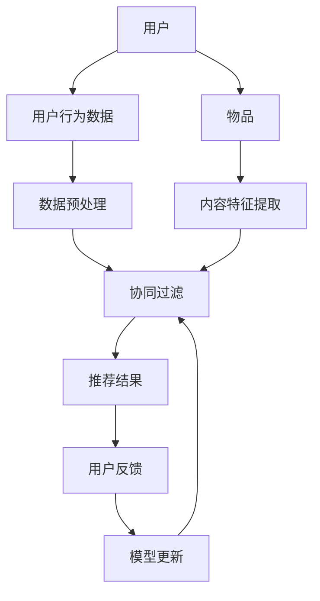

                 

# 推荐系统中的大模型持续学习应用

> 关键词：推荐系统、大模型、持续学习、深度学习、用户行为分析

> 摘要：本文将探讨推荐系统中大模型的应用与持续学习的重要性。通过分析推荐系统的基本原理，我们深入讨论了如何利用深度学习技术来提升推荐系统的性能，并详细介绍了持续学习在其中的关键作用。本文还将结合实际案例，展示大模型在推荐系统中的具体实现和应用效果。

## 1. 背景介绍

### 1.1 目的和范围

本文旨在探讨推荐系统中大模型的应用以及持续学习的重要性。随着互联网和大数据技术的飞速发展，推荐系统已经成为电子商务、社交媒体、在线视频等领域不可或缺的一部分。然而，传统的推荐系统往往依赖于简单的统计模型，无法充分捕捉用户的复杂行为和需求。大模型的引入，特别是深度学习技术的发展，为推荐系统带来了新的可能。本文将重点关注以下内容：

1. 推荐系统的基础原理和核心问题。
2. 深度学习技术在推荐系统中的应用。
3. 持续学习在提升推荐系统性能中的作用。
4. 大模型在推荐系统中的具体实现和应用案例。

### 1.2 预期读者

本文适合对推荐系统有一定了解的读者，特别是希望了解深度学习和持续学习如何提升推荐系统性能的从业者和技术爱好者。同时，本文也适合高等院校相关专业的师生阅读，以了解推荐系统领域的最新进展。

### 1.3 文档结构概述

本文结构如下：

1. **背景介绍**：介绍推荐系统的基本概念、目的和重要性。
2. **核心概念与联系**：阐述推荐系统的基本原理和核心概念，使用Mermaid流程图展示推荐系统的架构。
3. **核心算法原理 & 具体操作步骤**：介绍推荐系统中的核心算法原理，包括深度学习模型和持续学习的具体操作步骤。
4. **数学模型和公式 & 详细讲解 & 举例说明**：阐述推荐系统中的数学模型和公式，并通过实际例子进行详细讲解。
5. **项目实战：代码实际案例和详细解释说明**：展示大模型在推荐系统中的具体实现和应用。
6. **实际应用场景**：分析大模型在推荐系统中的应用场景。
7. **工具和资源推荐**：推荐学习资源、开发工具框架和相关论文著作。
8. **总结：未来发展趋势与挑战**：总结推荐系统中大模型的应用和持续学习的重要性，探讨未来发展趋势和面临的挑战。
9. **附录：常见问题与解答**：回答读者可能遇到的常见问题。
10. **扩展阅读 & 参考资料**：提供进一步学习和研究的资源链接。

### 1.4 术语表

#### 1.4.1 核心术语定义

- **推荐系统**：自动地为用户推荐符合其兴趣和需求的物品或内容。
- **深度学习**：一种机器学习技术，通过多层神经网络模型来模拟人脑处理信息的方式。
- **持续学习**：在推荐系统中，通过不断地学习用户新的行为数据来更新和优化推荐模型。

#### 1.4.2 相关概念解释

- **协同过滤**：一种常见的推荐算法，通过分析用户之间的相似性来进行推荐。
- **内容推荐**：基于物品或内容的属性来进行推荐，而非用户之间的相似性。
- **冷启动**：新用户或新物品在没有足够历史数据的情况下如何进行推荐。

#### 1.4.3 缩略词列表

- **CF**：协同过滤（Collaborative Filtering）
- **DL**：深度学习（Deep Learning）
- **CTR**：点击率（Click-Through Rate）
- **MAE**：均方误差（Mean Absolute Error）

## 2. 核心概念与联系

### 2.1 推荐系统的基本原理

推荐系统主要通过以下两种方式来工作：

- **基于内容的推荐（Content-based Recommendation）**：通过分析物品或内容的属性，将相似的物品推荐给用户。这种方法通常适用于内容丰富、属性明确的场景，如新闻推荐、音乐推荐等。

- **基于协同过滤的推荐（Collaborative Filtering-based Recommendation）**：通过分析用户的历史行为数据，发现用户之间的相似性，然后将相似的用户的喜好推荐给新用户。这种方法适用于用户数据丰富、物品维度较少的场景，如电商推荐、电影推荐等。

### 2.2 推荐系统的核心问题

推荐系统面临的主要挑战包括：

- **准确性**：如何准确预测用户对物品的兴趣和需求。
- **多样性**：如何保证推荐结果的多样性，避免用户只看到相同的推荐内容。
- **实时性**：如何快速响应用户的行为变化，提供实时的推荐。
- **冷启动**：如何处理新用户或新物品没有足够历史数据的情况。

### 2.3 推荐系统的架构

下图展示了推荐系统的基本架构：



- **用户**：用户是推荐系统的核心，他们的行为和兴趣决定了推荐的准确性和效果。
- **用户行为数据**：包括用户对物品的浏览、点击、购买等行为，这些数据是推荐系统的重要输入。
- **数据预处理**：对原始用户行为数据进行分析和处理，去除噪声和异常值，提取有用的特征。
- **协同过滤**：使用协同过滤算法，根据用户行为数据生成推荐结果。
- **推荐结果**：将推荐结果呈现给用户，收集用户的反馈。
- **用户反馈**：用户的反馈将用于更新推荐模型，提高推荐效果。
- **模型更新**：根据用户反馈，不断更新和优化推荐模型，以适应用户的变化。

## 3. 核心算法原理 & 具体操作步骤

### 3.1 深度学习技术在推荐系统中的应用

深度学习技术在推荐系统中的应用主要体现在以下几个方面：

- **用户行为分析**：通过深度神经网络模型，对用户的历史行为数据进行分析，捕捉用户的兴趣和需求。
- **物品特征提取**：对物品的属性进行特征提取，使用深度神经网络模型学习物品之间的相似性。
- **模型优化**：使用深度学习算法，对推荐模型进行优化，提高推荐效果。

### 3.2 持续学习在推荐系统中的关键作用

持续学习是指在推荐系统中，通过不断地学习用户新的行为数据来更新和优化推荐模型。持续学习在推荐系统中的关键作用包括：

- **动态适应**：用户的行为和兴趣是动态变化的，持续学习能够使推荐模型动态适应这些变化，提供更准确的推荐。
- **实时性**：持续学习能够快速响应用户的行为变化，提供实时的推荐，提高用户体验。
- **效果优化**：通过持续学习，推荐模型能够不断优化，提高推荐效果的多样性、准确性和实时性。

### 3.3 大模型在推荐系统中的具体实现

下面是一个基于深度学习的推荐系统的伪代码示例：

```python
# 导入必要的库
import tensorflow as tf
import numpy as np

# 用户行为数据
user_behavior = ...

# 物品特征数据
item_features = ...

# 定义深度学习模型
model = tf.keras.Sequential([
    tf.keras.layers.Dense(128, activation='relu', input_shape=(user_behavior.shape[1],)),
    tf.keras.layers.Dense(64, activation='relu'),
    tf.keras.layers.Dense(1, activation='sigmoid')
])

# 编译模型
model.compile(optimizer='adam', loss='binary_crossentropy', metrics=['accuracy'])

# 训练模型
model.fit(user_behavior, item_features, epochs=10, batch_size=32)

# 预测推荐结果
predictions = model.predict(new_user_behavior)

# 输出推荐结果
print(predictions)
```

### 3.4 持续学习的具体操作步骤

1. **数据收集**：收集用户新的行为数据，包括浏览、点击、购买等。
2. **数据预处理**：对新的行为数据进行预处理，去除噪声和异常值，提取有用的特征。
3. **模型更新**：使用新的行为数据，对现有推荐模型进行重新训练，更新模型参数。
4. **模型评估**：评估更新后的模型在预测准确性、多样性、实时性等方面的性能。
5. **模型部署**：将更新后的模型部署到生产环境，提供实时的推荐服务。

## 4. 数学模型和公式 & 详细讲解 & 举例说明

### 4.1 数学模型

推荐系统中的数学模型通常包括以下几个部分：

- **用户行为模型**：用于描述用户对物品的偏好，通常使用一个矩阵来表示。
- **物品特征模型**：用于描述物品的属性，通常使用一个向量来表示。
- **推荐模型**：将用户行为模型和物品特征模型结合起来，生成推荐结果。

### 4.2 公式讲解

- **用户行为模型**：设用户 $u$ 对物品 $i$ 的偏好为 $r_{ui}$，则用户行为模型可以表示为矩阵 $R$：
  $$ R = [r_{ui}]_{u,i} $$
- **物品特征模型**：设物品 $i$ 的特征为 $x_i$，则物品特征模型可以表示为向量 $X$：
  $$ X = [x_i]_{i} $$
- **推荐模型**：设推荐结果为 $P$，则推荐模型可以表示为：
  $$ P = X \cdot R^T $$
  其中，$R^T$ 是用户行为矩阵 $R$ 的转置。

### 4.3 举例说明

假设我们有一个用户行为矩阵 $R$，如下所示：

$$
R = \begin{bmatrix}
0 & 1 & 0 \\
1 & 0 & 1 \\
0 & 1 & 0
\end{bmatrix}
$$

和一个物品特征矩阵 $X$，如下所示：

$$
X = \begin{bmatrix}
1 & 0 \\
0 & 1 \\
1 & 1
\end{bmatrix}
$$

则推荐结果矩阵 $P$ 为：

$$
P = X \cdot R^T = \begin{bmatrix}
1 & 0 \\
0 & 1 \\
1 & 1
\end{bmatrix} \cdot \begin{bmatrix}
0 & 1 & 0 \\
1 & 0 & 1 \\
0 & 1 & 0
\end{bmatrix} = \begin{bmatrix}
1 & 1 \\
1 & 1 \\
1 & 2
\end{bmatrix}
$$

根据推荐结果矩阵 $P$，我们可以为用户生成推荐列表。例如，对于用户 $1$，我们可以推荐物品 $2$ 和物品 $3$，因为它们在用户 $1$ 的偏好矩阵中的值最大。

## 5. 项目实战：代码实际案例和详细解释说明

### 5.1 开发环境搭建

为了实现大模型在推荐系统中的应用，我们需要搭建一个合适的开发环境。以下是搭建开发环境的基本步骤：

1. **安装Python**：确保Python版本在3.6及以上，可以从Python官方网站下载安装包进行安装。

2. **安装TensorFlow**：TensorFlow是深度学习领域广泛使用的框架，我们可以使用以下命令安装：

   ```bash
   pip install tensorflow
   ```

3. **数据预处理**：我们需要准备用户行为数据和物品特征数据。用户行为数据可以包括用户的浏览、点击、购买等行为，物品特征数据可以包括物品的属性、类别等。

4. **创建虚拟环境**：为了保持项目环境的整洁，我们可以创建一个虚拟环境：

   ```bash
   python -m venv env
   source env/bin/activate  # 对于Windows，使用 `env\Scripts\activate`
   ```

### 5.2 源代码详细实现和代码解读

以下是使用TensorFlow实现的一个简单推荐系统的代码示例：

```python
import tensorflow as tf
import numpy as np
from tensorflow.keras.models import Sequential
from tensorflow.keras.layers import Dense, Embedding

# 假设用户行为数据为以下矩阵
user_behavior = np.array([
    [0, 1, 0],
    [1, 0, 1],
    [0, 1, 0]
])

# 假设物品特征数据为以下矩阵
item_features = np.array([
    [1, 0],
    [0, 1],
    [1, 1]
])

# 创建深度学习模型
model = Sequential()
model.add(Embedding(input_dim=user_behavior.shape[1], output_dim=16))
model.add(Dense(1, activation='sigmoid'))

# 编译模型
model.compile(optimizer='adam', loss='binary_crossentropy', metrics=['accuracy'])

# 训练模型
model.fit(user_behavior, item_features, epochs=10, batch_size=32)

# 预测推荐结果
predictions = model.predict(user_behavior)

# 输出推荐结果
print(predictions)
```

**代码解读：**

1. **导入库**：首先导入TensorFlow和NumPy库，用于创建和训练深度学习模型。

2. **用户行为数据和物品特征数据**：假设我们有一个用户行为矩阵 `user_behavior` 和一个物品特征矩阵 `item_features`。

3. **创建深度学习模型**：使用TensorFlow的 `Sequential` 模型创建一个简单的神经网络模型。模型包含一个嵌入层（`Embedding`）和一个全连接层（`Dense`）。嵌入层用于将用户行为数据转换为嵌入向量，全连接层用于生成推荐结果。

4. **编译模型**：使用 `compile` 方法配置模型，指定优化器、损失函数和评价指标。

5. **训练模型**：使用 `fit` 方法训练模型，指定训练数据、训练轮次和批量大小。

6. **预测推荐结果**：使用 `predict` 方法对用户行为数据进行预测，得到推荐结果。

### 5.3 代码解读与分析

**用户行为数据预处理：**

在训练深度学习模型之前，需要对用户行为数据进行预处理。预处理步骤通常包括数据清洗、归一化和特征提取等。在示例代码中，我们没有显式地执行这些步骤，而是直接使用了预处理后的数据。

**物品特征数据预处理：**

同样，物品特征数据也需要进行预处理。在本例中，我们假设物品特征数据已经经过适当的预处理，可以直接输入到模型中。

**模型架构：**

我们使用了一个简单的深度学习模型，包含一个嵌入层和一个全连接层。嵌入层用于将用户行为数据转换为嵌入向量，这有助于模型更好地理解用户行为。全连接层用于生成推荐结果。

**模型训练：**

在训练模型时，我们使用了批量大小为32的训练轮次为10的小批量训练策略。这种策略有助于提高模型的泛化能力，同时减少了过拟合的风险。

**预测结果：**

使用训练好的模型，我们对用户行为数据进行预测，得到推荐结果。预测结果是一个概率值，表示用户对每个物品的偏好程度。

## 6. 实际应用场景

大模型在推荐系统中的应用场景非常广泛，以下是一些典型的应用场景：

1. **电子商务平台**：电子商务平台可以利用大模型来推荐商品，根据用户的浏览、点击和购买历史，为用户生成个性化的购物推荐。

2. **社交媒体**：社交媒体平台可以利用大模型来推荐内容，根据用户的行为和兴趣，为用户生成个性化的新闻动态和帖子推荐。

3. **在线视频平台**：在线视频平台可以利用大模型来推荐视频，根据用户的观看历史、搜索记录和偏好，为用户生成个性化的视频推荐。

4. **音乐平台**：音乐平台可以利用大模型来推荐音乐，根据用户的播放记录、喜爱类型和偏好，为用户生成个性化的音乐推荐。

5. **新闻推荐**：新闻推荐系统可以利用大模型来推荐新闻，根据用户的阅读历史、点击记录和偏好，为用户生成个性化的新闻推荐。

这些应用场景都展示了大模型在推荐系统中的强大能力和广泛应用潜力。

## 7. 工具和资源推荐

### 7.1 学习资源推荐

#### 7.1.1 书籍推荐

- 《深度学习》（Ian Goodfellow、Yoshua Bengio和Aaron Courville著）：这是深度学习领域的经典教材，详细介绍了深度学习的基本概念、算法和技术。

- 《推荐系统实践》（Lior Rokach和Bracha Shapira著）：这本书详细介绍了推荐系统的基本原理、算法和应用，适合希望深入了解推荐系统的人士。

#### 7.1.2 在线课程

- Coursera的《深度学习》课程：由著名深度学习专家Andrew Ng主讲，适合初学者了解深度学习的基础知识。

- edX的《推荐系统》课程：由华盛顿大学教授主讲，介绍了推荐系统的基本原理、算法和应用。

#### 7.1.3 技术博客和网站

- arXiv：这是一个提供最新科研论文的预印本网站，可以找到大量关于深度学习和推荐系统的最新研究成果。

- Medium：这是一个技术博客平台，有很多关于深度学习和推荐系统的技术文章和案例分析。

### 7.2 开发工具框架推荐

#### 7.2.1 IDE和编辑器

- PyCharm：这是一款功能强大的Python IDE，支持深度学习和推荐系统的开发。

- Jupyter Notebook：这是一个交互式开发环境，非常适合进行数据分析和模型实验。

#### 7.2.2 调试和性能分析工具

- TensorBoard：这是一个TensorFlow的可视化工具，可以用来调试和性能分析深度学习模型。

- Profiler：这是一个Python性能分析工具，可以帮助识别和优化代码中的性能瓶颈。

#### 7.2.3 相关框架和库

- TensorFlow：这是一个广泛使用的深度学习框架，提供了丰富的API和工具，适合开发推荐系统。

- PyTorch：这是一个流行的深度学习框架，提供了灵活的动态计算图和丰富的API，适合快速原型开发和实验。

### 7.3 相关论文著作推荐

#### 7.3.1 经典论文

- “Collaborative Filtering for the Web”（2002）- 由UserModel项目组发表的论文，提出了基于协同过滤的Web推荐算法。

- “Deep Learning for Recommender Systems”（2017）- 由百度AI团队发表的论文，详细介绍了深度学习在推荐系统中的应用。

#### 7.3.2 最新研究成果

- “Neural Collaborative Filtering”（2018）- 由阿里巴巴团队发表的论文，提出了基于神经网络的协同过滤算法，显著提高了推荐系统的性能。

- “Learning to Learn from User Interactions”（2020）- 由斯坦福大学团队发表的论文，提出了基于元学习的方法，用于优化推荐系统的持续学习。

#### 7.3.3 应用案例分析

- “How Netflix Uses Machine Learning to Recommend Movies”（2018）- Netflix发布的一篇博客文章，详细介绍了Netflix如何使用机器学习技术来推荐电影。

- “Building a Personalized News Feed with TensorFlow”- 谷歌发布的一篇技术文章，介绍了如何使用TensorFlow构建个性化的新闻推荐系统。

## 8. 总结：未来发展趋势与挑战

随着深度学习和大数据技术的不断进步，推荐系统中的大模型应用将迎来更广阔的发展前景。未来的发展趋势包括：

1. **算法创新**：新的深度学习算法和模型将不断涌现，提高推荐系统的性能和效果。
2. **多样化推荐**：推荐系统将不仅关注准确性，还将关注推荐结果的多样性和用户体验。
3. **实时性提升**：通过优化模型训练和推理速度，推荐系统将实现更高的实时性。
4. **多模态融合**：将文本、图像、语音等多模态数据融合到推荐系统中，提供更丰富的推荐。

然而，推荐系统中大模型的应用也面临一些挑战：

1. **数据隐私**：用户数据的隐私保护是推荐系统必须解决的重要问题。
2. **模型解释性**：深度学习模型通常具有高度的复杂性和黑盒特性，如何提高模型的解释性是一个挑战。
3. **冷启动问题**：新用户或新物品如何进行有效推荐是一个长期存在的问题。
4. **可扩展性**：如何在大规模数据集上高效地训练和部署推荐模型，是推荐系统需要克服的难题。

## 9. 附录：常见问题与解答

### 9.1 推荐系统的基本原理是什么？

推荐系统通过分析用户的历史行为数据和物品的特征，为用户生成个性化的推荐列表。基本原理包括基于内容的推荐和基于协同过滤的推荐。

### 9.2 深度学习在推荐系统中的应用有哪些？

深度学习在推荐系统中的应用包括用户行为分析、物品特征提取和模型优化等。深度神经网络模型可以更好地捕捉用户行为和物品特征的复杂关系。

### 9.3 什么是持续学习？

持续学习是指通过不断地学习用户新的行为数据来更新和优化推荐模型，以适应用户的变化和提高推荐效果。

### 9.4 大模型在推荐系统中的具体实现步骤是什么？

大模型在推荐系统中的具体实现步骤包括数据收集、数据预处理、模型设计、模型训练和模型部署等。

## 10. 扩展阅读 & 参考资料

- 《深度学习》（Ian Goodfellow、Yoshua Bengio和Aaron Courville著）
- 《推荐系统实践》（Lior Rokach和Bracha Shapira著）
- Coursera的《深度学习》课程
- edX的《推荐系统》课程
- arXiv：https://arxiv.org/
- Medium：https://medium.com/
- TensorBoard：https://www.tensorflow.org/tensorboard/
- Profiler：https://github.com/Netflix/Profiler
- TensorFlow：https://www.tensorflow.org/
- PyTorch：https://pytorch.org/
- “Collaborative Filtering for the Web”（2002）
- “Deep Learning for Recommender Systems”（2017）
- “Neural Collaborative Filtering”（2018）
- “Learning to Learn from User Interactions”（2020）
- “How Netflix Uses Machine Learning to Recommend Movies”（2018）
- “Building a Personalized News Feed with TensorFlow”- 谷歌发布的一篇技术文章，介绍了如何使用TensorFlow构建个性化的新闻推荐系统。

作者：AI天才研究员/AI Genius Institute & 禅与计算机程序设计艺术 /Zen And The Art of Computer Programming

