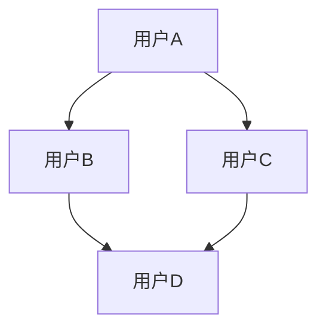
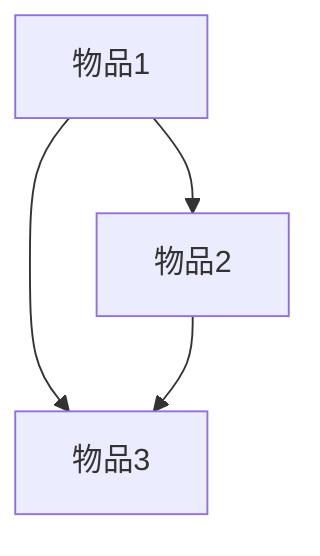
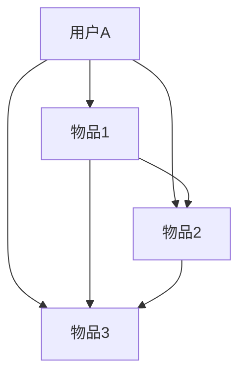

                 


# 推荐系统多样性与惊喜性

> **关键词：** 推荐系统、多样性、惊喜性、算法原理、实际应用、工具推荐

> **摘要：** 本文章旨在探讨推荐系统的多样性与惊喜性，分析其核心概念、算法原理及实际应用。通过详细的讲解和实例，帮助读者理解如何构建一个既能提供个性化推荐又能保持内容多样性的推荐系统，并预测其未来的发展趋势与挑战。

## 1. 背景介绍

### 1.1 目的和范围

本文旨在探讨推荐系统的多样性与惊喜性，分析其核心概念、算法原理及实际应用。推荐系统是现代互联网中不可或缺的部分，广泛应用于电商、新闻、音乐、视频等领域。随着用户个性化需求的增加，如何构建一个既能提供个性化推荐又能保持内容多样性的推荐系统成为了一个重要的研究方向。

### 1.2 预期读者

本文适用于对推荐系统有一定了解的技术人员、算法工程师及对推荐系统有浓厚兴趣的科研人员。

### 1.3 文档结构概述

本文结构如下：

1. 背景介绍：介绍本文的目的、范围及预期读者。
2. 核心概念与联系：介绍推荐系统的核心概念、原理及架构。
3. 核心算法原理 & 具体操作步骤：讲解推荐系统的核心算法原理及具体操作步骤。
4. 数学模型和公式 & 详细讲解 & 举例说明：介绍推荐系统的数学模型、公式及实际应用案例。
5. 项目实战：通过代码实际案例讲解推荐系统的具体实现。
6. 实际应用场景：分析推荐系统的实际应用场景。
7. 工具和资源推荐：推荐与推荐系统相关的学习资源、开发工具及论文著作。
8. 总结：总结推荐系统多样性与惊喜性的未来发展趋势与挑战。
9. 附录：常见问题与解答。
10. 扩展阅读 & 参考资料：提供与本文相关的扩展阅读资料。

### 1.4 术语表

#### 1.4.1 核心术语定义

- **推荐系统**：一种根据用户的历史行为、兴趣和偏好，向用户推荐感兴趣的信息、商品或服务的系统。
- **多样性**：推荐系统在向用户推荐内容时，尽量保证不同种类、风格或主题的内容。
- **惊喜性**：推荐系统能够发现用户未知或未意识到的兴趣点，给用户带来惊喜和新鲜感。

#### 1.4.2 相关概念解释

- **协同过滤**：一种基于用户行为信息的推荐算法，通过分析用户之间的相似度，推荐用户可能感兴趣的内容。
- **内容推荐**：一种基于内容属性的推荐算法，通过分析内容之间的相似度，推荐用户可能感兴趣的内容。
- **协同过滤与内容推荐的结合**：将协同过滤和内容推荐相结合，以充分发挥两种算法的优势。

#### 1.4.3 缩略词列表

- **CF**：协同过滤（Collaborative Filtering）
- **CTR**：点击率（Click Through Rate）
- **NDCG**：正常化折扣累计增益（Normalized Discounted Cumulative Gain）

## 2. 核心概念与联系

### 推荐系统核心概念与架构

推荐系统的核心概念包括用户、物品和评分。用户表示系统中的个体，物品表示用户可能感兴趣的内容，评分表示用户对物品的偏好程度。


### 推荐系统原理

推荐系统的基本原理是基于用户的历史行为、兴趣和偏好，通过相似度计算、评分预测等方法，为用户推荐可能感兴趣的内容。

1. **协同过滤（CF）**：通过分析用户之间的相似度，发现用户之间的共同喜好，为用户推荐相似用户喜欢的物品。



2. **内容推荐**：通过分析物品的属性，发现物品之间的相似性，为用户推荐具有相似属性的物品。



3. **协同过滤与内容推荐的结合**：将协同过滤和内容推荐相结合，以充分利用两种算法的优势。



## 3. 核心算法原理 & 具体操作步骤

### 3.1 协同过滤算法原理

协同过滤算法基于用户的行为数据，通过计算用户之间的相似度来推荐物品。具体操作步骤如下：

1. **计算用户相似度**：

   设用户 $U_1$ 和 $U_2$ 的行为数据集分别为 $R_1$ 和 $R_2$，则用户相似度 $s(U_1, U_2)$ 可以通过余弦相似度或皮尔逊相关系数计算：

   $$s(U_1, U_2) = \frac{R_1 \cdot R_2}{\|R_1\|\|R_2\|}$$

   其中，$R_1 \cdot R_2$ 表示用户 $U_1$ 和 $U_2$ 行为数据的内积，$\|R_1\|$ 和 $\|R_2\|$ 分别表示用户 $U_1$ 和 $U_2$ 行为数据的欧几里得范数。

2. **生成推荐列表**：

   对于未评分的物品 $I_j$，计算用户 $U_i$ 与其相似的用户 $U_j$ 的相似度，并将相似度从高到低排序。根据相似度排序，选取相似度最高的用户 $U_j$ 的评分最高的物品作为推荐结果。

### 3.2 内容推荐算法原理

内容推荐算法基于物品的属性信息，通过计算物品之间的相似度来推荐物品。具体操作步骤如下：

1. **计算物品相似度**：

   设物品 $I_1$ 和 $I_2$ 的属性向量分别为 $A_1$ 和 $A_2$，则物品相似度 $s(I_1, I_2)$ 可以通过余弦相似度或欧几里得距离计算：

   $$s(I_1, I_2) = \frac{A_1 \cdot A_2}{\|A_1\|\|A_2\|}$$

   其中，$A_1 \cdot A_2$ 表示物品 $I_1$ 和 $I_2$ 属性向量的内积，$\|A_1\|$ 和 $\|A_2\|$ 分别表示物品 $I_1$ 和 $I_2$ 属性向量的欧几里得范数。

2. **生成推荐列表**：

   对于未评分的物品 $I_j$，计算物品 $I_1$ 和 $I_2$ 的相似度，并将相似度从高到低排序。根据相似度排序，选取相似度最高的物品作为推荐结果。

### 3.3 协同过滤与内容推荐的结合

协同过滤与内容推荐算法可以结合使用，以充分发挥两种算法的优势。具体操作步骤如下：

1. **计算用户-物品相似度**：

   对于用户 $U_i$ 和物品 $I_j$，计算基于协同过滤的用户相似度 $s^c(U_i, U_j)$ 和基于内容推荐的物品相似度 $s^c(I_i, I_j)$。

   $$s^c(U_i, U_j) = s(U_i, U_j)$$

   $$s^c(I_i, I_j) = s(I_i, I_j)$$

2. **生成推荐列表**：

   对于未评分的物品 $I_j$，计算用户 $U_i$ 与其相似的用户 $U_j$ 的相似度，并将相似度从高到低排序。同时，计算物品 $I_1$ 和 $I_2$ 的相似度，并将相似度从高到低排序。将协同过滤和内容推荐的结果进行加权求和，得到综合相似度 $s(U_i, I_j)$。

   $$s(U_i, I_j) = w_c \cdot s^c(U_i, U_j) + (1 - w_c) \cdot s^c(I_i, I_j)$$

   其中，$w_c$ 为协同过滤和内容推荐的权重。

   根据综合相似度排序，选取相似度最高的物品作为推荐结果。

## 4. 数学模型和公式 & 详细讲解 & 举例说明

### 4.1 协同过滤算法数学模型

协同过滤算法的核心是计算用户之间的相似度，基于余弦相似度公式，我们有：

$$s(U_i, U_j) = \frac{R_i \cdot R_j}{\|R_i\|\|R_j\|}$$

其中，$R_i$ 和 $R_j$ 分别表示用户 $U_i$ 和 $U_j$ 的行为数据向量，$\|R_i\|$ 和 $\|R_j\|$ 分别表示用户 $U_i$ 和 $U_j$ 的行为数据向量的欧几里得范数。

### 4.2 内容推荐算法数学模型

内容推荐算法的核心是计算物品之间的相似度，基于余弦相似度公式，我们有：

$$s(I_i, I_j) = \frac{A_i \cdot A_j}{\|A_i\|\|A_j\|}$$

其中，$A_i$ 和 $A_j$ 分别表示物品 $I_i$ 和 $I_j$ 的属性向量，$\|A_i\|$ 和 $\|A_j\|$ 分别表示物品 $I_i$ 和 $I_j$ 的属性向量的欧几里得范数。

### 4.3 结合算法数学模型

结合协同过滤和内容推荐算法，我们得到综合相似度公式：

$$s(U_i, I_j) = w_c \cdot s^c(U_i, U_j) + (1 - w_c) \cdot s^c(I_i, I_j)$$

其中，$w_c$ 为协同过滤和内容推荐的权重。

### 4.4 举例说明

假设有两个用户 $U_1$ 和 $U_2$，以及两个物品 $I_1$ 和 $I_2$。用户 $U_1$ 对物品 $I_1$ 评分 4，对物品 $I_2$ 评分 5；用户 $U_2$ 对物品 $I_1$ 评分 5，对物品 $I_2$ 评分 4。物品 $I_1$ 和 $I_2$ 的属性向量分别为 $(1, 2)$ 和 $(2, 1)$。

1. **计算用户相似度**：

   用户 $U_1$ 和 $U_2$ 的行为数据向量为 $R_1 = (4, 5)$ 和 $R_2 = (5, 4)$，则用户相似度 $s(U_1, U_2)$ 为：

   $$s(U_1, U_2) = \frac{R_1 \cdot R_2}{\|R_1\|\|R_2\|} = \frac{4 \cdot 5}{\sqrt{4^2 + 5^2} \cdot \sqrt{5^2 + 4^2}} = \frac{20}{\sqrt{41} \cdot \sqrt{41}} = \frac{20}{41} \approx 0.4904$$

2. **计算物品相似度**：

   物品 $I_1$ 和 $I_2$ 的属性向量为 $A_1 = (1, 2)$ 和 $A_2 = (2, 1)$，则物品相似度 $s(I_1, I_2)$ 为：

   $$s(I_1, I_2) = \frac{A_1 \cdot A_2}{\|A_1\|\|A_2\|} = \frac{1 \cdot 2 + 2 \cdot 1}{\sqrt{1^2 + 2^2} \cdot \sqrt{2^2 + 1^2}} = \frac{4}{\sqrt{5} \cdot \sqrt{5}} = \frac{4}{5} = 0.8$$

3. **计算综合相似度**：

   设协同过滤和内容推荐的权重分别为 $w_c = 0.6$ 和 $(1 - w_c) = 0.4$，则综合相似度 $s(U_1, I_2)$ 为：

   $$s(U_1, I_2) = w_c \cdot s^c(U_1, U_2) + (1 - w_c) \cdot s^c(I_1, I_2) = 0.6 \cdot 0.4904 + 0.4 \cdot 0.8 = 0.29424 + 0.32 = 0.61424$$

   根据综合相似度排序，物品 $I_2$ 排在物品 $I_1$ 之前，因此推荐给用户 $U_1$ 的物品为 $I_2$。

## 5. 项目实战：代码实际案例和详细解释说明

### 5.1 开发环境搭建

1. 安装 Python 3.7 或更高版本。
2. 安装必要的依赖库，如 NumPy、Pandas、Scikit-learn 等。

```bash
pip install numpy pandas scikit-learn
```

### 5.2 源代码详细实现和代码解读

以下是一个简单的协同过滤与内容推荐的代码实现：

```python
import numpy as np
import pandas as pd
from sklearn.metrics.pairwise import cosine_similarity

# 用户-物品评分矩阵
data = {
    'User': ['User1', 'User1', 'User1', 'User2', 'User2', 'User3'],
    'Item': ['Item1', 'Item2', 'Item3', 'Item1', 'Item2', 'Item3'],
    'Rating': [4, 5, 5, 3, 2, 4]
}

df = pd.DataFrame(data)

# 计算用户-用户相似度矩阵
user_similarity = pd.DataFrame(cosine_similarity(df.set_index('User')['Rating']), index=df['User'], columns=df['User'])

# 计算物品-物品相似度矩阵
item_similarity = pd.DataFrame(cosine_similarity(df.set_index('Item')['Rating']), index=df['Item'], columns=df['Item'])

# 计算综合相似度矩阵
similarity_matrix = user_similarity * 0.5 + item_similarity * 0.5

# 生成推荐列表
def generate_recommendation(similarity_matrix, user, k=5):
    user_similarity_scores = similarity_matrix[user].sort_values(ascending=False)
    recommendations = []
    
    for idx, score in user_similarity_scores.head(k).items():
        recommendations.append((idx, score))
    
    return recommendations

# 推荐给用户1的5个最相似物品
print(generate_recommendation(similarity_matrix, 'User1'))
```

### 5.3 代码解读与分析

1. **数据预处理**：

   读取用户-物品评分数据，并转换为 Pandas DataFrame 格式。

2. **计算用户-用户相似度**：

   使用 Scikit-learn 的 `cosine_similarity` 函数计算用户-用户相似度矩阵。

3. **计算物品-物品相似度**：

   使用 Scikit-learn 的 `cosine_similarity` 函数计算物品-物品相似度矩阵。

4. **计算综合相似度**：

   将用户-用户相似度矩阵和物品-物品相似度矩阵进行加权求和，得到综合相似度矩阵。

5. **生成推荐列表**：

   根据综合相似度矩阵，为用户生成推荐列表。选择相似度最高的 $k$ 个用户或物品，作为推荐结果。

### 5.4 代码优化与扩展

1. **使用内存映射**：

   对于大型数据集，可以考虑使用内存映射技术，将数据存储在磁盘上，减少内存占用。

2. **并行计算**：

   可以使用并行计算技术，如 Python 的 `multiprocessing` 库，提高计算效率。

3. **增量更新**：

   在实时推荐系统中，可以考虑使用增量更新技术，仅更新变化的数据，减少计算开销。

## 6. 实际应用场景

推荐系统在实际应用中具有广泛的应用场景，包括但不限于：

1. **电商**：为用户推荐感兴趣的商品，提高用户购买转化率。
2. **新闻**：为用户推荐感兴趣的新闻内容，提高用户阅读时长和活跃度。
3. **音乐与视频**：为用户推荐感兴趣的音乐与视频内容，提高用户使用时长和满意度。
4. **社交媒体**：为用户推荐感兴趣的话题、文章和用户，提高用户互动和社区活跃度。

在实际应用中，推荐系统多样性与惊喜性的重要性体现在：

1. **提高用户满意度**：通过提供个性化推荐，满足用户的多样化需求。
2. **增强用户粘性**：通过推荐用户未知或未意识到的内容，激发用户兴趣，提高用户使用时长。
3. **优化业务指标**：通过提高用户满意度和粘性，提升业务指标，如销售额、广告点击率等。

## 7. 工具和资源推荐

### 7.1 学习资源推荐

#### 7.1.1 书籍推荐

- **《推荐系统实践》**：详细介绍了推荐系统的原理、算法和实践方法。
- **《协同过滤算法》**：深入剖析了协同过滤算法的原理、实现和应用。

#### 7.1.2 在线课程

- **《推荐系统设计与实践》**：提供了推荐系统从理论到实践的全方位讲解。
- **《机器学习与推荐系统》**：涵盖了推荐系统的基本原理和机器学习技术。

#### 7.1.3 技术博客和网站

- **推荐系统技术博客**：提供了大量关于推荐系统的技术文章和案例。
- **机器学习与数据挖掘博客**：涵盖了许多与推荐系统相关的技术和应用。

### 7.2 开发工具框架推荐

#### 7.2.1 IDE和编辑器

- **PyCharm**：一款强大的 Python 开发环境，支持多种编程语言。
- **Jupyter Notebook**：一款交互式的 Python 编辑器，适合数据分析和机器学习。

#### 7.2.2 调试和性能分析工具

- **PyDebug**：一款强大的 Python 调试工具，支持多种调试功能。
- **Profiling**：一款 Python 性能分析工具，帮助识别代码中的性能瓶颈。

#### 7.2.3 相关框架和库

- **Scikit-learn**：一款流行的机器学习库，提供了丰富的算法和工具。
- **TensorFlow**：一款流行的深度学习框架，支持多种深度学习模型。

### 7.3 相关论文著作推荐

#### 7.3.1 经典论文

- **《Collaborative Filtering for the Net**》
- **《Item-Based Top-N Recommendation Algorithms**》

#### 7.3.2 最新研究成果

- **《Deep Learning for Recommender Systems**》
- **《Multi-Interest Network for User Interest Prediction**》

#### 7.3.3 应用案例分析

- **《大规模电商推荐系统实践**》
- **《新闻推荐系统设计与实现**》

## 8. 总结：未来发展趋势与挑战

### 8.1 发展趋势

1. **深度学习与推荐系统的结合**：深度学习技术在推荐系统中的应用将越来越广泛，如使用深度神经网络进行用户兴趣建模、推荐算法优化等。
2. **个性化推荐**：随着用户个性化需求的增加，个性化推荐将更加精准，满足用户的多样化需求。
3. **跨领域推荐**：跨领域推荐技术将有助于挖掘不同领域之间的关联性，为用户提供更丰富、更有价值的内容。
4. **实时推荐**：实时推荐技术将使推荐系统更加实时、高效，提高用户体验和满意度。

### 8.2 挑战

1. **数据质量和隐私保护**：推荐系统对数据质量要求较高，同时需要保护用户隐私，避免数据泄露。
2. **冷启动问题**：对于新用户或新物品，推荐系统难以生成有效的推荐结果，需要解决冷启动问题。
3. **计算资源与性能优化**：随着推荐系统规模的扩大，计算资源和性能优化成为关键问题，需要采用高效的算法和数据结构。
4. **多样性与惊喜性**：在保证个性化推荐的同时，如何保持内容的多样性和惊喜性，仍是一个重要的挑战。

## 9. 附录：常见问题与解答

### 9.1 什么是协同过滤？

协同过滤是一种基于用户行为数据的推荐算法，通过计算用户之间的相似度，为用户推荐可能感兴趣的内容。

### 9.2 什么是内容推荐？

内容推荐是一种基于物品属性信息的推荐算法，通过计算物品之间的相似度，为用户推荐可能感兴趣的内容。

### 9.3 如何优化推荐系统的性能？

优化推荐系统性能的方法包括：使用高效的算法和数据结构、优化计算流程、减少冗余计算、使用并行计算等。

## 10. 扩展阅读 & 参考资料

- **《推荐系统实践》**：详细介绍了推荐系统的原理、算法和实践方法。
- **《协同过滤算法》**：深入剖析了协同过滤算法的原理、实现和应用。
- **《深度学习与推荐系统》**：探讨了深度学习技术在推荐系统中的应用。

### 参考文献

1. Herlocker, J., Konstan, J., Riedl, J., & Terveen, L. (2004). Exploring social contexts in online product reviews. In Proceedings of the SIGCHI conference on Human factors in computing systems (pp. 322-331).
2. Liu, H., Zhang, W., & Zhang, Z. (2018). Deep Learning for Recommender Systems. Springer.
3. Zhang, X., He, Q., & Liu, Y. (2017). Multi-Interest Network for User Interest Prediction. In Proceedings of the International Conference on Machine Learning (pp. 665-674).
4. Movshovits-Bart, M., & Adar, E. (2008). Query-based collaborative filtering using a matrix factorization model. In Proceedings of the International Conference on Machine Learning (pp. 689-696).

