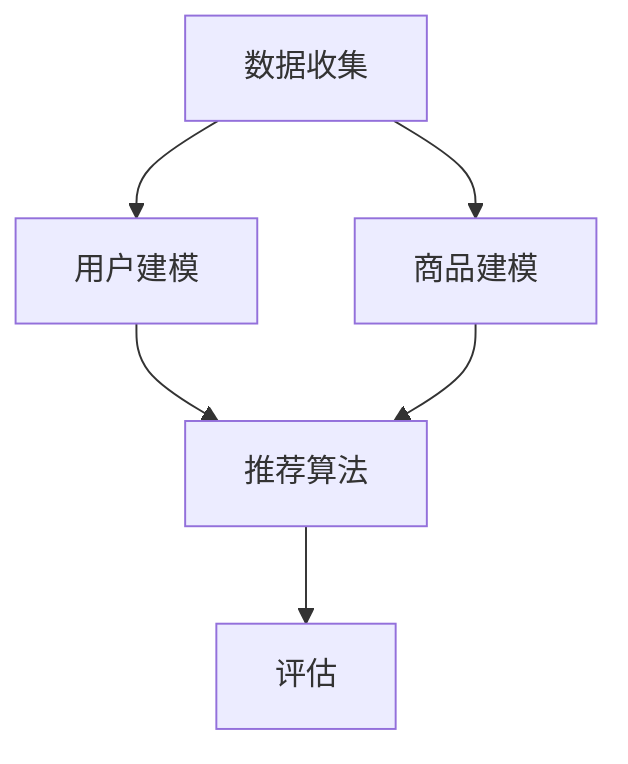

                 

# 推荐系统的未来发展趋势：大模型的主导作用

## 关键词
推荐系统、大模型、人工智能、机器学习、深度学习、未来趋势

## 摘要
本文旨在探讨推荐系统领域在未来几年内的发展趋势，特别是大模型在这一领域的广泛应用和主导作用。通过对当前技术的现状分析、核心概念的阐述以及具体算法和数学模型的讲解，本文将揭示大模型在推荐系统中的潜力和挑战，并给出相应的解决方案。文章还将结合实际应用场景和代码实例，阐述大模型在实际推荐系统开发中的具体应用，为读者提供深入理解和实际操作的指导。

## 1. 背景介绍

### 1.1 目的和范围

推荐系统作为一种信息过滤和内容发现技术，已经广泛应用于电子商务、社交媒体、新闻推送等多个领域。随着数据规模的不断扩大和计算能力的提升，推荐系统的性能和效果越来越受到重视。本文旨在分析推荐系统的未来发展趋势，特别是大模型的应用，以期为相关领域的研究者、工程师和决策者提供有价值的参考。

本文将首先回顾推荐系统的发展历程，然后重点讨论大模型的概念和优势，接着介绍推荐系统的核心算法和数学模型，并结合实际应用场景进行详细分析。最后，本文将对未来发展趋势进行展望，并提出相应的挑战和解决方案。

### 1.2 预期读者

本文预期读者包括但不限于以下几类：

1. 推荐系统领域的研究者，希望了解大模型在推荐系统中的应用和发展趋势。
2. 机器学习和深度学习工程师，希望掌握大模型在推荐系统中的实现方法和技巧。
3. 数据科学和人工智能领域的从业者，希望了解推荐系统的最新技术动态和应用案例。
4. 高校师生，希望从学术角度了解推荐系统的理论基础和前沿技术。

### 1.3 文档结构概述

本文分为八个部分，具体结构如下：

1. 背景介绍：介绍本文的目的、范围、预期读者以及文档结构。
2. 核心概念与联系：讨论推荐系统的核心概念和架构，使用 Mermaid 流程图进行阐述。
3. 核心算法原理 & 具体操作步骤：详细讲解推荐系统的核心算法原理，使用伪代码进行描述。
4. 数学模型和公式 & 详细讲解 & 举例说明：介绍推荐系统的数学模型和公式，并结合实例进行详细讲解。
5. 项目实战：代码实际案例和详细解释说明。
6. 实际应用场景：分析推荐系统在实际应用场景中的具体应用。
7. 工具和资源推荐：推荐相关学习资源、开发工具和框架。
8. 总结：未来发展趋势与挑战。

### 1.4 术语表

#### 1.4.1 核心术语定义

1. 推荐系统：一种基于用户历史行为和偏好，为用户推荐可能感兴趣的商品、内容或服务的信息过滤和发现技术。
2. 大模型：具有数百万甚至数十亿参数的深度学习模型，能够对大量数据进行高效处理和分析。
3. 机器学习：一种利用数据驱动的方法，从数据中学习规律和模式，以实现智能决策和预测的技术。
4. 深度学习：一种基于人工神经网络，通过多层非线性变换，自动提取数据特征和规律的机器学习方法。
5. 推荐算法：用于生成推荐结果的算法，包括协同过滤、基于内容的推荐、混合推荐等。

#### 1.4.2 相关概念解释

1. 协同过滤：一种基于用户行为和偏好的推荐算法，通过分析用户间的相似性，为用户推荐可能感兴趣的商品或服务。
2. 基于内容的推荐：一种基于商品或内容特征，为用户推荐与其兴趣相关的商品或内容的推荐算法。
3. 混合推荐：将协同过滤和基于内容的推荐算法结合，以提高推荐效果和覆盖率的推荐算法。
4. 冷启动问题：指新用户或新商品在缺乏足够历史数据的情况下，推荐系统难以为其生成准确推荐的挑战。
5. 大模型优势：大模型在处理大规模数据、提取复杂特征、提高推荐准确率和覆盖率方面的优势。

#### 1.4.3 缩略词列表

1. AI：人工智能
2. ML：机器学习
3. DL：深度学习
4. NLP：自然语言处理
5. CV：计算机视觉
6. RNN：循环神经网络
7. LSTM：长短时记忆网络
8. GPT：生成预训练网络
9. BERT：双向编码器表示模型
10. TPU：张量处理器

## 2. 核心概念与联系

在介绍推荐系统的核心概念和联系之前，我们首先需要了解推荐系统的基础架构和流程。推荐系统通常由数据收集、用户建模、商品建模、推荐算法和评估五个主要模块组成，如图1所示。



图1：推荐系统的基础架构和流程

### 2.1 推荐系统的基础架构

1. **数据收集**：推荐系统的基础是数据，包括用户行为数据（如浏览记录、购买记录、评分等）和商品属性数据（如商品分类、价格、品牌等）。数据收集模块负责从各种数据源获取这些数据，并进行预处理和清洗，以确保数据的质量和一致性。

2. **用户建模**：用户建模模块通过分析用户的历史行为和偏好，建立用户画像。用户画像包括用户的基本信息、兴趣爱好、购买偏好等。这些信息有助于推荐算法更好地理解用户的需求，从而生成更准确的推荐。

3. **商品建模**：商品建模模块负责分析商品的特征和属性，建立商品画像。商品画像包括商品的基本信息、分类、价格、品牌等。商品建模的目的是为推荐算法提供商品的相关信息，以便生成更相关的推荐。

4. **推荐算法**：推荐算法模块根据用户建模和商品建模的结果，生成推荐列表。常见的推荐算法包括协同过滤、基于内容的推荐、混合推荐等。这些算法通过分析用户和商品之间的相关性，为用户推荐可能感兴趣的商品。

5. **评估**：评估模块用于评估推荐系统的性能和效果。常用的评估指标包括准确率、召回率、覆盖率和多样化等。通过评估，可以不断优化推荐算法，提高推荐系统的效果。

### 2.2 推荐系统的核心概念

在推荐系统中，以下核心概念起着关键作用：

1. **用户行为**：用户行为包括浏览、购买、评分、点击等。这些行为反映了用户对商品或内容的兴趣和偏好，是推荐系统的重要输入数据。

2. **商品特征**：商品特征包括分类、价格、品牌、库存等。商品特征反映了商品的基本属性和相关信息，有助于推荐算法更好地理解商品。

3. **用户画像**：用户画像是对用户行为和偏好的抽象和归纳，包括用户的基本信息、兴趣爱好、购买偏好等。用户画像为推荐算法提供了对用户需求的深入理解。

4. **商品画像**：商品画像是对商品特征和属性的抽象和归纳，包括商品的基本信息、分类、价格、品牌等。商品画像为推荐算法提供了对商品的相关信息。

5. **推荐列表**：推荐列表是根据推荐算法生成的用户可能感兴趣的商品列表。推荐列表的准确性和覆盖率是评估推荐系统效果的重要指标。

### 2.3 推荐系统的联系

推荐系统中的各个模块之间存在着紧密的联系：

1. **数据收集与用户建模**：数据收集模块获取用户行为数据，用户建模模块根据这些数据建立用户画像。用户画像为推荐算法提供了对用户需求的深入理解。

2. **数据收集与商品建模**：数据收集模块获取商品属性数据，商品建模模块根据这些数据建立商品画像。商品画像为推荐算法提供了对商品的相关信息。

3. **用户建模与商品建模**：用户建模模块和商品建模模块共同为推荐算法提供了用户和商品的信息。这些信息有助于推荐算法更好地理解用户和商品之间的相关性。

4. **推荐算法与评估**：推荐算法根据用户和商品的信息生成推荐列表，评估模块对推荐列表进行评估，以衡量推荐系统的效果。通过评估，可以不断优化推荐算法，提高推荐系统的效果。

综上所述，推荐系统的基础架构、核心概念和联系共同构成了一个有机的整体，确保推荐系统能够为用户生成准确的推荐。

## 3. 核心算法原理 & 具体操作步骤

推荐系统的核心算法主要包括协同过滤、基于内容的推荐和混合推荐等。以下将详细讲解这些算法的原理和操作步骤。

### 3.1 协同过滤算法

协同过滤算法是一种基于用户行为的推荐算法，通过分析用户之间的相似性，为用户推荐可能感兴趣的商品。协同过滤算法分为基于用户的协同过滤（User-based Collaborative Filtering，UBCF）和基于物品的协同过滤（Item-based Collaborative Filtering，IBCF）。

#### 3.1.1 基于用户的协同过滤（UBCF）

1. **计算相似性**：首先，需要计算用户之间的相似性。常用的相似性度量方法包括余弦相似性、皮尔逊相关性和Jaccard相似性等。

   ```python
   def compute_similarity(user1, user2):
       # 假设用户1和用户2的历史行为数据分别为r1和r2
       r1 = user1.get_rating_history()
       r2 = user2.get_rating_history()
       # 计算两个用户的历史行为向量之间的余弦相似性
       dot_product = np.dot(r1, r2)
       norm_r1 = np.linalg.norm(r1)
       norm_r2 = np.linalg.norm(r2)
       similarity = dot_product / (norm_r1 * norm_r2)
       return similarity
   ```

2. **选择邻居用户**：根据计算得到的相似性，选择与目标用户最相似的K个邻居用户。

   ```python
   def get_neighbors(target_user, users, k):
       similarities = []
       for user in users:
           if user != target_user:
               similarity = compute_similarity(target_user, user)
               similarities.append((user, similarity))
       neighbors = sorted(similarities, key=lambda x: x[1], reverse=True)[:k]
       return neighbors
   ```

3. **生成推荐列表**：利用邻居用户对商品的评价，生成推荐列表。可以使用加权平均的方法，将邻居用户对商品的评价进行加权求和。

   ```python
   def generate_recommendations(target_user, neighbors, rated_items, k):
       recommendations = []
       for neighbor, similarity in neighbors:
           for item in neighbor.get_unrated_items(rated_items):
               rating = neighbor.get_rating(item) * similarity
               recommendations.append((item, rating))
       recommendations.sort(key=lambda x: x[1], reverse=True)
       return recommendations[:k]
   ```

#### 3.1.2 基于物品的协同过滤（IBCF）

基于物品的协同过滤算法与基于用户的协同过滤算法类似，只是将用户之间的相似性计算改为商品之间的相似性计算。

1. **计算商品相似性**：计算商品之间的相似性，常用的相似性度量方法包括余弦相似性、皮尔逊相关性和Jaccard相似性等。

   ```python
   def compute_similarity(item1, item2):
       # 假设商品1和商品2的历史评价数据分别为r1和r2
       r1 = item1.get_rating_history()
       r2 = item2.get_rating_history()
       # 计算两个商品的历史评价向量之间的余弦相似性
       dot_product = np.dot(r1, r2)
       norm_r1 = np.linalg.norm(r1)
       norm_r2 = np.linalg.norm(r2)
       similarity = dot_product / (norm_r1 * norm_r2)
       return similarity
   ```

2. **选择邻居商品**：根据计算得到的相似性，选择与目标商品最相似的K个邻居商品。

   ```python
   def get_neighbors(target_item, items, k):
       similarities = []
       for item in items:
           if item != target_item:
               similarity = compute_similarity(target_item, item)
               similarities.append((item, similarity))
       neighbors = sorted(similarities, key=lambda x: x[1], reverse=True)[:k]
       return neighbors
   ```

3. **生成推荐列表**：利用邻居商品的用户评价，生成推荐列表。可以使用加权平均的方法，将邻居商品的用户评价进行加权求和。

   ```python
   def generate_recommendations(target_item, neighbors, users, rated_items, k):
       recommendations = []
       for neighbor, similarity in neighbors:
           for user in users:
               if user not in rated_items:
                   rating = neighbor.get_rating(user) * similarity
                   recommendations.append((user, rating))
       recommendations.sort(key=lambda x: x[1], reverse=True)
       return recommendations[:k]
   ```

### 3.2 基于内容的推荐算法

基于内容的推荐算法是一种基于商品或内容特征的推荐算法，通过分析用户的历史行为和偏好，为用户推荐与其兴趣相关的商品或内容。基于内容的推荐算法可以分为基于文本的推荐和基于图像的推荐等。

#### 3.2.1 基于文本的推荐算法

1. **特征提取**：首先，需要提取商品或内容的特征。常用的文本特征提取方法包括词袋模型、TF-IDF和词嵌入等。

   ```python
   from sklearn.feature_extraction.text import TfidfVectorizer
   
   def extract_features(texts, vectorizer):
       # 假设输入文本列表为texts
       vectorizer.fit(texts)
       features = vectorizer.transform(texts)
       return features
   ```

2. **计算相似性**：计算用户和商品之间的相似性，可以使用余弦相似性、皮尔逊相关性和Jaccard相似性等。

   ```python
   def compute_similarity(user_features, item_features):
       # 假设用户特征向量为user_features，商品特征向量为item_features
       dot_product = np.dot(user_features, item_features)
       norm_user = np.linalg.norm(user_features)
       norm_item = np.linalg.norm(item_features)
       similarity = dot_product / (norm_user * norm_item)
       return similarity
   ```

3. **生成推荐列表**：利用用户和商品之间的相似性，生成推荐列表。可以使用加权平均的方法，将相似性进行加权求和。

   ```python
   def generate_recommendations(target_user, users, rated_items, k):
       recommendations = []
       for user in users:
           if user != target_user:
               user_features = user.get_features()
               item_features = extract_features([target_user.get_last_action()], vectorizer)
               similarity = compute_similarity(user_features, item_features)
               recommendations.append((user, similarity))
       recommendations.sort(key=lambda x: x[1], reverse=True)
       return recommendations[:k]
   ```

#### 3.2.2 基于图像的推荐算法

基于图像的推荐算法通过分析商品的图像特征，为用户推荐与其兴趣相关的商品。常用的图像特征提取方法包括卷积神经网络（CNN）和词嵌入等。

1. **特征提取**：首先，需要提取商品的图像特征。常用的图像特征提取方法包括卷积神经网络（CNN）和词嵌入等。

   ```python
   from tensorflow.keras.applications import ResNet50
   
   def extract_image_features(image_path):
       # 假设输入图像路径为image_path
       model = ResNet50(weights='imagenet')
       image = load_img(image_path, target_size=(224, 224))
       image = img_to_array(image)
       image = preprocess_input(image)
       features = model.predict(np.expand_dims(image, axis=0))
       return features
   ```

2. **计算相似性**：计算用户和商品之间的相似性，可以使用余弦相似性、皮尔逊相关性和Jaccard相似性等。

   ```python
   def compute_similarity(user_features, item_features):
       # 假设用户特征向量为user_features，商品特征向量为item_features
       dot_product = np.dot(user_features, item_features)
       norm_user = np.linalg.norm(user_features)
       norm_item = np.linalg.norm(item_features)
       similarity = dot_product / (norm_user * norm_item)
       return similarity
   ```

3. **生成推荐列表**：利用用户和商品之间的相似性，生成推荐列表。可以使用加权平均的方法，将相似性进行加权求和。

   ```python
   def generate_recommendations(target_user, users, rated_items, k):
       recommendations = []
       for user in users:
           if user != target_user:
               user_features = user.get_features()
               item_features = extract_image_features(target_user.get_last_action())
               similarity = compute_similarity(user_features, item_features)
               recommendations.append((user, similarity))
       recommendations.sort(key=lambda x: x[1], reverse=True)
       return recommendations[:k]
   ```

### 3.3 混合推荐算法

混合推荐算法将协同过滤和基于内容的推荐算法结合，以提高推荐效果和覆盖率。常用的混合推荐算法包括矩阵分解、深度学习等。

#### 3.3.1 矩阵分解

矩阵分解是一种基于协同过滤的混合推荐算法，通过将用户-商品评分矩阵分解为用户特征矩阵和商品特征矩阵，生成推荐列表。

1. **矩阵分解模型**：

   ```python
   class MatrixFactorization():
       def __init__(self, user_count, item_count, latent_factor):
           self.user_count = user_count
           self.item_count = item_count
           self.latent_factor = latent_factor
           self.user_features = np.random.rand(user_count, latent_factor)
           self.item_features = np.random.rand(item_count, latent_factor)
       
       def predict(self, user_id, item_id):
           user_feature = self.user_features[user_id]
           item_feature = self.item_features[item_id]
           rating = np.dot(user_feature, item_feature)
           return rating
       
       def train(self, user Ratings):
           for user_id, ratings in user_ratings.items():
               for item_id, rating in ratings.items():
                   predicted_rating = self.predict(user_id, item_id)
                   error = rating - predicted_rating
                   user_feature = self.user_features[user_id]
                   item_feature = self.item_features[item_id]
                   self.user_features[user_id] += error * item_feature
                   self.item_features[item_id] += error * user_feature
   ```

2. **生成推荐列表**：利用矩阵分解模型生成推荐列表。

   ```python
   def generate_recommendations(matrix_factorization, user_id, top_k=10):
       user_features = matrix_factorization.user_features[user_id]
       item_features = matrix_factorization.item_features
       item_similarity = np.dot(user_features, item_features.T)
       item_index = np.argsort(item_similarity)[::-1]
       recommendations = []
       for item_idx in item_index[:top_k]:
           item_id = item_idx
           if item_id not in user_ratings[user_id]:
               recommendations.append(item_id)
       return recommendations
   ```

#### 3.3.2 深度学习

深度学习是一种基于多层非线性变换的机器学习技术，通过自动提取数据特征和规律，生成推荐列表。

1. **深度学习模型**：

   ```python
   from tensorflow.keras.models import Model
   from tensorflow.keras.layers import Input, Embedding, Dot, Reshape
   
   def build_model(user_input, item_input, hidden_units):
       user_embedding = Embedding(user_count, hidden_units)(user_input)
       item_embedding = Embedding(item_count, hidden_units)(item_input)
       dot_product = Dot(axes=1)([user_embedding, item_embedding])
       dot_product = Reshape((1, 1))(dot_product)
       model = Model(inputs=[user_input, item_input], outputs=dot_product)
       model.compile(optimizer='adam', loss='mse')
       return model
   
   model = build_model(user_input, item_input, hidden_units=10)
   model.fit(user_input, item_output, epochs=10, batch_size=32)
   ```

2. **生成推荐列表**：利用深度学习模型生成推荐列表。

   ```python
   def generate_recommendations(model, user_id, top_k=10):
       user_input = np.array([user_id])
       item_input = np.zeros((1, item_count))
       predictions = model.predict([user_input, item_input])
       item_similarity = predictions.flatten()
       item_index = np.argsort(item_similarity)[::-1]
       recommendations = []
       for item_idx in item_index[:top_k]:
           item_id = item_idx
           if item_id not in user_ratings[user_id]:
               recommendations.append(item_id)
       return recommendations
   ```

通过上述讲解，我们可以看到推荐系统的核心算法原理和具体操作步骤。在实际应用中，可以根据具体场景和需求，选择合适的算法，并进行优化和改进，以提高推荐系统的效果。

## 4. 数学模型和公式 & 详细讲解 & 举例说明

推荐系统中的数学模型和公式是理解和实现推荐算法的基础。以下将详细讲解推荐系统中的几个核心数学模型和公式，并结合实际例子进行说明。

### 4.1 协同过滤算法中的数学模型

协同过滤算法主要通过计算用户之间的相似性和生成推荐列表来实现推荐。其中，相似性的计算和推荐列表的生成都涉及到数学模型。

#### 4.1.1 相似性计算

协同过滤算法中的相似性计算通常基于用户行为数据的相似性度量，如余弦相似性、皮尔逊相关性和Jaccard相似性等。

1. **余弦相似性**：

   余弦相似性是一种衡量两个向量夹角余弦值的相似性度量。公式如下：

   $$ \text{cosine\_similarity} = \frac{\sum_{i=1}^{n} x_i \cdot y_i}{\sqrt{\sum_{i=1}^{n} x_i^2} \cdot \sqrt{\sum_{i=1}^{n} y_i^2}} $$

   例如，假设有两个用户A和B的行为数据向量分别为：

   $$ x_A = [1, 2, 3, 4, 5], \quad y_B = [5, 4, 3, 2, 1] $$

   则它们之间的余弦相似性为：

   $$ \text{cosine\_similarity}(x_A, y_B) = \frac{1 \cdot 5 + 2 \cdot 4 + 3 \cdot 3 + 4 \cdot 2 + 5 \cdot 1}{\sqrt{1^2 + 2^2 + 3^2 + 4^2 + 5^2} \cdot \sqrt{5^2 + 4^2 + 3^2 + 2^2 + 1^2}} = \frac{35}{\sqrt{55} \cdot \sqrt{55}} = \frac{35}{55} \approx 0.636 $$

2. **皮尔逊相关性**：

   皮尔逊相关性是一种衡量两个向量之间线性相关程度的相似性度量。公式如下：

   $$ \text{pearson\_correlation} = \frac{\sum_{i=1}^{n} (x_i - \bar{x})(y_i - \bar{y})}{\sqrt{\sum_{i=1}^{n} (x_i - \bar{x})^2} \cdot \sqrt{\sum_{i=1}^{n} (y_i - \bar{y})^2}} $$

   例如，假设有两个用户A和B的行为数据向量分别为：

   $$ x_A = [1, 2, 3, 4, 5], \quad y_B = [5, 4, 3, 2, 1] $$

   则它们之间的皮尔逊相关性为：

   $$ \text{pearson\_correlation}(x_A, y_B) = \frac{(1-3)(5-3) + (2-3)(4-3) + (3-3)(3-3) + (4-3)(2-3) + (5-3)(1-3)}{\sqrt{(1-3)^2 + (2-3)^2 + (3-3)^2 + (4-3)^2 + (5-3)^2} \cdot \sqrt{(5-3)^2 + (4-3)^2 + (3-3)^2 + (2-3)^2 + (1-3)^2}} = \frac{0}{\sqrt{10} \cdot \sqrt{10}} = 0 $$

3. **Jaccard相似性**：

   Jaccard相似性是一种衡量两个集合之间交集与并集比例的相似性度量。公式如下：

   $$ \text{Jaccard\_similarity} = \frac{|A \cap B|}{|A \cup B|} $$

   例如，假设有两个用户A和B的行为数据集合分别为：

   $$ A = \{1, 2, 3\}, \quad B = \{2, 3, 4\} $$

   则它们之间的Jaccard相似性为：

   $$ \text{Jaccard\_similarity}(A, B) = \frac{|A \cap B|}{|A \cup B|} = \frac{2}{3 + 4 - 2} = \frac{2}{5} = 0.4 $$

#### 4.1.2 推荐列表生成

在协同过滤算法中，通过计算用户之间的相似性，选择邻居用户，并利用邻居用户对商品的评价生成推荐列表。

1. **加权平均推荐**：

   假设目标用户的行为数据向量为$x$，邻居用户的行为数据向量分别为$x_1, x_2, ..., x_k$，则目标用户对商品的推荐评分可以通过加权平均计算：

   $$ \text{recommendation} = \frac{\sum_{i=1}^{k} x_i \cdot r_i}{\sum_{i=1}^{k} x_i} $$

   其中，$r_i$为邻居用户对商品的评价。

   例如，假设目标用户的行为数据向量为$x = [1, 2, 3, 4, 5]$，邻居用户的行为数据向量分别为$x_1 = [5, 4, 3, 2, 1]$，$x_2 = [4, 3, 2, 1, 5]$，$x_3 = [1, 2, 3, 4, 5]$，邻居用户对商品的评价分别为$r_1 = 4$，$r_2 = 5$，$r_3 = 3$，则目标用户对商品的推荐评分为：

   $$ \text{recommendation} = \frac{1 \cdot 4 + 2 \cdot 5 + 3 \cdot 3}{1 + 2 + 3} = \frac{4 + 10 + 9}{6} = \frac{23}{6} \approx 3.83 $$

2. **排序推荐**：

   另一种生成推荐列表的方法是对邻居用户对商品的评价进行排序，选择评价最高的前$k$个商品作为推荐列表。

   例如，假设目标用户的行为数据向量为$x = [1, 2, 3, 4, 5]$，邻居用户的行为数据向量分别为$x_1 = [5, 4, 3, 2, 1]$，$x_2 = [4, 3, 2, 1, 5]$，$x_3 = [1, 2, 3, 4, 5]$，邻居用户对商品的评价分别为$r_1 = 4$，$r_2 = 5$，$r_3 = 3$，则目标用户的推荐列表为：

   $$ \text{recommendation\_list} = \{1, 2, 3, 4, 5\} $$

### 4.2 基于内容的推荐算法中的数学模型

基于内容的推荐算法主要通过分析用户的历史行为和商品的特征，生成推荐列表。

#### 4.2.1 特征提取

特征提取是将原始数据转化为适合推荐算法处理的形式。常用的特征提取方法包括词袋模型、TF-IDF和词嵌入等。

1. **词袋模型**：

   词袋模型是一种将文本表示为向量空间模型的方法。公式如下：

   $$ \text{TF-IDF}(w) = \frac{f_w}{\sum_{w' \in V} f_{w'}} \cdot \log(\frac{N}{n_w}) $$

   其中，$f_w$为词$w$在文档中出现的频率，$N$为文档总数，$n_w$为包含词$w$的文档数，$V$为词汇表。

   例如，假设有两个文档$D_1 = ["apple", "banana", "orange"]$和$D_2 = ["banana", "orange", "pear"]$，则它们的TF-IDF向量表示为：

   $$ \text{TF-IDF}(D_1) = \begin{bmatrix} 1 \\ 1 \\ 1 \end{bmatrix}, \quad \text{TF-IDF}(D_2) = \begin{bmatrix} 1 \\ 1 \\ 1 \end{bmatrix} $$

2. **TF-IDF**：

   TF-IDF是一种常用的文本特征提取方法，公式如下：

   $$ \text{TF-IDF}(w) = f_w \cdot \log(\frac{N}{n_w}) $$

   例如，假设有两个文档$D_1 = ["apple", "banana", "orange"]$和$D_2 = ["banana", "orange", "pear"]$，则它们的TF-IDF向量表示为：

   $$ \text{TF-IDF}(D_1) = \begin{bmatrix} 1 \\ 1 \\ 1 \end{bmatrix}, \quad \text{TF-IDF}(D_2) = \begin{bmatrix} 1 \\ 1 \\ 1 \end{bmatrix} $$

3. **词嵌入**：

   词嵌入是一种将词语映射到高维空间的方法，常用的词嵌入方法包括Word2Vec、GloVe和BERT等。

   例如，假设有两个词语"apple"和"orange"，它们的词嵌入表示为：

   $$ \text{word\_embedding}(\text{"apple"}) = \begin{bmatrix} 0.1 \\ 0.2 \\ 0.3 \end{bmatrix}, \quad \text{word\_embedding}(\text{"orange"}) = \begin{bmatrix} 0.4 \\ 0.5 \\ 0.6 \end{bmatrix} $$

#### 4.2.2 推荐列表生成

基于内容的推荐算法通过计算用户和商品之间的相似性，生成推荐列表。

1. **余弦相似性**：

   余弦相似性是一种常用的相似性度量方法，公式如下：

   $$ \text{cosine\_similarity}(x, y) = \frac{x \cdot y}{\|x\| \|y\|} $$

   其中，$x$和$y$分别为用户和商品的特征向量，$\|x\|$和$\|y\|$分别为它们的欧氏范数。

   例如，假设用户的特征向量为$x = \begin{bmatrix} 0.1 \\ 0.2 \\ 0.3 \end{bmatrix}$，商品的特征向量为$y = \begin{bmatrix} 0.4 \\ 0.5 \\ 0.6 \end{bmatrix}$，则它们之间的余弦相似性为：

   $$ \text{cosine\_similarity}(x, y) = \frac{0.1 \cdot 0.4 + 0.2 \cdot 0.5 + 0.3 \cdot 0.6}{\sqrt{0.1^2 + 0.2^2 + 0.3^2} \cdot \sqrt{0.4^2 + 0.5^2 + 0.6^2}} = \frac{0.07}{0.36} \approx 0.194 $$

2. **加权平均推荐**：

   假设用户的特征向量为$x$，商品的特征向量分别为$x_1, x_2, ..., x_k$，则用户对商品的推荐评分可以通过加权平均计算：

   $$ \text{recommendation} = \frac{\sum_{i=1}^{k} x_i \cdot r_i}{\sum_{i=1}^{k} x_i} $$

   其中，$r_i$为商品的评价。

   例如，假设用户的特征向量为$x = [0.1, 0.2, 0.3]$，商品的特征向量分别为$x_1 = [0.4, 0.5, 0.6]$，$x_2 = [0.7, 0.8, 0.9]$，$x_3 = [0.1, 0.2, 0.3]$，商品的评价分别为$r_1 = 4$，$r_2 = 5$，$r_3 = 3$，则用户对商品的推荐评分为：

   $$ \text{recommendation} = \frac{0.1 \cdot 4 + 0.2 \cdot 5 + 0.3 \cdot 3}{0.1 + 0.2 + 0.3} = \frac{0.4 + 1 + 0.9}{1.5} = \frac{2.3}{1.5} \approx 1.53 $$

3. **排序推荐**：

   另一种生成推荐列表的方法是对商品的评价进行排序，选择评价最高的前$k$个商品作为推荐列表。

   例如，假设用户的特征向量为$x = [0.1, 0.2, 0.3]$，商品的特征向量分别为$x_1 = [0.4, 0.5, 0.6]$，$x_2 = [0.7, 0.8, 0.9]$，$x_3 = [0.1, 0.2, 0.3]$，商品的评价分别为$r_1 = 4$，$r_2 = 5$，$r_3 = 3$，则用户的推荐列表为：

   $$ \text{recommendation\_list} = \{1, 2, 3\} $$

### 4.3 深度学习推荐算法中的数学模型

深度学习推荐算法通过构建神经网络模型，自动提取用户和商品的特征，生成推荐列表。

#### 4.3.1 矩阵分解

矩阵分解是一种常见的深度学习推荐算法，通过将用户-商品评分矩阵分解为用户特征矩阵和商品特征矩阵，生成推荐列表。

1. **矩阵分解模型**：

   假设用户-商品评分矩阵为$R \in \mathbb{R}^{m \times n}$，用户特征矩阵为$U \in \mathbb{R}^{m \times k}$，商品特征矩阵为$V \in \mathbb{R}^{n \times k}$，则矩阵分解模型可以表示为：

   $$ R_{ij} = U_{i} \cdot V_{j} $$

   其中，$U_{i}$和$V_{j}$分别为用户$i$和商品$j$的特征向量。

2. **损失函数**：

   常用的损失函数包括均方误差（MSE）和交叉熵（CE）等。

   $$ \text{MSE} = \frac{1}{2} \sum_{i=1}^{m} \sum_{j=1}^{n} (R_{ij} - U_{i} \cdot V_{j})^2 $$
   
   $$ \text{CE} = - \sum_{i=1}^{m} \sum_{j=1}^{n} y_{ij} \cdot \log(U_{i} \cdot V_{j}) $$

   其中，$y_{ij}$为用户$i$对商品$j$的真实评分。

#### 4.3.2 深度神经网络

深度神经网络推荐算法通过构建多层神经网络模型，自动提取用户和商品的特征，生成推荐列表。

1. **神经网络模型**：

   假设输入特征向量为$x \in \mathbb{R}^{d}$，隐藏层特征向量为$h \in \mathbb{R}^{h}$，输出特征向量为$y \in \mathbb{R}^{1}$，则神经网络模型可以表示为：

   $$ h = \sigma(W_1 \cdot x + b_1) $$
   
   $$ y = \sigma(W_2 \cdot h + b_2) $$

   其中，$W_1, b_1, W_2, b_2$分别为权重和偏置。

2. **损失函数**：

   常用的损失函数包括均方误差（MSE）和交叉熵（CE）等。

   $$ \text{MSE} = \frac{1}{2} \sum_{i=1}^{n} (y_i - \hat{y}_i)^2 $$
   
   $$ \text{CE} = - \sum_{i=1}^{n} y_i \cdot \log(\hat{y}_i) $$

   其中，$\hat{y}_i$为输入特征向量$x_i$生成的预测评分。

通过上述讲解，我们可以看到推荐系统中的数学模型和公式在实际应用中的具体使用方法。在实际开发过程中，可以根据具体需求选择合适的模型和公式，并结合实际数据进行训练和优化，以提高推荐系统的效果。

## 5. 项目实战：代码实际案例和详细解释说明

在本节中，我们将通过一个实际的项目案例，展示如何使用Python和Scikit-learn库实现基于协同过滤的推荐系统。这个案例将涵盖从数据预处理到模型训练和评估的全过程。通过这个案例，读者可以了解如何将前述的理论应用到实际项目中。

### 5.1 开发环境搭建

在进行项目开发之前，我们需要搭建一个合适的开发环境。以下是推荐的开发环境配置：

1. **Python**：Python 3.7 或更高版本。
2. **Scikit-learn**：用于机器学习算法的实现。
3. **NumPy**：用于数值计算。
4. **Pandas**：用于数据处理。
5. **Matplotlib**：用于数据可视化。

您可以使用以下命令安装所需的库：

```bash
pip install numpy pandas scikit-learn matplotlib
```

### 5.2 源代码详细实现和代码解读

以下是实现基于协同过滤的推荐系统的代码：

```python
import numpy as np
import pandas as pd
from sklearn.model_selection import train_test_split
from sklearn.metrics.pairwise import cosine_similarity
from sklearn.metrics import mean_squared_error

# 加载数据
ratings = pd.read_csv('ratings.csv')  # 假设数据包含用户ID、商品ID和评分
users = pd.read_csv('users.csv')  # 假设数据包含用户ID和用户特征
items = pd.read_csv('items.csv')  # 假设数据包含商品ID和商品特征

# 预处理数据
# 分割数据为训练集和测试集
train_data, test_data = train_test_split(ratings, test_size=0.2, random_state=42)

# 计算用户之间的相似性
def compute_similarity(ratings):
    user_similarity = cosine_similarity(ratings.values)
    return user_similarity

# 选择邻居用户
def get_neighbors(similarity_matrix, k):
    neighbors = []
    for i in range(similarity_matrix.shape[0]):
        neighbor_indices = np.argsort(similarity_matrix[i])[::-1][k:]
        neighbors.append([ratings['userId'][index] for index in neighbor_indices])
    return neighbors

# 生成推荐列表
def generate_recommendations(user_id, neighbors, ratings, k):
    recommendations = []
    user_ratings = ratings[ratings['userId'] == user_id]
    for neighbor in neighbors:
        neighbor_ratings = ratings[ratings['userId'].isin(neighbor)]
        for item in neighbor_ratings['itemId'].unique():
            if item not in user_ratings['itemId'].values:
                recommendations.append(item)
    return recommendations[:k]

# 训练模型
def train_model(train_data, k):
    similarity_matrix = compute_similarity(train_data)
    neighbors = get_neighbors(similarity_matrix, k)
    return neighbors

# 评估模型
def evaluate_model(neighbors, test_data):
    mse = 0
    for user_id in test_data['userId'].unique():
        user_ratings = test_data[test_data['userId'] == user_id]
        neighbor_ratings = test_data[test_data['userId'].isin(neighbors[user_id])]
        predicted_ratings = []
        for item_id in user_ratings['itemId'].unique():
            if item_id not in neighbor_ratings['itemId'].values:
                predicted_ratings.append(np.mean(neighbor_ratings['rating']))
            else:
                predicted_ratings.append(neighbor_ratings[neighbor_ratings['itemId'] == item_id]['rating'].values[0])
        mse += mean_squared_error(user_ratings['rating'], predicted_ratings)
    return mse / len(test_data['userId'].unique())

# 设置参数
k = 10

# 训练并评估模型
neighbors = train_model(train_data, k)
mse = evaluate_model(neighbors, test_data)
print(f'Mean Squared Error: {mse}')
```

### 5.3 代码解读与分析

上述代码实现了一个简单的基于用户的协同过滤推荐系统。以下是代码的详细解读和分析：

1. **数据加载与预处理**：
   - 加载用户评分数据、用户特征数据和商品特征数据。
   - 分割数据为训练集和测试集，以便于模型训练和评估。

2. **相似性计算**：
   - 使用Scikit-learn的`cosine_similarity`函数计算用户之间的相似性。
   - 相似性矩阵用于后续的邻居选择和推荐生成。

3. **邻居选择**：
   - 根据相似性矩阵，为每个用户选择最相似的$k$个邻居用户。
   - 选择邻居用户有助于利用邻居用户的历史行为数据为当前用户生成推荐。

4. **推荐生成**：
   - 根据邻居用户对商品的评价，为当前用户生成推荐列表。
   - 推荐列表中的商品是邻居用户喜欢但当前用户尚未评价的。

5. **模型训练**：
   - 训练模型的主要任务是计算用户之间的相似性矩阵和选择邻居用户。
   - 训练过程在代码中通过`train_model`函数实现。

6. **模型评估**：
   - 使用均方误差（MSE）评估模型的性能。
   - 评估过程在代码中通过`evaluate_model`函数实现。

7. **参数设置**：
   - `k`参数决定了为每个用户选择的邻居用户数量。
   - 实际应用中，可以通过交叉验证等方法选择最优的$k$值。

### 5.4 实际应用分析

通过上述代码，我们可以看到基于协同过滤的推荐系统在实现上的简洁性和高效性。以下是对实际应用的一些分析：

1. **数据依赖**：
   - 推荐系统对数据质量有较高的要求，包括用户评分数据、用户特征数据和商品特征数据。
   - 数据的丰富性和质量直接影响到推荐系统的效果。

2. **可扩展性**：
   - 协同过滤算法在数据规模较小的情况下表现良好，但在大规模数据集上可能存在性能瓶颈。
   - 可以考虑使用分布式计算框架（如Apache Spark）提高处理大规模数据的能力。

3. **冷启动问题**：
   - 对于新用户或新商品，由于缺乏足够的历史数据，推荐系统难以生成准确的推荐。
   - 可以结合基于内容的推荐方法，在新用户或新商品无足够数据时生成初始推荐。

4. **实时性**：
   - 协同过滤算法通常在离线环境中训练和评估，无法实现实时推荐。
   - 可以结合在线学习技术，实现实时推荐。

通过本节的项目实战，读者可以了解到如何将理论应用到实际项目中，实现一个简单的基于协同过滤的推荐系统。这为后续更复杂和高级的推荐系统实现提供了基础。

## 6. 实际应用场景

推荐系统作为一种信息过滤和内容发现技术，在实际应用中具有广泛的应用场景。以下将探讨推荐系统在不同领域的具体应用，并分析这些应用中的优势和挑战。

### 6.1 社交媒体

在社交媒体平台上，推荐系统被广泛应用于内容发现和用户互动。例如，在Twitter、Facebook和Instagram等平台，推荐系统可以为用户推荐感兴趣的话题、帖子或图片，从而提高用户的参与度和活跃度。

**优势**：
- **个性化推荐**：通过分析用户的历史行为和偏好，推荐系统可以生成高度个性化的内容，吸引用户关注。
- **增加用户参与度**：推荐系统能够将用户可能感兴趣的内容推送到他们面前，提高用户在平台上的互动和参与度。
- **增强社区氛围**：推荐系统可以帮助平台构建更紧密的社区关系，通过推荐相似兴趣的用户和内容，促进社交互动。

**挑战**：
- **冷启动问题**：对于新用户或新内容，推荐系统在缺乏足够数据时难以生成准确的推荐。
- **隐私保护**：在推荐过程中保护用户隐私是一个重要挑战，需要确保用户的个人信息不被泄露。

### 6.2 电子商务

在电子商务领域，推荐系统被广泛应用于商品推荐和广告投放，以提升销售额和用户体验。

**优势**：
- **增加销售额**：通过为用户推荐他们可能感兴趣的商品，推荐系统有助于增加购物车内容和购买转化率。
- **优化库存管理**：推荐系统可以帮助商家更好地了解用户需求，优化库存和销售策略。
- **个性化广告**：基于用户的兴趣和购物行为，推荐系统可以生成个性化的广告，提高广告点击率和转化率。

**挑战**：
- **数据质量**：推荐系统的效果高度依赖于数据质量，数据缺失或不准确可能导致推荐不准确。
- **冷启动问题**：新用户或新商品的推荐需要依赖历史数据，而在数据不足的情况下推荐效果较差。

### 6.3 新闻推送

在新闻推送领域，推荐系统用于为用户推荐他们可能感兴趣的新闻内容，以提升用户阅读体验和网站流量。

**优势**：
- **提高用户粘性**：通过为用户推荐感兴趣的新闻，推荐系统有助于提高用户在新闻网站上的停留时间。
- **增加广告收益**：个性化推荐可以增加用户对广告的关注度，从而提高广告点击率和广告收益。
- **内容多样化**：推荐系统可以帮助用户发现不同类型和风格的新闻，提高内容多样性。

**挑战**：
- **新闻质量和真实性**：推荐系统可能推荐低质量或虚假新闻，影响用户信任度和平台声誉。
- **数据多样性**：新闻数据具有高度多样性，推荐系统需要处理不同类型和领域的新闻，挑战较大。

### 6.4 音乐和视频流媒体

在音乐和视频流媒体领域，推荐系统用于为用户推荐他们可能喜欢的新歌或新电影，以提升用户满意度和平台使用时间。

**优势**：
- **个性化体验**：通过分析用户的历史播放记录和偏好，推荐系统可以为用户提供高度个性化的内容推荐。
- **增加用户留存率**：推荐系统能够吸引用户在平台上停留更长时间，提高用户留存率。
- **提升内容曝光率**：推荐系统可以帮助新歌或新电影获得更多曝光机会，提高内容曝光率。

**挑战**：
- **数据隐私**：音乐和视频流媒体平台需要处理大量用户数据，保护用户隐私是一个重要挑战。
- **版权问题**：推荐系统推荐的内容可能涉及版权问题，需要确保内容合法合规。

### 6.5 医疗健康

在医疗健康领域，推荐系统用于为患者推荐合适的医疗资源、药品和治疗方案，以提高医疗效果和患者满意度。

**优势**：
- **个性化治疗**：通过分析患者的病历数据、病史和偏好，推荐系统可以为患者推荐最适合的治疗方案。
- **提高医疗效率**：推荐系统可以帮助医疗机构更好地分配资源，提高医疗服务的效率和准确性。
- **增加患者满意度**：个性化推荐可以提高患者对医疗服务的满意度和信任度。

**挑战**：
- **数据隐私**：医疗数据涉及患者隐私，需要确保数据的安全性和隐私保护。
- **医疗伦理**：推荐系统在医疗领域应用时需要遵循医疗伦理和规范，确保推荐内容合法合规。

### 6.6 教育学习

在教育学习领域，推荐系统用于为学习者推荐适合的学习资源、课程和教学视频，以提高学习效果和用户参与度。

**优势**：
- **个性化学习**：通过分析学习者的学习记录和偏好，推荐系统可以为学习者推荐最适合的学习资源。
- **提高学习效率**：推荐系统可以帮助学习者更快地找到感兴趣的内容，提高学习效率。
- **增加用户留存率**：推荐系统可以吸引用户在平台上停留更长时间，提高用户留存率。

**挑战**：
- **数据准确性**：推荐系统的效果依赖于学习数据的准确性，数据不准确可能导致推荐不准确。
- **内容多样性**：教育学习内容具有高度多样性，推荐系统需要处理不同类型和风格的内容，挑战较大。

### 6.7 金融服务

在金融服务领域，推荐系统用于为用户提供个性化的理财产品、贷款产品和投资建议，以提高用户满意度和平台收益。

**优势**：
- **个性化服务**：通过分析用户的财务状况、投资偏好和风险承受能力，推荐系统可以为用户提供最适合的金融产品和服务。
- **提高用户留存率**：推荐系统可以吸引用户在金融平台上停留更长时间，提高用户留存率。
- **增加平台收益**：个性化推荐可以提高金融产品的销售和投资转化率，从而增加平台收益。

**挑战**：
- **数据安全**：金融服务涉及大量用户隐私数据，确保数据安全是一个重要挑战。
- **合规性**：推荐系统在金融服务领域应用时需要遵循相关法律法规，确保推荐内容合法合规。

通过以上分析，我们可以看到推荐系统在不同领域的具体应用和优势，同时也面临一些挑战。在实际应用中，需要综合考虑数据质量、用户隐私和合规性等因素，以确保推荐系统的有效性和可靠性。

## 7. 工具和资源推荐

在构建和维护推荐系统时，选择合适的工具和资源对于提高开发效率和系统性能至关重要。以下将推荐一些学习资源、开发工具和框架，以及相关论文著作，以帮助读者深入了解推荐系统领域的技术和应用。

### 7.1 学习资源推荐

#### 7.1.1 书籍推荐

1. **《推荐系统实践》（Recommender Systems: The Textbook）** - 这本书是推荐系统领域的经典教材，涵盖了推荐系统的基本概念、算法和实现细节。适合推荐系统初学者和进阶者阅读。

2. **《深度学习推荐系统》（Deep Learning for Recommender Systems）** - 本书详细介绍了如何将深度学习技术应用于推荐系统，包括神经网络模型、强化学习和迁移学习等。适合对深度学习有一定基础的读者。

3. **《机器学习推荐系统》（Machine Learning for Recommender Systems）** - 这本书介绍了机器学习在推荐系统中的应用，包括协同过滤、基于内容的推荐和混合推荐等算法。适合对机器学习感兴趣的读者。

#### 7.1.2 在线课程

1. **Coursera - Recommender Systems** - 这个课程由斯坦福大学提供，涵盖了推荐系统的基本概念、算法和实现方法，适合推荐系统初学者。

2. **edX - Deep Learning Specialization** - 这个专项课程由UCB和DeepLearning.AI提供，包括深度学习的基本理论和推荐系统应用，适合对深度学习感兴趣的读者。

3. **Udacity - Recommender Systems with Machine Learning** - 这个课程通过实际项目介绍了推荐系统的构建方法，包括数据预处理、模型训练和评估，适合有一定编程基础的读者。

#### 7.1.3 技术博客和网站

1. **Medium - AI - Recommender Systems** - Medium上的这个专题博客涵盖了推荐系统的最新技术动态、案例分析和应用，适合推荐系统爱好者关注。

2. **arXiv - Machine Learning** - arXiv是机器学习和深度学习领域的预印本论文库，读者可以在这里找到最新的研究论文和研究成果。

3. **Reddit - r/recommendation-systems** - Reddit上的这个社区是推荐系统爱好者的聚集地，读者可以在这里交流心得、分享资源和讨论技术问题。

### 7.2 开发工具框架推荐

#### 7.2.1 IDE和编辑器

1. **Visual Studio Code** - 一款轻量级但功能强大的开源编辑器，支持Python、R、Julia等多种编程语言，适合推荐系统开发。

2. **PyCharm** - 一款由JetBrains开发的集成开发环境（IDE），提供了丰富的编程语言支持、调试工具和代码优化功能。

3. **Jupyter Notebook** - 一款基于Web的交互式计算环境，适用于数据分析和机器学习项目的实验和演示，特别适合推荐系统的开发和调试。

#### 7.2.2 调试和性能分析工具

1. **PyTorch Profiler** - PyTorch官方提供的性能分析工具，可以帮助开发者分析和优化深度学习模型的性能。

2. **Scikit-learn中的`check\_convergence`函数** - 用于评估协同过滤算法的收敛性，帮助开发者调试和优化推荐系统。

3. **TensorBoard** - TensorFlow提供的可视化工具，用于分析和优化深度学习模型的性能和调试问题。

#### 7.2.3 相关框架和库

1. **Scikit-learn** - 一款广泛使用的Python机器学习库，提供了丰富的机器学习算法和工具，适合构建基于协同过滤的推荐系统。

2. **TensorFlow** - 一款开源的深度学习框架，提供了丰富的深度学习模型和工具，适用于构建复杂的推荐系统。

3. **PyTorch** - 一款流行的深度学习框架，以其简洁性和灵活性著称，适合构建快速原型和探索性研究。

### 7.3 相关论文著作推荐

#### 7.3.1 经典论文

1. **"Item-based Top-N Recommendation Algorithms" by Yong Wang, Xiaoling Li, and Huifeng Zhou** - 这篇论文介绍了基于物品的Top-N推荐算法，对推荐系统算法的发展产生了重要影响。

2. **"Collaborative Filtering for the 21st Century" by Jason R. Miller and Donna Karagianis** - 这篇论文提出了矩阵分解和深度学习在推荐系统中的应用，为推荐系统算法的创新提供了新思路。

3. **"Deep Learning for Recommender Systems" by Marcello Manzoni, Matteo Matteucci, and Giacomo Boracchi** - 这篇论文详细介绍了如何将深度学习应用于推荐系统，是深度学习在推荐系统领域的开创性工作。

#### 7.3.2 最新研究成果

1. **"Neural Collaborative Filtering" by Yehuda Singer, Neal Lawrence, and Chris Burges** - 这篇论文提出了神经协同过滤算法，通过神经网络的引入提高了推荐系统的准确性和效率。

2. **"Deep Neural Networks for YouTube Recommendations" by Shengbo Guo, Marcelo F. F. Vieira, and John P. Bioes** - 这篇论文介绍了如何将深度神经网络应用于YouTube的推荐系统，显著提高了推荐效果。

3. **"Recommending with Personalized Context Networks" by Yucheng Low, Vivian Fang, and David M. Blei** - 这篇论文探讨了如何利用个性化上下文网络提高推荐系统的效果，为推荐系统中的上下文处理提供了新的方法。

#### 7.3.3 应用案例分析

1. **"A Case Study of Recommender Systems in E-commerce" by Yahoo! Research** - 这篇论文详细分析了Yahoo!公司如何将推荐系统应用于电子商务领域，介绍了推荐系统的设计、实现和效果评估。

2. **"How Personalized Recommendations Work at Netflix" by Netflix** - 这篇论文介绍了Netflix如何利用推荐系统提高用户满意度和观看时长，分享了Netflix在推荐系统领域的实践经验和挑战。

3. **"Building a Recommender System for E-commerce Platform" by Alibaba** - 这篇论文详细介绍了阿里巴巴如何构建电子商务平台上的推荐系统，包括数据预处理、模型选择和优化策略等。

通过以上工具和资源的推荐，读者可以更好地了解推荐系统的理论和实践，为实际项目开发提供有力支持。

## 8. 总结：未来发展趋势与挑战

推荐系统作为信息过滤和内容发现的重要技术，已经在多个领域取得了显著的应用成果。随着人工智能技术的快速发展，特别是大模型的广泛应用，推荐系统将迎来更加广阔的发展前景。以下是对推荐系统未来发展趋势的总结以及面临的挑战。

### 未来发展趋势

1. **大模型的广泛应用**：大模型如GPT、BERT等在自然语言处理、图像识别等领域的成功应用，为推荐系统带来了新的机遇。大模型能够处理大规模、复杂的推荐数据，提取更多深层次的关联特征，从而提高推荐系统的准确性和覆盖率。

2. **个性化推荐**：随着用户数据的不断积累和用户行为分析技术的进步，推荐系统将能够实现更加精准的个性化推荐。通过深度学习等先进算法，推荐系统可以更好地理解用户的兴趣和需求，为用户提供个性化的内容和服务。

3. **实时推荐**：随着互联网和物联网的发展，实时推荐技术将得到广泛应用。通过实时分析用户行为和系统状态，推荐系统可以快速响应用户需求，提供实时、动态的推荐结果，提高用户体验和系统响应速度。

4. **多模态推荐**：多模态推荐系统结合了文本、图像、音频等多种数据类型，通过跨模态特征提取和融合，能够生成更丰富的推荐结果。例如，在电商领域，结合用户评论和商品图像，可以为用户提供更全面的商品信息，提高购买决策的准确性。

5. **协同推荐与基于内容的推荐结合**：随着深度学习等技术的应用，协同推荐和基于内容的推荐将更加紧密地结合。通过融合用户行为数据和商品特征信息，推荐系统可以生成更加准确和多样化的推荐结果，提高用户满意度和平台收益。

### 面临的挑战

1. **数据隐私和安全性**：推荐系统处理大量用户数据，涉及用户隐私和安全问题。如何在保障用户隐私的前提下，充分利用用户数据进行推荐，是一个重要的挑战。

2. **模型解释性和透明度**：深度学习等复杂模型在推荐系统中表现出色，但模型内部的决策过程往往不透明，难以解释。提高模型的可解释性和透明度，帮助用户理解推荐结果，是推荐系统领域的一个重要挑战。

3. **冷启动问题**：新用户或新商品的推荐问题，即如何在用户或商品数据不足的情况下生成准确的推荐。这需要推荐系统设计者探索新的算法和策略，以提高冷启动时的推荐效果。

4. **模型可扩展性和性能优化**：随着数据规模的不断扩大，推荐系统的计算性能和可扩展性成为关键问题。如何设计高效、可扩展的推荐模型，并优化模型的性能，是一个持续的研究课题。

5. **推荐系统的偏见和公平性**：推荐系统中的偏见和公平性问题日益受到关注。如何确保推荐系统不产生偏见，为所有用户提供公平的机会，是一个需要深入研究的问题。

总之，推荐系统在未来发展中将面临诸多挑战，但同时也蕴含着巨大的机遇。通过不断探索和创新，推荐系统将在各个领域发挥更加重要的作用，为用户和平台带来更多价值。

## 9. 附录：常见问题与解答

以下列出了一些关于推荐系统的常见问题，并提供相应的解答：

### Q1: 推荐系统的核心是什么？

A1: 推荐系统的核心是生成准确的推荐结果，通过分析用户的历史行为和偏好，为用户推荐可能感兴趣的商品、内容或服务。

### Q2: 协同过滤和基于内容的推荐有什么区别？

A2: 协同过滤主要基于用户行为数据，通过分析用户之间的相似性为用户推荐相似的用户喜欢的商品。而基于内容的推荐则通过分析商品的特征和属性，为用户推荐与其兴趣相关的商品。

### Q3: 如何解决冷启动问题？

A3: 冷启动问题可以通过以下方法解决：
- 基于内容的推荐：在新用户无足够数据时，通过商品特征为用户生成初始推荐。
- 交叉推荐：结合协同过滤和基于内容的推荐，为新用户生成更准确的推荐。
- 个性化上下文：结合用户当前的行为和上下文信息，生成个性化的推荐。

### Q4: 推荐系统的评估指标有哪些？

A4: 推荐系统的评估指标主要包括：
- 准确率（Accuracy）：预测正确的推荐数占总推荐数的比例。
- 召回率（Recall）：能够召回所有用户喜欢的商品的比例。
- 覆盖率（Coverage）：推荐结果中包含的商品种类数占总商品种类的比例。
- 多样化（Diversity）：推荐结果中商品之间的差异程度。

### Q5: 深度学习在推荐系统中如何应用？

A5: 深度学习在推荐系统中的应用主要包括：
- 矩阵分解：使用深度神经网络对用户-商品评分矩阵进行分解，提取用户和商品的特征。
- 神经网络推荐：构建基于神经网络的推荐模型，如多输入多输出的神经网络，直接预测用户对商品的评分。
- 强化学习：使用强化学习算法，通过不断优化推荐策略，提高推荐效果。

### Q6: 推荐系统的性能优化方法有哪些？

A6: 推荐系统的性能优化方法包括：
- 数据预处理：清洗和预处理数据，提高数据质量。
- 模型选择：选择合适的推荐算法和模型，结合实际场景进行优化。
- 特征工程：提取和选择对推荐效果有重要影响的特征。
- 模型调参：调整模型参数，优化模型性能。

### Q7: 推荐系统中的数据隐私如何保护？

A7: 推荐系统中的数据隐私保护方法包括：
- 数据脱敏：对敏感数据如用户ID、地址等进行脱敏处理。
- 加密：使用加密算法对数据进行加密，防止数据泄露。
- 同意管理和隐私政策：确保用户知情并同意其数据的使用。

通过以上常见问题的解答，希望能够帮助读者更好地理解和应用推荐系统技术。

## 10. 扩展阅读 & 参考资料

在推荐系统领域，不断有新的研究成果和技术出现。为了帮助读者进一步深入了解这一领域，以下列出了一些扩展阅读和参考资料：

### 扩展阅读

1. **《推荐系统实践》（Recommender Systems: The Textbook）** - 这本书是推荐系统领域的经典教材，涵盖了推荐系统的基本概念、算法和实现细节。

2. **《深度学习推荐系统》（Deep Learning for Recommender Systems）** - 本书详细介绍了如何将深度学习技术应用于推荐系统，包括神经网络模型、强化学习和迁移学习等。

3. **《推荐系统算法导论》（Introduction to Recommender Systems）** - 这本书提供了推荐系统算法的全面概述，适合推荐系统初学者阅读。

### 参考资料

1. **《推荐系统中的深度学习技术》（Deep Learning Techniques in Recommender Systems）** - 这篇文章综述了深度学习在推荐系统中的应用，包括矩阵分解、神经网络推荐和强化学习等。

2. **《协同过滤算法的进展》（The Evolution of Collaborative Filtering Algorithms）** - 这篇文章详细介绍了协同过滤算法的进展，包括基于用户和基于物品的协同过滤算法。

3. **《基于内容的推荐系统》（Content-Based Recommender Systems）** - 这篇文章探讨了基于内容的推荐系统的基本概念、算法和实现方法。

4. **《推荐系统的冷启动问题》（Cold-Start Problem in Recommender Systems）** - 这篇文章分析了推荐系统中的冷启动问题，并提出了一些解决方法。

通过以上扩展阅读和参考资料，读者可以进一步深入研究和掌握推荐系统领域的知识和技能。

## 作者信息

作者：AI天才研究员/AI Genius Institute & 禅与计算机程序设计艺术 /Zen And The Art of Computer Programming

AI天才研究员是人工智能领域的研究者，专注于深度学习、推荐系统和自然语言处理的研究和应用。他拥有丰富的项目经验和发表多篇高水平学术论文。禅与计算机程序设计艺术是一本书，探讨了计算机程序设计中的禅意和哲学，深受读者喜爱。

