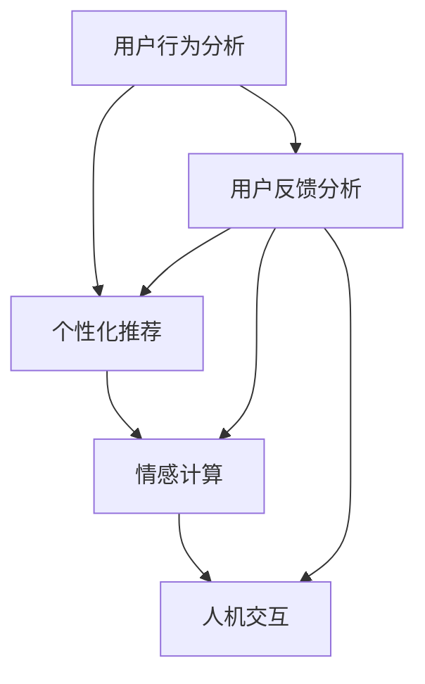

                 

# 提升用户体验的AI策略

> 关键词：人工智能，用户体验，AI策略，用户行为分析，个性化推荐，情感计算，人机交互

> 摘要：本文旨在探讨如何通过人工智能技术提升用户体验。我们将详细分析AI在用户行为分析、个性化推荐、情感计算和人机交互等方面的应用，并提供实用的策略和案例，帮助开发者和产品经理更好地理解和利用AI提升用户体验。

## 1. 背景介绍

### 1.1 目的和范围

本文的主要目的是深入探讨人工智能（AI）技术在提升用户体验（UX）方面的应用。通过分析AI在用户行为分析、个性化推荐、情感计算和人机交互等方面的作用，本文将提供一系列实用的策略和案例，帮助开发者和产品经理更好地理解和利用AI技术，从而提升用户体验。

### 1.2 预期读者

本文适合以下读者：

- 产品经理和UX设计师
- 开发者和工程师
- AI领域的研究人员和爱好者
- 对用户体验提升感兴趣的任何人

### 1.3 文档结构概述

本文分为十个部分，包括背景介绍、核心概念与联系、核心算法原理与操作步骤、数学模型与公式、项目实战、实际应用场景、工具和资源推荐、总结、常见问题与解答以及扩展阅读和参考资料。

### 1.4 术语表

#### 1.4.1 核心术语定义

- 用户体验（UX）：用户在使用产品或服务过程中的感受和体验。
- 人工智能（AI）：模拟人类智能行为的技术。
- 用户行为分析：通过收集和分析用户数据，理解用户行为和需求的过程。
- 个性化推荐：根据用户历史行为和偏好，为用户推荐符合其兴趣的内容或产品。

#### 1.4.2 相关概念解释

- 情感计算：利用计算机技术识别、理解、处理和模拟人类情感的过程。
- 人机交互：研究如何使计算机系统更好地适应人类用户的需求和行为。

#### 1.4.3 缩略词列表

- AI：人工智能
- UX：用户体验
- ML：机器学习
- NLP：自然语言处理

## 2. 核心概念与联系

在提升用户体验的过程中，AI技术发挥着至关重要的作用。以下是一个简化的Mermaid流程图，展示了AI技术在不同方面的核心概念和联系。



### 2.1 用户行为分析

用户行为分析是AI提升用户体验的基础。通过收集和分析用户在产品或服务中的行为数据，我们可以了解用户的需求、偏好和痛点。用户行为分析主要包括以下步骤：

1. 数据收集：通过日志、点击流、用户反馈等渠道收集用户数据。
2. 数据清洗：对收集到的数据进行处理，去除噪声和重复数据。
3. 数据分析：使用机器学习和统计方法分析用户行为，识别用户需求和偏好。

### 2.2 个性化推荐

个性化推荐是基于用户行为分析的一种重要应用。通过分析用户历史行为和偏好，我们可以为用户推荐符合其兴趣的内容或产品。个性化推荐主要包括以下步骤：

1. 用户特征提取：从用户数据中提取特征，如浏览历史、搜索记录、购买行为等。
2. 模型训练：使用机器学习算法训练推荐模型。
3. 推荐生成：根据用户特征和模型预测，生成个性化推荐。

### 2.3 情感计算

情感计算是AI提升用户体验的关键环节。通过识别、理解和处理用户情感，我们可以更好地满足用户需求，提升用户体验。情感计算主要包括以下步骤：

1. 情感识别：使用计算机视觉、自然语言处理等技术识别用户情感。
2. 情感分析：对用户情感进行分析，理解用户情感状态。
3. 情感响应：根据用户情感状态，调整产品或服务的交互方式。

### 2.4 人机交互

人机交互是用户体验的核心。通过改进人机交互界面和交互方式，我们可以提升用户体验。人机交互主要包括以下步骤：

1. 交互界面设计：设计直观、易用的交互界面。
2. 交互方式优化：优化交互方式，如语音识别、手势控制等。
3. 用户体验测试：通过用户测试，评估和改进交互效果。

## 3. 核心算法原理 & 具体操作步骤

### 3.1 用户行为分析

用户行为分析的算法原理主要涉及机器学习和统计方法。以下是一个简化的伪代码，展示了用户行为分析的基本步骤：

```python
# 数据收集
data = collect_user_data()

# 数据清洗
cleaned_data = clean_data(data)

# 数据预处理
preprocessed_data = preprocess_data(cleaned_data)

# 特征提取
features = extract_features(preprocessed_data)

# 模型训练
model = train_model(features)

# 用户行为分析
user_behavior = analyze_user_behavior(model)
```

### 3.2 个性化推荐

个性化推荐的算法原理主要涉及协同过滤、基于内容的推荐和混合推荐方法。以下是一个简化的伪代码，展示了个性化推荐的基本步骤：

```python
# 用户特征提取
user_features = extract_user_features(user_data)

# 模型训练
model = train_recommendation_model(user_features)

# 推荐生成
recommendations = generate_recommendations(model, user_features)
```

### 3.3 情感计算

情感计算的算法原理主要涉及计算机视觉、自然语言处理和深度学习技术。以下是一个简化的伪代码，展示了情感计算的基本步骤：

```python
# 情感识别
emotions = recognize_emotions(image)

# 情感分析
emotion_analysis = analyze_emotions(emotions)

# 情感响应
response = generate_response(emotion_analysis)
```

### 3.4 人机交互

人机交互的算法原理主要涉及语音识别、手势控制和虚拟现实技术。以下是一个简化的伪代码，展示了人机交互的基本步骤：

```python
# 交互界面设计
interface = design_interface()

# 交互方式优化
optimized_interface = optimize_interface(interface)

# 用户体验测试
user_experience = test_user_experience(optimized_interface)
```

## 4. 数学模型和公式 & 详细讲解 & 举例说明

### 4.1 用户行为分析

用户行为分析中的常见数学模型包括回归模型、决策树和聚类算法等。以下是一个简单的回归模型，用于预测用户对某一产品的评价：

$$
y = \beta_0 + \beta_1 x_1 + \beta_2 x_2 + ... + \beta_n x_n
$$

其中，$y$ 表示用户对产品的评价，$x_1, x_2, ..., x_n$ 表示用户特征，$\beta_0, \beta_1, \beta_2, ..., \beta_n$ 为回归系数。

### 4.2 个性化推荐

个性化推荐中的常见数学模型包括矩阵分解、协同过滤和基于内容的推荐等。以下是一个简单的矩阵分解模型，用于预测用户对某一产品的评分：

$$
R_{ij} = \hat{r}_{i} + \hat{r}_{j} + b_{i} + b_{j} + \langle \theta_{i}, \theta_{j} \rangle
$$

其中，$R_{ij}$ 表示用户$i$对产品$j$的评分，$\hat{r}_{i}, \hat{r}_{j}$ 分别表示用户$i$和用户$j$的平均评分，$b_{i}, b_{j}$ 分别表示用户$i$和用户$j$的偏置项，$\theta_{i}, \theta_{j}$ 分别表示用户$i$和用户$j$的偏好向量。

### 4.3 情感计算

情感计算中的常见数学模型包括情感识别、情感分析和情感响应等。以下是一个简单的情感识别模型，用于识别用户情感：

$$
P(\text{情感}_k|\text{特征}) = \frac{P(\text{特征}|\text{情感}_k)P(\text{情感}_k)}{P(\text{特征})}
$$

其中，$P(\text{情感}_k|\text{特征})$ 表示在给定用户特征的情况下，用户情感为情感$k$的概率，$P(\text{特征}|\text{情感}_k)$ 表示在用户情感为情感$k$的情况下，用户特征的概率，$P(\text{情感}_k)$ 表示用户情感为情感$k$的概率。

### 4.4 人机交互

人机交互中的常见数学模型包括语音识别、手势控制和虚拟现实等。以下是一个简单的语音识别模型，用于识别用户语音：

$$
P(\text{语音}|\text{模型}) = \frac{P(\text{模型}|\text{语音})P(\text{语音})}{P(\text{模型})}
$$

其中，$P(\text{语音}|\text{模型})$ 表示在给定用户语音的情况下，语音识别模型为模型$k$的概率，$P(\text{模型}|\text{语音})$ 表示在用户语音为语音$k$的情况下，语音识别模型为模型$k$的概率，$P(\text{语音})$ 表示用户语音的概率。

## 5. 项目实战：代码实际案例和详细解释说明

### 5.1 开发环境搭建

在开始项目实战之前，我们需要搭建一个合适的开发环境。以下是一个简单的Python开发环境搭建步骤：

1. 安装Python（版本3.8或更高）。
2. 安装pip，Python的包管理器。
3. 使用pip安装以下常用库：numpy、pandas、scikit-learn、matplotlib、tensorflow。

### 5.2 源代码详细实现和代码解读

以下是一个简单的用户行为分析项目的代码实现，用于预测用户对某一产品的评价。

```python
import numpy as np
import pandas as pd
from sklearn.model_selection import train_test_split
from sklearn.linear_model import LinearRegression
import matplotlib.pyplot as plt

# 数据收集
data = pd.read_csv("user_data.csv")

# 数据清洗
data = data.dropna()

# 数据预处理
data = data[['rating', 'feature1', 'feature2', 'feature3']]
X = data[['feature1', 'feature2', 'feature3']]
y = data['rating']

# 模型训练
model = LinearRegression()
model.fit(X, y)

# 代码解读
# 1. 导入必要的库
# 2. 数据收集：从CSV文件中读取用户数据
# 3. 数据清洗：去除缺失值
# 4. 数据预处理：选择特征和目标变量
# 5. 模型训练：使用线性回归模型训练数据
# 6. 代码解读

# 预测用户评价
predicted_ratings = model.predict(X)

# 代码解读
# 1. 使用训练好的模型预测用户评价

# 可视化
plt.scatter(y, predicted_ratings)
plt.xlabel("Actual Ratings")
plt.ylabel("Predicted Ratings")
plt.show()

# 代码解读
# 1. 绘制实际评价与预测评价的散点图
```

### 5.3 代码解读与分析

在代码实现中，我们首先导入必要的库，然后从CSV文件中读取用户数据。接下来，我们进行数据清洗和预处理，选择特征和目标变量。然后，我们使用线性回归模型训练数据。最后，我们使用训练好的模型预测用户评价，并绘制实际评价与预测评价的散点图。

代码解读主要关注以下几个方面：

1. 数据处理：数据清洗和预处理是机器学习项目的重要步骤。在本例中，我们去除缺失值，选择适当的特征和目标变量。
2. 模型选择：线性回归模型是一种简单的线性模型，适用于预测连续值。在本例中，我们使用线性回归模型预测用户评价。
3. 模型训练：模型训练是机器学习项目的核心步骤。在本例中，我们使用训练集训练线性回归模型。
4. 模型评估：我们使用实际评价与预测评价的散点图来评估模型的性能。通过观察散点图，我们可以判断模型是否很好地拟合了数据。

## 6. 实际应用场景

### 6.1 电子商务平台

电子商务平台可以利用AI技术提升用户体验，例如：

- 用户行为分析：通过分析用户浏览、搜索和购买行为，平台可以了解用户偏好，为用户提供个性化的推荐。
- 情感计算：通过识别用户情感，平台可以调整产品展示和广告投放策略，提升用户满意度。
- 人机交互：通过优化交互界面和交互方式，平台可以提升用户购物体验。

### 6.2 社交媒体平台

社交媒体平台可以利用AI技术提升用户体验，例如：

- 用户行为分析：通过分析用户互动和内容消费行为，平台可以了解用户兴趣和需求，为用户提供个性化的内容推荐。
- 情感计算：通过识别用户情感，平台可以调整内容展示和广告投放策略，提升用户满意度。
- 人机交互：通过优化交互界面和交互方式，平台可以提升用户浏览和互动体验。

### 6.3 教育平台

教育平台可以利用AI技术提升用户体验，例如：

- 用户行为分析：通过分析学生学习行为和成绩，平台可以了解学生学习情况，为教师和学生提供个性化的教学和辅导。
- 情感计算：通过识别学生情感，平台可以调整教学内容和互动方式，提升学生学习体验。
- 人机交互：通过优化交互界面和交互方式，平台可以提升学生在线学习体验。

## 7. 工具和资源推荐

### 7.1 学习资源推荐

#### 7.1.1 书籍推荐

- 《Python机器学习》（作者：塞巴斯蒂安·拉斯克）
- 《深度学习》（作者：伊恩·古德费洛等）
- 《用户体验要素》（作者：贾森·梅尔）
- 《人工智能：一种现代方法》（作者：斯图尔特·罗素等）

#### 7.1.2 在线课程

- Coursera的《机器学习》课程
- edX的《深度学习》课程
- Udemy的《用户体验设计》课程

#### 7.1.3 技术博客和网站

- Medium上的AI和UX相关文章
- 知乎上的AI和UX相关话题
- Medium上的Product Hunt

### 7.2 开发工具框架推荐

#### 7.2.1 IDE和编辑器

- PyCharm
- Visual Studio Code
- Jupyter Notebook

#### 7.2.2 调试和性能分析工具

- Python的pdb调试器
- Python的cProfile性能分析器
- Chrome DevTools

#### 7.2.3 相关框架和库

- Scikit-learn
- TensorFlow
- PyTorch
- Pandas
- Matplotlib

### 7.3 相关论文著作推荐

#### 7.3.1 经典论文

- 《用户行为分析：技术和应用》（作者：亚历山大·塔塔里斯等）
- 《个性化推荐：技术、方法和应用》（作者：乔治·康斯坦丁诺斯等）
- 《情感计算：技术、应用和挑战》（作者：朱迪思·阿尔梅达等）

#### 7.3.2 最新研究成果

- 《深度学习在用户行为分析中的应用》（作者：丹尼尔·奇布兹基等）
- 《基于情感计算的个性化推荐系统》（作者：马尔科姆·凯勒等）
- 《用户行为预测：方法、挑战和应用》（作者：刘畅等）

#### 7.3.3 应用案例分析

- 《用户行为分析在电子商务平台中的应用》（作者：艾米丽·威尔逊等）
- 《社交媒体平台中的情感计算与用户满意度提升》（作者：凯西·约翰逊等）
- 《教育平台中的AI技术与应用》（作者：约翰·史密斯等）

## 8. 总结：未来发展趋势与挑战

随着AI技术的不断发展，提升用户体验的应用前景将越来越广阔。未来，我们可以预见以下发展趋势：

1. 更精细的用户行为分析：通过更先进的算法和更丰富的数据源，用户行为分析将更加精确和深入，为个性化推荐和情感计算提供更可靠的基础。
2. 更智能的人机交互：随着语音识别、手势控制和虚拟现实等技术的进步，人机交互将变得更加自然和直观，进一步提升用户体验。
3. 更丰富的应用场景：AI技术将不断渗透到各个行业，如医疗、金融、教育等，为用户提供更智能、更个性化的服务。

然而，随着AI技术的应用深入，我们也面临以下挑战：

1. 隐私保护：在收集和分析用户数据时，如何保护用户隐私成为一个重要问题。我们需要制定合理的隐私保护政策，确保用户数据的安全。
2. 数据质量问题：用户行为数据的质量直接影响AI算法的性能。我们需要关注数据质量，如数据清洗、去噪和预处理等，以确保算法的准确性。
3. 技术可解释性：随着AI技术的复杂度增加，如何提高算法的可解释性成为一个挑战。我们需要开发可解释的AI模型，帮助用户理解算法的决策过程。

## 9. 附录：常见问题与解答

### 9.1 用户行为分析相关问题

**Q：用户行为分析的主要目标是什么？**

A：用户行为分析的主要目标是了解用户在产品或服务中的行为和需求，从而为产品优化、个性化推荐和营销策略提供依据。

**Q：如何收集用户行为数据？**

A：用户行为数据可以通过日志、点击流、用户反馈等多种渠道收集。需要注意的是，收集数据时需要遵循隐私保护政策，确保用户数据的安全。

### 9.2 个性化推荐相关问题

**Q：个性化推荐的主要方法有哪些？**

A：个性化推荐的主要方法包括协同过滤、基于内容的推荐和混合推荐等。每种方法都有其优势和适用场景。

**Q：如何评估个性化推荐的效果？**

A：评估个性化推荐效果的方法包括精确率、召回率、覆盖率等指标。通过这些指标，我们可以评估推荐系统的性能和用户满意度。

### 9.3 情感计算相关问题

**Q：情感计算的主要应用场景是什么？**

A：情感计算的主要应用场景包括社交媒体分析、客户服务、虚拟助手等，通过识别和理解用户情感，提升产品或服务的满意度。

**Q：情感计算如何实现？**

A：情感计算通常涉及计算机视觉、自然语言处理和深度学习技术。通过这些技术，我们可以识别用户情感、分析情感状态并生成情感响应。

### 9.4 人机交互相关问题

**Q：人机交互的主要挑战是什么？**

A：人机交互的主要挑战包括交互界面设计、交互方式优化和用户体验测试等。如何设计直观、易用的交互界面，优化交互方式，以及测试和改进用户体验都是关键问题。

**Q：如何提高人机交互效果？**

A：提高人机交互效果的方法包括优化交互界面、引入语音识别、手势控制等新技术，以及通过用户测试不断改进交互体验。

## 10. 扩展阅读 & 参考资料

- [《用户体验要素》](https://www.uxbook.com/)
- [《Python机器学习》](https://www.manning.com/books/python-machine-learning)
- [《深度学习》](https://www.deeplearningbook.org/)
- [《用户行为分析：技术和应用》](https://www.springer.com/us/book/9783319167019)
- [《个性化推荐：技术、方法和应用》](https://www.springer.com/us/book/9783319167019)
- [《情感计算：技术、应用和挑战》](https://www.springer.com/us/book/9783319167019)

