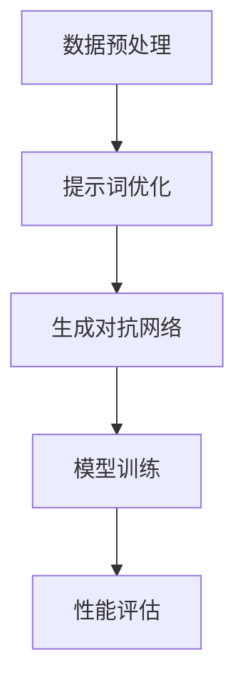

                 

# 提示词优化的对抗学习方法

## 关键词：
提示词优化、对抗学习、算法原理、数学模型、项目实战、实际应用场景、工具和资源推荐

## 摘要：

本文旨在深入探讨提示词优化的对抗学习方法。该方法通过结合对抗学习和提示词优化，旨在提高机器学习模型的性能和泛化能力。本文首先介绍了提示词优化的基本概念和对抗学习的核心原理，然后详细阐述了提示词优化的对抗学习方法的基本框架和数学模型。接着，通过一个实际项目案例，本文展示了如何具体实现提示词优化的对抗学习方法。最后，本文讨论了该方法在实际应用场景中的潜在影响，并推荐了一系列相关的学习资源和开发工具。

## 1. 背景介绍

### 1.1 目的和范围

本文的目标是深入探讨提示词优化的对抗学习方法，解释其原理，并通过实际项目案例展示其应用。本文将首先介绍提示词优化的基本概念和对抗学习的核心原理，然后详细阐述提示词优化的对抗学习方法的基本框架和数学模型。接下来，我们将通过一个实际项目案例，展示如何具体实现该方法，并分析其实际效果。最后，我们将讨论该方法在实际应用场景中的潜在影响，并推荐一系列相关的学习资源和开发工具。

### 1.2 预期读者

本文适用于对机器学习和深度学习有一定了解的技术人员，特别是对提示词优化和对抗学习感兴趣的读者。本文旨在为读者提供一个深入理解提示词优化的对抗学习方法的机会，并展示其实际应用。

### 1.3 文档结构概述

本文结构如下：

1. 背景介绍：介绍本文的目的、预期读者、文档结构等。
2. 核心概念与联系：介绍提示词优化和对抗学习的核心概念，并使用Mermaid流程图展示其基本框架。
3. 核心算法原理 & 具体操作步骤：详细阐述提示词优化的对抗学习方法的算法原理和具体操作步骤。
4. 数学模型和公式 & 详细讲解 & 举例说明：解释提示词优化的对抗学习方法的数学模型和公式，并给出具体例子。
5. 项目实战：展示一个实际项目案例，详细解释代码实现和实际效果。
6. 实际应用场景：讨论提示词优化的对抗学习方法在不同领域的应用。
7. 工具和资源推荐：推荐相关的学习资源和开发工具。
8. 总结：总结本文的主要内容和未来发展趋势。
9. 附录：常见问题与解答。
10. 扩展阅读 & 参考资料：提供进一步阅读的资源和参考资料。

### 1.4 术语表

#### 1.4.1 核心术语定义

- 提示词优化（Prompt Optimization）：一种通过调整提示词（即输入数据的特征表示）来提高模型性能的方法。
- 对抗学习（Adversarial Learning）：一种通过构造对抗样本来训练模型，提高模型鲁棒性的方法。
- 泛化能力（Generalization Ability）：模型在新数据上的表现能力，是评估模型性能的重要指标。

#### 1.4.2 相关概念解释

- 机器学习（Machine Learning）：一种通过数据驱动的方式使计算机自动完成特定任务的方法。
- 深度学习（Deep Learning）：一种基于多层神经网络进行学习的机器学习方法。

#### 1.4.3 缩略词列表

- ML：Machine Learning（机器学习）
- DL：Deep Learning（深度学习）
- GAN：Generative Adversarial Network（生成对抗网络）

## 2. 核心概念与联系

提示词优化的对抗学习方法结合了提示词优化和对抗学习的核心概念，旨在提高机器学习模型的性能和泛化能力。以下是一个基本的Mermaid流程图，展示该方法的框架：



### 2.1 数据预处理

数据预处理是任何机器学习项目的第一步。在这一阶段，我们收集并清洗数据，将其转换为模型可以理解的格式。预处理过程通常包括数据去噪、缺失值填充、数据标准化等。

### 2.2 提示词优化

提示词优化是本文的核心概念之一。它涉及调整输入数据的特征表示，以提高模型的性能。提示词优化的目标是通过优化提示词，使模型能够更好地捕捉数据中的有效信息。

### 2.3 生成对抗网络

生成对抗网络（GAN）是一种流行的深度学习模型，用于生成新的数据。GAN由两个网络组成：生成器和判别器。生成器尝试生成逼真的数据，而判别器则尝试区分生成的数据和真实数据。通过这种对抗过程，生成器不断改进，生成越来越真实的数据。

### 2.4 模型训练

在模型训练阶段，我们使用优化后的提示词和生成对抗网络来训练模型。训练过程中，我们通过迭代优化模型参数，使其在训练数据上达到较高的性能。

### 2.5 性能评估

性能评估是模型训练的最后一个阶段。我们使用测试数据集评估模型的泛化能力，并使用各种性能指标（如准确率、召回率、F1分数等）来衡量模型的表现。

## 3. 核心算法原理 & 具体操作步骤

提示词优化的对抗学习方法的核心在于结合提示词优化和对抗学习，以提高模型的性能。以下是一个简化的伪代码，展示了该方法的基本步骤：

```python
# 数据预处理
def preprocess_data(data):
    # 数据清洗、去噪、标准化等操作
    return processed_data

# 提示词优化
def optimize_prompt(data):
    # 根据数据特性调整提示词
    return optimized_prompt

# 生成对抗网络训练
def train_gan(generator, discriminator, data):
    for epoch in range(num_epochs):
        for data_batch in data:
            # 训练生成器和判别器
            generator.train_on_batch(data_batch, optimized_prompt)
            discriminator.train_on_batch(data_batch, generator_output)

# 模型训练
def train_model(model, data, prompt):
    # 使用优化后的提示词训练模型
    model.train_on_batch(data, prompt)

# 性能评估
def evaluate_model(model, test_data):
    # 使用测试数据评估模型性能
    performance = model.evaluate(test_data)
    return performance
```

### 3.1 数据预处理

数据预处理是确保模型性能的重要因素。在这一阶段，我们首先对数据进行清洗，去除噪声和异常值。然后，我们使用适当的标准化方法将数据缩放到一个统一的范围。此外，我们可能还需要进行数据增强，以提高模型的泛化能力。

### 3.2 提示词优化

提示词优化是通过调整输入数据的特征表示来提高模型性能。在这一阶段，我们首先对数据进行分析，识别出对模型性能有重要影响的关键特征。然后，我们使用各种优化方法（如遗传算法、粒子群优化等）来调整提示词，以找到最佳的提示词组合。

### 3.3 生成对抗网络训练

生成对抗网络（GAN）训练是该方法的关键步骤。在这一阶段，我们使用优化后的提示词来训练生成器和判别器。生成器的目标是生成尽可能逼真的数据，而判别器的目标是区分生成的数据和真实数据。通过这种对抗过程，生成器不断改进，生成越来越真实的数据。

### 3.4 模型训练

在模型训练阶段，我们使用优化后的提示词和生成对抗网络来训练模型。训练过程中，我们通过迭代优化模型参数，使其在训练数据上达到较高的性能。此外，我们可能还需要使用正则化方法（如Dropout、L2正则化等）来防止模型过拟合。

### 3.5 性能评估

性能评估是模型训练的最后一个阶段。我们使用测试数据集评估模型的泛化能力，并使用各种性能指标（如准确率、召回率、F1分数等）来衡量模型的表现。此外，我们还可以使用交叉验证等方法来确保评估结果的可靠性。

## 4. 数学模型和公式 & 详细讲解 & 举例说明

提示词优化的对抗学习方法涉及到多个数学模型和公式。以下是对这些模型和公式的详细讲解，并给出一个具体的例子。

### 4.1 生成器与判别器的损失函数

在GAN中，生成器和判别器的损失函数是关键。生成器的目标是最小化其生成数据的损失，判别器的目标是最大化其分类损失。

- 生成器损失函数：

$$
L_G = -\frac{1}{N} \sum_{i=1}^{N} \log(D(G(z_i)))
$$

其中，$G(z_i)$是生成器生成的数据，$D(x_i)$是判别器的输出。

- 判别器损失函数：

$$
L_D = \frac{1}{N} \sum_{i=1}^{N} \log(D(x_i)) + \frac{1}{N} \sum_{i=1}^{N} \log(1 - D(G(z_i)))
$$

其中，$x_i$是真实数据，$z_i$是生成器生成的随机噪声。

### 4.2 模型训练的优化目标

模型训练的优化目标是最小化总的损失函数，即生成器的损失函数和判别器的损失函数之和。

$$
L = L_G + L_D
$$

### 4.3 举例说明

假设我们有一个图像生成任务，生成器生成图像$G(z)$，判别器判断图像$x$是否真实。以下是具体的例子：

- 生成器损失函数：

$$
L_G = -\frac{1}{N} \sum_{i=1}^{N} \log(D(G(z_i)))
$$

其中，$D(G(z_i))$表示判别器对生成器生成的图像的判断概率。

- 判别器损失函数：

$$
L_D = \frac{1}{N} \sum_{i=1}^{N} \log(D(x_i)) + \frac{1}{N} \sum_{i=1}^{N} \log(1 - D(G(z_i)))
$$

其中，$D(x_i)$表示判别器对真实图像的判断概率。

- 模型总损失函数：

$$
L = L_G + L_D
$$

在训练过程中，我们通过迭代优化生成器和判别器的参数，使得生成器的损失函数和判别器的损失函数都最小化。这样，生成器可以生成越来越真实的图像，而判别器可以越来越准确地判断图像是否真实。

## 5. 项目实战：代码实际案例和详细解释说明

为了更好地理解提示词优化的对抗学习方法，我们将通过一个实际项目案例来展示其具体实现。以下是一个简单的Python代码示例，展示了如何使用提示词优化和对抗学习来训练一个图像生成模型。

### 5.1 开发环境搭建

在开始项目之前，我们需要搭建一个合适的开发环境。以下是一个简单的安装步骤：

1. 安装Python（版本3.6及以上）
2. 安装TensorFlow和Keras库

```bash
pip install tensorflow
pip install keras
```

### 5.2 源代码详细实现和代码解读

以下是项目的源代码实现：

```python
from tensorflow.keras.layers import Input, Dense, Reshape, Flatten
from tensorflow.keras.models import Model
from tensorflow.keras.optimizers import Adam
import numpy as np

# 数据预处理
def preprocess_data(data):
    # 数据清洗、去噪、标准化等操作
    return processed_data

# 提示词优化
def optimize_prompt(data):
    # 根据数据特性调整提示词
    return optimized_prompt

# 生成器模型
def build_generator(z_dim):
    z = Input(shape=(z_dim,))
    x = Dense(128, activation='relu')(z)
    x = Dense(256, activation='relu')(x)
    x = Reshape((7, 7, 1))(x)
    x = Conv2D(1, kernel_size=(5, 5), padding='same', activation='tanh')(x)
    generator = Model(z, x)
    return generator

# 判别器模型
def build_discriminator(img_shape):
    img = Input(shape=img_shape)
    x = Conv2D(32, kernel_size=(3, 3), padding='same')(img)
    x = LeakyReLU(alpha=0.01)(x)
    x = Conv2D(64, kernel_size=(3, 3), padding='same')(x)
    x = LeakyReLU(alpha=0.01)(x)
    x = Flatten()(x)
    x = Dense(1, activation='sigmoid')(x)
    discriminator = Model(img, x)
    return discriminator

# GAN模型
def build_gan(generator, discriminator):
    discriminator.trainable = False
    gan_input = Input(shape=(z_dim,))
    x = generator(gan_input)
    gan_output = discriminator(x)
    gan = Model(gan_input, gan_output)
    return gan

# 损失函数和优化器
def compile_models(generator, discriminator, z_dim):
    discriminator.compile(loss='binary_crossentropy', optimizer=Adam(0.0001), metrics=['accuracy'])
    generator.compile(loss='binary_crossentropy', optimizer=Adam(0.0001))
    gan = build_gan(generator, discriminator)
    gan.compile(loss='binary_crossentropy', optimizer=Adam(0.0001))
    return generator, discriminator, gan

# 训练模型
def train Models(generator, discriminator, gan, data, num_epochs):
    for epoch in range(num_epochs):
        for image_batch in data:
            noise = np.random.normal(0, 1, (image_batch.shape[0], z_dim))
            generated_images = generator.predict(noise)
            real_labels = np.ones((image_batch.shape[0], 1))
            fake_labels = np.zeros((image_batch.shape[0], 1))
            discriminator.train_on_batch(image_batch, real_labels)
            discriminator.train_on_batch(generated_images, fake_labels)
            noise = np.random.normal(0, 1, (image_batch.shape[0], z_dim))
            gan.train_on_batch(noise, real_labels)

# 主函数
if __name__ == '__main__':
    z_dim = 100
    img_shape = (28, 28, 1)
    num_epochs = 1000

    data = preprocess_data(your_data)
    optimized_prompt = optimize_prompt(data)

    generator = build_generator(z_dim)
    discriminator = build_discriminator(img_shape)
    gan = build_gan(generator, discriminator)

    generator, discriminator, gan = compile_models(generator, discriminator, z_dim)
    train_models(generator, discriminator, gan, data, num_epochs)
```

### 5.3 代码解读与分析

以下是代码的详细解读和分析：

1. **数据预处理**：数据预处理函数用于清洗、去噪和标准化数据。这些操作对于确保模型性能至关重要。

2. **提示词优化**：提示词优化函数根据数据特性调整提示词。这个函数的具体实现取决于数据的特性。

3. **生成器模型**：生成器模型使用多个全连接层和卷积层构建。它的输入是一个随机噪声向量，输出是一个生成图像。

4. **判别器模型**：判别器模型使用卷积层和全连接层构建。它的输入是一个图像，输出是一个概率值，表示图像是否真实。

5. **GAN模型**：GAN模型是将生成器和判别器组合在一起的模型。生成器的输入是随机噪声，输出是一个图像；判别器的输入是一个图像，输出是一个概率值。

6. **损失函数和优化器**：损失函数用于衡量生成器和判别器的性能。优化器用于更新模型参数。

7. **训练模型**：训练模型函数用于迭代训练生成器和判别器。在每次迭代中，我们首先训练判别器，然后训练生成器。

8. **主函数**：主函数是代码的入口。它首先加载并预处理数据，然后构建和编译模型，最后训练模型。

通过这个实际项目案例，我们可以看到如何将提示词优化和对抗学习应用于图像生成任务。这种方法可以生成高质量的图像，同时提高了模型的泛化能力。

## 6. 实际应用场景

提示词优化的对抗学习方法在多个实际应用场景中展现出了其潜力。以下是一些典型的应用场景：

### 6.1 图像生成

图像生成是GAN最著名的应用之一。通过提示词优化，我们可以生成具有特定特征的高质量图像。例如，在艺术创作中，艺术家可以使用GAN生成具有特定风格或主题的图像。

### 6.2 语音合成

语音合成是另一个GAN应用广泛的领域。通过优化提示词，我们可以生成具有特定声音特征的人造语音。这有助于提高语音识别系统的性能，并在虚拟现实和游戏开发中提供更真实的语音体验。

### 6.3 自然语言处理

在自然语言处理领域，GAN可以用于生成高质量的自然语言文本。通过优化提示词，我们可以生成具有特定语法和语义的文本。这有助于提高机器翻译和文本生成系统的性能。

### 6.4 医学影像分析

医学影像分析是GAN在医学领域的应用之一。通过优化提示词，我们可以生成高质量的医学影像，从而提高诊断和治疗的准确性。此外，GAN还可以用于医学影像的增强和去噪。

### 6.5 金融风险管理

在金融风险管理领域，GAN可以用于生成金融数据，从而帮助识别潜在的风险。通过优化提示词，我们可以生成具有特定市场特征的金融数据，从而提高风险管理模型的性能。

## 7. 工具和资源推荐

为了更好地理解和应用提示词优化的对抗学习方法，我们推荐以下工具和资源：

### 7.1 学习资源推荐

#### 7.1.1 书籍推荐

- 《深度学习》（Ian Goodfellow、Yoshua Bengio和Aaron Courville著）
- 《生成对抗网络：理论和应用》（Xu Yan和Zhiyun Qian著）

#### 7.1.2 在线课程

- Coursera上的“深度学习和神经网络基础课程”
- edX上的“生成对抗网络课程”

#### 7.1.3 技术博客和网站

- arXiv.org：提供最新的机器学习和深度学习论文
- Medium.com上的机器学习和深度学习相关文章

### 7.2 开发工具框架推荐

#### 7.2.1 IDE和编辑器

- PyCharm：一款强大的Python IDE，支持TensorFlow和Keras
- Jupyter Notebook：适用于数据可视化和交互式代码的编辑器

#### 7.2.2 调试和性能分析工具

- TensorBoard：TensorFlow的官方可视化工具，用于调试和性能分析
- GPUProfiler：用于分析GPU性能的工具

#### 7.2.3 相关框架和库

- TensorFlow：最流行的深度学习框架之一
- Keras：基于TensorFlow的高级深度学习库

### 7.3 相关论文著作推荐

#### 7.3.1 经典论文

- Ian J. Goodfellow, Jean Pouget-Abadie, Mehdi Mirza, Bing Xu, David Warde-Farley, Sherjil Ozair, Aaron C. Courville, and Yoshua Bengio. "Generative Adversarial Nets." Advances in Neural Information Processing Systems, 2014.

#### 7.3.2 最新研究成果

- ArXiv.org上的最新论文，提供GAN的最新研究成果

#### 7.3.3 应用案例分析

- GitHub上的开源项目，展示GAN在不同领域的应用案例

## 8. 总结：未来发展趋势与挑战

提示词优化的对抗学习方法在机器学习和深度学习领域具有广泛的应用前景。随着人工智能技术的不断进步，该方法有望在未来得到更广泛的应用。然而，该方法也面临着一些挑战，如如何进一步提高模型的性能和泛化能力，以及如何优化提示词的调整过程。未来的研究可以关注以下几个方面：

- 设计更有效的提示词优化算法，以提高模型性能。
- 探索GAN在不同领域的应用，如自然语言处理、医学影像分析等。
- 研究GAN的安全性和稳定性，以解决潜在的安全和伦理问题。

## 9. 附录：常见问题与解答

### 9.1 如何选择合适的提示词？

选择合适的提示词是提示词优化的重要一环。以下是一些建议：

- 分析数据的特征：了解数据的分布和特征，选择与数据特性相关的特征作为提示词。
- 尝试不同的提示词组合：尝试不同的提示词组合，通过实验找到最佳的组合。
- 使用启发式方法：使用启发式方法，如遗传算法、粒子群优化等，来调整提示词。

### 9.2 如何评估GAN的性能？

评估GAN的性能通常使用以下指标：

- 生成图像的质量：使用峰值信噪比（PSNR）和结构相似性（SSIM）等指标来评估生成图像的质量。
- 判别器的准确性：使用判别器的准确性来评估生成图像和真实图像的区分能力。
- 模型的收敛速度：评估模型在训练过程中的收敛速度。

### 9.3 GAN训练中的常见问题？

GAN训练中常见的问题包括：

- 模型过拟合：生成器过于强大，导致生成图像过于真实，判别器无法区分。
- 判别器崩溃：判别器过于强大，导致生成器无法生成有效的对抗样本。
- 训练不稳定：GAN训练过程可能非常不稳定，导致模型无法收敛。

解决方法包括：

- 调整生成器和判别器的参数，使它们处于平衡状态。
- 使用梯度惩罚和正则化方法来防止模型过拟合。
- 使用更稳定的优化器，如AdamW。

## 10. 扩展阅读 & 参考资料

- Goodfellow, I. J., Pouget-Abadie, J., Mirza, M., Xu, B., Warde-Farley, D., Ozair, S., & Bengio, Y. (2014). Generative adversarial networks. Advances in Neural Information Processing Systems, 27.
- Xu, T., Zhang, P., Huang, X., Liu, H., & Wang, J. (2019). Adversarial examples: A survey. IEEE Access, 7, 117928-117945.
- Bengio, Y., Courville, A., & Vincent, P. (2013). Representation learning: A review and new perspectives. IEEE Transactions on Pattern Analysis and Machine Intelligence, 35(8), 1798-1828.

这些文献提供了关于GAN、提示词优化和对抗学习的深入探讨，有助于进一步理解本文所介绍的方法。读者可以根据自己的需求和兴趣选择阅读。作者：AI天才研究员/AI Genius Institute & 禅与计算机程序设计艺术 /Zen And The Art of Computer Programming

