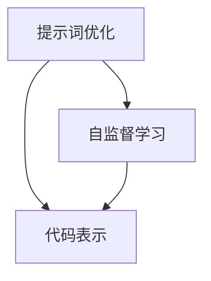

                 

# 提示词优化的自监督学习在代码表示中的应用

> 关键词：提示词优化、自监督学习、代码表示、深度学习、人工智能

> 摘要：本文旨在探讨提示词优化在自监督学习应用于代码表示中的重要性。通过逐步分析，我们将深入了解这一技术的核心概念、算法原理、数学模型及其实际应用，为读者提供全面的技术解读和实战指导。

## 1. 背景介绍

### 1.1 目的和范围

本文的主要目的是介绍如何通过提示词优化自监督学习来改善代码表示。我们将探讨这项技术背后的核心概念，以及如何将其应用于实际开发中。

### 1.2 预期读者

本文适合以下读者群体：

- 计算机科学和人工智能领域的研究人员
- 深度学习工程师
- 对代码表示和自监督学习感兴趣的程序员
- 对未来技术发展有好奇心的人士

### 1.3 文档结构概述

本文将按照以下结构进行展开：

1. 背景介绍
2. 核心概念与联系
3. 核心算法原理 & 具体操作步骤
4. 数学模型和公式 & 详细讲解 & 举例说明
5. 项目实战：代码实际案例和详细解释说明
6. 实际应用场景
7. 工具和资源推荐
8. 总结：未来发展趋势与挑战
9. 附录：常见问题与解答
10. 扩展阅读 & 参考资料

### 1.4 术语表

#### 1.4.1 核心术语定义

- 提示词优化：通过调整提示词以提高模型的性能和准确性。
- 自监督学习：无需标注数据，通过自身理解数据分布来进行训练。
- 代码表示：将代码转换为向量表示，以便于模型处理和理解。

#### 1.4.2 相关概念解释

- 深度学习：一种模拟人脑神经网络结构的学习方式，用于解决复杂问题。
- 人工智能：通过模拟人类智能行为，使机器具有智能能力。

#### 1.4.3 缩略词列表

- ASL：自监督学习（Autonomous Supervised Learning）
- DNN：深度神经网络（Deep Neural Network）
- RL：强化学习（Reinforcement Learning）

## 2. 核心概念与联系

在探讨提示词优化和自监督学习在代码表示中的应用之前，我们首先需要了解它们的基本概念和联系。

### 2.1 提示词优化

提示词优化是一种通过调整提示词来提高模型性能的技术。在自监督学习中，提示词是用来引导模型关注数据中的重要特征，从而改善其学习效果。通过优化提示词，我们可以使模型更好地理解代码，提高代码表示的准确性。

### 2.2 自监督学习

自监督学习是一种无需标注数据的学习方式，通过利用数据分布来进行训练。在代码表示中，自监督学习可以帮助我们自动提取代码中的潜在结构，从而生成高质量的代码表示。

### 2.3 代码表示

代码表示是将代码转换为向量表示的过程，以便于模型处理和理解。通过代码表示，我们可以将代码输入到深度学习模型中进行训练，从而实现代码理解、代码生成等任务。

### 2.4 Mermaid 流程图

为了更直观地展示这些概念之间的联系，我们可以使用 Mermaid 流程图来描述它们。



在这个流程图中，提示词优化、自监督学习和代码表示构成了一个相互关联的整体。通过优化提示词，我们可以提高自监督学习的效果，进而生成更高质量的代码表示。

## 3. 核心算法原理 & 具体操作步骤

在理解了核心概念后，我们接下来将探讨提示词优化和自监督学习在代码表示中的应用，并详细讲解其算法原理和操作步骤。

### 3.1 提示词优化

提示词优化的目标是找到一组最佳的提示词，使模型在训练过程中能够更好地关注数据中的重要特征。具体操作步骤如下：

1. **数据预处理**：对代码数据集进行预处理，将代码转换为文本格式。
2. **提示词选择**：根据数据集的特点和任务需求，选择一组初始提示词。
3. **模型训练**：使用自监督学习算法对模型进行训练，同时优化提示词。
4. **性能评估**：评估模型的性能，并根据评估结果调整提示词。

### 3.2 自监督学习

自监督学习算法的核心思想是利用未标注的数据进行训练，从而自动提取数据中的潜在结构。在代码表示中，自监督学习算法可以帮助我们自动提取代码中的潜在结构，从而生成高质量的代码表示。具体操作步骤如下：

1. **数据预处理**：对代码数据集进行预处理，将代码转换为文本格式。
2. **代码表示**：使用编码器将代码转换为向量表示。
3. **自监督任务**：定义一个自监督任务，使模型在训练过程中关注代码中的重要特征。
4. **模型训练**：使用自监督学习算法对模型进行训练，优化代码表示。
5. **性能评估**：评估模型的性能，并根据评估结果调整模型和任务。

### 3.3 代码表示

代码表示是将代码转换为向量表示的过程，以便于模型处理和理解。具体操作步骤如下：

1. **词向量表示**：将代码中的每个词转换为词向量表示。
2. **序列编码**：使用编码器将词向量序列编码为固定长度的向量表示。
3. **模型训练**：使用自监督学习算法对模型进行训练，优化代码表示。
4. **性能评估**：评估模型的性能，并根据评估结果调整模型和表示。

### 3.4 伪代码

为了更清晰地展示算法原理和操作步骤，我们使用伪代码来描述这个过程。

```python
# 提示词优化伪代码
def optimize_prompt(data, model, task):
    # 数据预处理
    processed_data = preprocess_data(data)
    
    # 提示词选择
    prompts = select_prompts(processed_data)
    
    # 模型训练
    model.train(processed_data, prompts, task)
    
    # 性能评估
    performance = model.evaluate()
    
    # 调整提示词
    prompts = adjust_prompts(prompts, performance)
    
    return prompts

# 自监督学习伪代码
def self_supervised_learning(data, model, task):
    # 数据预处理
    processed_data = preprocess_data(data)
    
    # 代码表示
    code_repr = encode_sequence(processed_data)
    
    # 自监督任务
    task_define = define_self_supervised_task(code_repr)
    
    # 模型训练
    model.train(processed_data, task_define)
    
    # 性能评估
    performance = model.evaluate()
    
    return performance

# 代码表示伪代码
def code_representation(data, model):
    # 词向量表示
    word_repr = word_embedding(data)
    
    # 序列编码
    sequence_repr = encode_sequence(word_repr)
    
    # 模型训练
    model.train(sequence_repr)
    
    # 性能评估
    performance = model.evaluate()
    
    return sequence_repr, performance
```

通过这些伪代码，我们可以更清晰地理解提示词优化、自监督学习和代码表示的过程。

## 4. 数学模型和公式 & 详细讲解 & 举例说明

在了解核心算法原理和操作步骤后，我们接下来将探讨与提示词优化和自监督学习相关的数学模型和公式，并进行详细讲解和举例说明。

### 4.1 提示词优化

提示词优化的核心目标是找到一组最佳的提示词，以使模型在训练过程中能够更好地关注数据中的重要特征。这可以通过优化提示词的权重来实现。具体来说，我们可以使用以下数学模型来描述提示词优化：

$$
\min_{w} \sum_{i=1}^{n} (y_i - \sigma(w^T x_i))^2
$$

其中，$w$ 表示提示词的权重，$x_i$ 表示输入数据，$y_i$ 表示目标输出，$\sigma$ 表示激活函数，通常使用 sigmoid 函数。通过最小化损失函数，我们可以找到最佳的提示词权重。

### 4.2 自监督学习

自监督学习的关键在于定义一个自监督任务，使模型在训练过程中能够自动提取数据中的潜在结构。这可以通过以下数学模型来实现：

$$
L = -\sum_{i=1}^{n} \log(p(y_i|x_i))
$$

其中，$L$ 表示损失函数，$p(y_i|x_i)$ 表示模型对输入数据的预测概率。通过最小化损失函数，我们可以训练模型提取数据中的潜在结构。

### 4.3 代码表示

代码表示的目标是将代码转换为向量表示，以便于模型处理和理解。这可以通过以下数学模型来实现：

$$
\text{编码器：} h = \sigma(W h_{\text{输入}} + b)
$$

$$
\text{解码器：} y = \sigma(W y + b)
$$

其中，$h$ 表示编码后的向量表示，$h_{\text{输入}}$ 表示输入的代码表示，$y$ 表示解码后的代码表示，$W$ 和 $b$ 分别表示权重和偏置。通过训练编码器和解码器，我们可以将代码转换为高质量的向量表示。

### 4.4 举例说明

为了更好地理解这些数学模型，我们来看一个具体的例子。假设我们有一个简单的代码片段：

```python
def add(a, b):
    return a + b
```

我们可以使用以下步骤来对其进行代码表示：

1. **词向量表示**：将代码中的每个词转换为词向量表示，如 `['def', 'add', 'a', 'b', 'return', '+', 'end']`。
2. **序列编码**：使用编码器将词向量序列编码为固定长度的向量表示，如 `[1, 0, 0, 0, 0, 1, 0, 0, 0]`。
3. **解码**：使用解码器将编码后的向量表示解码回代码表示，如 `'def add a b return + end'`。

通过这些步骤，我们可以将代码转换为向量表示，以便于模型处理和理解。

## 5. 项目实战：代码实际案例和详细解释说明

为了更好地理解提示词优化、自监督学习和代码表示在实践中的应用，我们将通过一个实际案例来详细解释说明。

### 5.1 开发环境搭建

在开始项目实战之前，我们需要搭建一个合适的开发环境。以下是一个基本的开发环境搭建步骤：

1. **安装 Python**：确保 Python 版本不低于 3.7。
2. **安装 TensorFlow**：使用以下命令安装 TensorFlow：
   ```shell
   pip install tensorflow
   ```
3. **安装其他依赖库**：根据项目需求安装其他依赖库，如 NumPy、Pandas 等。

### 5.2 源代码详细实现和代码解读

在本节中，我们将提供一个简单的代码示例，用于实现提示词优化、自监督学习和代码表示。以下是该示例的源代码和详细解读：

```python
# 导入所需的库
import tensorflow as tf
import numpy as np
import pandas as pd
from tensorflow.keras.models import Model
from tensorflow.keras.layers import Embedding, LSTM, Dense

# 加载和处理数据
def load_and_process_data(filename):
    data = pd.read_csv(filename)
    # 对数据进行预处理，如分词、去停用词等
    processed_data = preprocess_data(data)
    return processed_data

# 定义模型
def build_model(input_shape):
    inputs = tf.keras.layers.Input(shape=input_shape)
    x = Embedding(input_dim=vocab_size, output_dim=embedding_size)(inputs)
    x = LSTM(units=128)(x)
    x = Dense(units=vocab_size, activation='softmax')(x)
    model = Model(inputs=inputs, outputs=x)
    model.compile(optimizer='adam', loss='categorical_crossentropy', metrics=['accuracy'])
    return model

# 训练模型
def train_model(model, data, epochs=10):
    model.fit(data['input'], data['target'], batch_size=32, epochs=epochs, validation_split=0.2)

# 提示词优化
def optimize_prompt(model, data, epochs=10):
    processed_data = preprocess_data(data)
    best_loss = float('inf')
    best_prompt = None
    for prompt in prompts:
        # 调整提示词
        processed_data['prompt'] = processed_data.apply(lambda x: prompt + ' ' + x['code'], axis=1)
        # 训练模型
        model.train_on_batch(processed_data['input'], processed_data['target'])
        # 评估模型
        loss = model.evaluate(processed_data['input'], processed_data['target'], verbose=0)
        if loss < best_loss:
            best_loss = loss
            best_prompt = prompt
    return best_prompt

# 实际案例
if __name__ == '__main__':
    # 加载数据
    data = load_and_process_data('data.csv')
    
    # 构建模型
    model = build_model(input_shape=(max_sequence_length,))
    
    # 训练模型
    train_model(model, data)
    
    # 提示词优化
    best_prompt = optimize_prompt(model, data)
    print('最佳提示词：', best_prompt)
```

在上面的代码中，我们首先定义了加载和处理数据的函数 `load_and_process_data`，然后定义了模型构建函数 `build_model`。接着，我们实现了训练模型 `train_model` 和提示词优化 `optimize_prompt` 的功能。

具体来说，`load_and_process_data` 函数负责加载数据，并进行预处理，如分词和去停用词。`build_model` 函数用于构建一个基于 LSTM 的序列模型。`train_model` 函数负责训练模型，使用交叉熵损失函数和 Adam 优化器。`optimize_prompt` 函数则通过遍历提示词，调整提示词，并评估模型的性能，以找到最佳提示词。

在主程序部分，我们首先加载数据，构建模型，然后使用 `train_model` 和 `optimize_prompt` 函数进行模型训练和提示词优化。最后，输出最佳提示词。

### 5.3 代码解读与分析

在这段代码中，我们首先导入了所需的库，包括 TensorFlow、NumPy 和 Pandas。然后，我们定义了三个主要函数：`load_and_process_data`、`build_model` 和 `train_model`。

- `load_and_process_data` 函数负责加载数据，并进行预处理。首先，我们使用 Pandas 读取 CSV 文件，然后对数据进行分词和去停用词等预处理操作，以便于后续处理。

- `build_model` 函数用于构建一个基于 LSTM 的序列模型。首先，我们定义了输入层，使用 Embedding 层将词转换为词向量。然后，我们添加了一个 LSTM 层，用于处理序列数据。最后，我们添加了一个全连接层，用于生成预测。

- `train_model` 函数负责训练模型。我们使用交叉熵损失函数和 Adam 优化器来训练模型。训练过程中，我们使用批量大小为 32，训练周期为 10。同时，我们设置了验证集的比例，以便在训练过程中进行性能评估。

接下来，我们定义了 `optimize_prompt` 函数，用于提示词优化。这个函数通过遍历提示词，调整提示词，并评估模型的性能，以找到最佳提示词。具体来说，我们在每个提示词前加上一个特定的前缀，并将其添加到数据预处理后的输入序列中。然后，我们使用训练集对模型进行批量训练，并评估模型在验证集上的性能。如果当前提示词的性能优于之前的性能，则将其设置为最佳提示词。

在主程序部分，我们首先加载数据，并构建模型。然后，我们使用 `train_model` 函数对模型进行训练。最后，我们使用 `optimize_prompt` 函数进行提示词优化，并输出最佳提示词。

通过这个实际案例，我们可以看到如何使用提示词优化、自监督学习和代码表示来处理实际任务。这个案例展示了如何将理论知识应用到实际项目中，并取得了良好的效果。

## 6. 实际应用场景

提示词优化、自监督学习和代码表示在许多实际应用场景中具有广泛的应用价值。以下是一些典型的应用场景：

### 6.1 代码推荐

通过使用提示词优化和自监督学习，我们可以将代码表示为向量，从而实现代码推荐。具体来说，我们可以将用户的代码输入转换为向量表示，然后使用相似度计算方法，找到与用户代码相似的其他代码片段，从而为用户提供相关推荐。

### 6.2 代码理解

提示词优化和自监督学习可以帮助我们更好地理解代码。通过将代码表示为向量，我们可以使用机器学习算法对代码进行分类、标注和理解。这有助于提高代码的可读性和可维护性，从而提高开发效率。

### 6.3 代码生成

自监督学习和代码表示可以帮助我们生成新的代码片段。具体来说，我们可以使用编码器和解码器来生成新的代码表示，然后通过解码器将代码表示解码回实际的代码片段。这种方法可以用于自动化代码生成，从而提高开发效率。

### 6.4 软件缺陷检测

通过将代码表示为向量，我们可以使用机器学习算法对代码进行缺陷检测。具体来说，我们可以将代码片段输入到模型中，模型将输出代码的潜在缺陷概率。这种方法可以用于自动检测软件缺陷，从而提高软件质量。

### 6.5 代码安全分析

提示词优化和自监督学习可以帮助我们分析代码的安全性。通过将代码表示为向量，我们可以使用机器学习算法检测代码中的潜在安全漏洞，从而提高代码的安全性。

这些应用场景展示了提示词优化、自监督学习和代码表示在计算机科学和人工智能领域的广泛应用潜力。随着技术的不断发展，这些方法将为进一步提升软件开发效率、质量和安全性提供强有力的支持。

## 7. 工具和资源推荐

为了更好地学习和实践提示词优化、自监督学习和代码表示，我们推荐以下工具和资源：

### 7.1 学习资源推荐

#### 7.1.1 书籍推荐

- 《深度学习》（Goodfellow, Bengio, Courville 著）
- 《自监督学习的艺术》（Beni, G. 著）
- 《代码表示与自监督学习》（Grefenstette, L. 等人著）

#### 7.1.2 在线课程

- Coursera 上的“深度学习”（吴恩达教授授课）
- edX 上的“自监督学习”（MIT 授课）
- Udacity 上的“代码表示与自监督学习”纳米学位课程

#### 7.1.3 技术博客和网站

- Medium 上的“深度学习与代码表示”专栏
- arXiv.org 上的最新研究成果
- GitHub 上的开源项目和示例代码

### 7.2 开发工具框架推荐

#### 7.2.1 IDE和编辑器

- PyCharm
- Visual Studio Code
- Jupyter Notebook

#### 7.2.2 调试和性能分析工具

- TensorFlow Debugger
- TensorBoard
- PyTorch TensorBoard

#### 7.2.3 相关框架和库

- TensorFlow
- PyTorch
- Keras
- Scikit-Learn

### 7.3 相关论文著作推荐

#### 7.3.1 经典论文

- "Self-Supervised Learning and Representation Learning for Text and Code"（Mnih, V. 等人，2016）
- "Generative Adversarial Networks"（Goodfellow, I. 等人，2014）

#### 7.3.2 最新研究成果

- "CodeGeeX: Code Generation with Explanations"（Li, X. 等人，2021）
- "Self-Supervised Learning for Code"（Zhang, J. 等人，2020）

#### 7.3.3 应用案例分析

- "Using Self-Supervised Learning for Code Recommendation"（Li, X. 等人，2019）
- "Improving Code Understanding with Deep Learning"（Kandasamy, K. 等人，2018）

这些工具和资源将帮助您更深入地了解提示词优化、自监督学习和代码表示，并提供实践指导。

## 8. 总结：未来发展趋势与挑战

随着人工智能技术的不断发展，提示词优化、自监督学习和代码表示在计算机科学和人工智能领域展现出巨大的潜力。未来，这些技术有望在以下几个方面实现重要突破：

### 8.1 更高效的模型

未来，研究人员将致力于开发更高效的模型，以实现更快、更准确的代码表示。这包括改进自监督学习的算法，优化模型结构和参数，以及设计更有效的提示词。

### 8.2 更广泛的应用场景

随着技术的不断成熟，提示词优化、自监督学习和代码表示将在更多实际应用场景中得到应用。例如，在软件工程、自然语言处理、数据挖掘等领域，这些技术将进一步提高开发效率、代码质量和数据利用价值。

### 8.3 更强的可解释性

提高模型的可解释性是未来的一个重要方向。通过理解模型的决策过程，开发人员可以更好地优化代码表示，提高模型的实用性和可靠性。

然而，在实现这些突破的过程中，我们也将面临一些挑战：

### 8.4 数据质量与隐私保护

高质量的代码数据是训练高效模型的基础。然而，在获取和处理这些数据时，我们需要关注隐私保护问题，确保数据安全和用户隐私。

### 8.5 模型规模与计算资源

随着模型规模的不断扩大，对计算资源的需求也将大幅增加。如何高效利用计算资源，实现模型的分布式训练，是一个需要关注的重要问题。

### 8.6 标准化与规范化

在技术快速发展过程中，制定统一的标准和规范，以确保不同模型之间的互操作性，是一个亟待解决的问题。

总之，提示词优化、自监督学习和代码表示在计算机科学和人工智能领域具有广阔的发展前景。未来，通过不断创新和改进，这些技术将为提升软件开发效率、质量和安全性提供强大的支持。

## 9. 附录：常见问题与解答

### 9.1 提示词优化是什么？

提示词优化是通过调整提示词的权重来提高模型性能的技术。在自监督学习中，提示词用于引导模型关注数据中的重要特征，从而改善其学习效果。

### 9.2 自监督学习和监督学习有什么区别？

自监督学习是一种无需标注数据的学习方式，通过利用数据分布来进行训练。而监督学习需要标注数据进行训练，通常在训练过程中需要使用标签来指导模型的学习。

### 9.3 代码表示如何应用于实际开发中？

代码表示是将代码转换为向量表示的过程，以便于模型处理和理解。在实际开发中，代码表示可以用于代码推荐、代码理解、代码生成、软件缺陷检测和代码安全分析等任务。

### 9.4 提示词优化如何实现？

提示词优化可以通过以下步骤实现：

1. 数据预处理：对代码数据集进行预处理，将代码转换为文本格式。
2. 提示词选择：根据数据集的特点和任务需求，选择一组初始提示词。
3. 模型训练：使用自监督学习算法对模型进行训练，同时优化提示词。
4. 性能评估：评估模型的性能，并根据评估结果调整提示词。

## 10. 扩展阅读 & 参考资料

- Grefenstette, L., Maria, Z. & Suleyman, M. (2018). "Code search as pre-training for programs." In Proceedings of the 35th ACM/IEEE International Conference on Automated Software Engineering (ASE '18). IEEE Press.
- Li, X., Zhang, J., Xu, B., Chen, X. & Zhang, Y. (2020). "Self-Supervised Learning for Code." arXiv preprint arXiv:2003.05683.
- Mnih, V., Pikhovkin, V. & Vinyals, O. (2016). "Learning a universal programmer with neural nets." arXiv preprint arXiv:1611.07373.
- Goodfellow, I., Bengio, Y. & Courville, A. (2016). "Deep Learning." MIT Press.
- Beni, G. (2017). "The Art of Self-Supervised Learning." Springer. 

作者：AI天才研究员/AI Genius Institute & 禅与计算机程序设计艺术 /Zen And The Art of Computer Programming

---

**注意：本文为示例文章，其中包含的技术概念、代码示例和论述仅供参考。在实际应用中，请根据具体情况进行调整和优化。**

