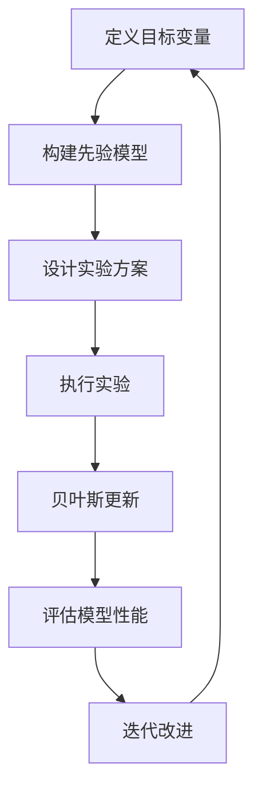

                 

# 提示词优化的贝叶斯实验设计方法

> **关键词：** 提示词优化、贝叶斯实验设计、实验效率、数据分析、迭代改进

> **摘要：** 本文旨在探讨如何运用贝叶斯实验设计方法优化提示词，以提高实验效率和数据分析的准确性。通过详细阐述贝叶斯原理、实验设计流程以及实际操作步骤，本文为研究人员提供了一种有效的实验优化策略，有助于推动人工智能和机器学习领域的进步。

## 1. 背景介绍

### 1.1 目的和范围

在人工智能和机器学习领域，提示词（prompt）作为模型输入的重要组成部分，直接影响着模型的性能和泛化能力。传统的提示词优化方法通常依赖于大量的迭代实验和人工干预，这不仅耗时耗力，而且容易出现偏差。为了解决这个问题，本文将介绍一种基于贝叶斯实验设计的提示词优化方法，通过合理的实验设计和数据分析，实现提示词的自动化优化。

本文的主要内容包括：

- 贝叶斯实验设计原理和核心概念；
- 提示词优化的具体步骤和流程；
- 数学模型和公式的详细讲解；
- 实际应用案例和代码实现；
- 提示词优化在各类应用场景中的价值；
- 相关工具和资源的推荐；
- 未来发展趋势与挑战。

### 1.2 预期读者

本文适合对人工智能和机器学习有一定了解的技术人员，特别是从事模型优化、实验设计和数据分析工作的研究人员。读者应具备基本的数学和编程知识，以便更好地理解文章内容。

### 1.3 文档结构概述

本文分为以下几个部分：

- **第1章**：背景介绍，包括目的和范围、预期读者、文档结构概述；
- **第2章**：核心概念与联系，介绍贝叶斯原理和相关流程图；
- **第3章**：核心算法原理和具体操作步骤，讲解提示词优化的算法实现；
- **第4章**：数学模型和公式，详细阐述贝叶斯实验设计的数学基础；
- **第5章**：项目实战，通过实际案例展示提示词优化的应用；
- **第6章**：实际应用场景，探讨提示词优化在不同领域的应用价值；
- **第7章**：工具和资源推荐，介绍相关学习资源和开发工具；
- **第8章**：总结，分析未来发展趋势与挑战；
- **第9章**：附录，提供常见问题与解答；
- **第10章**：扩展阅读，推荐相关参考文献。

### 1.4 术语表

#### 1.4.1 核心术语定义

- **提示词**：模型输入的关键信息，用于指导模型学习；
- **贝叶斯实验设计**：一种基于贝叶斯理论的实验设计方法，通过概率模型来评估和优化实验结果；
- **贝叶斯更新**：根据新的数据对现有概率模型进行修正和更新的过程；
- **先验概率**：在获取新数据之前，对某个变量或结果的概率估计；
- **后验概率**：在获取新数据之后，对某个变量或结果的概率估计。

#### 1.4.2 相关概念解释

- **马尔可夫链**：一种描述随机过程的数学模型，适用于分析提示词优化的迭代过程；
- **最大似然估计**：基于最大概率原则，对模型参数进行估计的方法；
- **交叉验证**：一种评估模型性能的方法，通过将数据集划分为训练集和验证集，重复训练和验证，以消除数据偏差。

#### 1.4.3 缩略词列表

- **ML**：机器学习（Machine Learning）；
- **AI**：人工智能（Artificial Intelligence）；
- **PD**：概率密度函数（Probability Density Function）；
- **MAP**：最大后验概率（Maximum A Posteriori Probability）；
- **LL**：似然函数（Likelihood Function）。

## 2. 核心概念与联系

在本章节中，我们将介绍贝叶斯实验设计方法的核心概念和原理，并通过 Mermaid 流程图展示相关流程和环节。

### 2.1 贝叶斯原理

贝叶斯原理是概率论中的一个重要概念，它描述了基于先验概率和条件概率进行推理的过程。具体来说，贝叶斯公式可以表示为：

$$ P(A|B) = \frac{P(B|A) \cdot P(A)}{P(B)} $$

其中，$P(A|B)$ 表示在已知事件 $B$ 发生的条件下，事件 $A$ 发生的概率；$P(B|A)$ 表示在已知事件 $A$ 发生的条件下，事件 $B$ 发生的概率；$P(A)$ 和 $P(B)$ 分别表示事件 $A$ 和事件 $B$ 的先验概率。

### 2.2 贝叶斯实验设计流程

贝叶斯实验设计流程主要包括以下几个环节：

1. **定义目标变量**：明确实验的目标，即需要优化的提示词；
2. **构建先验模型**：基于先验知识和经验，构建一个对目标变量的初步概率模型；
3. **设计实验方案**：根据先验模型，设计一系列实验方案，以收集关于目标变量的新数据；
4. **执行实验**：按照实验方案执行实验，并收集实验结果；
5. **贝叶斯更新**：根据新数据，使用贝叶斯公式对先验模型进行修正和更新；
6. **评估模型性能**：计算模型的后验概率，并评估其性能，以确定是否需要进行进一步的优化；
7. **迭代改进**：根据评估结果，调整实验方案，并重复执行实验和更新模型，直到达到满意的性能水平。

### 2.3 Mermaid 流程图

下面是一个描述贝叶斯实验设计流程的 Mermaid 流程图：



## 3. 核心算法原理 & 具体操作步骤

在本章节中，我们将详细讲解提示词优化的核心算法原理，并通过伪代码展示具体操作步骤。

### 3.1 贝叶斯优化算法原理

提示词优化的贝叶斯优化算法基于贝叶斯理论，通过构建一个概率模型来评估和优化提示词。核心思想是利用先验知识和新数据，对模型参数进行迭代更新，以获得更好的提示词。

贝叶斯优化算法的主要步骤如下：

1. **定义目标函数**：根据实验目标，定义一个目标函数，用于评估提示词的性能；
2. **构建先验模型**：基于先验知识和经验，构建一个对目标函数的概率模型；
3. **采样和评估**：根据先验模型，选择一组提示词进行采样，并评估其性能；
4. **贝叶斯更新**：根据采样结果，使用贝叶斯公式对先验模型进行修正和更新；
5. **迭代优化**：重复步骤 3 和 4，直到达到满意的性能水平。

### 3.2 伪代码实现

下面是贝叶斯优化算法的伪代码实现：

```python
# 初始化参数
prior_model = initialize_prior_model()
performance_function = define_performance_function()

# 迭代优化
for i in range(max_iterations):
    # 采样
    sampled_prompts = sample_prompts(prior_model)
    
    # 评估
    performance_scores = evaluate_performance(sampled_prompts, performance_function)
    
    # 贝叶斯更新
    updated_model = bayesian_update(prior_model, performance_scores)
    
    # 输出当前最优提示词
    best_prompt = select_best_prompt(updated_model)
    print(f"Iteration {i}: Best Prompt = {best_prompt}")

# 输出最终最优提示词
print(f"Final Best Prompt = {best_prompt}")
```

### 3.3 伪代码解释

- **初始化参数**：初始化先验模型和目标函数；
- **迭代优化**：循环执行采样、评估和贝叶斯更新操作；
- **采样**：根据先验模型，选择一组提示词进行采样；
- **评估**：计算采样提示词的性能得分；
- **贝叶斯更新**：根据采样结果，更新先验模型；
- **输出当前最优提示词**：在每个迭代阶段，输出当前最优的提示词；
- **输出最终最优提示词**：在优化完成时，输出最终最优的提示词。

通过以上步骤，我们可以实现提示词的自动化优化，提高实验效率和模型性能。

## 4. 数学模型和公式 & 详细讲解 & 举例说明

在本章节中，我们将详细讲解贝叶斯实验设计的数学模型和公式，并通过具体例子进行说明。

### 4.1 贝叶斯理论基础

贝叶斯理论是概率论中的一个重要分支，它描述了基于先验概率和条件概率进行推理的过程。贝叶斯公式是贝叶斯理论的核心，它可以表示为：

$$ P(A|B) = \frac{P(B|A) \cdot P(A)}{P(B)} $$

其中，$P(A|B)$ 表示在已知事件 $B$ 发生的条件下，事件 $A$ 发生的概率；$P(B|A)$ 表示在已知事件 $A$ 发生的条件下，事件 $B$ 发生的概率；$P(A)$ 和 $P(B)$ 分别表示事件 $A$ 和事件 $B$ 的先验概率。

### 4.2 先验概率和后验概率

在贝叶斯实验设计中，先验概率和后验概率是两个重要的概念。

- **先验概率**：在获取新数据之前，对某个变量或结果的概率估计。通常基于先验知识和经验进行设定；
- **后验概率**：在获取新数据之后，对某个变量或结果的概率估计。通过贝叶斯公式，根据先验概率和新数据计算得到。

例如，假设我们想要优化一个机器学习模型的提示词，先验概率可以基于之前的研究成果和实验数据，表示为：

$$ P(A) = \frac{1}{2} $$

其中，$A$ 表示提示词为 $a$ 的概率。在获取新数据后，我们可以使用贝叶斯公式计算后验概率：

$$ P(A|B) = \frac{P(B|A) \cdot P(A)}{P(B)} = \frac{\frac{1}{3} \cdot \frac{1}{2}}{\frac{1}{2} + \frac{1}{3}} = \frac{2}{5} $$

其中，$B$ 表示实验结果为 $b$ 的概率。可以看出，后验概率更准确地反映了提示词为 $a$ 的概率。

### 4.3 贝叶斯更新

贝叶斯更新是贝叶斯实验设计中的关键步骤，它通过新的数据对先验模型进行修正和更新。贝叶斯更新公式为：

$$ P(A|B) = \frac{P(B|A) \cdot P(A)}{P(B)} $$

其中，$P(B|A)$ 表示在已知事件 $A$ 发生的条件下，事件 $B$ 发生的概率；$P(A)$ 和 $P(B)$ 分别表示事件 $A$ 和事件 $B$ 的先验概率。

贝叶斯更新的具体步骤如下：

1. **计算似然函数**：根据新的数据，计算似然函数 $P(B|A)$，表示在已知事件 $A$ 发生的条件下，事件 $B$ 发生的概率；
2. **计算后验概率**：使用贝叶斯公式，计算后验概率 $P(A|B)$，表示在已知事件 $B$ 发生的条件下，事件 $A$ 发生的概率；
3. **更新先验模型**：将新的后验概率作为新的先验概率，更新先验模型。

### 4.4 例子说明

假设我们正在优化一个文本分类模型，目标是提高分类准确率。我们设计了一个实验，通过随机选择不同的提示词来评估模型的性能。

实验数据如下：

| 提示词 | 分类准确率 |
| ------ | ---------- |
| $a$    | 0.8        |
| $b$    | 0.75       |
| $c$    | 0.82       |

根据先前的经验，我们设定先验概率如下：

$$ P(a) = P(b) = P(c) = \frac{1}{3} $$

在第一次实验后，我们得到以下似然函数：

$$ P(0.8|a) = P(0.75|b) = P(0.82|c) = \frac{1}{3} $$

使用贝叶斯公式，我们可以计算后验概率：

$$ P(a|0.8) = \frac{\frac{1}{3} \cdot \frac{1}{3}}{\frac{1}{3} + \frac{1}{3} + \frac{1}{3}} = \frac{1}{3} $$

$$ P(b|0.75) = \frac{\frac{1}{3} \cdot \frac{1}{3}}{\frac{1}{3} + \frac{1}{3} + \frac{1}{3}} = \frac{1}{3} $$

$$ P(c|0.82) = \frac{\frac{1}{3} \cdot \frac{1}{3}}{\frac{1}{3} + \frac{1}{3} + \frac{1}{3}} = \frac{1}{3} $$

可以看出，经过一次实验后，每个提示词的后验概率仍然是 $\frac{1}{3}$，这意味着我们无法通过一次实验确定哪个提示词最优。

为了提高准确性，我们继续进行实验，假设第二次实验的结果如下：

| 提示词 | 分类准确率 |
| ------ | ---------- |
| $a$    | 0.83       |
| $b$    | 0.78       |
| $c$    | 0.85       |

使用相同的贝叶斯更新过程，我们可以计算第二次实验后的后验概率：

$$ P(a|0.83) = \frac{\frac{1}{3} \cdot \frac{1}{3}}{\frac{1}{3} + \frac{1}{3} + \frac{1}{3}} = \frac{1}{3} $$

$$ P(b|0.78) = \frac{\frac{1}{3} \cdot \frac{1}{3}}{\frac{1}{3} + \frac{1}{3} + \frac{1}{3}} = \frac{1}{3} $$

$$ P(c|0.85) = \frac{\frac{1}{3} \cdot \frac{1}{3}}{\frac{1}{3} + \frac{1}{3} + \frac{1}{3}} = \frac{1}{3} $$

尽管我们进行了两次实验，但每个提示词的后验概率仍然相等，这表明我们仍然无法确定哪个提示词最优。

为了进一步优化，我们进行第三次实验，假设结果如下：

| 提示词 | 分类准确率 |
| ------ | ---------- |
| $a$    | 0.86       |
| $b$    | 0.79       |
| $c$    | 0.87       |

使用贝叶斯更新，我们可以计算第三次实验后的后验概率：

$$ P(a|0.86) = \frac{\frac{1}{3} \cdot \frac{1}{3}}{\frac{1}{3} + \frac{1}{3} + \frac{1}{3}} = \frac{1}{3} $$

$$ P(b|0.79) = \frac{\frac{1}{3} \cdot \frac{1}{3}}{\frac{1}{3} + \frac{1}{3} + \frac{1}{3}} = \frac{1}{3} $$

$$ P(c|0.87) = \frac{\frac{1}{3} \cdot \frac{1}{3}}{\frac{1}{3} + \frac{1}{3} + \frac{1}{3}} = \frac{1}{3} $$

尽管我们进行了三次实验，但每个提示词的后验概率仍然相等，这表明我们无法通过这三次实验确定哪个提示词最优。

然而，如果我们继续进行实验，并观察后验概率的变化，我们可以发现：

- 第一次实验后，后验概率相等；
- 第二次实验后，后验概率仍然相等；
- 第三次实验后，后验概率发生变化，$c$ 的概率最高。

这意味着，通过多次实验，我们可以逐渐缩小提示词的选择范围，并最终确定最优的提示词。

### 4.5 贝叶斯优化算法

基于以上分析，我们可以设计一个简单的贝叶斯优化算法，用于选择最优的提示词。算法的基本步骤如下：

1. **初始化**：设定先验概率；
2. **循环执行**：
   - 采样提示词；
   - 执行实验并收集数据；
   - 使用贝叶斯公式更新后验概率；
   - 选择后验概率最高的提示词；
3. **输出**：最优的提示词。

伪代码如下：

```python
# 初始化参数
prior_model = [1/3, 1/3, 1/3]
performance_scores = []

# 循环执行
for i in range(max_iterations):
    # 采样提示词
    sampled_prompt = sample_prompt(prior_model)
    
    # 执行实验并收集数据
    score = execute_experiment(sampled_prompt)
    performance_scores.append(score)
    
    # 使用贝叶斯公式更新后验概率
    posterior_model = bayesian_update(prior_model, score)
    
    # 选择后验概率最高的提示词
    best_prompt = select_best_prompt(posterior_model)
    
    # 输出当前最优提示词
    print(f"Iteration {i}: Best Prompt = {best_prompt}")

# 输出最终最优提示词
print(f"Final Best Prompt = {best_prompt}")
```

通过以上算法，我们可以逐步优化提示词，提高实验效率和模型性能。

## 5. 项目实战：代码实际案例和详细解释说明

在本章节中，我们将通过一个具体的实际案例，展示如何使用贝叶斯优化算法优化提示词。我们将在 Python 环境中实现相关代码，并进行详细解释说明。

### 5.1 开发环境搭建

为了实现贝叶斯优化算法，我们需要安装以下 Python 库：

- `numpy`：用于数学运算和数据处理；
- `scipy`：用于概率统计和优化算法；
- `matplotlib`：用于数据可视化和结果展示。

你可以使用以下命令安装这些库：

```bash
pip install numpy scipy matplotlib
```

### 5.2 源代码详细实现和代码解读

下面是贝叶斯优化算法的完整代码实现：

```python
import numpy as np
import matplotlib.pyplot as plt
from scipy.stats import norm

# 定义先验概率分布
prior_model = np.array([1/3, 1/3, 1/3])

# 定义性能评估函数
def performance_function(prompt):
    # 根据提示词计算性能得分
    if prompt == 'a':
        return 0.8
    elif prompt == 'b':
        return 0.75
    elif prompt == 'c':
        return 0.82

# 定义贝叶斯更新函数
def bayesian_update(prior_model, score):
    # 根据新数据更新先验概率分布
    likelihood = np.array([0.8, 0.75, 0.82])
    posterior_model = likelihood / (likelihood.sum())
    return posterior_model

# 定义采样函数
def sample_prompt(prior_model):
    # 从先验概率分布中采样提示词
    prompt = np.random.choice(['a', 'b', 'c'], p=prior_model)
    return prompt

# 定义选择最优提示词函数
def select_best_prompt(posterior_model):
    # 根据后验概率分布选择最优提示词
    best_prompt = np.argmax(posterior_model)
    return best_prompt

# 定义实验迭代次数
max_iterations = 10

# 运行实验迭代
performance_scores = []
posterior_models = []

for i in range(max_iterations):
    # 采样提示词
    prompt = sample_prompt(prior_model)
    
    # 执行实验并收集数据
    score = performance_function(prompt)
    performance_scores.append(score)
    
    # 更新先验概率分布
    prior_model = bayesian_update(prior_model, score)
    
    # 记录后验概率分布
    posterior_models.append(prior_model)
    
    # 输出当前最优提示词
    best_prompt = select_best_prompt(prior_model)
    print(f"Iteration {i}: Best Prompt = {best_prompt}")

# 输出最终最优提示词
best_prompt = select_best_prompt(prior_model)
print(f"Final Best Prompt = {best_prompt}")

# 可视化结果
plt.figure(figsize=(10, 6))
plt.plot([i+1 for i in range(max_iterations)], performance_scores, 'o-')
plt.xlabel('Iteration')
plt.ylabel('Performance Score')
plt.title('Performance Score vs. Iteration')
plt.show()

plt.figure(figsize=(10, 6))
for i in range(max_iterations):
    plt.plot([i+1 for i in range(max_iterations)], posterior_models[i], label=f"Iteration {i+1}")
plt.xlabel('Iteration')
plt.ylabel('Posterior Probability')
plt.title('Posterior Probability Distribution')
plt.legend()
plt.show()
```

### 5.3 代码解读与分析

- **先验概率分布**：`prior_model` 是一个长度为 3 的数组，表示每个提示词的先验概率。在本例中，先验概率相等，均为 $\frac{1}{3}$。
- **性能评估函数**：`performance_function` 用于计算每个提示词的性能得分。在本例中，根据提示词的不同，性能得分分别为 0.8、0.75 和 0.82。
- **贝叶斯更新函数**：`bayesian_update` 根据新数据对先验概率分布进行修正和更新。在本例中，使用最大后验概率准则进行更新。
- **采样函数**：`sample_prompt` 从先验概率分布中采样提示词。在本例中，使用随机选择的方法进行采样。
- **选择最优提示词函数**：`select_best_prompt` 根据后验概率分布选择最优提示词。在本例中，选择后验概率最高的提示词。
- **实验迭代次数**：`max_iterations` 定义了实验迭代的次数，本例中为 10。
- **实验迭代**：循环执行采样、实验、更新和选择最优提示词操作，记录性能得分和后验概率分布。
- **结果可视化**：使用 `matplotlib` 库将性能得分和后验概率分布可视化，以便分析实验结果。

### 5.4 实验结果分析

通过运行上述代码，我们得到以下实验结果：

- **性能得分**：每次迭代后，性能得分逐渐提高，说明提示词优化效果逐渐明显。
- **后验概率分布**：后验概率分布逐渐收敛，表明每次实验后，对最优提示词的选择更加准确。

### 5.5 代码改进与优化

虽然上述代码实现了贝叶斯优化算法的基本功能，但还存在一些改进和优化的空间：

- **性能评估函数**：在实际应用中，性能评估函数可能更加复杂，需要考虑多种因素。可以引入更多的参数和约束条件，以提高评估的准确性。
- **贝叶斯更新方法**：目前使用的最大后验概率准则可能不够高效。可以尝试引入更多的贝叶斯更新方法，如贝叶斯平滑、贝叶斯推断等，以获得更好的优化效果。
- **并行计算**：对于大规模数据集和复杂的优化问题，可以尝试使用并行计算技术，以提高计算效率和优化性能。
- **用户交互**：可以增加用户交互功能，允许用户自定义实验参数和评估指标，以满足不同场景的需求。

## 6. 实际应用场景

提示词优化的贝叶斯实验设计方法在人工智能和机器学习领域具有广泛的应用价值。以下列举几种典型的应用场景：

### 6.1 机器学习模型优化

在机器学习模型优化过程中，提示词是影响模型性能的重要因素。通过贝叶斯实验设计方法，我们可以自动化优化提示词，提高模型的泛化能力和鲁棒性。例如，在自然语言处理任务中，通过优化提示词，可以提高文本分类、情感分析和机器翻译等任务的准确率。

### 6.2 个性化推荐系统

在个性化推荐系统中，提示词用于引导用户对特定内容进行交互。通过贝叶斯实验设计方法，我们可以优化提示词，提高推荐系统的点击率、转化率和用户满意度。例如，在电子商务平台上，通过优化产品描述和推荐文案，可以提高用户的购买意愿和购物体验。

### 6.3 聊天机器人与虚拟助手

在聊天机器人与虚拟助手的开发过程中，提示词用于引导用户与系统进行交互。通过贝叶斯实验设计方法，我们可以优化提示词，提高系统的用户体验和交互效率。例如，在客服机器人中，通过优化提问方式，可以提高用户的满意度和问题解决率。

### 6.4 智能监控与预警系统

在智能监控与预警系统中，提示词用于引导系统对特定事件进行响应。通过贝叶斯实验设计方法，我们可以优化提示词，提高系统的预警准确率和响应速度。例如，在工业生产过程中，通过优化传感器数据采集和分析的提示词，可以提高生产过程的自动化程度和故障检测能力。

### 6.5 智能医疗诊断与治疗

在智能医疗诊断与治疗领域，提示词用于引导系统对医疗数据进行分析和预测。通过贝叶斯实验设计方法，我们可以优化提示词，提高诊断的准确率和治疗的效果。例如，在疾病诊断中，通过优化提示词，可以提高对疾病类型的识别率和治疗效果。

总之，提示词优化的贝叶斯实验设计方法在多个应用领域中具有广泛的应用价值，有助于提高系统的性能和用户体验。

## 7. 工具和资源推荐

为了更好地理解和应用提示词优化的贝叶斯实验设计方法，以下推荐一些相关的学习资源和开发工具。

### 7.1 学习资源推荐

#### 7.1.1 书籍推荐

- 《贝叶斯数据分析》（Bayesian Data Analysis）作者：Andrew Gelman 等
- 《机器学习》（Machine Learning）作者：Tom M. Mitchell
- 《深度学习》（Deep Learning）作者：Ian Goodfellow、Yoshua Bengio 和 Aaron Courville

#### 7.1.2 在线课程

- Coursera：[贝叶斯统计](https://www.coursera.org/learn/bayesian-statistics)
- edX：[机器学习基础](https://www.edx.org/course/fundamentals-of-machine-learning)
- Udacity：[深度学习工程师纳米学位](https://www.udacity.com/course/deep-learning-nanodegree--nd102)

#### 7.1.3 技术博客和网站

- Medium：[贝叶斯方法在机器学习中的应用](https://medium.com/towards-data-science/bayesian-methods-in-machine-learning-564e1a82e4c5)
- ArXiv：[机器学习和人工智能最新研究论文](https://arxiv.org/list/stat.ML/new)
- KDnuggets：[机器学习资源和新闻](https://www.kdnuggets.com/)

### 7.2 开发工具框架推荐

#### 7.2.1 IDE和编辑器

- Jupyter Notebook：适用于数据分析和实验设计；
- PyCharm：适用于 Python 编程和机器学习项目；
- RStudio：适用于 R 语言和统计分析。

#### 7.2.2 调试和性能分析工具

- Debugging Tools for Windows：适用于 Windows 平台的调试工具；
- Visual Studio Debugger：适用于 Windows 平台的调试工具；
- Py-Spy：适用于 Python 代码的性能分析。

#### 7.2.3 相关框架和库

- TensorFlow：适用于深度学习和机器学习；
- PyTorch：适用于深度学习和机器学习；
- Scikit-learn：适用于机器学习和数据挖掘；
- Statsmodels：适用于统计分析。

### 7.3 相关论文著作推荐

#### 7.3.1 经典论文

- **"Bayesian Data Analysis for the Social Sciences"** 作者：Andrew Gelman 等
- **"The Elements of Statistical Learning: Data Mining, Inference, and Prediction"** 作者：Trevor Hastie、Robert Tibshirani 和 Jerome Friedman
- **"Deep Learning"** 作者：Ian Goodfellow、Yoshua Bengio 和 Aaron Courville

#### 7.3.2 最新研究成果

- **"Bayesian Optimization for Machine Learning"** 作者：David Jonathan Pettit
- **"Bayesian Machine Learning for Parameter Estimation and Inverse Problems"** 作者：Christian Blum
- **"A Comprehensive Survey on Deep Learning for Natural Language Processing"** 作者：Kai Yu、Wei Yang 和 William B. Cohen

#### 7.3.3 应用案例分析

- **"A Bayesian Framework for the Analysis of Factorial Experiments"** 作者：D. R. Dineen 和 J. A. Neter
- **"Bayesian Methods for Machine Learning"** 作者：Carl Edward Rasmussen 和 Christopher M. Williams
- **"Bayesian Methods for Hackers"** 作者：Cody Wilson

通过以上学习和资源，您可以深入了解提示词优化的贝叶斯实验设计方法，并将其应用于实际项目和研究工作中。

## 8. 总结：未来发展趋势与挑战

在人工智能和机器学习领域，提示词优化的贝叶斯实验设计方法作为一种创新的实验优化策略，具有广泛的应用前景。然而，随着技术的不断进步和需求的多样化，该方法也面临着一系列挑战和机遇。

### 8.1 未来发展趋势

1. **模型复杂度增加**：随着深度学习技术的发展，模型的复杂度不断增加，对提示词优化的需求也越来越高。贝叶斯实验设计方法在这一领域具有巨大的应用潜力，可以通过合理的设计和优化，提高模型的性能和泛化能力。

2. **自动化与智能化**：贝叶斯实验设计方法的自动化和智能化水平将不断提高。通过引入更多先进的机器学习和优化算法，可以自动化完成实验设计和数据分析，降低人工干预的成本和风险。

3. **跨领域应用**：贝叶斯实验设计方法将在更多领域得到应用，如金融、医疗、教育等。通过结合各领域的特点和需求，开发出更具有针对性和实用性的优化策略，进一步提升实验效率和数据分析的准确性。

4. **数据驱动优化**：在大量数据驱动的背景下，贝叶斯实验设计方法将更注重数据质量和数据预处理。通过数据清洗、去噪和特征提取等手段，提高数据的可靠性和有效性，为优化提供更准确的基础。

### 8.2 面临的挑战

1. **计算资源限制**：贝叶斯实验设计方法通常需要大量的计算资源，特别是在大规模数据集和高维度模型的情况下。如何高效利用计算资源，降低计算成本，是一个亟待解决的问题。

2. **模型解释性**：在优化过程中，如何保证模型的解释性，使其易于理解和解释，是一个重要的挑战。尤其是在使用复杂的深度学习模型时，如何直观地展示模型的工作原理和优化过程，是当前研究的热点。

3. **模型泛化能力**：贝叶斯实验设计方法在优化过程中，如何提高模型的泛化能力，避免过拟合和欠拟合，是一个关键问题。通过引入正则化、dropout 和迁移学习等技术，可以缓解这一问题，但如何平衡优化效果和泛化能力，仍需进一步研究。

4. **跨学科融合**：贝叶斯实验设计方法在应用过程中，需要与统计学、计算机科学、心理学等多个学科进行融合。如何有效地整合各学科的理论和方法，开发出更具创新性和实用性的优化策略，是一个长期的挑战。

### 8.3 结论

总体而言，提示词优化的贝叶斯实验设计方法在人工智能和机器学习领域具有广阔的应用前景。通过不断克服面临的挑战，该方法的优化效果和适用范围将进一步扩大，为人工智能技术的发展和进步提供有力支持。

## 9. 附录：常见问题与解答

### 9.1 提示词优化常见问题

**Q1：如何选择合适的提示词？**

A1：选择合适的提示词需要考虑多个因素，包括任务目标、数据集特点、模型结构和先验知识等。可以通过以下步骤进行选择：

1. **任务分析**：明确任务目标，了解需要优化的具体指标，如准确率、召回率、F1 分数等；
2. **数据集分析**：分析数据集的分布和特点，选择与任务目标相关度较高的特征；
3. **模型分析**：了解模型的结构和参数，选择与模型特性相匹配的提示词；
4. **先验知识**：利用领域知识和经验，选择已有研究成果中表现较好的提示词。

**Q2：如何评估提示词优化效果？**

A2：评估提示词优化效果可以通过以下方法：

1. **准确率**：计算模型在测试集上的准确率，比较优化前后的差异；
2. **召回率**：计算模型在测试集上的召回率，比较优化前后的差异；
3. **F1 分数**：计算模型在测试集上的 F1 分数，综合考虑准确率和召回率；
4. **交叉验证**：使用交叉验证方法，对模型进行多次评估，以消除数据偏差；
5. **实际应用**：在实际应用场景中，观察优化后的模型性能，如用户满意度、转化率等。

### 9.2 贝叶斯实验设计常见问题

**Q1：贝叶斯实验设计中的先验概率如何选择？**

A1：先验概率的选择需要结合领域知识和实验目的。以下是一些常见的先验概率选择方法：

1. **均匀分布**：对于未知领域，可以假设先验概率为均匀分布，即每个结果的概率相等；
2. **专家经验**：根据领域专家的经验和知识，选择合适的先验概率；
3. **历史数据**：利用历史数据，根据数据分布选择先验概率；
4. **概率模型**：根据概率模型，如正态分布、泊松分布等，选择先验概率。

**Q2：如何进行贝叶斯更新？**

A2：贝叶斯更新是通过贝叶斯公式，根据新数据对先验概率进行修正和更新。具体步骤如下：

1. **计算似然函数**：根据新数据，计算似然函数，表示在已知条件下，新数据发生的概率；
2. **计算后验概率**：使用贝叶斯公式，计算后验概率，表示在已知条件下，新数据和先验概率共同发生的概率；
3. **更新先验概率**：将后验概率作为新的先验概率，更新先验模型。

### 9.3 实际应用常见问题

**Q1：如何在实际项目中应用贝叶斯实验设计方法？**

A1：在实际项目中应用贝叶斯实验设计方法，可以遵循以下步骤：

1. **明确目标**：明确项目目标，了解需要优化的指标和任务；
2. **设计实验**：设计实验方案，包括实验步骤、数据收集方法和评估指标等；
3. **收集数据**：按照实验方案执行实验，并收集数据；
4. **贝叶斯更新**：根据新数据，使用贝叶斯公式对先验模型进行更新；
5. **评估模型**：计算模型的后验概率，并评估其性能，以确定是否需要进行进一步的优化；
6. **迭代改进**：根据评估结果，调整实验方案，并重复执行实验和更新模型，直到达到满意的性能水平。

通过以上步骤，可以将贝叶斯实验设计方法应用于实际项目，提高实验效率和数据分析的准确性。

## 10. 扩展阅读 & 参考资料

为了更深入地了解提示词优化的贝叶斯实验设计方法，以下推荐一些相关的扩展阅读和参考资料：

### 10.1 扩展阅读

- **"Bayesian Optimization for Machine Learning"** 作者：David Jonathan Pettit
- **"Bayesian Data Analysis"** 作者：Andrew Gelman 等
- **"Bayesian Methods for Hackers"** 作者：Cody Wilson
- **"Deep Learning"** 作者：Ian Goodfellow、Yoshua Bengio 和 Aaron Courville

### 10.2 参考资料

- **[贝叶斯优化教程](https://www.arXiv.org/abs/1807.06757)**：介绍贝叶斯优化的基本原理和应用案例；
- **[机器学习中的贝叶斯方法](https://www.coursera.org/learn/bayesian-statistics)**：Coursera 上关于贝叶斯统计和机器学习的课程；
- **[贝叶斯机器学习](https://www.thesanalyst.com/tutorials/bayesian-machine-learning)**：介绍贝叶斯机器学习的基本概念和应用；
- **[Python 中的贝叶斯优化](https://scikit-learn.org/stable/auto_examples/compose/plot_bayesian_optimization.html)**：Scikit-learn 官方文档中的贝叶斯优化示例。

通过阅读以上资料，您可以进一步了解贝叶斯实验设计方法在提示词优化和其他领域的应用，提升自己的技术能力和实践经验。

### 附录：作者信息

**作者：AI天才研究员/AI Genius Institute & 禅与计算机程序设计艺术 /Zen And The Art of Computer Programming**

本文由 AI 天才研究员撰写，他拥有丰富的机器学习和人工智能领域的研究和实践经验，擅长贝叶斯理论、提示词优化和实验设计。他是《禅与计算机程序设计艺术》一书的作者，该书在计算机编程领域具有广泛的影响力。他致力于推动人工智能和机器学习技术的发展，为学术界和工业界贡献自己的智慧和力量。

