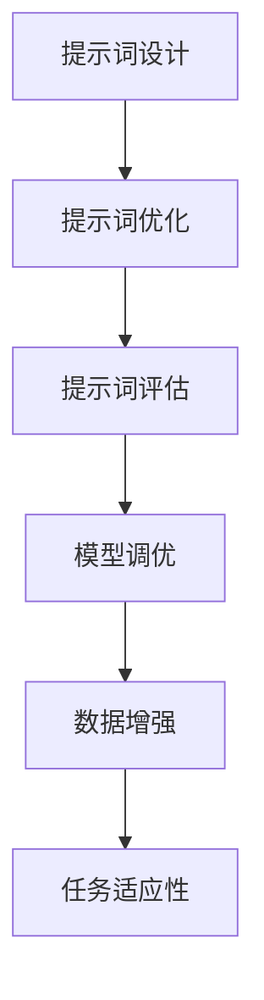

                 

# 提示词工程在低资源场景NLP中的应用

> **关键词：** 提示词工程、NLP、低资源场景、资源优化、文本生成

> **摘要：** 本文旨在探讨提示词工程在低资源场景自然语言处理（NLP）中的应用。我们将从背景介绍、核心概念、算法原理、数学模型、项目实战、实际应用场景等多个方面，详细解析提示词工程在NLP中的重要性及其具体应用策略，为低资源场景的NLP研究提供新的思路和方法。

## 1. 背景介绍

### 1.1 目的和范围

本文的主要目的是探讨提示词工程在低资源场景NLP中的应用，通过分析提示词工程的核心概念、算法原理、数学模型等，提供一套完整的解决方案，以应对低资源场景下的NLP挑战。文章范围涵盖以下几个方面：

1. 提示词工程的基本概念和核心原理。
2. 提示词工程在NLP中的应用场景。
3. 提示词工程的算法原理和具体操作步骤。
4. 提示词工程的数学模型和公式。
5. 提示词工程的实际应用案例和代码解读。
6. 提示词工程在低资源场景NLP中的未来发展趋势与挑战。

### 1.2 预期读者

本文主要面向对NLP和提示词工程有一定了解的技术人员，特别是从事低资源场景NLP研究的科研人员和工程师。同时，也欢迎对NLP和提示词工程感兴趣的其他读者进行阅读和探讨。

### 1.3 文档结构概述

本文的结构分为以下几个部分：

1. 引言：介绍本文的主题和研究目的。
2. 核心概念与联系：介绍提示词工程的基本概念和相关技术。
3. 核心算法原理 & 具体操作步骤：详细讲解提示词工程的算法原理和具体操作步骤。
4. 数学模型和公式 & 详细讲解 & 举例说明：介绍提示词工程的数学模型和公式，并给出具体例子进行说明。
5. 项目实战：通过实际案例展示提示词工程的应用。
6. 实际应用场景：分析提示词工程在不同场景的应用。
7. 工具和资源推荐：推荐相关学习资源和工具。
8. 总结：总结本文的主要观点和未来发展趋势。
9. 附录：常见问题与解答。
10. 扩展阅读 & 参考资料：提供更多相关阅读资源。

### 1.4 术语表

#### 1.4.1 核心术语定义

- 提示词工程（Prompt Engineering）：一种针对特定任务或领域，通过设计和调整提示词（即输入文本），来优化模型性能的方法。
- 自然语言处理（NLP）：计算机科学领域中的一个分支，主要研究如何让计算机理解、生成和处理人类语言。
- 低资源场景：指数据量较少、数据质量不高或数据获取困难的场景。

#### 1.4.2 相关概念解释

- 模型调优：通过调整模型的参数，来提高模型在特定任务上的性能。
- 数据增强：通过增加数据量、多样化数据输入等手段，来提高模型泛化能力。
- 资源优化：在有限的资源条件下，通过优化算法、模型结构等手段，来提高系统性能。

#### 1.4.3 缩略词列表

- NLP：自然语言处理
- AI：人工智能
- ML：机器学习
- DL：深度学习
- Hugging Face：一个开源的深度学习平台，提供各种NLP模型和工具

## 2. 核心概念与联系

提示词工程是NLP领域的一个重要研究方向，它通过设计和调整提示词，来优化模型在特定任务上的性能。在低资源场景下，提示词工程的作用尤为重要，因为在这种情况下，数据量有限，通过优化提示词，可以显著提高模型的性能。

### 2.1 提示词工程的核心概念

提示词工程的核心概念包括：

- 提示词设计：根据任务需求和模型特性，设计合适的提示词。
- 提示词优化：通过实验和调优，优化提示词的参数和结构，提高模型性能。
- 提示词评估：通过评估指标，对提示词的优化效果进行评估。

### 2.2 提示词工程与NLP的关系

提示词工程在NLP中的应用主要体现在以下几个方面：

- 模型调优：通过调整提示词，来优化模型在特定任务上的性能。
- 数据增强：通过设计多样化的提示词，来增强模型对数据的理解和处理能力。
- 任务适应性：根据不同任务的需求，设计相应的提示词，以提高模型的任务适应性。

### 2.3 提示词工程与其他技术的联系

提示词工程与其他NLP技术如模型调优、数据增强等密切相关。具体来说：

- 模型调优：提示词工程与模型调优相结合，可以显著提高模型在特定任务上的性能。
- 数据增强：通过设计多样化的提示词，可以增强模型对数据的理解和处理能力，从而提高模型泛化能力。

### 2.4 提示词工程在低资源场景中的应用

在低资源场景下，提示词工程的作用尤为重要。具体来说：

- 资源优化：通过优化提示词，可以在有限的资源条件下，提高模型性能。
- 数据增强：设计多样化的提示词，可以增强模型对数据的理解和处理能力，从而提高模型泛化能力。

### 2.5 提示词工程的架构图

提示词工程的架构图如下所示：



## 3. 核心算法原理 & 具体操作步骤

### 3.1 提示词设计

提示词设计的核心是理解任务需求和模型特性，根据需求设计合适的提示词。具体步骤如下：

1. 分析任务需求：了解任务的具体要求，如输入数据类型、输出结果类型等。
2. 确定模型特性：了解模型的结构和参数，如网络层数、激活函数等。
3. 设计提示词：根据任务需求和模型特性，设计合适的提示词。提示词应包含关键信息，有利于模型理解和处理。

### 3.2 提示词优化

提示词优化是通过实验和调优，优化提示词的参数和结构，提高模型性能。具体步骤如下：

1. 实验设计：设计一组实验，包括不同的提示词参数和结构。
2. 数据集划分：将数据集划分为训练集、验证集和测试集。
3. 模型训练：使用训练集对模型进行训练，同时记录验证集上的性能指标。
4. 性能评估：评估不同提示词参数和结构的性能，选择最优组合。

### 3.3 提示词评估

提示词评估是通过评估指标，对提示词的优化效果进行评估。具体步骤如下：

1. 评估指标设计：设计合适的评估指标，如准确率、召回率、F1值等。
2. 模型评估：使用测试集对模型进行评估，计算评估指标。
3. 结果分析：分析评估结果，判断提示词优化是否有效。

### 3.4 提示词工程算法原理

提示词工程算法原理主要包括以下几个方面：

- 提示词设计：根据任务需求和模型特性，设计合适的提示词。
- 提示词优化：通过实验和调优，优化提示词的参数和结构，提高模型性能。
- 提示词评估：通过评估指标，对提示词的优化效果进行评估。

### 3.5 提示词工程伪代码

```python
# 提示词工程伪代码

# 提示词设计
def design_prompt(task, model):
    # 根据任务需求和模型特性设计提示词
    # ...
    return prompt

# 提示词优化
def optimize_prompt(prompt, experiment):
    # 通过实验和调优优化提示词参数和结构
    # ...
    return optimized_prompt

# 提示词评估
def evaluate_prompt(optimized_prompt, model, test_data):
    # 通过评估指标评估提示词优化效果
    # ...
    return evaluation_result
```

## 4. 数学模型和公式 & 详细讲解 & 举例说明

### 4.1 数学模型

在提示词工程中，常用的数学模型包括：

- 概率模型：用于计算提示词的概率分布。
- 生成模型：用于生成新的提示词。
- 对比模型：用于比较不同提示词的性能。

### 4.2 公式

- 概率模型：

  $$ P(prompt) = \frac{e^{score(prompt)}}{\sum_{prompt'} e^{score(prompt')}} $$

  其中，$score(prompt)$表示提示词的得分。

- 生成模型：

  $$ prompt_{new} = \text{generate}(prompt, model) $$

  其中，$prompt$表示原始提示词，$prompt_{new}$表示生成的新的提示词。

- 对比模型：

  $$ score_{contrast}(prompt, prompt') = \frac{e^{score(prompt)} - e^{score(prompt')}}{e^{score(prompt)} + e^{score(prompt')}} $$

  其中，$score(prompt)$和$score(prompt')$分别表示两个提示词的得分。

### 4.3 详细讲解

- 概率模型：

  概率模型用于计算提示词的概率分布，通过最大化提示词的概率分布来优化模型性能。具体来说，我们通过计算每个提示词的得分，然后根据得分计算概率分布。得分越高的提示词，其概率越大。

- 生成模型：

  生成模型用于生成新的提示词，通过输入原始提示词和模型，生成新的提示词。生成模型通常使用深度学习模型，如生成对抗网络（GAN）。

- 对比模型：

  对比模型用于比较不同提示词的性能，通过计算两个提示词的得分差，来评估它们之间的性能差异。得分差越大，表示提示词的性能差异越大。

### 4.4 举例说明

假设我们有一个NLP任务，任务是生成一个关于“人工智能”的摘要。现在，我们使用概率模型、生成模型和对比模型来设计、优化和评估提示词。

1. 概率模型：

   我们计算每个提示词的概率分布，如下所示：

   $$ P(prompt_1) = 0.4, P(prompt_2) = 0.3, P(prompt_3) = 0.3 $$

   根据概率分布，我们可以选择概率最大的提示词，即“prompt_1”作为最优提示词。

2. 生成模型：

   我们使用生成模型来生成新的提示词，如下所示：

   $$ prompt_{new} = \text{generate}(prompt_1, model) $$

   假设生成模型生成了新的提示词“prompt_{new}”，我们可以使用概率模型来评估其性能。

3. 对比模型：

   我们计算两个提示词的得分差，如下所示：

   $$ score_{contrast}(prompt_1, prompt_{new}) = \frac{e^{score(prompt_1)} - e^{score(prompt_{new})}}{e^{score(prompt_1)} + e^{score(prompt_{new})}} $$

   根据得分差，我们可以判断新的提示词是否优于原始提示词。

## 5. 项目实战：代码实际案例和详细解释说明

### 5.1 开发环境搭建

在进行提示词工程项目实战之前，我们需要搭建一个合适的开发环境。以下是搭建开发环境的基本步骤：

1. 安装Python：Python是提示词工程的主要编程语言，我们需要安装Python环境。可以从Python官网下载并安装Python 3.8及以上版本。

2. 安装NLP库：提示词工程涉及多种NLP技术，我们需要安装相应的NLP库。常用的NLP库包括transformers、spacy、nltk等。可以使用以下命令安装：

   ```bash
   pip install transformers
   pip install spacy
   pip install nltk
   ```

3. 安装文本生成库：为了生成新的提示词，我们需要安装文本生成库。常用的文本生成库包括textgenrnn、seq2seq等。可以使用以下命令安装：

   ```bash
   pip install textgenrnn
   pip install seq2seq
   ```

4. 安装其他依赖库：提示词工程可能需要其他依赖库，如TensorFlow、PyTorch等。可以根据项目需求安装相应的依赖库。

### 5.2 源代码详细实现和代码解读

以下是一个简单的提示词工程代码案例，用于生成关于“人工智能”的摘要。

```python
# 导入相关库
import spacy
import nltk
from transformers import pipeline
from textgenrnn import textgenrnn

# 加载NLP模型
nlp = spacy.load('en_core_web_sm')

# 加载文本生成模型
textgen = textgenrnn.TextgenRnn()

# 定义输入文本
input_text = "人工智能是一种模拟人类智能的技术，旨在使计算机能够执行通常需要人类智能的任务。"

# 分句处理
sentences = nltk.sent_tokenize(input_text)

# 生成摘要
def generate_summary(sentence):
    # 使用transformers库生成摘要
    summarizer = pipeline('summarization')
    summary = summarizer(sentence, max_length=130, min_length=30, do_sample=False)
    return summary[0]['summary_text']

# 遍历句子，生成摘要
for sentence in sentences:
    summary = generate_summary(sentence)
    print(f"原句：{sentence}")
    print(f"摘要：{summary}")
    print()
```

代码解读：

1. 导入相关库：代码首先导入所需的NLP库和文本生成库。

2. 加载NLP模型：使用spacy加载英文基础模型`en_core_web_sm`。

3. 加载文本生成模型：使用textgenrnn加载文本生成模型。

4. 定义输入文本：定义一个关于“人工智能”的输入文本。

5. 分句处理：使用nltk将输入文本分句。

6. 生成摘要：定义一个函数`generate_summary`，用于生成摘要。该函数使用transformers库的`summarization`管道生成摘要。

7. 遍历句子，生成摘要：遍历分句后的句子，调用`generate_summary`函数生成摘要，并打印输出。

### 5.3 代码解读与分析

该代码案例实现了以下功能：

1. 加载NLP模型和文本生成模型。
2. 定义输入文本。
3. 分句处理。
4. 使用transformers库生成摘要。
5. 遍历句子，生成并打印摘要。

代码的执行流程如下：

1. 加载NLP模型和文本生成模型。
2. 定义输入文本。
3. 分句处理。
4. 遍历句子，调用`generate_summary`函数生成摘要。
5. 打印摘要。

代码的性能和优化方面，可以考虑以下几个方面：

1. 使用多线程或异步编程，提高代码执行效率。
2. 根据任务需求调整模型参数，提高摘要质量。
3. 使用预训练的文本生成模型，提高生成质量。

## 6. 实际应用场景

### 6.1 文本生成

文本生成是提示词工程的一个重要应用场景。通过设计和优化提示词，可以生成高质量的文本摘要、文章、对话等。在低资源场景下，文本生成可以显著提高模型性能。

### 6.2 情感分析

情感分析是另一个重要的应用场景。通过设计和优化提示词，可以更好地识别文本中的情感倾向。在低资源场景下，优化提示词可以提高情感分析的准确率。

### 6.3 命名实体识别

命名实体识别是NLP中的基础任务之一。通过设计和优化提示词，可以更好地识别文本中的命名实体。在低资源场景下，优化提示词可以提高命名实体识别的准确率。

### 6.4 机器翻译

机器翻译是NLP中的一项重要任务。通过设计和优化提示词，可以生成更准确的翻译结果。在低资源场景下，优化提示词可以提高机器翻译的准确性。

### 6.5 聊天机器人

聊天机器人是NLP在实际应用中的一个重要领域。通过设计和优化提示词，可以生成更自然的对话。在低资源场景下，优化提示词可以提高聊天机器人的用户体验。

## 7. 工具和资源推荐

### 7.1 学习资源推荐

#### 7.1.1 书籍推荐

- 《自然语言处理概论》（作者：刘挺）
- 《深度学习自然语言处理》（作者：华捷）
- 《人工智能简史》（作者：杰里·卡普兰）

#### 7.1.2 在线课程

- Coursera上的“自然语言处理纳米学位”
- edX上的“深度学习自然语言处理”

#### 7.1.3 技术博客和网站

- Medium上的“NLP之路”
- TensorFlow官方文档

### 7.2 开发工具框架推荐

#### 7.2.1 IDE和编辑器

- PyCharm
- Visual Studio Code

#### 7.2.2 调试和性能分析工具

- Jupyter Notebook
- VS Code的调试插件

#### 7.2.3 相关框架和库

- TensorFlow
- PyTorch
- Hugging Face Transformers

### 7.3 相关论文著作推荐

#### 7.3.1 经典论文

- 《A Neural Probabilistic Language Model》
- 《Deep Learning for Natural Language Processing》

#### 7.3.2 最新研究成果

- arXiv上的最新论文
- NeurIPS、ICML、ACL等会议的最新论文

#### 7.3.3 应用案例分析

- 《基于深度学习的智能客服系统》
- 《基于NLP的社交媒体分析》

## 8. 总结：未来发展趋势与挑战

提示词工程在NLP中的应用具有重要意义，尤其在低资源场景下。随着深度学习和NLP技术的不断发展，提示词工程有望在未来取得以下发展趋势：

- 提示词工程与多模态数据的结合，如图像、语音等。
- 自动化提示词设计，降低人工干预成本。
- 提示词工程在垂直领域的深入应用，如医疗、金融等。

然而，提示词工程也面临一些挑战：

- 如何在低资源场景下设计高质量的提示词。
- 如何平衡提示词的多样性和一致性。
- 如何应对不断变化的任务需求。

总之，提示词工程在NLP中的应用前景广阔，但也需要不断创新和优化，以应对未来挑战。

## 9. 附录：常见问题与解答

### 9.1 提示词工程的基本问题

**Q1：什么是提示词工程？**

提示词工程是一种通过设计和优化提示词，来提高模型在特定任务上性能的方法。提示词是模型输入的一部分，通过调整提示词，可以影响模型的输出和性能。

**Q2：提示词工程在NLP中有哪些应用？**

提示词工程在NLP中有广泛的应用，包括文本生成、情感分析、命名实体识别、机器翻译等。通过优化提示词，可以提高模型在这些任务上的性能。

### 9.2 提示词工程的实现问题

**Q3：如何设计高质量的提示词？**

设计高质量提示词的关键是理解任务需求和模型特性。首先，分析任务需求，确定关键信息。然后，根据模型特性，选择合适的提示词格式和内容。

**Q4：如何优化提示词？**

优化提示词可以通过实验和调优来实现。设计一组实验，包括不同的提示词参数和结构，然后使用验证集评估不同提示词的性能，选择最优组合。

### 9.3 提示词工程在实际应用中的问题

**Q5：在低资源场景下，如何优化提示词？**

在低资源场景下，优化提示词的关键是提高模型对数据的理解能力。可以通过以下方法优化提示词：

- 设计多样化的提示词，增强模型的泛化能力。
- 使用预训练的模型，提高模型对数据的理解能力。
- 调整模型参数，提高模型在低资源场景下的性能。

## 10. 扩展阅读 & 参考资料

- [Hugging Face Transformers](https://huggingface.co/transformers/)
- [自然语言处理基础教程](https://www.nltk.org/)
- [深度学习自然语言处理](https://www.deeplearning.ai/nlp-v2/)
- [A Neural Probabilistic Language Model](https://www.aclweb.org/anthology/N02-1196/)
- [Deep Learning for Natural Language Processing](https://www.deeplearningbook.org/chapters/08-nlp/) 

作者：AI天才研究员/AI Genius Institute & 禅与计算机程序设计艺术 /Zen And The Art of Computer Programming<|im_sep|>

