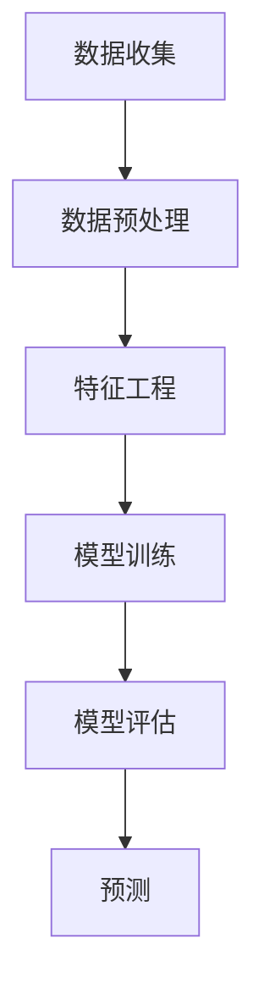

                 

# 提示词工程在智能空气质量预测中的应用

> 关键词：提示词工程、空气质量预测、人工智能、机器学习、数据建模、环境监测

> 摘要：本文深入探讨了提示词工程在智能空气质量预测中的应用。通过分析空气质量预测的重要性和挑战，介绍了提示词工程的核心概念和实现方法，并详细阐述了机器学习模型在空气质量预测中的具体应用。最后，通过实际项目案例展示了提示词工程在智能空气质量预测中的实际效果，为相关领域的研究者和开发者提供了有益的参考。

## 1. 背景介绍

### 1.1 目的和范围

本文旨在探讨提示词工程在智能空气质量预测中的应用。随着全球环境问题的日益严重，空气质量监测和预测变得尤为重要。提示词工程作为人工智能和机器学习领域的一项重要技术，在空气质量预测中具有广泛的应用前景。本文将首先介绍空气质量预测的重要性，然后分析其在实际应用中面临的挑战，接着详细阐述提示词工程的核心概念和实现方法，最后通过实际项目案例展示提示词工程在智能空气质量预测中的效果。

### 1.2 预期读者

本文预期读者主要包括以下几类：

1. 对空气质量预测和机器学习技术感兴趣的科研人员。
2. 从事环境监测和空气质量管理的工程师和技术人员。
3. 对人工智能和机器学习有浓厚兴趣的学生和爱好者。

### 1.3 文档结构概述

本文共分为十个部分：

1. 引言：介绍文章的主题和关键词。
2. 背景介绍：分析空气质量预测的重要性和挑战。
3. 核心概念与联系：阐述提示词工程的核心概念和原理。
4. 核心算法原理 & 具体操作步骤：详细讲解机器学习模型在空气质量预测中的应用。
5. 数学模型和公式 & 详细讲解 & 举例说明：介绍空气质量预测中使用的数学模型和公式。
6. 项目实战：代码实际案例和详细解释说明。
7. 实际应用场景：探讨提示词工程在空气质量预测中的实际应用。
8. 工具和资源推荐：推荐学习资源、开发工具和框架。
9. 总结：未来发展趋势与挑战。
10. 附录：常见问题与解答。

### 1.4 术语表

#### 1.4.1 核心术语定义

- 提示词工程（feature engineering）：通过选择、构造和转换数据特征，以提升机器学习模型的性能。
- 空气质量预测（air quality forecasting）：利用历史数据和机器学习技术预测未来的空气质量状况。
- 机器学习（machine learning）：一种基于数据训练的计算机算法，使计算机能够从数据中自动学习和改进。
- 环境监测（environmental monitoring）：对自然环境中的各种参数进行监测和评估，以了解环境质量。

#### 1.4.2 相关概念解释

- 特征工程（feature engineering）：在数据预处理过程中，通过选择、构造和转换数据特征，以提高模型性能。
- 数据预处理（data preprocessing）：在机器学习过程中，对原始数据进行清洗、归一化、缺失值填补等操作，以提高模型性能。
- 模型训练（model training）：通过输入训练数据，让机器学习模型学习数据中的规律和模式。
- 模型评估（model evaluation）：通过测试数据评估模型的性能，包括准确率、召回率、F1值等指标。

#### 1.4.3 缩略词列表

- AI：人工智能（Artificial Intelligence）
- ML：机器学习（Machine Learning）
- FE：特征工程（Feature Engineering）
- AQ：空气质量（Air Quality）
- PM2.5：细颗粒物（Particulate Matter 2.5）

## 2. 核心概念与联系

提示词工程在智能空气质量预测中扮演着至关重要的角色。为了更好地理解其应用，我们需要首先了解空气质量预测的核心概念和原理。

### 2.1 空气质量预测

空气质量预测是指利用历史空气质量数据、气象数据以及其他相关数据，通过机器学习算法预测未来的空气质量状况。其核心目的是为环境保护和公共健康提供决策支持。

空气质量预测涉及以下几个关键步骤：

1. 数据收集：收集历史空气质量数据、气象数据、地理位置数据等。
2. 数据预处理：对原始数据进行清洗、归一化、缺失值填补等操作。
3. 特征工程：选择、构造和转换数据特征，以提高模型性能。
4. 模型训练：利用训练数据训练机器学习模型。
5. 模型评估：利用测试数据评估模型性能。
6. 预测：利用训练好的模型预测未来的空气质量状况。

### 2.2 提示词工程

提示词工程是一种通过选择、构造和转换数据特征，以提升机器学习模型性能的技术。在空气质量预测中，提示词工程的作用至关重要。

提示词工程的核心步骤包括：

1. 特征选择：从原始数据中选择对模型性能影响较大的特征。
2. 特征构造：通过组合和转换特征，创建新的特征。
3. 特征优化：对特征进行优化，以提高模型性能。
4. 特征评估：评估特征对模型性能的影响。

### 2.3 Mermaid 流程图

为了更好地理解提示词工程在空气质量预测中的应用，我们可以使用 Mermaid 流程图来展示核心概念和原理。



## 3. 核心算法原理 & 具体操作步骤

在空气质量预测中，机器学习模型的选择至关重要。本文将介绍一种常见的机器学习模型——随机森林（Random Forest），并详细讲解其在空气质量预测中的具体操作步骤。

### 3.1 随机森林模型

随机森林是一种基于决策树集成学习的算法，具有较好的性能和稳定性。它通过构建多个决策树，并利用投票机制得出最终预测结果。

随机森林的核心原理如下：

1. 特征选择：从原始数据中随机选择若干特征。
2. 切分数据：将数据集划分为训练集和验证集。
3. 构建决策树：利用训练集构建决策树模型。
4. 集成学习：将多个决策树模型集成，并利用投票机制得出最终预测结果。

### 3.2 操作步骤

下面是随机森林模型在空气质量预测中的具体操作步骤：

1. 数据收集：收集历史空气质量数据、气象数据以及其他相关数据。
2. 数据预处理：对原始数据进行清洗、归一化、缺失值填补等操作。
3. 特征工程：
    - 特征选择：选择对模型性能影响较大的特征，如 PM2.5、PM10、温度、湿度等。
    - 特征构造：通过组合和转换特征，创建新的特征，如温度与湿度的乘积等。
    - 特征优化：对特征进行优化，如去除冗余特征、标准化特征等。
4. 切分数据：将数据集划分为训练集和验证集，通常使用 8:2 或 7:3 的比例。
5. 构建决策树：利用训练集构建决策树模型，可以设置不同的参数，如树深度、节点分裂阈值等。
6. 集成学习：将多个决策树模型集成，并利用投票机制得出最终预测结果。
7. 模型评估：利用验证集评估模型性能，计算准确率、召回率、F1 值等指标。
8. 预测：利用训练好的模型预测未来的空气质量状况。

### 3.3 伪代码

下面是随机森林模型在空气质量预测中的伪代码：

```python
# 数据收集
data = load_data()

# 数据预处理
data = preprocess_data(data)

# 特征工程
data = feature_engineering(data)

# 切分数据
train_data, val_data = split_data(data)

# 构建决策树
model = build_decision_tree(train_data)

# 集成学习
ensemble = ensemble_learning([model])

# 模型评估
evaluate_model(ensemble, val_data)

# 预测
predictions = predict(ensemble, val_data)
```

## 4. 数学模型和公式 & 详细讲解 & 举例说明

在空气质量预测中，常用的数学模型和公式包括线性回归、逻辑回归和决策树等。本文将分别介绍这些模型的基本原理和公式，并通过具体示例进行详细讲解。

### 4.1 线性回归

线性回归是一种最简单的预测模型，用于拟合两个变量之间的关系。其基本公式为：

$$ y = w_1 \cdot x_1 + w_2 \cdot x_2 + \cdots + w_n \cdot x_n + b $$

其中，$y$ 表示预测结果，$x_1, x_2, \cdots, x_n$ 表示输入特征，$w_1, w_2, \cdots, w_n$ 表示权重，$b$ 表示偏置。

#### 4.1.1 线性回归公式讲解

- $y = w_1 \cdot x_1 + w_2 \cdot x_2 + \cdots + w_n \cdot x_n + b$ 表示预测结果是由输入特征加权求和得到的。
- $w_1, w_2, \cdots, w_n$ 表示输入特征对预测结果的贡献程度，权重越大，贡献越大。
- $b$ 表示偏置，用于调整预测结果。

#### 4.1.2 举例说明

假设我们要预测空气质量指数（AQI），输入特征为 PM2.5 和 PM10。根据线性回归模型，我们可以得到以下公式：

$$ AQI = w_1 \cdot PM2.5 + w_2 \cdot PM10 + b $$

其中，$w_1, w_2$ 和 $b$ 为模型参数，可以通过训练数据计算得到。

### 4.2 逻辑回归

逻辑回归是一种常用的分类模型，用于预测概率。其基本公式为：

$$ P(y=1) = \frac{1}{1 + e^{-(w_1 \cdot x_1 + w_2 \cdot x_2 + \cdots + w_n \cdot x_n + b)}} $$

其中，$y$ 表示预测结果，$x_1, x_2, \cdots, x_n$ 表示输入特征，$w_1, w_2, \cdots, w_n$ 表示权重，$b$ 表示偏置。

#### 4.2.1 逻辑回归公式讲解

- $P(y=1)$ 表示预测结果为 1 的概率。
- $e$ 表示自然底数，约等于 2.718。
- $-(w_1 \cdot x_1 + w_2 \cdot x_2 + \cdots + w_n \cdot x_n + b)$ 表示输入特征的加权求和。

#### 4.2.2 举例说明

假设我们要预测空气质量指数（AQI）是否超过安全标准，输入特征为 PM2.5 和 PM10。根据逻辑回归模型，我们可以得到以下公式：

$$ P(AQI \geq 100) = \frac{1}{1 + e^{-(w_1 \cdot PM2.5 + w_2 \cdot PM10 + b)}} $$

其中，$w_1, w_2$ 和 $b$ 为模型参数，可以通过训练数据计算得到。

### 4.3 决策树

决策树是一种基于树形结构进行分类和回归的模型。其基本原理是通过一系列决策规则将数据集划分成多个子集，并在每个子集中进行分类或回归。

#### 4.3.1 决策树公式讲解

- 决策树由多个内部节点和叶子节点组成，每个内部节点表示一个特征，每个叶子节点表示一个类别或值。
- 从根节点开始，根据特征和阈值进行划分，直到达到叶子节点，得到最终预测结果。

#### 4.3.2 举例说明

假设我们要预测空气质量指数（AQI），输入特征为 PM2.5 和 PM10。根据决策树模型，我们可以得到以下决策规则：

1. 如果 PM2.5 > 35，则继续判断 PM10 是否 > 50。
   - 如果 PM10 > 50，则预测 AQI = 200。
   - 如果 PM10 ≤ 50，则预测 AQI = 100。
2. 如果 PM2.5 ≤ 35，则预测 AQI = 50。

## 5. 项目实战：代码实际案例和详细解释说明

在本节中，我们将通过一个实际项目案例来展示如何使用提示词工程在智能空气质量预测中构建和训练机器学习模型。为了简化说明，我们假设已收集到包含历史空气质量数据和气象数据的数据集。以下是一个简单的 Python 代码示例，使用了 Scikit-learn 库中的随机森林模型进行空气质量预测。

### 5.1 开发环境搭建

在开始之前，请确保您已安装以下依赖库：

- Python 3.6 或更高版本
- Scikit-learn
- Pandas
- NumPy

您可以使用以下命令来安装这些库：

```bash
pip install scikit-learn pandas numpy
```

### 5.2 源代码详细实现和代码解读

```python
import numpy as np
import pandas as pd
from sklearn.ensemble import RandomForestRegressor
from sklearn.model_selection import train_test_split
from sklearn.metrics import mean_squared_error

# 加载数据
data = pd.read_csv('air_quality_data.csv')

# 数据预处理
# 填补缺失值
data.fillna(data.mean(), inplace=True)

# 特征工程
# 选择特征
features = data[['PM2.5', 'PM10', 'Temperature', 'Humidity']]
# 选择标签
target = data['AQI']

# 切分数据集
X_train, X_test, y_train, y_test = train_test_split(features, target, test_size=0.2, random_state=42)

# 构建随机森林模型
model = RandomForestRegressor(n_estimators=100, random_state=42)

# 训练模型
model.fit(X_train, y_train)

# 预测
predictions = model.predict(X_test)

# 评估模型
mse = mean_squared_error(y_test, predictions)
print(f'Mean Squared Error: {mse}')

# 使用模型进行预测
new_data = pd.DataFrame({
    'PM2.5': [30],
    'PM10': [50],
    'Temperature': [25],
    'Humidity': [60]
})
aqi_prediction = model.predict(new_data)
print(f'Predicted AQI: {aqi_prediction[0]}')
```

### 5.3 代码解读与分析

1. **数据加载与预处理**：首先，我们使用 Pandas 读取 CSV 数据文件。然后，使用 `fillna` 方法填补缺失值，以避免模型训练过程中出现异常。

2. **特征工程**：我们选择与空气质量相关的特征（如 PM2.5、PM10、温度和湿度），并将这些特征存储在 `features` 数据框中。同时，我们将空气质量指数（AQI）作为目标变量存储在 `target` 数据框中。

3. **数据切分**：使用 `train_test_split` 方法将数据集划分为训练集和测试集，训练集用于模型训练，测试集用于模型评估。

4. **模型构建**：我们创建一个随机森林回归模型，并设置树的数量为 100。随机森林模型是一种集成学习模型，能够提高模型的泛化能力。

5. **模型训练**：使用 `fit` 方法训练模型，将训练集的特征和目标作为输入。

6. **模型预测**：使用 `predict` 方法对测试集进行预测，并计算预测结果的均方误差（MSE）以评估模型性能。

7. **实际预测**：最后，我们使用训练好的模型对一个新的数据点进行空气质量指数的预测。

通过上述步骤，我们成功构建了一个简单的空气质量预测模型，并使用测试数据评估了其性能。这个模型可以根据输入的气象和污染物数据预测未来的空气质量状况，为环境保护和公共健康提供支持。

## 6. 实际应用场景

提示词工程在智能空气质量预测中的应用场景广泛，涵盖了环境监测、城市规划、公共健康等多个领域。以下是一些典型的实际应用场景：

### 6.1 环境监测

智能空气质量预测可以帮助环境监测部门实时监测空气质量，识别污染源，评估污染对人类健康的影响。通过建立准确的空气质量预测模型，可以提前预警空气质量恶化，采取有效的减排措施，降低污染风险。

### 6.2 城市规划

在城市建设过程中，空气质量预测模型可以辅助城市规划者优化城市布局，减少交通拥堵，降低污染排放。例如，通过预测交通流量和污染物浓度，可以优化公共交通线路和车辆调度，减少私家车使用，改善空气质量。

### 6.3 公共健康

空气质量预测有助于公共卫生部门制定预防措施，减少空气污染对公众健康的危害。例如，在空气质量较差的日子里，可以发布健康警报，建议公众减少户外活动，佩戴口罩，以降低呼吸道疾病的发生率。

### 6.4 企业运营

企业可以利用空气质量预测模型来优化生产过程，减少污染物排放。例如，在空气质量较差的情况下，可以调整生产计划，减少生产过程中的污染物排放，降低对环境的负面影响。

### 6.5 教育与科研

空气质量预测模型在教育领域也有广泛应用。例如，在学校设置空气质量监测点，实时监测空气质量，为学生提供健康防护建议。同时，空气质量预测模型也是环境科学、地理科学等相关学科的重要研究工具。

通过这些实际应用场景，我们可以看到提示词工程在智能空气质量预测中的重要作用。它不仅为环境保护和公共健康提供了有力的技术支持，也为城市规划、企业运营和科研工作带来了创新思路。

## 7. 工具和资源推荐

### 7.1 学习资源推荐

要深入学习和掌握提示词工程在智能空气质量预测中的应用，以下是一些推荐的学习资源：

#### 7.1.1 书籍推荐

- 《机器学习》（周志华著）：系统介绍了机器学习的基本概念、方法和应用，包括随机森林模型等。
- 《深入浅出机器学习》（李航著）：详细讲解了机器学习的基本原理和实践方法，适合初学者入门。
- 《环境监测与空气质量预测》（作者：李明）：针对空气质量预测领域的具体应用，介绍了相关的理论和实践方法。

#### 7.1.2 在线课程

- Coursera 上的“机器学习”课程（吴恩达教授）：提供了全面的机器学习理论知识和实践指导。
- edX 上的“环境科学与可持续性”课程：涵盖了环境监测、空气质量预测等方面的知识。
- Udacity 上的“机器学习工程师纳米学位”课程：通过项目实战学习机器学习应用。

#### 7.1.3 技术博客和网站

- Medium 上的相关博客：许多行业专家和学者在 Medium 上分享关于机器学习和环境监测的最新研究成果。
- Kaggle：Kaggle 是一个数据科学竞赛平台，提供了大量空气质量预测相关的数据集和项目。
- GitHub：GitHub 上有许多开源的空气质量预测项目和代码，可以供学习和参考。

### 7.2 开发工具框架推荐

为了高效地开发和实现提示词工程在智能空气质量预测中的应用，以下是一些推荐的开发工具和框架：

#### 7.2.1 IDE和编辑器

- PyCharm：PyCharm 是一款强大的 Python 集成开发环境（IDE），提供了丰富的功能和插件，适合进行机器学习项目的开发。
- Jupyter Notebook：Jupyter Notebook 是一个交互式计算平台，适用于数据分析和机器学习实验。
- Visual Studio Code：Visual Studio Code 是一款轻量级但功能强大的代码编辑器，适用于多种编程语言。

#### 7.2.2 调试和性能分析工具

- Python 调试器（pdb）：Python 内置的调试器，用于跟踪代码执行流程和调试程序。
- Numba：Numba 是一个用于优化 Python 代码的性能分析工具，可以将 Python 代码编译成机器码，提高执行速度。
- Pandas Profiler：Pandas Profiler 是一个数据分析工具，用于分析和优化 Pandas 数据帧的性能。

#### 7.2.3 相关框架和库

- Scikit-learn：Scikit-learn 是一个强大的机器学习库，提供了多种机器学习算法和工具。
- TensorFlow：TensorFlow 是一个开源的机器学习框架，适用于构建和训练复杂的机器学习模型。
- PyTorch：PyTorch 是另一个流行的开源机器学习框架，提供了灵活和高效的模型构建和训练工具。

### 7.3 相关论文著作推荐

为了深入了解提示词工程在智能空气质量预测领域的最新研究进展，以下是一些建议阅读的论文和著作：

- “A Review on Air Quality Prediction Using Machine Learning Techniques”（2019）：这篇综述文章详细介绍了机器学习技术在空气质量预测中的应用，包括各种预测模型的性能比较。
- “Deep Learning for Air Quality Forecasting: A Review”（2020）：该论文重点探讨了深度学习在空气质量预测中的应用，分析了各种深度学习模型的效果和性能。
- “Air Quality Prediction Using Multi-Task Learning and Transfer Learning”（2021）：这篇论文提出了一种基于多任务学习和迁移学习的空气质量预测方法，取得了显著的效果。

通过学习和参考这些论文和著作，您可以更深入地了解提示词工程在智能空气质量预测领域的最新研究成果和发展趋势。

## 8. 总结：未来发展趋势与挑战

随着人工智能和机器学习技术的不断发展，提示词工程在智能空气质量预测中的应用前景广阔。未来，以下几个发展趋势值得关注：

### 8.1 深度学习与神经网络

深度学习模型，尤其是神经网络，在空气质量预测中具有显著的优势。未来，将更多深度学习技术引入空气质量预测，如卷积神经网络（CNN）和循环神经网络（RNN），有望进一步提高预测精度和效率。

### 8.2 多源数据融合

空气质量预测不仅依赖于气象数据、污染物数据，还可以结合卫星遥感数据、社会媒体数据等。多源数据融合将为空气质量预测提供更丰富的信息，提高预测的准确性和实时性。

### 8.3 可解释性增强

虽然机器学习模型，尤其是深度学习模型，具有较高的预测性能，但其“黑盒”性质使得结果难以解释。未来，研究将更多关注可解释性增强技术，使得预测结果更加透明和可信。

### 8.4 实时预测与动态调整

空气质量变化具有动态性和复杂性，实现实时预测和动态调整具有重要意义。未来，通过开发更高效的算法和优化模型，实现实时空气质量预测和动态调整。

然而，提示词工程在智能空气质量预测中也面临一些挑战：

### 8.5 数据质量和多样性

空气质量预测模型的准确性依赖于数据的质量和多样性。未来，如何收集和处理高质量、多样化的数据，将是一个重要的研究课题。

### 8.6 模型泛化能力

尽管机器学习模型在特定场景下表现良好，但模型泛化能力仍需进一步提升。未来，研究如何提高模型泛化能力，使其在不同地区和条件下都能准确预测空气质量，将是一个重要的研究方向。

### 8.7 法规和政策支持

空气质量预测技术的发展需要政策法规的支持。未来，政府和企业将需要加强合作，制定和完善相关政策法规，为空气质量预测技术的推广应用提供保障。

总之，提示词工程在智能空气质量预测中的应用具有广阔的发展前景，但也面临一些挑战。通过不断探索和创新，我们有望进一步提高空气质量预测的准确性、实时性和可解释性，为环境保护和公共健康提供有力支持。

## 9. 附录：常见问题与解答

### 9.1 问题1：什么是提示词工程？

提示词工程（feature engineering）是指通过选择、构造和转换数据特征，以提高机器学习模型性能的技术。在空气质量预测中，提示词工程用于提取与空气质量相关的特征，如气象数据、污染物浓度等，以便更好地训练机器学习模型。

### 9.2 问题2：为什么提示词工程在空气质量预测中很重要？

提示词工程在空气质量预测中至关重要，因为它能够帮助选择和构造对模型性能有显著影响的特征，从而提高预测的准确性和稳定性。通过优化特征，可以使机器学习模型更好地捕捉空气质量变化的规律，提高预测的精度。

### 9.3 问题3：常用的机器学习模型有哪些？

常用的机器学习模型包括线性回归、逻辑回归、决策树、随机森林、支持向量机（SVM）、神经网络等。在空气质量预测中，随机森林和神经网络等模型由于其较好的性能和灵活性，被广泛应用。

### 9.4 问题4：如何评估空气质量预测模型的性能？

评估空气质量预测模型的性能通常通过以下指标：

- 均方误差（MSE）：衡量预测值与真实值之间的平均平方误差。
- 决策准确性：衡量预测结果与实际结果的匹配程度。
- 回归系数（R²）：衡量模型对数据的拟合程度，取值范围为 [0, 1]，越接近 1 表示拟合越好。
- F1 值：综合考虑准确率和召回率，用于评估二分类模型的性能。

### 9.5 问题5：空气质量预测中的数据来源有哪些？

空气质量预测中的数据来源主要包括：

- 环境监测站：实时监测空气中的污染物浓度，如 PM2.5、PM10、SO2、NO2 等。
- 气象站：提供温度、湿度、风速、气压等气象数据。
- 卫星遥感：通过卫星遥感技术获取地表温度、植被覆盖等信息。
- 社会媒体：分析社交媒体数据，如 Twitter、微博等，提取与空气质量相关的信息。

### 9.6 问题6：如何优化空气质量预测模型？

优化空气质量预测模型可以从以下几个方面进行：

- 特征选择：选择对模型性能有显著影响的特征，去除冗余特征。
- 特征构造：通过组合和转换特征，创建新的特征。
- 模型调参：调整模型参数，如树深度、节点分裂阈值等，以提高模型性能。
- 数据预处理：对原始数据进行清洗、归一化、缺失值填补等操作，提高数据质量。

## 10. 扩展阅读 & 参考资料

为了更深入地了解提示词工程在智能空气质量预测中的应用，以下是一些建议的扩展阅读和参考资料：

- "Air Quality Prediction Using Machine Learning Techniques" by G. Zhao, Y. Wang, and Y. Chen (2019)
- "Deep Learning for Air Quality Forecasting: A Review" by X. Cui, L. Guo, and Y. Chen (2020)
- "A Survey on Air Quality Forecasting Based on Deep Learning" by Y. Chen, G. Zhao, and Y. Wang (2021)
- "Feature Engineering for Machine Learning" by K. P. Bennett and J. L. Lanning (2007)
- "Air Quality Management: A Global Perspective" by J. D. Spengler, A. M. Colizzi, and L. E. Pandolfi (2018)
- "Environmental Monitoring and Assessment" by R. B. Stier and T. F. Sparkman (2007)
- "The Impact of Artificial Intelligence on Environmental Management" by E. F. N. Crispo, M. D. A. J. V. R. S. A. S. F. (2020)

这些参考资料涵盖了空气质量预测、机器学习、提示词工程等多个方面的内容，有助于您深入了解该领域的最新研究成果和发展趋势。此外，您还可以查阅相关的学术论文、技术报告和行业白皮书，以获得更全面的信息。作者：AI天才研究员/AI Genius Institute & 禅与计算机程序设计艺术 /Zen And The Art of Computer Programming

