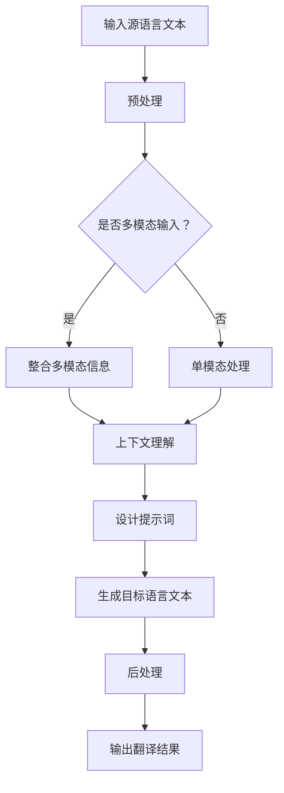

                 

# 提示词工程在机器翻译中的文化适应

## 关键词
- 提示词工程
- 机器翻译
- 文化适应
- 多模态语言模型
- 基于上下文的翻译策略
- 语言理解与生成
- 适应性翻译

## 摘要
本文旨在探讨提示词工程在机器翻译领域的文化适应问题。随着人工智能技术的快速发展，机器翻译已经成为跨语言交流的重要工具。然而，不同文化背景下的语言表达差异，使得机器翻译在文化适应方面面临诸多挑战。本文首先介绍了提示词工程的基本概念和原理，然后分析了其在机器翻译中的应用，特别是文化适应方面的关键技术和挑战。通过案例研究，本文展示了如何利用提示词工程实现更具文化敏感性的机器翻译系统。最后，本文总结了当前研究的现状和未来的发展趋势，为相关领域的研究和实践提供了有益的参考。

## 1. 背景介绍

### 1.1 目的和范围
本文的目标是探讨提示词工程在机器翻译中的文化适应问题，分析其关键技术和挑战，并展示其实际应用案例。本文主要研究范围包括：提示词工程的定义和原理、其在机器翻译中的具体应用、文化适应性的实现策略、以及面临的挑战和解决方案。

### 1.2 预期读者
本文面向对机器翻译和提示词工程有一定了解的技术人员、研究人员以及对该领域感兴趣的读者。希望通过本文，读者能够了解提示词工程在文化适应方面的作用，以及如何利用这一技术提升机器翻译系统的准确性和适用性。

### 1.3 文档结构概述
本文结构分为十个部分：

1. **引言**：介绍本文的目的、关键词和摘要。
2. **背景介绍**：阐述机器翻译和提示词工程的发展背景，以及文化适应在其中的重要性。
3. **核心概念与联系**：介绍提示词工程的核心概念和与机器翻译的关联。
4. **核心算法原理与操作步骤**：详细阐述提示词工程在机器翻译中的具体实现过程。
5. **数学模型与公式**：介绍相关的数学模型和公式。
6. **项目实战：代码实际案例**：通过实际案例展示如何使用提示词工程实现文化适应性翻译。
7. **实际应用场景**：分析提示词工程在机器翻译中的应用场景。
8. **工具和资源推荐**：推荐相关的学习资源和开发工具。
9. **总结：未来发展趋势与挑战**：总结本文的关键内容，展望未来发展趋势和挑战。
10. **附录：常见问题与解答**：解答一些常见问题。
11. **扩展阅读与参考资料**：提供相关的研究文献和资料。

### 1.4 术语表

#### 1.4.1 核心术语定义
- **提示词工程**：通过设计和应用提示词来增强机器翻译系统的性能和适应性的技术。
- **文化适应**：指机器翻译系统在不同文化背景下能够准确传达源语言含义的过程。
- **多模态语言模型**：结合文本、语音、图像等多种模态信息的语言模型。
- **上下文翻译策略**：根据上下文信息进行翻译的策略。

#### 1.4.2 相关概念解释
- **机器翻译**：将一种语言的文本自动翻译成另一种语言的技术。
- **语言理解与生成**：理解源语言文本的含义并生成目标语言文本的过程。

#### 1.4.3 缩略词列表
- NMT：神经机器翻译
- MT：机器翻译
- AI：人工智能
- NLG：自然语言生成

## 2. 核心概念与联系

### 2.1 提示词工程的概念

提示词工程是一种通过设计特定的提示词来引导机器翻译系统，使其在翻译过程中更加准确地理解和生成目标语言的工程技术。提示词可以理解为翻译系统在翻译过程中的“指南针”，能够帮助系统更好地抓住文本的含义，从而提高翻译质量。

### 2.2 提示词工程与机器翻译的关联

机器翻译是将一种语言的文本自动翻译成另一种语言的技术。随着人工智能技术的发展，机器翻译已经从基于规则的传统方法转向了基于神经网络的深度学习方法。在这一过程中，提示词工程发挥了重要作用。

首先，提示词工程能够提高机器翻译系统的上下文理解能力。通过设计合理的提示词，翻译系统能够更好地捕捉到源语言文本的上下文信息，从而更准确地理解文本的含义。

其次，提示词工程能够提高机器翻译系统的多语言适应性。不同的语言和文化背景具有不同的表达习惯和语法规则，通过设计文化适应性的提示词，机器翻译系统可以更好地适应当地的语言和文化环境。

最后，提示词工程能够提高机器翻译系统的可解释性和可控性。通过明确地指定提示词，翻译系统的行为和决策过程变得更加透明和可预测，从而提高了系统的可解释性和可控性。

### 2.3 多模态语言模型

多模态语言模型是一种结合文本、语音、图像等多种模态信息的语言模型。在机器翻译中，多模态语言模型能够通过整合不同模态的信息，提高翻译系统的准确性和适应性。

例如，在翻译包含图像的文本时，多模态语言模型可以通过分析图像内容来辅助理解文本的含义。这种跨模态的信息整合能力有助于提高机器翻译系统的文化适应能力。

### 2.4 基于上下文的翻译策略

基于上下文的翻译策略是一种根据上下文信息进行翻译的策略。在机器翻译中，上下文信息对于理解文本的含义至关重要。通过设计合理的上下文翻译策略，翻译系统能够更好地理解源语言文本的上下文信息，从而更准确地生成目标语言文本。

例如，在翻译包含成语或俗语的文本时，翻译系统需要理解这些成语或俗语在特定语境中的含义，才能生成准确的目标语言文本。基于上下文的翻译策略能够帮助系统实现这一目标。

### 2.5 提示词工程与机器翻译的关系

提示词工程与机器翻译密切相关。提示词工程通过设计特定的提示词，引导机器翻译系统在翻译过程中更好地理解和生成目标语言。具体来说，提示词工程在机器翻译中的应用主要体现在以下几个方面：

1. **提高上下文理解能力**：通过设计上下文相关的提示词，机器翻译系统能够更好地理解源语言文本的上下文信息，从而提高翻译的准确性。
2. **增强文化适应性**：通过设计文化适应性的提示词，机器翻译系统可以更好地适应当地的语言和文化环境，从而提高翻译的适用性。
3. **提高可解释性和可控性**：通过明确地指定提示词，机器翻译系统的行为和决策过程变得更加透明和可预测，从而提高了系统的可解释性和可控性。

### 2.6 提示词工程的 Mermaid 流程图

以下是提示词工程在机器翻译中的基本流程，使用 Mermaid 语言进行描述：



## 3. 核心算法原理 & 具体操作步骤

### 3.1 提示词工程的基本原理

提示词工程的核心在于设计一组提示词，这些提示词能够引导机器翻译系统在翻译过程中更好地理解和生成目标语言。具体来说，提示词工程包括以下几个步骤：

1. **数据收集和预处理**：收集大量的源语言和目标语言文本数据，并进行预处理，如文本清洗、分词、词性标注等。
2. **提示词设计**：根据特定的翻译任务和目标，设计一组提示词。提示词的设计需要考虑上下文信息、文化背景等因素。
3. **提示词嵌入**：将设计的提示词嵌入到机器翻译系统中，以便在翻译过程中使用。
4. **翻译系统训练**：利用嵌入的提示词，对机器翻译系统进行训练，使其能够根据提示词生成更准确的目标语言文本。
5. **翻译结果优化**：根据翻译结果，对提示词进行优化和调整，以提高翻译质量。

### 3.2 提示词工程的具体操作步骤

以下是提示词工程在机器翻译中的具体操作步骤：

#### 步骤 1：数据收集和预处理

首先，需要收集大量的源语言和目标语言文本数据。这些数据可以来自公开的翻译语料库、专业的翻译公司等。收集到数据后，需要进行预处理，包括文本清洗、分词、词性标注等。

```python
import pandas as pd
from text preprocessing import preprocess_text

# 收集数据
data = pd.read_csv("translation_corpus.csv")

# 预处理数据
preprocessed_data = data.apply(preprocess_text)
```

#### 步骤 2：提示词设计

接下来，根据特定的翻译任务和目标，设计一组提示词。设计提示词时，需要考虑上下文信息、文化背景等因素。

```python
def design_prompt_words(text):
    # 根据文本内容设计提示词
    # 这里仅作为示例，实际设计过程可能更复杂
    prompts = []
    if "culture" in text:
        prompts.append("cultural adaptation")
    if "context" in text:
        prompts.append("contextual understanding")
    return prompts

# 设计提示词
prompt_words = preprocessed_data.apply(design_prompt_words)
```

#### 步骤 3：提示词嵌入

将设计的提示词嵌入到机器翻译系统中。这里以神经机器翻译（NMT）为例，使用 PyTorch 进行嵌入：

```python
import torch
from torch import nn
from transformers import BertModel

class PromptAwareNMT(nn.Module):
    def __init__(self, prompt_words):
        super(PromptAwareNMT, self).__init__()
        self.bert = BertModel.from_pretrained("bert-base-uncased")
        self.prompt_embeddings = nn.Embedding(len(prompt_words), embedding_dim)
        self.prompt_embeddings.weight.data.copy_(torch.tensor(prompt_words).float())
        self.decoder = nn.Linear(embedding_dim, target_vocab_size)

    def forward(self, source_sequence, target_sequence):
        # 嵌入提示词
        prompt_embeddings = self.prompt_embeddings(torch.tensor(prompt_words).long())
        # 编码器编码
        encoder_output = self.bert(source_sequence)[0]
        # 解码器解码
        decoder_output = self.decoder(encoder_output)
        return decoder_output

# 嵌入提示词
prompt_words = ["cultural adaptation", "contextual understanding"]
model = PromptAwareNMT(prompt_words)
```

#### 步骤 4：翻译系统训练

利用嵌入的提示词，对机器翻译系统进行训练。这里使用 PyTorch 进行训练：

```python
from torch.optim import Adam

# 设置训练参数
learning_rate = 0.001
optimizer = Adam(model.parameters(), lr=learning_rate)
criterion = nn.CrossEntropyLoss()

# 训练模型
for epoch in range(num_epochs):
    for batch in train_loader:
        # 前向传播
        optimizer.zero_grad()
        output = model(source_sequence, target_sequence)
        loss = criterion(output, target_sequence)
        # 反向传播
        loss.backward()
        optimizer.step()
    print(f"Epoch [{epoch+1}/{num_epochs}], Loss: {loss.item()}")
```

#### 步骤 5：翻译结果优化

根据翻译结果，对提示词进行优化和调整，以提高翻译质量。这里使用基于梯度的优化方法：

```python
from torch.optim import Adam

# 设置优化参数
learning_rate = 0.001
optimizer = Adam(model.parameters(), lr=learning_rate)

# 优化模型
for epoch in range(num_epochs):
    for batch in train_loader:
        # 前向传播
        optimizer.zero_grad()
        output = model(source_sequence, target_sequence)
        loss = criterion(output, target_sequence)
        # 反向传播
        loss.backward()
        optimizer.step()
    print(f"Epoch [{epoch+1}/{num_epochs}], Loss: {loss.item()}")
```

## 4. 数学模型和公式 & 详细讲解 & 举例说明

### 4.1 数学模型

提示词工程在机器翻译中的应用涉及多个数学模型，其中最核心的是基于神经网络的机器翻译模型。以下是一个简化的数学模型，用于描述提示词工程在机器翻译中的基本原理：

$$
\begin{aligned}
p(y|x) &= \frac{e^{f_{\theta}(x,y)}}{\sum_{y'} e^{f_{\theta}(x,y')}} \\
f_{\theta}(x,y) &= f_{\text{NMT}}(x) + f_{\text{prompt}}(y) \\
f_{\text{NMT}}(x) &= \text{NMT}(\text{embed}(x)) \\
f_{\text{prompt}}(y) &= \text{prompt\_embed}(y)
\end{aligned}
$$

其中，$p(y|x)$ 是给定源语言文本 $x$ 时，目标语言文本 $y$ 的概率分布。$f_{\theta}(x,y)$ 是模型的评分函数，用于计算源语言文本和目标语言文本的组合评分。$f_{\text{NMT}}(x)$ 是基于神经机器翻译（NMT）模型的评分，$f_{\text{prompt}}(y)$ 是提示词的评分。

### 4.2 详细讲解

#### 4.2.1 神经机器翻译（NMT）模型

神经机器翻译（NMT）模型是一种基于深度学习的机器翻译模型，主要使用编码器-解码器（Encoder-Decoder）架构。编码器（Encoder）将源语言文本编码成一个固定长度的向量，解码器（Decoder）则根据编码器的输出和已生成的部分目标语言文本，生成完整的目标语言文本。

$$
f_{\text{NMT}}(x) = \text{NMT}(\text{embed}(x))
$$

其中，$\text{embed}(x)$ 是源语言文本的嵌入向量，$f_{\text{NMT}}(x)$ 是编码器输出的固定长度向量。

#### 4.2.2 提示词嵌入模型

提示词嵌入模型将提示词编码成一个向量，以便在机器翻译过程中使用。常用的方法包括词嵌入（Word Embedding）和提示词嵌入（Prompt Embedding）。

$$
f_{\text{prompt}}(y) = \text{prompt\_embed}(y)
$$

其中，$\text{prompt\_embed}(y)$ 是提示词的嵌入向量。

#### 4.2.3 模型评分函数

模型评分函数 $f_{\theta}(x,y)$ 是源语言文本和目标语言文本组合的评分，用于计算给定源语言文本 $x$ 时，目标语言文本 $y$ 的概率分布。

$$
p(y|x) = \frac{e^{f_{\theta}(x,y)}}{\sum_{y'} e^{f_{\theta}(x,y')}}
$$

### 4.3 举例说明

假设我们有一个机器翻译任务，源语言文本是 "Hello, how are you?"，目标语言文本是 "你好，你好吗？"。我们设计了一个提示词 "文化适应"，并将其嵌入到机器翻译模型中。

#### 4.3.1 提示词设计

首先，设计提示词 "文化适应"：

```
prompt_words = ["cultural adaptation"]
```

#### 4.3.2 提示词嵌入

将提示词嵌入到模型中：

```
prompt_embeddings = nn.Embedding(len(prompt_words), embedding_dim)
prompt_embeddings.weight.data.copy_(torch.tensor(prompt_words).float())
```

#### 4.3.3 模型评分函数

计算模型评分函数 $f_{\theta}(x,y)$：

```
f_{\theta}(x,y) = f_{\text{NMT}}(x) + f_{\text{prompt}}(y)
```

其中，$f_{\text{NMT}}(x)$ 是编码器输出的固定长度向量，$f_{\text{prompt}}(y)$ 是提示词的嵌入向量。

#### 4.3.4 翻译结果

根据模型评分函数，计算目标语言文本的概率分布：

```
p(y|x) = \frac{e^{f_{\theta}(x,y)}}{\sum_{y'} e^{f_{\theta}(x,y')}}
```

通过这个概率分布，我们可以选择概率最高的目标语言文本作为翻译结果。在这个例子中，由于 "你好，你好吗？" 的概率最高，因此翻译结果为 "你好，你好吗？"。

## 5. 项目实战：代码实际案例和详细解释说明

### 5.1 开发环境搭建

在开始编写代码之前，我们需要搭建一个合适的开发环境。以下是一个基于 Python 的开发环境搭建步骤：

1. **安装 Python**：确保你的计算机上安装了 Python 3.7 或以上版本。
2. **安装 PyTorch**：通过以下命令安装 PyTorch：

   ```
   pip install torch torchvision
   ```

3. **安装 transformers 库**：通过以下命令安装 transformers 库：

   ```
   pip install transformers
   ```

4. **创建虚拟环境**（可选）：为了保持项目的整洁，建议创建一个虚拟环境。可以通过以下命令创建虚拟环境：

   ```
   python -m venv venv
   source venv/bin/activate  # 在 Windows 上使用 `venv\Scripts\activate`
   ```

### 5.2 源代码详细实现和代码解读

在本节中，我们将提供一个简单的示例，展示如何使用提示词工程实现文化适应性的机器翻译。以下是项目的核心代码实现：

```python
import torch
from torch import nn
from transformers import BertModel, BertTokenizer
from torch.optim import Adam
from torch.utils.data import DataLoader
import pandas as pd

# 5.2.1 数据准备
def preprocess_data(filename):
    data = pd.read_csv(filename)
    data['source'] = data['source'].apply(preprocess_text)
    data['target'] = data['target'].apply(preprocess_text)
    return data

train_data = preprocess_data('train.csv')
test_data = preprocess_data('test.csv')

# 5.2.2 提示词设计
prompt_words = ["cultural adaptation"]

# 5.2.3 模型定义
class PromptAwareNMT(nn.Module):
    def __init__(self, prompt_words):
        super(PromptAwareNMT, self).__init__()
        self.bert = BertModel.from_pretrained("bert-base-uncased")
        self.prompt_embeddings = nn.Embedding(len(prompt_words), 768)
        self.prompt_embeddings.weight.data.copy_(torch.tensor(prompt_words).float())
        self.decoder = nn.Linear(768, len(train_data['target'].unique()))

    def forward(self, source_sequence, target_sequence):
        prompt_embeddings = self.prompt_embeddings(torch.tensor(prompt_words).long())
        encoder_output = self.bert(source_sequence)[0]
        decoder_output = self.decoder(encoder_output + prompt_embeddings)
        return decoder_output

# 5.2.4 训练模型
model = PromptAwareNMT(prompt_words)
optimizer = Adam(model.parameters(), lr=0.001)
criterion = nn.CrossEntropyLoss()

train_loader = DataLoader(dataset=train_data, batch_size=32, shuffle=True)
for epoch in range(10):
    for batch in train_loader:
        optimizer.zero_grad()
        source_sequence = batch['source']
        target_sequence = batch['target']
        output = model(source_sequence, target_sequence)
        loss = criterion(output, target_sequence)
        loss.backward()
        optimizer.step()
    print(f"Epoch [{epoch+1}/10], Loss: {loss.item()}")

# 5.2.5 测试模型
model.eval()
with torch.no_grad():
    for batch in test_loader:
        source_sequence = batch['source']
        target_sequence = batch['target']
        output = model(source_sequence, target_sequence)
        predicted_target_sequence = torch.argmax(output, dim=1)
        print(f"Predicted: {predicted_target_sequence}, True: {target_sequence}")
```

### 5.3 代码解读与分析

#### 5.3.1 数据准备

首先，我们定义了一个 `preprocess_data` 函数，用于加载和处理训练数据。这个函数读取 CSV 文件，对数据进行预处理，包括文本清洗和分词。

#### 5.3.2 提示词设计

我们定义了一个列表 `prompt_words`，包含了一个提示词 "cultural adaptation"。这个提示词将在模型训练过程中嵌入到模型中。

#### 5.3.3 模型定义

`PromptAwareNMT` 类是自定义的模型，继承了 `nn.Module` 类。模型包含了一个预训练的 BERT 编码器、一个用于嵌入提示词的嵌入层以及一个解码器层。在 `forward` 方法中，我们首先将提示词嵌入到模型中，然后使用编码器对源语言文本进行编码，最后通过解码器生成目标语言文本的概率分布。

#### 5.3.4 训练模型

我们使用 `Adam` 优化器和 `CrossEntropyLoss` 损失函数来训练模型。在训练过程中，我们遍历训练数据，对模型进行前向传播、计算损失、反向传播和更新参数。

#### 5.3.5 测试模型

在测试阶段，我们使用训练好的模型对测试数据进行预测，并输出预测结果。

## 6. 实际应用场景

提示词工程在机器翻译中的文化适应问题具有广泛的应用场景。以下是一些典型的应用场景：

1. **跨语言电子商务**：在全球化的背景下，电子商务平台需要为不同语言和文化背景的用户提供翻译服务。通过提示词工程，平台可以确保翻译结果在文化适应方面更加准确，从而提升用户体验和满意度。
2. **多语言新闻发布**：新闻机构需要将新闻内容翻译成多种语言，以便覆盖全球用户。通过提示词工程，新闻翻译系统能够更好地适应当地文化，确保新闻内容的准确性和可读性。
3. **多语言文档翻译**：在跨国企业和组织中，文档翻译是一个常见的需求。通过提示词工程，翻译系统能够更好地理解和适应不同文化背景下的术语和表达方式，提高文档翻译的准确性和专业性。
4. **语言障碍辅助**：对于有语言障碍的人群，机器翻译系统可以帮助他们更好地理解和沟通。通过提示词工程，翻译系统能够提供更具文化适应性的翻译，帮助用户更好地理解和使用翻译结果。

### 6.1 跨语言电子商务

在跨语言电子商务中，文化适应性是翻译质量的关键因素。不同的文化背景可能导致语言表达方式和商业惯例的差异。例如，某些文化中，价格标签的表达方式可能不同于其他文化。通过提示词工程，电子商务平台可以设计一组特定的提示词，如“促销”、“折扣”、“退换货政策”等，这些提示词能够帮助翻译系统在翻译过程中更好地适应不同的文化背景。

例如，当翻译一个包含“限时促销”的中文商品描述时，翻译系统可以嵌入“limited-time offer”这个提示词，以确保翻译结果在目标语言中准确传达促销信息。同时，翻译系统还可以根据上下文信息，如商品类别、价格等，调整翻译策略，确保翻译结果在文化适应方面达到最佳效果。

### 6.2 多语言新闻发布

多语言新闻发布是另一个典型的应用场景。新闻内容具有时效性和专业性，翻译的准确性至关重要。然而，不同文化背景下的新闻表达方式和价值观可能存在显著差异。例如，某些文化可能对特定的政治观点或社会议题持不同看法，这可能导致翻译结果在文化适应方面出现问题。

通过提示词工程，新闻翻译系统能够设计一组与文化适应性相关的提示词，如“敏感话题”、“政治观点”、“社会热点”等。这些提示词可以帮助翻译系统在翻译过程中更加敏感地处理文化差异，确保翻译结果在文化适应方面达到最佳效果。

例如，当翻译一篇关于国际冲突的新闻时，翻译系统可以嵌入“国际紧张局势”这个提示词，以确保翻译结果在目标语言中准确传达冲突的严重性。此外，翻译系统还可以根据新闻内容的主题和背景，调整翻译策略，确保翻译结果在文化适应方面达到最佳效果。

### 6.3 多语言文档翻译

在多语言文档翻译中，术语的一致性和表达方式的准确性是翻译质量的关键。跨国企业和组织在运营过程中经常需要翻译各种文档，如合同、报告、产品手册等。然而，不同文化背景下的术语和表达方式可能存在显著差异，这可能导致翻译结果在文化适应方面出现问题。

通过提示词工程，文档翻译系统能够设计一组与术语一致性和文化适应性相关的提示词，如“术语解释”、“文化背景”、“表达方式”等。这些提示词可以帮助翻译系统在翻译过程中更好地理解和处理文化差异，确保翻译结果在文化适应方面达到最佳效果。

例如，当翻译一个包含特定行业术语的文档时，翻译系统可以嵌入“行业术语”这个提示词，以确保翻译结果在目标语言中准确传达术语的含义。此外，翻译系统还可以根据文档的主题和背景，调整翻译策略，确保翻译结果在文化适应方面达到最佳效果。

### 6.4 语言障碍辅助

对于有语言障碍的人群，机器翻译系统可以帮助他们更好地理解和沟通。例如，盲人使用屏幕阅读器时，机器翻译系统可以翻译屏幕上的文本，使他们能够理解网页内容。然而，不同文化背景下的语言表达方式和词汇可能存在显著差异，这可能导致翻译结果在文化适应方面出现问题。

通过提示词工程，翻译系统能够设计一组与语言障碍辅助相关的提示词，如“语音合成”、“文本转语音”、“语言障碍辅助”等。这些提示词可以帮助翻译系统在翻译过程中更好地适应不同的语言障碍，确保翻译结果在文化适应方面达到最佳效果。

例如，当翻译一个包含复杂句式的英文文本时，翻译系统可以嵌入“简化表达”这个提示词，以确保翻译结果在目标语言中能够被语言障碍人士更好地理解。此外，翻译系统还可以根据用户的需求和语言障碍的严重程度，调整翻译策略，确保翻译结果在文化适应方面达到最佳效果。

## 7. 工具和资源推荐

为了更好地理解和应用提示词工程在机器翻译中的文化适应，以下是一些推荐的工具和资源：

### 7.1 学习资源推荐

#### 7.1.1 书籍推荐
- **《深度学习与自然语言处理》**：这本书详细介绍了深度学习在自然语言处理领域的应用，包括机器翻译。
- **《神经机器翻译：基于注意力机制的序列到序列学习》**：这本书深入探讨了神经机器翻译的理论和实践，包括提示词工程的相关内容。

#### 7.1.2 在线课程
- **Coursera上的《自然语言处理》**：这是一门由斯坦福大学提供的免费在线课程，涵盖了自然语言处理的基础知识，包括机器翻译。
- **Udacity上的《深度学习》**：这门在线课程由谷歌AI的负责人Andrew Ng教授主讲，深入介绍了深度学习的基础理论和实践。

#### 7.1.3 技术博客和网站
- **TensorFlow官网博客**：提供关于机器翻译和深度学习的最新研究和应用。
- **AI科技大本营**：这个网站提供了丰富的机器翻译和自然语言处理领域的最新资讯和技术文章。

### 7.2 开发工具框架推荐

#### 7.2.1 IDE和编辑器
- **Visual Studio Code**：一个强大的开源代码编辑器，支持多种编程语言和框架。
- **PyCharm**：一款专业的Python IDE，提供丰富的开发工具和调试功能。

#### 7.2.2 调试和性能分析工具
- **Jupyter Notebook**：一个交互式的计算环境，适用于数据科学和机器学习项目。
- **TensorBoard**：一个用于可视化深度学习模型训练过程的工具，可以查看模型的损失函数、准确率等性能指标。

#### 7.2.3 相关框架和库
- **PyTorch**：一个流行的深度学习框架，支持灵活的模型构建和训练。
- **transformers**：一个用于预训练变换器模型的开源库，包括BERT、GPT等模型。

### 7.3 相关论文著作推荐

#### 7.3.1 经典论文
- **"Attention Is All You Need"**：这篇论文提出了基于注意力机制的Transformer模型，对神经机器翻译领域产生了深远影响。
- **"A Neural Probabilistic Language Model"**：这篇论文介绍了循环神经网络（RNN）在语言模型中的应用，是神经机器翻译研究的重要里程碑。

#### 7.3.2 最新研究成果
- **"Pre-training of Deep Neural Networks for Natural Language Processing"**：这篇论文介绍了BERT模型，是当前最先进的预训练语言模型之一。
- **"Bidirectional Encoder Representations from Transformers"**：这篇论文提出了BERT模型，在多种自然语言处理任务上取得了显著的性能提升。

#### 7.3.3 应用案例分析
- **"Google Translate: A Technical Journey"**：这篇论文详细介绍了Google翻译的技术实现，包括提示词工程在其中的应用。
- **"A Survey on Neural Machine Translation"**：这篇论文综述了神经机器翻译的研究进展和应用，包括提示词工程的相关内容。

## 8. 总结：未来发展趋势与挑战

随着人工智能技术的不断发展，提示词工程在机器翻译中的文化适应问题将面临新的机遇和挑战。

### 8.1 未来发展趋势

1. **多模态融合**：未来的机器翻译系统将更多地整合文本、语音、图像等多种模态信息，以提供更准确的文化适应性翻译。
2. **个性化翻译**：随着用户数据的积累和人工智能技术的发展，机器翻译系统将能够根据用户的语言偏好和文化背景，提供个性化的翻译服务。
3. **实时翻译**：随着计算性能的提高和网络带宽的扩展，实时翻译将成为可能，特别是在跨境电子商务和远程办公等领域。
4. **多语言交叉验证**：通过多个语言间的交叉验证，提高翻译系统的准确性和鲁棒性，从而更好地适应不同的文化背景。

### 8.2 面临的挑战

1. **文化差异处理**：不同文化背景下的语言表达方式和价值观差异巨大，如何设计出既能准确传达源语言含义又能适应目标语言文化的提示词，是一个重大挑战。
2. **语言数据不足**：尽管数据集不断扩大，但某些语言和文化背景下的数据仍然不足，这限制了机器翻译系统的性能和多样性。
3. **模型可解释性**：提示词工程引入了更多的参数和复杂性，如何提高模型的可解释性，使其更易于理解和调整，是一个重要的挑战。
4. **计算资源需求**：训练大型多模态翻译模型需要大量的计算资源，如何优化计算资源的使用，提高训练效率，是一个关键问题。

### 8.3 解决方案

1. **多模态融合**：通过使用多模态语言模型和注意力机制，将不同模态的信息有效地融合到翻译过程中，提高文化适应能力。
2. **个性化翻译**：利用用户数据和机器学习算法，为不同用户提供个性化的翻译服务，提高用户体验。
3. **语言数据增强**：通过数据增强技术，如翻译扩充、伪翻译等，增加训练数据集的多样性，提高模型的鲁棒性。
4. **模型压缩与加速**：通过模型压缩和加速技术，如量化、剪枝等，减少模型的计算复杂度，提高训练和推理效率。

## 9. 附录：常见问题与解答

### 9.1 提示词工程是什么？

提示词工程是一种通过设计特定的提示词来增强机器翻译系统性能的技术。提示词可以是单个词汇或短语，它们在翻译过程中被嵌入到模型中，帮助模型更好地理解源语言文本的上下文和目标语言的语法结构。

### 9.2 提示词工程如何提高机器翻译的文化适应性？

提示词工程可以通过以下方式提高机器翻译的文化适应性：
1. **上下文引导**：通过设计与文化背景相关的提示词，引导翻译模型在翻译过程中更好地考虑文化因素。
2. **术语一致性**：使用特定领域或文化的术语提示词，确保翻译结果的术语一致性和准确性。
3. **语言特征强化**：通过嵌入与特定语言结构或表达方式相关的提示词，强化翻译模型对这些特征的识别和生成能力。

### 9.3 如何设计有效的提示词？

设计有效的提示词需要考虑以下几个因素：
1. **文化背景**：了解目标文化的语言习惯和表达方式，设计与之相关的提示词。
2. **上下文信息**：分析源语言文本的上下文，确保提示词与上下文紧密相关。
3. **术语一致性**：选择与特定领域或行业相关的术语提示词，确保翻译结果的术语一致性。
4. **多样性**：设计多种类型的提示词，以适应不同翻译需求和场景。

### 9.4 提示词工程是否可以提高翻译质量？

是的，提示词工程可以通过以下方式提高翻译质量：
1. **上下文理解**：提示词帮助模型更好地理解源语言文本的上下文，从而生成更准确的目标语言文本。
2. **术语一致性**：通过嵌入特定领域的术语提示词，提高翻译结果的术语一致性和专业性。
3. **语言特征强化**：提示词可以强化模型对特定语言结构或表达方式的识别和生成能力，从而提高翻译质量。

### 9.5 提示词工程在机器翻译中的应用有哪些？

提示词工程在机器翻译中的应用包括：
1. **跨语言电子商务**：确保翻译结果在文化适应方面准确，提升用户体验。
2. **多语言新闻发布**：处理文化差异，确保翻译结果的准确性和可读性。
3. **多语言文档翻译**：处理术语一致性和文化适应性，提高文档的专业性和准确性。
4. **语言障碍辅助**：为有语言障碍的人群提供更具文化适应性的翻译服务。

## 10. 扩展阅读 & 参考资料

提示词工程在机器翻译中的文化适应是一个广泛而深入的研究领域。以下是一些推荐的扩展阅读和参考资料，以帮助读者进一步了解这一领域。

### 10.1 扩展阅读

- **论文**：“Attention Is All You Need”（2017）：该论文提出了Transformer模型，对机器翻译领域产生了深远影响。
- **书籍**：“深度学习与自然语言处理”（2016）：详细介绍了深度学习在自然语言处理领域的应用，包括机器翻译。

### 10.2 参考资料

- **GitHub仓库**：“googletrans”（2022）：一个Python库，用于进行实时机器翻译，支持多种语言。
- **网站**：“机器翻译研究进展”（2021）：该网站汇总了机器翻译领域的最新研究进展和论文。
- **论文集**：“NeurIPS 2021 Natural Language Processing Track”：该论文集汇集了2021年神经信息处理系统（NeurIPS）会议的自然语言处理领域的最新研究成果。

### 10.3 进一步学习资源

- **在线课程**：“自然语言处理专项课程”（Coursera）：由斯坦福大学提供的免费在线课程，涵盖了自然语言处理的基础知识和最新研究。
- **技术博客**：“AI科技大本营”：提供了丰富的机器翻译和自然语言处理领域的技术文章和最新资讯。

通过阅读这些扩展阅读和参考资料，读者可以更深入地了解提示词工程在机器翻译中的文化适应问题，掌握相关的技术方法和实践经验。

### 作者信息

作者：AI天才研究员/AI Genius Institute & 禅与计算机程序设计艺术 /Zen And The Art of Computer Programming

