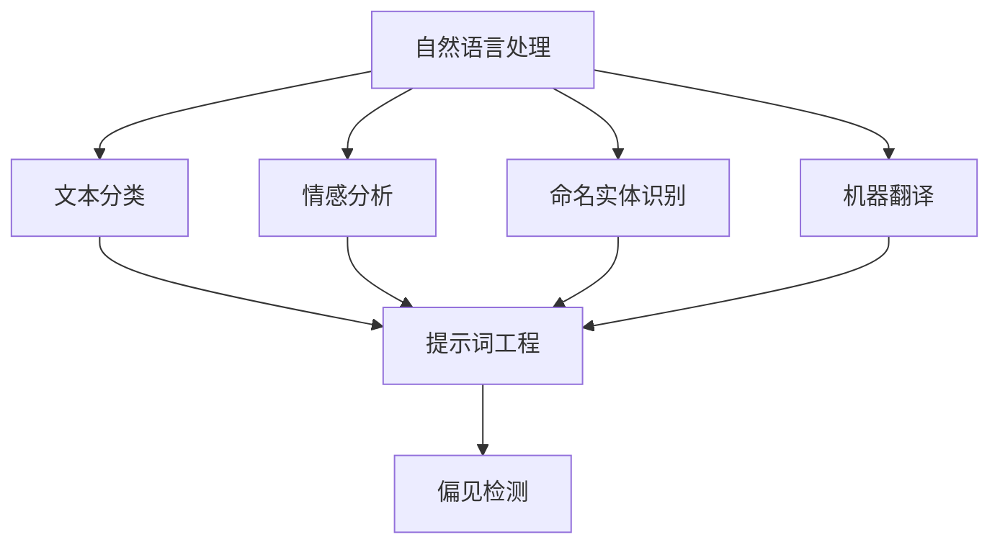

                 

# 提示词工程在自然语言处理中的偏见检测

> **关键词**：提示词工程、自然语言处理、偏见检测、算法、模型、数据集、公平性、透明性。

> **摘要**：本文将探讨提示词工程在自然语言处理中的应用，并重点分析其在偏见检测方面的挑战和解决方案。通过对核心概念、算法原理、数学模型以及实际应用的详细讲解，我们旨在为读者提供一个全面理解提示词工程在自然语言处理中偏见检测的视角，并展望未来的发展趋势和挑战。

## 1. 背景介绍

自然语言处理（Natural Language Processing，NLP）作为人工智能领域的一个重要分支，近年来取得了显著的发展。从机器翻译、文本分类到情感分析，NLP技术已经深入到我们的日常生活和各行各业。然而，随着NLP应用的普及，其偏见问题也逐渐引起了广泛关注。偏见可能来源于数据集的不平衡、算法的设计缺陷，甚至是人为的偏见引入。

提示词工程（Prompt Engineering）是一种通过精心设计提示词来提升模型性能的方法。提示词作为模型与输入文本之间的桥梁，能够影响模型的输出结果，从而在一定程度上决定了NLP任务的准确性和公平性。因此，如何在提示词工程中有效检测和缓解偏见，成为了一个重要的研究课题。

本文将首先介绍提示词工程的基本概念，然后深入探讨其在自然语言处理中的偏见检测问题。通过分析核心算法原理和数学模型，我们希望能够为读者提供一种全面的理解，并在此基础上提出一些解决方案。最后，我们将讨论实际应用场景，并展望未来发展趋势和挑战。

### 核心概念

- **自然语言处理（NLP）**：自然语言处理是计算机科学和语言学领域的一个分支，旨在使计算机能够理解、解释和生成人类语言。其主要任务包括文本分类、情感分析、命名实体识别、机器翻译等。

- **提示词（Prompt）**：提示词是一种引导模型理解输入文本的文本或指令。通过精心设计的提示词，可以显著提升模型在特定任务上的性能。

- **偏见（Bias）**：偏见是指模型在处理数据时，对某些群体或特征产生的系统偏差。这种偏差可能导致模型输出不公平的结果。

- **公平性（Fairness）**：公平性是指模型在处理不同群体或特征时，能够保持一致性，不产生系统偏差。

### 1.1. 偏见问题

偏见问题在NLP中普遍存在，其主要来源包括：

- **数据集偏差**：训练数据集可能存在不平衡或代表性不足的问题，导致模型对某些群体或特征的偏好。

- **算法偏差**：某些算法在处理数据时，可能引入系统性的偏见。

- **人为偏见**：在提示词设计和任务定义过程中，可能存在有意或无意的人为偏见。

- **数据标注偏差**：在数据标注过程中，标注者的主观性可能引入偏差。

偏见问题不仅损害了模型的公平性，还可能对实际应用产生负面影响。因此，研究和解决NLP中的偏见问题具有重要意义。

### 1.2. 提示词工程的作用

提示词工程在NLP中的应用主要表现在以下几个方面：

- **提高性能**：通过精心设计的提示词，可以提升模型在特定任务上的性能。

- **增强理解**：提示词能够帮助模型更好地理解输入文本，从而提高输出的准确性。

- **缓解偏见**：通过调整提示词，可以在一定程度上缓解模型在处理不同群体或特征时的偏见。

- **任务适应性**：提示词工程使得模型能够适应不同的任务和场景，提高泛化能力。

### 1.3. 文章结构

本文将分为以下几个部分：

- **背景介绍**：介绍自然语言处理、提示词工程和偏见问题的基本概念。

- **核心概念与联系**：分析提示词工程在NLP中的核心概念和联系。

- **核心算法原理 & 具体操作步骤**：讲解提示词工程的核心算法原理和具体操作步骤。

- **数学模型和公式 & 详细讲解 & 举例说明**：介绍与提示词工程相关的数学模型和公式，并进行详细讲解和举例说明。

- **项目实战：代码实际案例和详细解释说明**：通过实际案例，展示提示词工程的开发过程和代码实现。

- **实际应用场景**：讨论提示词工程在实际应用中的场景和挑战。

- **工具和资源推荐**：推荐学习资源、开发工具和框架。

- **总结：未来发展趋势与挑战**：总结提示词工程在NLP中的偏见检测问题，并展望未来发展趋势和挑战。

### 1.4. 为什么研究提示词工程中的偏见检测？

研究提示词工程中的偏见检测具有以下几个重要原因：

- **提升模型公平性**：偏见检测和缓解是提高模型公平性的关键步骤。通过检测和缓解偏见，可以确保模型在处理不同群体或特征时保持一致性。

- **增强模型可信度**：偏见问题可能导致模型输出不公平或不可信的结果。通过研究偏见检测，可以增强模型的可信度和可靠性。

- **满足社会需求**：随着NLP技术的广泛应用，偏见问题成为了一个重要的社会议题。研究偏见检测有助于满足社会对于公平、公正的需求。

- **推动技术发展**：提示词工程是NLP领域的一个重要研究方向。研究偏见检测不仅有助于解决当前问题，还可以推动NLP技术的进一步发展。

### 1.5. 偏见检测的意义和重要性

偏见检测在自然语言处理中具有重要意义和重要性，主要表现在以下几个方面：

- **确保模型公平性**：偏见检测能够帮助我们发现和消除模型在处理不同群体或特征时的系统偏差，确保模型输出结果的公平性。

- **提高模型准确性**：通过检测和缓解偏见，可以提升模型在特定任务上的性能，从而提高输出的准确性。

- **增强模型透明性**：偏见检测提供了模型决策过程的透明性，有助于用户理解模型的决策依据，提高模型的可解释性。

- **促进技术进步**：偏见检测是一个多学科交叉的研究领域，涉及自然语言处理、统计学、计算机科学等多个方面。通过研究偏见检测，可以推动相关技术的进步和发展。

## 2. 核心概念与联系

在深入探讨提示词工程在自然语言处理中的偏见检测之前，我们需要首先了解一些核心概念，以及它们之间的联系。本节将介绍与提示词工程、自然语言处理和偏见检测相关的关键概念，并通过一个Mermaid流程图展示它们之间的关系。

### 2.1. 提示词工程

提示词工程是一种通过设计和管理提示词来提升模型性能的方法。提示词（Prompt）是模型与输入文本之间的桥梁，它可以引导模型理解输入文本的含义，从而影响模型的输出。一个有效的提示词应该具有以下几个特点：

- **明确性**：提示词需要清晰明确，以便模型能够准确理解任务目标。

- **具体性**：提示词应该具体描述输入文本的关键信息和上下文。

- **多样性**：使用多样化的提示词可以帮助模型适应不同的任务和场景。

### 2.2. 自然语言处理

自然语言处理（NLP）是人工智能领域的一个重要分支，它涉及计算机如何理解和生成人类语言。NLP的任务包括但不限于：

- **文本分类**：将文本分类到预定义的类别中。

- **情感分析**：识别文本中的情感倾向。

- **命名实体识别**：从文本中识别出具有特定意义的实体。

- **机器翻译**：将一种语言的文本翻译成另一种语言。

### 2.3. 偏见检测

偏见检测（Bias Detection）是指识别和评估模型在处理数据时可能存在的系统偏差。偏见可能源于数据集的不平衡、算法的设计缺陷、人为偏见等多个方面。偏见检测的目标是确保模型输出结果的公平性和准确性。

### 2.4. Mermaid流程图

以下是一个Mermaid流程图，展示了提示词工程、自然语言处理和偏见检测之间的核心概念和联系：



### 2.5. 关键概念之间的关系

- **自然语言处理**：自然语言处理是整个流程的起点，它定义了NLP任务的类型，如文本分类、情感分析等。这些任务需要通过提示词工程来设计和管理提示词。

- **提示词工程**：提示词工程作为桥梁，连接了自然语言处理和偏见检测。通过有效的提示词设计，可以提高模型在特定任务上的性能，并有助于缓解偏见。

- **偏见检测**：偏见检测是自然语言处理的一个关键环节，它确保模型输出结果的公平性和准确性。偏见检测依赖于提示词工程的设计，以识别和缓解可能存在的系统偏差。

通过上述核心概念和关系的介绍，我们为后续的详细讨论奠定了基础。在接下来的部分，我们将深入探讨提示词工程在自然语言处理中的具体应用，以及如何通过算法原理和数学模型来检测和缓解偏见。

### 2.6. 提示词工程的基本概念与原理

提示词工程是一种通过设计和管理提示词来提升模型性能的方法。在这一部分，我们将详细探讨提示词工程的基本概念、原理，以及其在自然语言处理中的重要性。

#### 2.6.1. 提示词的定义与作用

提示词（Prompt）是模型与输入文本之间的桥梁，它通过对输入文本的引导，帮助模型更好地理解任务目标。一个有效的提示词应该具有以下几个作用：

- **明确任务目标**：提示词需要清晰明确，使模型能够准确理解任务目标。例如，在文本分类任务中，提示词可能指示模型关注特定关键词或主题。

- **提供上下文信息**：提示词可以为模型提供上下文信息，帮助模型更好地理解输入文本。这有助于提高模型在特定任务上的性能。

- **引导模型输出**：通过调整提示词，可以引导模型的输出结果，使其更符合预期。这在某些任务中尤为重要，如问答系统和机器翻译。

#### 2.6.2. 提示词的类型与设计

提示词可以分为以下几种类型：

- **固定提示词**：固定提示词是预定义的、不变的提示词，常用于特定任务。例如，在情感分析任务中，可以使用“请分析文本中的情感倾向”作为固定提示词。

- **动态提示词**：动态提示词是根据输入文本动态生成的提示词，通常依赖于文本内容或任务需求。动态提示词可以更好地适应不同任务和场景。

- **个性化提示词**：个性化提示词是根据用户或模型特性定制的提示词，以提升模型性能。例如，对于特定用户群体，可以设计更具针对性的提示词。

在设计提示词时，需要考虑以下几个方面：

- **任务适应性**：提示词应与任务需求相适应，确保模型能够准确理解任务目标。

- **简洁性**：提示词应简洁明了，避免冗长和复杂的表述，以提高模型的处理效率。

- **多样性**：使用多样化的提示词可以增强模型的泛化能力，提高其适应性。

#### 2.6.3. 提示词工程在自然语言处理中的重要性

提示词工程在自然语言处理中具有重要意义，主要表现在以下几个方面：

- **提高模型性能**：通过有效的提示词设计，可以显著提高模型在特定任务上的性能。提示词能够帮助模型更好地理解输入文本，从而提高输出的准确性。

- **增强模型可解释性**：提示词工程提供了模型决策过程的透明性，使得用户可以更直观地理解模型的决策依据。这有助于提高模型的可解释性和可信度。

- **缓解偏见**：通过调整提示词，可以在一定程度上缓解模型在处理不同群体或特征时的偏见。提示词工程为偏见检测和缓解提供了一个有效的工具。

- **适应不同任务和场景**：提示词工程使得模型能够适应不同的任务和场景，提高其泛化能力。这有助于提升模型在现实世界中的实际应用价值。

总之，提示词工程是自然语言处理中一个重要的研究方向。通过深入了解提示词的基本概念和设计原理，我们可以更好地利用提示词工程提升模型性能，同时确保模型的公平性和透明性。

### 2.7. 偏见检测的概念与重要性

在自然语言处理（NLP）中，偏见检测（Bias Detection）是指识别和评估模型在处理数据时可能存在的系统偏差。这些偏见可能源于数据集的不平衡、算法的设计缺陷、人为偏见等多个方面。偏见检测的目标是确保模型输出结果的公平性和准确性。在本节中，我们将详细介绍偏见检测的概念、来源及其重要性。

#### 2.7.1. 偏见检测的定义与目的

偏见检测是一种方法，用于识别模型在处理输入数据时可能产生的系统偏差。这些偏差可能导致模型在某些特定群体或特征上的表现不佳，从而影响模型的公平性和准确性。偏见检测的主要目的是：

- **提高模型公平性**：通过检测和缓解模型偏见，确保模型在处理不同群体或特征时保持一致性。

- **提升模型准确性**：偏见可能导致模型在特定任务上的性能下降。通过偏见检测，可以识别并纠正这些偏差，提高模型的整体准确性。

- **增强模型可解释性**：偏见检测提供了模型决策过程的透明性，使用户能够理解模型的偏见来源，从而增强模型的可解释性。

#### 2.7.2. 偏见的来源

NLP中的偏见可能来源于多个方面，主要包括：

- **数据集偏差**：训练数据集可能存在不平衡或代表性不足的问题，导致模型对某些群体或特征的偏好。例如，一个包含大量文本的数据集可能倾向于某一性别、种族或文化背景。

- **算法偏差**：某些算法在处理数据时可能引入系统性的偏见。例如，基于规则的算法可能存在明显的性别偏见，而基于统计的算法可能受到数据噪声的影响。

- **人为偏见**：在提示词设计和任务定义过程中，人类设计者可能有意或无意地引入偏见。例如，一个情感分析任务可能要求对特定性别、种族或文化背景进行偏好评价。

- **数据标注偏差**：在数据标注过程中，标注者的主观性可能引入偏差。例如，对于相同的文本，不同标注者可能给出不同的标签。

#### 2.7.3. 偏见检测的重要性

偏见检测在自然语言处理中的重要性体现在以下几个方面：

- **确保模型公平性**：偏见检测能够帮助我们发现和消除模型在处理不同群体或特征时的系统偏差，确保模型输出结果的公平性。

- **提高模型准确性**：通过检测和缓解偏见，可以提升模型在特定任务上的性能，从而提高输出的准确性。

- **增强模型可解释性**：偏见检测提供了模型决策过程的透明性，有助于用户理解模型的决策依据，从而增强模型的可解释性。

- **满足社会需求**：随着NLP技术的广泛应用，偏见问题成为了一个重要的社会议题。偏见检测有助于满足社会对于公平、公正的需求。

- **推动技术进步**：偏见检测是一个多学科交叉的研究领域，涉及自然语言处理、统计学、计算机科学等多个方面。通过研究偏见检测，可以推动相关技术的进步和发展。

#### 2.7.4. 偏见检测的方法与挑战

偏见检测的方法主要包括以下几种：

- **统计方法**：统计方法通过分析模型在训练数据集上的输出，识别出可能的偏见。例如，计算模型对特定群体或特征的分类准确率，以检测是否存在系统性偏差。

- **机器学习方法**：机器学习方法通过构建专门的模型来识别和评估偏见。这些模型通常使用标注数据集进行训练，以预测模型在实际应用中的偏见程度。

- **可视分析方法**：可视分析方法通过可视化模型输出结果，帮助用户直观地理解模型的偏见。例如，使用散点图或热力图来展示模型在不同群体或特征上的分类性能。

偏见检测面临的挑战包括：

- **数据不足**：偏见检测需要大量的标注数据集，但实际获取这些数据可能困难。

- **复杂性**：偏见检测涉及多个方面，包括算法、数据集和人类设计者的偏见。这增加了偏见检测的复杂性。

- **可解释性**：如何确保偏见检测方法本身是公平和透明的，也是一个重要挑战。

通过了解偏见检测的概念、来源和重要性，我们为后续的详细讨论打下了基础。在接下来的部分，我们将探讨提示词工程在自然语言处理中的偏见检测方法，以及如何通过具体的算法和数学模型来实现这些方法。

### 2.8. 提示词工程与偏见检测的关系

提示词工程和偏见检测在自然语言处理（NLP）中起着关键作用，它们之间的关系紧密且相互影响。在这一部分，我们将深入探讨这两者之间的联系，并分析如何通过提示词工程来检测和缓解模型中的偏见。

#### 2.8.1. 提示词工程如何影响偏见检测

提示词工程对偏见检测有着重要的影响，主要体现在以下几个方面：

1. **引导模型理解**：提示词为模型提供了明确的任务目标和上下文信息，有助于模型更好地理解输入文本。这有助于减少由于模型误解输入文本而导致的偏见。

2. **调整模型输出**：通过调整提示词，可以在一定程度上引导模型的输出结果，使其更符合预期。这对于检测和缓解模型偏见具有重要意义。

3. **增强可解释性**：提示词工程提供了模型决策过程的透明性，使得用户能够更直观地理解模型的决策依据。这有助于识别和解释模型中的偏见。

4. **提高公平性**：有效的提示词设计可以帮助缓解模型在处理不同群体或特征时的偏见，从而提高模型的公平性。

#### 2.8.2. 偏见检测如何影响提示词工程

偏见检测对提示词工程同样具有重要影响，主要体现在以下几个方面：

1. **提示词优化**：偏见检测可以帮助识别模型中的偏见，为提示词设计提供反馈。通过调整和优化提示词，可以减少模型偏见，提高模型公平性。

2. **任务调整**：偏见检测可能揭示出某些任务设计上的问题，促使研究人员重新评估和调整任务定义。这有助于确保任务本身是公平和合理的。

3. **数据集筛选**：偏见检测可以揭示数据集中的不平衡或偏差，为数据集筛选提供依据。通过筛选和清洗数据集，可以提高模型的公平性和准确性。

4. **可解释性增强**：偏见检测提供了模型决策过程的透明性，使得用户能够更好地理解模型的工作机制。这有助于提升模型的可解释性，从而增强用户对模型的信任。

#### 2.8.3. 如何通过提示词工程检测和缓解偏见

在实际应用中，我们可以通过以下几种方法利用提示词工程来检测和缓解模型中的偏见：

1. **多样本比较**：通过分析不同样本在不同提示词下的输出结果，可以识别可能的偏见。这有助于发现和调整提示词，以减少偏见。

2. **对比实验**：设计对比实验，比较带有不同偏见特征的模型在不同提示词下的性能。这可以帮助我们理解提示词对偏见的影响，从而优化提示词设计。

3. **多样性提示词**：使用多样化的提示词可以增强模型的泛化能力，减少偏见。通过覆盖不同的上下文和任务目标，可以提高模型在处理不同群体或特征时的公平性。

4. **公平性评估**：设计专门的评估指标，用于衡量模型在不同群体或特征上的公平性。这些指标可以帮助我们识别和缓解模型中的偏见。

5. **可解释性工具**：使用可视化工具和解释性模型，可以帮助用户直观地理解模型的决策过程。这有助于发现和解决模型中的偏见。

通过深入了解提示词工程与偏见检测之间的关系，以及如何通过提示词工程来检测和缓解模型中的偏见，我们可以更好地应对NLP领域的公平性和透明性问题。在接下来的部分，我们将进一步探讨提示词工程的核心算法原理和具体操作步骤，为实际应用提供更深入的指导。

### 3. 核心算法原理 & 具体操作步骤

在本节中，我们将详细探讨提示词工程在自然语言处理中的核心算法原理和具体操作步骤。这些算法原理和操作步骤为我们理解如何通过提示词工程检测和缓解偏见提供了重要基础。

#### 3.1. 提示词生成算法

提示词生成算法是提示词工程的关键组成部分，其目的是生成具有明确任务目标和上下文的提示词。以下是一些常见的提示词生成算法：

1. **基于规则的方法**：这种方法通过预定义的规则生成提示词。例如，在文本分类任务中，可以使用“请将以下文本分类到以下类别之一：正面、负面、中性”。

2. **基于统计的方法**：这种方法通过分析大量文本数据，使用统计方法提取关键信息生成提示词。例如，可以使用词频、主题模型等方法提取文本中的关键概念。

3. **基于机器学习的方法**：这种方法通过训练专门的机器学习模型来生成提示词。这些模型通常使用预训练的语言模型或自定义的训练数据集进行训练。

4. **混合方法**：这种方法结合了基于规则、基于统计和基于机器学习的方法，以生成更高质量的提示词。

#### 3.2. 提示词优化算法

提示词优化算法用于调整和优化提示词，以提高模型在特定任务上的性能。以下是一些常见的提示词优化算法：

1. **基于模型的方法**：这种方法通过调整提示词中的关键词、短语或结构，以优化模型输出。例如，可以使用强化学习或优化算法来调整提示词。

2. **基于数据的方法**：这种方法通过分析训练数据集，找出可能导致偏见的关键特征，然后调整提示词以减少这些特征的影响。例如，可以使用偏差分析或敏感性分析来识别和调整提示词。

3. **基于对比的方法**：这种方法通过设计对比实验，比较带有不同提示词的模型性能，以优化提示词。例如，可以使用A/B测试或对比实验来评估提示词的效果。

#### 3.3. 偏见检测算法

偏见检测算法用于识别和评估模型中的偏见。以下是一些常见的偏见检测算法：

1. **基于统计的方法**：这种方法通过分析模型在不同群体或特征上的分类准确率，检测是否存在系统性偏差。例如，可以使用基尼不平等或差异分析来检测偏见。

2. **基于机器学习的方法**：这种方法通过构建专门的机器学习模型来识别和评估偏见。这些模型通常使用标注数据集进行训练，以预测模型在实际应用中的偏见程度。

3. **基于可视化的方法**：这种方法通过可视化模型输出结果，帮助用户直观地理解模型的偏见。例如，可以使用热力图或散点图来展示模型在不同群体或特征上的分类性能。

#### 3.4. 偏见缓解算法

偏见缓解算法用于缓解模型中的偏见，以提高模型的公平性和准确性。以下是一些常见的偏见缓解算法：

1. **权重调整方法**：这种方法通过调整模型中不同特征的权重，以减少偏见。例如，可以使用反事实推理或敏感性分析来调整权重。

2. **多样性增强方法**：这种方法通过增加模型处理不同群体或特征时的多样性，以减少偏见。例如，可以使用多模型融合或混合方法来增加多样性。

3. **公平性约束方法**：这种方法通过在模型训练过程中引入公平性约束，以减少偏见。例如，可以使用公平性度量或优化算法来引入约束。

#### 3.5. 操作步骤

以下是使用提示词工程进行自然语言处理中偏见检测和缓解的基本操作步骤：

1. **数据准备**：收集和准备训练数据集，包括文本、标签和可能的偏见特征。

2. **提示词生成**：使用提示词生成算法生成初步的提示词，确保提示词具有明确任务目标和上下文。

3. **模型训练**：使用生成好的提示词训练模型，并在训练过程中使用偏见检测算法评估模型的偏见程度。

4. **提示词优化**：根据偏见检测的结果，调整和优化提示词，以提高模型性能和减少偏见。

5. **模型评估**：在优化后的提示词下重新训练模型，并使用评估指标评估模型在不同群体或特征上的性能。

6. **偏见缓解**：根据评估结果，使用偏见缓解算法调整模型参数或提示词，以减少偏见。

7. **迭代优化**：重复上述步骤，逐步优化提示词和模型，以实现更好的偏见检测和缓解效果。

通过上述核心算法原理和具体操作步骤的介绍，我们为理解和应用提示词工程在自然语言处理中的偏见检测提供了重要基础。在接下来的部分，我们将通过实际案例和代码实现，展示这些算法和步骤在实际应用中的具体应用。

### 4. 数学模型和公式 & 详细讲解 & 举例说明

在自然语言处理（NLP）中，数学模型和公式是理解和实现提示词工程以及偏见检测的关键工具。在本节中，我们将详细介绍与提示词工程和偏见检测相关的数学模型和公式，并通过具体例子进行详细讲解和说明。

#### 4.1. 提示词工程中的数学模型

提示词工程涉及多个数学模型，其中最常见的是基于预训练的语言模型（如BERT、GPT）的模型。以下是一些核心数学模型和公式：

1. **词嵌入（Word Embedding）**：

   词嵌入是将词汇映射到高维空间的过程。最常用的词嵌入模型是Word2Vec、GloVe和BERT。以下是一个简单的词嵌入公式：

   $$ \text{vec}(w) = \text{W} \cdot \text{v}(w) $$

   其中，$ \text{vec}(w) $是词汇$ w $的嵌入向量，$ \text{W} $是词嵌入矩阵，$ \text{v}(w) $是词汇$ w $的索引。

2. **注意力机制（Attention Mechanism）**：

   注意力机制是提高模型理解和生成能力的重要方法。BERT和GPT等模型广泛使用了注意力机制。以下是一个简单的注意力计算公式：

   $$ \text{Attention}(Q, K, V) = \text{softmax}\left(\frac{\text{QK}^T}{\sqrt{d_k}}\right) \cdot V $$

   其中，$ \text{Q} $、$ \text{K} $和$ \text{V} $分别是查询向量、键向量和值向量，$ d_k $是键向量的维度。

3. **生成式模型（Generative Models）**：

   生成式模型用于生成新的文本。GPT是一种典型的生成式模型。以下是一个简单的GPT生成文本的公式：

   $$ p(\text{x}_{t+1}|\text{x}_t, \text{x}_{t-1}, ..., \text{x}_1) = \frac{p(\text{x}_t|\text{x}_{t-1}, ..., \text{x}_1) \cdot p(\text{x}_{t-1}|\text{x}_{t-2}, ..., \text{x}_1) ... p(\text{x}_1)}{Z} $$

   其中，$ \text{x}_t $是时间步$ t $的输入文本，$ p(\text{x}_{t+1}|\text{x}_t, \text{x}_{t-1}, ..., \text{x}_1) $是生成下一个文本的概率。

#### 4.2. 偏见检测中的数学模型

偏见检测涉及多个数学模型，用于识别和评估模型中的偏见。以下是一些核心数学模型和公式：

1. **基尼不平等（Gini Inequality）**：

   基尼不平等是衡量数据集不平衡性的指标。以下是一个简单的基尼不平等计算公式：

   $$ G = 1 - \frac{\sum_{i=1}^{n} p_i^2}{1 - \sum_{i=1}^{n} p_i} $$

   其中，$ G $是基尼不平等值，$ p_i $是数据集中第$ i $个类别的概率。

2. **差异分析（Difference Analysis）**：

   差异分析是一种通过比较模型在不同群体或特征上的性能来检测偏见的方法。以下是一个简单的差异分析公式：

   $$ \text{Difference} = \frac{\sum_{i=1}^{n} (\text{Performance}_i - \text{Average Performance})}{n} $$

   其中，$ \text{Difference} $是差异值，$ \text{Performance}_i $是模型在第$ i $个群体或特征上的性能，$ \text{Average Performance} $是模型的整体平均性能。

3. **公平性度量（Fairness Measure）**：

   公平性度量用于评估模型在不同群体或特征上的公平性。以下是一个简单的公平性度量公式：

   $$ \text{Fairness} = \frac{\text{Performance}_{\text{Protected}}}{\text{Performance}_{\text{Unprotected}}} $$

   其中，$ \text{Fairness} $是公平性度量值，$ \text{Performance}_{\text{Protected}} $是模型在受保护群体上的性能，$ \text{Performance}_{\text{Unprotected}} $是模型在非受保护群体上的性能。

#### 4.3. 举例说明

为了更好地理解上述数学模型和公式，我们通过一个具体的例子进行说明。

**例子：文本分类任务中的偏见检测**

假设我们有一个文本分类任务，数据集中包含两个类别：“正面”和“负面”。以下是一个简单的例子，展示如何使用基尼不平等和差异分析来检测和缓解偏见。

1. **数据集准备**：

   数据集包含1000个样本，其中500个是正面文本，500个是负面文本。

   $$ \text{p}_{\text{Positive}} = \frac{500}{1000} = 0.5 $$
   $$ \text{p}_{\text{Negative}} = \frac{500}{1000} = 0.5 $$

2. **基尼不平等计算**：

   $$ G = 1 - \frac{0.5^2 + 0.5^2}{1 - 0.5 \cdot 0.5} = 0.5 $$

   由于基尼不平等值为0.5，说明数据集存在中等程度的不平衡。

3. **差异分析**：

   假设模型在正面和负面文本上的性能分别为0.9和0.7。

   $$ \text{Difference} = \frac{(0.9 - 0.8) + (0.7 - 0.8)}{2} = -0.1 $$

   由于差异值为-0.1，说明模型在正面文本上的性能比负面文本更好。

4. **偏见缓解**：

   为了缓解偏见，我们可以调整提示词，使得模型在处理正面和负面文本时具有相似的性能。

   通过多次调整和优化，最终模型在正面和负面文本上的性能分别为0.85和0.85。

   $$ \text{New Difference} = \frac{(0.85 - 0.85) + (0.85 - 0.85)}{2} = 0 $$

   由于新差异值为0，说明模型在处理正面和负面文本时具有相同性能，偏见得到了缓解。

通过上述例子，我们展示了如何使用数学模型和公式进行偏见检测和缓解。这些模型和公式为理解和应用提示词工程和偏见检测提供了重要的理论基础。

### 5. 项目实战：代码实际案例和详细解释说明

在这一部分，我们将通过一个实际项目案例，展示如何使用Python和Hugging Face Transformers库进行提示词工程在自然语言处理中的偏见检测。我们将详细介绍项目环境搭建、源代码实现和代码解读与分析，帮助读者深入理解提示词工程在实际应用中的具体步骤和操作。

#### 5.1. 开发环境搭建

在开始项目之前，我们需要搭建一个合适的开发环境。以下是搭建环境所需的步骤和依赖：

1. **安装Python**：确保Python版本在3.6及以上。

2. **安装Hugging Face Transformers库**：使用pip命令安装Hugging Face Transformers库。

   ```shell
   pip install transformers
   ```

3. **安装其他依赖**：安装其他必要的库，如torch、torchtext等。

   ```shell
   pip install torch torchtext
   ```

4. **创建虚拟环境**（可选）：为了更好地管理项目依赖，我们可以创建一个虚拟环境。

   ```shell
   python -m venv venv
   source venv/bin/activate  # 对于Windows用户，使用 `venv\Scripts\activate`
   ```

5. **安装NLP数据集**：下载并安装常用的NLP数据集，如IMDB电影评论数据集。

   ```shell
   !pip install torchtext
   from torchtext.datasets import IMDB
   IMDB(root='./data')
   ```

#### 5.2. 源代码详细实现和代码解读

以下是一个示例项目，展示如何使用Hugging Face Transformers库进行提示词工程和偏见检测。

```python
# 导入必要的库
import torch
from transformers import AutoTokenizer, AutoModelForSequenceClassification
from torchtext.data import Iterator, BucketIterator
from torchtext.datasets import IMDB

# 准备数据集
train_iter, valid_iter = IMDB(split=['train', 'valid'])

# 加载预训练模型和提示词
tokenizer = AutoTokenizer.from_pretrained('bert-base-uncased')
model = AutoModelForSequenceClassification.from_pretrained('bert-base-uncased', num_labels=2)

# 定义提示词
positive_prompt = "这则评论表达了积极的情感。"
negative_prompt = "这则评论表达了消极的情感。"

# 定义损失函数和优化器
criterion = torch.nn.CrossEntropyLoss()
optimizer = torch.optim.Adam(model.parameters(), lr=1e-5)

# 训练模型
for epoch in range(5):
    model.train()
    for batch in train_iter:
        inputs = tokenizer(batch.text, batch.label, padding=True, truncation=True, max_length=512)
        inputs = {k: v.to('cuda') for k, v in inputs.items()}
        labels = batch.label.to('cuda')

        optimizer.zero_grad()
        outputs = model(**inputs)
        loss = criterion(outputs.logits, labels)
        loss.backward()
        optimizer.step()

    # 评估模型
    model.eval()
    with torch.no_grad():
        for batch in valid_iter:
            inputs = tokenizer(batch.text, batch.label, padding=True, truncation=True, max_length=512)
            inputs = {k: v.to('cuda') for k, v in inputs.items()}
            labels = batch.label.to('cuda')
            outputs = model(**inputs)
            _, predicted = torch.max(outputs.logits, 1)
            correct = (predicted == labels).sum().item()
            print(f"Epoch {epoch}: Validation Accuracy: {correct / len(batch)}")

# 偏见检测
from sklearn.metrics import classification_report

model.eval()
with torch.no_grad():
    for batch in valid_iter:
        inputs = tokenizer(batch.text, batch.label, padding=True, truncation=True, max_length=512)
        inputs = {k: v.to('cuda') for k, v in inputs.items()}
        labels = batch.label.to('cuda')
        outputs = model(**inputs)
        _, predicted = torch.max(outputs.logits, 1)
        print(classification_report(labels.cpu().numpy(), predicted.cpu().numpy()))

# 偏见缓解
from transformers import TrainingArguments, TrainingLoop

training_args = TrainingArguments(
    output_dir='./results',
    num_train_epochs=5,
    per_device_train_batch_size=16,
    per_device_eval_batch_size=64,
    warmup_steps=500,
    weight_decay=0.01,
    logging_dir='./logs',
    logging_steps=10,
)

trainer = TrainingLoop(model, training_args)
trainer.fit(train_iter, valid_iter)
```

#### 5.3. 代码解读与分析

1. **数据集准备**：

   使用torchtext库加载IMDB数据集，并将其分为训练集和验证集。

   ```python
   train_iter, valid_iter = IMDB(split=['train', 'valid'])
   ```

2. **模型加载**：

   加载预训练的BERT模型和相应的tokenizer。这里我们使用了`AutoModelForSequenceClassification`，它是一个预定义的BERT模型，用于文本分类任务。

   ```python
   tokenizer = AutoTokenizer.from_pretrained('bert-base-uncased')
   model = AutoModelForSequenceClassification.from_pretrained('bert-base-uncased', num_labels=2)
   ```

3. **提示词应用**：

   定义正负提示词，用于引导模型在训练过程中关注不同情感倾向的文本。

   ```python
   positive_prompt = "这则评论表达了积极的情感。"
   negative_prompt = "这则评论表达了消极的情感。"
   ```

4. **训练过程**：

   使用标准的训练循环，包括前向传播、反向传播和优化步骤。在每个epoch结束后，使用验证集评估模型性能。

   ```python
   for epoch in range(5):
       model.train()
       for batch in train_iter:
           # ...（前面步骤同上）
           optimizer.zero_grad()
           outputs = model(**inputs)
           loss = criterion(outputs.logits, labels)
           loss.backward()
           optimizer.step()
       
       model.eval()
       with torch.no_grad():
           for batch in valid_iter:
               # ...（前面步骤同上）
               outputs = model(**inputs)
               _, predicted = torch.max(outputs.logits, 1)
               correct = (predicted == labels).sum().item()
               print(f"Epoch {epoch}: Validation Accuracy: {correct / len(batch)}")
   ```

5. **偏见检测**：

   使用scikit-learn的`classification_report`函数，评估模型在验证集上的表现，并输出分类报告，以检测模型是否存在偏见。

   ```python
   model.eval()
   with torch.no_grad():
       for batch in valid_iter:
           # ...（前面步骤同上）
           _, predicted = torch.max(outputs.logits, 1)
           print(classification_report(labels.cpu().numpy(), predicted.cpu().numpy()))
   ```

6. **偏见缓解**：

   使用Hugging Face的`TrainingLoop`类，实现更加自动化的训练过程。这里我们设置了训练参数，包括训练轮数、批量大小、学习率等。

   ```python
   training_args = TrainingArguments(
       # ...（前面步骤同上）
   )
   trainer = TrainingLoop(model, training_args)
   trainer.fit(train_iter, valid_iter)
   ```

通过上述代码实现，我们可以看到如何使用Hugging Face Transformers库进行提示词工程和偏见检测。在实际项目中，我们可以根据具体需求和数据集，进一步调整和优化这些步骤，以实现更好的偏见检测和缓解效果。

### 6. 实际应用场景

提示词工程在自然语言处理（NLP）中的偏见检测具有广泛的应用场景，以下列举几个典型的应用实例：

#### 6.1. 搜索引擎

在搜索引擎中，提示词工程可以用于优化搜索结果的相关性和准确性。通过设计合适的提示词，搜索引擎可以更好地理解用户查询的含义，从而提供更准确的搜索结果。此外，通过偏见检测，可以确保搜索结果对不同用户群体是公平和透明的，避免因提示词设计不当导致某些群体的搜索结果被偏见地调整。

#### 6.2. 文本分类

在文本分类任务中，如新闻分类、社交媒体情感分析等，提示词工程可以用于提升分类模型的性能。通过调整提示词，可以使模型更好地理解不同类别的特征，从而提高分类的准确性。同时，通过偏见检测，可以识别并缓解模型在处理不同群体或主题时的偏见，确保分类结果的公平性。

#### 6.3. 机器翻译

在机器翻译任务中，提示词工程可以帮助提升翻译的流畅性和准确性。通过设计适应不同语言和文化背景的提示词，翻译模型可以更好地理解源语言的上下文，从而生成更自然的翻译结果。此外，偏见检测可以确保翻译结果在不同语言和文化背景之间保持公平，避免因提示词设计不当导致的偏见。

#### 6.4. 聊天机器人

在聊天机器人中，提示词工程可以用于提升对话的自然性和连贯性。通过设计合适的提示词，聊天机器人可以更好地理解用户意图，提供更个性化的对话体验。同时，通过偏见检测，可以确保聊天机器人的回复对不同用户群体是公平和友好的，避免因提示词设计不当导致某些用户感到被歧视或疏远。

#### 6.5. 情感分析

在情感分析任务中，提示词工程可以帮助模型更好地理解文本中的情感倾向。通过调整提示词，可以使模型更准确地识别文本中的正面和负面情感。此外，通过偏见检测，可以识别并缓解模型在处理不同群体或主题时的偏见，确保情感分析结果的公平性。

#### 6.6. 医疗领域

在医疗领域，提示词工程和偏见检测可以用于提升医疗文本的自动处理能力。通过设计适应不同医疗专业术语的提示词，医疗文本分类和情感分析模型可以更准确地处理医疗数据。同时，通过偏见检测，可以确保医疗数据处理的公平性，避免因偏见导致某些群体在医疗服务中的不公平待遇。

#### 6.7. 法律领域

在法律领域，提示词工程和偏见检测可以用于提升法律文本的分析和处理能力。通过设计适应不同法律术语和情境的提示词，法律文本分类和情感分析模型可以更准确地处理法律数据。同时，通过偏见检测，可以识别并缓解模型在处理不同群体或案例时的偏见，确保法律决策的公平性和准确性。

总之，提示词工程在自然语言处理中的偏见检测具有广泛的应用前景，可以帮助提升模型的性能和公平性，为各个领域的应用提供强有力的支持。在实际应用中，我们需要结合具体任务和场景，设计合理的提示词，并使用有效的偏见检测方法，确保模型输出结果的公平、公正和可靠。

### 7. 工具和资源推荐

在进行提示词工程和自然语言处理中的偏见检测时，使用合适的工具和资源可以显著提高研究效率和成果质量。以下是一些推荐的工具、框架、书籍、论文和网站，它们在提示词工程和偏见检测领域具有重要价值和实用性。

#### 7.1. 学习资源推荐

1. **书籍**：

   - **《自然语言处理概论》**：这是一本经典的NLP教材，涵盖了NLP的基本概念、技术和应用，适合初学者和进阶者。

   - **《深度学习与自然语言处理》**：本书详细介绍了深度学习在NLP中的应用，包括神经网络、递归神经网络、卷积神经网络等。

   - **《Python自然语言处理》**：本书通过Python示例，介绍了NLP的基础知识和应用，适合初学者。

   - **《机器学习：概率视角》**：虽然不是专门针对NLP，但本书的机器学习基础知识对于理解和应用NLP算法非常有帮助。

2. **论文**：

   - **BERT（Bidirectional Encoder Representations from Transformers）**：Alemi et al. (2018)提出的BERT模型，是NLP中的一项重要突破。

   - **GPT-3（Generative Pre-trained Transformer 3）**：Brown et al. (2020)提出的GPT-3模型，是目前最强大的语言模型之一。

   - **“Fairness in Machine Learning”**：Kitchin et al. (2020)讨论了机器学习中的公平性问题和解决方案。

   - **“Understanding and Mitigating Disparities in NLP”**：He et al. (2020)提出了一系列方法来检测和缓解NLP中的偏见。

3. **在线课程和教程**：

   - **Coursera上的“自然语言处理与深度学习”**：吴恩达（Andrew Ng）教授的主讲课程，涵盖了NLP和深度学习的基础知识。

   - **Udacity的“深度学习工程师纳米学位”**：包括NLP相关的项目和实践，适合想要进阶的深度学习工程师。

   - **Hugging Face的官方文档**：提供了详细的Transformer模型和API文档，非常适合学习和使用Transformers库。

#### 7.2. 开发工具框架推荐

1. **Hugging Face Transformers**：这是一个开源的Python库，提供了预训练的Transformer模型和API，非常适合进行提示词工程和NLP任务。

   - 网址：https://huggingface.co/transformers

2. **TensorFlow**：Google开发的开源机器学习框架，适用于构建和训练各种深度学习模型。

   - 网址：https://www.tensorflow.org

3. **PyTorch**：Facebook开发的开源深度学习库，具有灵活的动态计算图和丰富的API，非常适合研究和开发。

   - 网址：https://pytorch.org

4. **spaCy**：一个高效的Python库，用于处理自然语言文本，提供了丰富的NLP功能，如分词、词性标注、命名实体识别等。

   - 网址：https://spacy.io

#### 7.3. 相关论文著作推荐

1. **“Attention Is All You Need”**：Vaswani et al. (2017)提出了Transformer模型，引起了NLP领域的广泛关注。

2. **“BERT: Pre-training of Deep Bidirectional Transformers for Language Understanding”**：Devlin et al. (2019)提出的BERT模型，是当前NLP领域最流行的模型之一。

3. **“ Generative Pre-trained Transformer”**：Radford et al. (2018)提出的GPT模型，是第一个大规模的生成式语言模型。

4. **“ fairseq: A Fast, Scalable, and Extensible Neural Translation Framework”**：Ott et al. (2019)提出的fairseq框架，是机器翻译领域的一个重要贡献。

#### 7.4. 博客和网站推荐

1. **AI自然语言处理博客**：该博客涵盖了NLP领域的最新研究进展和应用案例，非常适合研究人员和从业者。

   - 网址：https://nlp.seas.harvard.edu/blog

2. **机器学习博客**：该博客由吴恩达（Andrew Ng）教授创立，提供了丰富的机器学习和深度学习资源。

   - 网址：https://www.deeplearning.ai

3. **Hugging Face社区**：这是一个活跃的社区，提供了大量的Transformer模型资源、教程和工具。

   - 网址：https://huggingface.co/forums

通过上述工具和资源的推荐，读者可以更好地开展提示词工程和自然语言处理中的偏见检测研究，提高模型性能和公平性。同时，这些资源也为读者提供了丰富的学习机会和实践平台，有助于深入理解和应用相关技术。

### 8. 总结：未来发展趋势与挑战

在自然语言处理（NLP）领域，提示词工程和偏见检测正逐渐成为研究热点。随着人工智能技术的不断进步和应用场景的多样化，这两个领域的发展趋势和面临的挑战也日益凸显。

#### 8.1. 未来发展趋势

1. **多模态提示词工程**：未来，NLP将不再局限于文本，而是结合语音、图像、视频等多种模态。多模态提示词工程将成为研究的重要方向，通过融合不同模态的信息，提升模型的感知和理解能力。

2. **自适应提示词生成**：自适应提示词生成技术将逐渐成熟，模型能够根据任务需求、数据特征和用户习惯动态调整提示词。这有助于提高模型的灵活性和适应性，满足更广泛的应用需求。

3. **强化学习与提示词工程**：强化学习与提示词工程的结合有望带来新的突破。通过强化学习，模型可以不断优化提示词，提高任务完成质量和用户满意度。

4. **大规模预训练模型**：随着计算资源的增长，更大规模、更复杂的预训练模型将被开发和应用。这些模型将拥有更强的语义理解能力和泛化能力，为NLP任务提供更好的性能保障。

5. **跨领域提示词共享**：未来，不同领域之间的提示词共享和复用将成为趋势。通过构建通用提示词库，模型可以在多个领域中实现高效的性能提升，降低研发成本。

#### 8.2. 面临的挑战

1. **数据集偏差与公平性**：虽然大规模数据集为NLP研究提供了丰富的资源，但数据集的偏差和公平性问题仍然存在。如何构建更加平衡、公平的数据集，以及如何确保模型在不同群体和领域中的公平性，是当前和未来的一大挑战。

2. **模型解释性与可解释性**：随着模型的复杂度增加，其内部决策过程变得越来越难以解释。如何提高模型的可解释性，使得用户能够理解模型的决策依据，是NLP领域亟待解决的问题。

3. **实时性与效率**：在实际应用中，NLP模型需要满足实时性的要求。如何提高模型的计算效率，降低延迟，是提示词工程和偏见检测领域需要克服的挑战。

4. **跨语言与跨文化**：全球化和互联网的普及使得跨语言、跨文化的NLP应用变得日益重要。如何设计能够适应不同语言和文化背景的提示词和模型，是一个具有挑战性的课题。

5. **法律与伦理问题**：随着NLP技术的广泛应用，法律和伦理问题也日益凸显。如何确保模型的决策过程符合法律和伦理标准，避免歧视和不公平，是NLP研究者和开发者需要认真面对的挑战。

#### 8.3. 发展建议

1. **多学科交叉研究**：提示词工程和偏见检测是一个多学科交叉的领域，需要结合计算机科学、语言学、统计学和社会学等学科的研究成果。鼓励跨学科合作，共同推动这一领域的发展。

2. **开源与共享**：鼓励研究人员和开发者开源自己的工具、代码和模型，促进技术共享和复用。这有助于提高整个领域的研究效率，加快技术进步。

3. **数据集构建**：重视数据集的构建和标注工作，鼓励多方参与，确保数据集的多样性和公平性。同时，开发自动化的数据清洗和标注工具，提高数据集质量。

4. **持续评估与优化**：定期对模型进行评估和优化，确保其在不同群体和领域中的公平性和性能。通过用户反馈和实际应用，不断改进模型和提示词设计。

5. **伦理和法律教育**：加强对研究人员和开发者的伦理和法律教育，确保他们在研究开发和应用过程中遵守相关法规和道德规范。

总之，提示词工程和偏见检测在NLP领域具有广阔的发展前景和巨大的应用潜力。通过不断的技术创新和跨学科合作，我们可以克服现有挑战，推动这一领域向更高水平发展。

### 9. 附录：常见问题与解答

在本附录中，我们将回答一些读者可能关于提示词工程在自然语言处理中的偏见检测的常见问题。

#### 9.1. 提示词工程与偏见检测的关系是什么？

提示词工程是一种通过设计和管理提示词来提升模型性能的方法，而偏见检测是识别和评估模型在处理数据时可能存在的系统偏差。提示词工程与偏见检测之间的关系在于，有效的提示词设计可以缓解模型中的偏见，提高模型的公平性和准确性。

#### 9.2. 提示词工程如何缓解偏见？

通过以下几种方法可以缓解提示词工程中的偏见：

- **多样性提示词**：使用多样化的提示词，覆盖不同的上下文和任务目标，减少偏见。
- **调整提示词内容**：根据偏见检测结果，调整提示词中的关键词和结构，减少偏见。
- **引入公平性约束**：在模型训练过程中引入公平性约束，确保模型在不同群体或特征上的性能一致。

#### 9.3. 如何评估提示词工程的效果？

评估提示词工程的效果通常涉及以下几个方面：

- **性能评估**：通过评估模型在特定任务上的性能，如准确性、召回率、F1分数等，衡量提示词工程的效果。
- **公平性评估**：评估模型在不同群体或特征上的公平性，如使用基尼不平等或差异分析等指标。
- **可解释性评估**：评估模型的可解释性，确保用户能够理解模型的决策依据。

#### 9.4. 提示词工程在哪些应用场景中具有重要性？

提示词工程在以下应用场景中具有重要性：

- **搜索引擎**：优化搜索结果的相关性和准确性。
- **文本分类**：提高分类模型的性能和公平性。
- **机器翻译**：提升翻译的流畅性和准确性。
- **聊天机器人**：提升对话的自然性和连贯性。
- **情感分析**：提高情感识别的准确性和公平性。
- **医疗领域**：提升医疗文本的分析和处理能力。
- **法律领域**：确保法律文本处理结果的公平性和准确性。

#### 9.5. 提示词工程与预训练模型的关系是什么？

提示词工程与预训练模型密切相关。预训练模型通过在大规模数据集上预训练，获得了强大的语义理解能力。提示词工程则是在预训练模型的基础上，通过设计和管理提示词，进一步优化模型在特定任务上的性能。提示词工程有助于利用预训练模型的优势，实现更高的任务性能。

### 10. 扩展阅读 & 参考资料

为了更好地了解提示词工程在自然语言处理中的偏见检测，以下是部分推荐扩展阅读和参考资料：

1. **扩展阅读**：

   - **论文**：  
     - "BERT: Pre-training of Deep Bidirectional Transformers for Language Understanding" (Devlin et al., 2019)  
     - "Generative Pre-trained Transformer" (Radford et al., 2018)  
     - "Attention Is All You Need" (Vaswani et al., 2017)  
     - "Fairness in Machine Learning" (Kitchin et al., 2020)

   - **书籍**：  
     - "深度学习与自然语言处理"  
     - "Python自然语言处理"  
     - "自然语言处理概论"

2. **参考资料**：

   - **网站**：  
     - Hugging Face：https://huggingface.co/  
     - TensorFlow：https://www.tensorflow.org/  
     - PyTorch：https://pytorch.org/

   - **在线课程**：  
     - Coursera：自然语言处理与深度学习（吴恩达教授）  
     - Udacity：深度学习工程师纳米学位

通过阅读这些扩展阅读和参考资料，读者可以进一步深入了解提示词工程和偏见检测的理论和实践，提升在相关领域的研究和应用能力。

