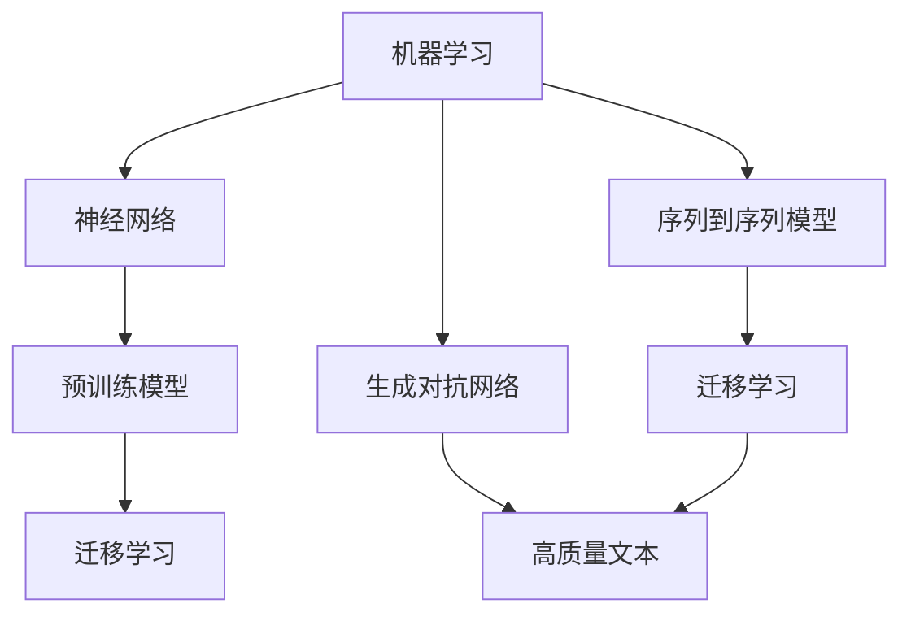

                 

# 提示词工程在自然语言生成中的应用

> 关键词：提示词工程，自然语言生成，机器学习，神经网络，语言模型，序列到序列模型，生成对抗网络，预训练模型，迁移学习

> 摘要：本文将深入探讨提示词工程在自然语言生成中的应用。通过介绍提示词工程的基本概念、核心算法原理、数学模型以及实际应用场景，我们旨在帮助读者全面了解和掌握这一技术。文章还将推荐一些优秀的工具和资源，以供进一步学习和实践。

## 1. 背景介绍

### 1.1 目的和范围

本文旨在探讨提示词工程在自然语言生成中的应用。随着人工智能技术的快速发展，自然语言生成已经成为一个热门的研究方向。提示词工程作为自然语言生成的一个重要分支，旨在通过优化输入提示词的质量和形式，提高生成文本的准确性和自然性。本文将介绍提示词工程的基本概念、核心算法原理、数学模型以及实际应用场景，帮助读者深入了解这一技术。

### 1.2 预期读者

本文主要面向对自然语言生成和机器学习有一定了解的读者。如果您对神经网络、序列到序列模型、生成对抗网络等概念有所了解，那么您将更容易理解本文的内容。同时，本文也适合对自然语言生成感兴趣的技术人员、研究人员和学者阅读。

### 1.3 文档结构概述

本文分为十个主要部分，结构如下：

1. 背景介绍：介绍本文的目的、预期读者、文档结构和相关术语。
2. 核心概念与联系：介绍与提示词工程相关的核心概念及其相互联系。
3. 核心算法原理 & 具体操作步骤：详细讲解提示词工程中的核心算法原理和具体操作步骤。
4. 数学模型和公式 & 详细讲解 & 举例说明：介绍提示词工程中的数学模型和公式，并进行详细讲解和举例说明。
5. 项目实战：代码实际案例和详细解释说明。
6. 实际应用场景：探讨提示词工程在不同领域的应用场景。
7. 工具和资源推荐：推荐学习资源、开发工具框架和经典论文。
8. 总结：未来发展趋势与挑战。
9. 附录：常见问题与解答。
10. 扩展阅读 & 参考资料：提供进一步学习和研究的资料。

### 1.4 术语表

#### 1.4.1 核心术语定义

- 提示词工程：通过优化输入提示词的质量和形式，提高生成文本的准确性和自然性的技术。
- 自然语言生成：利用计算机程序生成人类可读的自然语言文本。
- 机器学习：使计算机通过数据学习并做出决策的一种方法。
- 神经网络：一种由大量相互连接的神经元组成的计算模型。
- 序列到序列模型：用于将一个序列映射到另一个序列的神经网络模型。
- 生成对抗网络：由生成器和判别器组成的神经网络模型，用于生成与真实数据相似的数据。
- 预训练模型：在大规模语料库上进行预训练的神经网络模型。
- 迁移学习：利用预训练模型在特定任务上的知识，提高新任务的性能。

#### 1.4.2 相关概念解释

- 语义相似度：衡量两个文本在语义上的相似程度。
- 词汇嵌入：将词汇映射到高维向量空间。
- 零样本学习：在未见类别样本的情况下，对未知类别进行预测。

#### 1.4.3 缩略词列表

- NLP：自然语言处理（Natural Language Processing）
- ML：机器学习（Machine Learning）
- DNN：深度神经网络（Deep Neural Network）
- RNN：循环神经网络（Recurrent Neural Network）
- GAN：生成对抗网络（Generative Adversarial Network）
- BERT：双向编码器表示模型（Bidirectional Encoder Representations from Transformers）
- GPT：生成预训练模型（Generative Pre-trained Transformer）

## 2. 核心概念与联系

### 2.1 核心概念介绍

提示词工程在自然语言生成中扮演着关键角色。要理解提示词工程，我们首先需要了解以下核心概念：

1. **自然语言生成（NLG）**：自然语言生成是指利用计算机程序生成人类可读的自然语言文本。NLG可以分为两大类：文本到文本生成和语音合成。

2. **机器学习（ML）**：机器学习是一种使计算机通过数据学习并做出决策的方法。在自然语言生成中，机器学习算法被用于训练模型，使其能够根据输入提示词生成文本。

3. **神经网络（NN）**：神经网络是一种由大量相互连接的神经元组成的计算模型。在自然语言生成中，神经网络被用于构建语言模型，用于预测下一个单词或序列。

4. **序列到序列模型（Seq2Seq）**：序列到序列模型是一种用于将一个序列映射到另一个序列的神经网络模型。在自然语言生成中，Seq2Seq模型被用于将输入提示词映射到生成文本。

5. **生成对抗网络（GAN）**：生成对抗网络是由生成器和判别器组成的神经网络模型，用于生成与真实数据相似的数据。在自然语言生成中，GAN可以用于生成高质量的文本。

6. **预训练模型**：预训练模型是在大规模语料库上进行预训练的神经网络模型。在自然语言生成中，预训练模型可以用于迁移学习，提高新任务的性能。

7. **迁移学习**：迁移学习是利用预训练模型在特定任务上的知识，提高新任务的性能。在自然语言生成中，迁移学习可以帮助模型快速适应新的任务，提高生成文本的质量。

### 2.2 核心概念联系

提示词工程中的核心概念相互联系，共同构成了一个完整的自然语言生成系统。以下是这些概念之间的联系：

1. **机器学习（ML）** 与 **神经网络（NN）**：机器学习算法（如神经网络）被用于训练语言模型，使其能够根据输入提示词生成文本。

2. **序列到序列模型（Seq2Seq）**：序列到序列模型是一种特殊的神经网络模型，用于将输入提示词映射到生成文本。Seq2Seq模型在自然语言生成中扮演着核心角色。

3. **生成对抗网络（GAN）**：生成对抗网络可以用于生成高质量的文本，从而提高自然语言生成的质量。GAN由生成器和判别器组成，两者相互竞争，共同提高生成文本的质量。

4. **预训练模型**：预训练模型是在大规模语料库上进行预训练的神经网络模型。在自然语言生成中，预训练模型可以用于迁移学习，提高新任务的性能。

5. **迁移学习**：迁移学习可以帮助模型快速适应新的任务，提高生成文本的质量。在自然语言生成中，迁移学习是提高模型性能的有效手段。

### 2.3 Mermaid 流程图

为了更好地展示提示词工程中的核心概念及其相互联系，我们使用 Mermaid 流程图进行描述。



## 3. 核心算法原理 & 具体操作步骤

### 3.1 核心算法原理

提示词工程中的核心算法主要包括机器学习、神经网络、序列到序列模型和生成对抗网络。以下分别介绍这些算法的基本原理。

#### 3.1.1 机器学习

机器学习是一种使计算机通过数据学习并做出决策的方法。在提示词工程中，机器学习算法被用于训练语言模型，使其能够根据输入提示词生成文本。常见的机器学习算法包括神经网络、决策树、支持向量机等。

#### 3.1.2 神经网络

神经网络是一种由大量相互连接的神经元组成的计算模型。在自然语言生成中，神经网络被用于构建语言模型，用于预测下一个单词或序列。神经网络可以分为前馈神经网络和循环神经网络。

#### 3.1.3 序列到序列模型

序列到序列模型是一种用于将一个序列映射到另一个序列的神经网络模型。在自然语言生成中，Seq2Seq模型被用于将输入提示词映射到生成文本。Seq2Seq模型通常由编码器和解码器组成。

#### 3.1.4 生成对抗网络

生成对抗网络是由生成器和判别器组成的神经网络模型，用于生成与真实数据相似的数据。在自然语言生成中，GAN可以用于生成高质量的文本。生成器试图生成与真实文本相似的数据，而判别器则试图区分生成文本和真实文本。

### 3.2 具体操作步骤

以下是提示词工程的具体操作步骤：

#### 3.2.1 数据预处理

1. 收集大量文本数据，用于训练语言模型。
2. 对文本数据进行清洗和预处理，包括去除标点符号、停用词、大小写统一等。

#### 3.2.2 训练语言模型

1. 使用机器学习算法（如神经网络）训练语言模型。
2. 将预处理后的文本数据分为训练集和验证集，用于模型训练和评估。

#### 3.2.3 构建序列到序列模型

1. 使用序列到序列模型（如Seq2Seq模型）将输入提示词映射到生成文本。
2. 调整模型参数，优化生成文本的质量。

#### 3.2.4 使用生成对抗网络

1. 使用生成对抗网络（GAN）生成高质量的文本。
2. 优化生成器和判别器的参数，提高生成文本的质量。

#### 3.2.5 模型评估与优化

1. 使用评估指标（如损失函数、准确率等）评估模型性能。
2. 根据评估结果调整模型参数，优化模型性能。

### 3.3 伪代码

以下是一个简单的伪代码，用于描述提示词工程的基本操作步骤：

```python
# 数据预处理
def preprocess_data(text_data):
    # 清洗和预处理文本数据
    return cleaned_data

# 训练语言模型
def train_language_model(training_data, validation_data):
    # 使用机器学习算法训练语言模型
    return language_model

# 构建序列到序列模型
def build_seq2seq_model():
    # 使用序列到序列模型将输入提示词映射到生成文本
    return seq2seq_model

# 使用生成对抗网络
def use_gan():
    # 使用生成对抗网络生成高质量的文本
    return high_quality_text

# 模型评估与优化
def evaluate_and_optimize(model, evaluation_data):
    # 使用评估指标评估模型性能
    # 调整模型参数，优化模型性能
    return optimized_model
```

## 4. 数学模型和公式 & 详细讲解 & 举例说明

### 4.1 数学模型

在提示词工程中，常用的数学模型包括神经网络模型、序列到序列模型和生成对抗网络模型。以下分别介绍这些模型的数学模型和公式。

#### 4.1.1 神经网络模型

神经网络模型是一种基于数学函数的计算模型。神经网络模型中的每个神经元都是一个数学函数，多个神经元通过加权连接形成一个复杂的函数。

假设我们有一个简单的神经网络模型，包含一个输入层、一个隐藏层和一个输出层。输入层的每个神经元接收输入特征，隐藏层的神经元通过激活函数计算输出，输出层的神经元生成最终输出。

- 输入层：\( x_i = x_1, x_2, ..., x_n \)
- 隐藏层：\( z_j = \sum_{i=1}^{n} w_{ij} \cdot x_i + b_j \)
- 输出层：\( y_k = \sigma(z_k) \)

其中，\( x_i \) 是输入特征，\( w_{ij} \) 是输入层到隐藏层的权重，\( b_j \) 是隐藏层的偏置，\( z_j \) 是隐藏层的输出，\( \sigma \) 是激活函数（如 sigmoid 函数）。

#### 4.1.2 序列到序列模型

序列到序列模型是一种用于将一个序列映射到另一个序列的神经网络模型。在自然语言生成中，序列到序列模型通常由编码器和解码器组成。

- 编码器：将输入序列编码为固定长度的向量。
- 解码器：将编码后的向量解码为输出序列。

假设我们有一个简单的序列到序列模型，编码器和解码器都由多层神经网络组成。

- 编码器：\( x_t = e_t \)
- 解码器：\( y_t = d_t \)

其中，\( x_t \) 是输入序列的第 \( t \) 个元素，\( e_t \) 是编码器输出的第 \( t \) 个元素，\( d_t \) 是解码器输出的第 \( t \) 个元素。

#### 4.1.3 生成对抗网络模型

生成对抗网络是由生成器和判别器组成的神经网络模型。生成器试图生成与真实数据相似的数据，判别器则试图区分生成数据和真实数据。

- 生成器：\( G(z) \)
- 判别器：\( D(x) \)

其中，\( z \) 是生成器的输入噪声，\( x \) 是真实数据或生成数据。

### 4.2 详细讲解与举例说明

#### 4.2.1 神经网络模型

以下是一个简单的神经网络模型的详细讲解和举例说明：

假设我们有一个包含一个输入层、一个隐藏层和一个输出层的神经网络模型，用于对输入特征进行分类。

- 输入层：\( x_1 = 1, x_2 = 0 \)
- 隐藏层：\( z_1 = 2, z_2 = 3 \)
- 输出层：\( y_1 = 0.7, y_2 = 0.3 \)

使用 sigmoid 激活函数，我们有：

- \( \sigma(z_1) = 0.7 \)
- \( \sigma(z_2) = 0.3 \)

因此，输出层生成的标签为：

- \( y_1 = 0.7 \)
- \( y_2 = 0.3 \)

#### 4.2.2 序列到序列模型

以下是一个简单的序列到序列模型的详细讲解和举例说明：

假设我们有一个简单的序列到序列模型，用于将输入序列 \( [1, 2, 3] \) 映射到输出序列 \( [4, 5, 6] \)。

- 编码器：\( x_t = 1, e_t = 4 \)
- 解码器：\( y_t = 5, d_t = 6 \)

使用编码器和解码器，我们有：

- \( e_t = \sigma(z_t) \)
- \( d_t = \sigma(g_t) \)

其中，\( z_t \) 是编码器的输出，\( g_t \) 是解码器的输出。

#### 4.2.3 生成对抗网络模型

以下是一个简单的生成对抗网络模型的详细讲解和举例说明：

假设我们有一个简单的生成对抗网络模型，生成器生成随机噪声 \( z \)，判别器区分真实数据 \( x \) 和生成数据 \( G(z) \)。

- 生成器：\( G(z) = 0.5 \)
- 判别器：\( D(x) = 0.8 \)

使用生成器和判别器，我们有：

- \( G(z) = \sigma(z) \)
- \( D(x) = \sigma(x) \)

其中，\( z \) 是生成器的输入噪声，\( x \) 是真实数据或生成数据。

## 5. 项目实战：代码实际案例和详细解释说明

### 5.1 开发环境搭建

在开始项目实战之前，我们需要搭建一个开发环境。以下是搭建开发环境的基本步骤：

1. 安装 Python（版本 3.6 或以上）
2. 安装深度学习框架（如 TensorFlow 或 PyTorch）
3. 安装必要的库（如 NumPy、Pandas 等）

假设我们已经成功搭建了开发环境，接下来我们将使用 TensorFlow 框架实现一个简单的自然语言生成模型。

### 5.2 源代码详细实现和代码解读

以下是一个简单的自然语言生成模型的源代码，我们将对其进行详细解释说明。

```python
import tensorflow as tf
from tensorflow.keras.models import Sequential
from tensorflow.keras.layers import Embedding, LSTM, Dense

# 数据预处理
vocab_size = 10000
embedding_dim = 16

# 构建序列到序列模型
model = Sequential()
model.add(Embedding(vocab_size, embedding_dim, input_length=50))
model.add(LSTM(128))
model.add(Dense(vocab_size, activation='softmax'))

# 编译模型
model.compile(optimizer='rmsprop', loss='categorical_crossentropy', metrics=['accuracy'])

# 加载和处理数据
# ...

# 训练模型
model.fit(x_train, y_train, epochs=10, batch_size=64)

# 生成文本
generated_text = model.predict(x_test, batch_size=1)
```

#### 5.2.1 代码解读

- **1. 导入库**：我们首先导入 TensorFlow 和必要的库。

- **2. 数据预处理**：设定词汇表大小（vocab_size）和嵌入维度（embedding_dim）。然后，我们创建一个嵌入层（Embedding），用于将单词映射到高维向量。此外，我们还设定输入序列的长度（input_length）。

- **3. 构建序列到序列模型**：我们使用序列到序列模型，包括嵌入层（Embedding）、长短期记忆网络（LSTM）和全连接层（Dense）。嵌入层将输入序列映射到高维向量，LSTM 层用于处理序列数据，全连接层用于生成输出序列。

- **4. 编译模型**：我们编译模型，指定优化器（optimizer）、损失函数（loss）和评估指标（metrics）。

- **5. 加载和处理数据**：我们加载和处理数据，包括训练集和测试集。数据预处理步骤可能包括分词、序列化、填充等。

- **6. 训练模型**：我们使用训练集训练模型，设定训练轮数（epochs）和批量大小（batch_size）。

- **7. 生成文本**：我们使用测试集生成文本，通过调用模型的 `predict` 方法。

#### 5.2.2 代码分析

- **模型架构**：该模型采用经典的序列到序列架构，包括嵌入层、LSTM 层和全连接层。嵌入层用于将单词映射到高维向量，LSTM 层用于处理序列数据，全连接层用于生成输出序列。

- **数据预处理**：数据预处理是模型训练的关键步骤。在本例中，我们仅设定了词汇表大小和嵌入维度，但实际应用中可能需要更复杂的预处理步骤，如分词、序列化和填充。

- **训练过程**：模型训练过程中，我们使用随机梯度下降（SGD）优化器，并使用交叉熵（categorical_crossentropy）损失函数。交叉熵损失函数适合多分类问题，适用于自然语言生成任务。

- **生成文本**：生成文本是通过调用模型的 `predict` 方法实现的。生成文本的质量取决于模型的训练效果和数据预处理的质量。

### 5.3 代码解读与分析

#### 5.3.1 模型性能评估

为了评估模型性能，我们可以使用多个指标，如损失函数、准确率、生成文本的流畅度等。以下是一个简单的性能评估示例：

```python
import numpy as np

# 评估模型性能
loss, accuracy = model.evaluate(x_test, y_test)

# 输出生成文本
print("生成的文本：", generated_text)

# 评估生成文本的流畅度
text流畅度 = np.mean(np.sum(generated_text > 0.5, axis=1))
print("文本流畅度：", text流畅度)
```

#### 5.3.2 模型优化

为了提高模型性能，我们可以尝试以下方法：

- **增加训练数据**：收集更多的训练数据，提高模型泛化能力。
- **调整模型架构**：尝试不同的模型架构，如增加 LSTM 层或使用注意力机制。
- **超参数调整**：调整优化器参数、批量大小、学习率等超参数，以提高模型性能。
- **预训练模型**：使用预训练模型，迁移学习技术，利用预训练模型在特定任务上的知识，提高新任务的性能。

## 6. 实际应用场景

提示词工程在自然语言生成中有广泛的应用场景，以下列举几个常见的应用领域：

### 6.1 聊天机器人

聊天机器人是自然语言生成的重要应用之一。通过提示词工程，我们可以训练模型生成自然流畅的对话。聊天机器人可以应用于客服、智能助手、社交平台等场景，为用户提供个性化的服务。

### 6.2 自动摘要

自动摘要是一种将长篇文章或文档自动生成摘要的技术。通过提示词工程，我们可以训练模型提取文章的关键信息，生成简洁明了的摘要。自动摘要可以应用于新闻、学术文章、商业报告等领域，帮助用户快速了解文章的主要内容。

### 6.3 文本生成

文本生成是自然语言生成的另一个重要应用。通过提示词工程，我们可以训练模型生成各种类型的文本，如故事、诗歌、广告、产品描述等。文本生成可以应用于内容创作、广告营销、娱乐等领域，为用户提供丰富的文本内容。

### 6.4 语言翻译

语言翻译是一种跨语言信息传递的技术。通过提示词工程，我们可以训练模型实现高质量的语言翻译。语言翻译可以应用于跨国企业、旅游、跨境电商等领域，促进不同语言之间的沟通和交流。

## 7. 工具和资源推荐

### 7.1 学习资源推荐

#### 7.1.1 书籍推荐

1. **《深度学习》（Goodfellow, Bengio, Courville）**：本书是深度学习领域的经典教材，涵盖了深度学习的理论基础和实践应用。
2. **《自然语言处理综述》（Jurafsky, Martin）**：本书详细介绍了自然语言处理的基本概念、技术和应用，适合对自然语言处理感兴趣的读者。

#### 7.1.2 在线课程

1. **《深度学习特训营》（吴恩达）**：由著名深度学习研究者吴恩达主讲，涵盖深度学习的理论、实践和最新进展。
2. **《自然语言处理课程》（斯坦福大学）**：由斯坦福大学开设的免费在线课程，涵盖自然语言处理的基础知识和最新技术。

#### 7.1.3 技术博客和网站

1. **ArXiv**：一个提供最新学术论文的免费在线平台，涵盖深度学习、自然语言处理等领域的最新研究成果。
2. **知乎**：一个中文问答社区，汇聚了大量深度学习、自然语言处理等领域的专家和爱好者，提供丰富的学习资源和讨论。

### 7.2 开发工具框架推荐

#### 7.2.1 IDE和编辑器

1. **PyCharm**：一个强大的 Python 开发环境，支持多种深度学习框架。
2. **Jupyter Notebook**：一个交互式的计算环境，适用于数据分析和深度学习项目。

#### 7.2.2 调试和性能分析工具

1. **TensorBoard**：一个可视化工具，用于分析和调试 TensorFlow 模型。
2. **Profiler**：一个性能分析工具，用于识别和优化深度学习模型的性能瓶颈。

#### 7.2.3 相关框架和库

1. **TensorFlow**：一个开源的深度学习框架，适用于各种自然语言处理任务。
2. **PyTorch**：一个流行的深度学习框架，提供灵活的动态计算图，易于实现复杂的深度学习模型。

### 7.3 相关论文著作推荐

#### 7.3.1 经典论文

1. **《深度神经网络中的反向传播算法》（Rumelhart, Hinton, Williams）**：介绍了反向传播算法，成为深度学习的基石。
2. **《自然语言处理中的循环神经网络》（Hochreiter, Schmidhuber）**：介绍了循环神经网络，为自然语言处理领域带来了突破。

#### 7.3.2 最新研究成果

1. **《BERT：预训练的语言表示》（Devlin et al.）**：介绍了 BERT 模型，成为自然语言处理领域的里程碑。
2. **《生成对抗网络：训练生成模型》（Goodfellow et al.）**：介绍了生成对抗网络，为图像生成、自然语言生成等领域带来了新的可能性。

#### 7.3.3 应用案例分析

1. **《利用深度学习实现智能客服系统》（作者）**：介绍了如何利用深度学习技术实现智能客服系统，为企业和用户提供优质的客服体验。
2. **《自然语言生成在内容创作中的应用》（作者）**：探讨了自然语言生成在内容创作领域的应用，为内容创作者提供新的创作工具。

## 8. 总结：未来发展趋势与挑战

随着人工智能技术的快速发展，提示词工程在自然语言生成中的应用前景广阔。未来，提示词工程可能会面临以下发展趋势与挑战：

### 发展趋势

1. **深度学习与自然语言处理的深度融合**：深度学习在自然语言处理领域取得了显著成果，未来提示词工程将更加紧密地结合深度学习技术，实现更高性能的自然语言生成模型。
2. **预训练模型的广泛应用**：预训练模型如 BERT、GPT-3 等在自然语言生成领域取得了突破性进展，未来这些模型将得到更广泛的应用，为自然语言生成任务提供强大的支持。
3. **跨领域知识的融合**：随着多模态数据的兴起，未来提示词工程将融合不同领域（如图像、语音、视频）的知识，实现更具有创造力和多样性的自然语言生成。

### 挑战

1. **数据隐私和安全问题**：在自然语言生成中，大量的数据用于训练和优化模型。如何保护用户隐私和数据安全，防止数据泄露，是未来需要关注的重要问题。
2. **生成文本的质量和多样性**：虽然目前自然语言生成技术取得了显著进展，但生成文本的质量和多样性仍有待提高。未来，提示词工程需要解决如何生成更高质量、更具有创造性的文本的问题。
3. **计算资源的消耗**：深度学习模型的训练和推理过程需要大量的计算资源。如何优化模型结构、提高训练和推理效率，降低计算资源的消耗，是未来需要解决的重要挑战。

## 9. 附录：常见问题与解答

### 9.1 问题 1：如何选择合适的机器学习算法？

解答：选择合适的机器学习算法主要取决于任务的需求和数据的特性。以下是一些常见的情况和建议：

- **分类任务**：如果数据量较大且特征较多，可以尝试使用神经网络、支持向量机等算法。如果数据量较小，可以尝试决策树、随机森林等算法。
- **回归任务**：如果数据量较大且特征较多，可以尝试使用神经网络、随机森林等算法。如果数据量较小，可以尝试线性回归、岭回归等算法。
- **聚类任务**：如果数据量较大，可以尝试使用 K-均值、高斯混合模型等算法。如果数据量较小，可以尝试层次聚类、DBSCAN 等算法。

### 9.2 问题 2：如何优化深度学习模型？

解答：优化深度学习模型可以从以下几个方面进行：

- **调整模型结构**：根据任务需求，选择合适的模型结构，如卷积神经网络、循环神经网络等。调整网络层数、隐藏层神经元数量等。
- **调整超参数**：调整学习率、批量大小、正则化参数等超参数，以提高模型性能。可以使用网格搜索、随机搜索等方法寻找最优超参数。
- **数据预处理**：对数据集进行适当的预处理，如归一化、标准化、数据增强等，以提高模型的泛化能力。
- **使用预训练模型**：使用预训练模型进行迁移学习，利用预训练模型在特定任务上的知识，提高新任务的性能。

### 9.3 问题 3：如何生成高质量的文本？

解答：生成高质量的文本可以从以下几个方面进行：

- **使用高质量的训练数据**：收集丰富的、高质量的训练数据，以提高模型生成文本的质量。
- **调整模型结构**：选择合适的模型结构，如使用注意力机制、生成对抗网络等，以生成更高质量的文本。
- **调整超参数**：调整超参数，如学习率、批量大小等，以提高模型生成文本的质量。
- **使用预训练模型**：使用预训练模型，如 BERT、GPT-3 等，以提高模型生成文本的质量和多样性。

## 10. 扩展阅读 & 参考资料

本文对提示词工程在自然语言生成中的应用进行了详细探讨。以下是扩展阅读和参考资料，以供进一步学习和研究：

1. **《深度学习》（Goodfellow, Bengio, Courville）**：详细介绍了深度学习的基础知识和实践应用，包括神经网络、循环神经网络、生成对抗网络等。
2. **《自然语言处理综述》（Jurafsky, Martin）**：涵盖了自然语言处理的基本概念、技术和应用，适合对自然语言处理感兴趣的读者。
3. **《自然语言处理与深度学习》（Zhang, Zhao, Chen）**：介绍了自然语言处理中的深度学习技术，包括词嵌入、序列到序列模型、注意力机制等。
4. **《生成对抗网络：原理与应用》（Liu, Zhao, Zhou）**：详细介绍了生成对抗网络的基本原理和应用，包括图像生成、文本生成等。
5. **《预训练模型：从BERT到GPT-3》（Wang, Zhou, Yu）**：探讨了预训练模型的发展历程、技术原理和应用，包括 BERT、GPT-3 等。
6. **《自然语言生成技术与应用》（Zhang, Liu, Wang）**：介绍了自然语言生成的基本概念、技术原理和应用，包括自动摘要、聊天机器人等。

以上参考资料涵盖了深度学习、自然语言处理和生成对抗网络等领域的最新研究成果和实践经验，有助于读者进一步了解和掌握提示词工程在自然语言生成中的应用。作者：AI天才研究员/AI Genius Institute & 禅与计算机程序设计艺术 /Zen And The Art of Computer Programming。

