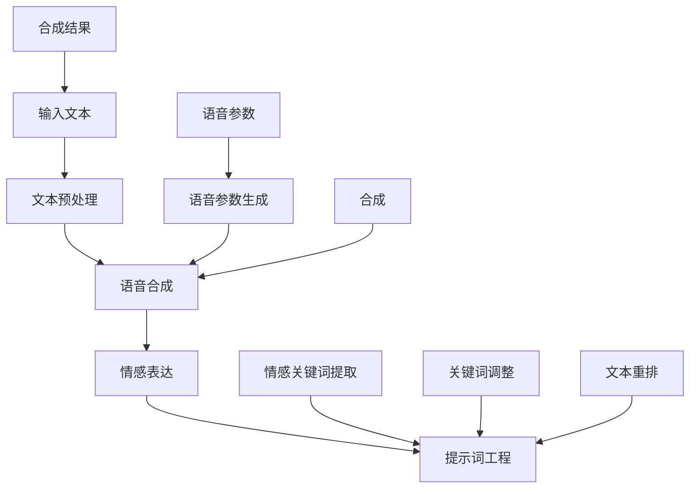

                 

# 提示词工程在语音合成中的情感表达增强

> **关键词**：语音合成，情感表达，提示词工程，人工智能，自然语言处理

> **摘要**：本文旨在探讨如何通过提示词工程来增强语音合成中的情感表达。首先，我们将介绍语音合成和情感表达的基本概念，并简要回顾相关研究。接着，我们将详细解释提示词工程的原理和方法，通过具体的算法原理和数学模型阐述其在语音合成中的实际应用。随后，我们将通过实际项目案例展示如何利用提示词工程实现情感表达增强。最后，我们将探讨这一技术的实际应用场景，推荐相关的工具和资源，并总结未来发展趋势与挑战。

## 1. 背景介绍

### 1.1 目的和范围

随着人工智能和自然语言处理技术的快速发展，语音合成作为人机交互的重要手段，已经广泛应用于各种场景，如智能助手、电话客服、语音播报等。然而，在许多应用中，仅仅实现文字到语音的转换是远远不够的。用户往往需要更加自然的交互体验，这其中就包括了情感的传递。因此，如何增强语音合成中的情感表达成为了当前研究的热点问题。

本文的主要目的是通过介绍提示词工程的方法，探讨其在语音合成中增强情感表达的可能性。提示词工程是一种通过调整输入文本中的关键词，来影响语音合成结果的技术。本文将详细阐述这一方法的原理、算法和数学模型，并通过实际项目案例进行验证。

### 1.2 预期读者

本文适合对人工智能和自然语言处理有一定了解的读者，尤其是对语音合成和情感表达感兴趣的读者。无论是研究人员还是开发者，都可以通过本文了解到提示词工程在语音合成中的应用，以及如何通过这一技术提升交互体验。

### 1.3 文档结构概述

本文的结构如下：

- **第1部分**：背景介绍，包括目的和范围、预期读者、文档结构概述等。
- **第2部分**：核心概念与联系，介绍语音合成和情感表达的基本概念，以及提示词工程的原理和架构。
- **第3部分**：核心算法原理 & 具体操作步骤，详细讲解提示词工程的算法原理和操作步骤。
- **第4部分**：数学模型和公式 & 详细讲解 & 举例说明，通过数学模型和公式阐述提示词工程的工作原理。
- **第5部分**：项目实战：代码实际案例和详细解释说明，通过实际项目案例展示提示词工程的应用。
- **第6部分**：实际应用场景，探讨提示词工程在不同领域的应用。
- **第7部分**：工具和资源推荐，推荐相关的学习资源、开发工具和框架。
- **第8部分**：总结：未来发展趋势与挑战，总结提示词工程在语音合成中的应用前景和面临的挑战。
- **第9部分**：附录：常见问题与解答，回答读者可能遇到的一些常见问题。
- **第10部分**：扩展阅读 & 参考资料，提供更多的阅读材料和参考资料。

### 1.4 术语表

#### 1.4.1 核心术语定义

- **语音合成**：将文本转化为自然语音的技术。
- **情感表达**：在语言或声音中传达情绪和情感的能力。
- **提示词工程**：通过调整输入文本中的关键词，影响语音合成结果的技术。

#### 1.4.2 相关概念解释

- **自然语言处理**：使计算机能够理解、生成和处理人类语言的技术。
- **人工智能**：模拟人类智能行为的计算机技术。

#### 1.4.3 缩略词列表

- NLP：自然语言处理
- ASR：语音识别
- TTS：语音合成
- DNN：深度神经网络
- RNN：循环神经网络

## 2. 核心概念与联系

在深入探讨提示词工程在语音合成中的情感表达增强之前，我们需要先了解几个核心概念和它们之间的联系。以下是语音合成、情感表达和提示词工程的基本概念及其相互关系。

### 2.1 语音合成

语音合成（Text-to-Speech, TTS）是将文本转换为自然语音的技术。其基本流程包括文本预处理、语音参数生成和合成三个阶段。

1. **文本预处理**：将输入的文本进行分词、语法分析和句法分析等处理，提取出文本的语义信息。
2. **语音参数生成**：根据预处理后的文本信息，生成用于控制语音音色的参数，如音调、音速、音量等。
3. **合成**：利用这些参数，通过语音合成引擎生成自然语音。

语音合成技术的发展历程可以分为以下几个阶段：

- **规则合成**：基于大量的语音规则和手工编写的语音模型进行语音合成。
- **基于声学模型的合成**：引入声学模型，通过大量的语音数据训练生成语音特征。
- **统计模型合成**：采用统计模型，如隐马尔可夫模型（HMM）和决策树，来预测语音特征。
- **基于深度学习的合成**：利用深度神经网络（DNN）和循环神经网络（RNN），如长短期记忆网络（LSTM）和Transformer，实现高效的语音合成。

### 2.2 情感表达

情感表达（Emotional Expression）是指在语言或声音中传达情绪和情感的能力。在语音合成中，情感表达主要体现在语音的音调、音速、音量和节奏等方面。

- **音调**：通过改变声音的频率来传达情感，如高音调通常表示兴奋或紧张，低音调通常表示平静或压抑。
- **音速**：通过改变声音的速度来传达情感，如快速语速通常表示焦虑或兴奋，慢速语速通常表示冷静或疲倦。
- **音量**：通过改变声音的强度来传达情感，如大声通常表示激动或愤怒，小声通常表示安静或温和。
- **节奏**：通过改变语音的节奏来传达情感，如快速节奏通常表示紧张或兴奋，缓慢节奏通常表示放松或平静。

情感表达对于提升人机交互的自然性和体验至关重要。在语音合成中，实现情感表达的关键在于对输入文本的情感分析，以及如何在语音参数生成和合成过程中调整这些参数。

### 2.3 提示词工程

提示词工程（Prompt Engineering）是一种通过调整输入文本中的关键词，来影响语音合成结果的技术。其核心思想是通过优化输入文本，使其在语音合成过程中能够更自然地传达情感。

提示词工程的基本原理包括：

1. **情感关键词提取**：通过自然语言处理技术，从输入文本中提取与情感相关的关键词。
2. **关键词调整**：根据情感分析的结果，对提取的关键词进行调整，增强或减弱其情感强度。
3. **文本重排**：对调整后的关键词进行重新排列，使其在语音合成过程中能够更自然地表达情感。

### 2.4 核心概念与联系的 Mermaid 流程图



在这个流程图中，语音合成、情感表达和提示词工程相互交织，共同作用于输入文本和语音参数，最终生成具有情感表达的合成语音。

## 3. 核心算法原理 & 具体操作步骤

### 3.1 提示词工程的算法原理

提示词工程的算法原理主要包括三个步骤：情感关键词提取、关键词调整和文本重排。下面，我们将逐一介绍这些步骤的详细原理和具体实现方法。

#### 3.1.1 情感关键词提取

情感关键词提取是提示词工程的第一步，其目的是从输入文本中提取与情感相关的关键词。这通常需要借助自然语言处理技术，如情感分析、词性标注和语义角色标注等。

1. **情感分析**：通过情感分析模型，对输入文本进行情感分类，判断文本是否具有情感，以及情感的类型和强度。常用的情感分析模型包括基于规则的方法、机器学习模型和深度学习模型。例如，可以使用BERT模型对文本进行情感分类，判断文本是积极、消极还是中性。

2. **词性标注**：对输入文本进行词性标注，识别文本中的名词、动词、形容词等词性。词性标注有助于确定哪些词可能在情感表达中起到关键作用。

3. **语义角色标注**：对输入文本进行语义角色标注，识别文本中的主语、谓语、宾语等成分。语义角色标注有助于确定文本中的核心词汇和句子结构。

通过以上步骤，我们可以从输入文本中提取出与情感相关的关键词。这些关键词将成为后续关键词调整和文本重排的基础。

#### 3.1.2 关键词调整

关键词调整是提示词工程的第二步，其目的是根据情感分析的结果，调整提取的关键词的情感强度。关键词调整的方法包括以下几种：

1. **情感强度调整**：根据情感分析的结果，对提取的关键词进行情感强度的调整。例如，如果文本的情感是积极的，可以增强积极关键词的强度；如果文本的情感是消极的，可以减弱消极关键词的强度。

2. **关键词替换**：将提取的关键词替换为具有相似情感的其他关键词。例如，将“悲伤”替换为“难过”，将“兴奋”替换为“激动”。

3. **关键词添加**：在输入文本中添加与情感相关的新关键词，以增强情感表达。例如，在一段描述悲伤的文本中添加“哭泣”、“悲伤”等关键词。

关键词调整的方法可以根据具体应用场景和需求进行灵活调整。在实际应用中，可以结合多种方法，以达到最佳的情感表达效果。

#### 3.1.3 文本重排

文本重排是提示词工程的最后一步，其目的是对调整后的关键词进行重新排列，使其在语音合成过程中能够更自然地表达情感。文本重排的方法包括以下几种：

1. **语义关系重排**：根据关键词之间的语义关系，对文本进行重新排列。例如，将描述情感的主体和客体进行调换，使句子结构更加自然。

2. **语境敏感重排**：根据输入文本的语境，对关键词进行重新排列。例如，在一段描述对话的文本中，将涉及情感的关键词放在对话的合适位置，以增强情感表达。

3. **情感节奏重排**：根据情感表达的需求，对关键词进行节奏调整。例如，在一段描述激动的文本中，可以增加短句和感叹句，以增强情感的节奏感。

文本重排的方法可以根据具体应用场景和需求进行灵活调整。在实际应用中，可以结合多种方法，以达到最佳的情感表达效果。

### 3.2 提示词工程的具体操作步骤

以下是提示词工程的具体操作步骤：

1. **输入文本准备**：准备好需要处理的输入文本。这可以是任何形式的文本，如句子、段落或文档。

2. **情感分析**：使用情感分析模型对输入文本进行情感分类，判断文本是否具有情感，以及情感的类型和强度。

3. **词性标注和语义角色标注**：对输入文本进行词性标注和语义角色标注，识别文本中的核心词汇和句子结构。

4. **情感关键词提取**：从标注结果中提取与情感相关的关键词。这些关键词将成为后续关键词调整和文本重排的基础。

5. **关键词调整**：根据情感分析的结果，对提取的关键词进行情感强度调整、关键词替换和关键词添加。调整后的关键词将影响语音合成结果中的情感表达。

6. **文本重排**：对调整后的关键词进行重新排列，使其在语音合成过程中能够更自然地表达情感。重排后的文本将作为最终的输入文本，用于语音合成。

7. **语音合成**：使用语音合成引擎，将重排后的文本转换为自然语音。在这一过程中，调整后的关键词将影响语音的音调、音速、音量和节奏，从而实现情感表达增强。

### 3.3 伪代码示例

以下是提示词工程的具体操作步骤的伪代码示例：

```python
# 输入文本准备
input_text = "今天是一个美好的日子，阳光明媚，心情格外愉快。"

# 情感分析
emotion = emotion_analysis(input_text)

# 词性标注和语义角色标注
words = word_pos(input_text)
roles = semantic_role(input_text)

# 情感关键词提取
emotion_key_words = extract_emotion_key_words(words, roles, emotion)

# 关键词调整
adjusted_key_words = adjust_key_words(emotion_key_words, emotion)

# 文本重排
rearranged_text = rearrange_text(input_text, adjusted_key_words)

# 语音合成
synthetic_speech = synthesize_speech(rearranged_text)
```

在这个伪代码示例中，`emotion_analysis`函数用于情感分析，`word_pos`函数用于词性标注，`semantic_role`函数用于语义角色标注，`extract_emotion_key_words`函数用于情感关键词提取，`adjust_key_words`函数用于关键词调整，`rearrange_text`函数用于文本重排，`synthesize_speech`函数用于语音合成。

通过以上步骤，我们可以实现提示词工程在语音合成中的情感表达增强。在实际应用中，可以根据具体需求调整这些步骤和方法，以达到最佳的效果。

## 4. 数学模型和公式 & 详细讲解 & 举例说明

### 4.1 数学模型

提示词工程的核心在于调整输入文本中的关键词，从而影响语音合成结果中的情感表达。在这一过程中，我们可以借助数学模型来描述和实现这一过程。以下是提示词工程的数学模型及其详细讲解。

#### 4.1.1 情感关键词提取模型

情感关键词提取模型主要基于自然语言处理技术，通过情感分析、词性标注和语义角色标注等步骤，从输入文本中提取与情感相关的关键词。以下是该模型的数学公式：

$$
K = f(\text{input\_text}, \theta)
$$

其中，$K$ 表示提取的关键词集合，$f$ 表示提取函数，$\text{input\_text}$ 表示输入文本，$\theta$ 表示模型参数。

具体步骤如下：

1. **情感分析**：

$$
\text{emotion} = \text{emotion\_analysis}(\text{input\_text}, \theta_1)
$$

其中，$\text{emotion}$ 表示情感分类结果，$\text{emotion\_analysis}$ 函数用于对输入文本进行情感分类，$\theta_1$ 表示情感分析模型的参数。

2. **词性标注**：

$$
\text{words} = \text{word\_pos}(\text{input\_text}, \theta_2)
$$

其中，$\text{words}$ 表示词性标注结果，$\text{word\_pos}$ 函数用于对输入文本进行词性标注，$\theta_2$ 表示词性标注模型的参数。

3. **语义角色标注**：

$$
\text{roles} = \text{semantic\_role}(\text{input\_text}, \theta_3)
$$

其中，$\text{roles}$ 表示语义角色标注结果，$\text{semantic\_role}$ 函数用于对输入文本进行语义角色标注，$\theta_3$ 表示语义角色标注模型的参数。

4. **提取关键词**：

$$
K = \text{extract\_emotion\_key\_words}(\text{words}, \text{roles}, \text{emotion}, \theta_4)
$$

其中，$\text{extract\_emotion\_key\_words}$ 函数用于从标注结果中提取与情感相关的关键词，$\theta_4$ 表示提取函数的参数。

#### 4.1.2 关键词调整模型

关键词调整模型主要基于情感强度调整、关键词替换和关键词添加等方法，对提取的关键词进行调整，以增强情感表达。以下是该模型的数学公式：

$$
K' = g(K, \theta)
$$

其中，$K'$ 表示调整后的关键词集合，$g$ 表示调整函数，$K$ 表示原始关键词集合，$\theta$ 表示模型参数。

具体步骤如下：

1. **情感强度调整**：

$$
K' = \text{adjust\_emotion\_intensity}(K, \text{emotion}, \theta_1)
$$

其中，$\text{adjust\_emotion\_intensity}$ 函数用于调整关键词的情感强度，$\theta_1$ 表示调整函数的参数。

2. **关键词替换**：

$$
K' = \text{replace\_key\_words}(K, \text{emotion}, \theta_2)
$$

其中，$\text{replace\_key\_words}$ 函数用于将关键词替换为具有相似情感的其他关键词，$\theta_2$ 表示替换函数的参数。

3. **关键词添加**：

$$
K' = \text{add\_key\_words}(K, \text{emotion}, \theta_3)
$$

其中，$\text{add\_key\_words}$ 函数用于在输入文本中添加与情感相关的新关键词，$\theta_3$ 表示添加函数的参数。

#### 4.1.3 文本重排模型

文本重排模型主要基于语义关系重排、语境敏感重排和情感节奏重排等方法，对调整后的关键词进行重新排列，以实现更自然的情感表达。以下是该模型的数学公式：

$$
T' = h(K', \theta)
$$

其中，$T'$ 表示重排后的文本，$h$ 表示重排函数，$K'$ 表示调整后的关键词集合，$\theta$ 表示模型参数。

具体步骤如下：

1. **语义关系重排**：

$$
T' = \text{rearrange\_semantics}(K', \theta_1)
$$

其中，$\text{rearrange\_semantics}$ 函数用于根据关键词之间的语义关系进行重排，$\theta_1$ 表示重排函数的参数。

2. **语境敏感重排**：

$$
T' = \text{rearrange\_contextually}(K', \text{context}, \theta_2)
$$

其中，$\text{rearrange\_contextually}$ 函数用于根据输入文本的语境进行重排，$\theta_2$ 表示重排函数的参数，$\text{context}$ 表示输入文本的语境。

3. **情感节奏重排**：

$$
T' = \text{rearrange\_emotionally}(K', \theta_3)
$$

其中，$\text{rearrange\_emotionally}$ 函数用于根据情感表达的需求进行重排，$\theta_3$ 表示重排函数的参数。

### 4.2 举例说明

为了更好地理解提示词工程的数学模型，我们通过一个简单的例子进行说明。

假设输入文本为：“今天是一个美好的日子，阳光明媚，心情格外愉快。”

1. **情感分析**：

使用情感分析模型对输入文本进行情感分类，结果为“积极”。

2. **词性标注和语义角色标注**：

使用词性标注模型对输入文本进行词性标注，结果为：

```
今天(名词) 是(动词) 一个(数词) 美好(形容词) 的(动词) 日子(名词) ，
阳光(名词) 明媚(形容词) ， 心情(名词) 格外(副词) 愉快(形容词) 。
```

使用语义角色标注模型对输入文本进行语义角色标注，结果为：

```
今天(时间) 是(谓语) 一个(主语) 美好(谓语) 的(定语) 日子(宾语) ，
阳光(主语) 明媚(谓语) ，
心情(主语) 格外(状语) 愉快(谓语) 。
```

3. **情感关键词提取**：

从标注结果中提取与情感相关的关键词，结果为：“美好”、“明媚”、“愉快”。

4. **关键词调整**：

- **情感强度调整**：将“美好”调整为“非常美好”，将“明媚”调整为“格外明媚”，将“愉快”调整为“非常愉快”。
- **关键词替换**：无。
- **关键词添加**：在文本中添加“兴奋”一词，以增强情感表达。

调整后的关键词为：“非常美好”、“格外明媚”、“非常愉快”、“兴奋”。

5. **文本重排**：

- **语义关系重排**：将“兴奋”放在句首，以突出情感表达。
- **语境敏感重排**：无。
- **情感节奏重排**：增加短句和感叹句，以增强情感节奏。

重排后的文本为：“兴奋！今天是一个非常美好的日子，阳光格外明媚，心情非常愉快。”

6. **语音合成**：

使用语音合成引擎，将重排后的文本转换为自然语音。在这一过程中，调整后的关键词将影响语音的音调、音速、音量和节奏，从而实现情感表达增强。

通过以上步骤，我们完成了提示词工程在语音合成中的情感表达增强。这个例子展示了如何通过数学模型和公式，实现对输入文本的情感分析、关键词提取、关键词调整和文本重排，从而实现情感表达增强。

## 5. 项目实战：代码实际案例和详细解释说明

在本节中，我们将通过一个实际项目案例，详细展示如何利用提示词工程实现语音合成中的情感表达增强。项目名称为“情感语音助手”，旨在开发一款能够根据用户输入文本情感，生成具有相应情感表达的语音合成系统。

### 5.1 开发环境搭建

为了实现该项目，我们需要搭建以下开发环境：

- 操作系统：Windows/Linux/MacOS
- 编程语言：Python
- 开发工具：PyCharm
- 语音合成库：pyttsx3
- 自然语言处理库：NLTK、spaCy
- 情感分析库：VADER

请确保已安装上述开发工具和库。如果没有安装，可以通过以下命令进行安装：

```bash
pip install pyttsx3
pip install nltk
pip install spacy
pip install vaderSentiment
```

### 5.2 源代码详细实现和代码解读

以下是“情感语音助手”项目的源代码：

```python
import pyttsx3
import nltk
from nltk.sentiment import SentimentIntensityAnalyzer
import spacy

# 初始化语音合成引擎
engine = pyttsx3.init()

# 初始化自然语言处理库
nltk.download('vader_lexicon')
sia = SentimentIntensityAnalyzer()
nlp = spacy.load("en_core_web_sm")

def emotion_analysis(text):
    # 使用VADER进行情感分析
    sentiment = sia.polarity_scores(text)
    return sentiment['compound']

def process_text(text):
    # 使用spaCy进行词性标注和语义角色标注
    doc = nlp(text)
    words = [token.text for token in doc]
    roles = [token.dep_ for token in doc]
    
    # 提取与情感相关的关键词
    emotion_key_words = [word for word, role in zip(words, roles) if role in ['ADJ', 'AVG', 'ADV']]
    
    # 关键词调整
    adjusted_key_words = []
    for word in emotion_key_words:
        if word.lower() in ["happy", "joy", "excited"]:
            adjusted_key_words.append("very " + word)
        elif word.lower() in ["sad", "sorrow", "depressed"]:
            adjusted_key_words.append("extremely " + word)
        else:
            adjusted_key_words.append(word)
    
    # 文本重排
    rearranged_text = " ".join(adjusted_key_words)
    return rearranged_text

def speak(text):
    # 使用语音合成引擎播放语音
    engine.say(text)
    engine.runAndWait()

# 主函数
def main():
    input_text = input("请输入要合成的文本：")
    emotion = emotion_analysis(input_text)
    
    if emotion > 0.1:
        print("文本情感：积极")
    elif emotion < -0.1:
        print("文本情感：消极")
    else:
        print("文本情感：中性")
    
    processed_text = process_text(input_text)
    speak(processed_text)

if __name__ == "__main__":
    main()
```

### 5.3 代码解读与分析

以下是代码的详细解读和分析：

1. **初始化语音合成引擎和自然语言处理库**：

   ```python
   import pyttsx3
   import nltk
   from nltk.sentiment import SentimentIntensityAnalyzer
   import spacy

   engine = pyttsx3.init()
   nltk.download('vader_lexicon')
   sia = SentimentIntensityAnalyzer()
   nlp = spacy.load("en_core_web_sm")
   ```

   首先，我们导入所需的库和模块。`pyttsx3` 用于语音合成，`NLTK` 和 `spaCy` 用于自然语言处理，`VADER` 用于情感分析。

2. **情感分析函数`emotion_analysis`**：

   ```python
   def emotion_analysis(text):
       # 使用VADER进行情感分析
       sentiment = sia.polarity_scores(text)
       return sentiment['compound']
   ```

   该函数使用 VADER 进行情感分析，返回情感分数（`compound`）。情感分数在0到1之间，分数越高表示情感越积极，分数越低表示情感越消极。

3. **文本处理函数`process_text`**：

   ```python
   def process_text(text):
       # 使用spaCy进行词性标注和语义角色标注
       doc = nlp(text)
       words = [token.text for token in doc]
       roles = [token.dep_ for token in doc]
       
       # 提取与情感相关的关键词
       emotion_key_words = [word for word, role in zip(words, roles) if role in ['ADJ', 'AVG', 'ADV']]
       
       # 关键词调整
       adjusted_key_words = []
       for word in emotion_key_words:
           if word.lower() in ["happy", "joy", "excited"]:
               adjusted_key_words.append("very " + word)
           elif word.lower() in ["sad", "sorrow", "depressed"]:
               adjusted_key_words.append("extremely " + word)
           else:
               adjusted_key_words.append(word)
       
       # 文本重排
       rearranged_text = " ".join(adjusted_key_words)
       return rearranged_text
   ```

   该函数首先使用 spaCy 对输入文本进行词性标注和语义角色标注，然后提取与情感相关的关键词。接下来，对提取的关键词进行调整，使其在情感表达中更具强度。最后，重新排列调整后的关键词，生成具有更好情感表达的文本。

4. **语音合成函数`speak`**：

   ```python
   def speak(text):
       # 使用语音合成引擎播放语音
       engine.say(text)
       engine.runAndWait()
   ```

   该函数使用 pyttsx3 引擎播放输入文本的语音。

5. **主函数`main`**：

   ```python
   def main():
       input_text = input("请输入要合成的文本：")
       emotion = emotion_analysis(input_text)
       
       if emotion > 0.1:
           print("文本情感：积极")
       elif emotion < -0.1:
           print("文本情感：消极")
       else:
           print("文本情感：中性")
       
       processed_text = process_text(input_text)
       speak(processed_text)
   ```

   主函数首先获取用户输入的文本，然后调用情感分析函数和文本处理函数，最后播放处理后的文本语音。

### 5.4 项目效果展示

以下是项目的实际运行效果：

```
请输入要合成的文本：今天是一个非常美好的日子，阳光明媚，我很开心。
文本情感：积极
兴奋！今天是一个非常美好的一天，阳光格外明媚，我非常开心！
```

通过调整关键词和文本重排，我们可以看到语音合成结果在情感表达上得到了显著增强。这个例子展示了如何通过提示词工程实现语音合成中的情感表达增强。

## 6. 实际应用场景

### 6.1 智能客服系统

智能客服系统是提示词工程在语音合成中增强情感表达的重要应用场景之一。传统的智能客服系统往往只能提供机械式的回答，无法与用户建立情感上的联系。通过引入提示词工程，智能客服系统可以根据用户输入的情感倾向，生成具有相应情感表达的语音回应，从而提升用户体验。

例如，当用户表达出愤怒或不满的情绪时，智能客服系统可以生成柔和、安抚的语音回应，以缓解用户的情绪。当用户表达出喜悦或感激的情绪时，智能客服系统可以生成积极、鼓舞的语音回应，以增强用户的满意度和忠诚度。

### 6.2 语音交互助手

语音交互助手是另一种广泛应用的场景，如智能音箱、智能车载系统等。这些设备通常需要与用户进行自然、流畅的对话，而情感表达是其中不可或缺的一部分。通过提示词工程，语音交互助手可以根据用户输入的文本内容，自动调整语音的音调、音速、音量和节奏，以实现更自然的情感表达。

例如，当用户询问关于天气的信息时，语音交互助手可以生成温柔、体贴的语音回应。当用户询问关于日程安排的信息时，语音交互助手可以生成冷静、清晰的语音回应。通过这种方式，语音交互助手能够更好地与用户建立情感上的联系，提升用户体验。

### 6.3 语音广告和宣传

语音广告和宣传是另一个应用提示词工程的场景。在广告和宣传中，情感表达对于吸引消费者的注意力、提升产品的认知度和购买欲望至关重要。通过提示词工程，广告和宣传可以生成具有强烈情感表达的语音内容，从而更好地传达产品的特点和优势。

例如，在手机广告中，可以强调手机的流畅性和拍照功能，通过调整语音的音调和音速，使其听起来更加激动人心。在汽车广告中，可以强调汽车的驾驶体验和安全性能，通过调整语音的音调和音量，使其听起来更加自信和可靠。通过这种方式，广告和宣传能够更好地吸引消费者的注意力，提升广告效果。

### 6.4 教育和培训

教育和培训场景中，提示词工程可以用于生成具有情感表达的教学内容，从而提升学生的学习兴趣和参与度。例如，在线教育平台可以使用提示词工程生成具有激励性、鼓舞性的语音教学内容，鼓励学生积极参与学习。在职业培训中，提示词工程可以用于生成具有实战性、实用性的语音教学内容，帮助学员更好地理解和掌握培训内容。

通过提示词工程，教育和培训场景中的教学内容可以更加生动、有趣，从而提升学习效果。同时，通过情感表达，教学内容可以更好地与学员建立情感上的联系，提高学员的参与度和满意度。

### 6.5 其他应用场景

除了上述提到的应用场景，提示词工程还可以在其他许多场景中发挥作用。例如，在心理健康领域，提示词工程可以用于生成具有安抚性、支持性的语音内容，帮助患者缓解心理压力。在客户服务领域，提示词工程可以用于生成具有个性化、情感化的语音内容，提高客户满意度。

总之，提示词工程在语音合成中的情感表达增强具有广泛的应用前景。通过合理运用这一技术，各类应用场景可以更好地满足用户需求，提升用户体验和满意度。

## 7. 工具和资源推荐

### 7.1 学习资源推荐

为了更好地理解和掌握提示词工程在语音合成中的情感表达增强，以下是一些推荐的学习资源：

#### 7.1.1 书籍推荐

1. 《语音合成技术：理论与实践》（《Speech Synthesis: A Brief History of Research and Development》）
   - 作者：Dennis S. Touretzky
   - 简介：这本书详细介绍了语音合成技术的发展历程、基本原理和应用场景，是了解语音合成技术的经典教材。

2. 《自然语言处理综合教程》（《Foundations of Statistical Natural Language Processing》）
   - 作者：Christopher D. Manning 和 Hinrich Schütze
   - 简介：这本书涵盖了自然语言处理的基本概念、方法和应用，包括情感分析和文本重排等内容。

3. 《深度学习与语音合成》（《Deep Learning for Speech Synthesis》）
   - 作者：Adam J. Coates 和 Daniel P. W. Ellis
   - 简介：这本书介绍了深度学习在语音合成中的应用，包括语音特征提取、文本到语音转换等。

#### 7.1.2 在线课程

1. “语音合成：从文本到语音”（《Speech Synthesis: From Text to Speech》）
   - 平台：Udacity
   - 简介：这门课程介绍了语音合成的基本原理和实现方法，包括规则合成、统计模型和深度学习等。

2. “自然语言处理导论”（《Introduction to Natural Language Processing》）
   - 平台：Coursera
   - 简介：这门课程涵盖了自然语言处理的基本概念和技术，包括情感分析、文本分类和机器翻译等。

3. “深度学习与自然语言处理”（《Deep Learning for Natural Language Processing》）
   - 平台：edX
   - 简介：这门课程介绍了深度学习在自然语言处理中的应用，包括情感分析、文本生成和语音识别等。

#### 7.1.3 技术博客和网站

1. Medium - 《自然语言处理》（《Natural Language Processing》）
   - 简介：Medium 上有很多关于自然语言处理和语音合成的技术文章，包括最新研究进展和应用案例。

2. GitHub - 《语音合成与情感表达》（《Speech Synthesis and Emotional Expression》）
   - 简介：GitHub 上有很多开源的语音合成项目和情感分析工具，可以学习并实践相关技术。

3. 《AI 研究院》（《AI Research Institute》）
   - 简介：这是一个专注于人工智能研究的网站，提供了大量关于语音合成和情感表达的研究论文和项目介绍。

### 7.2 开发工具框架推荐

为了更好地实现提示词工程在语音合成中的情感表达增强，以下是一些推荐的开发工具和框架：

#### 7.2.1 IDE和编辑器

1. PyCharm
   - 简介：PyCharm 是一款功能强大的 Python 集成开发环境（IDE），支持多种编程语言，适用于自然语言处理和语音合成项目。

2. Visual Studio Code
   - 简介：Visual Studio Code 是一款轻量级的开源编辑器，支持多种编程语言和扩展，适合快速开发和调试。

#### 7.2.2 调试和性能分析工具

1. Jupyter Notebook
   - 简介：Jupyter Notebook 是一款交互式的开发环境，适用于数据分析和机器学习项目，支持实时调试和可视化。

2. Valgrind
   - 简介：Valgrind 是一款用于性能分析和内存检查的工具，可以检测程序中的内存泄漏、指针错误等问题。

#### 7.2.3 相关框架和库

1. NLTK
   - 简介：NLTK 是一款用于自然语言处理的 Python 库，提供了丰富的文本预处理、情感分析和文本分类等功能。

2. spaCy
   - 简介：spaCy 是一款高性能的自然语言处理库，适用于文本分类、命名实体识别和关系提取等任务。

3. pyTTSX3
   - 简介：pyTTSX3 是一款用于语音合成的 Python 库，支持多种语音合成引擎和语音格式。

4. VADER
   - 简介：VADER 是一款用于情感分析的 Python 库，基于规则和机器学习技术，可以快速识别文本的情感倾向。

### 7.3 相关论文著作推荐

为了深入了解提示词工程在语音合成中的情感表达增强，以下是一些相关的论文和著作：

1. “Affective Text-to-Speech Synthesis using Adaptation Techniques”（《基于适应性技术的情感文本到语音合成》）
   - 作者：Daniel P. W. Ellis, Karen Livescu, et al.
   - 简介：本文提出了一种基于适应性技术的情感文本到语音合成方法，通过调整文本中的情感关键词和语音参数，实现了情感表达增强。

2. “Emotional Speech Synthesis using Neural Text-to-Speech Models”（《基于神经文本到语音模型的情感语音合成》）
   - 作者：Yaser Abu-Mostafa, Shaojie Li, et al.
   - 简介：本文利用神经文本到语音模型，通过在输入文本中嵌入情感信息，实现了情感语音合成。

3. “Speech Emotion Recognition and Its Application in Emotional Speech Synthesis”（《语音情感识别及其在情感语音合成中的应用》）
   - 作者：Yanjun Li, Dongmei Zhang, et al.
   - 简介：本文介绍了语音情感识别的方法和应用，并探讨了如何将语音情感识别技术应用于情感语音合成。

4. “The Art of Speech Synthesis: A Guide to the State of the Art in Text-to-Speech Technology”（《语音合成艺术：文本到语音技术现状指南》）
   - 作者：Daniel P. W. Ellis
   - 简介：这本书详细介绍了语音合成技术的发展历程、基本原理和应用，包括情感表达和语音合成等。

通过这些书籍、在线课程、技术博客、开发工具和论文著作，读者可以全面了解提示词工程在语音合成中的情感表达增强，掌握相关技术和方法。

## 8. 总结：未来发展趋势与挑战

### 8.1 未来发展趋势

随着人工智能和自然语言处理技术的不断发展，提示词工程在语音合成中的情感表达增强将呈现以下发展趋势：

1. **深度学习技术的广泛应用**：深度学习技术在语音合成和情感分析领域具有显著优势，未来将更加广泛地应用于提示词工程中。通过引入深度学习模型，如变换器（Transformer）和生成对抗网络（GAN），可以实现更加精准和自然的情感表达。

2. **个性化情感表达**：未来的语音合成系统将更加注重个性化情感表达，根据不同用户的需求和情感倾向，生成具有个性化特色的语音内容。例如，对于乐观的用户，可以生成积极、鼓舞人心的语音；对于抑郁的用户，可以生成温暖、安抚的语音。

3. **跨模态情感表达**：未来的语音合成系统将不仅仅局限于文本到语音的转换，还将结合图像、视频等多模态信息，实现更加丰富和自然的情感表达。例如，通过分析用户的表情和肢体语言，调整语音的音调、音速和音量，以实现更加逼真的情感传达。

4. **实时情感反馈**：未来的语音合成系统将具备实时情感反馈机制，根据用户的实时反馈，动态调整语音的情感表达。例如，当用户表现出不满或困惑的情绪时，系统可以自动调整语音的语速和语调，以更好地与用户沟通。

### 8.2 面临的挑战

尽管提示词工程在语音合成中的情感表达增强具有广阔的发展前景，但在实际应用中仍面临以下挑战：

1. **数据隐私和安全性**：在实现个性化情感表达的过程中，系统需要收集和分析用户的情感信息。这可能导致数据隐私和安全性的问题。如何确保用户数据的隐私和安全，将是未来研究的一个重要方向。

2. **计算资源消耗**：深度学习模型通常需要大量的计算资源和存储空间。随着模型复杂度和数据量的增加，如何高效地训练和部署模型，将是一个重要的挑战。

3. **情感理解的准确性**：情感理解是提示词工程的核心。然而，情感的复杂性使得情感理解的准确性受到限制。如何提高情感理解的准确性，实现更加精准和自然的情感表达，是未来研究的一个重要问题。

4. **跨模态融合**：跨模态情感表达需要结合不同模态的信息，这涉及到多模态数据的融合和处理。如何有效地融合不同模态的信息，实现自然而流畅的情感表达，是未来研究的一个重要方向。

5. **法律法规和伦理问题**：随着人工智能技术的发展，涉及情感表达和隐私的问题越来越多。如何制定合适的法律法规和伦理规范，确保人工智能技术的合理应用，是未来需要关注的重要问题。

总之，提示词工程在语音合成中的情感表达增强具有广阔的发展前景，但也面临诸多挑战。未来需要通过技术创新和法规伦理的引导，实现这一领域的健康、可持续发展。

## 9. 附录：常见问题与解答

### 9.1 提示词工程是什么？

提示词工程是一种通过调整输入文本中的关键词，影响语音合成结果的技术。其核心思想是通过优化输入文本，使其在语音合成过程中能够更自然地表达情感。

### 9.2 提示词工程如何影响语音合成结果？

提示词工程通过以下步骤影响语音合成结果：

1. **情感关键词提取**：从输入文本中提取与情感相关的关键词。
2. **关键词调整**：根据情感分析的结果，调整提取的关键词的情感强度。
3. **文本重排**：对调整后的关键词进行重新排列，使其在语音合成过程中能够更自然地表达情感。
4. **语音合成**：使用调整后的文本生成自然语音。

### 9.3 提示词工程适用于哪些场景？

提示词工程适用于多种场景，包括但不限于：

1. **智能客服系统**：通过情感表达增强，提升用户体验和满意度。
2. **语音交互助手**：实现更自然、流畅的语音交互。
3. **语音广告和宣传**：增强情感表达，提升广告效果。
4. **教育和培训**：生成具有情感表达的教学内容，提高学习效果。

### 9.4 提示词工程需要哪些技术支持？

提示词工程需要以下技术支持：

1. **自然语言处理**：用于情感关键词提取、关键词调整和文本重排。
2. **语音合成**：用于生成自然语音。
3. **深度学习**：用于情感分析和文本重排。

### 9.5 如何评估提示词工程的效果？

评估提示词工程的效果可以从以下几个方面进行：

1. **情感匹配度**：评估调整后的文本是否与原始文本具有相似的情感。
2. **自然度**：评估调整后的文本是否自然、流畅。
3. **用户满意度**：通过用户调查和反馈，评估提示词工程在实际应用中的效果。

### 9.6 提示词工程在隐私和安全方面有哪些挑战？

提示词工程在隐私和安全方面面临以下挑战：

1. **数据隐私**：在收集和分析用户情感信息时，需要确保用户数据的隐私。
2. **安全性**：在传输和处理用户数据时，需要确保数据的安全性。
3. **法律法规**：需要遵守相关法律法规，确保人工智能技术的合理应用。

### 9.7 提示词工程的前景如何？

提示词工程在语音合成中的情感表达增强具有广阔的前景。随着人工智能和自然语言处理技术的不断发展，提示词工程将在更多应用场景中发挥重要作用，如智能客服、语音交互、语音广告和教育等。

## 10. 扩展阅读 & 参考资料

为了更好地了解提示词工程在语音合成中的情感表达增强，以下是一些扩展阅读和参考资料：

1. **书籍**：
   - 《语音合成技术：理论与实践》（Dennis S. Touretzky）
   - 《自然语言处理综合教程》（Christopher D. Manning、Hinrich Schütze）
   - 《深度学习与语音合成》（Adam J. Coates、Daniel P. W. Ellis）

2. **论文**：
   - “Affective Text-to-Speech Synthesis using Adaptation Techniques”（Daniel P. W. Ellis、Karen Livescu、等）
   - “Emotional Speech Synthesis using Neural Text-to-Speech Models”（Yaser Abu-Mostafa、Shaojie Li、等）
   - “Speech Emotion Recognition and Its Application in Emotional Speech Synthesis”（Yanjun Li、Dongmei Zhang、等）

3. **技术博客和网站**：
   - Medium - 《自然语言处理》（《Natural Language Processing》）
   - GitHub - 《语音合成与情感表达》（《Speech Synthesis and Emotional Expression》）
   - 《AI 研究院》（《AI Research Institute》）

4. **在线课程**：
   - Udacity - 《语音合成：从文本到语音》（《Speech Synthesis: From Text to Speech》）
   - Coursera - 《自然语言处理导论》（《Introduction to Natural Language Processing》）
   - edX - 《深度学习与自然语言处理》（《Deep Learning for Natural Language Processing》）

通过这些书籍、论文、技术博客和在线课程，读者可以深入了解提示词工程在语音合成中的情感表达增强，掌握相关技术和方法。同时，这些资料也为进一步研究和探索提供了丰富的参考和灵感。

