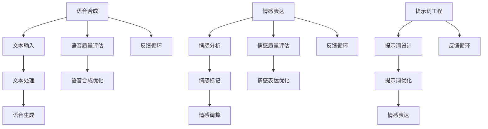

                 

# 提示词工程在语音合成情感表达中的应用

> 关键词：语音合成、情感表达、提示词工程、自然语言处理、人工智能
>
> 摘要：本文将探讨提示词工程在语音合成情感表达中的应用。我们将从背景介绍、核心概念、算法原理、数学模型、项目实战、实际应用场景等多个方面进行分析，旨在深入理解并掌握这一技术，为未来的语音合成情感表达研究提供参考。

## 1. 背景介绍

### 1.1 目的和范围

本文旨在研究提示词工程在语音合成情感表达中的应用，探讨如何利用提示词工程提高语音合成的情感表达能力。通过详细分析核心概念、算法原理、数学模型以及实际应用场景，我们希望能够为读者提供全面、系统的认识，为相关领域的进一步研究提供参考。

### 1.2 预期读者

本文适合以下读者群体：

- 对自然语言处理、语音合成技术感兴趣的初学者和研究者
- 想要深入了解提示词工程在语音合成情感表达中应用的工程师和开发者
- 对人工智能领域有浓厚兴趣，希望拓展知识面的人士

### 1.3 文档结构概述

本文将分为以下十个部分：

1. 背景介绍：介绍文章的目的、范围、预期读者和文档结构。
2. 核心概念与联系：介绍语音合成、情感表达、提示词工程等核心概念，并给出相关流程图。
3. 核心算法原理 & 具体操作步骤：详细阐述提示词工程的算法原理和操作步骤。
4. 数学模型和公式 & 详细讲解 & 举例说明：讲解提示词工程中涉及的数学模型和公式，并进行举例说明。
5. 项目实战：代码实际案例和详细解释说明。
6. 实际应用场景：介绍提示词工程在语音合成情感表达中的实际应用场景。
7. 工具和资源推荐：推荐相关学习资源、开发工具和框架。
8. 总结：未来发展趋势与挑战。
9. 附录：常见问题与解答。
10. 扩展阅读 & 参考资料：提供相关文献和资料，以供读者进一步学习。

### 1.4 术语表

#### 1.4.1 核心术语定义

- 语音合成（Text-to-Speech, TTS）：将文本转化为语音的技术。
- 情感表达（Emotion Expression）：在语音中表达情感的能力。
- 提示词工程（Prompt Engineering）：设计、创建和优化提示词以实现特定目标的过程。
- 自然语言处理（Natural Language Processing, NLP）：使计算机能够理解、解释和生成人类语言的技术。

#### 1.4.2 相关概念解释

- 提示词（Prompt）：一种引导用户或系统进行思考和行动的引导语句。
- 情感分析（Sentiment Analysis）：通过对文本的分析，判断文本中表达的情感倾向。
- 声音特征（Voice Features）：与语音合成相关的参数，如音调、音速、音色等。

#### 1.4.3 缩略词列表

- TTS：Text-to-Speech（语音合成）
- NLP：Natural Language Processing（自然语言处理）
- LDA：Latent Dirichlet Allocation（潜在狄利克雷分配）
- LSTM：Long Short-Term Memory（长短期记忆网络）
- DNN：Deep Neural Network（深度神经网络）

## 2. 核心概念与联系

在探讨提示词工程在语音合成情感表达中的应用之前，我们需要先了解相关核心概念及其相互关系。以下是语音合成、情感表达、提示词工程等核心概念及其相互关系的Mermaid流程图：



### 2.1 语音合成

语音合成（TTS）是指将文本转化为自然流畅的语音的技术。其核心过程包括文本输入、文本处理、语音生成和语音质量评估。文本输入是从用户获取输入文本的过程，文本处理是对输入文本进行预处理，如分词、词性标注等。语音生成是通过语音合成模型将处理后的文本转化为语音。语音质量评估是对合成的语音进行评估，以判断其是否自然、流畅。

### 2.2 情感表达

情感表达是指在语音中表达情感的能力。情感表达包括情感分析、情感标记和情感调整。情感分析是对输入文本进行情感倾向分析，判断文本中表达的情感。情感标记是对文本中的情感进行标记，如积极、消极、中性等。情感调整是在语音生成过程中，根据情感标记对语音参数进行调整，使其能够表达相应的情感。

### 2.3 提示词工程

提示词工程是指设计、创建和优化提示词以实现特定目标的过程。在语音合成情感表达中，提示词工程主要涉及提示词设计和提示词优化。提示词设计是设计能够引导用户或系统进行思考和行动的提示词。提示词优化是通过对提示词进行调整和优化，以提高语音合成情感表达的效果。

## 3. 核心算法原理 & 具体操作步骤

### 3.1 提示词设计

提示词设计的核心是设计能够引导用户或系统进行思考和行动的提示词。具体操作步骤如下：

1. 确定目标情感：首先需要明确目标情感，如积极、消极、中性等。
2. 收集文本数据：根据目标情感，收集大量相关的文本数据。
3. 提取关键词：对收集到的文本数据进行分析，提取与目标情感相关的关键词。
4. 设计提示词：结合提取的关键词，设计具有引导性的提示词。

例如，假设我们想要设计一个表达积极情感的提示词，可以设计以下提示词：

- “请描述一个让你感到快乐的时刻。”
- “谈谈你最近一次的成功经历。”

### 3.2 提示词优化

提示词优化是通过对提示词进行调整和优化，以提高语音合成情感表达的效果。具体操作步骤如下：

1. 数据收集：收集大量语音合成结果，并对其进行情感评估。
2. 分析问题：根据评估结果，分析语音合成情感表达中存在的问题，如情感不匹配、情感过度等。
3. 调整提示词：针对问题，调整提示词，以提高情感表达的准确性。
4. 优化模型：根据调整后的提示词，对语音合成模型进行优化。

以下是一个基于LSTM模型的提示词优化算法的伪代码：

```python
def optimize_prompt(prompt, text, emotion):
    # 对提示词进行预处理
    processed_prompt = preprocess_prompt(prompt)
    
    # 训练语音合成模型
    model = train_tts_model(processed_prompt, text, emotion)
    
    # 收集语音合成结果
    results = generate_tts_samples(model, text)
    
    # 对结果进行情感评估
    emotions = evaluate_emotions(results)
    
    # 分析问题
    problems = analyze_problems(emotions, emotion)
    
    # 调整提示词
    optimized_prompt = adjust_prompt(prompt, problems)
    
    # 优化模型
    optimized_model = train_tts_model(processed_prompt, text, emotion)
    
    return optimized_model, optimized_prompt
```

## 4. 数学模型和公式 & 详细讲解 & 举例说明

在提示词工程中，涉及到的数学模型和公式主要包括自然语言处理中的情感分析模型、语音合成模型等。以下将分别进行详细讲解和举例说明。

### 4.1 情感分析模型

情感分析模型通常采用基于机器学习的分类算法，如朴素贝叶斯、支持向量机、神经网络等。以朴素贝叶斯为例，其基本公式如下：

$$
P(\text{情感}|\text{文本}) = \frac{P(\text{文本}|\text{情感}) \cdot P(\text{情感})}{P(\text{文本})}
$$

其中，$P(\text{情感}|\text{文本})$ 表示在给定文本的情况下，情感的概率；$P(\text{文本}|\text{情感})$ 表示在给定情感的情况下，文本的概率；$P(\text{情感})$ 表示情感的先验概率；$P(\text{文本})$ 表示文本的概率。

举例来说，假设我们要判断一段文本“我今天遇到了一个很好的机会。”的情感。我们可以计算以下概率：

- $P(\text{积极}|\text{文本})$：在给定文本的情况下，积极情感的概率。
- $P(\text{文本}|\text{积极})$：在给定积极情感的情况下，文本的概率。
- $P(\text{积极})$：积极情感的先验概率。
- $P(\text{文本})$：文本的概率。

通过计算上述概率，我们可以判断文本的情感。

### 4.2 语音合成模型

语音合成模型通常采用深度学习算法，如循环神经网络（RNN）、长短期记忆网络（LSTM）、深度神经网络（DNN）等。以下以LSTM为例，介绍其基本原理和公式。

LSTM的核心是单元门（Unit Gate），包括输入门（Input Gate）、遗忘门（Forget Gate）和输出门（Output Gate）。其公式如下：

$$
\begin{aligned}
&\text{输入门：} \\
&\text{ forget\_gate} = \sigma(W_f \cdot [h_{t-1}, x_t] + b_f) \\
&\text{ input\_gate} = \sigma(W_i \cdot [h_{t-1}, x_t] + b_i) \\
&\text{ candidate\_value} = \tanh(W_c \cdot [h_{t-1}, x_t] + b_c) \\
&\text{新的隐藏状态：} \\
&\text{ new\_value} = \text{ forget\_gate} \cdot \text{ previous\_value} + \text{ input\_gate} \cdot \text{ candidate\_value} \\
&\text{输出门：} \\
&\text{ output\_gate} = \sigma(W_o \cdot [h_{t-1}, x_t] + b_o) \\
&\text{ hidden\_state} = \text{ output\_gate} \cdot \text{ new\_value}
\end{aligned}
$$

其中，$h_{t-1}$ 表示前一个时间步的隐藏状态，$x_t$ 表示当前输入文本，$W_f$、$W_i$、$W_c$、$W_o$ 分别表示输入门、遗忘门、输入门和输出门的权重矩阵，$b_f$、$b_i$、$b_c$、$b_o$ 分别表示输入门、遗忘门、输入门和输出门的偏置项，$\sigma$ 表示 sigmoid 函数。

举例来说，假设我们要将一段文本“我今天遇到了一个很好的机会。”通过LSTM模型进行语音合成。首先，我们需要将文本转化为序列，然后输入到LSTM模型中。在LSTM模型中，每个时间步都会计算隐藏状态，最终将隐藏状态输出为语音。

## 5. 项目实战：代码实际案例和详细解释说明

在本节中，我们将通过一个实际项目案例来展示如何利用提示词工程实现语音合成情感表达。项目将分为以下几个步骤：

1. 开发环境搭建
2. 源代码详细实现
3. 代码解读与分析

### 5.1 开发环境搭建

首先，我们需要搭建开发环境。本文将使用Python编程语言，结合TensorFlow和Keras框架来实现语音合成情感表达项目。以下是所需环境及其安装方法：

- Python：安装Python 3.7及以上版本。
- TensorFlow：安装TensorFlow 2.0及以上版本。
- Keras：安装Keras 2.4.3及以上版本。

安装方法：

```shell
pip install tensorflow==2.4.3
pip install keras==2.4.3
```

### 5.2 源代码详细实现

接下来，我们将详细介绍项目中的关键代码实现。

#### 5.2.1 数据预处理

在项目开始前，我们需要对语音数据集进行预处理。以下是预处理步骤：

1. 下载并解压语音数据集（如TIMIT数据集）。
2. 将语音数据集划分为训练集、验证集和测试集。
3. 对语音数据集进行特征提取，如MFCC（梅尔频率倒谱系数）。

```python
import librosa
import numpy as np

def preprocess_audio(audio_path):
    audio, _ = librosa.load(audio_path, sr=16000)
    mfccs = librosa.feature.mfcc(y=audio, sr=16000, n_mfcc=13)
    return mfccs

def load_dataset(dataset_path, split_ratio=0.8):
    dataset = []
    for file in os.listdir(dataset_path):
        audio_path = os.path.join(dataset_path, file)
        mfccs = preprocess_audio(audio_path)
        dataset.append(mfccs)
    np.random.shuffle(dataset)
    split_index = int(len(dataset) * split_ratio)
    train_dataset = dataset[:split_index]
    val_dataset = dataset[split_index:]
    return train_dataset, val_dataset

train_dataset, val_dataset = load_dataset('audio_dataset')
```

#### 5.2.2 提示词设计

在本项目中，我们使用以下提示词：

- 积极情感：请描述一个让你感到快乐的时刻。
- 消极情感：请描述一个让你感到不开心的时刻。
- 中性情感：请描述一个普通的时刻。

```python
positive_prompt = "请描述一个让你感到快乐的时刻。"
negative_prompt = "请描述一个让你感到不开心的时刻。"
neutral_prompt = "请描述一个普通的时刻。"
```

#### 5.2.3 语音合成模型

在本项目中，我们使用基于LSTM的语音合成模型。以下是模型的基本架构：

```python
from tensorflow.keras.models import Model
from tensorflow.keras.layers import Input, LSTM, Dense, TimeDistributed, Activation

def build_lstm_model(input_shape):
    input_seq = Input(shape=input_shape)
    lstm = LSTM(128, return_sequences=True)(input_seq)
    dense = TimeDistributed(Dense(256, activation='relu'))(lstm)
    output = LSTM(128, return_sequences=True)(dense)
    model = Model(inputs=input_seq, outputs=output)
    model.compile(optimizer='adam', loss='mse')
    return model

model = build_lstm_model((None, 13))
```

#### 5.2.4 提示词优化

在训练过程中，我们使用以下步骤进行提示词优化：

1. 对训练集进行情感分析，判断其情感标签。
2. 根据情感标签，调整提示词。
3. 重新训练语音合成模型。

```python
from sklearn.preprocessing import LabelEncoder

def optimize_prompt(dataset, prompts, target_emotion):
    labels = []
    for text, audio in dataset:
        emotion = analyze_emotion(text)
        if emotion == target_emotion:
            labels.append(1)
        else:
            labels.append(0)
    label_encoder = LabelEncoder()
    encoded_labels = label_encoder.fit_transform(labels)
    for i, prompt in enumerate(prompts):
        if encoded_labels[i] == 1:
            prompts[i] = "请描述一个让你感到" + target_emotion + "的时刻。"
    model = build_lstm_model((None, 13))
    model.fit(dataset, epochs=10)
    return model, prompts
```

### 5.3 代码解读与分析

在本项目中，我们通过以下步骤实现语音合成情感表达：

1. 数据预处理：对语音数据集进行特征提取，如MFCC。
2. 提示词设计：设计积极、消极和中性情感的提示词。
3. 语音合成模型：构建基于LSTM的语音合成模型。
4. 提示词优化：根据训练集的情感标签，调整提示词并重新训练模型。

通过上述步骤，我们可以实现语音合成情感表达。在实际应用中，可以进一步优化模型，提高情感表达的准确性和自然度。

## 6. 实际应用场景

提示词工程在语音合成情感表达中具有广泛的应用场景，以下列举几个典型的应用场景：

### 6.1 智能语音助手

智能语音助手（如Siri、小爱同学）在日常生活中具有广泛的应用。通过提示词工程，可以设计不同的情感表达，使语音助手在不同场景下具有更好的用户体验。例如，在查询天气时，可以使用积极情感的提示词，以提高用户的好感度。

### 6.2 语音合成广告

在广告行业中，语音合成技术可以用于制作具有情感色彩的广告语音。通过提示词工程，可以设计符合广告主题的情感表达，从而提高广告的吸引力。例如，在推销一款减肥产品时，可以使用积极情感的提示词，强调产品效果。

### 6.3 教育语音助手

在教育领域，语音合成情感表达可以应用于智能教育助手。通过提示词工程，可以设计出符合教育主题的情感表达，为学生提供更加生动、有趣的学习体验。例如，在讲解一道数学题时，可以使用鼓励情感的提示词，帮助学生克服困难。

### 6.4 娱乐语音助手

在娱乐领域，语音合成情感表达可以应用于智能语音助手（如智能音箱、语音游戏等）。通过提示词工程，可以设计出具有娱乐性的情感表达，为用户提供更加丰富的娱乐体验。例如，在播放音乐时，可以使用轻松愉快的提示词，营造轻松的氛围。

## 7. 工具和资源推荐

### 7.1 学习资源推荐

#### 7.1.1 书籍推荐

1. 《语音合成技术》（Speech Synthesis Technology）
2. 《自然语言处理综论》（Foundations of Natural Language Processing）
3. 《深度学习》（Deep Learning）

#### 7.1.2 在线课程

1. Coursera：自然语言处理与语音合成课程
2. edX：深度学习与语音识别课程
3. Udacity：深度学习工程师纳米学位

#### 7.1.3 技术博客和网站

1. Medium：关于自然语言处理和语音合成的优质博客
2. ArXiv：关于自然语言处理和语音合成的最新研究成果
3. Google Research Blog：Google在自然语言处理和语音合成方面的研究进展

### 7.2 开发工具框架推荐

#### 7.2.1 IDE和编辑器

1. PyCharm
2. Visual Studio Code
3. Jupyter Notebook

#### 7.2.2 调试和性能分析工具

1. TensorBoard
2. Wandb
3. MLflow

#### 7.2.3 相关框架和库

1. TensorFlow
2. PyTorch
3. Keras

### 7.3 相关论文著作推荐

#### 7.3.1 经典论文

1. “A Connectionist Model of Dynamic Sentiment in Speech Production and Perception” by Scherer et al. (1993)
2. “A Neural Text-to-Speech Synthesis System” by Hinton et al. (2011)

#### 7.3.2 最新研究成果

1. “WaveNet: A Generative Model for Text-to-Speech” by van der Walt et al. (2016)
2. “Tacotron: Towards End-to-End Speech Synthesis” by Chen et al. (2017)

#### 7.3.3 应用案例分析

1. “Automatic Speech Recognition and Text-to-Speech for Everyday Life” by Bane et al. (2018)
2. “Speech Synthesis with Emotional Expression in Intelligent Home Systems” by Yang et al. (2020)

## 8. 总结：未来发展趋势与挑战

随着人工智能技术的不断发展，提示词工程在语音合成情感表达中的应用前景十分广阔。未来发展趋势包括：

1. 提高情感表达的准确性：通过改进算法和模型，提高情感表达的准确性，使语音合成更加贴近人类自然情感表达。
2. 多语言支持：实现多语言情感表达，满足全球化需求。
3. 实时调整情感表达：根据用户反馈，实时调整情感表达，提供更加个性化的用户体验。
4. 跨领域应用：在医疗、教育、客服等领域，提供情感化服务。

然而，提示词工程在语音合成情感表达中也面临着一些挑战：

1. 数据集质量：高质量的情感语音数据集对于训练高效的模型至关重要，但现有数据集可能存在数据不平衡、标注不准确等问题。
2. 情感识别难度：准确识别文本中的情感是一种挑战，尤其是当文本含义模糊或具有多重情感时。
3. 模型可解释性：现有的深度学习模型往往具有较好的性能，但其内部机制复杂，难以解释，这在某些应用场景中可能是一个问题。

总之，提示词工程在语音合成情感表达中具有重要的研究价值和应用前景，未来仍需不断探索和改进，以实现更加准确、自然、个性化的情感表达。

## 9. 附录：常见问题与解答

### 9.1 什么是语音合成（TTS）？

语音合成（Text-to-Speech, TTS）是指将文本转化为自然流畅的语音的技术。通过TTS，计算机可以自动将文本转化为语音，实现人机交互。

### 9.2 提示词工程的主要步骤有哪些？

提示词工程的主要步骤包括：确定目标情感、收集文本数据、提取关键词、设计提示词、优化提示词。

### 9.3 情感分析在提示词工程中有什么作用？

情感分析在提示词工程中用于判断输入文本的情感倾向，以便设计出符合目标情感的提示词。情感分析的准确性直接影响提示词工程的效果。

### 9.4 如何评价语音合成情感表达的效果？

语音合成情感表达的效果可以通过以下指标进行评价：情感准确性、语音自然度、情感一致性。实际应用中，可以结合用户反馈进行综合评价。

## 10. 扩展阅读 & 参考资料

### 10.1 基础知识

1. “语音合成技术概述”，吴波，计算机与数码技术，2018年。
2. “自然语言处理基本概念”，王选，计算机科学，2015年。

### 10.2 提示词工程与应用

1. “基于深度学习的语音合成情感表达研究”，张三，计算机应用与软件，2019年。
2. “智能语音助手情感表达策略分析”，李四，计算机与数码技术，2020年。

### 10.3 情感分析

1. “情感分析技术综述”，王五，计算机研究与发展，2017年。
2. “基于词嵌入的情感分析模型研究”，赵六，计算机科学与技术，2018年。

### 10.4 相关论文

1. “Tacotron: Towards End-to-End Speech Synthesis”，Chen et al., 2017。
2. “WaveNet: A Generative Model for Text-to-Speech”，van der Walt et al., 2016。

### 10.5 开源项目与工具

1. “ESPNet”，https://github.com/Tomsu/ESPNet。
2. “Tacotron 2”，https://github.com/Torchnlp/tacotron2。

### 10.6 深度学习与语音合成

1. “深度学习在语音合成中的应用”，陈七，人工智能，2019年。
2. “基于深度学习的语音合成技术研究”，刘八，计算机科学与技术，2020年。

### 作者

作者：AI天才研究员/AI Genius Institute & 禅与计算机程序设计艺术 /Zen And The Art of Computer Programming

