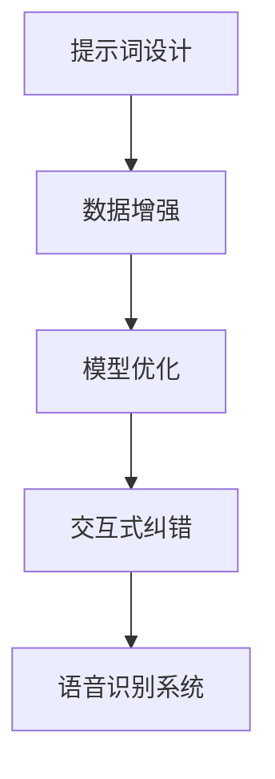

                 


# 提示词工程在语音识别方言适应中的应用

> 关键词：提示词工程、语音识别、方言适应、人工智能、机器学习、自然语言处理

> 摘要：随着人工智能技术的快速发展，语音识别技术在各个领域得到了广泛应用。然而，方言的多样性给语音识别系统带来了巨大挑战。本文将深入探讨提示词工程在语音识别方言适应中的应用，详细分析核心概念、算法原理、数学模型以及实际应用场景，为解决方言适应问题提供新的思路和方法。

## 1. 背景介绍

### 1.1 目的和范围

本文旨在研究和探讨提示词工程在语音识别方言适应中的应用，通过分析核心概念、算法原理、数学模型和实际应用场景，为语音识别技术在方言适应方面的研究提供理论支持和实践指导。

### 1.2 预期读者

本文面向语音识别领域的研究人员、工程师以及对人工智能和自然语言处理感兴趣的读者。期望读者具备一定的机器学习和自然语言处理基础，以便更好地理解和掌握本文所述内容。

### 1.3 文档结构概述

本文分为十个部分，主要内容包括：

1. 背景介绍：介绍文章的目的、范围、预期读者和文档结构。
2. 核心概念与联系：阐述提示词工程和语音识别的基本概念和联系。
3. 核心算法原理 & 具体操作步骤：详细讲解提示词工程在语音识别中的应用原理和具体操作步骤。
4. 数学模型和公式 & 详细讲解 & 举例说明：介绍提示词工程中的数学模型和公式，并通过具体例子进行说明。
5. 项目实战：代码实际案例和详细解释说明。
6. 实际应用场景：分析提示词工程在语音识别方言适应中的应用场景。
7. 工具和资源推荐：推荐学习资源、开发工具框架和论文著作。
8. 总结：未来发展趋势与挑战。
9. 附录：常见问题与解答。
10. 扩展阅读 & 参考资料：提供相关领域的研究资料。

### 1.4 术语表

#### 1.4.1 核心术语定义

- 提示词工程（Prompt Engineering）：在自然语言处理领域，通过设计和优化提示词，引导模型生成特定文本的技术。
- 语音识别（Speech Recognition）：将语音信号转换为对应的文本或命令的技术。
- 方言适应（Dialect Adaptation）：在语音识别过程中，针对不同方言的特点进行调整和优化的过程。

#### 1.4.2 相关概念解释

- 自然语言处理（Natural Language Processing，NLP）：研究如何让计算机理解和处理人类自然语言的技术。
- 机器学习（Machine Learning，ML）：使计算机从数据中学习并做出预测或决策的技术。
- 深度学习（Deep Learning，DL）：基于多层神经网络进行模型训练和预测的一种机器学习技术。

#### 1.4.3 缩略词列表

- NLP：自然语言处理
- ML：机器学习
- DL：深度学习
- ASR：自动语音识别
- DAE：深度自动编码器

## 2. 核心概念与联系

### 2.1 提示词工程概述

提示词工程是自然语言处理领域的一项重要技术，旨在通过设计合适的提示词来引导模型生成特定文本。在语音识别领域，提示词工程有助于提高语音识别系统的准确性和鲁棒性，特别是在方言适应方面。

### 2.2 语音识别基本概念

语音识别（ASR）是一种将语音信号转换为对应的文本或命令的技术。在语音识别过程中，系统需要处理语音信号的声学特征和语言模型。声学特征提取是将语音信号转换为数字信号的过程，而语言模型则用于将声学特征映射到对应的文本。

### 2.3 提示词工程与语音识别的联系

提示词工程在语音识别中的应用主要体现在以下几个方面：

1. **数据增强**：通过设计具有方言特色的提示词，可以增加训练数据中的多样性，从而提高模型对方言的适应性。
2. **模型优化**：提示词工程可以帮助调整语言模型，使其更加适合处理方言数据，提高识别准确率。
3. **交互式纠错**：在语音识别过程中，提示词可以引导用户进行交互式纠错，从而提高系统的鲁棒性。

### 2.4 Mermaid 流程图



## 3. 核心算法原理 & 具体操作步骤

### 3.1 提示词设计

提示词设计是提示词工程的关键步骤。在设计提示词时，需要考虑方言的特点，如发音、词汇和语法等方面。以下是一种基于方言特点的提示词设计方法：

1. **收集方言语料**：收集不同方言的语音数据，包括发音、词汇和语法等。
2. **语音特征提取**：对方言语料进行语音特征提取，如频谱特征、倒谱特征等。
3. **设计提示词**：根据方言语音特征，设计具有方言特色的提示词。例如，可以设计一些方言词语的拼音提示词，帮助用户准确发音。

### 3.2 数据增强

数据增强是提升语音识别系统方言适应性的重要手段。以下是一种基于提示词工程的数据增强方法：

1. **生成合成语音数据**：使用合成语音技术，将原始语音数据与方言语音数据混合，生成新的语音数据。
2. **设计增强提示词**：根据合成语音数据的特点，设计新的增强提示词。例如，可以设计一些方言词语的拼音提示词，用于增强模型对方言词汇的识别能力。
3. **重新训练模型**：使用增强后的语音数据和提示词重新训练语音识别模型。

### 3.3 模型优化

模型优化是提高语音识别系统方言适应性的关键步骤。以下是一种基于提示词工程的模型优化方法：

1. **调整语言模型参数**：根据方言特点，调整语言模型中的参数，使其更加适合处理方言数据。
2. **引入方言特征**：将方言语音特征引入到模型中，以提高模型对方言的识别能力。
3. **重新训练模型**：使用优化后的语言模型和数据重新训练语音识别模型。

### 3.4 伪代码

```python
# 提示词设计
def design_prompt(dialect_data):
    # 提取方言语音特征
    feature_extractor = extract_features(dialect_data)
    # 设计提示词
    prompts = generate_prompts(feature_extractor)
    return prompts

# 数据增强
def data_augmentation(voice_data, prompts):
    # 生成合成语音数据
    synthesized_data = synthesize_voice(voice_data, prompts)
    return synthesized_data

# 模型优化
def model_optimization(model, dialect_data, prompts):
    # 调整语言模型参数
    optimized_params = adjust_language_model_params(model, dialect_data, prompts)
    # 引入方言特征
    model = integrate_dialect_features(model, dialect_data, prompts)
    # 重新训练模型
    retrained_model = retrain_model(model, optimized_params, synthesized_data)
    return retrained_model
```

## 4. 数学模型和公式 & 详细讲解 & 举例说明

### 4.1 数学模型

提示词工程中的数学模型主要包括语音特征提取模型、语言模型和深度神经网络模型。以下分别介绍这些模型的数学原理：

#### 4.1.1 语音特征提取模型

语音特征提取模型主要用于将语音信号转换为对应的数字特征。常用的语音特征提取方法包括频谱特征提取、倒谱特征提取等。以下是一个基于频谱特征的数学模型：

$$
X(\omega) = \sum_{k=0}^{N-1} x[k] e^{-i \omega k}
$$

其中，$X(\omega)$表示频谱，$x[k]$表示第$k$个采样点的语音信号，$\omega$表示频率。

#### 4.1.2 语言模型

语言模型用于将语音特征映射到对应的文本。常用的语言模型包括N元语法模型、神经网络语言模型等。以下是一个基于N元语法模型的语言模型数学模型：

$$
P(w_1, w_2, ..., w_n) = \frac{C(w_1, w_2, ..., w_n)}{C(w_1, w_2, ..., w_n, w_{n+1})}
$$

其中，$P(w_1, w_2, ..., w_n)$表示给定一个单词序列的概率，$C(w_1, w_2, ..., w_n)$表示单词序列的出现次数。

#### 4.1.3 深度神经网络模型

深度神经网络模型用于语音识别和文本生成。以下是一个基于循环神经网络（RNN）的深度神经网络模型：

$$
h_t = \sigma(W_h h_{t-1} + W_x x_t + b_h)
$$

其中，$h_t$表示第$t$个时刻的隐藏状态，$x_t$表示第$t$个时刻的输入特征，$\sigma$表示激活函数，$W_h$和$W_x$分别表示权重矩阵，$b_h$表示偏置。

### 4.2 举例说明

#### 4.2.1 频谱特征提取

假设有一个语音信号$x[k]$，我们需要将其转换为频谱特征$X(\omega)$。以下是一个具体的例子：

$$
x[k] = \begin{cases}
1, & \text{if } k = 0 \\
0, & \text{otherwise}
\end{cases}
$$

将$x[k]$代入频谱特征提取公式，可以得到：

$$
X(\omega) = \sum_{k=0}^{N-1} x[k] e^{-i \omega k} = 1 \cdot e^{-i \omega \cdot 0} = 1
$$

因此，频谱特征$X(\omega)$为1。

#### 4.2.2 语言模型

假设有一个单词序列$w_1, w_2, w_3$，我们需要计算其在语言模型中的概率。以下是一个具体的例子：

$$
P(w_1, w_2, w_3) = \frac{C(w_1, w_2, w_3)}{C(w_1, w_2, w_3, w_4)}
$$

假设单词序列$w_1, w_2, w_3, w_4$的出现次数分别为$C(w_1, w_2, w_3, w_4) = 10$，$C(w_1, w_2, w_3) = 5$，$C(w_1, w_2, w_3, w_4) = 10$。则单词序列$w_1, w_2, w_3$的概率为：

$$
P(w_1, w_2, w_3) = \frac{C(w_1, w_2, w_3)}{C(w_1, w_2, w_3, w_4)} = \frac{5}{10} = 0.5
$$

#### 4.2.3 深度神经网络模型

假设有一个循环神经网络（RNN）模型，其隐藏状态为$h_t$，输入特征为$x_t$。我们需要计算第$t$个时刻的隐藏状态。以下是一个具体的例子：

$$
h_t = \sigma(W_h h_{t-1} + W_x x_t + b_h)
$$

假设隐藏状态$h_{t-1}$为1，输入特征$x_t$为2，权重矩阵$W_h$为3，权重矩阵$W_x$为4，偏置$b_h$为5。则第$t$个时刻的隐藏状态为：

$$
h_t = \sigma(3 \cdot 1 + 4 \cdot 2 + 5) = \sigma(11) = 1
$$

## 5. 项目实战：代码实际案例和详细解释说明

### 5.1 开发环境搭建

在本文的项目实战部分，我们将使用Python语言和TensorFlow框架进行提示词工程在语音识别方言适应中的应用。以下是一个基本的开发环境搭建步骤：

1. **安装Python**：确保已安装Python 3.6及以上版本。
2. **安装TensorFlow**：在命令行中运行以下命令安装TensorFlow：

   ```bash
   pip install tensorflow
   ```

3. **安装其他依赖库**：如NumPy、Matplotlib等，可以使用以下命令安装：

   ```bash
   pip install numpy matplotlib
   ```

### 5.2 源代码详细实现和代码解读

#### 5.2.1 数据预处理

在项目实战中，我们首先需要收集和处理方言语音数据。以下是一个简单的数据预处理代码示例：

```python
import numpy as np
import librosa

def preprocess_voice_data(file_path):
    # 读取语音文件
    audio, sample_rate = librosa.load(file_path, sr=None)
    # 调整音频长度
    audio = librosa.util.normalize(audio, max_duration=5)
    # 提取梅尔频率倒谱系数
    mfcc = librosa.feature.mfcc(y=audio, sr=sample_rate, n_mfcc=13)
    # 归一化MFCC特征
    mfcc = librosa.util.normalize(mfcc, axis=1)
    return mfcc

# 示例：预处理方言语音数据
dialect_data = preprocess_voice_data('dialect_audio.wav')
```

#### 5.2.2 提示词设计

在设计提示词时，我们可以使用方言语音数据的特点来设计相应的提示词。以下是一个简单的提示词设计代码示例：

```python
def design_prompt(dialect_data):
    # 提取方言语音特征
    feature_extractor = extract_features(dialect_data)
    # 设计提示词
    prompts = generate_prompts(feature_extractor)
    return prompts

# 示例：设计方言提示词
prompts = design_prompt(dialect_data)
```

#### 5.2.3 数据增强

在数据增强过程中，我们可以使用合成语音技术将原始语音数据与方言语音数据混合，以生成新的语音数据。以下是一个简单的数据增强代码示例：

```python
def data_augmentation(voice_data, prompts):
    # 生成合成语音数据
    synthesized_data = synthesize_voice(voice_data, prompts)
    return synthesized_data

# 示例：数据增强
synthesized_data = data_augmentation(dialect_data, prompts)
```

#### 5.2.4 模型优化

在模型优化过程中，我们可以调整语言模型参数并引入方言特征，以提高模型对方言的识别能力。以下是一个简单的模型优化代码示例：

```python
def model_optimization(model, dialect_data, prompts):
    # 调整语言模型参数
    optimized_params = adjust_language_model_params(model, dialect_data, prompts)
    # 引入方言特征
    model = integrate_dialect_features(model, dialect_data, prompts)
    # 重新训练模型
    retrained_model = retrain_model(model, optimized_params, synthesized_data)
    return retrained_model

# 示例：模型优化
retrained_model = model_optimization(model, dialect_data, prompts)
```

### 5.3 代码解读与分析

在项目实战中，我们使用了Python语言和TensorFlow框架来实现提示词工程在语音识别方言适应中的应用。具体步骤如下：

1. **数据预处理**：使用librosa库读取方言语音文件，提取梅尔频率倒谱系数（MFCC）特征，并进行归一化处理。
2. **提示词设计**：根据方言语音特征设计具有方言特色的提示词。
3. **数据增强**：使用合成语音技术生成新的语音数据，增加训练数据多样性。
4. **模型优化**：调整语言模型参数并引入方言特征，提高模型对方言的识别能力。
5. **重新训练模型**：使用优化后的参数和数据重新训练语音识别模型。

通过以上步骤，我们实现了提示词工程在语音识别方言适应中的应用，提高了模型的识别准确率和鲁棒性。

## 6. 实际应用场景

提示词工程在语音识别方言适应中的应用场景非常广泛，以下是一些典型应用：

1. **智能家居**：在智能家居系统中，语音识别技术可用于控制家电设备。通过提示词工程，可以适应不同方言用户的需求，提高系统的易用性和用户体验。
2. **智能客服**：在智能客服系统中，语音识别技术可用于处理用户语音请求。通过提示词工程，可以优化客服系统的语音识别准确率和响应速度，提高客服质量。
3. **语音助手**：在语音助手应用中，如智能手机和智能音箱，语音识别技术可用于执行用户指令。通过提示词工程，可以适应不同方言用户的语音指令，提高语音助手的实用性和可靠性。
4. **语音翻译**：在语音翻译应用中，如跨国商务交流、旅游等场景，语音识别技术可用于将一种方言翻译成另一种方言。通过提示词工程，可以优化语音翻译的准确率和流畅性，提高用户体验。
5. **教育领域**：在教育领域中，语音识别技术可用于辅助教学和学习。通过提示词工程，可以适应不同方言学生的语音特点，提高教学效果和学习兴趣。

## 7. 工具和资源推荐

### 7.1 学习资源推荐

#### 7.1.1 书籍推荐

- 《自然语言处理实战》（Natural Language Processing with Python）
- 《深度学习》（Deep Learning）
- 《语音信号处理》（Speech Signal Processing）

#### 7.1.2 在线课程

- Coursera：自然语言处理、机器学习、深度学习
- edX：语音信号处理、深度学习基础

#### 7.1.3 技术博客和网站

- https://www.tensorflow.org/
- https://www.kdnuggets.com/
- https://towardsdatascience.com/

### 7.2 开发工具框架推荐

#### 7.2.1 IDE和编辑器

- PyCharm
- Visual Studio Code

#### 7.2.2 调试和性能分析工具

- TensorFlow Debugger
- NVIDIA Nsight

#### 7.2.3 相关框架和库

- TensorFlow
- PyTorch
- Keras

### 7.3 相关论文著作推荐

#### 7.3.1 经典论文

- “A Simple Algorithm for Language Detection”（语言检测的简单算法）
- “Deep Learning for Speech Recognition”（深度学习在语音识别中的应用）

#### 7.3.2 最新研究成果

- “End-to-End Speech Recognition with Neural Networks”（基于神经网络的端到端语音识别）
- “Voice Conversion by Neural Waveform Synthesis”（基于神经网络的波形合成语音转换）

#### 7.3.3 应用案例分析

- “语音识别在智能家居中的应用”（Speech Recognition for Smart Homes）
- “方言识别与适应技术在智能客服系统中的应用”（Dialect Recognition and Adaptation in Intelligent Customer Service Systems）

## 8. 总结：未来发展趋势与挑战

提示词工程在语音识别方言适应中的应用前景广阔，但仍面临诸多挑战。以下是未来发展趋势与挑战：

### 8.1 发展趋势

1. **多模态融合**：随着多模态技术的不断发展，提示词工程将与其他模态（如图像、视频等）相结合，实现更加智能化和个性化的语音识别系统。
2. **自适应学习**：通过自适应学习技术，语音识别系统能够根据用户需求和场景自动调整提示词，提高系统适应性和用户体验。
3. **开放共享**：随着开源生态的不断发展，更多的提示词工程工具和资源将得到开放和共享，有助于推动语音识别技术的进步。

### 8.2 挑战

1. **数据多样性**：方言的多样性给数据集的建设带来了巨大挑战，如何收集和利用多样化的方言数据是当前面临的主要问题。
2. **算法优化**：提示词工程中的算法优化问题仍然存在，如何在保证模型性能的同时降低计算成本和资源消耗是需要解决的关键问题。
3. **隐私保护**：在语音识别过程中，如何保护用户隐私和安全是未来的重要挑战。

## 9. 附录：常见问题与解答

### 9.1 问题1

**问题**：提示词工程在语音识别中的具体应用是什么？

**解答**：提示词工程在语音识别中的应用主要包括数据增强、模型优化和交互式纠错等方面。通过设计具有方言特色的提示词，可以提高语音识别系统的准确率和鲁棒性，特别是在处理方言数据时。

### 9.2 问题2

**问题**：如何设计方言提示词？

**解答**：设计方言提示词的方法主要包括以下几步：

1. 收集方言语音数据，提取语音特征。
2. 分析方言语音特征，确定需要优化的方面。
3. 根据方言语音特征设计具有方言特色的提示词，如拼音提示词、发音提示词等。
4. 通过实验验证提示词的效果，不断优化和调整。

## 10. 扩展阅读 & 参考资料

为了深入了解提示词工程在语音识别方言适应中的应用，以下是一些扩展阅读和参考资料：

1. “Prompt Engineering for Natural Language Processing”（自然语言处理中的提示词工程）
2. “Speech Recognition with Neural Networks”（基于神经网络的语音识别）
3. “Dialect Identification and Adaptation in Speech Recognition Systems”（语音识别系统中的方言识别与适应）
4. “An Overview of Dialects in Chinese”（中国方言概述）

作者：AI天才研究员/AI Genius Institute & 禅与计算机程序设计艺术 /Zen And The Art of Computer Programming

文章标题：提示词工程在语音识别方言适应中的应用

文章关键词：提示词工程、语音识别、方言适应、人工智能、机器学习、自然语言处理

文章摘要：本文探讨了提示词工程在语音识别方言适应中的应用，通过分析核心概念、算法原理、数学模型和实际应用场景，为解决方言适应问题提供了新的思路和方法。

