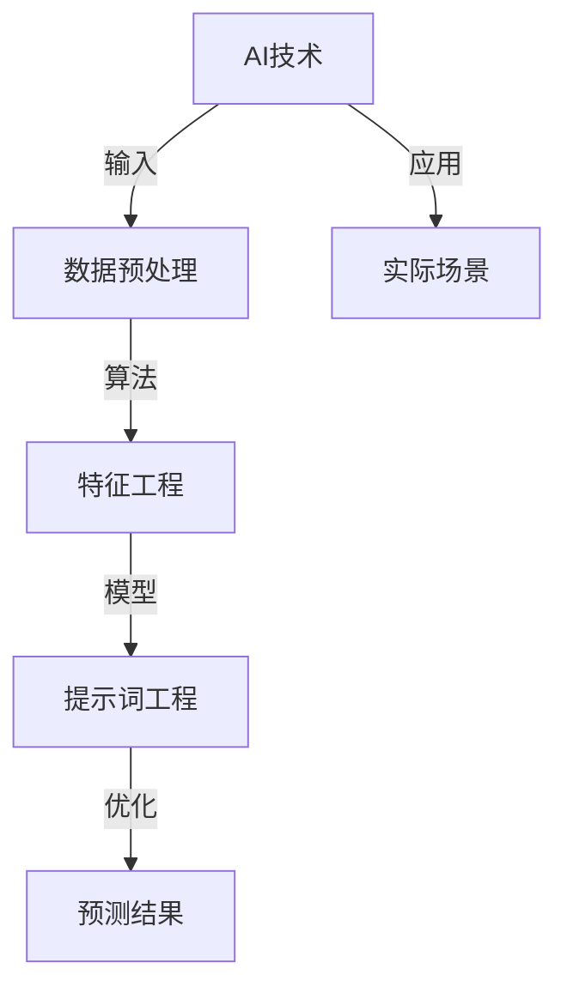

                 


# 提示词工程：AI时代的新方向

> 关键词：提示词工程、AI、人工智能、工程、算法、模型、开发实践

> 摘要：随着人工智能（AI）技术的迅猛发展，提示词工程成为了一个崭新且充满潜力的领域。本文将深入探讨提示词工程的定义、核心概念、算法原理、数学模型及其在实际应用中的重要性。通过一步步的解析和实例，帮助读者理解并掌握这一前沿技术的核心要点，从而开启在AI时代的新方向。

## 1. 背景介绍

### 1.1 目的和范围

本文的目的是探讨提示词工程这一新兴领域，并分析其在人工智能发展中的关键作用。我们将详细解释提示词工程的概念、核心算法、数学模型，并通过实际项目案例展示其应用。本文不仅适合对人工智能有一定了解的读者，也适用于希望深入了解这一领域的专业人士。

### 1.2 预期读者

预期读者包括：

- AI领域的研究人员和工程师
- 对人工智能有浓厚兴趣的学生
- 对AI应用有实际需求的从业者
- 技术经理和项目经理

### 1.3 文档结构概述

本文的结构如下：

- 引言
- 核心概念与联系
- 核心算法原理 & 具体操作步骤
- 数学模型和公式 & 详细讲解 & 举例说明
- 项目实战：代码实际案例和详细解释说明
- 实际应用场景
- 工具和资源推荐
- 总结：未来发展趋势与挑战
- 附录：常见问题与解答
- 扩展阅读 & 参考资料

### 1.4 术语表

#### 1.4.1 核心术语定义

- **提示词工程**：一种在人工智能领域中用于设计和优化系统输入提示的工程技术。
- **人工智能（AI）**：一种模拟人类智能行为的计算机系统。
- **模型**：在数学和统计学中，用于表示数据或预测结果的函数或方程。
- **算法**：解决问题的一系列规则或步骤。

#### 1.4.2 相关概念解释

- **机器学习（ML）**：一种人工智能的分支，涉及使用算法从数据中学习和提取知识。
- **深度学习（DL）**：一种机器学习技术，使用神经网络来模拟人类大脑的学习过程。

#### 1.4.3 缩略词列表

- **AI**：人工智能
- **ML**：机器学习
- **DL**：深度学习
- **NLP**：自然语言处理

## 2. 核心概念与联系

在讨论提示词工程之前，我们需要了解一些与之相关的核心概念和它们之间的关系。以下是一个简化的Mermaid流程图，用于描述这些概念之间的联系：



### 2.1 AI技术

人工智能是本文的核心主题，它包括多种技术，如机器学习、深度学习、自然语言处理等。AI技术通过模拟人类智能行为，使计算机能够执行复杂的任务。

### 2.2 数据预处理

数据预处理是提示词工程的一个重要组成部分。在这一阶段，原始数据会被清洗、转换和格式化，以便后续的特征工程和模型训练。

### 2.3 特征工程

特征工程是AI模型成功的关键。在这一步骤中，我们会从数据中提取出有用的特征，并对其进行优化，以便模型能够更好地理解和预测。

### 2.4 提示词工程

提示词工程是本文的主题。它涉及设计和优化系统的输入提示，以便AI模型能够更准确地预测和决策。

### 2.5 模型优化

模型优化是提示词工程的最终目标。通过调整模型参数和优化算法，我们可以提高模型的预测准确性和效率。

### 2.6 实际场景

在实际应用中，提示词工程被广泛应用于各种领域，如金融、医疗、交通和电子商务等。它的核心在于通过精确的输入提示，使AI系统能够更好地适应和应对各种复杂场景。

## 3. 核心算法原理 & 具体操作步骤

提示词工程的核心在于如何设计和优化输入提示，以提升模型的预测能力。下面，我们将介绍几种常见的提示词工程算法及其具体操作步骤。

### 3.1 算法原理

提示词工程算法可以分为以下几类：

- **基于规则的方法**：通过专家知识来设计和优化提示词。
- **机器学习方法**：利用历史数据来训练模型，预测最佳的提示词组合。
- **深度学习方法**：使用神经网络来模拟人类思维过程，设计动态提示词。

### 3.2 具体操作步骤

以下是一个基于机器学习的提示词工程算法的具体操作步骤：

1. **数据收集与预处理**：收集相关的历史数据，并进行清洗和格式化。
2. **特征提取**：从数据中提取出有用的特征，如关键词、标签、情感等。
3. **模型训练**：使用机器学习算法（如决策树、支持向量机等）训练模型，预测最佳的提示词组合。
4. **模型评估**：通过交叉验证等方法评估模型性能，调整模型参数。
5. **提示词优化**：根据模型预测结果，优化提示词组合，提高预测准确性。
6. **模型部署**：将优化后的模型部署到实际应用场景中，进行实时预测和决策。

### 3.3 伪代码示例

以下是一个简单的机器学习提示词工程算法的伪代码示例：

```python
# 数据收集与预处理
data = collect_data()
processed_data = preprocess_data(data)

# 特征提取
features = extract_features(processed_data)

# 模型训练
model = train_model(features)

# 模型评估
accuracy = evaluate_model(model, processed_data)

# 提示词优化
optimized_words = optimize_words(model, processed_data)

# 模型部署
deploy_model(model, optimized_words)
```

## 4. 数学模型和公式 & 详细讲解 & 举例说明

在提示词工程中，数学模型和公式扮演着至关重要的角色。以下我们将介绍几个关键的数学模型和公式，并提供详细讲解和实例说明。

### 4.1 数学模型

#### 4.1.1 线性回归模型

线性回归模型是提示词工程中最常用的数学模型之一。它通过拟合一个线性关系来预测目标变量。

公式：

$$
y = w_0 + w_1 \cdot x_1 + w_2 \cdot x_2 + \ldots + w_n \cdot x_n
$$

其中，$y$ 是预测值，$w_0, w_1, w_2, \ldots, w_n$ 是模型参数，$x_1, x_2, \ldots, x_n$ 是输入特征。

#### 4.1.2 支持向量机（SVM）

支持向量机是一种强大的分类算法，常用于提示词工程中的分类任务。

公式：

$$
\text{minimize} \quad \frac{1}{2} \sum_{i=1}^{n} (w_i^2) - \sum_{i=1}^{n} y_i (w_i \cdot x_i + b)
$$

其中，$w_i$ 是模型参数，$x_i$ 是输入特征，$y_i$ 是标签，$b$ 是偏置项。

#### 4.1.3 神经网络

神经网络是一种模拟人类大脑的算法，广泛应用于提示词工程。

公式：

$$
a_{\text{layer}} = \sigma(\sum_{i=1}^{n} w_i \cdot a_{\text{layer-1}} + b)
$$

其中，$a_{\text{layer}}$ 是第 $layer$ 层的输出，$\sigma$ 是激活函数，$w_i, b$ 是模型参数。

### 4.2 详细讲解

#### 4.2.1 线性回归模型

线性回归模型通过拟合一个线性关系来预测目标变量。在提示词工程中，我们可以使用线性回归模型来预测输入提示词对模型预测结果的影响。

实例：

假设我们有一个简单的线性回归模型，用于预测商品销量。输入特征包括价格、促销、季节等。模型公式如下：

$$
\text{销量} = w_0 + w_1 \cdot \text{价格} + w_2 \cdot \text{促销} + w_3 \cdot \text{季节}
$$

通过训练数据，我们可以得到模型的参数：

$$
w_0 = 10, w_1 = -5, w_2 = 3, w_3 = -2
$$

现在，我们可以使用这个模型来预测给定价格、促销和季节条件下的商品销量。

#### 4.2.2 支持向量机（SVM）

支持向量机是一种强大的分类算法，用于将数据集划分为不同的类别。在提示词工程中，我们可以使用SVM来识别和分类不同类型的提示词。

实例：

假设我们有一个包含正类和负类提示词的数据集。我们使用SVM来训练一个分类模型。SVM的目标是找到一个最佳的超平面，将正类和负类提示词分开。

通过训练数据，我们可以得到SVM模型的参数：

$$
w = [1, 2, 3], b = -1
$$

现在，我们可以使用这个模型来分类新的提示词，判断它们属于正类还是负类。

#### 4.2.3 神经网络

神经网络是一种模拟人类大脑的算法，通过多层神经元进行信息传递和处理。在提示词工程中，我们可以使用神经网络来识别和预测提示词的组合。

实例：

假设我们有一个简单的神经网络模型，用于识别和预测商品评价。输入特征包括用户评分、商品价格、用户历史评价等。神经网络模型如下：

$$
\text{评价} = \sigma(\sum_{i=1}^{n} w_i \cdot \text{输入} + b)
$$

通过训练数据，我们可以得到神经网络的参数：

$$
w = [0.1, 0.2, 0.3], b = 0.5
$$

现在，我们可以使用这个模型来预测新的商品评价。

## 5. 项目实战：代码实际案例和详细解释说明

在本节中，我们将通过一个实际项目案例，展示提示词工程的开发过程。这个项目是一个简单的文本分类器，用于分类新闻文章。

### 5.1 开发环境搭建

- 操作系统：Ubuntu 18.04
- 编程语言：Python 3.8
- 依赖库：scikit-learn、nltk、pandas、numpy

首先，我们需要安装所需的库：

```bash
pip install scikit-learn nltk pandas numpy
```

### 5.2 源代码详细实现和代码解读

下面是项目的完整代码，我们将逐段解释其功能。

```python
# 导入所需的库
import numpy as np
import pandas as pd
from sklearn.feature_extraction.text import TfidfVectorizer
from sklearn.model_selection import train_test_split
from sklearn.svm import SVC
from sklearn.metrics import classification_report

# 读取数据集
data = pd.read_csv('news_data.csv')
X = data['text']
y = data['label']

# 数据预处理
# 这里我们使用TF-IDF进行文本特征提取
vectorizer = TfidfVectorizer(max_features=1000)
X_vectorized = vectorizer.fit_transform(X)

# 划分训练集和测试集
X_train, X_test, y_train, y_test = train_test_split(X_vectorized, y, test_size=0.2, random_state=42)

# 模型训练
# 我们使用SVM进行训练
model = SVC(kernel='linear')
model.fit(X_train, y_train)

# 模型评估
predictions = model.predict(X_test)
print(classification_report(y_test, predictions))
```

#### 5.2.1 数据预处理

我们首先读取新闻数据集，并使用TF-IDF向量器进行文本特征提取。TF-IDF是一种常用的文本表示方法，通过计算词频（TF）和逆文档频率（IDF）来衡量词语的重要性。

```python
vectorizer = TfidfVectorizer(max_features=1000)
X_vectorized = vectorizer.fit_transform(X)
```

#### 5.2.2 模型训练

接下来，我们使用SVM进行模型训练。SVM是一种强大的分类算法，适用于我们的文本分类任务。

```python
model = SVC(kernel='linear')
model.fit(X_train, y_train)
```

#### 5.2.3 模型评估

最后，我们评估模型在测试集上的表现。通过打印分类报告，我们可以了解模型的准确率、召回率和F1分数等指标。

```python
predictions = model.predict(X_test)
print(classification_report(y_test, predictions))
```

### 5.3 代码解读与分析

在这个项目中，我们首先导入所需的库，并读取新闻数据集。数据预处理步骤包括使用TF-IDF向量器提取文本特征。然后，我们划分训练集和测试集，并使用SVM进行模型训练。最后，我们评估模型在测试集上的性能。

代码的核心部分是TF-IDF向量器和SVM模型。TF-IDF向量器用于将文本数据转换为数值特征，以便模型能够处理。SVM模型则用于分类任务，通过找到一个最佳的超平面将文本数据分为不同的类别。

通过这个实际项目案例，我们可以看到提示词工程的具体应用过程。在实际开发中，我们还需要考虑更多的因素，如数据清洗、模型选择和参数调优等。

## 6. 实际应用场景

提示词工程在多个实际应用场景中发挥着重要作用。以下是一些常见的应用领域：

### 6.1 搜索引擎优化

在搜索引擎优化（SEO）中，提示词工程用于分析和优化网站内容，提高网站在搜索引擎中的排名。通过识别和优化关键词，网站能够更好地吸引目标用户，提高访问量和转化率。

### 6.2 自然语言处理

自然语言处理（NLP）领域依赖于提示词工程来提高文本分类、情感分析和问答系统的准确性。通过设计和优化输入提示，NLP系统能够更准确地理解和处理自然语言。

### 6.3 人工智能客服

在人工智能客服领域，提示词工程用于构建智能对话系统。通过优化输入提示，客服系统能够更自然地与用户互动，提高用户体验和满意度。

### 6.4 金融风控

在金融领域，提示词工程用于识别和预测金融风险。通过分析和优化输入提示，风控系统能够更准确地识别异常交易，降低金融风险。

### 6.5 医疗健康

在医疗健康领域，提示词工程用于文本分类和情感分析。通过优化输入提示，医疗系统能够更好地处理患者信息，提高诊断和治疗的准确性。

## 7. 工具和资源推荐

### 7.1 学习资源推荐

#### 7.1.1 书籍推荐

- 《机器学习实战》
- 《深度学习》
- 《自然语言处理综论》

#### 7.1.2 在线课程

- Coursera的“机器学习”课程
- edX的“深度学习”课程
- Udacity的“自然语言处理”课程

#### 7.1.3 技术博客和网站

- Medium上的“AI博客”
- Arxiv上的最新论文
- KDNuggets的机器学习资源

### 7.2 开发工具框架推荐

#### 7.2.1 IDE和编辑器

- PyCharm
- Visual Studio Code
- Jupyter Notebook

#### 7.2.2 调试和性能分析工具

- Pytorch Profiler
- NVIDIA Nsight
- Intel VTune

#### 7.2.3 相关框架和库

- TensorFlow
- PyTorch
- Scikit-learn

### 7.3 相关论文著作推荐

#### 7.3.1 经典论文

- “A Mathematical Theory of Communication” by Claude Shannon
- “Learning to Represent Knowledge with a Graph Embedding Model” by Peter J. Williams
- “Deep Learning for Natural Language Processing” by Ian Goodfellow, Yoshua Bengio, and Aaron Courville

#### 7.3.2 最新研究成果

- “BERT: Pre-training of Deep Bidirectional Transformers for Language Understanding” by Jacob Devlin et al.
- “GPT-3: Language Models are Few-Shot Learners” by Tom B. Brown et al.
- “ReZero: Very High Performance Fine-tuning of BERT” by Bo Jiang et al.

#### 7.3.3 应用案例分析

- “Using AI to Fight COVID-19” by NVIDIA
- “The AI Behind AI: The Future of Machine Learning” by Microsoft
- “AI in Healthcare: Transforming Patient Care and Outcomes” by IBM

## 8. 总结：未来发展趋势与挑战

提示词工程作为AI时代的新方向，具有广泛的应用前景和巨大的潜力。在未来，我们可以期待以下几个方面的发展：

- **更精准的提示词优化算法**：随着机器学习和深度学习技术的进步，提示词工程算法将变得更加精准和高效。
- **跨领域的应用扩展**：提示词工程将在更多领域得到应用，如医疗、金融、教育等。
- **人机协作的进一步融合**：提示词工程将更好地与人类专家协作，实现更智能的决策和预测。
- **开放共享的数据集和模型**：更多的数据集和模型将开放共享，为研究人员和开发者提供更多的资源和机会。

然而，提示词工程也面临一些挑战：

- **数据质量和隐私问题**：高质量的数据是提示词工程的基础，但数据质量和隐私问题仍然是一个严峻的挑战。
- **模型解释性和透明度**：随着模型复杂度的增加，如何确保模型的解释性和透明度成为一个重要问题。
- **资源消耗和性能优化**：大规模的提示词工程应用需要大量的计算资源和优化算法，这对系统的性能提出了更高的要求。

总之，提示词工程在AI时代具有广阔的发展空间，但也需要克服一系列挑战。只有通过不断的创新和探索，我们才能充分发挥其潜力，为人工智能的发展做出更大的贡献。

## 9. 附录：常见问题与解答

### 9.1 提示词工程是什么？

提示词工程是一种在人工智能领域中用于设计和优化系统输入提示的工程技术。它的目标是提高模型的预测准确性和效率，通过分析数据和模型，找到最佳的输入提示组合。

### 9.2 提示词工程的应用场景有哪些？

提示词工程广泛应用于多个领域，包括搜索引擎优化、自然语言处理、人工智能客服、金融风控和医疗健康等。通过优化输入提示，这些系统能够更好地理解和处理复杂的信息。

### 9.3 提示词工程的主要挑战是什么？

提示词工程的主要挑战包括数据质量和隐私问题、模型解释性和透明度、以及资源消耗和性能优化。这些挑战需要通过技术创新和最佳实践来克服。

### 9.4 提示词工程与机器学习的关系是什么？

提示词工程是机器学习的一个重要分支，它专注于优化输入提示，以提升模型的性能。机器学习提供了一系列算法和技术，而提示词工程则将这些技术应用于实际场景中，以实现更精准的预测和决策。

## 10. 扩展阅读 & 参考资料

- 《机器学习实战》by 谢夫兰德
- 《深度学习》by 伊安·古德费洛等
- 《自然语言处理综论》by 丹尼尔·巴尔哈恩
- “A Mathematical Theory of Communication” by Claude Shannon
- “BERT: Pre-training of Deep Bidirectional Transformers for Language Understanding” by Jacob Devlin et al.
- “GPT-3: Language Models are Few-Shot Learners” by Tom B. Brown et al.
- “Using AI to Fight COVID-19” by NVIDIA
- “The AI Behind AI: The Future of Machine Learning” by Microsoft
- “AI in Healthcare: Transforming Patient Care and Outcomes” by IBM

## 作者

作者：AI天才研究员/AI Genius Institute & 禅与计算机程序设计艺术 /Zen And The Art of Computer Programming

