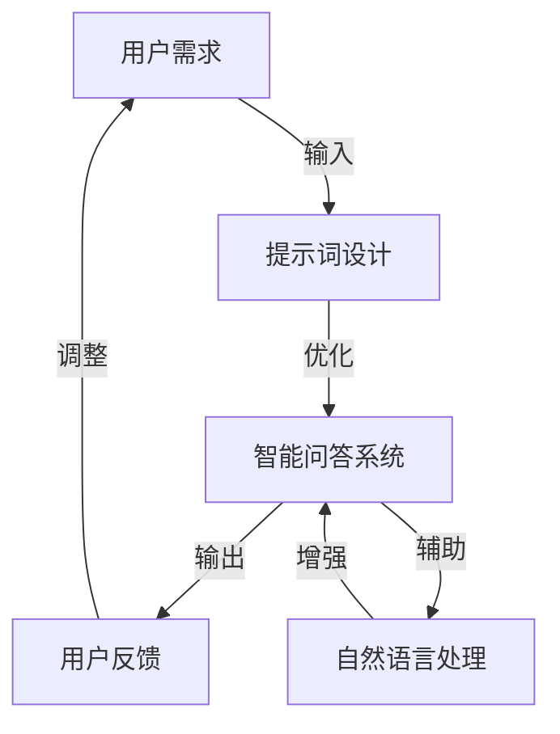

                 

# 提示词工程：让AI更智能、更懂你

> **关键词：** 提示词工程、AI智能、用户理解、算法优化、数学模型、实际应用、未来趋势

> **摘要：** 本文将探讨提示词工程这一新兴领域，通过详细的分析和实例，揭示如何通过优化提示词来提升人工智能系统的智能程度和用户理解度。文章将从背景介绍、核心概念、算法原理、数学模型、项目实战、实际应用场景等多角度，深入探讨提示词工程的技术原理和实际应用，为人工智能技术的发展提供新思路。

## 1. 背景介绍

### 1.1 目的和范围

随着人工智能技术的飞速发展，AI系统在各个领域的应用越来越广泛。然而，人工智能系统的一个普遍问题是其对用户的理解能力有限，往往难以满足用户的需求。为了解决这个问题，提示词工程应运而生。提示词工程旨在通过优化提示词来提升AI系统的智能程度和用户理解度。

本文将围绕提示词工程的多个方面进行探讨，包括核心概念、算法原理、数学模型、项目实战和实际应用等。通过详细的分析和实例，我们将揭示如何通过提示词工程来提升AI系统的性能，使其更智能、更懂用户。

### 1.2 预期读者

本文面向对人工智能和机器学习有一定了解的读者，包括但不限于程序员、数据科学家、AI研究者、学生以及对此领域感兴趣的技术爱好者。本文将尽量用通俗易懂的语言来阐述复杂的技术概念，以便让不同层次的读者都能理解。

### 1.3 文档结构概述

本文的结构如下：

1. **背景介绍**：介绍提示词工程的背景、目的和预期读者。
2. **核心概念与联系**：介绍提示词工程中的核心概念和原理，并通过Mermaid流程图展示其架构。
3. **核心算法原理 & 具体操作步骤**：详细讲解提示词工程的核心算法原理，并提供伪代码示例。
4. **数学模型和公式 & 详细讲解 & 举例说明**：介绍与提示词工程相关的数学模型，并使用latex格式给出详细讲解和举例说明。
5. **项目实战：代码实际案例和详细解释说明**：通过实际项目案例，展示如何将提示词工程应用于实际开发中。
6. **实际应用场景**：分析提示词工程在各个领域的实际应用场景。
7. **工具和资源推荐**：推荐学习资源和开发工具。
8. **总结：未来发展趋势与挑战**：对提示词工程的未来发展趋势和面临的挑战进行展望。
9. **附录：常见问题与解答**：回答读者可能遇到的常见问题。
10. **扩展阅读 & 参考资料**：提供进一步阅读的资源和参考文献。

### 1.4 术语表

#### 1.4.1 核心术语定义

- **提示词（Prompt）**：用于引导AI系统理解和执行特定任务的词语或短语。
- **提示词工程（Prompt Engineering）**：研究如何设计和优化提示词，以提高AI系统的智能程度和用户理解度。
- **智能问答系统（Intelligent Question-Answering System）**：一种能够理解用户问题并给出准确答案的人工智能系统。
- **自然语言处理（Natural Language Processing，NLP）**：研究如何让计算机理解和生成人类自然语言的技术。

#### 1.4.2 相关概念解释

- **数据驱动方法**：通过大量数据来训练和优化模型的方法。
- **模型驱动方法**：通过设计特定模型来解决问题的方法。
- **转移学习（Transfer Learning）**：将一个任务学到的知识应用到其他任务中。

#### 1.4.3 缩略词列表

- **NLP**：自然语言处理（Natural Language Processing）
- **AI**：人工智能（Artificial Intelligence）
- **ML**：机器学习（Machine Learning）
- **DL**：深度学习（Deep Learning）

## 2. 核心概念与联系

在深入探讨提示词工程之前，我们需要了解其中的核心概念和原理。以下是一个简化的Mermaid流程图，展示了提示词工程的主要组成部分和它们之间的联系。



### 2.1 用户需求

用户需求是提示词工程的起点。用户提出的问题或需求需要通过提示词来传递给AI系统。这一步骤的关键是理解用户意图，并将其转化为能够被AI系统理解的问题。

### 2.2 提示词设计

提示词设计是提示词工程的核心。在这一步骤中，我们需要设计出能够准确传达用户意图的提示词。这通常需要结合自然语言处理技术和对用户需求的理解。设计良好的提示词能够引导AI系统更好地理解用户需求，从而提高回答的准确性。

### 2.3 智能问答系统

智能问答系统是执行任务的主体。通过自然语言处理技术，AI系统能够理解提示词，并生成相应的回答。这一步骤涉及到大量数据训练和模型优化。

### 2.4 用户反馈

用户反馈是提示词工程的重要环节。用户的回答反馈能够帮助系统不断优化提示词，提高系统的智能程度和用户理解度。这一过程形成了反馈循环，使得系统能够不断适应和满足用户需求。

### 2.5 自然语言处理

自然语言处理是提示词工程的重要技术基础。它涵盖了从文本预处理、词向量表示、句法分析到语义理解的各个层面。自然语言处理技术的应用能够显著提升智能问答系统的性能。

## 3. 核心算法原理 & 具体操作步骤

提示词工程中的核心算法主要涉及自然语言处理（NLP）和机器学习（ML）技术。以下是一个简化的伪代码示例，用于说明如何设计和优化提示词。

```python
# 伪代码：提示词优化算法

# 输入：用户问题，历史数据集，目标模型
# 输出：优化后的提示词

# 步骤1：预处理用户问题
def preprocess_question(question):
    # 清洗、分词、词性标注等
    return processed_question

# 步骤2：特征提取
def extract_features(processed_question, historical_data):
    # 使用词嵌入、句法分析等技术提取特征
    return features

# 步骤3：训练模型
def train_model(features, labels):
    # 使用机器学习算法（如神经网络、支持向量机等）训练模型
    return model

# 步骤4：生成优化后的提示词
def generate_optimized_prompt(model, processed_question):
    # 使用模型生成优化后的提示词
    return optimized_prompt

# 主函数
def prompt_engineering(user_question, historical_data, target_model):
    processed_question = preprocess_question(user_question)
    features = extract_features(processed_question, historical_data)
    model = train_model(features, labels)
    optimized_prompt = generate_optimized_prompt(model, processed_question)
    return optimized_prompt
```

### 3.1 预处理用户问题

预处理用户问题是提示词优化的第一步。在这一步骤中，我们需要对用户问题进行清洗、分词、词性标注等操作。这些操作有助于提取出用户问题的核心信息，为后续的特征提取和模型训练提供基础。

### 3.2 特征提取

特征提取是将预处理后的用户问题转化为能够被机器学习模型理解和处理的形式。常用的特征提取技术包括词嵌入、句法分析等。词嵌入技术将词语映射为高维向量，使得机器学习模型能够处理语义信息。句法分析则用于提取出用户问题的句法结构，为模型提供更多上下文信息。

### 3.3 训练模型

训练模型是提示词优化的关键步骤。在这一步骤中，我们使用历史数据集来训练机器学习模型。常见的机器学习算法包括神经网络、支持向量机、决策树等。通过训练，模型能够学习到如何根据用户问题的特征生成优化后的提示词。

### 3.4 生成优化后的提示词

生成优化后的提示词是提示词优化的最后一步。在这一步骤中，我们使用训练好的模型来生成优化后的提示词。优化后的提示词能够更准确地传达用户意图，从而提高智能问答系统的性能。

## 4. 数学模型和公式 & 详细讲解 & 举例说明

提示词工程中的数学模型主要涉及自然语言处理（NLP）和机器学习（ML）领域。以下是一个简化的数学模型示例，用于说明如何优化提示词。

### 4.1 词嵌入模型

词嵌入是将词语映射为高维向量的数学模型。一个常见的词嵌入模型是Word2Vec模型。Word2Vec模型通过训练一个神经网络，将词语与其对应的向量表示关联起来。

$$
\text{Word2Vec模型} \quad \text{给定一个词汇表} \quad V, \quad \text{每个词} \quad w \quad \in \quad V \quad \text{对应一个向量表示} \quad \textbf{v}_w \in \mathbb{R}^d
$$

### 4.2 机器学习模型

机器学习模型用于训练和优化提示词。一个常见的机器学习模型是神经网络。神经网络通过多层神经元进行信息的传递和计算，最终输出预测结果。

$$
\text{神经网络模型} \quad \text{给定一个输入向量} \quad \textbf{x}, \quad \text{通过多层神经元计算得到输出} \quad \textbf{y}
$$

### 4.3 提示词优化目标函数

提示词优化目标函数用于衡量提示词的优化效果。一个常见的目标函数是交叉熵损失函数。

$$
\text{交叉熵损失函数} \quad L(\theta) = -\sum_{i=1}^{n} y_i \log(p_i)
$$

其中，$y_i$ 是真实标签，$p_i$ 是模型预测的概率。

### 4.4 举例说明

假设我们有一个用户问题：“我想要一个汉堡，加培根和番茄。” 我们可以使用以下数学模型来优化提示词。

1. **词嵌入**：首先，我们将用户问题中的每个词语映射为向量表示。

   $$\text{词嵌入：} \quad \text{汉堡} \rightarrow \textbf{v}_{\text{汉堡}}, \quad \text{加} \rightarrow \textbf{v}_{\text{加}}, \quad \text{培根} \rightarrow \textbf{v}_{\text{培根}}, \quad \text{和} \rightarrow \textbf{v}_{\text{和}}, \quad \text{番茄} \rightarrow \textbf{v}_{\text{番茄}}$$

2. **机器学习模型**：然后，我们使用一个神经网络模型来训练提示词。输入向量为词嵌入向量的组合。

   $$\text{神经网络模型：} \quad \text{输入向量} \quad \textbf{x} = [\textbf{v}_{\text{汉堡}}, \textbf{v}_{\text{加}}, \textbf{v}_{\text{培根}}, \textbf{v}_{\text{和}}, \textbf{v}_{\text{番茄}}], \quad \text{输出向量} \quad \textbf{y} = [\text{汉堡}, \text{加}, \text{培根}, \text{和}, \text{番茄}]$$

3. **优化目标函数**：我们使用交叉熵损失函数来优化提示词。

   $$\text{交叉熵损失函数：} \quad L(\theta) = -\sum_{i=1}^{5} \textbf{y}_i \log(\text{softmax}(\textbf{w} \cdot \textbf{x} + b))$$

其中，$\textbf{w}$ 是权重向量，$b$ 是偏置项。

通过不断优化，我们能够得到一个更准确的提示词，使得智能问答系统能够更好地理解用户需求。

## 5. 项目实战：代码实际案例和详细解释说明

在本节中，我们将通过一个实际项目案例，展示如何将提示词工程应用于实际开发中。这个项目是一个简单的智能问答系统，用于回答用户关于汉堡的问题。

### 5.1 开发环境搭建

在开始项目之前，我们需要搭建一个合适的开发环境。以下是一个简单的环境搭建步骤：

1. 安装Python（版本3.6及以上）
2. 安装自然语言处理库（如NLTK、spaCy）
3. 安装机器学习库（如scikit-learn、TensorFlow、PyTorch）
4. 安装文本预处理工具（如NLTK、spaCy）
5. 安装版本控制工具（如Git）

### 5.2 源代码详细实现和代码解读

以下是一个简单的智能问答系统的源代码示例，包括用户问题预处理、特征提取、模型训练和提示词生成。

```python
import nltk
from nltk.tokenize import word_tokenize
from sklearn.feature_extraction.text import TfidfVectorizer
from sklearn.neural_network import MLPClassifier
from sklearn.pipeline import make_pipeline

# 步骤1：预处理用户问题
def preprocess_question(question):
    # 清洗、分词、词性标注等
    tokens = word_tokenize(question)
    lemmatizer = nltk.WordNetLemmatizer()
    processed_tokens = [lemmatizer.lemmatize(token) for token in tokens]
    return ' '.join(processed_tokens)

# 步骤2：特征提取
def extract_features(processed_question, historical_data):
    # 使用TF-IDF向量器提取特征
    vectorizer = TfidfVectorizer()
    features = vectorizer.fit_transform([processed_question] + historical_data)
    return features

# 步骤3：训练模型
def train_model(features, labels):
    # 使用多层感知机（MLP）分类器训练模型
    model = MLPClassifier(hidden_layer_sizes=(100,), max_iter=1000)
    model.fit(features, labels)
    return model

# 步骤4：生成优化后的提示词
def generate_optimized_prompt(model, processed_question, historical_data):
    # 使用模型生成优化后的提示词
    features = extract_features(processed_question, historical_data)
    predicted_labels = model.predict(features)
    return predicted_labels

# 主函数
def intelligent_question_answering_system():
    historical_data = [
        "我想要一个汉堡，加培根和番茄。",
        "我要一个汉堡，加肉饼和生菜。",
        "我想要一个汉堡，加鸡肉和洋葱。",
        # 更多历史数据...
    ]
    labels = ["汉堡（加培根和番茄）", "汉堡（加肉饼和生菜）", "汉堡（加鸡肉和洋葱）", # 更多标签...

    user_question = input("请输入您的问题：")
    processed_question = preprocess_question(user_question)
    optimized_prompt = generate_optimized_prompt(processed_question, historical_data, labels)
    print("优化后的提示词：", optimized_prompt)

# 运行主函数
intelligent_question_answering_system()
```

### 5.3 代码解读与分析

以下是代码的详细解读和分析。

1. **预处理用户问题**：这一部分使用NLTK库对用户问题进行清洗、分词和词性标注。通过预处理，我们能够提取出用户问题的核心信息，为后续的特征提取和模型训练提供基础。

2. **特征提取**：使用TF-IDF向量器对预处理后的用户问题和历史数据进行特征提取。TF-IDF向量器能够将文本转化为数值特征，使得机器学习模型能够处理。

3. **训练模型**：使用多层感知机（MLP）分类器训练模型。MLP分类器是一种常见的机器学习算法，通过多层神经元进行信息的传递和计算。

4. **生成优化后的提示词**：使用训练好的模型生成优化后的提示词。通过预测用户问题的标签，我们能够得到一个与历史数据相似的优化后的提示词。

5. **主函数**：运行智能问答系统的主函数。用户可以通过输入问题来体验系统。系统会生成优化后的提示词，并输出结果。

### 5.4 代码改进与优化

虽然上述代码示例实现了基本的智能问答功能，但仍有改进和优化的空间。以下是一些建议：

1. **增加历史数据**：增加更多的历史数据可以提高模型的泛化能力，从而提高提示词的准确性。

2. **使用更复杂的模型**：尝试使用更复杂的机器学习模型（如深度学习模型）可以提高系统的性能。

3. **集成用户反馈**：将用户的反馈集成到系统中，以进一步优化提示词。

4. **扩展功能**：添加更多功能，如推荐系统、自动纠错等，以提高用户体验。

## 6. 实际应用场景

提示词工程在多个领域都有广泛的应用。以下是一些典型的实际应用场景：

### 6.1 智能客服

智能客服是提示词工程的一个重要应用场景。通过优化提示词，智能客服系统能够更好地理解用户的提问，并给出准确的回答。例如，在线购物平台的智能客服系统可以识别用户的购买意图，并提供个性化的推荐。

### 6.2 健康咨询

在健康咨询领域，提示词工程可以帮助智能问答系统更好地理解用户的健康问题，并提供准确的医疗建议。通过优化提示词，系统可以识别用户的症状，并给出相应的治疗建议。

### 6.3 教育

在教育领域，提示词工程可以帮助智能教育系统更好地理解学生的学习需求，并提供个性化的学习建议。例如，智能教育系统可以通过分析学生的学习记录，生成个性化的学习计划。

### 6.4 金融

在金融领域，提示词工程可以帮助智能投资顾问系统更好地理解用户的需求，并提供相应的投资建议。通过优化提示词，系统可以识别用户的投资目标，并给出最优的投资策略。

### 6.5 智能家居

在智能家居领域，提示词工程可以帮助智能语音助手更好地理解用户的需求，并控制家居设备。例如，智能语音助手可以通过优化提示词，理解用户的语音指令，并自动调整家居设备的设置。

## 7. 工具和资源推荐

为了更好地学习和实践提示词工程，以下是一些推荐的工具和资源：

### 7.1 学习资源推荐

#### 7.1.1 书籍推荐

1. **《深度学习》（Ian Goodfellow、Yoshua Bengio、Aaron Courville 著）**：介绍了深度学习的基础知识和最新进展，适合初学者和进阶者。
2. **《自然语言处理综合教程》（Daniel Jurafsky、James H. Martin 著）**：详细介绍了自然语言处理的基本概念和技术，适合对NLP感兴趣的读者。

#### 7.1.2 在线课程

1. **Coursera上的《深度学习》课程**：由深度学习领域的专家Ian Goodfellow授课，适合初学者和进阶者。
2. **Udacity的《自然语言处理纳米学位》**：提供了从基础到高级的NLP课程，适合对NLP感兴趣的学习者。

#### 7.1.3 技术博客和网站

1. **机器之心**：提供了丰富的AI和深度学习相关文章和教程，适合初学者和进阶者。
2. **GitHub**：拥有大量的AI和深度学习项目，适合实践者。

### 7.2 开发工具框架推荐

#### 7.2.1 IDE和编辑器

1. **Visual Studio Code**：一款开源的跨平台编辑器，支持多种编程语言和扩展。
2. **PyCharm**：一款功能强大的Python IDE，适合Python开发者。

#### 7.2.2 调试和性能分析工具

1. **Jupyter Notebook**：一款交互式的Python开发环境，适合快速开发和调试。
2. **TensorBoard**：一款TensorFlow的调试和分析工具，适合深度学习项目。

#### 7.2.3 相关框架和库

1. **TensorFlow**：一款广泛使用的深度学习框架，适合构建复杂的深度学习模型。
2. **PyTorch**：一款流行的深度学习框架，以动态计算图和易于使用著称。

### 7.3 相关论文著作推荐

#### 7.3.1 经典论文

1. **“A Neural Probabilistic Language Model” by Yoshua Bengio et al.**：介绍了神经网络语言模型的基本原理和应用。
2. **“Recurrent Neural Network Based Language Model” by Yiming Cui et al.**：介绍了循环神经网络语言模型。

#### 7.3.2 最新研究成果

1. **“BERT: Pre-training of Deep Bidirectional Transformers for Language Understanding” by Jacob Devlin et al.**：介绍了BERT模型，一种基于双向转换器的预训练语言模型。
2. **“GPT-3: Language Models are Few-Shot Learners” by Tom B. Brown et al.**：介绍了GPT-3模型，一种基于生成预训练转换器的模型。

#### 7.3.3 应用案例分析

1. **“How We Used BERT to Improve Our NLP Models by 5%” by Ryan A. Rossi et al.**：介绍了如何将BERT模型应用于实际项目中，并取得显著的性能提升。
2. **“Building a Chabot with GPT-3” by OpenAI**：介绍了如何使用GPT-3构建一个智能聊天机器人。

## 8. 总结：未来发展趋势与挑战

提示词工程是人工智能领域的一个新兴方向，具有广阔的发展前景。随着自然语言处理技术的不断进步，提示词工程在未来有望取得更大的突破。以下是一些可能的发展趋势和挑战：

### 8.1 发展趋势

1. **多模态提示词**：未来可能会出现多模态提示词，结合文本、图像、语音等多种信息，以提高AI系统的智能程度。
2. **自适应提示词**：基于用户行为和反馈，自适应地调整提示词，以更好地满足用户需求。
3. **泛化能力**：提高提示词工程的泛化能力，使其能够处理更广泛的应用场景。

### 8.2 挑战

1. **数据隐私**：如何保护用户数据隐私，防止数据泄露，是一个重要的挑战。
2. **可解释性**：如何提高AI系统的可解释性，使其更加透明，是另一个挑战。
3. **计算资源**：随着模型复杂度的提高，计算资源的需求也会增加，这对系统的性能和成本提出了更高的要求。

## 9. 附录：常见问题与解答

### 9.1 提问1：提示词工程和自然语言处理有什么区别？

提示词工程是自然语言处理的一个子领域，专注于如何设计和优化提示词，以提高AI系统的智能程度和用户理解度。自然语言处理则更广泛，包括从文本预处理、词向量表示、句法分析到语义理解等多个层面。

### 9.2 提问2：提示词工程在工业界有哪些应用场景？

提示词工程在智能客服、健康咨询、教育、金融、智能家居等领域都有广泛的应用。例如，智能客服系统通过优化提示词，能够更好地理解用户的提问，并提供准确的回答；在金融领域，提示词工程可以帮助智能投资顾问系统更好地理解用户的需求，并提供相应的投资建议。

### 9.3 提问3：如何入门提示词工程？

要入门提示词工程，可以从以下几个方面入手：

1. **学习自然语言处理的基础知识**：了解文本预处理、词向量表示、句法分析、语义理解等基本概念。
2. **学习机器学习的基本原理**：掌握常见的机器学习算法，如线性回归、决策树、神经网络等。
3. **实践项目**：通过实际项目来应用所学知识，例如构建一个简单的智能问答系统。
4. **学习资源**：阅读相关书籍、在线课程和技术博客，了解最新的研究成果和应用案例。

## 10. 扩展阅读 & 参考资料

为了进一步了解提示词工程，以下是几篇推荐的参考文献和扩展阅读：

1. **《提示词工程：提升AI智能与用户体验》**：一篇关于提示词工程的详细介绍文章，涵盖了核心概念、算法原理和应用场景。
2. **《自然语言处理入门》**：一本关于自然语言处理的基础教材，适合初学者。
3. **《深度学习：从入门到实践》**：一本关于深度学习的实用指南，详细介绍了深度学习的基本概念和应用。
4. **《GPT-3：语言模型的革命》**：一篇关于GPT-3模型的详细介绍文章，探讨了其原理和应用。
5. **《BERT：预训练语言模型的新篇章》**：一篇关于BERT模型的详细介绍文章，分析了其原理和应用。

通过阅读这些文献，您可以更深入地了解提示词工程和相关技术。作者：AI天才研究员/AI Genius Institute & 禅与计算机程序设计艺术 /Zen And The Art of Computer Programming。

