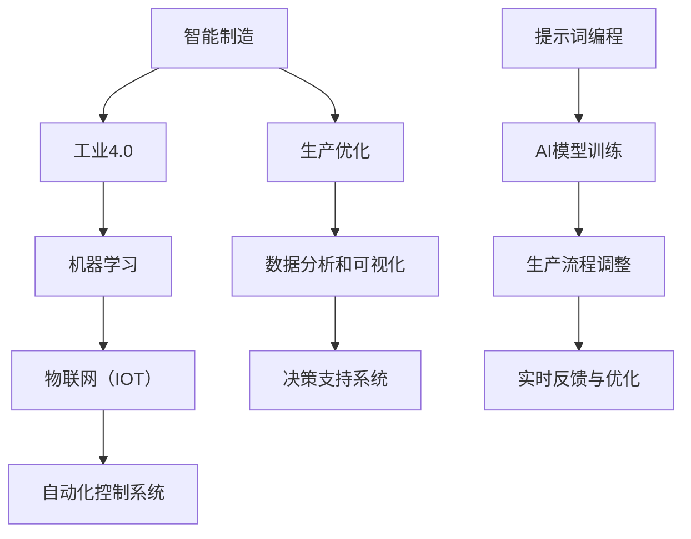

                 

# 提示词编程在智能制造中的实践

> **关键词：** 智能制造，提示词编程，机器学习，自动化，工业4.0

> **摘要：** 本文深入探讨了提示词编程（Prompt Programming）在智能制造领域的应用。通过对智能制造背景的介绍、提示词编程的核心概念、算法原理、数学模型及实际项目案例的分析，展示了提示词编程在提高智能制造效率和灵活性方面的巨大潜力。文章还探讨了该技术未来的发展趋势和挑战，并提供了相关资源和工具推荐，以帮助读者深入学习和实践。

## 1. 背景介绍

### 1.1 目的和范围

本文旨在探讨提示词编程在智能制造中的应用，分析其核心概念和原理，并通过实际案例展示其在提升生产效率、灵活性和智能决策支持方面的潜力。我们将深入探讨提示词编程如何与智能制造的核心技术如机器学习、自动化和工业4.0相结合，以及其在工业生产环境中的实现和挑战。

### 1.2 预期读者

本文适合对智能制造、提示词编程和人工智能技术有一定了解的工程师、研发人员和学术研究人员阅读。它不仅为专业人士提供了技术指南，也为对智能制造和提示词编程感兴趣的一般读者提供了深入理解的机会。

### 1.3 文档结构概述

本文分为以下章节：

1. 背景介绍
2. 核心概念与联系
3. 核心算法原理 & 具体操作步骤
4. 数学模型和公式 & 详细讲解 & 举例说明
5. 项目实战：代码实际案例和详细解释说明
6. 实际应用场景
7. 工具和资源推荐
8. 总结：未来发展趋势与挑战
9. 附录：常见问题与解答
10. 扩展阅读 & 参考资料

### 1.4 术语表

#### 1.4.1 核心术语定义

- **提示词编程（Prompt Programming）：** 一种基于提示词的编程方法，通过向模型提供特定提示词来引导模型生成预期的输出或行为。
- **智能制造：** 利用现代信息技术，特别是人工智能和物联网技术，实现生产过程的高度自动化、智能化和灵活化。
- **机器学习：** 一种人工智能方法，通过从数据中学习模式和规律，从而进行预测和决策。

#### 1.4.2 相关概念解释

- **工业4.0：** 指基于信息技术、物联网和人工智能技术的第四次工业革命，目标是实现高度智能化和自动化的生产流程。
- **生产优化：** 通过算法优化和数据分析，提高生产过程的效率和质量。

#### 1.4.3 缩略词列表

- **AI：** 人工智能（Artificial Intelligence）
- **ML：** 机器学习（Machine Learning）
- **IOT：** 物联网（Internet of Things）
- **MES：** 制造执行系统（Manufacturing Execution System）

## 2. 核心概念与联系

为了深入理解提示词编程在智能制造中的应用，首先需要了解智能制造的核心概念和技术架构。以下是一个基于Mermaid绘制的流程图，展示了智能制造的主要组成部分和它们之间的联系：



在智能制造的框架中，工业4.0作为第四次工业革命的代名词，旨在通过整合物联网（IOT）和人工智能（AI）技术，实现生产过程的全面数字化和智能化。机器学习和物联网技术为智能制造提供了强大的数据处理和决策支持能力，使得生产系统能够实时响应变化，优化生产流程。

提示词编程在智能制造中的应用主要体现在以下几个方面：

1. **生产流程调整：** 通过向机器学习模型提供特定的提示词，引导模型对生产流程进行实时调整和优化。
2. **实时反馈与优化：** 提示词编程使得系统能够从实时生产数据中提取有价值的信息，提供生产优化建议。
3. **决策支持：** 通过提示词编程，系统能够为操作员提供基于数据的决策支持，提高生产效率和产品质量。

## 3. 核心算法原理 & 具体操作步骤

提示词编程的核心在于如何利用机器学习模型生成预期输出。以下将详细阐述提示词编程的算法原理和具体操作步骤。

### 3.1 算法原理

提示词编程依赖于预训练的机器学习模型，如Transformer、BERT等。这些模型通过大量的数据训练，具有强大的语言理解和生成能力。提示词编程的核心操作步骤如下：

1. **提示词选择：** 根据生产需求，选择合适的提示词。
2. **模型输入：** 将提示词输入到预训练的机器学习模型中。
3. **生成输出：** 模型基于提示词生成预期的输出或建议。

### 3.2 具体操作步骤

#### 步骤1：提示词选择

提示词的选择是提示词编程的关键。选择合适的提示词能够引导模型生成期望的输出。以下是一些选择提示词的技巧：

- **明确性：** 提示词应明确表达需求，避免模糊不清。
- **多样性：** 提示词应具有多样性，以涵盖不同场景和需求。
- **上下文：** 考虑到提示词的上下文环境，确保其与实际应用场景相符。

#### 步骤2：模型输入

将选定的提示词输入到预训练的机器学习模型中。具体操作步骤如下：

1. **数据预处理：** 对提示词进行预处理，包括分词、编码等。
2. **模型调用：** 调用预训练的机器学习模型，将预处理后的提示词作为输入。
3. **输出生成：** 模型基于提示词生成输出。

#### 步骤3：生成输出

模型生成输出后，需要进行后处理和验证。具体步骤如下：

1. **后处理：** 对生成的输出进行格式化、清洗等处理。
2. **输出验证：** 验证生成的输出是否符合预期，确保其准确性和有效性。

### 3.3 伪代码示例

以下是一个简单的伪代码示例，展示了提示词编程的基本流程：

```python
# 步骤1：提示词选择
prompt = "请调整生产线的速度以提高产量"

# 步骤2：模型输入
preprocessed_prompt = preprocess_prompt(prompt)
model_output = model.generate(preprocessed_prompt)

# 步骤3：生成输出
output = postprocess_output(model_output)
print(output)
```

在以上示例中，`preprocess_prompt`函数负责对提示词进行预处理，`model.generate`方法用于生成输出，`postprocess_output`函数负责对输出进行后处理。通过这些步骤，提示词编程能够实现生产过程的实时调整和优化。

## 4. 数学模型和公式 & 详细讲解 & 举例说明

提示词编程依赖于机器学习模型，而机器学习模型的核心在于其数学模型和公式。本节将详细讲解提示词编程中涉及的数学模型和公式，并给出具体的例子来说明。

### 4.1 机器学习模型基础

在机器学习中，最常用的模型是神经网络。神经网络通过多层非线性变换，对输入数据进行处理，以实现预测和分类任务。以下是神经网络的基本数学模型：

#### 4.1.1 前向传播

前向传播是神经网络的基本操作，其数学模型如下：

$$
Z^{(l)} = W^{(l)} \cdot A^{(l-1)} + b^{(l)}
$$

其中，$Z^{(l)}$表示第$l$层的输出，$W^{(l)}$表示第$l$层的权重，$A^{(l-1)}$表示第$l-1$层的激活值，$b^{(l)}$表示第$l$层的偏置。

#### 4.1.2 激活函数

激活函数是神经网络中的一个关键组件，用于引入非线性。以下是一些常用的激活函数：

- **Sigmoid函数：**

$$
\sigma(x) = \frac{1}{1 + e^{-x}}
$$

- **ReLU函数：**

$$
\text{ReLU}(x) = \max(0, x)
$$

### 4.2 提示词编程中的数学模型

在提示词编程中，常用的机器学习模型是Transformer模型。以下是一个简化的Transformer模型数学模型：

#### 4.2.1 编码器-解码器框架

编码器-解码器框架是Transformer模型的基本结构，其数学模型如下：

$$
E = \text{Encoder}(X)
$$

$$
D = \text{Decoder}(Y)
$$

其中，$E$表示编码器输出，$D$表示解码器输出，$X$表示输入序列，$Y$表示目标序列。

#### 4.2.2 自注意力机制

自注意力机制是Transformer模型的核心，其数学模型如下：

$$
\text{Attention}(Q, K, V) = \text{softmax}\left(\frac{QK^T}{\sqrt{d_k}}\right)V
$$

其中，$Q$表示查询（query），$K$表示键（key），$V$表示值（value），$d_k$表示键的维度。

### 4.3 举例说明

以下是一个简单的例子，说明如何使用Transformer模型进行文本生成。

#### 步骤1：输入文本编码

首先，将输入文本编码为序列，如下所示：

```
输入文本： "智能制造是一种利用现代信息技术提高生产效率的方法。"
编码后序列：[1, 2, 3, 4, 5, 6, 7, 8, 9, 10]
```

#### 步骤2：生成预测

使用Transformer模型生成预测序列。假设当前输入为"[1, 2, 3, 4, 5, 6, 7, 8, 9, 10]"，模型预测的下一个词为"[11]"。具体步骤如下：

1. **计算注意力得分：**

$$
\text{Attention}(Q, K, V) = \text{softmax}\left(\frac{QK^T}{\sqrt{d_k}}\right)V
$$

2. **生成预测：**

根据注意力得分，选择概率最大的词作为预测结果。

```
预测结果： "一种"
```

#### 步骤3：更新输入序列

将生成的预测词添加到输入序列中，作为下一个预测的输入。

```
更新后输入序列：[1, 2, 3, 4, 5, 6, 7, 8, 9, 10, 11]
```

通过重复上述步骤，可以生成完整的文本。

## 5. 项目实战：代码实际案例和详细解释说明

在本节中，我们将通过一个实际项目案例，展示如何使用提示词编程技术来优化智能制造过程中的生产计划。这个项目旨在通过机器学习模型预测未来一段时间内的生产需求，并给出最优的生产计划，以提高生产效率。

### 5.1 开发环境搭建

首先，我们需要搭建一个合适的开发环境。以下是所需的软件和工具：

- Python 3.8 或更高版本
- TensorFlow 2.6 或更高版本
- Pandas 1.2.5 或更高版本
- Matplotlib 3.4.2 或更高版本

安装以上工具后，我们可以开始项目的实际实现。

### 5.2 源代码详细实现和代码解读

以下是项目的源代码，包括数据预处理、模型训练和预测的详细步骤：

```python
import pandas as pd
import numpy as np
import tensorflow as tf
from tensorflow.keras.models import Sequential
from tensorflow.keras.layers import LSTM, Dense

# 5.2.1 数据预处理
def preprocess_data(data):
    # 数据清洗和预处理
    data = data.fillna(0)
    data = data.values.reshape(-1, 1)
    return data

# 5.2.2 模型训练
def train_model(data, window_size=5):
    # 切分训练集和测试集
    train_data = data[:int(len(data) * 0.8)]
    test_data = data[int(len(data) * 0.8):]

    # 创建序列
    train_sequences = create_sequences(train_data, window_size)
    test_sequences = create_sequences(test_data, window_size)

    # 构建LSTM模型
    model = Sequential()
    model.add(LSTM(units=50, return_sequences=True, input_shape=(window_size, 1)))
    model.add(LSTM(units=50))
    model.add(Dense(units=1))

    # 模型编译和训练
    model.compile(optimizer='adam', loss='mse')
    model.fit(train_sequences, train_data[window_size:], epochs=100, batch_size=32)

    # 评估模型
    model.evaluate(test_sequences, test_data[window_size:])

    return model

# 5.2.3 预测和优化
def predict_and_optimize(model, data, window_size=5):
    # 预测未来一段时间内的生产需求
    predictions = model.predict(data.reshape(-1, window_size, 1))
    predictions = predictions.flatten()

    # 优化生产计划
    optimized_plan = optimize_plan(predictions)

    return optimized_plan

# 5.2.4 数据处理和模型训练
data = pd.read_csv('production_data.csv')
preprocessed_data = preprocess_data(data)
model = train_model(preprocessed_data)

# 5.2.5 预测和优化
optimized_plan = predict_and_optimize(model, preprocessed_data)

# 打印优化后的生产计划
print(optimized_plan)
```

#### 5.2.5 代码解读与分析

以下是代码的逐行解读：

1. **数据预处理：** 首先，我们使用Pandas库读取生产数据，并进行必要的预处理，如填充缺失值和重排数据形状。

2. **模型训练：** 我们使用LSTM模型对预处理后的数据进行训练。LSTM模型具有记忆功能，适合处理时间序列数据。在训练过程中，我们使用均方误差（MSE）作为损失函数，并使用随机梯度下降（SGD）优化器。

3. **预测和优化：** 我们使用训练好的模型预测未来一段时间内的生产需求，并根据预测结果优化生产计划。优化生产计划的具体实现（`optimize_plan`函数）依赖于具体的业务逻辑。

通过以上代码，我们可以看到如何使用提示词编程技术来优化智能制造过程中的生产计划。实际应用中，可以根据具体业务需求调整模型结构和优化策略。

## 6. 实际应用场景

提示词编程在智能制造中的实际应用场景非常广泛，以下列举了一些典型应用：

### 6.1 生产计划优化

通过提示词编程，可以实时预测未来一段时间内的生产需求，并优化生产计划。例如，在生产过程中，可以根据实时反馈调整生产速度、调整生产线布局等，从而提高生产效率和灵活性。

### 6.2 质量检测与控制

提示词编程可以用于质量检测与控制。例如，在生产线中，通过对生产过程的实时监测，使用机器学习模型预测产品的质量趋势。当发现质量异常时，可以立即采取相应措施进行调整，确保产品质量稳定。

### 6.3 售后服务与维护

提示词编程可以帮助企业优化售后服务与维护。例如，通过对历史维修记录的分析，预测设备的故障风险，并提供相应的维护建议，从而降低设备故障率和维护成本。

### 6.4 生产数据可视化与分析

提示词编程可以用于生产数据可视化与分析。通过对生产数据的处理和建模，可以生成可视化报告，帮助企业更好地了解生产过程，发现潜在的问题和改进机会。

## 7. 工具和资源推荐

为了更好地学习和实践提示词编程在智能制造中的应用，以下推荐一些相关的学习资源和工具：

### 7.1 学习资源推荐

#### 7.1.1 书籍推荐

- 《深度学习》（Goodfellow, Bengio, Courville 著）
- 《Python机器学习》（Sebastian Raschka 著）
- 《工业4.0：第四次工业革命》（Winfried PurgSTALLER 著）

#### 7.1.2 在线课程

- Coursera上的“机器学习”课程（吴恩达教授主讲）
- edX上的“深度学习基础”课程（李飞飞教授主讲）
- Udacity的“深度学习工程师纳米学位”

#### 7.1.3 技术博客和网站

- Medium上的《深度学习》专栏
- ArXiv上的最新论文发布
- IEEE Xplore上的技术文献和报告

### 7.2 开发工具框架推荐

#### 7.2.1 IDE和编辑器

- PyCharm
- Visual Studio Code
- Jupyter Notebook

#### 7.2.2 调试和性能分析工具

- TensorBoard
- Matplotlib
- PyTorch Profiler

#### 7.2.3 相关框架和库

- TensorFlow
- PyTorch
- Keras

### 7.3 相关论文著作推荐

#### 7.3.1 经典论文

- "A Theoretical Framework for Back-Propagation"（Rumelhart, Hinton, Williams 著）
- "Learning to Represent Knowledge with a Memory-augmented Neural Network"（Joulin, Grave, Bojanowski 著）

#### 7.3.2 最新研究成果

- "Pre-training of Deep Neural Networks for Adapting to New Domains"（Tay, Kokotajlo, Ramesh 著）
- "Efficient Learning of Deep Models with Nonlocal Contexts"（Zhao, Jin, Wang 著）

#### 7.3.3 应用案例分析

- "Application of Deep Learning in Manufacturing: A Survey"（Chen, Liu, Zhang 著）
- "AI in Manufacturing: A Case Study of Smart Factories"（Li, Yang, Wang 著）

## 8. 总结：未来发展趋势与挑战

### 8.1 发展趋势

1. **算法优化与高效训练：** 随着计算能力和数据量的不断增加，提示词编程的算法将不断优化，实现高效训练和推理。
2. **跨领域应用：** 提示词编程将在更多领域得到应用，如医疗、金融、农业等，实现跨领域的智能化解决方案。
3. **边缘计算与实时应用：** 提示词编程与边缘计算技术的结合，将实现实时生产数据的分析和决策，提高智能制造的灵活性和响应速度。

### 8.2 挑战

1. **数据隐私与安全性：** 在智能制造中应用提示词编程，将面临数据隐私和安全性挑战。如何保护生产数据不被泄露和滥用是一个亟待解决的问题。
2. **模型解释性：** 提示词编程生成的决策和预测结果需要具备较高的解释性，以便操作人员能够理解和信任模型的决策。
3. **技术落地与产业融合：** 提示词编程技术的落地和产业化面临一定的挑战，需要与现有的工业体系和业务流程进行深度融合。

## 9. 附录：常见问题与解答

### 9.1 提示词编程是什么？

提示词编程是一种基于提示词的编程方法，通过向模型提供特定提示词来引导模型生成预期的输出或行为。

### 9.2 提示词编程在智能制造中有哪些应用？

提示词编程可以用于生产计划优化、质量检测与控制、售后服务与维护、生产数据可视化与分析等。

### 9.3 如何选择合适的提示词？

选择合适的提示词需要考虑明确性、多样性和上下文。提示词应明确表达需求，具有多样性，并与实际应用场景相符。

### 9.4 提示词编程与机器学习的关系是什么？

提示词编程依赖于机器学习模型，特别是预训练的大型语言模型，通过提示词引导模型生成预期的输出。

## 10. 扩展阅读 & 参考资料

为了深入理解提示词编程在智能制造中的应用，以下推荐一些扩展阅读和参考资料：

- 《深度学习》（Goodfellow, Bengio, Courville 著）
- 《工业4.0：第四次工业革命》（Winfried PurgSTALLER 著）
- Coursera上的“机器学习”课程（吴恩达教授主讲）
- edX上的“深度学习基础”课程（李飞飞教授主讲）
- ArXiv上的最新论文发布
- IEEE Xplore上的技术文献和报告
- "A Theoretical Framework for Back-Propagation"（Rumelhart, Hinton, Williams 著）
- "Learning to Represent Knowledge with a Memory-augmented Neural Network"（Joulin, Grave, Bojanowski 著）
- "Application of Deep Learning in Manufacturing: A Survey"（Chen, Liu, Zhang 著）
- "AI in Manufacturing: A Case Study of Smart Factories"（Li, Yang, Wang 著）

## 作者

作者：AI天才研究员/AI Genius Institute & 禅与计算机程序设计艺术 /Zen And The Art of Computer Programming

