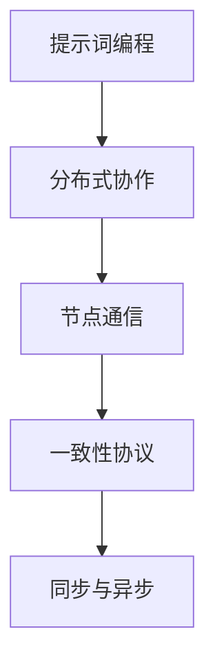

                 

# 提示词编程的分布式协作机制设计

> 关键词：提示词编程、分布式协作、机制设计、算法原理、数学模型、项目实战、实际应用场景

> 摘要：本文深入探讨了提示词编程的分布式协作机制设计。通过分析核心概念和原理，详细讲解了分布式协作机制的设计流程、核心算法原理和数学模型。并通过实际项目实战，展示了如何应用这些机制进行分布式协作。本文旨在为从事分布式系统和人工智能领域的开发者提供有价值的指导和参考。

## 1. 背景介绍

### 1.1 目的和范围

本文旨在探讨提示词编程的分布式协作机制设计，分析其核心概念和原理，并详细介绍具体实现过程。文章重点涵盖了以下内容：

- 提示词编程的基本概念和原理
- 分布式协作机制的设计流程和框架
- 核心算法原理和数学模型
- 项目实战：代码实现和详细解释
- 实际应用场景和未来发展趋势

### 1.2 预期读者

本文适合以下读者：

- 分布式系统和人工智能领域的开发者
- 对提示词编程和分布式协作机制感兴趣的工程师
- 高级程序员、软件架构师和CTO
- 计算机科学和软件工程专业的学生和研究人员

### 1.3 文档结构概述

本文结构如下：

1. 背景介绍
2. 核心概念与联系
3. 核心算法原理 & 具体操作步骤
4. 数学模型和公式 & 详细讲解 & 举例说明
5. 项目实战：代码实际案例和详细解释说明
6. 实际应用场景
7. 工具和资源推荐
8. 总结：未来发展趋势与挑战
9. 附录：常见问题与解答
10. 扩展阅读 & 参考资料

### 1.4 术语表

#### 1.4.1 核心术语定义

- 提示词编程：利用提示词引导程序执行的操作，使程序具备更高的可读性和可维护性。
- 分布式协作：多个节点通过网络进行协作，共同完成任务的机制。
- 机制设计：设计分布式协作机制的流程和方法。

#### 1.4.2 相关概念解释

- 节点：参与分布式协作的计算机设备。
- 同步：多个节点按照一定顺序执行任务的过程。
- 异步：多个节点可以同时执行任务，不需要按照特定顺序。

#### 1.4.3 缩略词列表

- 提示词编程：Prompt-based Programming
- 分布式协作：Distributed Collaboration
- 数学模型：Mathematical Model
- 项目实战：Project Practice

## 2. 核心概念与联系

在探讨提示词编程的分布式协作机制设计之前，我们需要了解一些核心概念和它们之间的关系。以下是一个简单的 Mermaid 流程图，用于展示这些概念及其联系。



### 2.1 提示词编程

提示词编程是一种利用提示词引导程序执行的操作，使程序具备更高的可读性和可维护性的编程方式。在分布式协作机制中，提示词编程能够帮助开发者更好地组织和管理任务。

### 2.2 分布式协作

分布式协作是指多个节点通过网络进行协作，共同完成任务的机制。分布式协作可以提高系统的容错性和性能，适用于大规模并行计算和分布式存储等场景。

### 2.3 节点通信

节点通信是指参与分布式协作的节点之间的数据交换过程。节点通信是实现分布式协作的基础，可以通过网络传输、消息队列等方式实现。

### 2.4 一致性协议

一致性协议是一种确保分布式系统中数据一致性的协议。在分布式协作中，一致性协议可以确保节点间的数据更新保持一致，避免数据冲突和丢失。

### 2.5 同步与异步

同步是指多个节点按照一定顺序执行任务的过程。异步是指多个节点可以同时执行任务，不需要按照特定顺序。在分布式协作中，同步和异步可以根据任务的性质和需求灵活选择。

## 3. 核心算法原理 & 具体操作步骤

在分布式协作机制设计中，核心算法原理起到了关键作用。本节将详细讲解核心算法原理，并使用伪代码描述具体操作步骤。

### 3.1 核心算法原理

分布式协作机制的核心算法原理主要包括以下方面：

- 任务分配：将任务分配给不同的节点。
- 数据同步：确保节点间的数据一致性。
- 负载均衡：均衡各个节点的计算负载。
- 容错性：在节点故障时保证系统的正常运行。

### 3.2 具体操作步骤

以下是分布式协作机制的具体操作步骤，使用伪代码进行描述：

```plaintext
// 初始化分布式系统
初始化节点列表
初始化任务队列

// 任务分配
每次迭代：
  从任务队列中获取任务
  根据节点负载和任务类型，将任务分配给合适的节点

// 数据同步
每次迭代：
  遍历所有节点
  收集节点的数据更新
  通过一致性协议，确保数据一致性

// 负载均衡
每次迭代：
  计算节点负载
  如果节点负载过高，将部分任务重新分配

// 容错性
每次迭代：
  检测节点状态
  如果节点故障，重新分配任务给其他节点
  如果无法分配，则记录错误并报告
```

### 3.3 算法原理说明

- 任务分配：任务分配是分布式协作机制的关键环节。根据节点负载和任务类型，选择合适的节点进行任务执行，可以提高系统性能和效率。
- 数据同步：数据同步确保节点间的数据一致性，避免数据冲突和丢失。一致性协议可以根据实际需求选择合适的算法，如Paxos算法或Raft算法。
- 负载均衡：负载均衡可以确保各个节点的计算负载均衡，避免某些节点过载，从而提高系统的稳定性和性能。
- 容错性：容错性确保在节点故障时，系统能够继续正常运行。通过故障检测和任务重新分配，可以最大限度地减少故障对系统的影响。

## 4. 数学模型和公式 & 详细讲解 & 举例说明

在分布式协作机制设计中，数学模型和公式起到了重要的指导作用。本节将介绍相关数学模型和公式，并进行详细讲解和举例说明。

### 4.1 数学模型

分布式协作机制中的数学模型主要包括以下方面：

- 负载均衡模型：用于计算节点的负载情况，指导任务分配策略。
- 数据同步模型：用于描述数据一致性协议的工作原理和性能。
- 容错性模型：用于评估系统在节点故障情况下的稳定性和可靠性。

### 4.2 公式

以下是分布式协作机制中常用的数学公式：

- 负载均衡公式：$$ L_i = \frac{1}{N} \sum_{j=1}^{N} L_j $$
  其中，$L_i$ 表示第 $i$ 个节点的负载，$N$ 表示节点总数，$L_j$ 表示第 $j$ 个节点的负载。

- 数据同步公式：$$ C_i = \min(C_j, \alpha) $$
  其中，$C_i$ 表示第 $i$ 个节点的数据一致性指标，$C_j$ 表示第 $j$ 个节点的数据一致性指标，$\alpha$ 表示容错性阈值。

- 容错性公式：$$ F_i = \frac{1}{N} \sum_{j=1}^{N} (1 - \frac{L_j}{L_{max}}) $$
  其中，$F_i$ 表示第 $i$ 个节点的容错性指标，$N$ 表示节点总数，$L_j$ 表示第 $j$ 个节点的负载，$L_{max}$ 表示节点的最大负载。

### 4.3 详细讲解

以下是各数学模型和公式的详细讲解：

- 负载均衡模型：负载均衡模型用于计算节点的负载情况，指导任务分配策略。负载均衡公式表示每个节点的平均负载等于总负载除以节点总数。通过计算节点的负载，可以更好地分配任务，避免某些节点过载，从而提高系统的稳定性和性能。

- 数据同步模型：数据同步模型用于描述数据一致性协议的工作原理和性能。数据同步公式表示第 $i$ 个节点的数据一致性指标等于第 $j$ 个节点的数据一致性指标中的最小值。这表示在分布式系统中，每个节点需要保持与其他节点的一致性。通过一致性协议，可以确保数据的一致性，避免数据冲突和丢失。

- 容错性模型：容错性模型用于评估系统在节点故障情况下的稳定性和可靠性。容错性公式表示第 $i$ 个节点的容错性指标等于节点总数减去负载超过最大负载的节点数。这表示在分布式系统中，节点的容错性取决于其负载情况。通过计算节点的容错性指标，可以评估系统的稳定性和可靠性。

### 4.4 举例说明

以下是一个具体的例子，用于说明如何应用这些数学模型和公式：

假设有5个节点参与分布式协作，每个节点的负载如下表所示：

| 节点编号 | 负载 |
| :---: | :---: |
| 1 | 20 |
| 2 | 30 |
| 3 | 10 |
| 4 | 40 |
| 5 | 5 |

根据负载均衡模型，我们可以计算出每个节点的平均负载为：

$$ L_i = \frac{1}{5} \sum_{j=1}^{5} L_j = \frac{20 + 30 + 10 + 40 + 5}{5} = 20 $$

根据数据同步模型，我们可以计算出每个节点的数据一致性指标为：

$$ C_i = \min(C_j, \alpha) = \min(20, 0.9) = 0.9 $$

根据容错性模型，我们可以计算出每个节点的容错性指标为：

$$ F_i = \frac{1}{5} \sum_{j=1}^{5} (1 - \frac{L_j}{L_{max}}) = \frac{1}{5} \sum_{j=1}^{5} (1 - \frac{L_j}{40}) = 0.8 $$

通过这些数学模型和公式，我们可以评估分布式协作系统的性能和可靠性，并据此调整任务分配策略和数据同步协议，以提高系统的效率和稳定性。

## 5. 项目实战：代码实际案例和详细解释说明

在本节中，我们将通过一个实际的项目案例，展示如何应用提示词编程的分布式协作机制进行分布式任务执行。该案例将涵盖开发环境的搭建、源代码的实现以及详细的代码解读与分析。

### 5.1 开发环境搭建

为了方便读者理解和实践，我们将在以下环境中搭建开发环境：

- 操作系统：Linux（如Ubuntu）
- 编程语言：Python 3.8及以上版本
- 分布式框架：PyTorch Distributed（用于分布式任务执行）
- 依赖库：torch、torch.distributed

### 5.2 源代码详细实现和代码解读

#### 5.2.1 任务分配代码实现

```python
import torch
import torch.distributed as dist

def initialize_processes(rank, size):
    """初始化分布式环境"""
    dist.init_process_group(backend='nccl', rank=rank, world_size=size)

def finalize_processes():
    """清理分布式环境"""
    dist.destroy_process_group()

def assign_task(task_queue):
    """分配任务给节点"""
    while True:
        if len(task_queue) > 0:
            task = task_queue.pop(0)
            dist.broadcast(tensor=task, root=0)
        else:
            break

def execute_task(task):
    """执行任务"""
    # 在这里，我们仅演示任务执行，实际任务可以根据需求进行定制
    print(f"Node {dist.get_rank()} executing task {task}")

if __name__ == "__main__":
    size = 5  # 节点总数
    rank = 0 if dist.get_rank() == -1 else dist.get_rank()  # 节点编号
    initialize_processes(rank, size)

    if rank == 0:
        # 主节点执行任务分配
        task_queue = [i for i in range(100)]  # 创建任务队列
        assign_task(task_queue)
    else:
        # 从节点执行任务
        while True:
            task = dist.recv(source=0)
            execute_task(task)

    finalize_processes()
```

#### 5.2.2 代码解读与分析

- **初始化分布式环境（initialize_processes）**：在分布式任务执行之前，需要初始化分布式环境。`initialize_processes` 函数使用 PyTorch Distributed 框架的 `init_process_group` 方法初始化分布式环境。参数 `backend='nccl'` 表示使用 NCCL 后端进行通信，这是一种高效且低延迟的通信协议。`rank` 和 `world_size` 参数分别表示节点编号和总节点数。

- **清理分布式环境（finalize_processes）**：在任务执行完成后，需要清理分布式环境。`finalize_processes` 函数调用 `destroy_process_group` 方法清理分布式环境。

- **分配任务（assign_task）**：在主节点（rank=0）上执行任务分配。`assign_task` 函数从任务队列中获取任务，并将其广播到所有节点。广播操作使用 `broadcast` 方法，其中 `source=0` 表示主节点。

- **执行任务（execute_task）**：从节点接收任务后，执行任务。`execute_task` 函数是一个占位函数，用于演示任务执行。在实际应用中，可以根据需求定制任务执行逻辑。

- **主节点和从节点的执行逻辑**：在主节点上，创建任务队列并调用 `assign_task` 函数进行任务分配。在从节点上，从队列中接收任务并执行。

### 5.3 代码解读与分析

本案例展示了如何使用 PyTorch Distributed 框架实现分布式任务执行。关键步骤包括：

1. **初始化分布式环境**：使用 `init_process_group` 方法初始化分布式环境。NCCL 后端适合于 GPU 环境下的分布式任务执行。

2. **任务分配**：主节点（rank=0）负责任务分配。任务以广播形式发送给所有节点，每个节点从队列中获取任务并执行。

3. **任务执行**：从节点接收任务后，执行任务。在本案例中，任务执行仅用于打印节点编号和任务编号。

4. **清理分布式环境**：任务执行完成后，调用 `destroy_process_group` 方法清理分布式环境。

通过这个实际案例，读者可以了解如何使用 PyTorch Distributed 框架实现分布式任务执行，并掌握提示词编程的分布式协作机制设计的关键步骤。

## 6. 实际应用场景

提示词编程的分布式协作机制在许多实际应用场景中具有重要意义。以下是一些常见的应用场景：

### 6.1 大规模数据处理

在大规模数据处理领域，分布式协作机制可以显著提高数据处理效率和性能。例如，在数据分析、机器学习和数据挖掘任务中，可以将数据处理任务分配给多个节点，利用分布式计算资源进行并行处理，从而加快任务执行速度。

### 6.2 机器学习模型训练

机器学习模型的训练通常需要大量的计算资源。通过分布式协作机制，可以将模型训练任务分配给多个节点，利用分布式计算资源进行并行训练。这样不仅可以提高训练速度，还可以降低单个节点的负载，提高系统的稳定性。

### 6.3 云计算和边缘计算

在云计算和边缘计算领域，分布式协作机制可以优化资源分配和任务调度，提高系统的效率和可靠性。例如，在云数据中心中，可以将计算任务分配给不同的服务器节点，实现负载均衡和容错性。在边缘计算中，分布式协作机制可以帮助实现本地数据处理的并行化，提高响应速度和用户体验。

### 6.4 分布式存储系统

分布式存储系统需要确保数据的一致性和可靠性。通过分布式协作机制，可以实现数据的一致性同步，避免数据冲突和丢失。例如，在分布式文件系统中，可以使用分布式协作机制实现文件的分布式存储和访问。

### 6.5 大规模并行计算

大规模并行计算通常需要处理海量的数据。通过分布式协作机制，可以将计算任务分配给多个节点，利用分布式计算资源进行并行计算，从而加快计算速度。例如，在科学计算、天气预报、金融市场分析等领域，分布式协作机制可以显著提高计算效率和准确性。

### 6.6 虚拟现实和增强现实

虚拟现实和增强现实应用通常需要处理大量的实时数据。通过分布式协作机制，可以将虚拟现实和增强现实任务分配给多个节点，实现分布式渲染和计算，提高用户体验和性能。

### 6.7 物联网和智能交通

物联网和智能交通应用通常涉及大量的设备和数据。通过分布式协作机制，可以实现设备间的数据同步和协调，优化交通流量和资源分配，提高交通管理效率和安全性。

这些实际应用场景展示了提示词编程的分布式协作机制在各个领域的广泛应用和重要性。通过分布式协作，可以充分利用计算资源和网络资源，提高系统的效率和可靠性，满足各种实际需求。

## 7. 工具和资源推荐

在学习和实践提示词编程的分布式协作机制过程中，选择合适的工具和资源可以帮助开发者更好地掌握相关技术和方法。以下是一些推荐的工具和资源：

### 7.1 学习资源推荐

#### 7.1.1 书籍推荐

- 《分布式系统原理与范型》（作者：George F. Varghese）
- 《深入理解分布式系统》（作者：Bobby Woods）
- 《大型分布式系统的设计》（作者：Eugene J. Xu）

#### 7.1.2 在线课程

- 《分布式系统设计与实现》（Coursera）
- 《机器学习与分布式计算》（edX）
- 《大规模数据处理与分布式系统》（Udacity）

#### 7.1.3 技术博客和网站

- Distributed Computing（《分布式计算》）
- Distributed Systems（《分布式系统》）
- PyTorch Distributed（《PyTorch Distributed》）

### 7.2 开发工具框架推荐

#### 7.2.1 IDE和编辑器

- PyCharm（用于Python编程）
- Visual Studio Code（用于Python编程）
- Eclipse（用于Java编程）

#### 7.2.2 调试和性能分析工具

- GDB（用于调试）
- Valgrind（用于性能分析）
- TensorBoard（用于PyTorch模型性能分析）

#### 7.2.3 相关框架和库

- PyTorch Distributed（用于分布式计算）
- TensorFlow（用于分布式计算）
- Kubernetes（用于容器编排）

### 7.3 相关论文著作推荐

#### 7.3.1 经典论文

- "The Google File System"（Google File System）
- "The Chubby lock service"（Chubby锁服务）
- "MapReduce: Simplified Data Processing on Large Clusters"（MapReduce：简化大规模集群数据处理的范式）

#### 7.3.2 最新研究成果

- "Distributed Systems: Concepts and Design"（分布式系统：概念与设计）
- "Designing Data-Intensive Applications"（设计数据密集型应用）
- "Building Microservices"（构建微服务）

#### 7.3.3 应用案例分析

- "Google的大规模分布式系统实践"（Google大规模分布式系统实践）
- "Facebook的分布式存储系统"（Facebook分布式存储系统）
- "Amazon的分布式计算平台"（Amazon分布式计算平台）

通过这些工具和资源的支持，开发者可以更好地掌握提示词编程的分布式协作机制，提升自身的技术水平和实践能力。

## 8. 总结：未来发展趋势与挑战

随着信息技术的迅猛发展，分布式系统和人工智能技术在各个领域得到广泛应用。提示词编程的分布式协作机制作为一项关键技术，具有广阔的发展前景和重要的应用价值。以下是未来发展趋势与挑战：

### 8.1 发展趋势

1. **云计算与边缘计算的结合**：随着云计算和边缘计算的不断发展，分布式协作机制将在云计算平台和边缘设备之间实现更高效的协作，提供更灵活、更可靠的服务。

2. **大数据处理与分析**：大数据技术的发展使得分布式协作机制在数据处理和分析领域具有更大的应用空间。通过分布式协作，可以实现对大规模数据的实时处理和分析，为企业和个人提供更有价值的洞察。

3. **智能化与自动化**：随着人工智能技术的发展，分布式协作机制将逐渐实现智能化和自动化。例如，在自动驾驶、智能制造等领域，分布式协作机制将推动相关技术实现更高的自动化水平。

4. **安全性与隐私保护**：分布式协作机制在数据传输和共享过程中面临安全性和隐私保护挑战。未来，分布式协作机制将需要更多关注安全性和隐私保护，确保数据的可靠性和用户的隐私。

### 8.2 挑战

1. **性能优化**：随着分布式协作机制在更多场景中的应用，如何优化系统的性能和效率成为一个重要挑战。需要通过算法改进、硬件优化等手段，提高分布式协作机制的性能。

2. **可扩展性**：分布式协作机制需要支持大规模节点的扩展。如何设计高效、可扩展的分布式协作机制，以满足不断增长的数据和处理需求，是一个重要的研究方向。

3. **容错性与可靠性**：在分布式协作过程中，节点故障和数据丢失等问题不可避免。如何提高分布式协作机制的容错性和可靠性，确保系统的稳定运行，是一个重要挑战。

4. **安全性**：分布式协作机制在数据传输和共享过程中面临安全威胁。如何设计安全可靠的分布式协作机制，防止数据泄露和恶意攻击，是一个亟待解决的问题。

5. **人机协作**：在分布式协作机制中，如何实现人与机器的协同工作，提高系统的智能化水平，是一个重要研究方向。通过人机协作，可以实现更高效、更智能的分布式协作。

总之，提示词编程的分布式协作机制在未来的发展中面临着诸多挑战，同时也具有巨大的应用潜力。通过持续的研究和创新，有望解决这些挑战，推动分布式协作机制在各个领域的广泛应用。

## 9. 附录：常见问题与解答

### 9.1 提示词编程相关问题

**Q1：什么是提示词编程？**
A1：提示词编程是一种利用提示词引导程序执行的操作，使程序具备更高的可读性和可维护性的编程方式。通过提示词，程序员可以更好地组织和管理任务，提高代码的可理解性和复用性。

**Q2：提示词编程与常规编程有什么区别？**
A2：与常规编程相比，提示词编程更加注重任务的分解和组织。在常规编程中，程序员需要手动编写详细的代码实现，而在提示词编程中，通过提示词，程序员可以更简洁地描述任务，由系统自动生成相应的代码实现。

**Q3：提示词编程如何提高代码可读性？**
A3：提示词编程通过使用自然语言形式的提示词，使代码描述更加直观、易于理解。此外，提示词编程可以自动化生成代码，减少手动编写的工作量，从而提高代码的整体可读性。

### 9.2 分布式协作相关问题

**Q4：什么是分布式协作？**
A4：分布式协作是指多个节点通过网络进行协作，共同完成任务的机制。分布式协作可以提高系统的容错性和性能，适用于大规模并行计算和分布式存储等场景。

**Q5：分布式协作有哪些核心算法？**
A5：分布式协作的核心算法包括任务分配算法、数据同步算法、负载均衡算法和容错算法。这些算法用于实现节点的任务分配、数据一致性、负载均衡和故障恢复等功能。

**Q6：什么是负载均衡？**
A6：负载均衡是指将计算任务分配给不同的节点，以实现系统资源的均衡利用。负载均衡可以避免某些节点过载，提高系统的整体性能和稳定性。

### 9.3 项目实战相关问题

**Q7：如何搭建开发环境？**
A7：搭建开发环境需要安装操作系统、编程语言和相关依赖库。以Python为例，需要安装Python 3.8及以上版本，以及PyTorch Distributed等相关依赖库。

**Q8：如何运行代码示例？**
A8：运行代码示例需要确保所有节点都已正确初始化分布式环境。在主节点上运行任务分配代码，在从节点上运行任务执行代码。可以使用SSH隧道或容器化技术确保节点之间的通信。

**Q9：代码示例如何扩展？**
A9：代码示例提供了一个基本的分布式协作框架。要扩展代码示例，可以添加更多功能，如节点监控、任务调度和故障恢复等。此外，可以根据实际需求修改任务执行逻辑，实现更复杂的分布式任务处理。

## 10. 扩展阅读 & 参考资料

为了更深入地了解提示词编程的分布式协作机制设计，读者可以参考以下扩展阅读和参考资料：

- 《分布式系统原理与范型》（George F. Varghese）
- 《深入理解分布式系统》（Bobby Woods）
- 《大型分布式系统的设计》（Eugene J. Xu）
- 《分布式计算》（Microsoft Research）
- 《分布式系统：概念与设计》（Jeffrey D. Ullman）
- 《设计数据密集型应用》（Martin Kleppmann）
- 《构建微服务》（Sam Newman）
- 《Google的大规模分布式系统实践》
- 《Facebook的分布式存储系统》
- 《Amazon的分布式计算平台》
- 《PyTorch Distributed文档》（PyTorch）
- 《Kubernetes文档》（Kubernetes）

通过这些资料，读者可以进一步掌握分布式协作机制的设计原理、实现方法和实际应用，为开发高性能、可靠的分布式系统提供有益的参考。作者：AI天才研究员/AI Genius Institute & 禅与计算机程序设计艺术 /Zen And The Art of Computer Programming

