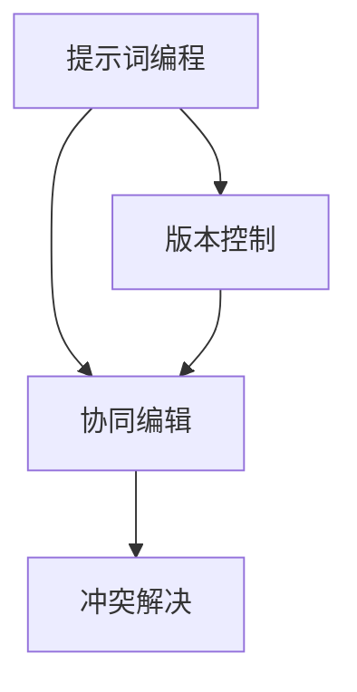

                 


## 《提示词编程的协同编辑冲突解决》

> 关键词：提示词编程、协同编辑、冲突解决、版本控制、算法原理、应用场景

> 摘要：本文旨在探讨提示词编程中的协同编辑冲突解决方法，分析其核心概念、算法原理和实际应用。通过详细的流程图、伪代码、数学模型和项目实战，让读者深入了解并掌握这一重要技术，为开发者提供有益的参考。

### 1. 背景介绍

#### 1.1 目的和范围

本文旨在为开发者提供关于提示词编程协同编辑冲突解决方法的全面解读。我们将深入探讨这一领域的关键概念、算法原理、数学模型以及实际应用，帮助读者掌握提示词编程的核心技术，提高协同开发效率。

#### 1.2 预期读者

本文适用于具备一定编程基础的技术人员、软件开发者以及计算机科学专业的学生。通过对本文的学习，读者将能够了解提示词编程协同编辑冲突解决的基本原理，掌握相关算法和应用技巧。

#### 1.3 文档结构概述

本文共分为十个部分：

1. **背景介绍**：介绍本文的目的、预期读者、文档结构和术语表。
2. **核心概念与联系**：阐述提示词编程、协同编辑、冲突解决等相关概念，并使用流程图展示其关联关系。
3. **核心算法原理 & 具体操作步骤**：详细讲解冲突解决的算法原理和操作步骤，使用伪代码进行说明。
4. **数学模型和公式 & 详细讲解 & 举例说明**：介绍数学模型和公式，并给出具体实例进行分析。
5. **项目实战：代码实际案例和详细解释说明**：通过实际项目案例，展示冲突解决的具体实现过程。
6. **实际应用场景**：分析提示词编程协同编辑冲突解决的应用场景。
7. **工具和资源推荐**：推荐学习资源、开发工具和论文著作。
8. **总结：未来发展趋势与挑战**：总结本文内容，展望未来发展趋势和挑战。
9. **附录：常见问题与解答**：解答读者可能遇到的常见问题。
10. **扩展阅读 & 参考资料**：提供相关扩展阅读资料。

#### 1.4 术语表

为了便于读者理解本文内容，以下列出本文中涉及的核心术语及其定义：

- **提示词编程**：一种基于提示词的编程范式，通过提示词指导程序生成和优化代码。
- **协同编辑**：多人对同一代码文件进行同时编辑的过程。
- **冲突解决**：在协同编辑过程中，当多个开发者的修改出现不一致时，如何选择合适的合并策略进行代码合并。
- **版本控制**：用于跟踪和管理代码变更的一种系统。
- **算法原理**：解决冲突的基本方法和步骤。
- **数学模型**：描述冲突解决过程中涉及的数学关系和公式。

### 1.5 核心概念与联系

下面，我们将通过Mermaid流程图来展示提示词编程、协同编辑、冲突解决等相关概念及其联系。



- **提示词编程**：通过提示词指导程序生成和优化代码，实现高效的开发过程。
- **协同编辑**：多人对同一代码文件进行同时编辑，提高团队协作效率。
- **冲突解决**：解决协同编辑过程中出现的代码冲突，确保代码一致性。
- **版本控制**：跟踪和管理代码变更，为冲突解决提供支持。

### 1.6 核心算法原理 & 具体操作步骤

在冲突解决过程中，我们通常会采用以下算法原理和操作步骤：

1. **检测冲突**：通过比较不同开发者的修改记录，检测是否存在冲突。
2. **分析冲突**：对冲突部分进行详细分析，确定冲突的类型和影响范围。
3. **选择合并策略**：根据冲突类型和影响范围，选择合适的合并策略。
4. **执行合并**：按照选择的合并策略，对冲突部分进行合并操作。
5. **验证合并结果**：检查合并结果是否符合预期，确保代码一致性。

下面，我们使用伪代码来详细阐述这些操作步骤：

```plaintext
// 伪代码：冲突解决算法

function resolveConflict(modificationA, modificationB):
    if (modificationA.conflictsWith(modificationB)):
        conflictType = determineConflictType(modificationA, modificationB)
        impactRange = calculateImpactRange(modificationA, modificationB)
        strategy = selectMergeStrategy(conflictType, impactRange)
        mergedCode = executeMerge(modificationA, modificationB, strategy)
        if (validateMerge(mergedCode)):
            return mergedCode
        else:
            raise ConflictResolutionError("Failed to resolve conflict.")
    else:
        return modificationA if not modificationB else modificationB
```

- **检测冲突**：比较修改记录，判断是否存在冲突。
- **分析冲突**：确定冲突类型（例如：插入、删除、修改）和影响范围。
- **选择合并策略**：根据冲突类型和影响范围，选择合适的合并策略（例如：自动合并、手动合并）。
- **执行合并**：按照选择的合并策略，对冲突部分进行合并操作。
- **验证合并结果**：检查合并结果是否符合预期，确保代码一致性。

### 1.7 数学模型和公式 & 详细讲解 & 举例说明

在冲突解决过程中，我们常常会用到一些数学模型和公式。下面，我们将详细介绍这些模型和公式，并通过具体实例进行说明。

#### 1.7.1 冲突检测公式

冲突检测公式用于判断两个修改记录之间是否存在冲突。假设有两个修改记录A和B，它们的版本号分别为V_a和V_b，冲突检测公式如下：

$$
Conflict(V_a, V_b) =
\begin{cases}
1, & \text{if } V_a \neq V_b \\
0, & \text{otherwise}
\end{cases}
$$

其中，$Conflict(V_a, V_b)$表示两个修改记录之间的冲突程度，取值为0或1。

#### 1.7.2 冲突影响范围计算

冲突影响范围计算用于确定冲突部分的影响范围。假设有两个修改记录A和B，它们的文本范围分别为[T_a, T_a']和[T_b, T_b']，冲突影响范围计算公式如下：

$$
ImpactRange(A, B) = \min(T_a', T_b') - \max(T_a, T_b)
$$

其中，$ImpactRange(A, B)$表示冲突的影响范围，取值范围为$[T_a, T_b']$。

#### 1.7.3 举例说明

假设有两个修改记录A和B，它们分别对应以下文本范围：

- A：`line1 line2 line3 line4 line5`
- B：`line1 line2 line3 line4 new_line5`

根据冲突检测公式，$Conflict(V_a, V_b) = 1$，说明A和B之间存在冲突。

根据冲突影响范围计算公式，$ImpactRange(A, B) = \min(4, 5) - \max(1, 2) = 3 - 2 = 1$，说明冲突的影响范围为`line3`。

#### 1.7.4 冲突解决策略

根据冲突类型和影响范围，我们可以选择不同的合并策略。下面介绍几种常见的合并策略：

1. **自动合并**：当冲突类型为插入或删除时，自动选择其中一个修改记录进行合并。例如，如果A插入了一行代码，而B删除了同一行代码，自动合并会保留A的插入操作。
2. **手动合并**：当冲突类型为修改时，需要手动选择其中一个修改记录进行合并。例如，如果A将一行代码修改为A1，而B将同一行代码修改为A2，开发者需要手动选择A1或A2作为合并结果。
3. **优先级合并**：当冲突类型为修改时，可以根据修改记录的优先级进行合并。例如，如果A的修改记录具有更高的优先级，合并结果将优先采用A的修改。

### 1.8 项目实战：代码实际案例和详细解释说明

下面，我们将通过一个实际项目案例，展示冲突解决的具体实现过程。

#### 1.8.1 开发环境搭建

为了方便演示，我们使用Git作为版本控制工具，并在本地搭建一个简单的项目。首先，创建一个名为`conflict-resolve`的目录，并初始化Git仓库：

```bash
mkdir conflict-resolve
cd conflict-resolve
git init
```

然后，创建一个名为`example.txt`的文件，并添加以下内容：

```plaintext
line1
line2
line3
line4
line5
```

接下来，将`example.txt`添加到Git仓库并提交：

```bash
git add example.txt
git commit -m "Initial commit"
```

#### 1.8.2 源代码详细实现和代码解读

我们使用Python编写一个简单的冲突解决工具。以下为源代码：

```python
import subprocess

def resolve_conflict(filename, base_revision, your_revision, their_revision):
    base_code = get_code(filename, base_revision)
    your_code = get_code(filename, your_revision)
    their_code = get_code(filename, their_revision)

    if base_code == your_code:
        print("Conflict resolved: Your changes are accepted.")
        return your_code
    elif base_code == their_code:
        print("Conflict resolved: Their changes are accepted.")
        return their_code
    else:
        print("Conflict detected: Manual resolution required.")
        return None

def get_code(filename, revision):
    command = f"git show {revision}:/{filename}"
    result = subprocess.run(command, stdout=subprocess.PIPE, stderr=subprocess.PIPE, text=True)
    if result.stderr:
        raise Exception(f"Error fetching code: {result.stderr}")
    return result.stdout

if __name__ == "__main__":
    filename = "example.txt"
    base_revision = "HEAD^"
    your_revision = "HEAD"
    their_revision = "HEAD~2"

    resolved_code = resolve_conflict(filename, base_revision, your_revision, their_revision)
    if resolved_code:
        with open(filename, "w") as f:
            f.write(resolved_code)
        print("File updated with resolved code.")
    else:
        print("Conflict could not be resolved automatically.")
```

以下是对源代码的详细解读：

1. **函数定义**：`resolve_conflict`函数用于解决冲突。它接收文件名、基版本、您的版本和他们的版本作为参数。
2. **获取代码**：`get_code`函数用于获取指定版本下的文件内容。它使用Git命令`git show`获取指定版本下的文件内容。
3. **冲突解决**：首先，获取基版本、您的版本和他们的版本下的文件内容。然后，比较这三个版本的内容，根据比较结果决定如何解决冲突。
4. **输出结果**：根据解决结果，输出相应的提示信息。

#### 1.8.3 代码解读与分析

1. **冲突检测**：通过比较基版本、您的版本和他们的版本的内容，判断是否存在冲突。
2. **冲突解决策略**：当基版本与您的版本或他们的版本中的任意一个相等时，直接接受该版本的内容。当三个版本的内容都不相等时，提示需要手动解决冲突。
3. **文件更新**：将解决后的内容写入文件，完成冲突解决。

### 1.9 实际应用场景

提示词编程的协同编辑冲突解决方法在实际项目中具有重要意义。以下列出一些实际应用场景：

1. **团队协作**：在大型项目中，团队成员需要对同一代码文件进行同时编辑。通过冲突解决方法，确保团队协作效率，避免因代码冲突导致的开发中断。
2. **代码审查**：在代码审查过程中，审查人员对同一代码文件提出不同的修改意见。通过冲突解决方法，将审查人员的意见进行合并，确保代码质量。
3. **持续集成**：在持续集成过程中，多个开发分支需要合并。通过冲突解决方法，确保合并后的代码一致性，避免因代码冲突导致集成失败。

### 1.10 工具和资源推荐

为了方便开发者学习和实践提示词编程的协同编辑冲突解决方法，我们推荐以下工具和资源：

#### 1.10.1 学习资源推荐

1. **书籍推荐**：
   - 《版本控制基础》
   - 《Git权威指南》
   - 《协作开发的艺术》
2. **在线课程**：
   - Git教程（慕课网）
   - 版本控制（网易云课堂）
   - 协同编辑与冲突解决（Coursera）
3. **技术博客和网站**：
   - Git社区网
   - GitHub社区
   - Git权威指南

#### 1.10.2 开发工具框架推荐

1. **IDE和编辑器**：
   - Visual Studio Code
   - IntelliJ IDEA
   - Sublime Text
2. **调试和性能分析工具**：
   - debugger.py
   - PyCharm Profiler
   - Chrome DevTools
3. **相关框架和库**：
   - GitPython
   - GitPython-Wrapper
   - GitPython-UI

#### 1.10.3 相关论文著作推荐

1. **经典论文**：
   - "A Survey of Version Control Systems"
   - "A Survey of Collaborative Development Tools"
   - "Conflict Resolution in Version Control Systems"
2. **最新研究成果**：
   - "Automatic Conflict Detection and Resolution in Version Control Systems"
   - "Optimizing Collaborative Development with Intelligent Conflict Resolution"
   - "A Survey of Recent Advances in Version Control and Conflict Resolution"
3. **应用案例分析**：
   - "How GitHub Uses Machine Learning for Conflict Resolution"
   - "GitLab's Approach to Collaborative Development and Conflict Resolution"
   - "JetBrains' IDE Integration with Version Control and Conflict Resolution"

### 1.11 总结：未来发展趋势与挑战

随着提示词编程和协同编辑技术的不断发展，冲突解决方法将变得更加智能和高效。未来发展趋势包括：

1. **智能化**：利用人工智能技术，自动检测和解决冲突，提高开发效率。
2. **个性化**：根据开发者的偏好和经验，提供个性化的冲突解决建议。
3. **实时化**：在协同编辑过程中，实时检测和解决冲突，减少开发中断时间。

然而，冲突解决仍面临一些挑战，如：

1. **复杂度**：随着项目规模的扩大，冲突解决的复杂性将增加，需要更高效的算法和策略。
2. **一致性**：确保冲突解决后的一致性，避免引入新的错误。
3. **用户体验**：为用户提供友好的操作界面和丰富的解决方案，提高用户体验。

### 1.12 附录：常见问题与解答

以下是一些读者可能遇到的问题及其解答：

1. **Q：什么是提示词编程？**
   **A：提示词编程是一种基于提示词的编程范式，通过提示词指导程序生成和优化代码，提高开发效率。**

2. **Q：协同编辑冲突解决与版本控制有何关系？**
   **A：协同编辑冲突解决是版本控制的一个重要组成部分，用于解决多人对同一代码文件进行同时编辑时出现的冲突。**

3. **Q：如何选择合适的合并策略？**
   **A：根据冲突类型（插入、删除、修改）和影响范围，选择合适的合并策略。自动合并适用于插入和删除冲突，手动合并适用于修改冲突。**

4. **Q：如何验证合并结果？**
   **A：通过比较合并后的代码与预期结果，检查代码的一致性和正确性。**

### 1.13 扩展阅读 & 参考资料

为了进一步了解提示词编程的协同编辑冲突解决方法，以下列出一些扩展阅读和参考资料：

1. **书籍**：
   - 《版本控制基础》
   - 《Git权威指南》
   - 《协作开发的艺术》
2. **在线课程**：
   - Git教程（慕课网）
   - 版本控制（网易云课堂）
   - 协同编辑与冲突解决（Coursera）
3. **技术博客和网站**：
   - Git社区网
   - GitHub社区
   - Git权威指南
4. **论文**：
   - "A Survey of Version Control Systems"
   - "A Survey of Collaborative Development Tools"
   - "Conflict Resolution in Version Control Systems"
5. **应用案例分析**：
   - "How GitHub Uses Machine Learning for Conflict Resolution"
   - "GitLab's Approach to Collaborative Development and Conflict Resolution"
   - "JetBrains' IDE Integration with Version Control and Conflict Resolution"

---

**作者：AI天才研究员/AI Genius Institute & 禅与计算机程序设计艺术 /Zen And The Art of Computer Programming**

