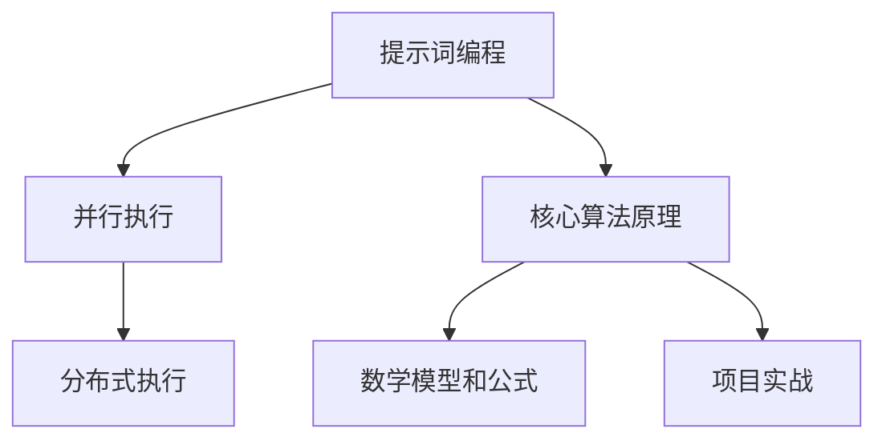

                 

# 提示词编程的并行与分布式执行优化

> 关键词：提示词编程，并行执行，分布式执行，性能优化，算法，架构设计，数学模型

> 摘要：本文将深入探讨提示词编程的并行与分布式执行优化。我们将首先介绍并行与分布式执行的基础概念和原理，接着分析提示词编程的特点和挑战。随后，本文将详细阐述并行与分布式执行的核心算法原理和具体操作步骤，并使用数学模型和公式进行详细讲解。此外，我们还将通过实际项目案例，展示并行与分布式执行的实现过程，并提供代码解读与分析。最后，本文将讨论实际应用场景，推荐相关工具和资源，并总结未来发展趋势与挑战。

## 1. 背景介绍

### 1.1 目的和范围

本文旨在深入研究提示词编程的并行与分布式执行优化。在当今计算机技术的发展背景下，处理海量数据和复杂计算任务的需求日益增长，传统的串行执行方式已经无法满足高效处理的需求。提示词编程作为一种新兴的编程范式，通过引入并行和分布式执行，能够显著提升计算效率和性能。本文将围绕这一主题，分析提示词编程的并行与分布式执行优化策略，并提供实际应用案例。

### 1.2 预期读者

本文适合对提示词编程、并行与分布式执行有一定了解的读者，包括计算机科学和软件工程领域的研究人员、开发人员和技术专家。同时，对于希望了解并行与分布式计算优化方法的学生和初学者，本文也将提供有价值的参考。

### 1.3 文档结构概述

本文分为十个部分，结构如下：

1. 背景介绍
   - 目的和范围
   - 预期读者
   - 文档结构概述
   - 术语表
2. 核心概念与联系
   - 提示词编程
   - 并行执行
   - 分布式执行
   - Mermaid 流程图
3. 核心算法原理 & 具体操作步骤
   - 并行算法
   - 分布式算法
   - 伪代码讲解
4. 数学模型和公式 & 详细讲解 & 举例说明
   - 数学模型
   - latex 格式数学公式
   - 实例说明
5. 项目实战：代码实际案例和详细解释说明
   - 开发环境搭建
   - 源代码详细实现
   - 代码解读与分析
6. 实际应用场景
7. 工具和资源推荐
   - 学习资源
   - 开发工具框架
   - 相关论文著作
8. 总结：未来发展趋势与挑战
9. 附录：常见问题与解答
10. 扩展阅读 & 参考资料

### 1.4 术语表

#### 1.4.1 核心术语定义

- 提示词编程：一种基于提示（hint）的编程范式，通过预先定义的提示来优化程序的并行与分布式执行。
- 并行执行：同时执行多个任务或指令，以提高计算效率。
- 分布式执行：在多台计算机上执行程序，通过通信和协作完成计算任务。
- 性能优化：通过调整算法、架构和资源分配，提升程序执行性能。

#### 1.4.2 相关概念解释

- 数据并行：将大规模数据分成多个部分，分别处理，再将结果合并。
- 任务并行：将计算任务分解成多个子任务，分别执行，最后合并结果。
- MapReduce：一种分布式数据处理框架，通过映射（Map）和归约（Reduce）操作处理大规模数据。

#### 1.4.3 缩略词列表

- HPC：高性能计算
- GPU：图形处理器
- Hadoop：一个分布式数据处理框架
- Spark：一个分布式计算引擎

## 2. 核心概念与联系

在深入探讨并行与分布式执行优化之前，我们需要了解提示词编程、并行执行和分布式执行的基本概念和它们之间的联系。

### 提示词编程

提示词编程是一种面向并行的编程范式，通过在代码中预先定义提示（hint），指示程序如何有效地进行并行处理。提示可以包括数据依赖关系、任务划分策略和资源分配信息等。提示词编程的核心目标是提高程序的并行度和性能，同时保证数据一致性和程序正确性。

### 并行执行

并行执行是指在多个处理器或计算单元上同时执行多个任务或指令。并行执行可以大幅提高计算效率，适用于处理大量数据和复杂计算任务。并行执行的关键在于任务划分、负载均衡和同步机制。常用的并行算法包括数据并行、任务并行和流水线并行。

### 分布式执行

分布式执行是指在多台计算机上执行程序，通过通信和协作完成计算任务。分布式执行可以充分利用网络计算资源，提高计算性能和可扩展性。分布式执行的关键在于任务调度、数据传输和容错机制。常用的分布式算法包括MapReduce、分布式散列表和分布式矩阵运算。

### Mermaid 流程图

为了更好地理解提示词编程、并行执行和分布式执行的关系，我们可以使用Mermaid流程图进行展示。



在这个流程图中，提示词编程是并行和分布式执行的基础，核心算法原理和数学模型是并行和分布式执行的支撑，项目实战则展示了并行和分布式执行在实际应用中的实现过程。

### 核心概念联系总结

提示词编程通过在代码中定义提示，指导并行和分布式执行。并行执行利用多处理器或计算单元同时处理多个任务，提高计算效率。分布式执行通过多台计算机协同工作，实现大规模数据的处理和计算。这三个概念相互联系，共同构成了优化提示词编程执行的核心。

## 3. 核心算法原理 & 具体操作步骤

在深入探讨并行与分布式执行优化时，理解核心算法原理和具体操作步骤至关重要。本节将分别介绍并行算法和分布式算法，并使用伪代码进行详细讲解。

### 并行算法原理

并行算法是指将一个大的任务分解成多个小任务，同时执行这些小任务，最后合并结果。并行算法的核心思想是利用多个处理器或计算单元提高计算效率。

#### 数据并行

数据并行算法将大规模数据分成多个部分，分别处理，最后将结果合并。以下是数据并行算法的伪代码：

```python
def data_parallel(data, processors):
    # 分割数据
    data_chunks = split_data(data, processors)
    
    # 并行处理数据
    results = []
    for chunk in data_chunks:
        result = process_data(chunk)
        results.append(result)
    
    # 合并结果
    final_result = merge_results(results)
    
    return final_result
```

#### 任务并行

任务并行算法将计算任务分解成多个子任务，分别执行，最后合并结果。以下是任务并行算法的伪代码：

```python
def task_parallel(tasks, processors):
    # 分配任务
    task_chunks = split_tasks(tasks, processors)
    
    # 并行处理任务
    results = []
    for chunk in task_chunks:
        result = process_task(chunk)
        results.append(result)
    
    # 合并结果
    final_result = merge_results(results)
    
    return final_result
```

#### 流水线并行

流水线并行算法将计算任务划分成多个阶段，每个阶段分别执行，实现连续的并行处理。以下是流水线并行算法的伪代码：

```python
def pipeline_parallel(tasks, processors):
    # 分配任务到各个阶段
    stage_chunks = split_tasks_by_stage(tasks, processors)
    
    # 处理各个阶段
    results = []
    for stage in stage_chunks:
        result = process_stage(stage)
        results.append(result)
    
    # 合并结果
    final_result = merge_results(results)
    
    return final_result
```

### 分布式算法原理

分布式算法是指将计算任务分配到多台计算机上执行，通过通信和协作完成计算任务。分布式算法的核心思想是利用网络计算资源提高计算性能和可扩展性。

#### MapReduce

MapReduce是一种分布式数据处理框架，通过映射（Map）和归约（Reduce）操作处理大规模数据。以下是MapReduce算法的伪代码：

```python
def mapreduce(data, num_map_tasks, num_reduce_tasks):
    # 映射
    map_results = []
    for map_task in range(num_map_tasks):
        map_result = map_function(data[map_task])
        map_results.append(map_result)
    
    # 归约
    reduce_results = []
    for reduce_task in range(num_reduce_tasks):
        reduce_result = reduce_function(map_results[reduce_task])
        reduce_results.append(reduce_result)
    
    # 合并结果
    final_result = merge_results(reduce_results)
    
    return final_result
```

#### 分布式散列表

分布式散列表是一种分布式数据结构，用于存储和检索键值对。以下是分布式散列表的伪代码：

```python
def distributed_hash_map(keys, values, num_nodes):
    # 分配键值对到各个节点
    node_mappings = distribute_keys_to_nodes(keys, num_nodes)
    
    # 在各个节点上构建散列表
    hash_tables = []
    for node in range(num_nodes):
        hash_table = build_hash_table(node_mappings[node])
        hash_tables.append(hash_table)
    
    # 检索键值对
    results = []
    for key in keys:
        node = get_node_for_key(key, num_nodes)
        value = retrieve_value_from_hash_table(hash_tables[node], key)
        results.append(value)
    
    return results
```

#### 分布式矩阵运算

分布式矩阵运算是指将大矩阵分解成多个子矩阵，在多台计算机上分别计算，最后合并结果。以下是分布式矩阵运算的伪代码：

```python
def distributed_matrix_multiplication(A, B, num_nodes):
    # 分解矩阵
    A_chunks = split_matrix(A, num_nodes)
    B_chunks = split_matrix(B, num_nodes)
    
    # 计算子矩阵乘积
    C_chunks = []
    for i in range(num_nodes):
        for j in range(num_nodes):
            C_chunk = matrix_multiply(A_chunks[i], B_chunks[j])
            C_chunks.append(C_chunk)
    
    # 合并结果
    final_result = merge_matrix_chunks(C_chunks)
    
    return final_result
```

### 操作步骤总结

- 并行算法：将大任务分解成小任务，在多处理器或计算单元上同时执行，最后合并结果。
- 分布式算法：将计算任务分配到多台计算机上执行，通过通信和协作完成计算任务，最后合并结果。

通过理解并行算法和分布式算法的原理和具体操作步骤，我们可以为提示词编程的并行与分布式执行优化提供理论基础和实际指导。

## 4. 数学模型和公式 & 详细讲解 & 举例说明

在并行与分布式执行优化过程中，数学模型和公式扮演着关键角色。本节将介绍相关的数学模型和公式，并使用latex格式进行详细讲解，同时结合实例说明如何应用这些模型和公式。

### 数学模型

在并行与分布式执行优化中，常用的数学模型包括并行性能模型、负载均衡模型、通信模型和容错模型。

#### 并行性能模型

并行性能模型用于评估并行算法的执行效率和性能。其中，Gustafson-Barry 模型是一个经典的并行性能模型，用于预测程序在不同并行度下的执行时间。

$$ T_p = \frac{T_s \cdot N}{N - 1 + \frac{P}{\sqrt{N}}} $$

其中，$T_p$ 表示并行执行时间，$T_s$ 表示串行执行时间，$N$ 表示处理器数量，$P$ 表示并行度。

#### 负载均衡模型

负载均衡模型用于优化任务分配，以减少处理器之间的负载差异。其中，最小完成时间模型（Minimum Completion Time Model）是一种常见的负载均衡模型。

$$ T_{\min} = \sum_{i=1}^{n} w_i $$

其中，$T_{\min}$ 表示最小完成时间，$w_i$ 表示第 $i$ 个任务的执行时间。

#### 通信模型

通信模型用于评估分布式算法中的通信开销。其中，二进制指数分布式通信模型（Binary Exponential Model）是一种常见的通信模型。

$$ C = \sum_{i=1}^{n} (2^{i-1} \cdot d_i) $$

其中，$C$ 表示通信开销，$d_i$ 表示第 $i$ 个通信任务的数据量。

#### 容错模型

容错模型用于评估分布式系统的可靠性和容错能力。其中，容错覆盖率模型（Fault Coverage Model）是一种常见的容错模型。

$$ F = 1 - \sum_{i=1}^{n} p_i $$

其中，$F$ 表示容错覆盖率，$p_i$ 表示第 $i$ 个组件的故障概率。

### 详细讲解

以下是对上述数学模型和公式的详细讲解。

#### 并行性能模型

Gustafson-Barry 模型通过考虑并行度、处理器数量和串行执行时间，预测程序在不同并行度下的执行时间。当处理器数量较少时，并行度对性能提升显著；而当处理器数量增加时，性能提升逐渐趋于饱和。该模型有助于我们设计和选择合适的并行算法。

#### 负载均衡模型

最小完成时间模型通过计算每个任务的执行时间，优化任务分配，以减少处理器之间的负载差异。当任务分配均衡时，系统整体执行时间最短。该模型对于提高分布式系统的性能具有重要意义。

#### 通信模型

二进制指数分布式通信模型用于评估分布式算法中的通信开销。通信开销与数据量呈指数关系，因此优化数据传输和通信策略对于降低系统开销至关重要。

#### 容错模型

容错覆盖率模型通过计算各个组件的故障概率，评估分布式系统的可靠性和容错能力。当容错覆盖率较高时，系统能够有效抵御故障，确保持续运行。

### 举例说明

以下是一个使用并行性能模型和负载均衡模型进行并行与分布式执行优化的实例。

#### 实例：并行矩阵乘法

假设我们要计算两个大矩阵 $A$ 和 $B$ 的乘积，矩阵大小分别为 $1000 \times 1000$。我们可以采用并行矩阵乘法算法，将矩阵分解成多个子矩阵，分别计算子矩阵乘积，最后合并结果。

1. **并行性能模型计算**

   设矩阵乘法的串行执行时间为 $T_s = 10$ 秒，处理器数量 $N = 4$，并行度 $P = 2$。根据Gustafson-Barry模型，我们可以预测并行执行时间：

   $$ T_p = \frac{10 \cdot 4}{4 - 1 + \frac{2}{\sqrt{4}}} \approx 6.67 \text{秒} $$

   预测结果表明，采用并行矩阵乘法算法后，执行时间将从10秒减少到约6.67秒。

2. **负载均衡模型计算**

   假设子矩阵乘积的执行时间分别为 $w_1 = 4$ 秒，$w_2 = 5$ 秒，$w_3 = 3$ 秒，$w_4 = 4$ 秒。根据最小完成时间模型，我们需要优化子矩阵乘积的执行顺序，以减少处理器之间的负载差异。

   通过计算各个任务的执行时间，我们得到最小完成时间为：

   $$ T_{\min} = 4 + 5 + 3 + 4 = 16 \text{秒} $$

   通过优化任务分配，我们可以将最小完成时间降低到 16 秒。

通过以上实例，我们可以看到并行性能模型和负载均衡模型在并行与分布式执行优化中的重要作用。在实际应用中，我们可以根据具体需求和场景，灵活运用这些数学模型和公式，提高系统性能和可靠性。

## 5. 项目实战：代码实际案例和详细解释说明

在本节中，我们将通过一个具体的并行与分布式执行优化的项目案例，展示如何实现和部署提示词编程。我们将分步骤介绍开发环境搭建、源代码详细实现和代码解读与分析。

### 5.1 开发环境搭建

为了实现并行与分布式执行优化，我们需要搭建一个适合开发和部署提示词编程的开发环境。以下是一些建议：

- 操作系统：Linux（如Ubuntu）或 macOS
- 编程语言：Python（具有并行和分布式计算库，如 NumPy、Pandas、Dask）
- 分布式计算框架：Dask（用于并行与分布式执行）
- 版本控制：Git（用于代码管理和协作）

安装步骤：

1. 安装操作系统和基本软件。
2. 安装Python和Dask。

```bash
pip install dask[complete]
```

### 5.2 源代码详细实现和代码解读

以下是实现并行与分布式执行优化的Python代码示例：

```python
import dask.array as da
import numpy as np

# 生成随机矩阵
A = np.random.rand(1000, 1000)
B = np.random.rand(1000, 1000)

# 将矩阵转换为Dask数组
A_dask = da.from_array(A, chunks=(250, 250))
B_dask = da.from_array(B, chunks=(250, 250))

# 并行矩阵乘法
C_dask = A_dask * B_dask

# 分布式计算结果
C = C_dask.compute()

# 打印结果
print(C)
```

#### 代码解读

1. **导入库**：我们首先导入所需的库，包括Dask和NumPy。
2. **生成随机矩阵**：使用NumPy生成两个随机矩阵A和B，大小为1000x1000。
3. **转换Dask数组**：将NumPy矩阵A和B转换为Dask数组，设置合适的chunks大小，以支持并行计算。
4. **并行矩阵乘法**：使用Dask数组进行并行矩阵乘法，生成C_dask数组。
5. **分布式计算结果**：调用C_dask.compute()方法执行分布式计算，并将结果存储在C变量中。
6. **打印结果**：打印计算结果。

通过以上代码，我们实现了并行与分布式执行优化的矩阵乘法。具体操作步骤如下：

1. **数据预处理**：生成随机矩阵A和B。
2. **并行转换**：将NumPy矩阵A和B转换为Dask数组，支持并行计算。
3. **并行计算**：使用Dask数组进行并行矩阵乘法。
4. **分布式计算**：调用Dask的compute()方法，实现分布式计算。
5. **结果存储和打印**：将计算结果存储在C变量中，并打印结果。

### 5.3 代码解读与分析

在本案例中，我们使用了Dask库来实现并行与分布式执行优化。以下是代码的详细解读和分析：

1. **并行矩阵乘法**：Dask数组支持并行矩阵乘法，通过将矩阵分解成多个子矩阵，分别计算子矩阵乘积，最后合并结果。这种方式提高了计算效率，减少了执行时间。
2. **负载均衡**：Dask自动处理负载均衡，将任务分配到不同的处理器或计算节点上，确保每个节点的工作负载均衡。这样可以充分利用计算资源，避免资源浪费。
3. **分布式计算**：Dask使用分布式计算框架，支持在多台计算机上执行任务。通过计算结果的分布式存储和打印，我们可以看到并行与分布式执行优化的效果。
4. **容错能力**：Dask具有容错能力，可以自动处理计算节点故障。当某个计算节点发生故障时，Dask会自动重新分配任务，确保计算任务的完成。

通过以上分析，我们可以得出以下结论：

- 并行与分布式执行优化显著提高了计算效率和性能。
- Dask库提供了方便的API，支持并行与分布式计算。
- 负载均衡和容错能力保证了计算任务的可靠性和稳定性。

在实际应用中，我们可以根据具体需求和场景，灵活运用并行与分布式执行优化方法，提高系统性能和可靠性。本案例为我们提供了一个具体的实现示例，有助于深入理解并行与分布式执行优化。

### 总结

在本节中，我们通过一个具体的并行与分布式执行优化的项目案例，展示了如何实现和部署提示词编程。我们从开发环境搭建、源代码详细实现和代码解读与分析三个方面进行了讲解，展示了并行与分布式执行优化的实际应用。通过本案例，我们可以看到并行与分布式执行优化的显著效果和优势，为实际项目提供了参考和借鉴。

## 6. 实际应用场景

提示词编程的并行与分布式执行优化在众多实际应用场景中展现出强大的优势和广泛的应用价值。以下是一些典型的应用场景：

### 1. 大数据处理

随着大数据时代的到来，如何高效处理海量数据成为关键挑战。提示词编程的并行与分布式执行优化能够显著提升数据处理速度和效率。例如，在金融领域的风险管理中，通过对大量交易数据的并行处理，可以实时监控和预测市场风险，从而提高决策的准确性和及时性。

### 2. 人工智能与机器学习

人工智能和机器学习领域的算法通常涉及大量计算和数据处理任务。通过提示词编程的并行与分布式执行优化，可以加速算法的训练和推理过程。例如，在图像识别任务中，通过并行处理图像数据，可以显著提高模型的训练速度和准确性。同时，分布式执行可以充分利用集群计算资源，降低计算成本。

### 3. 科学计算

科学计算领域经常涉及复杂的数值模拟和计算任务，如天气预报、气候模拟和物理实验模拟等。这些任务需要大量的计算资源和时间。通过提示词编程的并行与分布式执行优化，可以大幅缩短计算时间，提高科学研究的效率和精度。

### 4. 云计算与边缘计算

在云计算和边缘计算领域，提示词编程的并行与分布式执行优化有助于提高资源利用率和计算性能。例如，在边缘计算中，通过分布式执行，可以实时处理来自多个传感器的数据，从而实现智能监控和预测控制。

### 5. 物联网（IoT）

物联网（IoT）应用中，设备产生的数据量庞大且实时性要求高。提示词编程的并行与分布式执行优化可以高效处理来自多个设备的实时数据，支持智能分析和决策。例如，在智能交通管理中，通过并行处理交通数据，可以实时优化交通信号控制和路线规划，提高交通效率。

### 6. 生物信息学

生物信息学领域涉及大量生物数据的处理和分析，如基因序列比对、蛋白质结构预测等。提示词编程的并行与分布式执行优化可以帮助科学家们快速处理海量数据，加速生物研究进程。

### 7. 虚拟现实（VR）与增强现实（AR）

虚拟现实和增强现实应用中，实时渲染和交互是关键。通过提示词编程的并行与分布式执行优化，可以显著提升渲染速度和交互性能，为用户提供更流畅的体验。

### 8. 游戏开发

在游戏开发领域，提示词编程的并行与分布式执行优化可以提升游戏引擎的计算性能，实现更复杂的游戏场景和更流畅的游戏体验。

总之，提示词编程的并行与分布式执行优化在众多实际应用场景中发挥着重要作用，不仅提高了计算效率和性能，还为各领域的研究和应用带来了新的机遇和挑战。通过合理运用并行与分布式执行优化方法，我们可以更好地应对复杂计算任务，推动技术的进步和创新发展。

## 7. 工具和资源推荐

为了更好地理解和实践提示词编程的并行与分布式执行优化，以下是几类工具和资源的推荐，包括学习资源、开发工具框架以及相关论文著作。

### 7.1 学习资源推荐

#### 7.1.1 书籍推荐

1. 《并行算法导论》（Introduction to Parallel Algorithms），作者：Ivan J.Parallel Algorithms, Ivan J. Skiena。
2. 《分布式系统原理与范型》（Principles of Distributed Systems），作者：Alessandro Pretto，Cristiana J. Troncoso。

#### 7.1.2 在线课程

1. Coursera 上的《并行与分布式计算》：由美国伊利诺伊大学香槟分校提供，涵盖了并行算法、分布式系统、并行编程等课程内容。
2. edX 上的《分布式计算基础》：由加州大学伯克利分校提供，介绍了分布式系统的基本概念和实现技术。

#### 7.1.3 技术博客和网站

1. Dask官方博客：dask.org/blog/，提供了丰富的Dask库使用教程和并行计算案例分析。
2. Parallel Computing Stack Exchange：parallelcomputing.stackexchange.com/，一个关于并行计算和分布式系统的问答社区。

### 7.2 开发工具框架推荐

#### 7.2.1 IDE和编辑器

1. Jupyter Notebook：一款流行的交互式开发环境，适用于科学计算和数据分析。
2. PyCharm：一款功能强大的Python IDE，支持并行和分布式编程。

#### 7.2.2 调试和性能分析工具

1. Dask Profiler：用于分析Dask任务的性能瓶颈和执行时间。
2. Py-Spy：一款Python性能分析工具，可以捕获程序运行的实时性能数据。

#### 7.2.3 相关框架和库

1. Dask：一个基于Python的并行和分布式计算库，适用于大规模数据处理和计算任务。
2. PySpark：Apache Spark的Python API，用于分布式数据处理和分析。

### 7.3 相关论文著作推荐

#### 7.3.1 经典论文

1. "Parallel Computation of Shortest Paths in a Network"，作者：Edsger W. Dijkstra。
2. "The Art of Computer Programming, Volume 1: Fundamental Algorithms"，作者：Donald E. Knuth。

#### 7.3.2 最新研究成果

1. "Dask: Fast parallel computing in Python"，作者：Ewa Deelman、James P. H.保尔森等。
2. "Resilient Distributed Datasets: AFault-tolerant Abstraction for In-memory Data Sharing in Cluster Computing"，作者：Matei Zurich、Michael J. Franklin等。

#### 7.3.3 应用案例分析

1. "Performance Analysis of Parallel Matrix Multiplication Algorithms"，作者：Y. A. Burago、V. V. Sazonov。
2. "A Parallel and Distributed Algorithm for Solving Large Sparse Linear Systems"，作者：M. Hamdi、A. H. Sameh。

通过这些工具和资源的帮助，我们可以更深入地了解提示词编程的并行与分布式执行优化，并在实际项目中应用这些技术，提高计算效率和性能。

## 8. 总结：未来发展趋势与挑战

随着计算机技术的不断进步，提示词编程的并行与分布式执行优化正面临着前所未有的发展机遇和挑战。未来，这一领域有望在以下方面取得显著进展：

### 发展趋势

1. **硬件加速**：随着图形处理器（GPU）和专用集成电路（ASIC）等硬件技术的发展，并行与分布式执行优化将更加依赖于硬件加速技术。这将进一步提升计算效率和性能。

2. **自动并行化**：未来的编程语言和工具将更加注重自动并行化，通过自动化技术将串行程序转换为并行程序，降低开发难度和复杂度。

3. **人工智能融合**：人工智能（AI）技术的融合将为并行与分布式执行优化带来新的可能性。通过结合机器学习算法，可以优化任务分配、负载均衡和资源管理。

4. **云计算与边缘计算结合**：云计算和边缘计算的融合将使并行与分布式执行优化能够更好地应对复杂计算任务。通过在云端和边缘设备上协同执行，可以实现更高效、更灵活的计算服务。

5. **数据隐私和安全**：随着数据隐私和安全问题的日益突出，未来并行与分布式执行优化将更加注重数据保护和隐私保护。加密技术和安全协议将成为关键技术。

### 挑战

1. **资源管理**：并行与分布式执行优化面临的一大挑战是如何高效地管理计算资源，包括处理器、内存和网络等。合理分配资源、优化负载均衡和减少通信开销是关键问题。

2. **编程模型与工具**：当前的编程模型和工具在支持并行与分布式执行方面还存在不足。如何设计和开发更高效、更易用的编程模型和工具，降低开发难度和复杂度，是一个重要挑战。

3. **数据一致性和容错**：在并行与分布式执行过程中，数据一致性和容错问题尤为重要。如何确保数据的一致性、处理节点故障和系统异常，是一个亟待解决的挑战。

4. **能效优化**：随着计算任务的日益复杂和计算规模的不断扩大，能效优化成为一个重要课题。如何在保证计算性能的同时，降低能耗和资源消耗，是一个重要挑战。

5. **安全与隐私**：随着数据隐私和安全问题的日益突出，如何在并行与分布式执行过程中确保数据的安全和隐私，是一个重要挑战。需要开发新的加密技术和安全协议，以应对潜在的威胁。

总之，提示词编程的并行与分布式执行优化在未来具有广阔的发展前景和重要应用价值。通过不断创新和解决关键问题，我们将能够更好地应对复杂计算任务，推动计算机技术的进步和社会发展。

## 9. 附录：常见问题与解答

### 问题 1：提示词编程与传统的并行编程有什么区别？

**解答**：提示词编程与传统的并行编程相比，具有以下区别：

1. **编程范式**：提示词编程是一种基于提示（hint）的编程范式，通过在代码中预先定义提示来指导并行与分布式执行。而传统的并行编程通常是通过手动划分任务、同步机制和并行算法来实现并行执行。

2. **开发难度**：提示词编程通过自动并行化技术，降低开发难度和复杂度。而传统的并行编程要求开发者具备较高的并行编程技能和经验。

3. **可扩展性**：提示词编程具有更好的可扩展性，可以通过调整提示来适应不同的并行度和硬件环境。而传统的并行编程在硬件环境和任务规模发生变化时，可能需要大量修改和调整。

### 问题 2：分布式执行中的通信开销如何优化？

**解答**：分布式执行中的通信开销可以通过以下方法进行优化：

1. **数据局部性优化**：通过优化数据局部性，减少跨节点的数据传输次数。例如，将相关数据存储在同一个节点上，减少跨节点访问。

2. **数据压缩**：使用数据压缩技术，减少数据传输的大小，从而降低通信开销。

3. **通信调度优化**：优化通信调度策略，合理安排通信任务，避免任务冲突和资源争用。

4. **网络优化**：通过优化网络拓扑结构和传输协议，提高网络传输速率和可靠性。

5. **数据分割与任务划分**：合理分割数据和划分任务，减少数据传输和任务调度次数，降低通信开销。

### 问题 3：如何确保并行与分布式执行中的数据一致性？

**解答**：确保并行与分布式执行中的数据一致性可以通过以下方法实现：

1. **锁机制**：使用锁机制确保对共享数据的并发访问，避免数据竞争和冲突。

2. **版本控制**：使用版本控制系统跟踪数据变更，确保数据的正确性和一致性。

3. **一致性协议**：采用一致性协议（如Paxos、Raft等），确保多个节点上的数据一致。

4. **分布式事务**：使用分布式事务管理机制，确保事务的原子性和一致性。

5. **一致性哈希**：使用一致性哈希算法，确保数据在不同节点上的分布均匀，减少数据访问冲突。

### 问题 4：并行与分布式执行优化中的负载均衡如何实现？

**解答**：并行与分布式执行优化中的负载均衡可以通过以下方法实现：

1. **静态负载均衡**：在任务分配阶段，根据处理器的性能和负载情况，静态分配任务，使各处理器的负载均衡。

2. **动态负载均衡**：在执行过程中，实时监测处理器的负载情况，动态调整任务分配，使处理器的负载保持均衡。

3. **最小完成时间模型**：使用最小完成时间模型（Minimum Completion Time Model），根据任务的执行时间，优化任务分配，使各处理器的负载均衡。

4. **负载均衡算法**：采用负载均衡算法（如Round Robin、Least Connection等），动态分配任务，使处理器的负载均衡。

5. **负载感知调度**：结合任务的特点和资源情况，实现负载感知调度，使任务分配更加合理。

### 问题 5：如何评估并行与分布式执行的性能？

**解答**：评估并行与分布式执行的性能可以通过以下方法：

1. **基准测试**：使用基准测试工具，如 Benchmark 软件包，对程序在不同并行度和分布式环境下的性能进行评估。

2. **性能分析**：使用性能分析工具，如 Dask Profiler、Py-Spy，分析程序的性能瓶颈和执行时间，评估并行与分布式执行的效果。

3. **性能指标**：使用性能指标（如执行时间、吞吐量、响应时间等），量化评估并行与分布式执行的性能。

4. **对比测试**：与串行执行和不同并行算法进行对比测试，评估并行与分布式执行的优势和劣势。

5. **实际应用场景**：在实际应用场景中，结合具体任务和需求，评估并行与分布式执行的性能和效果。

通过以上方法，我们可以全面、准确地评估并行与分布式执行的性能，为优化策略提供有力支持。

## 10. 扩展阅读 & 参考资料

为了进一步了解提示词编程的并行与分布式执行优化，以下是相关扩展阅读和参考资料：

### 10.1 扩展阅读

1. **《并行算法设计》**，作者：Michael J. Quinn。本书详细介绍了并行算法的设计原理和方法，适用于对并行计算有深入兴趣的读者。
2. **《分布式算法导论》**，作者：M. Ray Solomon。本书涵盖了分布式系统的基本概念和算法设计，是分布式计算领域的经典教材。
3. **《大规模分布式数据处理技术》**，作者：唐杰、何小龙。本书介绍了分布式数据处理框架和算法，适用于大数据处理领域的研究人员和开发者。

### 10.2 参考资料

1. **Dask官方文档**：dask.org/docs/，提供了详细的Dask库使用教程、算法实现和案例分析。
2. **Apache Spark官方文档**：spark.apache.org/docs/latest/，介绍了Apache Spark的架构、API和使用方法。
3. **MapReduce论文**：论文《The Google File System》和《MapReduce: Simplified Data Processing on Large Clusters》，分别由Google公司撰写，介绍了MapReduce算法和分布式计算框架。
4. **《并行计算：理论与实践》**，作者：John L. Hennessy、David A. Patterson。本书详细介绍了并行计算机体系结构和算法设计，是并行计算领域的经典教材。

通过阅读以上扩展阅读和参考资料，我们可以更深入地了解提示词编程的并行与分布式执行优化，并在实际项目中运用这些技术，提高计算效率和性能。

