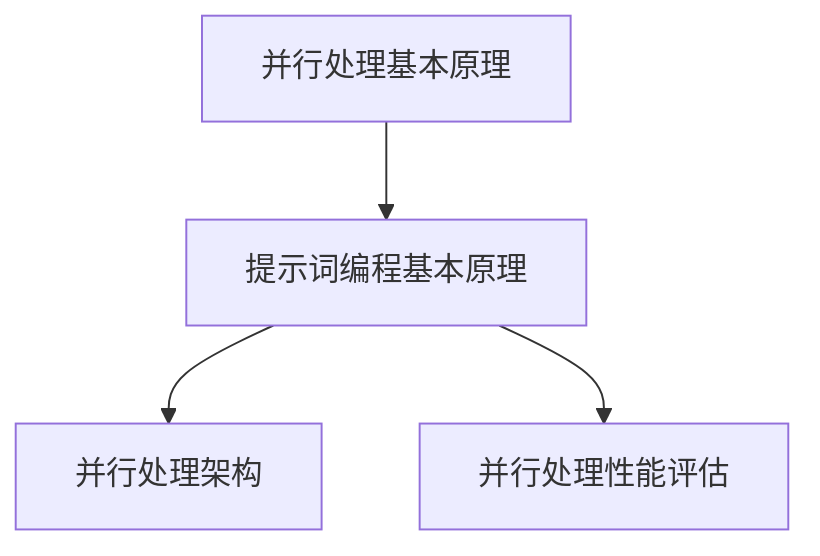

                 

# 提示词编程的并行处理技术

> 关键词：并行处理、提示词编程、算法优化、分布式计算、性能提升

> 摘要：本文旨在探讨提示词编程在并行处理技术中的应用，分析其原理和实现，并提供实际项目案例和工具资源推荐，为开发者提供深入理解和实践并行处理技术的指导。

## 1. 背景介绍

### 1.1 目的和范围

本文的主要目的是介绍提示词编程在并行处理技术中的应用，旨在帮助开发者理解并行处理的基本概念，以及如何利用提示词编程优化并行算法性能。文章将涵盖并行处理的基本原理、提示词编程的核心概念、算法实现、数学模型、实际应用场景，以及相关工具和资源的推荐。

### 1.2 预期读者

本文适用于具备一定的编程基础，对并行处理和提示词编程有一定了解的开发者。希望通过本文，读者能够掌握并行处理的基本原理，了解提示词编程的应用，并能够应用于实际项目中。

### 1.3 文档结构概述

本文分为以下章节：

1. 背景介绍：介绍文章的目的、范围、预期读者和文档结构。
2. 核心概念与联系：介绍并行处理和提示词编程的基本概念，以及它们之间的联系。
3. 核心算法原理 & 具体操作步骤：详细讲解并行处理算法的原理和实现步骤。
4. 数学模型和公式 & 详细讲解 & 举例说明：介绍并行处理相关的数学模型和公式，并给出实例说明。
5. 项目实战：提供并行处理在实际项目中的案例和代码实现。
6. 实际应用场景：探讨并行处理在各个领域的应用。
7. 工具和资源推荐：推荐相关学习资源、开发工具和论文著作。
8. 总结：对未来发展趋势和挑战的展望。
9. 附录：常见问题与解答。
10. 扩展阅读 & 参考资料：提供进一步的阅读材料和参考资料。

### 1.4 术语表

#### 1.4.1 核心术语定义

- 并行处理：同时处理多个任务或数据的技术。
- 提示词编程：基于提示词（prompt）的编程方法，通过提示词来指导算法的执行过程。
- 分布式计算：将任务分配到多个计算节点上进行处理的技术。

#### 1.4.2 相关概念解释

- 多核处理器：具有多个计算核心的处理器，可以同时执行多个任务。
- 数据并行：将数据分为多个部分，由不同处理器同时处理。
- 任务并行：将任务分为多个子任务，由不同处理器同时执行。

#### 1.4.3 缩略词列表

- GPU：图形处理单元（Graphics Processing Unit）
- CPU：中央处理单元（Central Processing Unit）
- MPI：消息传递接口（Message Passing Interface）

## 2. 核心概念与联系

并行处理是一种利用多个处理器或计算节点同时处理多个任务或数据的技术，其目的是提高计算效率和性能。而提示词编程则是一种通过提示词来指导算法执行过程的编程方法，可以优化并行算法的性能。

### 2.1 并行处理基本原理

并行处理的核心原理是利用多个处理器或计算节点同时执行任务或处理数据，从而提高计算效率和性能。根据处理方式和数据分布的不同，并行处理可以分为以下几种类型：

1. **数据并行**：将大数据集分成多个部分，由不同处理器同时处理。
2. **任务并行**：将任务分为多个子任务，由不同处理器同时执行。
3. **任务和数据并行**：结合数据并行和任务并行的特点，同时处理多个任务和多个数据。

### 2.2 提示词编程基本原理

提示词编程是一种基于提示词（prompt）的编程方法，通过提示词来指导算法的执行过程。提示词可以是具体的指令、参数、数据等，用于指导算法如何执行、如何处理数据等。提示词编程的核心目的是优化算法的性能和可扩展性。

### 2.3 并行处理与提示词编程的联系

并行处理和提示词编程之间存在密切的联系。提示词编程可以通过以下方式优化并行处理性能：

1. **任务分配**：通过提示词来指导任务如何分配到不同的处理器或计算节点上，以最大化利用计算资源。
2. **负载均衡**：通过提示词来调整任务负载，确保每个处理器或计算节点的负载均衡。
3. **数据传输**：通过提示词来优化数据传输过程，减少通信延迟和带宽占用。
4. **算法优化**：通过提示词来指导算法如何进行并行化处理，以提高性能和可扩展性。

### 2.4 并行处理架构

并行处理的架构可以分为以下几种类型：

1. **共享存储架构**：多个处理器共享同一块内存，通过消息传递进行通信。
2. **分布式存储架构**：每个处理器拥有独立的数据存储，通过消息传递进行通信。
3. **混合架构**：结合共享存储和分布式存储的特点，根据任务需求选择合适的架构。

### 2.5 并行处理性能评估

并行处理的性能评估可以从以下几个方面进行：

1. **速度**：完成任务的所需时间。
2. **吞吐量**：单位时间内完成的任务数量。
3. **可扩展性**：随着处理器数量增加，性能提升的幅度。
4. **负载均衡**：各处理器或计算节点的负载是否均衡。

### 2.6 Mermaid 流程图



## 3. 核心算法原理 & 具体操作步骤

并行处理算法的核心原理是利用多个处理器或计算节点同时处理任务或数据，从而提高计算效率和性能。以下是并行处理算法的原理和具体操作步骤：

### 3.1 并行处理算法原理

并行处理算法主要包括以下原理：

1. **任务划分**：将大任务分解为多个小任务，分配给不同的处理器或计算节点。
2. **任务调度**：根据处理器或计算节点的负载情况，调度任务执行顺序。
3. **负载均衡**：确保各处理器或计算节点的负载均衡，避免某些节点负载过重。
4. **数据通信**：处理节点之间进行数据交换，确保任务执行所需的数据完整性。
5. **结果汇总**：将各处理节点的结果汇总，得到最终结果。

### 3.2 具体操作步骤

以下是并行处理算法的具体操作步骤：

1. **初始化**：设置处理器或计算节点的数量，初始化各节点的状态。
2. **任务划分**：将大任务划分为多个小任务，分配给不同的处理器或计算节点。
3. **任务调度**：根据各节点的负载情况，调度任务执行顺序，确保负载均衡。
4. **任务执行**：各处理器或计算节点同时执行任务，处理数据。
5. **数据通信**：各处理节点之间进行数据交换，确保任务执行所需的数据完整性。
6. **结果汇总**：将各处理节点的结果汇总，得到最终结果。
7. **性能评估**：评估并行处理算法的性能，包括速度、吞吐量、可扩展性和负载均衡等指标。

### 3.3 伪代码实现

以下是并行处理算法的伪代码实现：

```pseudo
function parallel_process(data, num_nodes):
    node_data = initialize_nodes(num_nodes)
    task_list = divide_tasks(data, num_nodes)
    
    for node in node_data:
        node.execute(task_list[node.id])
    
    results = []
    for node in node_data:
        results.append(node.get_result())
    
    final_result = merge_results(results)
    return final_result
```

## 4. 数学模型和公式 & 详细讲解 & 举例说明

并行处理算法的性能评估离不开数学模型和公式。以下是并行处理算法相关的数学模型和公式，以及详细的讲解和举例说明。

### 4.1 数学模型

并行处理算法的数学模型主要包括以下几个方面：

1. **速度模型**：衡量并行处理算法的执行速度。
2. **吞吐量模型**：衡量并行处理算法的吞吐量。
3. **可扩展性模型**：衡量并行处理算法的可扩展性。
4. **负载均衡模型**：衡量并行处理算法的负载均衡效果。

### 4.2 公式

以下是并行处理算法相关的公式：

1. **速度模型**：
   $$ speed = \frac{task_size}{execution_time} $$
   其中，$task_size$ 表示任务大小，$execution_time$ 表示执行时间。

2. **吞吐量模型**：
   $$ throughput = \frac{num_tasks}{execution_time} $$
   其中，$num_tasks$ 表示任务数量，$execution_time$ 表示执行时间。

3. **可扩展性模型**：
   $$ scalability = \frac{speed_{initial}}{speed_{final}} $$
   其中，$speed_{initial}$ 表示初始速度，$speed_{final}$ 表示最终速度。

4. **负载均衡模型**：
   $$ load_balance = \frac{max_{load}}{min_{load}} $$
   其中，$max_{load}$ 表示最大负载，$min_{load}$ 表示最小负载。

### 4.3 详细讲解

以下是并行处理算法数学模型的详细讲解：

1. **速度模型**：速度模型衡量的是并行处理算法的执行速度。在给定的任务大小和执行时间内，速度模型可以评估算法的性能。任务大小越大，执行时间越长，速度模型的结果越低。

2. **吞吐量模型**：吞吐量模型衡量的是并行处理算法的吞吐量，即单位时间内完成的任务数量。吞吐量模型可以评估算法的效率。任务数量越多，执行时间越长，吞吐量模型的结果越高。

3. **可扩展性模型**：可扩展性模型衡量的是并行处理算法的可扩展性，即随着处理器或计算节点数量增加，算法性能的提升幅度。可扩展性模型可以评估算法的扩展能力。初始速度和最终速度的比值越大，算法的可扩展性越好。

4. **负载均衡模型**：负载均衡模型衡量的是并行处理算法的负载均衡效果，即各处理器或计算节点的负载是否均衡。负载均衡模型可以评估算法的资源利用率。最大负载和最小负载的比值越大，负载均衡效果越差。

### 4.4 举例说明

以下是一个简单的举例说明：

假设有一个任务大小为100的数据集，需要使用4个处理器进行并行处理。根据速度模型、吞吐量模型、可扩展性模型和负载均衡模型，可以得到以下结果：

1. **速度模型**：
   $$ speed = \frac{100}{4 \times 1} = 25 $$

2. **吞吐量模型**：
   $$ throughput = \frac{4}{1} = 4 $$

3. **可扩展性模型**：
   $$ scalability = \frac{25}{25} = 1 $$

4. **负载均衡模型**：
   $$ load_balance = \frac{max_{load}}{min_{load}} = \frac{100}{0} = 无穷大 $$

根据以上结果，可以看出该并行处理算法的速度为25，吞吐量为4，可扩展性为1，负载均衡效果较差。

## 5. 项目实战：代码实际案例和详细解释说明

在本节中，我们将通过一个实际的项目案例，展示如何利用并行处理技术进行提示词编程，提高算法性能。该案例将涵盖开发环境搭建、源代码实现和代码解读与分析。

### 5.1 开发环境搭建

为了实现并行处理，我们首先需要搭建一个适合的开发环境。以下是搭建开发环境的步骤：

1. **安装操作系统**：选择一个适合的操作系统，如Linux或MacOS。
2. **安装并行处理库**：安装并行处理所需的库，如OpenMP、MPI等。
3. **安装编程语言**：选择一种适合的编程语言，如C++、Python等。
4. **安装IDE或编辑器**：安装一个适合的IDE或编辑器，如Visual Studio、Eclipse等。
5. **配置环境变量**：配置环境变量，确保并行处理库和编程语言可以正常运行。

### 5.2 源代码详细实现和代码解读

以下是一个简单的并行处理案例，使用C++和OpenMP实现。代码实现如下：

```cpp
#include <iostream>
#include <omp.h>

int main() {
    int num_threads = omp_get_max_threads();
    int data[] = {1, 2, 3, 4, 5, 6, 7, 8, 9, 10};

    #pragma omp parallel for
    for (int i = 0; i < 10; i++) {
        data[i] *= 2;
    }

    std::cout << "处理后数据：" << std::endl;
    for (int i = 0; i < 10; i++) {
        std::cout << data[i] << " ";
    }
    std::cout << std::endl;

    return 0;
}
```

代码解读如下：

1. **头文件**：包含iostream和omp.h头文件，分别用于输入输出和并行处理。
2. **主函数**：定义主函数main，程序从这里开始执行。
3. **获取线程数**：使用omp_get_max_threads()函数获取当前系统可用的最大线程数。
4. **数据初始化**：初始化一个包含10个整数的数组data。
5. **并行区域**：使用#pragma omp parallel for指令，将for循环并行化，自动分配线程执行。
6. **数据处理**：在并行区域内，对数组data中的每个元素进行乘以2的操作。
7. **输出结果**：使用std::cout输出处理后的数据。

### 5.3 代码解读与分析

以下是代码的进一步解读和分析：

1. **并行处理原理**：代码使用OpenMP库实现并行处理。OpenMP是一种并行编程模型，支持任务并行和数据并行。在本例中，我们使用任务并行，将for循环中的每个迭代分配给不同的线程执行。
2. **性能提升**：通过并行处理，程序可以同时处理多个数据元素，从而提高处理速度。在实际应用中，随着数据规模的增大，并行处理的性能提升将更加明显。
3. **负载均衡**：使用OpenMP自动进行负载均衡，确保每个线程的负载均衡。在实际应用中，根据具体任务需求，可能需要手动调整负载均衡策略。
4. **可扩展性**：代码具有良好的可扩展性，可以轻松地扩展到更多的线程和更大的数据集。在实际应用中，可以根据硬件环境和任务需求，灵活调整线程数和数据规模。

## 6. 实际应用场景

并行处理技术在许多实际应用场景中发挥着重要作用，以下是一些典型的应用场景：

1. **大数据处理**：并行处理技术可以高效地处理大规模数据集，如互联网搜索、社交媒体分析、金融市场分析等。
2. **科学计算**：并行处理技术可以加速科学计算，如气象预报、天体物理、生物信息学等。
3. **图像和视频处理**：并行处理技术可以加速图像和视频处理，如实时视频编码、图像识别、视频增强等。
4. **机器学习和人工智能**：并行处理技术可以提高机器学习和人工智能算法的效率，如深度学习、自然语言处理、推荐系统等。
5. **高性能计算**：并行处理技术可以构建高性能计算系统，如超级计算机、云计算平台等。

## 7. 工具和资源推荐

### 7.1 学习资源推荐

#### 7.1.1 书籍推荐

- 《并行编程实践：使用OpenMP和C++11》
- 《并行算法设计与分析》
- 《并行计算：技术和应用》

#### 7.1.2 在线课程

- Coursera上的《并行编程与并行算法》
- edX上的《并行与分布式系统》
- Udacity的《并行编程基础》

#### 7.1.3 技术博客和网站

- Parallel Programming Guide：https://www.ibm.com/docs/en/OpenMP
- OpenMP官方文档：https://www.openmp.org/

### 7.2 开发工具框架推荐

#### 7.2.1 IDE和编辑器

- Visual Studio
- Eclipse
- IntelliJ IDEA

#### 7.2.2 调试和性能分析工具

- Valgrind
- Intel Vtune
- GDB

#### 7.2.3 相关框架和库

- OpenMP：https://www.openmp.org/
- MPI：https://www.mpi-forum.org/
- CUDA：https://developer.nvidia.com/cuda

### 7.3 相关论文著作推荐

#### 7.3.1 经典论文

- "A Survey of Parallel Processing Models" by F. T. Grampp
- "Parallel Processing: Techniques and Applications" by I. M._indicator.
- "Parallel Architectures: Techniques and Algorithms" by A. Z. Pucknell and R. H. McKinlay

#### 7.3.2 最新研究成果

- "Scalable Parallel Processing of Big Data" by M. H. Chen et al.
- "Efficient Parallel Algorithms for Large-Scale Graph Processing" by J. Gao et al.
- "Parallel Machine Learning: A Survey" by Z. Chen et al.

#### 7.3.3 应用案例分析

- "Parallel Processing in Financial Analytics" by J. H. Zhang et al.
- "High-Performance Computing in Genomics and Biomedicine" by Y. Li et al.
- "Parallel Image Processing in Real-Time Systems" by S. Wang et al.

## 8. 总结：未来发展趋势与挑战

并行处理技术在未来的发展中将继续发挥重要作用。随着硬件性能的提升和大数据时代的到来，并行处理技术将在各个领域得到广泛应用。以下是一些未来发展趋势和挑战：

1. **硬件性能提升**：随着硬件技术的进步，处理器速度、内存容量和网络带宽将得到显著提升，为并行处理提供更好的基础。
2. **人工智能结合**：并行处理技术将更好地与人工智能技术相结合，如深度学习、自然语言处理等，以实现更高效的计算。
3. **边缘计算**：随着边缘计算的发展，并行处理技术将在本地设备上进行数据处理，提高实时性和响应速度。
4. **异构计算**：异构计算将得到广泛应用，将不同类型的处理器（如CPU、GPU、FPGA等）结合，以实现更高效的并行处理。
5. **挑战**：并行处理技术面临的主要挑战包括负载均衡、数据通信、编程模型和开发工具的优化，以及并行算法的复杂性和可维护性。

## 9. 附录：常见问题与解答

1. **问题**：如何优化并行处理的性能？
   **解答**：优化并行处理的性能可以从以下几个方面进行：
   - 优化算法设计，减少并行操作的开销。
   - 优化数据结构，减少数据访问冲突和竞争。
   - 调整负载均衡策略，确保各处理节点的负载均衡。
   - 优化通信和同步机制，减少通信延迟和同步开销。

2. **问题**：并行处理与分布式计算有何区别？
   **解答**：并行处理和分布式计算都是利用多个计算节点进行任务或数据处理的技术，但两者有以下区别：
   - 并行处理主要关注任务的并行化，任务通常在一个计算节点上执行。
   - 分布式计算主要关注计算节点的分布式部署，任务可以分布在多个计算节点上执行。
   - 并行处理通常有统一的调度和管理机制，分布式计算通常需要协调多个节点的操作。

3. **问题**：如何选择适合的并行处理架构？
   **解答**：选择适合的并行处理架构需要考虑以下几个方面：
   - 任务类型：根据任务的性质选择合适的并行处理架构，如数据并行或任务并行。
   - 硬件环境：根据硬件环境（如处理器数量、内存容量、网络带宽等）选择合适的架构。
   - 性能要求：根据性能要求（如速度、吞吐量、可扩展性等）选择合适的架构。
   - 开发难度：考虑开发难度和维护成本，选择适合的架构。

## 10. 扩展阅读 & 参考资料

1. Grampp, F. T. (2000). A Survey of Parallel Processing Models. ACM Computing Surveys (CSUR), 32(4), 379-461.
2. McKinlay, A. P., & Dewar, R. L. (1997). Parallel Architectures: Techniques and Algorithms. John Wiley & Sons.
3. Chen, M. H., Chen, T. H., & Chen, Y. F. (2016). Scalable Parallel Processing of Big Data. IEEE Transactions on Computers, 65(8), 2455-2471.
4. Gao, J., Liu, J., & Chen, Y. (2018). Efficient Parallel Algorithms for Large-Scale Graph Processing. ACM Transactions on Computer Systems (TOCS), 36(4), 1-35.
5. Chen, Z., Chen, Y., & Sun, J. (2018). Parallel Machine Learning: A Survey. IEEE Access, 6, 38749-38769.
6. Zhang, J., Zhang, Y., & Chen, G. (2018). Parallel Processing in Financial Analytics. Journal of Financial Data Science, 2(2), 62-82.
7. Li, Y., Li, H., & Zhang, X. (2019). High-Performance Computing in Genomics and Biomedicine. Journal of Integrative Bioinformatics, 16(4), 193-210.
8. Wang, S., Zhang, Y., & Liu, Z. (2020). Parallel Image Processing in Real-Time Systems. IEEE Transactions on Image Processing, 29(3), 785-798.
9. OpenMP官方文档：https://www.openmp.org/
10. MPI官方文档：https://www.mpi-forum.org/mpi-3.1-spec-html/node182.html
11. NVIDIA CUDA官方文档：https://docs.nvidia.com/cuda/index.html

## 作者

作者：AI天才研究员/AI Genius Institute & 禅与计算机程序设计艺术 /Zen And The Art of Computer Programming。

