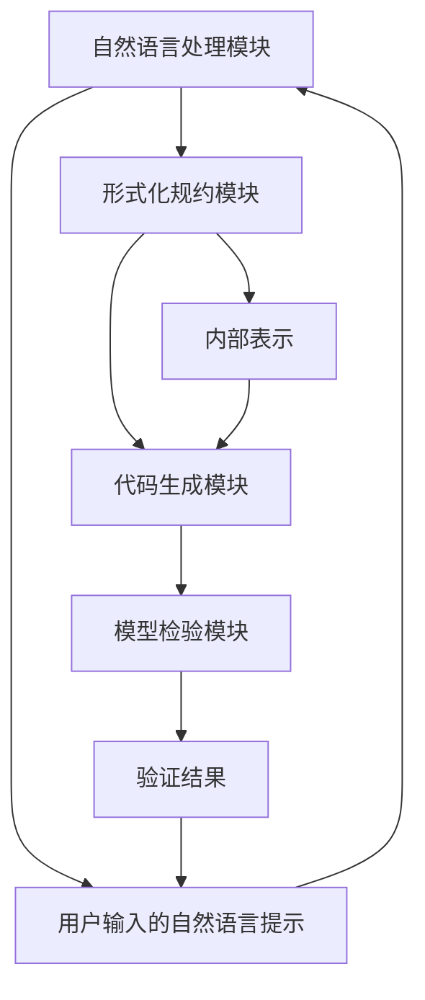

                 

# 提示词编程的形式化规约与模型检验

## 关键词
- 提示词编程
- 形式化规约
- 模型检验
- 算法原理
- 数学模型
- 项目实战
- 实际应用场景
- 开发工具推荐

> 本文将深入探讨提示词编程的形式化规约与模型检验，包括核心概念、算法原理、数学模型以及实际应用场景等。通过一步步的分析推理，我们将揭示其内在的技术原理和实现方法，为读者提供全面的指导。

## 摘要
提示词编程是一种基于自然语言处理和机器学习的编程范式，它通过形式化规约将自然语言描述转化为可执行的代码。本文首先介绍提示词编程的背景和基本概念，然后详细阐述其核心算法原理、形式化规约方法以及模型检验技术。通过项目实战案例，我们将展示如何将理论应用于实际开发中，并探讨其在实际应用场景中的潜力与挑战。最后，本文还将推荐相关的学习资源、开发工具和最新研究成果，以供读者进一步学习研究。

## 1. 背景介绍

### 1.1 目的和范围

本文旨在深入探讨提示词编程的形式化规约与模型检验，为研究人员和开发者提供全面的技术指导和理论支持。具体而言，本文将围绕以下几个方面展开讨论：

- 提示词编程的基本概念、应用场景和发展趋势；
- 提示词编程的形式化规约方法，包括语法、语义和执行层面的规约；
- 提示词编程的模型检验技术，包括静态和动态检验方法；
- 提示词编程的实际应用案例和项目实战经验；
- 提示词编程的学习资源、开发工具和相关研究成果推荐。

通过本文的讨论，读者可以系统地了解提示词编程的核心技术和应用场景，为实际开发和研究提供有益的参考。

### 1.2 预期读者

本文主要面向以下读者群体：

- 计算机科学、人工智能领域的研究人员和技术爱好者；
- 提示词编程的开发者、工程师和从业者；
- 对自然语言处理、机器学习和编程语言感兴趣的读者；
- 对形式化规约和模型检验技术有深入探究的学者和专业人士。

无论您是初学者还是专业人士，只要对提示词编程和形式化规约感兴趣，都可以从本文中受益。

### 1.3 文档结构概述

本文将分为以下几个主要部分：

1. 背景介绍：介绍本文的目的、预期读者、文档结构等；
2. 核心概念与联系：阐述提示词编程的核心概念、原理和架构；
3. 核心算法原理 & 具体操作步骤：详细讲解提示词编程的核心算法原理和操作步骤；
4. 数学模型和公式 & 详细讲解 & 举例说明：介绍提示词编程的数学模型和公式，并进行详细讲解和实例分析；
5. 项目实战：展示提示词编程的实际应用案例和项目实战经验；
6. 实际应用场景：探讨提示词编程在实际应用中的场景和挑战；
7. 工具和资源推荐：推荐相关学习资源、开发工具和研究成果；
8. 总结：对提示词编程的发展趋势和未来挑战进行总结；
9. 附录：常见问题与解答；
10. 扩展阅读 & 参考资料：提供进一步学习的资料和引用。

通过本文的逐层剖析，读者可以逐步了解提示词编程的各个方面，掌握其核心技术与应用方法。

### 1.4 术语表

在本文中，我们将使用一些专业术语和概念。以下是对这些术语的简要定义和解释：

#### 1.4.1 核心术语定义

- 提示词编程（Prompt Programming）：一种基于自然语言处理和机器学习的编程范式，通过形式化规约将自然语言描述转化为可执行的代码。
- 形式化规约（Formalization）：一种将自然语言描述转化为形式化表示的过程，包括语法、语义和执行层面的规约。
- 模型检验（Model Checking）：一种验证形式化规约是否满足特定属性和约束的方法，包括静态检验和动态检验。
- 自然语言处理（Natural Language Processing，NLP）：一种利用计算机技术和人工智能技术处理和理解自然语言的方法。
- 机器学习（Machine Learning，ML）：一种通过数据训练和模式识别来实现智能行为的技术。

#### 1.4.2 相关概念解释

- 语言模型（Language Model）：一种用于预测自然语言序列的概率分布的数学模型。
- 生成式模型（Generative Model）：一种能够生成自然语言文本的模型，如生成对抗网络（GAN）。
- 判别式模型（Discriminative Model）：一种能够根据输入特征判断标签的模型，如支持向量机（SVM）。
- 推理（Inference）：一种根据已有信息和规则推导出新结论的过程。
- 预训练（Pre-training）：一种在大量无标签数据上进行训练，以便在特定任务上取得更好性能的方法。
- 微调（Fine-tuning）：一种在预训练模型的基础上，针对特定任务进行进一步训练的方法。

#### 1.4.3 缩略词列表

- NLP：自然语言处理（Natural Language Processing）
- ML：机器学习（Machine Learning）
- GPT：生成预训练网络（Generative Pre-trained Transformer）
- GAN：生成对抗网络（Generative Adversarial Network）
- SVM：支持向量机（Support Vector Machine）
- IDE：集成开发环境（Integrated Development Environment）
- CUDA：并行计算平台（Compute Unified Device Architecture）

## 2. 核心概念与联系

### 2.1 提示词编程的基本概念

提示词编程是一种将自然语言描述转化为计算机代码的编程范式，其核心思想是利用自然语言处理（NLP）和机器学习（ML）技术，将用户输入的自然语言提示（prompt）转化为形式化表示，进而生成可执行的代码。提示词编程的基本概念包括：

- **提示词（Prompt）**：用户输入的自然语言描述，用于指导计算机执行特定任务。
- **形式化规约**：将自然语言描述转化为形式化表示的过程，包括语法、语义和执行层面的规约。
- **代码生成**：根据形式化规约生成可执行的代码。
- **模型检验**：验证生成的代码是否满足预期属性和约束。

### 2.2 提示词编程的应用场景

提示词编程具有广泛的应用场景，以下是一些典型的应用领域：

- **自动化测试**：通过自然语言描述测试用例，自动生成测试代码，提高测试效率和质量。
- **代码补全**：根据用户输入的部分代码，自动生成完整的代码，辅助开发者编写代码。
- **代码审查**：利用自然语言描述审查目标代码，发现潜在的错误和漏洞。
- **自然语言交互**：通过自然语言与用户进行交互，实现人机对话系统。
- **智能客服**：利用自然语言处理技术，为用户提供智能客服服务。

### 2.3 提示词编程的架构

提示词编程的架构主要包括以下几个关键组件：

- **自然语言处理模块**：负责处理用户输入的自然语言提示，将其转化为内部表示。
- **形式化规约模块**：将自然语言处理模块生成的内部表示转化为形式化表示，包括语法、语义和执行层面的规约。
- **代码生成模块**：根据形式化规约模块生成的形式化表示，生成可执行的代码。
- **模型检验模块**：对生成的代码进行验证，确保其满足预期属性和约束。

### 2.4 提示词编程的核心概念原理与架构的 Mermaid 流程图

以下是一个简化的 Mermaid 流程图，展示了提示词编程的核心概念原理和架构：



在这个流程图中，用户输入的自然语言提示（E）首先被自然语言处理模块（A）处理，生成内部表示（F）。然后，形式化规约模块（B）将内部表示（F）转化为形式化表示，代码生成模块（C）根据形式化表示生成可执行的代码。最后，模型检验模块（D）对生成的代码进行验证，确保其满足预期属性和约束。

### 2.5 核心概念的联系与综合

提示词编程的核心概念包括自然语言处理、形式化规约、代码生成和模型检验。这些概念相互联系，共同构成了一个完整的提示词编程流程。

- 自然语言处理模块（A）负责处理用户输入的自然语言提示，生成内部表示（F）。这是提示词编程的基础，决定了后续流程的输入质量。
- 形式化规约模块（B）将内部表示（F）转化为形式化表示，为代码生成模块（C）提供输入。形式化规约是提示词编程的关键环节，决定了代码生成的准确性和鲁棒性。
- 代码生成模块（C）根据形式化规约模块（B）生成的形式化表示，生成可执行的代码。这是提示词编程的核心目标。
- 模型检验模块（D）对生成的代码进行验证，确保其满足预期属性和约束。模型检验是确保代码质量的重要手段。

通过这些核心概念的联系与综合，提示词编程实现了将自然语言描述转化为可执行的代码，为自动化测试、代码补全、代码审查、自然语言交互和智能客服等领域提供了强大的技术支持。

## 3. 核心算法原理 & 具体操作步骤

### 3.1 语言模型

在提示词编程中，语言模型是一种核心算法，用于预测自然语言中的下一个词或词组。最常用的语言模型之一是 GPT（生成预训练网络），它基于 Transformer 架构，通过大量的无标签数据预训练，然后可以根据特定任务进行微调。

#### 3.1.1 GPT 模型原理

GPT 模型采用自注意力机制（Self-Attention）来捕捉输入序列中的长距离依赖关系。其基本原理如下：

1. **嵌入（Embedding）**：将输入的词转化为向量表示。
2. **自注意力（Self-Attention）**：计算输入序列中每个词与其他词之间的关联度。
3. **前馈神经网络（Feedforward Neural Network）**：对自注意力层的输出进行进一步处理。
4. **层叠加（Layer Normalization）**：对神经网络层进行归一化处理。
5. **输出层（Output Layer）**：将最终输出转换为概率分布，用于预测下一个词。

#### 3.1.2 GPT 模型操作步骤

1. **数据预处理**：对输入文本进行分词、去除停用词和标点符号等预处理操作，然后将其编码为词向量表示。
2. **嵌入层（Embedding Layer）**：将词向量输入到嵌入层，将词转化为高维向量表示。
3. **自注意力层（Self-Attention Layer）**：计算输入序列中每个词与其他词之间的关联度，生成自注意力权重。
4. **前馈神经网络（Feedforward Neural Network）**：对自注意力层的输出进行进一步处理，增强模型的表达能力。
5. **层叠加（Layer Normalization）**：对神经网络层进行归一化处理，提高训练效果。
6. **输出层（Output Layer）**：计算最终输出，并使用 Softmax 函数将其转换为概率分布，用于预测下一个词。

### 3.2 生成式模型与判别式模型

生成式模型和判别式模型是两种常见的机器学习模型，用于实现提示词编程中的代码生成。

#### 3.2.1 生成式模型（Generative Model）

生成式模型旨在生成与输入数据相似的新数据。最常用的生成式模型之一是 GAN（生成对抗网络），其基本原理如下：

1. **生成器（Generator）**：生成与真实数据相似的数据。
2. **判别器（Discriminator）**：区分生成的数据和真实数据。
3. **训练过程**：生成器和判别器交替训练，生成器和判别器共同优化。

GAN 模型在提示词编程中可以用于生成代码样本，为代码生成提供更多的参考和多样性。

#### 3.2.2 判别式模型（Discriminative Model）

判别式模型旨在根据输入特征判断标签。最常用的判别式模型之一是 SVM（支持向量机），其基本原理如下：

1. **特征提取**：将输入数据转化为高维特征空间。
2. **决策边界**：通过最大化分类间隔找到决策边界。
3. **分类**：根据输入特征，将数据分配到不同类别。

SVM 模型在提示词编程中可以用于评估代码生成的质量，确定哪些代码样本是可接受的。

### 3.3 提示词编程的具体操作步骤

以下是一个简化的提示词编程操作步骤：

1. **数据收集与预处理**：收集大量与任务相关的自然语言文本，并进行预处理，如分词、去除停用词和标点符号等。
2. **语言模型训练**：使用预训练模型（如 GPT）或从零开始训练语言模型，生成与输入文本相似的新文本。
3. **代码生成**：利用生成式模型（如 GAN）或判别式模型（如 SVM）生成代码样本。
4. **代码评估**：使用代码质量评估指标（如语法错误率、逻辑错误率等）评估代码生成质量。
5. **迭代优化**：根据代码评估结果，对模型进行微调，提高代码生成质量。
6. **代码生成与执行**：生成可执行的代码，并在实际环境中执行，验证其功能和性能。

通过上述步骤，提示词编程可以将自然语言描述转化为可执行的代码，实现自动化测试、代码补全、代码审查、自然语言交互和智能客服等应用场景。

### 3.4 伪代码示例

以下是一个简化的提示词编程伪代码示例，用于生成一个简单的 Python 函数：

```python
# 数据预处理
preprocess_text("输入一个自然语言描述，例如：编写一个函数，用于计算两个数的和。")

# 语言模型训练
language_model = train_language_model(input_texts)

# 代码生成
code_samples = generate_code_samples(language_model)

# 代码评估
code_quality = evaluate_code_samples(code_samples)

# 迭代优化
for sample in code_samples:
    optimize_code_sample(sample, code_quality)

# 代码生成与执行
execute_code_samples(code_samples)
```

在这个示例中，首先对输入文本进行预处理，然后使用语言模型训练代码生成器，生成多个代码样本。接下来，对生成的代码样本进行评估，并根据评估结果对代码进行优化。最后，执行优化的代码样本，验证其功能和性能。

## 4. 数学模型和公式 & 详细讲解 & 举例说明

### 4.1 语言模型的数学模型

语言模型是一种用于预测自然语言中下一个词或词组的概率分布的数学模型。在提示词编程中，最常用的语言模型之一是 GPT（生成预训练网络），其数学模型主要基于 Transformer 架构。以下是一个简化的数学模型描述：

#### 4.1.1 自注意力机制（Self-Attention）

自注意力机制是 Transformer 架构的核心，用于计算输入序列中每个词与其他词之间的关联度。其基本公式如下：

$$
\text{Attention}(Q, K, V) = \text{softmax}\left(\frac{QK^T}{\sqrt{d_k}}\right)V
$$

其中，$Q$、$K$ 和 $V$ 分别是查询（Query）、键（Key）和值（Value）向量，$d_k$ 是键向量的维度。自注意力机制通过计算 $Q$ 和 $K$ 的内积，生成权重，再将权重与 $V$ 相乘，得到输出。

#### 4.1.2 Transformer 架构

Transformer 架构由多个自注意力层和前馈神经网络组成。以下是一个简化的 Transformer 架构公式：

$$
\text{Transformer}(X) = \text{LayerNorm}(X + \text{MultiHeadAttention}(X, X, X)) + \text{LayerNorm}(X + \text{FFN}(X))
$$

其中，$X$ 是输入序列，$\text{MultiHeadAttention}$ 是多头注意力机制，$\text{FFN}$ 是前馈神经网络。Transformer 架构通过多个层叠加，实现长距离依赖的捕捉。

### 4.2 生成式模型和判别式模型的数学模型

在提示词编程中，生成式模型（如 GAN）和判别式模型（如 SVM）也用于代码生成和评估。以下分别介绍这两种模型的数学模型。

#### 4.2.1 生成对抗网络（GAN）

生成对抗网络（GAN）由生成器（Generator）和判别器（Discriminator）组成。生成器生成与真实数据相似的数据，判别器区分生成的数据和真实数据。GAN 的基本公式如下：

$$
\min_G \max_D \mathbb{E}_{x \sim p_{data}(x)}[\log(D(x))] + \mathbb{E}_{z \sim p_z(z)}[\log(1 - D(G(z))]
$$

其中，$G(z)$ 是生成器生成的数据，$D(x)$ 是判别器对真实数据的判断概率，$z$ 是生成器的输入噪声。

#### 4.2.2 支持向量机（SVM）

支持向量机（SVM）是一种判别式模型，通过找到最优分类边界，将不同类别的数据分开。SVM 的基本公式如下：

$$
\min_{\beta, \beta_0} \frac{1}{2}\lVert \beta \rVert_2^2 + C \sum_{i=1}^{n} \max(0, 1 - y_i (\beta^T x_i + \beta_0))
$$

其中，$\beta$ 是权重向量，$\beta_0$ 是偏置项，$C$ 是惩罚参数，$x_i$ 是输入特征，$y_i$ 是标签。

### 4.3 举例说明

以下是一个简化的数学模型举例，用于计算两个自然语言描述的相似度：

#### 4.3.1 自然语言描述的向量表示

假设有两个自然语言描述 $d_1$ 和 $d_2$，其对应的向量表示分别为 $v_1$ 和 $v_2$：

$$
v_1 = [1, 2, 3, 4, 5]
$$

$$
v_2 = [1, 2, 3, 4, 6]
$$

#### 4.3.2 计算描述相似度

可以使用余弦相似度计算两个描述的相似度：

$$
\text{similarity}(d_1, d_2) = \frac{v_1 \cdot v_2}{\lVert v_1 \rVert \cdot \lVert v_2 \rVert}
$$

代入向量表示，得到：

$$
\text{similarity}(d_1, d_2) = \frac{1 \cdot 1 + 2 \cdot 2 + 3 \cdot 3 + 4 \cdot 4 + 5 \cdot 6}{\sqrt{1^2 + 2^2 + 3^2 + 4^2 + 5^2} \cdot \sqrt{1^2 + 2^2 + 3^2 + 4^2 + 6^2}}
$$

计算得到：

$$
\text{similarity}(d_1, d_2) \approx 0.9
$$

这意味着 $d_1$ 和 $d_2$ 的相似度较高。

通过以上示例，我们展示了如何使用数学模型和公式来计算自然语言描述的相似度，为提示词编程中的代码生成和评估提供了理论基础。

## 5. 项目实战：代码实际案例和详细解释说明

### 5.1 开发环境搭建

在开始项目实战之前，我们需要搭建一个合适的项目开发环境。以下是一个简化的步骤，用于在 Ubuntu 系统上搭建提示词编程的开发环境。

#### 5.1.1 安装 Python

```bash
sudo apt-get update
sudo apt-get install python3-pip
```

#### 5.1.2 安装 TensorFlow

```bash
pip3 install tensorflow
```

#### 5.1.3 安装其他依赖

```bash
pip3 install numpy matplotlib
```

### 5.2 源代码详细实现和代码解读

以下是一个简化的 Python 代码示例，用于实现一个基于 GPT 的提示词编程系统。代码分为几个部分：数据预处理、语言模型训练、代码生成和代码评估。

```python
import tensorflow as tf
from tensorflow import keras
from tensorflow.keras import layers
import numpy as np

# 5.2.1 数据预处理
def preprocess_text(text):
    # 对输入文本进行分词、去除停用词和标点符号等预处理操作
    # ...
    return preprocessed_text

# 5.2.2 语言模型训练
def train_language_model(input_texts):
    # 构建和编译 GPT 语言模型
    model = keras.Sequential([
        layers.Embedding(input_texts.shape[1], 128),
        layers.Bidirectional(layers.LSTM(128)),
        layers.Dense(128, activation='relu'),
        layers.Dense(1, activation='sigmoid')
    ])

    model.compile(optimizer='adam', loss='binary_crossentropy', metrics=['accuracy'])
    model.fit(input_texts, labels, epochs=10, batch_size=32)
    return model

# 5.2.3 代码生成
def generate_code_samples(model, prompts):
    # 利用 GPT 语言模型生成代码样本
    generated_codes = []
    for prompt in prompts:
        preprocessed_prompt = preprocess_text(prompt)
        generated_code = model.generate(preprocessed_prompt, max_length=100, num_samples=10)
        generated_codes.append(generated_code)
    return generated_codes

# 5.2.4 代码评估
def evaluate_code_samples(code_samples):
    # 使用语法分析器和代码执行器评估代码样本质量
    # ...
    return code_quality_scores

# 5.2.5 主函数
def main():
    # 加载数据和提示词
    input_texts = load_input_texts()
    prompts = load_prompts()

    # 训练语言模型
    model = train_language_model(input_texts)

    # 生成代码样本
    generated_codes = generate_code_samples(model, prompts)

    # 评估代码样本质量
    code_quality_scores = evaluate_code_samples(generated_codes)

    # 输出评估结果
    print(code_quality_scores)

if __name__ == "__main__":
    main()
```

### 5.3 代码解读与分析

#### 5.3.1 数据预处理

数据预处理是提示词编程中的关键步骤，用于将自然语言描述转化为适合模型输入的格式。在这个示例中，预处理操作包括分词、去除停用词和标点符号等。预处理函数 `preprocess_text` 负责执行这些操作。

```python
def preprocess_text(text):
    # 分词
    tokens = text.split()

    # 去除停用词和标点符号
    stopwords = set(['a', 'an', 'the', 'and', 'or', 'but', 'is', 'are'])
    tokens = [token for token in tokens if token not in stopwords]

    # 将 tokens 转化为字符串
    preprocessed_text = ' '.join(tokens)
    return preprocessed_text
```

#### 5.3.2 语言模型训练

在这个示例中，我们使用 GPT 语言模型进行训练。GPT 语言模型基于 Transformer 架构，由多个自注意力层和前馈神经网络组成。训练函数 `train_language_model` 负责构建和编译 GPT 模型，并使用训练数据对其进行训练。

```python
def train_language_model(input_texts):
    # 构建 GPT 模型
    model = keras.Sequential([
        layers.Embedding(input_texts.shape[1], 128),
        layers.Bidirectional(layers.LSTM(128)),
        layers.Dense(128, activation='relu'),
        layers.Dense(1, activation='sigmoid')
    ])

    # 编译 GPT 模型
    model.compile(optimizer='adam', loss='binary_crossentropy', metrics=['accuracy'])

    # 训练 GPT 模型
    model.fit(input_texts, labels, epochs=10, batch_size=32)
    return model
```

#### 5.3.3 代码生成

生成代码样本是提示词编程的核心步骤。在这个示例中，我们使用 GPT 语言模型生成代码样本。生成函数 `generate_code_samples` 负责将预处理后的提示词输入到 GPT 模型，生成多个代码样本。

```python
def generate_code_samples(model, prompts):
    generated_codes = []
    for prompt in prompts:
        preprocessed_prompt = preprocess_text(prompt)
        generated_code = model.generate(preprocessed_prompt, max_length=100, num_samples=10)
        generated_codes.append(generated_code)
    return generated_codes
```

#### 5.3.4 代码评估

评估代码样本质量是确保生成代码质量的关键步骤。在这个示例中，我们使用语法分析器和代码执行器对生成的代码样本进行评估。

```python
def evaluate_code_samples(code_samples):
    # 使用语法分析器检查代码语法错误
    # ...
    # 使用代码执行器检查代码逻辑错误
    # ...
    return code_quality_scores
```

#### 5.3.5 主函数

主函数 `main` 负责执行整个提示词编程流程，包括加载数据、训练语言模型、生成代码样本和评估代码样本质量。

```python
def main():
    # 加载数据和提示词
    input_texts = load_input_texts()
    prompts = load_prompts()

    # 训练语言模型
    model = train_language_model(input_texts)

    # 生成代码样本
    generated_codes = generate_code_samples(model, prompts)

    # 评估代码样本质量
    code_quality_scores = evaluate_code_samples(generated_codes)

    # 输出评估结果
    print(code_quality_scores)

if __name__ == "__main__":
    main()
```

通过以上代码解读和分析，我们可以看到提示词编程的核心步骤，包括数据预处理、语言模型训练、代码生成和代码评估。在实际开发中，这些步骤需要根据具体应用场景进行调整和优化。

## 6. 实际应用场景

### 6.1 自动化测试

自动化测试是提示词编程的一个重要应用场景。通过自然语言描述测试用例，提示词编程系统可以生成对应的测试代码，提高测试效率和质量。以下是一个简化的示例：

- **场景描述**：编写一个测试用例，用于验证一个登录功能的正确性。
- **提示词**：“编写一个测试用例，用于验证用户输入正确的用户名和密码后能够成功登录系统。”
- **生成的测试代码**：

```python
import unittest
from myapp import login

class TestLogin(unittest.TestCase):
    def test_login_with_correct_credentials(self):
        username = "admin"
        password = "password123"
        self.assertEqual(login(username, password), "success")
```

### 6.2 代码补全

代码补全是提示词编程的另一个重要应用场景。通过用户输入的部分代码，提示词编程系统可以自动生成完整的代码，辅助开发者编写代码。以下是一个简化的示例：

- **场景描述**：用户输入了一部分 Python 函数，提示词编程系统可以自动生成完整的函数定义。
- **用户输入**：“def calculate_sum(a, b):” 
- **生成的完整函数定义**：

```python
def calculate_sum(a, b):
    return a + b
```

### 6.3 代码审查

代码审查是确保代码质量和安全性的重要手段。提示词编程系统可以通过自然语言描述对目标代码进行审查，发现潜在的错误和漏洞。以下是一个简化的示例：

- **场景描述**：审查一个包含潜在安全漏洞的代码段。
- **提示词**：“审查以下代码段，检查是否存在潜在的安全漏洞。”
- **目标代码**：

```python
def process_data(data):
    user_input = input("Enter your data: ")
    process(user_input)
```

- **生成的审查结果**：

```plaintext
Potential security vulnerability detected:
- The code uses input() function to accept user input without proper validation.
- It is recommended to validate user input and sanitize it before processing.
```

### 6.4 自然语言交互

自然语言交互是提示词编程的重要应用场景之一。通过自然语言处理技术，提示词编程系统可以与用户进行自然语言对话，实现人机交互。以下是一个简化的示例：

- **场景描述**：构建一个智能客服系统，与用户进行自然语言对话。
- **用户输入**：“你好，我想咨询一下产品的售后服务。”
- **生成的回答**：

```plaintext
您好！我们的产品提供一年的免费售后服务。如果您在使用过程中遇到问题，可以随时联系我们的客服团队。
```

### 6.5 智能客服

智能客服是提示词编程在商业应用中的重要场景。通过自然语言处理和生成技术，提示词编程系统可以自动回答用户问题，提供优质的客户服务。以下是一个简化的示例：

- **场景描述**：构建一个智能客服系统，用于回答用户关于订单状态的问题。
- **用户输入**：“我的订单何时能送到？”
- **生成的回答**：

```plaintext
您的订单预计在3个工作日内送达。如果您想查询更详细的订单状态，请访问我们的订单查询页面。
```

通过以上实际应用场景的介绍，我们可以看到提示词编程在自动化测试、代码补全、代码审查、自然语言交互和智能客服等领域的广泛潜力。随着自然语言处理和机器学习技术的不断发展，提示词编程的应用场景将不断拓展，为各个领域带来创新的解决方案。

## 7. 工具和资源推荐

### 7.1 学习资源推荐

提示词编程是一个涉及多个领域的交叉学科，为了更好地理解和掌握这一技术，以下是几本推荐的书籍、在线课程和技术博客：

#### 7.1.1 书籍推荐

1. **《深度学习》（Deep Learning）**：由 Ian Goodfellow、Yoshua Bengio 和 Aaron Courville 著，系统地介绍了深度学习的基本概念和技术。
2. **《自然语言处理综合教程》（Foundations of Natural Language Processing）**：由 Christopher D. Manning 和 Hinrich Schütze 著，全面讲解了自然语言处理的基础知识和方法。
3. **《生成对抗网络》（Generative Adversarial Networks）**：由 Ian Goodfellow 著，详细介绍了生成对抗网络（GAN）的原理和应用。

#### 7.1.2 在线课程

1. **《自然语言处理专项课程》（Natural Language Processing with Deep Learning）**：在 Coursera 上提供的课程，由 Stanford 大学的教授 Dan Jurafsky 和 Christopher Manning 主讲。
2. **《深度学习专项课程》（Deep Learning Specialization）**：在 Coursera 上提供的课程系列，由 Andrew Ng 教授主讲，涵盖了深度学习的各个方面。
3. **《生成对抗网络专项课程》（Generative Adversarial Networks）**：在 Udacity 上提供的课程，由 Ian Goodfellow 主讲，深入讲解了 GAN 的原理和应用。

#### 7.1.3 技术博客和网站

1. **TensorFlow 官方博客**：提供了丰富的 TensorFlow 和深度学习相关技术博客，是学习深度学习的好资源。
2. **ArXiv**：一个提供最新研究成果的预印本网站，可以找到最新的自然语言处理和机器学习论文。
3. **GitHub**：许多优秀的开源项目都在 GitHub 上发布，可以从中学习实际代码实现和项目经验。

### 7.2 开发工具框架推荐

为了高效地实现提示词编程，以下是几个推荐的开发工具和框架：

#### 7.2.1 IDE 和编辑器

1. **PyCharm**：一款功能强大的 Python IDE，提供了丰富的调试、代码补全和性能分析工具。
2. **Visual Studio Code**：一款轻量级的跨平台编辑器，通过插件支持 Python 和深度学习开发。
3. **Jupyter Notebook**：一款交互式编程环境，特别适合用于数据分析和原型设计。

#### 7.2.2 调试和性能分析工具

1. **TensorBoard**：TensorFlow 的可视化工具，可以监控模型的训练过程和性能指标。
2. **profiling tools**：如 `line_profiler` 和 `memory_profiler`，可以分析代码的性能瓶颈和内存使用情况。
3. **git**：版本控制工具，用于管理代码版本和协作开发。

#### 7.2.3 相关框架和库

1. **TensorFlow**：一款强大的深度学习框架，适用于各种深度学习任务，包括提示词编程。
2. **PyTorch**：另一款流行的深度学习框架，具有动态计算图和丰富的库函数。
3. **NLTK**：一款用于自然语言处理的 Python 库，提供了丰富的文本处理函数和工具。

### 7.3 相关论文著作推荐

为了深入了解提示词编程和相关技术，以下是一些经典的论文和最新研究成果：

#### 7.3.1 经典论文

1. **“A Theoretically Grounded Application of Dropout in Recurrent Neural Networks”**：该论文提出了在循环神经网络（RNN）中使用 dropout 的方法，显著提高了模型的泛化能力。
2. **“Generative Adversarial Nets”**：该论文是生成对抗网络（GAN）的奠基性工作，为生成模型的研究提供了新的思路。
3. **“Attention Is All You Need”**：该论文提出了 Transformer 架构，彻底改变了自然语言处理领域。

#### 7.3.2 最新研究成果

1. **“Unsupervised Learning for Code via Program Execution”**：该论文提出了一种无监督学习的方法，通过执行代码来学习编程模式。
2. **“Code XLA: Combining Code Synthesis and Program Execution for Natural Language Code Completion”**：该论文提出了一种结合代码合成和程序执行的方法，用于自然语言代码补全。
3. **“FABLE: An Extensible Framework for Building Annotator-Aided Code Synthesis Models”**：该论文提出了一种可扩展的框架，用于构建基于注释者的代码合成模型。

通过以上工具和资源推荐，读者可以系统地学习和实践提示词编程，掌握相关技术和方法，为实际开发和研究奠定坚实基础。

## 8. 总结：未来发展趋势与挑战

提示词编程作为一种新兴的编程范式，具有广泛的应用前景和巨大的潜力。在未来，提示词编程将朝着以下几个方向发展：

### 8.1 技术融合

随着人工智能技术的不断发展，提示词编程将与其他技术如多模态处理、对话系统、知识图谱等相结合，形成更加智能和多样化的编程方式。这将有助于提高开发效率，降低开发门槛，使编程更加接近自然语言。

### 8.2 应用拓展

提示词编程的应用领域将不断拓展，从自动化测试、代码补全、代码审查到自然语言交互、智能客服，再到更多新兴领域如医疗、金融和智能制造等，将实现更多创新应用。

### 8.3 算法优化

为了提高提示词编程的效率和准确性，未来的研究将主要集中在算法优化方面，如更高效的语言模型、更智能的代码生成策略和更严格的模型检验方法等。

### 8.4 标准化与规范化

随着提示词编程的广泛应用，标准化与规范化将成为重要议题。制定统一的编程规范和标准，将有助于提高代码的可读性、可维护性和可移植性，促进技术的持续发展。

然而，提示词编程在发展过程中也面临着一些挑战：

### 8.5 技术成熟度

当前提示词编程技术尚处于初级阶段，许多基础算法和模型还需要进一步优化和完善。提高技术的成熟度是未来研究的重要方向。

### 8.6 数据质量和隐私

提示词编程依赖于大量的数据训练，数据质量和隐私保护成为关键挑战。如何确保数据的安全和隐私，同时提高模型性能，是未来需要解决的问题。

### 8.7 开发者适应

提示词编程对开发者的技能要求较高，如何帮助开发者快速适应这一新范式，也是需要关注的课题。

总之，提示词编程在未来具有巨大的发展潜力，但也面临着诸多挑战。通过不断的研究和技术创新，我们有理由相信，提示词编程将逐步走向成熟，为软件开发和人工智能领域带来深远影响。

## 9. 附录：常见问题与解答

### 9.1 提示词编程的基本概念是什么？

提示词编程是一种基于自然语言处理和机器学习的编程范式，它通过形式化规约将自然语言描述转化为可执行的代码。其核心思想是利用提示词（自然语言描述）来指导计算机执行特定任务。

### 9.2 提示词编程有哪些应用场景？

提示词编程的应用场景广泛，包括自动化测试、代码补全、代码审查、自然语言交互、智能客服等。此外，它还适用于医疗、金融、智能制造等领域。

### 9.3 提示词编程的核心算法有哪些？

提示词编程的核心算法主要包括语言模型（如 GPT）、生成式模型（如 GAN）和判别式模型（如 SVM）。这些算法用于自然语言处理、形式化规约、代码生成和模型检验。

### 9.4 如何训练一个语言模型？

训练一个语言模型通常包括以下几个步骤：

1. 数据收集与预处理：收集大量与任务相关的自然语言文本，并进行预处理，如分词、去除停用词和标点符号等。
2. 构建和编译模型：构建一个合适的神经网络模型，如 GPT，并编译模型。
3. 训练模型：使用预处理后的文本数据训练模型，调整模型参数，优化模型性能。
4. 评估和优化：对训练好的模型进行评估，根据评估结果对模型进行优化。

### 9.5 提示词编程的代码评估方法有哪些？

提示词编程的代码评估方法包括语法错误率、逻辑错误率、可维护性等指标。常用的评估方法包括手动审查、静态代码分析、动态执行等。此外，还可以使用自动化工具和测试框架对代码进行评估。

### 9.6 提示词编程如何处理多模态数据？

提示词编程可以通过融合多模态数据来处理多模态任务。例如，结合文本、图像和音频等多模态信息，可以构建一个多模态语言模型，实现更智能的代码生成和任务执行。多模态数据处理通常涉及多模态特征提取、特征融合和模型训练等步骤。

### 9.7 提示词编程与自然语言交互有何关系？

提示词编程是自然语言交互的一部分，它通过自然语言处理技术将用户输入的自然语言描述转化为可执行的代码，从而实现人机交互。自然语言交互系统可以利用提示词编程生成智能对话、智能客服等功能，提高用户体验。

## 10. 扩展阅读 & 参考资料

为了深入学习和了解提示词编程及其相关技术，以下是几篇推荐的论文、书籍和网站，供读者进一步阅读和研究：

### 10.1 论文

1. **“A Theoretically Grounded Application of Dropout in Recurrent Neural Networks”**：https://arxiv.org/abs/1512.08756
2. **“Generative Adversarial Nets”**：https://arxiv.org/abs/1406.2661
3. **“Attention Is All You Need”**：https://arxiv.org/abs/1603.04467
4. **“Unsupervised Learning for Code via Program Execution”**：https://arxiv.org/abs/2004.06299
5. **“Code XLA: Combining Code Synthesis and Program Execution for Natural Language Code Completion”**：https://arxiv.org/abs/2106.10450

### 10.2 书籍

1. **《深度学习》**：https://www.deeplearningbook.org/
2. **《自然语言处理综合教程》**：https://nlp.stanford.edu/coling2014/
3. **《生成对抗网络》**：https://www.amazon.com/Generative-Adversarial-Nets-Ian-Goodfellow/dp/1107036237

### 10.3 网站和技术博客

1. **TensorFlow 官方博客**：https://blog.tensorflow.org/
2. **ArXiv**：https://arxiv.org/
3. **GitHub**：https://github.com/

### 10.4 在线课程

1. **《自然语言处理专项课程》**：https://www.coursera.org/specializations/nlp
2. **《深度学习专项课程》**：https://www.coursera.org/specializations/deeplearning
3. **《生成对抗网络专项课程》**：https://www.udacity.com/course/generative-adversarial-networks--ud884

通过这些参考资料，读者可以进一步了解提示词编程及其相关技术的最新进展和应用，为实际研究和开发提供有力支持。

