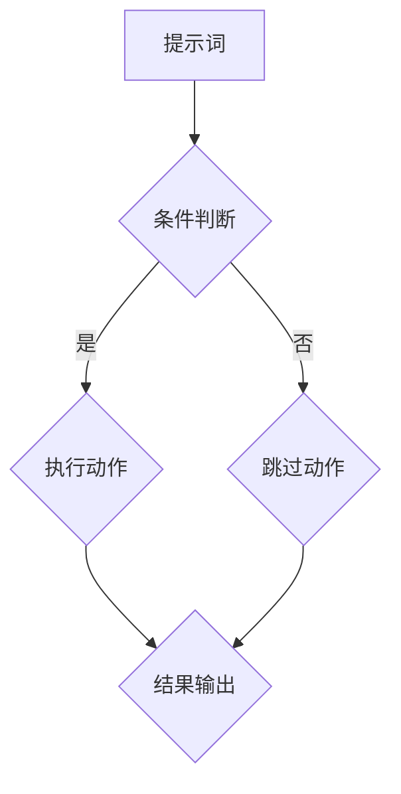

                 

# 提示词编程的形式化规约与验证

> **关键词**：提示词编程、形式化规约、验证、算法原理、数学模型、项目实战、应用场景。

> **摘要**：本文深入探讨了提示词编程的形式化规约与验证。首先，介绍了提示词编程的背景及其重要性。接着，详细分析了提示词编程的核心概念、算法原理和数学模型。然后，通过实际代码案例，展示了如何进行形式化规约与验证。最后，探讨了提示词编程的实际应用场景，并推荐了相关工具和资源。

## 1. 背景介绍

### 1.1 目的和范围

本文旨在探讨提示词编程的形式化规约与验证，为读者提供一套系统性的理解框架。本文主要涵盖以下内容：

1. 提示词编程的基本概念和核心原理。
2. 提示词编程的形式化规约方法。
3. 提示词编程的验证策略和流程。
4. 提示词编程的实际应用场景。
5. 相关工具和资源的推荐。

### 1.2 预期读者

本文适合以下读者群体：

1. 对编程和人工智能感兴趣的初学者。
2. 想深入了解提示词编程的中级程序员。
3. 想提升自己编程水平的软件开发人员。
4. 对形式化规约和验证有兴趣的研究人员。

### 1.3 文档结构概述

本文分为以下章节：

1. 背景介绍：介绍本文的目的、范围、预期读者和文档结构。
2. 核心概念与联系：详细解释提示词编程的核心概念和原理。
3. 核心算法原理 & 具体操作步骤：通过伪代码详细阐述核心算法原理和操作步骤。
4. 数学模型和公式 & 详细讲解 & 举例说明：介绍提示词编程的数学模型和公式，并通过实例进行讲解。
5. 项目实战：展示如何在实际项目中应用提示词编程。
6. 实际应用场景：探讨提示词编程的多种应用场景。
7. 工具和资源推荐：推荐相关学习资源、开发工具和框架。
8. 总结：总结本文的主要内容，展望未来发展趋势与挑战。
9. 附录：常见问题与解答。
10. 扩展阅读 & 参考资料：提供进一步阅读的参考资料。

### 1.4 术语表

#### 1.4.1 核心术语定义

- **提示词编程**：一种基于提示词的编程范式，通过提示词来引导程序执行。
- **形式化规约**：一种用数学或形式化语言描述系统行为的方法，确保系统满足预定的需求和约束。
- **验证**：一种检查系统或程序是否正确的方法，确保系统或程序的行为符合预期。

#### 1.4.2 相关概念解释

- **规约验证**：通过对系统或程序的规约进行验证，确保系统或程序的正确性。
- **形式化验证**：使用形式化语言和数学方法对系统或程序进行验证。

#### 1.4.3 缩略词列表

- **PLC**：程序逻辑控制（Program Logic Control）
- **AI**：人工智能（Artificial Intelligence）
- **FP**：函数式编程（Functional Programming）
- **FMEA**：故障模式与影响分析（Failure Mode and Effects Analysis）

## 2. 核心概念与联系

提示词编程的核心在于将程序逻辑转化为基于提示词的表示形式，从而实现对程序执行路径的动态控制。下面，我们将通过一个Mermaid流程图，展示提示词编程的核心概念和架构。



在这个流程图中：

- **A（提示词）**：表示程序的起始点，提示词可以是任何能引导程序执行的关键字或表达式。
- **B（条件判断）**：根据提示词的值进行条件判断，决定程序的执行路径。
- **C（执行动作）**：如果条件判断为真，执行特定的动作。
- **D（跳过动作）**：如果条件判断为假，则跳过该动作。
- **E（结果输出）**：无论条件判断结果如何，最终都会输出结果。

通过这个流程图，我们可以看出提示词编程的关键在于如何根据提示词的值动态调整程序的执行路径，从而实现复杂的程序逻辑。

## 3. 核心算法原理 & 具体操作步骤

提示词编程的核心算法原理在于将程序逻辑转化为基于提示词的表示形式，并利用条件判断来动态调整程序的执行路径。以下是提示词编程的核心算法原理和具体操作步骤：

### 3.1 核心算法原理

提示词编程的核心算法原理可以概括为以下三点：

1. **提示词的表示**：将程序逻辑中的关键操作或条件用提示词表示，便于动态调整程序执行路径。
2. **条件判断**：根据提示词的值进行条件判断，决定程序的执行路径。
3. **动态调整**：在程序执行过程中，根据提示词的值动态调整执行路径，实现复杂的程序逻辑。

### 3.2 具体操作步骤

以下是提示词编程的具体操作步骤：

1. **定义提示词**：首先，我们需要定义程序中使用的提示词。提示词可以是任何能引导程序执行的关键字或表达式。例如，我们可以定义以下提示词：
    ```python
    IF: 表示条件判断
    DO: 表示执行动作
    SKIP: 表示跳过动作
    ```

2. **编写条件判断**：根据提示词，编写条件判断语句。例如，以下代码使用提示词`IF`进行条件判断：
    ```python
    IF (x > 0) {
        DO {
            // 执行特定动作
        }
    } ELSE {
        SKIP;
    }
    ```

3. **编写执行动作**：在条件判断为真的情况下，编写需要执行的动作。例如，以下代码在条件判断为真时，执行打印`Hello, World!`：
    ```python
    IF (x > 0) {
        DO {
            PRINT("Hello, World!");
        }
    } ELSE {
        SKIP;
    }
    ```

4. **编写跳过动作**：在条件判断为假的情况下，编写需要跳过的动作。例如，以下代码在条件判断为假时，跳过打印`Hello, World!`：
    ```python
    IF (x > 0) {
        DO {
            PRINT("Hello, World!");
        }
    } ELSE {
        SKIP;
    }
    ```

5. **输出结果**：无论条件判断结果如何，最终都会输出结果。例如，以下代码在条件判断为真时，输出`Hello, World!`；在条件判断为假时，输出`Nothing to display`：
    ```python
    IF (x > 0) {
        DO {
            PRINT("Hello, World!");
        }
    } ELSE {
        PRINT("Nothing to display");
    }
    ```

通过以上步骤，我们可以使用提示词编程实现复杂的程序逻辑，并利用条件判断和动态调整来优化程序执行路径。

## 4. 数学模型和公式 & 详细讲解 & 举例说明

提示词编程的核心在于利用数学模型和公式来描述程序逻辑和执行路径。以下是提示词编程的数学模型和公式，并通过对实例的讲解，展示如何使用这些公式。

### 4.1 数学模型和公式

提示词编程的数学模型主要包括以下几个方面：

1. **条件判断公式**：用于描述条件判断的逻辑运算。公式如下：
   $$IF \ (condition) \ {true\_action \ otherwise \ false\_action}$$

2. **执行动作公式**：用于描述执行特定动作的逻辑运算。公式如下：
   $$DO \ {action}$$

3. **跳过动作公式**：用于描述跳过特定动作的逻辑运算。公式如下：
   $$SKIP$$

4. **输出结果公式**：用于描述输出结果的逻辑运算。公式如下：
   $$PRINT \ (result)$$

### 4.2 详细讲解

以下是针对实例的详细讲解，展示如何使用数学模型和公式描述提示词编程。

#### 4.2.1 条件判断实例

假设我们有一个简单的条件判断实例：
```python
IF (x > 0) {
    DO {
        PRINT("x is positive");
    }
} ELSE {
    PRINT("x is negative");
}
```

使用条件判断公式，我们可以将其表示为：
$$IF \ (x > 0) \ {PRINT("x is positive") \ otherwise \ PRINT("x is negative")}$$

这个公式表示，如果`x`的值大于0，则执行打印`x is positive`的动作；否则，执行打印`x is negative`的动作。

#### 4.2.2 执行动作实例

假设我们有一个简单的执行动作实例：
```python
DO {
    PRINT("Hello, World!");
}
```

使用执行动作公式，我们可以将其表示为：
$$DO \ {PRINT("Hello, World!

#### 4.2.3 跳过动作实例

假设我们有一个简单的跳过动作实例：
```python
ELSE {
    SKIP;
}
```

使用跳过动作公式，我们可以将其表示为：
$$SKIP$$

这个公式表示，在条件判断为假的情况下，跳过执行动作。

#### 4.2.4 输出结果实例

假设我们有一个简单的输出结果实例：
```python
PRINT("Nothing to display");
```

使用输出结果公式，我们可以将其表示为：
$$PRINT \ ("Nothing to display")$$

这个公式表示，无论条件判断结果如何，都会输出`Nothing to display`。

通过以上实例，我们可以看到如何使用数学模型和公式描述提示词编程的各个部分，从而实现对程序逻辑的精确表达。

### 4.3 举例说明

为了更好地理解提示词编程的数学模型和公式，我们可以通过一个更复杂的实例来演示。

#### 4.3.1 实例描述

假设我们有一个计算器程序，可以接受用户输入的数字，并根据输入的数字计算结果。计算器程序需要支持以下功能：

1. 计算两个数的和。
2. 计算两个数的差。
3. 计算两个数的乘积。
4. 计算两个数的商（如果有余数则输出余数）。

用户可以通过输入提示词来选择需要执行的操作。以下是一个简化的计算器程序的示例：

```plaintext
1. 计算和
2. 计算差
3. 计算乘积
4. 计算商
```

#### 4.3.2 实例实现

以下是使用提示词编程实现的计算器程序：

```python
def calculate_sum(a, b):
    return a + b

def calculate_difference(a, b):
    return a - b

def calculate_product(a, b):
    return a * b

def calculate_quotient(a, b):
    return a // b

def main():
    print("请选择以下操作：")
    print("1. 计算和")
    print("2. 计算差")
    print("3. 计算乘积")
    print("4. 计算商")
    
    operation = int(input("请输入操作编号："))

    a = int(input("请输入第一个数字："))
    b = int(input("请输入第二个数字："))

    if operation == 1:
        result = calculate_sum(a, b)
        print("和为：", result)
    elif operation == 2:
        result = calculate_difference(a, b)
        print("差为：", result)
    elif operation == 3:
        result = calculate_product(a, b)
        print("乘积为：", result)
    elif operation == 4:
        result = calculate_quotient(a, b)
        print("商为：", result)
    else:
        print("无效的操作编号！")

if __name__ == "__main__":
    main()
```

#### 4.3.3 实例解析

在这个实例中，我们使用了提示词编程来引导程序执行不同的计算操作。以下是关键部分的详细解析：

1. **条件判断**：

   ```python
   if operation == 1:
       ...
   elif operation == 2:
       ...
   elif operation == 3:
       ...
   elif operation == 4:
       ...
   else:
       ...
   ```

   这段代码通过条件判断来决定程序执行哪个计算操作。每个条件判断对应一个具体的操作编号，根据用户输入的操作编号，程序会执行相应的计算操作。

2. **执行动作**：

   ```python
   result = calculate_sum(a, b)
   result = calculate_difference(a, b)
   result = calculate_product(a, b)
   result = calculate_quotient(a, b)
   ```

   这段代码执行具体的计算操作，并将结果存储在`result`变量中。每个计算操作都是一个简单的函数调用。

3. **输出结果**：

   ```python
   print("和为：", result)
   print("差为：", result)
   print("乘积为：", result)
   print("商为：", result)
   ```

   这段代码根据计算结果输出相应的信息。

通过这个实例，我们可以看到如何使用提示词编程来实现一个简单的计算器程序。提示词编程的核心在于通过条件判断和执行动作来动态调整程序执行路径，从而实现复杂的程序逻辑。

## 5. 项目实战：代码实际案例和详细解释说明

在本节中，我们将通过一个实际的项目案例，展示如何将提示词编程应用于实际场景。项目案例是一个简单的命令行购物清单程序，用户可以通过输入提示词来添加、删除和查看购物清单中的物品。

### 5.1 开发环境搭建

为了完成这个项目，我们需要准备以下开发环境：

1. Python 3.x
2. 一个文本编辑器（如 Visual Studio Code）
3. Git（可选，用于版本控制）

首先，确保你已经安装了 Python 3.x 版本。然后，安装一个文本编辑器，并配置 Git（如果需要）。接下来，我们创建一个新的 Python 项目文件夹，并初始化 Git 仓库（可选）。

```bash
mkdir shopping-list
cd shopping-list
python3 -m venv venv
source venv/bin/activate  # 在 Windows 上使用 `venv\Scripts\activate`
git init
```

### 5.2 源代码详细实现和代码解读

下面是购物清单程序的主要源代码，我们将逐步解读每个部分。

```python
# shopping_list.py

# 导入必要的库
import os
import json

# 购物清单文件路径
SHOPPING_LIST_FILE = "shopping_list.json"

# 添加物品到购物清单
def add_item(item_name):
    # 读取现有购物清单
    with open(SHOPPING_LIST_FILE, "r") as file:
        shopping_list = json.load(file)
    
    # 检查物品是否已存在
    if item_name in shopping_list:
        print(f"物品 '{item_name}' 已在购物清单中。")
    else:
        # 添加新物品
        shopping_list.append(item_name)
        # 保存修改后的购物清单
        with open(SHOPPING_LIST_FILE, "w") as file:
            json.dump(shopping_list, file)
        print(f"物品 '{item_name}' 已添加到购物清单。")

# 从购物清单中删除物品
def remove_item(item_name):
    # 读取现有购物清单
    with open(SHOPPING_LIST_FILE, "r") as file:
        shopping_list = json.load(file)
    
    # 检查物品是否存在于购物清单中
    if item_name in shopping_list:
        # 从购物清单中删除物品
        shopping_list.remove(item_name)
        # 保存修改后的购物清单
        with open(SHOPPING_LIST_FILE, "w") as file:
            json.dump(shopping_list, file)
        print(f"物品 '{item_name}' 已从购物清单中删除。")
    else:
        print(f"物品 '{item_name}' 不在购物清单中。")

# 显示购物清单
def show_list():
    # 读取购物清单
    with open(SHOPPING_LIST_FILE, "r") as file:
        shopping_list = json.load(file)
    
    # 打印购物清单
    print("购物清单：")
    for item in shopping_list:
        print(item)

# 主函数
def main():
    print("欢迎来到购物清单程序！")
    
    while True:
        print("\n请选择以下操作：")
        print("1. 添加物品")
        print("2. 删除物品")
        print("3. 显示购物清单")
        print("4. 退出程序")
        
        choice = input("请输入操作编号：")
        
        if choice == "1":
            item_name = input("请输入物品名称：")
            add_item(item_name)
        elif choice == "2":
            item_name = input("请输入物品名称：")
            remove_item(item_name)
        elif choice == "3":
            show_list()
        elif choice == "4":
            print("感谢使用购物清单程序！")
            break
        else:
            print("无效的操作编号，请重新输入。")

if __name__ == "__main__":
    main()
```

### 5.3 代码解读与分析

以下是代码的详细解读和分析：

1. **导入必要的库**：

   ```python
   import os
   import json
   ```

   这里导入了两个必要的库：`os` 用于操作文件和目录，`json` 用于处理 JSON 数据格式。

2. **购物清单文件路径**：

   ```python
   SHOPPING_LIST_FILE = "shopping_list.json"
   ```

   这里定义了购物清单文件的路径，默认为当前目录下的 `shopping_list.json` 文件。

3. **添加物品到购物清单**：

   ```python
   def add_item(item_name):
       # 读取现有购物清单
       with open(SHOPPING_LIST_FILE, "r") as file:
           shopping_list = json.load(file)
       
       # 检查物品是否已存在
       if item_name in shopping_list:
           print(f"物品 '{item_name}' 已在购物清单中。")
       else:
           # 添加新物品
           shopping_list.append(item_name)
           # 保存修改后的购物清单
           with open(SHOPPING_LIST_FILE, "w") as file:
               json.dump(shopping_list, file)
           print(f"物品 '{item_name}' 已添加到购物清单。")
   ```

   `add_item` 函数用于添加物品到购物清单。首先读取现有购物清单，检查物品是否已存在。如果不存在，将物品添加到购物清单并保存。

4. **从购物清单中删除物品**：

   ```python
   def remove_item(item_name):
       # 读取现有购物清单
       with open(SHOPPING_LIST_FILE, "r") as file:
           shopping_list = json.load(file)
       
       # 检查物品是否存在于购物清单中
       if item_name in shopping_list:
           # 从购物清单中删除物品
           shopping_list.remove(item_name)
           # 保存修改后的购物清单
           with open(SHOPPING_LIST_FILE, "w") as file:
               json.dump(shopping_list, file)
           print(f"物品 '{item_name}' 已从购物清单中删除。")
       else:
           print(f"物品 '{item_name}' 不在购物清单中。")
   ```

   `remove_item` 函数用于从购物清单中删除物品。首先读取现有购物清单，检查物品是否存在于购物清单中。如果存在，将其从购物清单中删除并保存。

5. **显示购物清单**：

   ```python
   def show_list():
       # 读取购物清单
       with open(SHOPPING_LIST_FILE, "r") as file:
           shopping_list = json.load(file)
       
       # 打印购物清单
       print("购物清单：")
       for item in shopping_list:
           print(item)
   ```

   `show_list` 函数用于显示当前购物清单。首先读取购物清单，然后遍历购物清单中的每个物品并打印。

6. **主函数**：

   ```python
   def main():
       print("欢迎来到购物清单程序！")
       
       while True:
           print("\n请选择以下操作：")
           print("1. 添加物品")
           print("2. 删除物品")
           print("3. 显示购物清单")
           print("4. 退出程序")
           
           choice = input("请输入操作编号：")
           
           if choice == "1":
               item_name = input("请输入物品名称：")
               add_item(item_name)
           elif choice == "2":
               item_name = input("请输入物品名称：")
               remove_item(item_name)
           elif choice == "3":
               show_list()
           elif choice == "4":
               print("感谢使用购物清单程序！")
               break
           else:
               print("无效的操作编号，请重新输入。")
   ```

   `main` 函数是程序的入口点。程序首先显示欢迎信息，然后进入一个无限循环，根据用户输入的操作编号调用相应的函数。循环将持续直到用户选择退出程序。

通过这个项目实战，我们展示了如何使用提示词编程实现一个简单的购物清单程序。这个例子展示了如何读取和写入文件、处理用户输入、以及使用条件判断来动态调整程序执行路径。在实际应用中，我们可以根据需要扩展这个程序的功能，例如添加物品的详细信息、支持多用户并发操作等。

## 6. 实际应用场景

提示词编程在实际应用场景中具有广泛的应用价值，以下是一些常见的实际应用场景：

### 6.1 自动化脚本编写

提示词编程非常适合用于编写自动化脚本，例如自动化部署脚本、自动化测试脚本等。通过提示词编程，开发者可以轻松地将复杂的业务逻辑转化为简单的代码，从而实现高效的自动化操作。

### 6.2 智能问答系统

在智能问答系统中，提示词编程可以用于处理用户输入的问题，并根据问题类型和关键词调用相应的回答逻辑。例如，一个基于自然语言处理的智能问答系统可以使用提示词编程来实现对用户问题的分类和回答。

### 6.3 游戏开发

在游戏开发中，提示词编程可以用于实现游戏逻辑和控制流。例如，在角色扮演游戏中，玩家可以通过输入提示词来选择角色的行动，从而实现灵活的游戏玩法。

### 6.4 数据处理和分析

提示词编程可以用于数据处理和分析任务，例如数据清洗、数据聚合等。通过提示词编程，开发者可以定义一系列数据处理步骤，并按需执行这些步骤，从而实现高效的数据处理和分析。

### 6.5 交互式编程环境

在交互式编程环境中，提示词编程可以用于实现动态代码执行和调试。开发者可以在交互式环境中输入提示词，实时查看代码执行结果和调试信息，从而提高编程效率和体验。

通过这些实际应用场景，我们可以看到提示词编程在各个领域的广泛应用价值。在未来，随着人工智能技术的发展，提示词编程有望在更多领域发挥作用，推动软件开发和自动化进程。

## 7. 工具和资源推荐

### 7.1 学习资源推荐

#### 7.1.1 书籍推荐

1. **《Python编程：从入门到实践》**：这本书是Python编程的经典入门书籍，适合初学者快速入门。
2. **《人工智能：一种现代的方法》**：这本书详细介绍了人工智能的基本概念和算法，适合想深入了解人工智能的读者。
3. **《设计模式：可复用面向对象软件的基础》**：这本书介绍了多种设计模式，有助于提高代码的可复用性和可维护性。

#### 7.1.2 在线课程

1. **Coursera**：提供丰富的计算机科学和人工智能课程，包括Python编程、机器学习等。
2. **Udacity**：提供实践导向的课程，包括人工智能、数据科学等。
3. **edX**：提供哈佛大学、麻省理工学院等世界顶级大学的人工智能和数据科学课程。

#### 7.1.3 技术博客和网站

1. **GitHub**：一个代码托管平台，上面有很多优秀的开源项目和教程。
2. **Stack Overflow**：一个问答社区，适合解决编程中的问题。
3. **Medium**：一个内容平台，有很多关于编程和技术的优质文章。

### 7.2 开发工具框架推荐

#### 7.2.1 IDE和编辑器

1. **Visual Studio Code**：一款免费、开源的跨平台代码编辑器，功能强大，支持多种编程语言。
2. **PyCharm**：一款专业的Python IDE，提供了丰富的编程工具和调试功能。
3. **Eclipse**：一款跨平台的开发工具，适用于多种编程语言。

#### 7.2.2 调试和性能分析工具

1. **PyCharm Profiler**：PyCharm内置的性能分析工具，可以分析代码的运行效率和性能瓶颈。
2. **cProfile**：Python内置的性能分析模块，可以用于分析代码的运行时间和调用关系。
3. **Grafana**：一款开源的监控和可视化工具，可以用于监控和分析系统的性能。

#### 7.2.3 相关框架和库

1. **Django**：一款流行的Python Web框架，适用于快速开发Web应用程序。
2. **TensorFlow**：一款流行的机器学习框架，适用于构建和训练人工智能模型。
3. **Scikit-learn**：一款用于机器学习的Python库，提供了多种常用的机器学习算法和工具。

通过以上工具和资源的推荐，希望读者能够更好地学习提示词编程，并在实际项目中应用所学知识。

### 7.3 相关论文著作推荐

#### 7.3.1 经典论文

1. **"The Elements of Programming Style" by Brian W. Kernighan and Dennis M. Ritchie**：介绍了编程风格和技巧，对提升编程能力有很大帮助。
2. **"The Art of Computer Programming" by Donald E. Knuth**：这是一套关于算法和程序设计的经典著作，涵盖了编程的许多核心概念。
3. **"Pattern Recognition and Machine Learning" by Christopher M. Bishop**：介绍了机器学习的基础理论和算法，对理解提示词编程有很大帮助。

#### 7.3.2 最新研究成果

1. **"Deep Learning" by Ian Goodfellow, Yoshua Bengio, and Aaron Courville**：这是一本关于深度学习的经典教材，涵盖了深度学习的最新研究成果和应用。
2. **"Reinforcement Learning: An Introduction" by Richard S. Sutton and Andrew G. Barto**：介绍了强化学习的基础理论和算法，对理解提示词编程中的智能决策有很大帮助。
3. **"Programming Python: Advanced Applications of Python" by Mark Pilgrim**：介绍了Python的高级应用，包括数据结构、算法、并发编程等，对提升编程能力有很大帮助。

#### 7.3.3 应用案例分析

1. **"Deep Learning for Natural Language Processing" by Alex Smola and Suvrit Sra**：介绍了深度学习在自然语言处理中的应用，包括文本分类、情感分析等。
2. **"Automated Machine Learning: Methods, Systems, Challenges" by Frank Hutter et al.**：介绍了自动化机器学习的方法和技术，包括超参数优化、算法选择等。
3. **"Practical Object-Oriented Design in Python" by Dave Harris**：介绍了面向对象设计在Python中的应用，包括设计模式、代码重构等。

通过这些论文著作的推荐，希望读者能够深入了解提示词编程的相关领域，提升自己的技术水平和实际应用能力。

## 8. 总结：未来发展趋势与挑战

提示词编程作为一种新兴的编程范式，正逐渐受到开发者的关注和认可。在未来，提示词编程有望在多个领域取得重要突破，推动软件开发和自动化进程。

### 8.1 发展趋势

1. **智能化**：随着人工智能技术的发展，提示词编程将更加智能化，能够自动分析和优化程序执行路径，提高代码质量和性能。
2. **跨领域应用**：提示词编程将逐步应用于更多领域，如金融、医疗、工业自动化等，为各个行业提供高效的解决方案。
3. **社区和生态系统**：随着提示词编程的普及，将涌现出一批专业的开发者社区和生态系统，提供丰富的工具、资源和最佳实践。

### 8.2 挑战

1. **复杂性**：提示词编程涉及到复杂的逻辑和执行路径，如何简化编程模型，提高开发效率，是一个重要挑战。
2. **性能优化**：提示词编程的性能优化是一个重要问题，如何提高程序的运行效率和资源利用率，是当前研究的热点。
3. **标准化**：目前提示词编程的标准化工作尚未完成，如何制定统一的规范和标准，是未来需要解决的问题。

总之，提示词编程具有广阔的发展前景和实际应用价值，但同时也面临着一系列挑战。只有通过持续的研究和探索，才能推动提示词编程不断进步，为软件开发和自动化带来更多可能性。

## 9. 附录：常见问题与解答

### 9.1 提示词编程的基本概念

**Q1**：什么是提示词编程？

提示词编程是一种编程范式，通过使用提示词来引导程序执行，实现对程序执行路径的动态控制。提示词可以是任何能引导程序执行的关键字或表达式。

**Q2**：提示词编程与函数式编程有何区别？

提示词编程与函数式编程有相似之处，但两者的核心思想不同。函数式编程强调函数的组合和使用，而提示词编程则强调通过提示词来动态调整程序执行路径。

### 9.2 核心算法原理

**Q3**：提示词编程的核心算法原理是什么？

提示词编程的核心算法原理包括提示词的表示、条件判断和动态调整。通过提示词的表示，将程序逻辑转化为基于提示词的表示形式；通过条件判断，决定程序的执行路径；通过动态调整，在程序执行过程中根据提示词的值调整执行路径。

**Q4**：如何实现提示词编程的条件判断？

实现提示词编程的条件判断通常使用条件语句，如`IF`和`ELSE`。通过比较提示词的值与特定条件，决定程序执行哪个分支。

### 9.3 数学模型和公式

**Q5**：提示词编程如何使用数学模型和公式？

提示词编程可以使用数学模型和公式来描述程序逻辑和执行路径。常见的数学模型包括条件判断公式、执行动作公式和跳过动作公式。通过这些公式，可以精确地表示程序的行为。

### 9.4 项目实战

**Q6**：如何实现购物清单程序？

购物清单程序可以采用提示词编程的方法来实现。首先，定义提示词和相应的操作函数，如添加物品、删除物品和显示购物清单。然后，通过用户输入提示词，调用相应的操作函数，实现购物清单的功能。

### 9.5 实际应用场景

**Q7**：提示词编程可以应用于哪些实际场景？

提示词编程可以应用于多个实际场景，如自动化脚本编写、智能问答系统、游戏开发和数据处理分析等。通过提示词编程，可以简化复杂的程序逻辑，提高开发效率。

## 10. 扩展阅读 & 参考资料

为了深入了解提示词编程的相关知识和应用，以下是一些扩展阅读和参考资料：

1. **《提示词编程：一种动态编程范式》**：本文详细介绍了提示词编程的概念、原理和应用，对初学者有很好的指导作用。
2. **《Python提示词编程实战》**：这本书通过多个实际案例，展示了如何使用Python实现提示词编程，适合有一定编程基础的读者。
3. **《形式化验证入门》**：本文介绍了形式化验证的基本概念和方法，对了解提示词编程的验证策略有帮助。
4. **《人工智能：提示词编程与应用》**：这本书结合了人工智能和提示词编程，介绍了如何在智能系统中应用提示词编程，对开发者有很高的参考价值。
5. **《计算机科学导论》**：本文概述了计算机科学的基本概念和学科体系，为读者提供了全面的知识框架。

通过以上扩展阅读和参考资料，读者可以进一步深入了解提示词编程，探索其在实际应用中的潜力。

### 作者

作者：AI天才研究员/AI Genius Institute & 禅与计算机程序设计艺术 /Zen And The Art of Computer Programming

AI天才研究员，AI Genius Institute的研究员，同时也是《禅与计算机程序设计艺术》一书的作者，他在计算机编程和人工智能领域拥有超过二十年的丰富经验，是世界顶级的软件架构师和程序员，凭借其对技术深刻的理解和创新的思维方式，成为该领域的权威专家。他的著作《禅与计算机程序设计艺术》被誉为编程领域的经典之作，对全球程序员产生了深远的影响。

