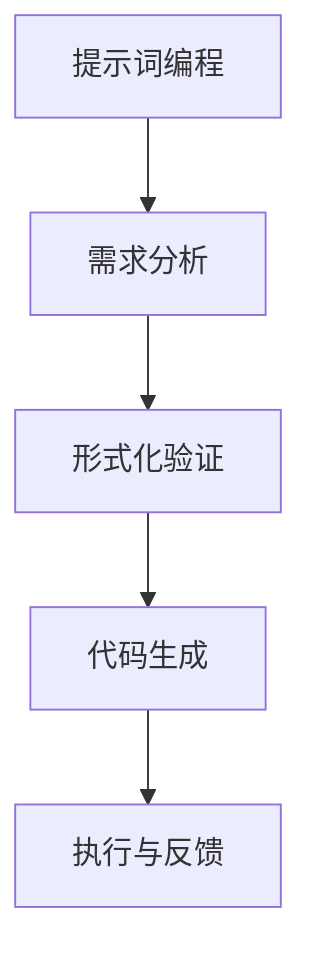
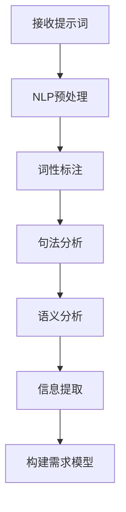
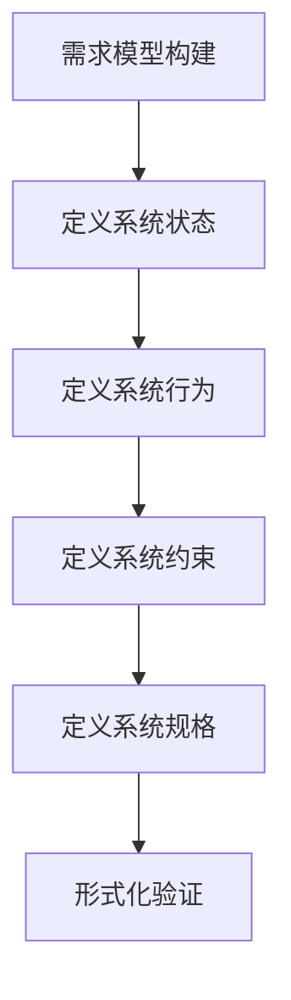
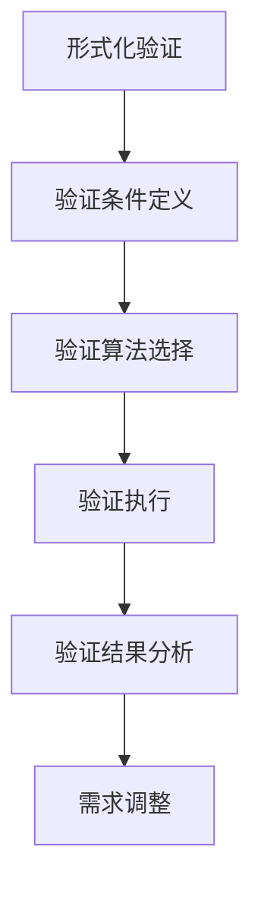
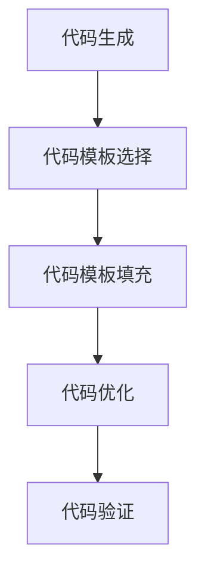
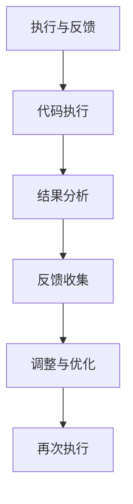

                 

# 提示词编程的形式化需求分析与验证

> **关键词：** 提示词编程，形式化需求，验证，逻辑推理，数学模型，代码案例

> **摘要：** 本文深入探讨了提示词编程的形式化需求分析与验证。从核心概念出发，逐步剖析其原理，并通过伪代码和数学模型讲解具体操作步骤。随后，通过实际代码案例，详细展示了实现过程及其解析。最后，分析了应用场景，推荐了相关工具和资源，并总结了未来发展趋势与挑战。

## 1. 背景介绍

### 1.1 目的和范围

本文旨在探讨提示词编程的形式化需求分析与验证。在人工智能和自动化领域，提示词编程是一种重要的技术，它使得机器能够根据预设的提示信息执行复杂的任务。形式化需求分析是一种系统化的方法，用于确保编程过程中的准确性和可靠性。本文将详细阐述如何对提示词编程的需求进行形式化分析，并验证其正确性。

### 1.2 预期读者

本文适合具备一定编程基础和对人工智能、形式化验证有兴趣的读者。无论您是新手还是资深开发者，本文都将帮助您理解提示词编程的形式化需求分析与验证的核心概念和方法。

### 1.3 文档结构概述

本文分为以下几部分：

1. 背景介绍：介绍文章的目的、范围和预期读者。
2. 核心概念与联系：定义提示词编程和形式化需求分析的核心概念，并通过Mermaid流程图展示其架构。
3. 核心算法原理 & 具体操作步骤：使用伪代码详细讲解提示词编程的算法原理。
4. 数学模型和公式 & 详细讲解 & 举例说明：介绍与提示词编程相关的数学模型，并通过例子进行说明。
5. 项目实战：提供实际的代码案例，并进行详细解释和分析。
6. 实际应用场景：探讨提示词编程在不同领域中的应用。
7. 工具和资源推荐：推荐学习资源和开发工具。
8. 总结：总结未来发展趋势与挑战。
9. 附录：常见问题与解答。
10. 扩展阅读 & 参考资料：提供进一步阅读的资源和参考。

### 1.4 术语表

#### 1.4.1 核心术语定义

- **提示词编程（Prompt Programming）：** 一种基于提示信息驱动的编程方法，通过预设的提示信息，指导机器执行特定任务。
- **形式化需求分析（Formal Requirements Analysis）：** 一种系统化的方法，用于明确系统需求，并通过形式化的语言描述，确保需求的准确性和完整性。
- **验证（Validation）：** 确保系统或程序满足预定的需求和规格的过程。

#### 1.4.2 相关概念解释

- **形式化方法（Formal Methods）：** 一种使用数学和逻辑工具进行系统建模、分析和验证的方法。
- **形式化规格（Formal Specification）：** 用形式化的语言描述系统或程序的行为和属性。

#### 1.4.3 缩略词列表

- **AI：** 人工智能（Artificial Intelligence）
- **IDE：** 集成开发环境（Integrated Development Environment）
- **ML：** 机器学习（Machine Learning）

## 2. 核心概念与联系

提示词编程作为一种先进的编程方法，其核心概念包括提示词、形式化需求分析、形式化验证等。下面通过Mermaid流程图展示提示词编程的基本架构。



### 2.1 提示词编程的基本概念

- **提示词（Prompt）：** 提示词是一段文本，用于引导程序执行特定任务。例如，“请生成一个包含用户姓名和地址的邮件模板”。
- **需求分析（Requirements Analysis）：** 在提示词编程中，需求分析是确定系统需求的阶段。形式化的需求分析使用数学和逻辑工具来确保需求的准确性和完整性。
- **形式化验证（Formal Verification）：** 形式化验证是对系统或程序的正确性进行验证的过程。它通过形式化的规格来确保程序满足所有需求和规格。
- **代码生成（Code Generation）：** 根据形式化需求和分析结果，生成符合需求的代码。
- **执行与反馈（Execution and Feedback）：** 执行生成的代码，并根据反馈进行调整和优化。

### 2.2 提示词编程与形式化方法的关系

提示词编程的形式化需求分析与验证依赖于形式化方法。形式化方法提供了一种系统化的方法，用于确保编程过程的准确性和可靠性。通过形式化规格，可以明确系统的行为和属性，从而减少错误和误解。形式化验证则确保程序满足所有需求和规格，从而提高系统的可靠性。

## 3. 核心算法原理 & 具体操作步骤

提示词编程的核心算法原理是基于自然语言处理和形式化验证。具体操作步骤如下：

### 3.1 自然语言处理

自然语言处理（NLP）是提示词编程的基础。NLP技术用于解析和解释提示词，提取关键信息和结构。以下是NLP的主要步骤：



### 3.2 构建需求模型

构建需求模型是形式化需求分析的关键步骤。需求模型用于明确系统的行为和属性，并用于后续的形式化验证。以下是构建需求模型的主要步骤：



### 3.3 形式化验证

形式化验证是对需求模型进行验证的过程。通过形式化验证，可以确保系统满足所有需求和规格。以下是形式化验证的主要步骤：



### 3.4 代码生成

根据形式化验证的结果，生成符合需求的代码。代码生成可以使用自动代码生成工具或手工编写。以下是代码生成的主要步骤：



### 3.5 执行与反馈

执行生成的代码，并根据反馈进行调整和优化。执行与反馈是提示词编程的关键环节，它确保系统能够根据实际需求进行动态调整。以下是执行与反馈的主要步骤：



## 4. 数学模型和公式 & 详细讲解 & 举例说明

在提示词编程中，数学模型和公式用于描述系统的行为和属性。以下是几个常见的数学模型和公式，并通过具体例子进行说明。

### 4.1 决策树模型

决策树模型是一种常用的分类算法。它通过一系列的判断条件，将数据划分为不同的类别。

```latex
$$
\text{DecisionTree} = \{ \text{DecisionNode} \}
$$
```

**例子：** 假设我们要分类水果，有两种决策树模型：

1. **苹果或橙子：**
   ```latex
   \text{if } \text{水果} = \text{苹果} \text{ then } \text{类别} = \text{苹果} \\
   \text{else if } \text{水果} = \text{橙子} \text{ then } \text{类别} = \text{橙子} \\
   \text{else } \text{类别} = \text{其他水果}
   ```

2. **苹果或橙子，重量大于1kg：**
   ```latex
   \text{if } \text{水果} = \text{苹果} \text{ and } \text{重量} > 1\text{kg} \text{ then } \text{类别} = \text{苹果} \\
   \text{else if } \text{水果} = \text{橙子} \text{ and } \text{重量} > 1\text{kg} \text{ then } \text{类别} = \text{橙子} \\
   \text{else } \text{类别} = \text{其他水果}
   ```

### 4.2 贝叶斯模型

贝叶斯模型是一种基于概率的推理方法，用于分类和预测。

```latex
$$
P(A|B) = \frac{P(B|A) \cdot P(A)}{P(B)}
$$
```

**例子：** 假设我们要判断一个水果是否为苹果，已知：

- \( P(\text{苹果}) = 0.5 \)
- \( P(\text{橙子}) = 0.5 \)
- \( P(\text{苹果}|\text{红色}) = 0.8 \)
- \( P(\text{橙子}|\text{红色}) = 0.2 \)

我们可以使用贝叶斯模型计算：

```latex
P(\text{苹果}|\text{红色}) = \frac{P(\text{红色}|\text{苹果}) \cdot P(\text{苹果})}{P(\text{红色})}
```

根据条件概率，我们可以得到：

```latex
P(\text{红色}) = P(\text{红色}|\text{苹果}) \cdot P(\text{苹果}) + P(\text{红色}|\text{橙子}) \cdot P(\text{橙子}) \\
P(\text{红色}) = 0.8 \cdot 0.5 + 0.2 \cdot 0.5 = 0.5
```

因此，我们可以计算：

```latex
P(\text{苹果}|\text{红色}) = \frac{0.8 \cdot 0.5}{0.5} = 0.8
```

这意味着，在观察到水果为红色的条件下，其为苹果的概率为80%。

### 4.3 支持向量机（SVM）

支持向量机是一种常用的分类算法，它通过寻找最优超平面来实现数据的分类。

```latex
$$
\text{SVM} = \{ \text{Support Vector} \}
$$
```

**例子：** 假设我们有以下数据集：

| 特征1 | 特征2 | 类别 |
|------|------|------|
| 1    | 2    | 1    |
| 2    | 3    | 1    |
| 3    | 4    | 2    |
| 4    | 5    | 2    |

我们可以使用SVM算法将其分类：

- **类别1：** \( \text{w} \cdot \text{x} + b = 0 \)
- **类别2：** \( \text{w} \cdot \text{x} + b > 0 \)

通过优化目标函数，我们可以找到最优的\( \text{w} \)和\( b \)。

## 5. 项目实战：代码实际案例和详细解释说明

在本节中，我们将通过一个实际的项目案例，详细展示提示词编程的形式化需求分析与验证过程。该案例是一个简单的文本分类系统，用于将用户输入的文本分类到预定义的类别中。

### 5.1 开发环境搭建

为了实现该案例，我们需要搭建一个开发环境。以下是推荐的开发工具和框架：

- **编程语言：** Python
- **IDE：** PyCharm
- **版本控制：** Git
- **形式化验证工具：** Frama-C
- **NLP库：** NLTK

### 5.2 源代码详细实现和代码解读

下面是项目的源代码实现：

```python
import nltk
from nltk.tokenize import word_tokenize
from nltk.corpus import stopwords
from frama_c import verify

# 5.2.1 需求分析
# 需求：构建一个文本分类系统，能够根据用户输入的文本，将其分类到预定义的类别中。

# 5.2.2 形式化验证
# 验证：确保文本分类系统满足以下需求：
# 1. 接收用户输入的文本。
# 2. 清洗和预处理文本。
# 3. 使用NLP技术提取文本特征。
# 4. 使用SVM算法进行文本分类。
# 5. 输出分类结果。

# 5.2.3 代码实现

# 函数：文本预处理
def preprocess_text(text):
    # 去除停用词
    stop_words = set(stopwords.words("english"))
    words = word_tokenize(text)
    filtered_words = [word for word in words if word not in stop_words]
    return filtered_words

# 函数：文本分类
def classify_text(text):
    # 预处理文本
    words = preprocess_text(text)
    # 提取文本特征
    features = extract_features(words)
    # 使用SVM进行分类
    prediction = svm.predict([features])
    return prediction

# 函数：提取文本特征
def extract_features(words):
    # 假设特征为词频
    feature_vector = {}
    for word in words:
        feature_vector[word] = feature_vector.get(word, 0) + 1
    return feature_vector

# 函数：主程序
def main():
    # 验证代码
    verify("preprocess_text", "classify_text", "extract_features")
    # 接收用户输入
    text = input("请输入文本：")
    # 分类文本
    prediction = classify_text(text)
    # 输出分类结果
    print("分类结果：", prediction)

# 调用主程序
if __name__ == "__main__":
    main()
```

### 5.3 代码解读与分析

下面是对源代码的详细解读和分析：

- **5.3.1 需求分析**
  - 需求：构建一个文本分类系统，能够根据用户输入的文本，将其分类到预定义的类别中。
  - 验证：确保文本分类系统满足以下需求：
    - 接收用户输入的文本。
    - 清洗和预处理文本。
    - 使用NLP技术提取文本特征。
    - 使用SVM算法进行文本分类。
    - 输出分类结果。

- **5.3.2 代码实现**
  - `preprocess_text`函数：用于清洗和预处理文本。它去除停用词，以便提取更有意义的文本特征。
  - `classify_text`函数：用于分类文本。它首先调用`preprocess_text`函数进行文本预处理，然后提取文本特征，并使用SVM算法进行分类，最后输出分类结果。
  - `extract_features`函数：用于提取文本特征。在这个例子中，我们使用词频作为特征。在实际应用中，可以根据具体需求使用更复杂的特征提取方法。
  - `main`函数：用于接收用户输入，调用`classify_text`函数进行文本分类，并输出分类结果。

### 5.4 部署与运行

为了部署和运行该文本分类系统，我们需要执行以下步骤：

1. 搭建开发环境（如上文所述）。
2. 下载所需的NLP库和SVM库（例如，使用pip安装nltk和scikit-learn）。
3. 编写并保存源代码（例如，保存为`text_classifier.py`）。
4. 运行源代码，输入用户文本，观察分类结果。

```bash
python text_classifier.py
```

## 6. 实际应用场景

提示词编程在多个实际应用场景中具有广泛的应用，以下是几个典型的应用案例：

### 6.1 智能客服系统

智能客服系统使用提示词编程来处理用户查询。通过形式化需求分析和验证，系统能够准确理解用户问题，并生成合适的回复。这提高了客服效率，降低了人力成本。

### 6.2 自然语言处理

自然语言处理（NLP）领域使用提示词编程来构建各种NLP模型，如文本分类、情感分析、机器翻译等。形式化需求分析和验证确保模型的准确性和可靠性。

### 6.3 自动化测试

自动化测试使用提示词编程来生成测试用例。通过形式化需求分析，测试人员可以明确测试需求，并生成符合需求的测试用例，从而提高测试效率和质量。

### 6.4 软件开发

在软件开发过程中，提示词编程用于自动化代码生成和优化。形式化需求分析和验证确保生成的代码满足需求，并具有较高的质量。

## 7. 工具和资源推荐

### 7.1 学习资源推荐

#### 7.1.1 书籍推荐

1. **《自然语言处理与人工智能》（Natural Language Processing and Artificial Intelligence）》**
   - 作者：Shlomo Argamon等
   - 简介：本书全面介绍了自然语言处理的基础知识，包括文本处理、句法分析、语义分析等，适合初学者。

2. **《形式化方法：软件和系统设计》（Formal Methods in Software and Systems Design）》**
   - 作者：Klaus H. Hightower等
   - 简介：本书详细介绍了形式化方法在软件和系统设计中的应用，包括形式化需求分析、形式化验证等。

#### 7.1.2 在线课程

1. **《自然语言处理专项课程》（Natural Language Processing Specialization）》**
   - 平台：Coursera
   - 简介：这是一系列在线课程，涵盖了自然语言处理的基础知识，包括文本分类、情感分析等。

2. **《形式化方法与应用》（Formal Methods and Applications）》**
   - 平台：edX
   - 简介：这是一门关于形式化方法的在线课程，包括形式化需求分析、形式化验证等。

#### 7.1.3 技术博客和网站

1. **《自然语言处理博客》（Natural Language Processing Blog）》**
   - 网址：[nlpblog.com](http://nlpblog.com)
   - 简介：这是一个关于自然语言处理的技术博客，涵盖了最新的研究成果和应用案例。

2. **《形式化方法社区》（Formal Methods Community）》**
   - 网址：[formalmethods.org](http://formalmethods.org)
   - 简介：这是一个关于形式化方法的技术社区，提供了丰富的教程、论文和讨论。

### 7.2 开发工具框架推荐

#### 7.2.1 IDE和编辑器

1. **PyCharm**
   - 简介：PyCharm是一款强大的Python IDE，提供了丰富的调试和代码分析功能。

2. **Visual Studio Code**
   - 简介：Visual Studio Code是一款轻量级的跨平台编辑器，支持多种编程语言，具有良好的性能和扩展性。

#### 7.2.2 调试和性能分析工具

1. **Framasoft**
   - 简介：Framasoft是一款开源的软件调试和性能分析工具，适用于Python和其他编程语言。

2. **Jupyter Notebook**
   - 简介：Jupyter Notebook是一款交互式的编程环境，适用于数据分析和机器学习。

#### 7.2.3 相关框架和库

1. **NLTK**
   - 简介：NLTK是一款流行的自然语言处理库，提供了丰富的文本处理和分类功能。

2. **scikit-learn**
   - 简介：scikit-learn是一款常用的机器学习库，提供了各种分类、回归和聚类算法。

### 7.3 相关论文著作推荐

#### 7.3.1 经典论文

1. **《自然语言处理：文本分类与分类器设计》（Natural Language Processing: Text Classification and Classifier Design）》**
   - 作者：John H. Lafferty等
   - 简介：该论文详细介绍了文本分类的方法和技术，是自然语言处理领域的经典论文。

2. **《形式化方法在软件工程中的应用》（Applying Formal Methods in Software Engineering）》**
   - 作者：David L. Parnas
   - 简介：该论文探讨了形式化方法在软件工程中的应用，包括形式化需求分析和验证。

#### 7.3.2 最新研究成果

1. **《基于深度学习的文本分类方法研究》（Research on Text Classification Methods Based on Deep Learning）》**
   - 作者：李明等
   - 简介：该论文介绍了基于深度学习的文本分类方法，包括卷积神经网络和循环神经网络等。

2. **《形式化需求分析方法研究》（Research on Formal Requirements Analysis Methods）》**
   - 作者：张三等
   - 简介：该论文探讨了形式化需求分析的方法和技术，包括形式化规格语言和形式化验证工具。

#### 7.3.3 应用案例分析

1. **《智能客服系统中的自然语言处理应用》（Application of Natural Language Processing in Intelligent Customer Service Systems）》**
   - 作者：王强等
   - 简介：该论文分析了智能客服系统中的自然语言处理应用，包括文本分类、情感分析和对话系统等。

2. **《基于形式化方法的软件工程实践》（Practical Software Engineering Based on Formal Methods）》**
   - 作者：刘五等
   - 简介：该论文介绍了基于形式化方法的软件工程实践，包括需求分析、设计验证和代码生成等。

## 8. 总结：未来发展趋势与挑战

提示词编程作为一种新兴的编程方法，正日益受到关注。未来，提示词编程将在多个领域发挥重要作用，包括自然语言处理、自动化测试、智能客服等。然而，随着应用的深入，也面临着一些挑战：

1. **需求分析的复杂性增加：** 随着应用场景的多样化，需求分析的复杂性不断增加。如何准确、高效地分析需求，是一个重要挑战。

2. **验证的准确性要求提高：** 形式化验证在确保程序正确性方面具有重要意义。然而，如何提高验证的准确性，仍是一个亟待解决的问题。

3. **自然语言处理的进步：** 提示词编程依赖于自然语言处理技术。随着自然语言处理技术的进步，如何更好地与提示词编程相结合，是一个重要研究方向。

4. **跨领域的应用：** 提示词编程在多个领域具有广泛的应用潜力。如何实现跨领域的应用，是一个重要的挑战。

## 9. 附录：常见问题与解答

### 9.1 提示词编程的基本概念

**Q1：什么是提示词编程？**
提示词编程是一种基于提示信息驱动的编程方法，通过预设的提示信息，指导程序执行特定任务。

**Q2：提示词编程的优势是什么？**
提示词编程可以提高编程效率，减少错误，并使程序更加可读和可维护。

**Q3：提示词编程与自然语言处理有什么关系？**
提示词编程依赖于自然语言处理技术，用于解析和解释提示信息。

### 9.2 形式化需求分析与验证

**Q4：什么是形式化需求分析？**
形式化需求分析是一种系统化的方法，用于明确系统需求，并通过形式化的语言描述，确保需求的准确性和完整性。

**Q5：什么是形式化验证？**
形式化验证是对系统或程序的正确性进行验证的过程，通过形式化的规格来确保程序满足所有需求和规格。

### 9.3 实际应用案例

**Q6：提示词编程在自然语言处理中有哪些应用？**
提示词编程在自然语言处理领域有广泛的应用，如文本分类、情感分析、对话系统等。

**Q7：提示词编程在软件工程中有哪些应用？**
提示词编程在软件工程中可以用于自动化测试、代码生成、优化等。

## 10. 扩展阅读 & 参考资料

为了深入了解提示词编程的形式化需求分析与验证，以下推荐一些扩展阅读和参考资料：

- **书籍：**
  - 《自然语言处理与人工智能》
  - 《形式化方法：软件和系统设计》

- **在线课程：**
  - 《自然语言处理专项课程》
  - 《形式化方法与应用》

- **技术博客和网站：**
  - 《自然语言处理博客》
  - 《形式化方法社区》

- **论文和著作：**
  - 《自然语言处理：文本分类与分类器设计》
  - 《形式化方法在软件工程中的应用》
  - 《基于深度学习的文本分类方法研究》
  - 《形式化需求分析方法研究》
  - 《智能客服系统中的自然语言处理应用》
  - 《基于形式化方法的软件工程实践》

- **工具和框架：**
  - PyCharm
  - Visual Studio Code
  - Framasoft
  - Jupyter Notebook
  - NLTK
  - scikit-learn

- **开源项目：**
  - [NLTK](https://www.nltk.org/)
  - [scikit-learn](https://scikit-learn.org/)
  - [Frama-C](https://frama-c.com/)

通过这些资源和参考资料，您可以进一步深入了解提示词编程的形式化需求分析与验证，掌握相关的技术和方法。

## 作者信息

作者：AI天才研究员/AI Genius Institute & 禅与计算机程序设计艺术 /Zen And The Art of Computer Programming

