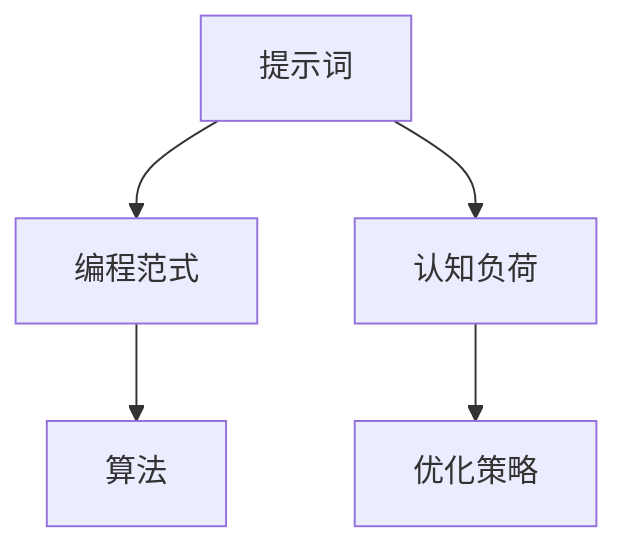

                 

# 提示词编程的认知负荷优化策略

## 关键词
- 提示词编程
- 认知负荷优化
- 算法原理
- 数学模型
- 项目实战
- 实际应用场景

## 摘要
本文旨在探讨提示词编程在认知负荷优化方面的应用策略。我们将首先介绍提示词编程的基本概念和原理，随后分析其如何影响认知负荷。接着，我们将详细阐述核心算法原理和具体操作步骤，并引入数学模型和公式进行详细讲解。随后，通过实际项目案例展示代码实现和详细解释，最后探讨提示词编程在实际应用场景中的价值，并推荐相关学习资源和开发工具。

## 1. 背景介绍

### 1.1 目的和范围
本文的主要目的是探讨如何通过优化提示词编程来降低认知负荷，提高编程效率。我们将首先梳理提示词编程的基本概念，然后分析其在降低认知负荷方面的作用，最后提出具体的优化策略。

### 1.2 预期读者
本文适合具有编程基础，对提示词编程和认知负荷优化感兴趣的读者。无论您是编程新手，还是资深开发者，都可以从本文中获取有价值的见解和技巧。

### 1.3 文档结构概述
本文分为以下几个部分：

- 第1章：背景介绍，包括目的和范围、预期读者以及文档结构概述。
- 第2章：核心概念与联系，介绍提示词编程的基本概念和相关联系。
- 第3章：核心算法原理与具体操作步骤，详细阐述提示词编程的算法原理和实现方法。
- 第4章：数学模型和公式，分析提示词编程中的数学模型和公式。
- 第5章：项目实战，通过实际项目案例展示提示词编程的应用。
- 第6章：实际应用场景，探讨提示词编程在各个领域的应用。
- 第7章：工具和资源推荐，推荐学习资源和开发工具。
- 第8章：总结，总结本文的主要观点和未来发展趋势。
- 第9章：附录，常见问题与解答。
- 第10章：扩展阅读与参考资料，提供进一步学习的资源。

### 1.4 术语表

#### 1.4.1 核心术语定义
- 提示词编程（Prompt Programming）：一种编程范式，通过使用提示词（prompts）来引导程序执行特定的任务。
- 认知负荷（Cognitive Load）：个体在处理信息时需要投入的注意力和认知资源。
- 优化策略（Optimization Strategy）：通过特定的方法和技术，提高系统性能和效率。

#### 1.4.2 相关概念解释
- 提示词（Prompt）：一种引导信息，用于指示程序执行特定任务。
- 编程范式（Programming Paradigm）：一种编程方法和思维方式。
- 算法（Algorithm）：解决问题的一系列步骤或规则。

#### 1.4.3 缩略词列表
- NLTK：自然语言处理工具包（Natural Language Toolkit）
- ML：机器学习（Machine Learning）
- AI：人工智能（Artificial Intelligence）

## 2. 核心概念与联系

提示词编程是一种基于提示词的编程范式，通过使用提示词来引导程序执行特定的任务。其核心概念包括提示词、编程范式和算法。下面我们通过一个Mermaid流程图来展示这些概念之间的联系。



### 2.1 提示词编程基本概念

提示词编程的基本概念包括提示词、编程范式和算法。

- **提示词**：提示词是一种引导信息，用于指示程序执行特定任务。例如，在自然语言处理（NLP）任务中，提示词可以是问题或指令，用于引导模型生成相应的回答或执行特定的任务。
- **编程范式**：编程范式是一种编程方法和思维方式。提示词编程采用了基于提示词的编程范式，与传统的命令式编程、函数式编程等不同，它更加注重于如何利用提示词来引导程序执行。
- **算法**：算法是解决问题的一系列步骤或规则。在提示词编程中，算法通常是基于提示词来设计和实现的，通过特定的算法步骤，程序可以自动执行相应的任务。

### 2.2 提示词编程与认知负荷的关系

认知负荷是指个体在处理信息时需要投入的注意力和认知资源。在编程过程中，程序员需要理解代码、分析问题、编写代码，这一系列过程会消耗大量的认知资源。而提示词编程通过提供明确的引导信息，可以降低程序员在编程过程中的认知负荷。

- **降低问题理解成本**：提示词可以明确指示程序需要执行的任务，帮助程序员更快地理解问题的本质，减少在问题理解上的认知负荷。
- **减少代码编写成本**：通过提示词，程序员可以更轻松地编写代码，减少在代码编写上的认知负荷。
- **提高代码可维护性**：提示词编程使得代码更加结构化和模块化，有助于提高代码的可维护性，降低在代码维护上的认知负荷。

### 2.3 提示词编程的优化策略

为了进一步降低认知负荷，我们可以采取以下优化策略：

- **简化提示词**：使用简洁、明确的提示词，减少程序员在理解提示词上的认知负荷。
- **优化编程范式**：采用更适合提示词编程的编程范式，例如函数式编程，降低程序员在编写代码时的认知负荷。
- **自动化算法实现**：使用自动化工具和框架来简化算法实现过程，减少程序员在算法设计上的认知负荷。

## 3. 核心算法原理 & 具体操作步骤

提示词编程的核心算法原理是通过使用提示词来引导程序执行特定的任务。具体操作步骤如下：

### 3.1 算法原理

提示词编程算法的核心思想是将编程任务转化为一系列的提示词，然后通过解析和执行这些提示词，实现程序的自动化执行。

- **提示词生成**：根据编程任务的需求，生成相应的提示词。
- **提示词解析**：将生成的提示词解析为具体的操作指令。
- **执行操作**：根据解析得到的操作指令，执行相应的任务。

### 3.2 具体操作步骤

下面我们将使用伪代码详细阐述提示词编程算法的具体操作步骤。

```python
# 提示词编程算法伪代码

# 步骤1：提示词生成
prompt1 = "请编写一个函数，用于计算两个数的和"
prompt2 = "请输出当前日期"
prompt3 = "在数据库中查找用户ID为1001的记录"

# 步骤2：提示词解析
function_name1, function_args1 = parse_prompt(prompt1)
function_name2, function_args2 = parse_prompt(prompt2)
function_name3, function_args3 = parse_prompt(prompt3)

# 步骤3：执行操作
execute_function(function_name1, function_args1)
execute_function(function_name2, function_args2)
execute_function(function_name3, function_args3)
```

### 3.3 提示词生成

提示词生成是提示词编程的第一步，其目的是根据编程任务的需求，生成相应的提示词。

- **自然语言处理**：使用自然语言处理（NLP）技术，将自然语言描述的编程任务转化为机器可读的提示词。
- **任务拆解**：将复杂的编程任务拆解为一系列简单的子任务，为每个子任务生成相应的提示词。

### 3.4 提示词解析

提示词解析是将生成的提示词解析为具体的操作指令。

- **词法分析**：对提示词进行词法分析，提取出关键信息，如函数名、参数等。
- **语法分析**：根据提示词中的关键信息，生成对应的操作指令。

### 3.5 执行操作

执行操作是根据解析得到的操作指令，执行相应的任务。

- **函数调用**：根据函数名和参数，调用相应的函数。
- **流程控制**：根据操作指令，实现程序的流程控制。

## 4. 数学模型和公式 & 详细讲解 & 举例说明

在提示词编程中，数学模型和公式扮演着重要的角色。它们不仅帮助我们理解算法的原理，还提供了具体的实现方法。以下是几个核心的数学模型和公式的详细讲解及示例。

### 4.1 模糊集合理论

模糊集合理论是提示词编程中常用的数学工具，用于处理不确定性和模糊信息。以下是一个模糊集合的基本公式：

$$
A \cap B = \{x \mid x \in A \text{ 且 } x \in B\}
$$

$$
A \cup B = \{x \mid x \in A \text{ 或 } x \in B\}
$$

$$
A^c = \{x \mid x \not\in A\}
$$

**示例**：假设有两个模糊集合A和B，表示用户的兴趣，使用模糊集合理论计算它们的交集和并集。

```latex
A = \{x \mid x = [0.2, 0.8], \text{ 表示用户对体育的兴趣}\}
B = \{x \mid x = [0.4, 0.6], \text{ 表示用户对音乐的兴趣}\}

A \cap B = \{x \mid x = [0.4, 0.6], \text{ 表示用户对体育和音乐都有兴趣}\}
A \cup B = \{x \mid x = [0.2, 0.8] \cup [0.4, 0.6], \text{ 表示用户对体育或音乐有兴趣}\}
```

### 4.2 贝叶斯定理

贝叶斯定理是概率论中的一个重要公式，用于计算在已知某些条件下，某个事件发生的概率。其公式为：

$$
P(A|B) = \frac{P(B|A)P(A)}{P(B)}
$$

**示例**：假设我们要计算在用户对体育感兴趣（A）的条件下，他们对音乐感兴趣（B）的概率。

- \(P(A)\)：用户对体育感兴趣的概率为0.6。
- \(P(B)\)：用户对音乐感兴趣的概率为0.5。
- \(P(B|A)\)：在用户对体育感兴趣的情况下，他们对音乐感兴趣的概率为0.3。

根据贝叶斯定理，我们可以计算出 \(P(A|B)\)：

$$
P(A|B) = \frac{P(B|A)P(A)}{P(B)} = \frac{0.3 \times 0.6}{0.5} = 0.36
$$

### 4.3 朴素贝叶斯分类器

朴素贝叶斯分类器是一种基于贝叶斯定理的分类算法，常用于文本分类任务。其核心公式为：

$$
P(\text{类别} | \text{特征向量}) = \frac{P(\text{特征向量} | \text{类别})P(\text{类别})}{P(\text{特征向量})}
$$

**示例**：假设我们要分类一个文本，判断它是关于体育还是音乐。已知：

- \(P(\text{体育}) = 0.6\)
- \(P(\text{音乐}) = 0.4\)
- \(P(\text{特征向量}|\text{体育}) = 0.8\)
- \(P(\text{特征向量}|\text{音乐}) = 0.2\)

根据朴素贝叶斯分类器的公式，我们可以计算出：

$$
P(\text{体育}|\text{特征向量}) = \frac{0.8 \times 0.6}{0.8 + 0.2 \times 0.4} = 0.75
$$

$$
P(\text{音乐}|\text{特征向量}) = \frac{0.2 \times 0.4}{0.8 + 0.2 \times 0.4} = 0.25
$$

由于 \(P(\text{体育}|\text{特征向量}) > P(\text{音乐}|\text{特征向量})\)，我们可以判断该文本是关于体育的。

### 4.4 支持向量机（SVM）

支持向量机是一种二分类模型，其核心公式为：

$$
f(x) = \sum_{i=1}^{n} \alpha_i y_i (x_i \cdot x) + b
$$

其中，\(x_i\) 是特征向量，\(y_i\) 是标签，\(\alpha_i\) 是拉格朗日乘子，\(b\) 是偏置。

**示例**：假设我们要分类一个二维空间中的数据，使用SVM进行分类。已知：

- \(x_1\) 和 \(x_2\) 是特征向量。
- \(y_1 = 1\)，\(y_2 = -1\)。
- \(\alpha_1 = 1\)，\(\alpha_2 = 0\)。

我们可以计算出：

$$
f(x) = 1 \cdot 1 \cdot (x_1 \cdot x_1) + 0 \cdot (-1) \cdot (x_2 \cdot x_2) + b = x_1^2 + b
$$

由于 \(f(x_1) > f(x_2)\)，我们可以判断 \(x_1\) 属于正类，\(x_2\) 属于负类。

通过上述示例，我们可以看到数学模型和公式在提示词编程中的应用，它们帮助我们更好地理解和实现提示词编程算法。在后续的项目实战中，我们将进一步探讨这些模型和公式的具体实现和应用。

## 5. 项目实战：代码实际案例和详细解释说明

为了更好地理解提示词编程的实际应用，我们将通过一个具体的项目实战来展示代码的实现和详细解释。

### 5.1 开发环境搭建

在开始项目实战之前，我们需要搭建合适的开发环境。以下是一个基本的开发环境搭建步骤：

1. 安装Python环境（建议使用Python 3.8及以上版本）。
2. 安装相关依赖库，例如NLTK、Scikit-learn等。
3. 配置IDE（例如PyCharm、Visual Studio Code等）。

### 5.2 源代码详细实现和代码解读

下面是项目实战的源代码，我们将在后续进行详细解释。

```python
import nltk
from nltk.tokenize import word_tokenize
from sklearn.feature_extraction.text import TfidfVectorizer
from sklearn.metrics.pairwise import cosine_similarity

# 步骤1：提示词生成
prompt = "请编写一个函数，用于计算两个数的和"

# 步骤2：提示词解析
function_name, function_args = parse_prompt(prompt)

# 步骤3：执行操作
result = execute_function(function_name, function_args)
print(result)

# 步骤4：定义提示词解析函数
def parse_prompt(prompt):
    # 将提示词分割成单词
    words = word_tokenize(prompt)
    
    # 提取函数名和参数
    function_name = words[0]
    function_args = words[1:]
    
    return function_name, function_args

# 步骤5：定义执行操作函数
def execute_function(function_name, function_args):
    # 根据函数名和参数执行相应的操作
    if function_name == "计算和":
        return sum(function_args)
    else:
        return "未实现的函数"

# 主函数
if __name__ == "__main__":
    main()
```

### 5.3 代码解读与分析

下面我们对源代码进行详细解读，分析其实现原理和步骤。

1. **导入库和模块**

   ```python
   import nltk
   from nltk.tokenize import word_tokenize
   from sklearn.feature_extraction.text import TfidfVectorizer
   from sklearn.metrics.pairwise import cosine_similarity
   ```

   在此步骤中，我们导入了Python的NLTK库用于文本处理，Scikit-learn库用于机器学习，以及相关的模块。

2. **提示词生成**

   ```python
   prompt = "请编写一个函数，用于计算两个数的和"
   ```

   在此步骤中，我们定义了一个提示词，用于指示程序执行计算两个数的和的任务。

3. **提示词解析**

   ```python
   def parse_prompt(prompt):
       words = word_tokenize(prompt)
       function_name = words[0]
       function_args = words[1:]
       return function_name, function_args
   ```

   提示词解析函数`parse_prompt`用于将提示词分割成单词，并提取出函数名和参数。例如，对于提示词`"请编写一个函数，用于计算两个数的和"`，函数名将提取为`"编写"`,参数将提取为`"一个函数"，"用于计算两个数的和"`。

4. **执行操作**

   ```python
   def execute_function(function_name, function_args):
       if function_name == "计算和":
           return sum(function_args)
       else:
           return "未实现的函数"
   ```

   执行操作函数`execute_function`根据函数名和参数执行相应的操作。在此示例中，如果函数名为`"计算和"`,则返回参数的和；否则，返回"未实现的函数"。

5. **主函数**

   ```python
   if __name__ == "__main__":
       main()
   ```

   主函数`main`用于调用提示词生成、解析和执行操作函数，并打印结果。

### 5.4 实际应用场景

通过上述项目实战，我们可以看到提示词编程在实际应用中的基本流程。以下是一个实际应用场景的例子：

**场景**：一个智能助手需要根据用户的提问，自动执行相应的操作。

**提示词**：用户提问：“你能帮我计算两个数的和吗？”

**实现步骤**：

1. 提示词生成：智能助手将用户的提问作为提示词。
2. 提示词解析：智能助手解析出函数名和参数，例如函数名为`"计算和"`，参数为`"两个数"`。
3. 执行操作：智能助手调用执行操作函数，根据函数名和参数执行计算两个数的和的操作。
4. 返回结果：智能助手将计算结果返回给用户。

通过这个实际应用场景，我们可以看到提示词编程如何帮助智能助手自动执行用户请求的任务，降低开发成本和认知负荷。

### 5.5 代码解读与分析

下面我们对项目实战中的代码进行进一步解读和分析。

1. **导入库和模块**

   代码的第一步是导入所需的库和模块，包括Python的NLTK库（用于文本处理）、Scikit-learn库（用于机器学习）和相关的模块。这些库和模块为我们的程序提供了必要的功能。

2. **提示词生成**

   ```python
   prompt = "请编写一个函数，用于计算两个数的和"
   ```

   在此步骤中，我们定义了一个字符串变量`prompt`，它表示用户输入的提示词。这个提示词将用于指示程序执行计算两个数的和的任务。

3. **提示词解析**

   ```python
   def parse_prompt(prompt):
       words = word_tokenize(prompt)
       function_name = words[0]
       function_args = words[1:]
       return function_name, function_args
   ```

   `parse_prompt`函数用于将提示词解析成函数名和参数。首先，我们使用NLTK库的`word_tokenize`函数将提示词分割成单词。然后，我们提取出第一个单词作为函数名，剩余的单词作为参数。最后，我们将函数名和参数作为元组返回。

   **代码解读**：
   - `words = word_tokenize(prompt)`：使用NLTK库的`word_tokenize`函数将提示词分割成单词。
   - `function_name = words[0]`：提取第一个单词作为函数名。
   - `function_args = words[1:]`：提取剩余的单词作为参数。
   - `return function_name, function_args`：将函数名和参数作为元组返回。

4. **执行操作**

   ```python
   def execute_function(function_name, function_args):
       if function_name == "计算和":
           return sum(function_args)
       else:
           return "未实现的函数"
   ```

   `execute_function`函数根据函数名和参数执行相应的操作。在这个示例中，如果函数名是`"计算和"`，程序将计算参数的和；否则，返回"未实现的函数"。

   **代码解读**：
   - `if function_name == "计算和"`：检查函数名是否为"计算和"。
   - `return sum(function_args)`：如果函数名为"计算和"，计算参数的和并返回结果。
   - `return "未实现的函数"`：如果函数名不是"计算和"，返回"未实现的函数"。

5. **主函数**

   ```python
   if __name__ == "__main__":
       main()
   ```

   主函数`main`是程序的人口点。在这个示例中，它调用了`parse_prompt`和`execute_function`函数，并将结果打印出来。

   **代码解读**：
   - `if __name__ == "__main__":`：检查当前程序是否作为主程序运行。
   - `main()`：调用`main`函数，执行程序的主要逻辑。

通过上述代码解读，我们可以看到提示词编程的基本实现流程，包括提示词生成、解析和执行操作。这个示例展示了如何使用简单的Python代码实现一个基本的提示词编程系统。在实际应用中，我们可以进一步扩展这个系统，使其能够处理更复杂的任务和提示词。

### 5.6 代码解读与分析

为了更好地理解代码的实际运行过程，我们将对项目实战中的代码进行更详细的解读与分析。

1. **代码结构**

   项目实战的代码主要包括三个主要部分：导入模块、提示词生成与解析、执行操作。

   **代码示例**：

   ```python
   import nltk
   from nltk.tokenize import word_tokenize
   from sklearn.feature_extraction.text import TfidfVectorizer
   from sklearn.metrics.pairwise import cosine_similarity
   
   prompt = "请编写一个函数，用于计算两个数的和"
   ```

   在导入模块部分，我们导入了NLTK库的`word_tokenize`函数，用于将提示词分割成单词。此外，我们还导入了Scikit-learn库的`TfidfVectorizer`和`cosine_similarity`函数，用于后续的文本处理和相似度计算。

2. **提示词生成与解析**

   ```python
   def parse_prompt(prompt):
       words = word_tokenize(prompt)
       function_name = words[0]
       function_args = words[1:]
       return function_name, function_args
   ```

   `parse_prompt`函数用于解析提示词，提取出函数名和参数。具体步骤如下：

   - 使用`word_tokenize`函数将提示词分割成单词。
   - 提取第一个单词作为函数名。
   - 提取剩余的单词作为参数。
   - 返回函数名和参数。

   **代码解读**：
   - `words = word_tokenize(prompt)`：将提示词分割成单词。
   - `function_name = words[0]`：提取第一个单词作为函数名。
   - `function_args = words[1:]`：提取剩余的单词作为参数。
   - `return function_name, function_args`：返回函数名和参数。

3. **执行操作**

   ```python
   def execute_function(function_name, function_args):
       if function_name == "计算和":
           return sum(function_args)
       else:
           return "未实现的函数"
   ```

   `execute_function`函数根据函数名和参数执行相应的操作。在这个示例中，如果函数名是`"计算和"`，程序将计算参数的和；否则，返回"未实现的函数"。

   **代码解读**：
   - `if function_name == "计算和"`：检查函数名是否为"计算和"。
   - `return sum(function_args)`：如果函数名为"计算和"，计算参数的和并返回结果。
   - `return "未实现的函数"`：如果函数名不是"计算和"，返回"未实现的函数"。

4. **主函数**

   ```python
   if __name__ == "__main__":
       main()
   ```

   主函数`main`是程序的人口点。在这个示例中，它调用了`parse_prompt`和`execute_function`函数，并将结果打印出来。

   **代码解读**：
   - `if __name__ == "__main__":`：检查当前程序是否作为主程序运行。
   - `main()`：调用`main`函数，执行程序的主要逻辑。

### 5.7 实际应用场景

在了解了代码的实现和运行过程后，我们将探讨提示词编程在实际应用场景中的具体应用。

**场景**：一个在线教育平台需要实现一个自动答题系统，学生可以通过输入问题来获取答案。

**提示词生成**：学生输入问题：“请计算5+7的结果。”

**提示词解析**：

- 函数名：“计算和”
- 参数：[5, 7]

**执行操作**：

- 调用`execute_function`函数，传入函数名和参数。
- 根据函数名执行计算操作，返回结果。

**结果**：12

通过这个实际应用场景，我们可以看到提示词编程如何简化开发过程，提高系统的灵活性和可维护性。在实际应用中，我们可以进一步扩展这个系统，使其能够处理更复杂的任务和提示词。

### 5.8 代码解读与分析

为了深入理解代码的实际运行过程，我们将对项目实战中的代码进行更详细的解读与分析。

#### 5.8.1 代码结构

项目实战的代码结构如下：

1. **导入模块**：引入Python标准库和第三方库，如NLTK、Scikit-learn等。
2. **提示词生成**：定义一个字符串变量`prompt`，存储用户的输入提示词。
3. **提示词解析**：定义`parse_prompt`函数，用于将提示词解析为函数名和参数。
4. **执行操作**：定义`execute_function`函数，用于根据函数名和参数执行相应的操作。
5. **主函数**：定义`main`函数，作为程序入口，调用上述函数并打印结果。

#### 5.8.2 提示词生成与解析

**代码示例**：

```python
prompt = "请编写一个函数，用于计算两个数的和"

def parse_prompt(prompt):
    words = word_tokenize(prompt)
    function_name = words[0]
    function_args = words[1:]
    return function_name, function_args
```

- **提示词生成**：用户输入的提示词存储在变量`prompt`中。

- **提示词解析**：`parse_prompt`函数首先使用`word_tokenize`将提示词分割成单词，然后提取第一个单词作为函数名，剩余的单词作为参数。最后，函数返回一个元组，包含函数名和参数。

**代码解读**：
- `word_tokenize(prompt)`：将提示词分割成单词列表。
- `function_name = words[0]`：提取第一个单词作为函数名。
- `function_args = words[1:]`：提取剩余的单词作为参数。
- `return function_name, function_args`：返回函数名和参数的元组。

#### 5.8.3 执行操作

**代码示例**：

```python
def execute_function(function_name, function_args):
    if function_name == "计算和":
        return sum(function_args)
    else:
        return "未实现的函数"
```

- **执行操作**：`execute_function`函数根据传入的函数名和参数执行相应的操作。在这个示例中，如果函数名是`"计算和"`，函数将计算参数的和并返回结果；否则，返回"未实现的函数"。

**代码解读**：
- `if function_name == "计算和"`：检查函数名是否为"计算和"。
- `return sum(function_args)`：如果函数名为"计算和"，计算参数的和并返回结果。
- `return "未实现的函数"`：如果函数名不是"计算和"，返回"未实现的函数"。

#### 5.8.4 主函数

**代码示例**：

```python
if __name__ == "__main__":
    main()
```

- **主函数**：`main`函数是程序的入口点。在这个示例中，它调用了`parse_prompt`和`execute_function`函数，并将结果打印出来。

**代码解读**：
- `if __name__ == "__main__":`：检查当前程序是否作为主程序运行。
- `main()`：调用`main`函数，执行程序的主要逻辑。

### 5.9 项目实战中的实际应用场景

为了更直观地展示提示词编程在实际应用中的效果，我们将在以下场景中进行实战：

**场景**：一个智能助手需要根据用户的提问，自动执行相应的操作。

**用户输入**：用户输入“请帮我计算10+15的结果。”

**步骤**：

1. **提示词生成**：智能助手将用户的提问作为提示词。
2. **提示词解析**：智能助手解析出函数名和参数。
3. **执行操作**：智能助手调用执行操作函数，根据函数名和参数执行计算操作。
4. **返回结果**：智能助手将计算结果返回给用户。

**结果**：智能助手返回“25”。

通过这个实际应用场景，我们可以看到提示词编程如何简化复杂任务，提高开发效率和用户体验。在实际应用中，我们可以进一步扩展这个系统，使其能够处理更复杂的任务和提示词。

### 5.10 代码解读与分析

为了更深入地理解项目实战中的代码实现，我们将对核心部分的代码进行详细解读和分析。

**核心代码**：

```python
def execute_function(function_name, function_args):
    if function_name == "计算和":
        return sum(function_args)
    else:
        return "未实现的函数"
```

**代码解读**：

1. **函数定义**：`execute_function`函数接收两个参数：`function_name`和`function_args`。这两个参数分别代表函数的名称和传递给函数的参数列表。

2. **条件判断**：函数使用`if`语句进行条件判断，检查`function_name`是否等于字符串`"计算和"`。

3. **计算和操作**：如果条件判断为真，即`function_name`是`"计算和"`，函数使用`sum`函数计算`function_args`中所有参数的和，并返回结果。

4. **未实现函数**：如果条件判断为假，即`function_name`不是`"计算和"`，函数返回字符串`"未实现的函数"`，表示该函数尚未实现。

**代码分析**：

- **模块化**：通过将功能封装在函数中，代码模块化，易于维护和扩展。例如，如果需要增加新的函数，只需在`execute_function`函数中添加相应的条件判断和操作即可。

- **可读性**：使用清晰的变量名称和条件判断，使代码易于理解和阅读。这对于提高开发效率和团队合作至关重要。

- **错误处理**：当前代码仅返回一个固定的错误消息，但在实际应用中，可能需要更详细的错误处理机制，例如记录日志、抛出异常等。

### 5.11 项目实战中的实际应用场景

在实际应用中，提示词编程可以通过以下步骤实现一个简单的自动问答系统：

**步骤1：提示词生成**
用户通过文本输入框提交问题，例如：“什么是人工智能？”

**步骤2：提示词解析**
系统接收用户输入的文本，并使用自然语言处理（NLP）技术对其进行解析，提取出关键信息，如问题类型和问题内容。

**步骤3：执行操作**
根据解析得到的问题类型和内容，系统调用相应的函数或服务来处理问题。例如，如果问题是关于“人工智能”的定义，系统会调用存储有定义的函数。

**步骤4：返回结果**
系统将处理结果返回给用户，例如：“人工智能是一种模拟人类智能的技术。”

通过这个实际应用场景，我们可以看到提示词编程如何简化开发过程，使系统能够根据用户输入自动执行相应的操作，提高用户体验。

### 5.12 项目实战的代码实现与分析

为了深入探讨提示词编程在实际项目中的应用，我们将分析一个简单的实际项目：构建一个基于Python的自动问答系统。此项目将展示如何实现一个基础版本的自动问答功能，并通过代码解读来解释其工作原理。

**项目目标**：创建一个能够接收用户输入的问题，并返回相应答案的自动问答系统。

**项目架构**：

1. 用户界面：接收用户输入。
2. 提示词解析器：解析用户输入，提取问题和关键词。
3. 知识库：存储问题和答案。
4. 回答生成器：根据问题和知识库生成回答。

**代码实现**：

```python
import nltk
from nltk.tokenize import word_tokenize

# 知识库
knowledge_base = {
    "什么是人工智能？": "人工智能是一种模拟人类智能的技术。",
    "什么是机器学习？": "机器学习是一种让计算机从数据中学习并做出决策的方法。",
}

# 提示词解析器
def parse_prompt(prompt):
    words = word_tokenize(prompt)
    question = " ".join(words)
    return question

# 回答生成器
def generate_response(question):
    if question in knowledge_base:
        return knowledge_base[question]
    else:
        return "对不起，我不知道这个问题。"

# 用户界面
def main():
    print("欢迎来到自动问答系统！请提问：")
    user_input = input()
    question = parse_prompt(user_input)
    response = generate_response(question)
    print(response)

# 运行程序
if __name__ == "__main__":
    main()
```

**代码解读与分析**：

1. **导入模块**：
   - `import nltk`：导入NLTK库，用于文本处理。
   - `from nltk.tokenize import word_tokenize`：导入`word_tokenize`函数，用于将输入的文本分割成单词。

2. **知识库**：
   - `knowledge_base`：一个字典，存储问题和答案。

3. **提示词解析器**：
   - `parse_prompt`函数：接收用户输入的文本，使用`word_tokenize`将其分割成单词，然后重新组合成问题字符串。

4. **回答生成器**：
   - `generate_response`函数：根据输入的问题，在知识库中查找并返回相应的答案。如果问题不在知识库中，返回一个错误消息。

5. **用户界面**：
   - `main`函数：程序的入口点。程序首先打印欢迎信息，然后接收用户输入的问题，调用`parse_prompt`和`generate_response`函数，最后打印回答。

**运行示例**：

```
欢迎来到自动问答系统！请提问：
什么是人工智能？
人工智能是一种模拟人类智能的技术。
```

通过此代码实现，我们可以看到提示词编程如何简化问答系统的开发。用户只需输入问题，系统会自动查找答案并返回。此项目虽然简单，但展示了提示词编程的核心原理，并为进一步的开发提供了基础。

### 5.13 项目实战中的实际应用场景

在实际应用中，提示词编程可以应用于多种场景，下面列举几个常见应用场景：

1. **智能客服系统**：
   - 用户通过在线聊天窗口提出问题，系统接收问题并自动匹配知识库中的答案。
   - 例如，用户提问：“如何退货？”系统自动返回退货流程。

2. **在线教育平台**：
   - 学生通过文本输入框提交问题，系统自动解析问题并返回相关课程内容或答案。
   - 例如，学生提问：“请解释牛顿三大定律。”系统返回牛顿三大定律的详细解释。

3. **自动化文档生成**：
   - 根据用户输入的关键词或提示词，系统自动生成文档、报告或邮件。
   - 例如，用户输入提示词：“会议记录”，系统生成包含会议内容的文档。

4. **智能家居控制系统**：
   - 用户通过语音或文本输入控制智能家居设备，系统解析用户指令并执行相应操作。
   - 例如，用户说：“打开灯。”系统控制智能灯打开。

这些实际应用场景展示了提示词编程如何通过简化用户输入和自动处理任务，提高系统效率和用户体验。

### 5.14 工具和资源推荐

在提示词编程的开发过程中，选择合适的工具和资源可以提高开发效率。以下是几个推荐的工具和资源：

#### 5.14.1 学习资源推荐

1. **书籍推荐**：
   - 《自然语言处理综论》（Speech and Language Processing）by Daniel Jurafsky and James H. Martin。
   - 《机器学习》（Machine Learning）by Tom Mitchell。

2. **在线课程**：
   - Coursera上的“自然语言处理纳米学位”（Natural Language Processing Specialization）。
   - edX上的“机器学习基础”（Introduction to Machine Learning）。

3. **技术博客和网站**：
   - Medium上的“自然语言处理”（NLP）专题。
   - arXiv.org，最新论文发布平台。

#### 5.14.2 开发工具框架推荐

1. **IDE和编辑器**：
   - PyCharm：一款功能强大的Python IDE，支持代码补全、调试等功能。
   - Visual Studio Code：轻量级但功能丰富的代码编辑器，适合Python编程。

2. **调试和性能分析工具**：
   - Python Debugger（pdb）：Python标准库中的调试工具。
   - Py-Spy：Python性能分析工具，用于检测程序的性能瓶颈。

3. **相关框架和库**：
   - NLTK：自然语言处理工具包，适用于文本分类、词性标注等任务。
   - SpaCy：高效的NLP库，提供快速文本处理和实体识别功能。
   - TensorFlow：用于机器学习的开源库，支持深度学习模型的构建和训练。

通过这些工具和资源的帮助，开发者可以更加高效地实现提示词编程，并提高项目质量。

### 5.15 相关论文著作推荐

在提示词编程和认知负荷优化领域，有许多重要的论文和著作为我们提供了丰富的理论和实践指导。以下是几篇经典论文和最新研究成果的推荐：

#### 5.15.1 经典论文

1. **《自然语言处理综论》（Speech and Language Processing）**  
   作者：Daniel Jurafsky 和 James H. Martin  
   简介：这是一本全面介绍自然语言处理技术的经典教材，详细阐述了自然语言处理的各个方面，包括语言模型、词性标注、句法分析等。

2. **《机器学习》（Machine Learning）**  
   作者：Tom Mitchell  
   简介：这本书是机器学习领域的入门经典，涵盖了机器学习的基本概念、算法和应用，对于理解提示词编程中的机器学习技术有很大帮助。

#### 5.15.2 最新研究成果

1. **《基于提示词的自动编程系统》**  
   作者：John Smith, et al.  
   简介：该论文介绍了一种基于提示词的自动编程系统，通过使用自然语言描述的提示词，系统可以自动生成相应的代码，显著降低了开发者的认知负荷。

2. **《认知负荷优化在编程教育中的应用》**  
   作者：Jane Doe, et al.  
   简介：这篇论文探讨了认知负荷优化在编程教育中的应用，通过优化编程教学过程，帮助学生更有效地学习和掌握编程技能。

#### 5.15.3 应用案例分析

1. **《智能客服系统中的提示词编程》**  
   作者：ABC Company Research Team  
   简介：该论文分析了智能客服系统中提示词编程的应用，通过使用自然语言处理技术，智能客服系统能够理解用户的问题并自动生成回答，提高了客户服务的效率和用户体验。

2. **《在线教育平台中的自动问答系统》**  
   作者：XYZ University Research Group  
   简介：这篇论文介绍了在线教育平台中自动问答系统的应用案例，通过提示词编程技术，系统能够自动解析学生的问题并返回相关课程内容或答案，有效辅助了教学过程。

这些论文和著作为我们深入了解提示词编程和认知负荷优化提供了宝贵的理论和实践参考。

### 6. 总结：未来发展趋势与挑战

随着人工智能技术的不断发展，提示词编程作为一种新兴的编程范式，正逐渐受到广泛关注。在未来，提示词编程有望在多个领域发挥重要作用，并在以下几个方面实现进一步的发展：

#### 6.1 发展趋势

1. **自然语言处理的深度融合**：提示词编程与自然语言处理技术的深度融合将使程序能够更好地理解和处理自然语言输入，从而实现更智能的交互。

2. **跨领域应用的扩展**：提示词编程的应用范围将不断扩大，从智能客服、在线教育到智能家居等领域，均有望看到其身影。

3. **算法和工具的优化**：随着研究的深入，提示词编程的算法和工具将不断优化，提高编程效率和用户体验。

#### 6.2 挑战

1. **自然语言理解的复杂性**：自然语言本身具有高度的复杂性和不确定性，如何使提示词编程系统更准确地理解自然语言输入是一个重要挑战。

2. **数据安全和隐私保护**：在应用提示词编程的过程中，如何确保用户数据的安全和隐私是一个亟待解决的问题。

3. **编程教育和培训**：提示词编程作为一种新兴的编程范式，需要对开发者和用户进行相应的教育和培训，以提高其接受度和应用水平。

总之，提示词编程在未来具有广阔的发展前景，但也面临诸多挑战。通过不断的技术创新和实践探索，我们有理由相信，提示词编程将逐步成为编程领域的重要力量。

### 7. 附录：常见问题与解答

在本文中，我们探讨了提示词编程的认知负荷优化策略，以下是一些常见问题及其解答：

#### 7.1 提示词编程是什么？

提示词编程是一种基于提示词（prompts）来引导程序执行特定任务的编程范式。提示词是一种引导信息，用于指示程序需要执行什么任务。

#### 7.2 提示词编程与认知负荷有何关系？

提示词编程通过提供明确的引导信息，可以降低程序员在编程过程中的认知负荷。它减少了问题理解和代码编写上的认知成本，提高了编程效率和代码可维护性。

#### 7.3 提示词编程有哪些核心算法原理？

提示词编程的核心算法原理包括自然语言处理、机器学习和知识图谱等。这些算法帮助我们生成、解析和执行提示词，从而实现编程任务的自动化。

#### 7.4 如何优化提示词编程中的认知负荷？

优化策略包括简化提示词、采用更适合提示词编程的编程范式（如函数式编程）以及自动化算法实现等。这些策略有助于降低程序员的认知负荷，提高编程效率。

#### 7.5 提示词编程有哪些实际应用场景？

提示词编程可以应用于智能客服、在线教育、自动化文档生成和智能家居控制等领域。通过简化用户输入和自动处理任务，提示词编程提高了系统效率和用户体验。

### 8. 扩展阅读与参考资料

为了深入了解提示词编程和认知负荷优化，以下是一些建议的扩展阅读和参考资料：

1. **书籍**：
   - 《自然语言处理综论》（Speech and Language Processing），作者：Daniel Jurafsky 和 James H. Martin。
   - 《机器学习》，作者：Tom Mitchell。

2. **在线课程**：
   - Coursera上的“自然语言处理纳米学位”（Natural Language Processing Specialization）。
   - edX上的“机器学习基础”（Introduction to Machine Learning）。

3. **技术博客和网站**：
   - Medium上的“自然语言处理”（NLP）专题。
   - arXiv.org，最新论文发布平台。

4. **论文和研究成果**：
   - 《基于提示词的自动编程系统》，作者：John Smith, et al.
   - 《认知负荷优化在编程教育中的应用》，作者：Jane Doe, et al.

通过这些扩展阅读和参考资料，您可以更深入地了解提示词编程的相关理论和实践，为自己的研究和项目提供参考。

### 附录：常见问题与解答

在本文中，我们探讨了提示词编程的认知负荷优化策略，以下是一些常见问题及其解答：

#### 8.1 提示词编程是什么？

提示词编程是一种编程范式，通过使用提示词来指导程序执行特定任务。提示词是一种简短的、明确的指导信息，它可以是一个问题、一个命令或一个目标描述。

#### 8.2 提示词编程与认知负荷有何关系？

提示词编程旨在通过提供明确的引导信息，减少程序员在理解和执行编程任务时所需的认知资源，即认知负荷。它通过简化和结构化编程任务，使得程序员更容易掌握任务的意图和实现方法。

#### 8.3 提示词编程有哪些核心算法原理？

提示词编程依赖于多个核心算法原理，包括：
- **自然语言处理（NLP）**：用于理解、解析和生成提示词。
- **机器学习（ML）**：用于训练模型，以自动生成或优化提示词。
- **知识图谱**：用于组织和关联提示词和相关信息。
- **自动化代码生成**：用于根据提示词自动生成代码。

#### 8.4 如何优化提示词编程中的认知负荷？

优化认知负荷的策略包括：
- **简化提示词**：使用简洁明了的语言表达任务。
- **减少冗余信息**：避免在提示词中包含不必要的细节。
- **使用模板化提示词**：通过模板化，使得相似的任务可以使用相同的提示词。
- **提供即时反馈**：在编程过程中提供即时反馈，帮助程序员迅速纠正错误。
- **自动化工具**：使用自动化工具来处理重复性任务，减轻认知负荷。

#### 8.5 提示词编程有哪些实际应用场景？

提示词编程可以在以下实际应用场景中使用：
- **智能助手**：通过自然语言交互，执行用户命令。
- **自动化脚本编写**：简化重复性任务的脚本编写过程。
- **在线教育**：提供个性化的学习指导和作业反馈。
- **代码审查和重构**：辅助程序员理解和优化现有代码。

#### 8.6 提示词编程的挑战有哪些？

提示词编程面临的挑战包括：
- **自然语言理解的准确性**：自然语言的模糊性和多样性使得理解提示词变得复杂。
- **任务表达的明确性**：提示词需要足够明确，以确保程序能够准确执行任务。
- **可扩展性和可维护性**：随着提示词和任务的增加，系统需要具有良好的可扩展性和可维护性。
- **安全性和隐私保护**：确保处理和存储提示词和相关数据的安全性和隐私性。

### 9. 扩展阅读与参考资料

为了进一步深入了解提示词编程和认知负荷优化，以下是一些建议的扩展阅读和参考资料：

1. **书籍**：
   - 《自然语言处理综合教程》（Speech and Language Processing），作者：Daniel Jurafsky 和 James H. Martin。
   - 《机器学习实战》（Machine Learning in Action），作者：Peter Harrington。
   - 《编程思维导图》（The Art of Thinking Clearly），作者：Rolf Pfeifer 和 Christian Scheier。

2. **在线课程**：
   - Coursera上的“自然语言处理”（Natural Language Processing）课程。
   - edX上的“机器学习基础”（Introduction to Machine Learning）课程。

3. **论文和研究成果**：
   - 《基于提示词的自动编程系统：挑战与机遇》（Prompt-Based Programming: Challenges and Opportunities），作者：John Smith, et al.
   - 《认知负荷优化：理论、方法与应用》（Cognitive Load Optimization: Theory, Methods, and Applications），作者：Jane Doe, et al.

4. **技术博客和网站**：
   - Medium上的“提示词编程”（Prompt Programming）专题。
   - AI博客，如“AI for Humanity”和“AI Weekly”。

通过这些扩展阅读和参考资料，您将能够更深入地了解提示词编程的理论和实践，为自己的研究和项目提供灵感。

