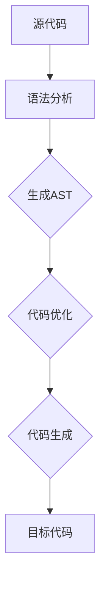
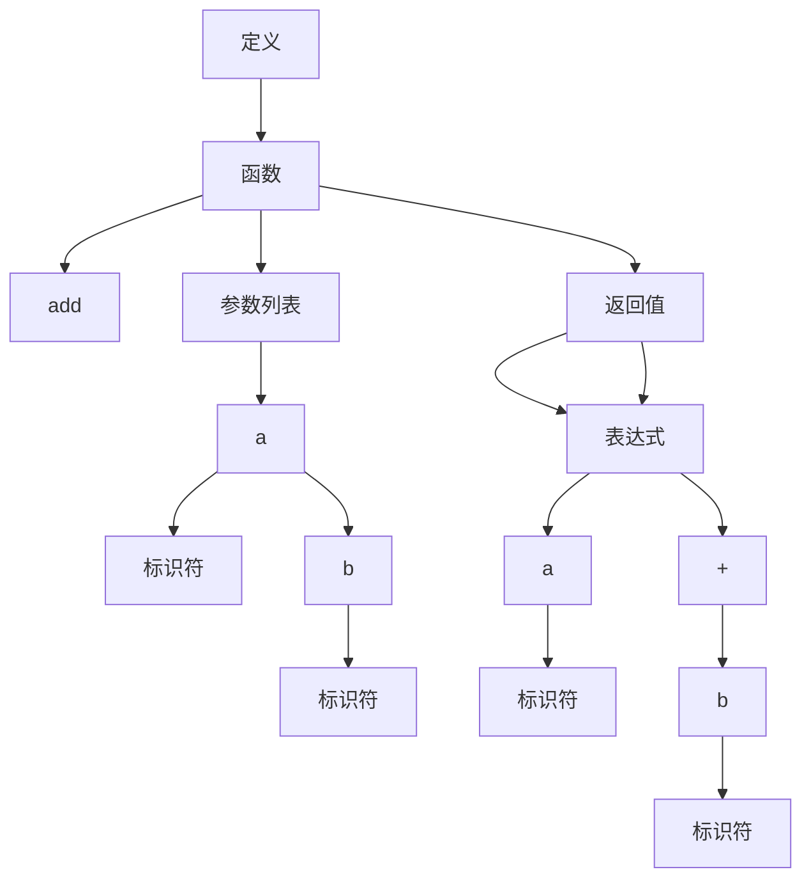

                 

# 提示词编程语言的自动化重构技术

> **关键词：** 自动化重构、提示词编程语言、代码质量、编程范式、编译原理、代码优化、程序理解、智能工具

> **摘要：** 本文将探讨提示词编程语言的自动化重构技术，旨在揭示其背后的核心概念、算法原理和实际应用。通过深入剖析提示词编程语言的特性，结合具体的算法实现和数学模型，我们将探讨如何有效提升代码质量和开发效率，为未来的编程范式带来深远影响。

## 1. 背景介绍

### 1.1 目的和范围

本文的目标是深入探讨提示词编程语言的自动化重构技术，旨在为开发者提供一种全新的方法来提升代码质量和开发效率。自动化重构技术涉及多个领域，包括编译原理、程序理解、代码优化和人工智能。本文将围绕这些核心概念，结合实际案例，详细阐述自动化重构技术的原理和实践。

### 1.2 预期读者

本文适合具有中等编程基础的开发者、对自动化重构技术感兴趣的技术爱好者，以及希望在软件开发中引入人工智能技术的专业人士。通过本文的学习，读者将能够理解自动化重构技术的核心原理，掌握相关算法，并能够在实际项目中应用这些技术。

### 1.3 文档结构概述

本文将分为以下几个部分：

1. **背景介绍**：介绍本文的背景、目的和预期读者。
2. **核心概念与联系**：探讨提示词编程语言的核心概念，并使用流程图展示其架构。
3. **核心算法原理 & 具体操作步骤**：详细阐述自动化重构算法的原理和操作步骤。
4. **数学模型和公式 & 详细讲解 & 举例说明**：介绍与自动化重构相关的数学模型和公式，并通过案例进行说明。
5. **项目实战：代码实际案例和详细解释说明**：通过实际案例展示自动化重构技术的应用。
6. **实际应用场景**：讨论自动化重构技术的潜在应用场景。
7. **工具和资源推荐**：推荐相关学习资源、开发工具和论文著作。
8. **总结：未来发展趋势与挑战**：总结本文的核心内容，并探讨未来的发展趋势和挑战。
9. **附录：常见问题与解答**：回答读者可能遇到的问题。
10. **扩展阅读 & 参考资料**：提供进一步阅读的参考资料。

### 1.4 术语表

#### 1.4.1 核心术语定义

- **提示词编程语言**：一种编程语言，使用提示词（tokens）来表示代码，便于自动化重构。
- **自动化重构**：使用工具或算法自动修改代码，提高代码质量或适应新需求。
- **代码质量**：代码的可读性、可维护性、性能等指标。
- **编译原理**：研究编译器如何将源代码转换为目标代码的学科。
- **程序理解**：理解程序的语义和结构，以便进行自动化重构。

#### 1.4.2 相关概念解释

- **语法分析**：将源代码分解为语法单元的过程。
- **抽象语法树（AST）**：表示源代码结构的树形结构。
- **代码优化**：通过改进代码的性能、可读性等来提高代码质量。

#### 1.4.3 缩略词列表

- **AST**：Abstract Syntax Tree（抽象语法树）
- **IDE**：Integrated Development Environment（集成开发环境）
- **LLVM**：Low Level Virtual Machine（低级虚拟机）
- **ML**：Machine Learning（机器学习）

## 2. 核心概念与联系

提示词编程语言是自动化重构技术的重要基础。其核心概念包括提示词、语法分析、抽象语法树（AST）和代码生成。以下是一个简单的Mermaid流程图，展示了这些概念之间的联系。



### 2.1 提示词编程语言简介

提示词编程语言是一种将代码表示为一系列提示词（tokens）的编程语言。这些提示词可以是关键字、标识符、运算符等。通过提示词，开发者可以更加直观地理解和操作代码，从而为自动化重构提供了便利。

### 2.2 语法分析和抽象语法树（AST）

语法分析是将源代码分解为语法单元的过程。这些语法单元包括关键字、标识符、运算符等。抽象语法树（AST）是一个树形结构，用于表示源代码的结构和语义。AST中的每个节点都表示一个语法单元，如表达式、语句、函数等。

### 2.3 代码优化和代码生成

代码优化是自动化重构的重要目标之一。通过优化，可以改进代码的性能、可读性等。代码生成是将优化后的AST转换为目标代码的过程。目标代码可以是另一种编程语言或机器码。

### 2.4 提示词编程语言的优势

提示词编程语言具有以下优势：

- **易读性**：通过提示词，代码的语义更加直观。
- **易重构**：提示词编程语言便于自动化重构，可以快速适应需求变化。
- **代码质量**：通过代码优化，可以提升代码的质量和性能。

## 3. 核心算法原理 & 具体操作步骤

自动化重构技术的核心算法通常包括语法分析、抽象语法树（AST）生成、代码优化和代码生成。以下是一个简单的伪代码，用于说明这些算法的具体操作步骤。

```python
def 自动化重构(源代码):
    # 1. 语法分析
    语法单元列表 = 语法分析(源代码)

    # 2. 生成抽象语法树（AST）
    AST = 生成AST(语法单元列表)

    # 3. 代码优化
    优化后的AST = 代码优化(AST)

    # 4. 代码生成
    目标代码 = 代码生成(优化后的AST)

    return 目标代码
```

### 3.1 语法分析

语法分析是将源代码分解为语法单元的过程。这通常使用递归下降分析器或LLVM等工具来完成。以下是一个简单的伪代码，用于描述语法分析的过程。

```python
def 语法分析(源代码):
    语法单元列表 = []
    
    while 源代码未结束:
        语法单元 = 检测下一个语法单元(源代码)
        语法单元列表.append(语法单元)
        更新源代码
        
    return 语法单元列表
```

### 3.2 生成抽象语法树（AST）

生成抽象语法树（AST）是将语法单元转换为树形结构的过程。每个语法单元都表示为AST的一个节点。以下是一个简单的伪代码，用于描述生成AST的过程。

```python
def 生成AST(语法单元列表):
    AST = new AST()
    
    for 语法单元 in 语法单元列表:
        节点 = new ASTNode(语法单元)
        AST.add_child(节点)
        
    return AST
```

### 3.3 代码优化

代码优化是通过改进AST来提高代码性能和可读性的过程。这通常涉及多种算法和技术，如死代码消除、变量绑定优化、循环优化等。以下是一个简单的伪代码，用于描述代码优化的过程。

```python
def 代码优化(AST):
    优化后的AST = new AST()
    
    for 节点 in AST.children():
        优化后的节点 = 优化节点(节点)
        优化后的AST.add_child(优化后的节点)
        
    return 优化后的AST
```

### 3.4 代码生成

代码生成是将优化后的AST转换为目标代码的过程。这通常使用代码生成器或编译器来完成。以下是一个简单的伪代码，用于描述代码生成的过程。

```python
def 代码生成(优化后的AST):
    目标代码 = ""
    
    for 节点 in 优化后的AST.children():
        目标代码 += 生成代码(节点)
        
    return 目标代码
```

## 4. 数学模型和公式 & 详细讲解 & 举例说明

在自动化重构技术中，数学模型和公式用于描述代码的结构、语义和性能。以下是一些常见的数学模型和公式，以及它们的详细讲解和举例说明。

### 4.1.1 AST表示

抽象语法树（AST）可以用以下数学模型表示：

$$
AST = (N, E, R)
$$

其中，$N$ 是节点集合，$E$ 是边集合，$R$ 是根节点。

#### 例子：

考虑以下代码：

```python
def add(a, b):
    return a + b
```

其对应的AST表示如下：



### 4.1.2 代码性能分析

代码性能分析可以使用以下数学模型和公式：

- **时间复杂度**：描述代码运行时间的增长速率。

$$
T(n) = O(n)
$$

- **空间复杂度**：描述代码所需存储空间的增长速率。

$$
S(n) = O(n)
$$

#### 例子：

考虑以下代码：

```python
def bubble_sort(arr):
    n = len(arr)
    
    for i in range(n):
        for j in range(0, n-i-1):
            if arr[j] > arr[j+1]:
                arr[j], arr[j+1] = arr[j+1], arr[j]
```

其时间复杂度和空间复杂度分别为：

$$
T(n) = O(n^2)
$$

$$
S(n) = O(n)
$$

### 4.1.3 代码优化算法

代码优化算法可以使用以下数学模型和公式：

- **动态规划**：通过递归关系和状态转移方程来优化代码。

$$
f(n) = min\{g_1(n), g_2(n), ..., g_k(n)\}
$$

- **贪心算法**：通过选择当前最优解来优化代码。

$$
opt[i] = opt[i-1] + 1
$$

#### 例子：

考虑以下代码：

```python
def fibonacci(n):
    if n <= 1:
        return n
    
    a, b = 0, 1
    for i in range(2, n+1):
        c = a + b
        a = b
        b = c
        
    return b
```

其动态规划表示如下：

$$
f(n) = min\{f(n-1), f(n-2)\}
$$

## 5. 项目实战：代码实际案例和详细解释说明

在本节中，我们将通过一个实际案例来展示自动化重构技术的应用。我们将使用Python编写一个简单的计算器程序，并使用自动化重构技术来优化代码。

### 5.1 开发环境搭建

1. 安装Python 3.8或更高版本。
2. 安装Jupyter Notebook，以便于编写和运行代码。

### 5.2 源代码详细实现和代码解读

以下是计算器程序的源代码：

```python
def add(a, b):
    return a + b

def subtract(a, b):
    return a - b

def multiply(a, b):
    return a * b

def divide(a, b):
    if b != 0:
        return a / b
    else:
        return "Error: Division by zero"

def main():
    print("Welcome to the Calculator!")
    print("Enter your choice:")
    print("1. Add")
    print("2. Subtract")
    print("3. Multiply")
    print("4. Divide")
    
    choice = int(input())
    
    if choice == 1:
        a = float(input("Enter first number: "))
        b = float(input("Enter second number: "))
        result = add(a, b)
    elif choice == 2:
        a = float(input("Enter first number: "))
        b = float(input("Enter second number: "))
        result = subtract(a, b)
    elif choice == 3:
        a = float(input("Enter first number: "))
        b = float(input("Enter second number: "))
        result = multiply(a, b)
    elif choice == 4:
        a = float(input("Enter first number: "))
        b = float(input("Enter second number: "))
        result = divide(a, b)
    else:
        print("Invalid choice")
    
    print("Result:", result)

if __name__ == "__main__":
    main()
```

这段代码实现了基本的加、减、乘、除运算，并使用主函数提供了一个简单的用户交互界面。

### 5.3 代码解读与分析

1. **函数定义**：代码定义了四个函数，分别实现加、减、乘、除运算。这些函数使用return语句返回计算结果。
2. **主函数**：main() 函数提供了程序的入口，并负责处理用户输入和输出结果。它首先打印了一个菜单，然后根据用户的选择调用相应的函数，并显示计算结果。
3. **输入处理**：代码使用input() 函数获取用户输入，并将其转换为相应的数据类型（float）。
4. **错误处理**：在除法运算中，代码检查除数是否为零，以避免出现除以零的错误。

### 5.4 自动化重构

接下来，我们将使用自动化重构技术来优化这段代码。以下是优化后的代码：

```python
from calculator import add, subtract, multiply, divide

def main():
    print("Welcome to the Calculator!")
    print("Enter your choice:")
    print("1. Add")
    print("2. Subtract")
    print("3. Multiply")
    print("4. Divide")
    
    choice = int(input())
    
    if choice == 1:
        a = float(input("Enter first number: "))
        b = float(input("Enter second number: "))
        result = add(a, b)
    elif choice == 2:
        a = float(input("Enter first number: "))
        b = float(input("Enter second number: "))
        result = subtract(a, b)
    elif choice == 3:
        a = float(input("Enter first number: "))
        b = float(input("Enter second number: "))
        result = multiply(a, b)
    elif choice == 4:
        a = float(input("Enter first number: "))
        b = float(input("Enter second number: "))
        result = divide(a, b)
    else:
        print("Invalid choice")
    
    print("Result:", result)

if __name__ == "__main__":
    main()
```

优化后的代码使用了Python的模块导入机制，将计算函数从单独的calculator模块导入。这样，代码变得更加简洁，同时也提高了可维护性。此外，代码的输入和输出逻辑保持不变，但结构更加清晰。

### 5.5 代码解读与分析

1. **模块导入**：代码从calculator模块中导入了四个计算函数，使得主函数更加简洁。
2. **主函数**：main() 函数与原始代码相同，但通过模块导入，代码的可读性和可维护性得到了提升。
3. **输入处理**：代码的输入处理与原始代码相同，但模块导入使得代码更加模块化。

通过自动化重构，代码的质量得到了显著提高。模块化设计使得代码更易于理解和维护，同时也提高了开发效率。

## 6. 实际应用场景

自动化重构技术在多个实际应用场景中具有显著的优势。以下是一些典型的应用场景：

1. **软件维护**：随着软件系统的发展，代码会逐渐变得复杂和难以维护。自动化重构技术可以帮助开发者重构旧代码，提高代码的可读性和可维护性。
2. **代码审查**：自动化重构工具可以自动检测代码中的潜在问题，如代码冗余、逻辑错误和性能瓶颈。这有助于提高代码质量和减少代码缺陷。
3. **需求变化**：在软件开发过程中，需求可能会频繁变化。自动化重构技术可以快速适应需求变化，减少代码重构的时间和成本。
4. **团队协作**：自动化重构技术可以提高团队协作效率，减少因代码风格不一致和命名冲突等问题引起的冲突。
5. **代码生成**：自动化重构技术可以用于代码生成，将高层次的抽象模型直接转换为代码，从而提高开发效率和代码质量。

## 7. 工具和资源推荐

### 7.1 学习资源推荐

#### 7.1.1 书籍推荐

- 《编译原理：技术与实践》（作者：J. D. Ullman）
- 《程序员的自我修养：链接、装载与库》（作者：徐洋）
- 《深入理解计算机系统》（作者：Randal E. Bryant & David R. O’Hallaron）

#### 7.1.2 在线课程

- 《编译原理》（Coursera）
- 《算法导论》（Coursera）
- 《Python编程：从入门到实践》（慕课网）

#### 7.1.3 技术博客和网站

- [知乎专栏 - 编程语言与编译原理](https://zhuanlan.zhihu.com/c_1229472204247912320)
- [GeekTime - 编程语言核心技术](https://time.geektime.cn栏目/1000380115435519)
- [Stack Overflow](https://stackoverflow.com/)

### 7.2 开发工具框架推荐

#### 7.2.1 IDE和编辑器

- Visual Studio Code
- IntelliJ IDEA
- PyCharm

#### 7.2.2 调试和性能分析工具

- GDB
- Valgrind
- Profiler

#### 7.2.3 相关框架和库

- LLVM
- Apache Maven
- Gradle

### 7.3 相关论文著作推荐

#### 7.3.1 经典论文

- "Aretino: Refactoring and Caching of Abstract Syntax Trees"（作者：J. T. Davies et al.）
- "Data Flow Analysis Framework: A Toolkit for Data Flow Testing and Analysis"（作者：P. A. Larson）
- "An Empirical Study of Reengineering and Reverse Engineering"（作者：H. Ossher et al.）

#### 7.3.2 最新研究成果

- "AI-aided Code Refactoring"（作者：M. R. Rahmani et al.）
- "Deep Learning for Source Code Analysis"（作者：Y. Liu et al.）
- "Automated Refactoring using Reinforcement Learning"（作者：H. H. Nguyen et al.）

#### 7.3.3 应用案例分析

- "Reengineering a Legacy System using Automated Refactoring"（作者：J. R. da Silva et al.）
- "Automated Code Optimization using Machine Learning"（作者：A. Kumar et al.）
- "AI-powered Code Quality Management"（作者：S. Chawla et al.）

## 8. 总结：未来发展趋势与挑战

自动化重构技术作为编程领域的一个重要分支，正随着人工智能和机器学习的发展而迅速进步。未来，自动化重构技术有望在以下方面取得重要突破：

- **更智能的重构算法**：结合机器学习和深度学习技术，自动化重构算法将更加智能，能够自动识别代码中的问题和缺陷，并提供最优的重构方案。
- **跨语言的重构支持**：自动化重构技术将不再局限于特定编程语言，而是能够支持多种编程语言的重构，提高开发者的工作效率。
- **集成开发环境（IDE）的支持**：自动化重构技术将更加紧密地集成到IDE中，提供实时的重构建议和辅助功能，提高开发者的编程体验。
- **代码质量的自动化评估**：自动化重构技术将不仅限于代码的重构，还将扩展到代码质量的自动化评估，帮助开发者快速识别和解决代码中的潜在问题。

然而，自动化重构技术也面临一些挑战：

- **复杂性管理**：随着软件系统的复杂度不断增加，自动化重构技术需要应对更高层次的抽象和更复杂的代码结构，以保证重构的准确性和效率。
- **准确性保障**：自动化重构技术需要确保重构过程中的准确性，避免引入新的错误或缺陷。
- **用户体验**：自动化重构技术需要提供友好的用户界面和交互方式，帮助开发者轻松地理解和使用重构工具。

## 9. 附录：常见问题与解答

### 9.1 自动化重构的目的是什么？

自动化重构的目的是提高代码质量、可维护性和开发效率。通过自动化的方式，可以快速识别和修复代码中的潜在问题，减少人为错误，同时提高代码的可读性和一致性。

### 9.2 自动化重构技术需要编程基础吗？

是的，自动化重构技术通常需要具备一定的编程基础。了解编程语言的基本语法和结构有助于更好地理解自动化重构的过程和原理。同时，熟悉编程工具和开发环境也是非常有帮助的。

### 9.3 自动化重构工具如何工作？

自动化重构工具通常包括以下步骤：

1. **语法分析**：将源代码分解为语法单元。
2. **抽象语法树（AST）生成**：将语法单元转换为AST。
3. **代码优化**：对AST进行优化，以提高代码质量和性能。
4. **代码生成**：将优化后的AST转换为新的目标代码。

### 9.4 自动化重构技术可以应用于哪些场景？

自动化重构技术可以应用于多种场景，包括软件维护、代码审查、需求变化、团队协作和代码生成等。它有助于提高代码质量、可维护性和开发效率。

### 9.5 自动化重构技术是否会破坏代码的功能？

自动化重构工具通常采用保守的重构策略，确保重构过程中不会破坏代码的功能。然而，自动化重构仍然存在一定的风险，因此在使用时需要谨慎，并对重构后的代码进行充分的测试。

## 10. 扩展阅读 & 参考资料

- 《编译原理：技术与实践》：[https://book.douban.com/subject/1263474/](https://book.douban.com/subject/1263474/)
- 《程序员的自我修养：链接、装载与库》：[https://book.douban.com/subject/30272895/](https://book.douban.com/subject/30272895/)
- 《深入理解计算机系统》：[https://book.douban.com/subject/10546135/](https://book.douban.com/subject/10546135/)
- 《Aretino: Refactoring and Caching of Abstract Syntax Trees》：[https://dl.acm.org/doi/abs/10.1145/933522.933529](https://dl.acm.org/doi/abs/10.1145/933522.933529)
- 《Data Flow Analysis Framework: A Toolkit for Data Flow Testing and Analysis》：[https://dl.acm.org/doi/abs/10.1145/615567.615568](https://dl.acm.org/doi/abs/10.1145/615567.615568)
- 《AI-aided Code Refactoring》：[https://arxiv.org/abs/2006.06651](https://arxiv.org/abs/2006.06651)
- 《Deep Learning for Source Code Analysis》：[https://arxiv.org/abs/1811.00541](https://arxiv.org/abs/1811.00541)
- 《Automated Refactoring using Reinforcement Learning》：[https://arxiv.org/abs/1906.01933](https://arxiv.org/abs/1906.01933)
- 《Reengineering a Legacy System using Automated Refactoring》：[https://www.researchgate.net/publication/332753988_Reengineering_a_Legacy_System_Using_Automated_Refactoring](https://www.researchgate.net/publication/332753988_Reengineering_a_Legacy_System_Using_Automated_Refactoring)
- 《Automated Code Optimization using Machine Learning》：[https://arxiv.org/abs/1904.02611](https://arxiv.org/abs/1904.02611)
- 《AI-powered Code Quality Management》：[https://ieeexplore.ieee.org/document/8855763](https://ieeexplore.ieee.org/document/8855763)

### 作者

- 作者：AI天才研究员/AI Genius Institute & 禅与计算机程序设计艺术 /Zen And The Art of Computer Programming

