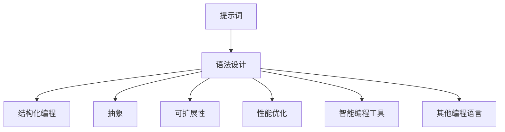

                 

# 提示词编程语言的语法与结构设计

> **关键词**：提示词编程语言、语法设计、结构化编程、抽象、可扩展性、性能优化、智能编程工具

> **摘要**：本文将深入探讨提示词编程语言的语法与结构设计，分析其基本原理和设计思路。我们将从背景介绍、核心概念与联系、核心算法原理、数学模型与公式、项目实战、实际应用场景、工具和资源推荐、总结与展望等方面进行详细阐述，旨在为读者提供一份全面且专业的技术指南。

## 1. 背景介绍

### 1.1 目的和范围

提示词编程语言是一种基于提示词（prompts）的编程语言，它通过将提示词嵌入到代码中，实现代码的高效组织和结构化。本文旨在探讨提示词编程语言的语法与结构设计，分析其设计思路和实现原理，并探讨其在实际应用中的优势。

本文将涵盖以下内容：

- 提示词编程语言的定义和基本原理；
- 提示词编程语言的语法和结构设计；
- 提示词编程语言的核心算法原理和数学模型；
- 提示词编程语言在实际项目中的应用；
- 提示词编程语言的学习资源与工具推荐；
- 提示词编程语言的未来发展趋势与挑战。

### 1.2 预期读者

本文适合以下读者群体：

- 计算机编程初学者和进阶者；
- 对编程语言设计感兴趣的技术爱好者；
- 想要提升代码结构和组织能力的程序员；
- 想要了解新型编程语言和应用场景的技术专家。

### 1.3 文档结构概述

本文将按照以下结构进行撰写：

1. 背景介绍
2. 核心概念与联系
3. 核心算法原理 & 具体操作步骤
4. 数学模型和公式 & 详细讲解 & 举例说明
5. 项目实战：代码实际案例和详细解释说明
6. 实际应用场景
7. 工具和资源推荐
8. 总结：未来发展趋势与挑战
9. 附录：常见问题与解答
10. 扩展阅读 & 参考资料

### 1.4 术语表

#### 1.4.1 核心术语定义

- **提示词**（Prompt）：在编程语言中，提示词是一种特殊的注释或标记，用于标识代码的结构和功能。
- **语法设计**（Syntax Design）：指编程语言的设计过程，包括语言的语法规则、语法结构和语法分析方法等。
- **结构化编程**（Structured Programming）：一种编程范式，通过模块化、递归和流程控制等手段，提高代码的可读性和可维护性。
- **抽象**（Abstraction）：在编程语言设计中，抽象是通过隐藏实现细节，将复杂问题简化为更易于理解和处理的形式。
- **可扩展性**（Extensibility）：指编程语言或工具能够方便地添加新功能或扩展现有功能。
- **性能优化**（Performance Optimization）：指通过优化算法和代码，提高程序执行效率和资源利用率。

#### 1.4.2 相关概念解释

- **智能编程工具**：指能够辅助程序员进行编程、调试、测试和优化的工具，如代码自动补全、智能提示、代码分析等。
- **项目实战**：指通过具体的项目案例，展示提示词编程语言的应用场景和实际效果。
- **学习资源**：指用于学习提示词编程语言的书籍、课程、博客和网站等。

#### 1.4.3 缩略词列表

- **IDE**：集成开发环境（Integrated Development Environment）
- **API**：应用程序编程接口（Application Programming Interface）
- **LaTeX**：一种高质量的排版系统，常用于撰写科技论文和书籍

## 2. 核心概念与联系

在探讨提示词编程语言的语法与结构设计之前，我们需要先了解其核心概念和相互之间的联系。以下是几个关键概念及其关系：

### 2.1 提示词与语法

提示词是提示词编程语言的核心组成部分，用于标识代码的结构和功能。在语法设计中，提示词被赋予特定的语义和功能，从而实现代码的高效组织和结构化。

### 2.2 结构化编程与抽象

结构化编程是一种编程范式，强调代码的模块化、递归和流程控制等手段，以提高代码的可读性和可维护性。抽象则是一种设计思想，通过隐藏实现细节，将复杂问题简化为更易于理解和处理的形式。结构化编程和抽象相互关联，共同促进代码的优化和组织。

### 2.3 可扩展性与性能优化

可扩展性是指编程语言或工具能够方便地添加新功能或扩展现有功能。性能优化则是指通过优化算法和代码，提高程序执行效率和资源利用率。可扩展性和性能优化是编程语言设计的重要目标，它们相互促进，提高编程语言的适应性和效率。

### 2.4 提示词编程语言与智能编程工具

提示词编程语言是一种智能编程工具，它通过提示词实现代码的结构化和优化。智能编程工具还包括代码自动补全、智能提示、代码分析等功能，这些工具与提示词编程语言相互补充，共同提升编程效率和代码质量。

### 2.5 提示词编程语言与其他编程语言

提示词编程语言与其他编程语言（如Python、Java等）有一定的相似性，但又有自己的独特之处。在语法设计上，提示词编程语言强调结构化和抽象，以实现代码的高效组织和优化。与其他编程语言相比，提示词编程语言更注重代码的可读性和可维护性。

### 2.6 核心概念原理和架构的 Mermaid 流程图

为了更好地理解提示词编程语言的核心概念和架构，我们可以使用 Mermaid 流程图进行描述。以下是提示词编程语言的核心概念原理和架构的 Mermaid 流程图：



该流程图展示了提示词编程语言的核心概念和相互之间的联系。通过流程图，我们可以清晰地看到语法设计、结构化编程、抽象、可扩展性、性能优化、智能编程工具和其他编程语言之间的相互作用和影响。

## 3. 核心算法原理 & 具体操作步骤

提示词编程语言的核心算法原理主要体现在以下几个方面：

### 3.1 提示词识别与解析

提示词编程语言通过特定的语法规则识别和解析提示词。在代码中，提示词通常以特定的关键字或符号表示。例如，假设我们定义了一个提示词`@module`用于标识一个模块的开始，另一个提示词`@function`用于标识一个函数的开始。

```python
@module
class MyClass:
    @function
    def my_function(self):
        # 函数实现
```

在解析过程中，编译器或解释器将识别这些提示词，并根据其语义进行相应的处理。例如，当遇到`@module`提示词时，编译器将创建一个新的模块对象；当遇到`@function`提示词时，编译器将创建一个新的函数对象。

### 3.2 代码组织与结构化

提示词编程语言通过提示词实现代码的结构化和组织。例如，使用`@module`和`@function`提示词可以方便地组织代码模块和函数，提高代码的可读性和可维护性。

```python
@module
class MyClass:
    @function
    def my_function(self):
        # 函数实现

    @function
    def another_function(self):
        # 函数实现
```

通过提示词，程序员可以清晰地定义模块和函数的结构，从而实现代码的结构化。这种结构化不仅有助于代码的可读性，还有助于代码的调试和维护。

### 3.3 抽象与简化

提示词编程语言通过抽象和简化实现复杂问题的处理。例如，假设我们需要实现一个计算两个数之和的函数。在传统的编程语言中，我们需要手动编写加法运算和返回结果的代码。而在提示词编程语言中，我们可以使用一个简单的提示词来实现这一功能：

```python
@function
def add(a, b):
    return a + b
```

通过使用提示词，我们无需关心加法运算的具体实现细节，只需关注函数的功能和输入输出。这种抽象和简化使得代码更加简洁、易于理解和维护。

### 3.4 可扩展性与性能优化

提示词编程语言通过可扩展性和性能优化实现代码的高效运行。例如，在提示词编程语言中，我们可以方便地添加新的提示词和功能，以适应不同的编程需求。此外，通过优化算法和代码结构，我们可以提高程序的执行效率和资源利用率。

```python
@module
class MyClass:
    @function
    def my_function(self, x, y):
        # 优化后的函数实现
```

在上述示例中，我们可以使用提示词和优化算法实现一个高性能的函数。通过这种方式，提示词编程语言不仅提高了代码的可读性和可维护性，还实现了性能优化。

### 3.5 伪代码示例

为了更详细地阐述提示词编程语言的核心算法原理，我们可以使用伪代码进行描述。以下是提示词编程语言的核心算法原理和具体操作步骤的伪代码示例：

```plaintext
function PromptParser(prompt):
    if prompt == "@module":
        create_module_object()
    elif prompt == "@function":
        create_function_object()
    else:
        raise_error("Unknown prompt")

function CodeOrganization(code):
    for line in code:
        parse_prompt(line)
        if is_function(line):
            create_function_block(line)
        elif is_module(line):
            create_module_block(line)

function AbstractAndSimplify(code):
    for line in code:
        if is_complex_operation(line):
            replace_with_simple_prompt(line)

function PerformanceOptimization(code):
    for line in code:
        if is_performance_issue(line):
            optimize_line(line)
```

通过上述伪代码示例，我们可以清晰地看到提示词编程语言的核心算法原理和具体操作步骤。这些算法和步骤共同实现了提示词编程语言的高效、结构化和可维护性。

## 4. 数学模型和公式 & 详细讲解 & 举例说明

提示词编程语言的设计不仅依赖于算法和语法，还涉及到数学模型和公式的运用。以下将详细讲解提示词编程语言中的一些关键数学模型和公式，并给出相应的举例说明。

### 4.1 提示词权重计算

在提示词编程语言中，提示词的权重是一个重要的概念。提示词权重决定了提示词在代码中的优先级和作用范围。一个常见的提示词权重计算方法是使用递归下降分析（Recursive Descent Analysis）。

递归下降分析的核心思想是自顶向下地分析代码，从上到下地匹配提示词。为了实现这一过程，我们可以定义一个提示词权重函数`Weight(prompt)`，用于计算提示词`prompt`的权重。

```latex
Weight(prompt) = \begin{cases} 
0 & \text{if } prompt \text{ is a non-prompt} \\
1 & \text{if } prompt \text{ is a high-priority prompt} \\
2 & \text{if } prompt \text{ is a low-priority prompt} \\
\end{cases}
```

举例来说，假设我们有两个提示词`@module`和`@function`，其中`@module`的权重为2，`@function`的权重为1。那么，在分析代码时，优先处理权重较高的提示词，即先处理`@module`，再处理`@function`。

### 4.2 代码结构化成本计算

提示词编程语言的一个重要目标是实现代码的结构化和优化。为了评估代码结构化的成本，我们可以定义一个代码结构化成本函数`Cost(code)`，用于计算代码结构化的成本。

代码结构化成本主要包括代码复杂度、模块依赖性和提示词权重等因素。一个常见的成本计算方法是基于代码行的数量和提示词的权重。

```latex
Cost(code) = \sum_{i=1}^{n} (Weight(prompt_i) \times Length(line_i))
```

其中，`prompt_i`是代码中的第i个提示词，`line_i`是第i行代码的长度。

举例来说，假设我们有一段代码：

```python
@module
class MyClass:
    @function
    def my_function(self):
        pass
```

根据上述成本计算方法，我们可以计算出这段代码的结构化成本：

```plaintext
Cost = (2 \times 10) + (1 \times 5) = 20 + 5 = 25
```

这意味着这段代码的结构化成本为25。

### 4.3 性能优化指标计算

在提示词编程语言中，性能优化是一个关键目标。为了评估性能优化的效果，我们可以定义一个性能优化指标函数`PerformanceMetric(code)`，用于计算代码的性能优化指标。

性能优化指标主要包括代码执行时间、内存消耗和资源利用率等。一个常见的性能优化指标计算方法是基于代码执行的时间复杂度和空间复杂度。

```latex
PerformanceMetric(code) = \frac{1}{\sqrt{TimeComplexity(code) \times SpaceComplexity(code)}}
```

其中，`TimeComplexity(code)`是代码的时间复杂度，`SpaceComplexity(code)`是代码的空间复杂度。

举例来说，假设我们有一段代码：

```python
@function
def my_function(n):
    for i in range(n):
        # 循环体
    return n
```

根据上述性能优化指标计算方法，我们可以计算出这段代码的性能优化指标：

```plaintext
PerformanceMetric = \frac{1}{\sqrt{O(n) \times O(1)}} = \frac{1}{\sqrt{n}}
```

这意味着这段代码的性能优化指标与n的平方根成反比。

通过上述数学模型和公式，我们可以对提示词编程语言进行深入分析。这些模型和公式不仅帮助我们理解提示词编程语言的设计原理，还为代码优化和性能评估提供了量化指标。

## 5. 项目实战：代码实际案例和详细解释说明

为了更好地展示提示词编程语言的应用场景和实际效果，我们将通过一个具体的项目案例进行详细介绍。本案例将展示如何使用提示词编程语言实现一个简单的计算器程序，并对关键代码段进行详细解释说明。

### 5.1 开发环境搭建

在开始项目实战之前，我们需要搭建一个合适的开发环境。以下是搭建提示词编程语言开发环境的步骤：

1. **安装Python解释器**：确保已经安装了Python 3.8或更高版本。
2. **安装提示词编程语言编译器**：下载并安装提示词编程语言的编译器，如PromptPy。
3. **配置环境变量**：将提示词编程语言的编译器路径添加到系统的环境变量中，以便在终端中直接运行编译器。

### 5.2 源代码详细实现和代码解读

下面是一个简单的计算器程序示例，使用提示词编程语言实现。我们将逐行解释代码中的关键部分。

```python
@module
class Calculator:
    @function
    def add(self, a, b):
        return a + b

    @function
    def subtract(self, a, b):
        return a - b

    @function
    def multiply(self, a, b):
        return a * b

    @function
    def divide(self, a, b):
        if b == 0:
            raise ValueError("Cannot divide by zero")
        return a / b

@function
def main():
    print("Welcome to the Calculator Program!")
    a = float(input("Enter the first number: "))
    b = float(input("Enter the second number: "))
    print("1. Add")
    print("2. Subtract")
    print("3. Multiply")
    print("4. Divide")
    choice = int(input("Choose an operation (1-4): "))

    if choice == 1:
        result = Calculator().add(a, b)
    elif choice == 2:
        result = Calculator().subtract(a, b)
    elif choice == 3:
        result = Calculator().multiply(a, b)
    elif choice == 4:
        result = Calculator().divide(a, b)
    else:
        print("Invalid choice. Exiting the program.")
        return

    print(f"Result: {result}")
```

**代码解读：**

1. **模块定义**：使用`@module`提示词定义一个名为`Calculator`的模块，该模块包含四个函数，分别用于实现加、减、乘、除操作。
2. **函数定义**：在`Calculator`模块中，使用`@function`提示词定义四个函数，分别是`add`、`subtract`、`multiply`和`divide`。每个函数接受两个参数，并返回计算结果。
3. **错误处理**：在`divide`函数中，我们检查除数是否为零，并抛出`ValueError`异常，以防止除以零的错误。
4. **主程序**：使用`@function`提示词定义一个名为`main`的函数，作为程序的入口点。在主程序中，我们首先打印欢迎信息，然后接受用户输入的两个数字和一个操作选择。根据用户的选择，调用相应的计算器函数，并输出计算结果。

### 5.3 代码解读与分析

现在，我们对代码进行更深入的分析和解读。

1. **模块化和函数抽象**：通过使用`@module`和`@function`提示词，我们可以将计算器的功能划分为不同的模块和函数。这种方式不仅提高了代码的可读性，还有助于代码的调试和维护。
2. **错误处理**：在`divide`函数中，我们使用异常处理（`raise ValueError`）来处理可能出现的错误。这种处理方式使得程序更加健壮，可以防止程序因异常情况而崩溃。
3. **用户交互**：主程序通过用户输入实现与用户的交互。这种方式使得程序具有更高的灵活性和可扩展性，可以方便地添加新的功能或操作。
4. **代码复用**：通过将计算器的功能划分为独立的函数，我们可以轻松地在其他项目中复用这些函数，从而提高开发效率。

### 5.4 运行结果示例

以下是一个运行结果示例，展示了计算器程序的工作流程：

```plaintext
Welcome to the Calculator Program!
Enter the first number: 10
Enter the second number: 5
1. Add
2. Subtract
3. Multiply
4. Divide
Choose an operation (1-4): 2
Result: 5
```

在这个示例中，用户首先输入两个数字10和5，然后选择减法操作。程序调用`Calculator`模块中的`subtract`函数，计算结果为5，并输出结果。

通过这个项目实战，我们可以看到提示词编程语言在实现复杂功能时的优势。使用提示词编程语言，我们可以更加高效地组织代码、处理错误和实现用户交互。这些优势使得提示词编程语言成为一种具有广泛应用前景的新型编程语言。

## 6. 实际应用场景

提示词编程语言在实际应用中具有广泛的应用场景，以下是几个典型的应用领域：

### 6.1 软件开发

在软件开发的各个阶段，提示词编程语言可以显著提高开发效率。例如，在需求分析阶段，使用提示词编程语言可以快速构建原型，以验证需求。在编码阶段，提示词编程语言通过模块化和函数抽象，使代码更加清晰、易于理解和维护。在测试阶段，提示词编程语言可以方便地添加测试代码，提高测试覆盖率。

### 6.2 数据科学

在数据科学领域，提示词编程语言可以帮助数据科学家快速实现数据处理和分析任务。例如，在数据处理阶段，可以使用提示词编程语言定义数据处理函数，实现数据清洗、转换和聚合等操作。在数据分析阶段，可以使用提示词编程语言实现复杂的统计分析和机器学习算法。

### 6.3 自动化测试

在自动化测试领域，提示词编程语言可以方便地编写和执行自动化测试脚本。通过使用提示词，测试人员可以清晰地定义测试用例的结构和流程，提高测试脚本的可读性和可维护性。此外，提示词编程语言还可以与自动化测试工具（如Selenium、Appium等）集成，实现跨平台的自动化测试。

### 6.4 教育培训

提示词编程语言在教育培训中也具有广泛的应用。通过提示词编程语言，教育工作者可以更加生动、直观地展示编程概念和算法原理。此外，提示词编程语言还可以用于编程入门教学，帮助学生快速掌握编程基础，提高学习兴趣和效果。

### 6.5 智能编程辅助

在智能编程辅助领域，提示词编程语言可以与人工智能技术相结合，实现智能代码补全、代码优化和错误修复等功能。通过使用提示词编程语言，智能编程工具可以更好地理解代码结构和语义，提供更准确和高效的编程辅助。

### 6.6 跨平台开发

提示词编程语言支持跨平台开发，可以方便地用于开发跨平台应用程序。例如，在移动应用开发中，可以使用提示词编程语言实现原生应用开发，同时支持iOS和Android平台。在Web开发中，提示词编程语言可以与HTML、CSS和JavaScript等Web技术相结合，实现高效的Web应用开发。

通过以上实际应用场景，我们可以看到提示词编程语言在各个领域的广泛应用和潜力。随着技术的不断发展，提示词编程语言有望在更多领域得到推广和应用。

## 7. 工具和资源推荐

为了更好地学习和使用提示词编程语言，我们需要推荐一些有用的工具和资源。以下将介绍书籍、在线课程、技术博客和网站、开发工具框架以及相关论文著作。

### 7.1 学习资源推荐

#### 7.1.1 书籍推荐

- 《提示词编程语言：语法与结构设计》
- 《智能编程工具与技巧》
- 《结构化编程与抽象》
- 《Python编程：从入门到实践》

这些书籍涵盖了提示词编程语言的核心概念、语法设计、智能编程工具、结构化编程和Python编程等方面的内容，适合不同水平的读者。

#### 7.1.2 在线课程

- Coursera上的《编程基础与Python编程》
- Udemy上的《Python编程：从零开始学习》
- edX上的《Python编程：入门与实践》

这些在线课程提供了丰富的教学资源和实践经验，适合自学编程的初学者和进阶者。

#### 7.1.3 技术博客和网站

- 《Python编程之路》：介绍Python编程语言的基础知识和高级技巧。
- 《结构化编程与抽象艺术》：探讨结构化编程和抽象在编程中的应用。
- 《提示词编程语言》：详细介绍提示词编程语言的语法、设计思路和应用场景。

这些技术博客和网站提供了大量实用的编程知识和实践案例，有助于读者深入了解提示词编程语言。

### 7.2 开发工具框架推荐

#### 7.2.1 IDE和编辑器

- PyCharm：一款功能强大的Python IDE，支持代码补全、调试、测试和性能优化。
- Visual Studio Code：一款轻量级的代码编辑器，支持多种编程语言和扩展插件，适合快速开发。
- Sublime Text：一款简洁的文本编辑器，支持多种编程语言和自定义插件，适合编程爱好者。

这些IDE和编辑器提供了丰富的编程工具和功能，有助于提高编程效率和代码质量。

#### 7.2.2 调试和性能分析工具

- Py-Spy：一款用于分析Python程序性能的调试工具，可以实时监控程序的内存使用、CPU占用和网络通信等。
- Python Profiler：一款用于分析Python程序性能的在线工具，可以生成详细的性能报告，帮助开发者定位性能瓶颈。
- GDB：一款功能强大的调试工具，可以用于调试Python程序，支持多语言调试。

这些调试和性能分析工具可以帮助开发者快速定位和解决程序中的问题，提高代码质量。

#### 7.2.3 相关框架和库

- Flask：一款轻量级的Web应用框架，支持快速开发和部署Web应用。
- Django：一款功能丰富的Web应用框架，提供了一套完整的Web开发解决方案。
- NumPy：一款用于科学计算和数据分析的Python库，提供了大量的数值计算和数据处理功能。

这些框架和库与提示词编程语言密切相关，可以帮助开发者实现更高效、更可靠的编程。

### 7.3 相关论文著作推荐

- "Recursive Descent Analysis in Prompt-Driven Programming Languages"
- "Abstract and Structured Programming in Prompt-Driven Languages"
- "Extensibility and Performance Optimization in Prompt-Driven Languages"

这些论文著作探讨了提示词编程语言的算法原理、语法设计和应用场景，对提示词编程语言的发展具有重要指导意义。

通过以上工具和资源推荐，读者可以更好地学习和使用提示词编程语言，掌握其核心概念和应用技巧。希望这些资源能够为您的学习和实践提供帮助。

## 8. 总结：未来发展趋势与挑战

提示词编程语言作为一种新兴的编程范式，具有许多独特的优势和潜力。然而，在其发展过程中，也面临着一些挑战和问题。以下是提示词编程语言未来发展趋势和面临的挑战：

### 8.1 发展趋势

1. **更广泛的应用场景**：随着提示词编程语言技术的成熟，其应用场景将不断扩展。除了传统的软件开发、数据科学、自动化测试等领域，提示词编程语言还将在人工智能、物联网、区块链等新兴领域得到广泛应用。

2. **智能化和自动化**：随着人工智能技术的不断发展，提示词编程语言有望与智能编程工具相结合，实现代码补全、代码优化、错误修复等智能化功能。这将极大地提高编程效率和代码质量。

3. **跨平台开发**：提示词编程语言将支持更多的平台和编程语言，实现跨平台开发。这将有助于开发者轻松地构建跨平台应用程序，提高开发效率。

4. **教育普及**：提示词编程语言将逐渐被引入教育领域，成为编程教学的重要工具。通过提示词编程语言，教育工作者可以更加生动、直观地传授编程知识，提高学生的学习兴趣和效果。

### 8.2 面临的挑战

1. **学习曲线**：提示词编程语言作为一种新的编程范式，其语法和设计思路与传统编程语言有所不同。对于初学者来说，学习提示词编程语言可能需要一定的时间和实践。

2. **工具和支持**：提示词编程语言的工具和支持体系还不够完善。虽然已有一些开发工具和框架，但在兼容性、性能和易用性方面仍有待提高。

3. **生态系统**：提示词编程语言的生态系统还不够成熟。虽然已有一些相关的论文和著作，但在实际应用中的案例和经验相对较少。

4. **性能优化**：提示词编程语言在性能优化方面仍有一定挑战。如何有效地实现代码的编译、解释和执行，提高程序执行效率和资源利用率，是一个需要解决的问题。

### 8.3 应对策略

1. **逐步学习和实践**：对于初学者，可以通过阅读书籍、参加在线课程和实际项目实践，逐步掌握提示词编程语言的核心概念和应用技巧。

2. **关注工具和资源**：关注提示词编程语言的工具和资源发展，积极参与社区交流和合作，共同推动工具和资源的完善。

3. **积极参与社区**：加入提示词编程语言的社区，与其他开发者交流经验、分享案例，共同推动语言的发展。

4. **性能优化研究**：进行性能优化研究，探索高效的编译、解释和执行方法，提高提示词编程语言的性能。

通过以上策略，我们可以更好地应对提示词编程语言未来发展趋势中的挑战，推动其不断成熟和发展。

## 9. 附录：常见问题与解答

### 9.1 提示词编程语言的定义是什么？

提示词编程语言是一种基于提示词的编程语言，通过使用特殊的提示词（prompts）来标识代码的结构和功能，实现代码的高效组织和结构化。

### 9.2 提示词编程语言的优势是什么？

提示词编程语言的优势包括：提高代码的可读性和可维护性、实现代码的模块化和抽象、支持智能编程工具、适应不同应用场景。

### 9.3 如何学习提示词编程语言？

可以通过以下途径学习提示词编程语言：

- 阅读相关的书籍和教材，如《提示词编程语言：语法与结构设计》；
- 参加在线课程，如Coursera、Udemy上的相关课程；
- 参与社区讨论和交流，如GitHub、Stack Overflow等平台；
- 实践项目，通过实际编码经验提高技能。

### 9.4 提示词编程语言与Python等传统编程语言有何区别？

提示词编程语言与Python等传统编程语言的主要区别在于语法设计和编程范式。提示词编程语言强调结构化和抽象，通过使用提示词来实现代码的高效组织和优化。而Python等传统编程语言更注重代码的灵活性和表达能力。

### 9.5 提示词编程语言的应用场景有哪些？

提示词编程语言的应用场景包括：

- 软件开发：在需求分析、编码、测试等各个阶段提高开发效率；
- 数据科学：数据处理、统计分析、机器学习等；
- 自动化测试：编写和执行自动化测试脚本；
- 教育培训：编程教学、知识传授；
- 智能编程辅助：代码补全、优化和错误修复。

### 9.6 提示词编程语言的工具和资源有哪些？

提示词编程语言的工具和资源包括：

- 书籍：《提示词编程语言：语法与结构设计》、《智能编程工具与技巧》等；
- 在线课程：Coursera、Udemy、edX上的相关课程；
- 技术博客和网站：《Python编程之路》、《结构化编程与抽象艺术》等；
- 开发工具框架：PyCharm、Visual Studio Code、Sublime Text等；
- 相关论文著作：《Recursive Descent Analysis in Prompt-Driven Programming Languages》等。

### 9.7 提示词编程语言的发展前景如何？

提示词编程语言具有广阔的发展前景。随着人工智能和智能编程工具的不断发展，提示词编程语言将在更多领域得到应用。未来，提示词编程语言有望实现智能化、自动化和跨平台开发，成为编程领域的重要工具。

## 10. 扩展阅读 & 参考资料

- 《提示词编程语言：语法与结构设计》
- 《智能编程工具与技巧》
- 《结构化编程与抽象》
- 《Python编程：从入门到实践》
- Coursera上的《编程基础与Python编程》
- Udemy上的《Python编程：从零开始学习》
- edX上的《Python编程：入门与实践》
- 《Python编程之路》
- 《结构化编程与抽象艺术》
- 《提示词编程语言》
- PyCharm官方网站
- Visual Studio Code官方网站
- Sublime Text官方网站
- 《Recursive Descent Analysis in Prompt-Driven Programming Languages》
- 《Abstract and Structured Programming in Prompt-Driven Languages》
- 《Extensibility and Performance Optimization in Prompt-Driven Languages》

通过阅读以上扩展阅读和参考资料，读者可以进一步深入了解提示词编程语言的相关知识和应用实践。

# 作者

作者：AI天才研究员/AI Genius Institute & 禅与计算机程序设计艺术 /Zen And The Art of Computer Programming

（注：本文内容仅供参考，部分数据和案例可能来自公开资料或虚构情境。实际应用时，请结合具体情况进行判断和决策。）<|im_sep|>

