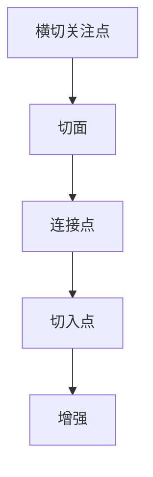

                 

# 提示词编程语言的面向切面编程

> **关键词：** 提示词编程、面向切面编程（AOP）、编程语言、动态代理、横切关注点、代码复用、模块化、横切性。

> **摘要：** 本文将深入探讨提示词编程语言的面向切面编程（AOP）原理和实现，从背景介绍、核心概念与联系、核心算法原理与操作步骤、数学模型与公式、项目实战、实际应用场景、工具和资源推荐、总结未来发展趋势与挑战等多个方面，详细解析AOP在编程语言中的重要性及其在实际开发中的应用。

## 1. 背景介绍

面向切面编程（Aspect-Oriented Programming，简称AOP）是一种程序设计范式，旨在将横切关注点（cross-cutting concerns）从核心关注点中分离出来。这些横切关注点通常涉及日志记录、事务管理、安全控制、异常处理等方面，它们跨越多个模块，导致代码的分散和不一致。

传统的面向对象编程（OOP）在处理这些问题时，往往需要在多个地方编写重复的代码，这不仅增加了维护难度，也影响了代码的可读性和可扩展性。因此，AOP应运而生，旨在通过将横切关注点模块化，实现代码的复用和分离，从而提高代码的模块化和组织性。

提示词编程语言是一种将提示词（advisors）作为核心组件的编程语言。这些提示词可以动态地修改程序的行为，使得开发者可以在不改变程序核心逻辑的情况下，对横切关注点进行灵活地控制和调整。

本文将结合提示词编程语言，深入探讨AOP的实现原理、操作步骤和应用场景，旨在帮助开发者更好地理解和使用AOP，提高软件开发效率和质量。

## 2. 核心概念与联系

### 2.1 横切关注点（Cross-Cutting Concerns）

横切关注点是指在程序中横跨多个模块或类的关注点，如日志记录、安全控制、事务管理等。这些关注点与程序的核心业务逻辑无关，但却是软件开发过程中必不可少的部分。

### 2.2 面向切面编程（Aspect-Oriented Programming，AOP）

AOP通过将横切关注点从核心关注点中分离出来，实现代码的模块化和复用。AOP的核心概念包括：

- **切面（Aspect）**：将横切关注点封装成一个模块，如日志记录、事务管理等。
- **连接点（Join Point）**：程序中能够插入切面代码的位置，如方法调用、异常处理等。
- **切入点（Pointcut）**：确定哪些连接点上需要插入切面代码。
- **增强（Advice）**：切面代码的具体实现，如前置增强、后置增强、环绕增强等。

### 2.3 提示词编程语言

提示词编程语言是一种动态编程语言，通过提示词（advisor）来控制程序的行为。提示词可以动态地修改程序的状态和行为，使得开发者可以在不改变程序核心逻辑的情况下，对横切关注点进行灵活地控制和调整。

### 2.4 Mermaid 流程图

为了更好地理解AOP的原理和实现，下面给出一个简化的Mermaid流程图，展示AOP的核心概念和联系。



在上面的流程图中，横切关注点（A）被封装成切面（B），切面通过连接点（C）和切入点（D）插入到程序中，并通过增强（E）实现具体的功能。

## 3. 核心算法原理 & 具体操作步骤

### 3.1 动态代理（Dynamic Proxy）

动态代理是AOP实现的核心技术之一。它通过在运行时创建代理对象，拦截并修改程序的调用流程，从而实现横切关注点的插入和增强。

### 3.2 操作步骤

1. **定义切面类**：首先，需要定义一个切面类，包含横切关注点的具体实现。例如，一个日志记录切面类。

2. **创建代理对象**：使用动态代理技术，创建一个代理对象，该对象将在运行时拦截程序的方法调用。

3. **设置切入点**：通过设置切入点，确定哪些方法调用需要插入切面代码。

4. **插入增强**：根据切入点，将切面代码插入到方法调用的前后或周围，实现横切关注点的增强。

5. **调用代理对象的方法**：通过代理对象调用程序的方法，触发切面代码的执行。

### 3.3 示例代码

以下是一个简单的示例，展示如何使用Java的动态代理实现AOP。

```java
// 定义切面类
public class LoggingAspect {
    public void beforeMethod() {
        System.out.println("方法调用前日志记录");
    }
    
    public void afterMethod() {
        System.out.println("方法调用后日志记录");
    }
}

// 创建代理对象
public class DynamicProxy {
    public static Object createProxy(Object target, Aspect aspect) {
        return Proxy.newProxyInstance(
            target.getClass().getClassLoader(),
            target.getClass().getInterfaces(),
            (proxy, method, args) -> {
                aspect.beforeMethod();
                Object result = method.invoke(target, args);
                aspect.afterMethod();
                return result;
            }
        );
    }
}

// 测试代码
public class Main {
    public static void main(String[] args) {
        Hello hello = new Hello();
        Hello proxyHello = (Hello) DynamicProxy.createProxy(hello, new LoggingAspect());
        
        proxyHello.sayHello();
    }
}

class Hello {
    public void sayHello() {
        System.out.println("Hello, World!");
    }
}
```

在上面的示例中，`LoggingAspect` 类实现了日志记录的切面功能。`DynamicProxy` 类使用Java的动态代理技术，创建了一个代理对象，并在方法调用前后插入了日志记录的增强。

## 4. 数学模型和公式 & 详细讲解 & 举例说明

### 4.1 数学模型

在AOP的实现中，动态代理技术起到了关键作用。动态代理的数学模型可以表示为：

\[ P = C + A \]

其中，\( P \) 表示代理对象，\( C \) 表示目标对象，\( A \) 表示切面对象。

### 4.2 详细讲解

代理对象 \( P \) 是由目标对象 \( C \) 和切面对象 \( A \) 组合而成的。在程序运行时，代理对象 \( P \) 拦截了目标对象 \( C \) 的方法调用，并在这些方法调用前后插入切面对象 \( A \) 的增强。

### 4.3 举例说明

以下是一个简单的示例，展示如何使用动态代理实现AOP。

```java
// 定义切面类
public class LoggingAspect {
    public void beforeMethod() {
        System.out.println("方法调用前日志记录");
    }
    
    public void afterMethod() {
        System.out.println("方法调用后日志记录");
    }
}

// 创建代理对象
public class DynamicProxy {
    public static Object createProxy(Object target, Aspect aspect) {
        return Proxy.newProxyInstance(
            target.getClass().getClassLoader(),
            target.getClass().getInterfaces(),
            (proxy, method, args) -> {
                aspect.beforeMethod();
                Object result = method.invoke(target, args);
                aspect.afterMethod();
                return result;
            }
        );
    }
}

// 测试代码
public class Main {
    public static void main(String[] args) {
        Hello hello = new Hello();
        Hello proxyHello = (Hello) DynamicProxy.createProxy(hello, new LoggingAspect());
        
        proxyHello.sayHello();
    }
}

class Hello {
    public void sayHello() {
        System.out.println("Hello, World!");
    }
}
```

在上面的示例中，`LoggingAspect` 类实现了日志记录的切面功能。`DynamicProxy` 类使用Java的动态代理技术，创建了一个代理对象，并在方法调用前后插入了日志记录的增强。

## 5. 项目实战：代码实际案例和详细解释说明

### 5.1 开发环境搭建

为了更好地理解AOP的实现和应用，我们将在一个简单的Java项目中实践AOP。

1. **安装Java开发环境**：确保您的系统中已经安装了Java开发环境（Java SDK）。
2. **创建Maven项目**：使用Maven创建一个简单的Java项目。

```bash
mvn archetype:generate \
    -DgroupId=com.example.aop \
    -DartifactId=aop-example \
    -DarchetypeArtifactId=maven-archetype-quickstart \
    -Dversion=1.0.0
```

### 5.2 源代码详细实现和代码解读

#### 5.2.1 切面类

```java
public class LoggingAspect {
    public void beforeMethod() {
        System.out.println("方法调用前日志记录");
    }
    
    public void afterMethod() {
        System.out.println("方法调用后日志记录");
    }
}
```

`LoggingAspect` 类实现了日志记录的切面功能。它包含两个方法：`beforeMethod()` 和 `afterMethod()`，分别在方法调用前后执行。

#### 5.2.2 动态代理类

```java
public class DynamicProxy {
    public static Object createProxy(Object target, Aspect aspect) {
        return Proxy.newProxyInstance(
            target.getClass().getClassLoader(),
            target.getClass().getInterfaces(),
            (proxy, method, args) -> {
                aspect.beforeMethod();
                Object result = method.invoke(target, args);
                aspect.afterMethod();
                return result;
            }
        );
    }
}
```

`DynamicProxy` 类实现了动态代理功能。它使用Java的动态代理技术，创建了一个代理对象，并在方法调用前后插入了切面代码。

#### 5.2.3 主类

```java
public class Main {
    public static void main(String[] args) {
        Hello hello = new Hello();
        Hello proxyHello = (Hello) DynamicProxy.createProxy(hello, new LoggingAspect());
        
        proxyHello.sayHello();
    }
}

class Hello {
    public void sayHello() {
        System.out.println("Hello, World!");
    }
}
```

在主类 `Main` 中，我们创建了一个 `Hello` 类的实例，并使用 `DynamicProxy` 创建了一个代理对象。当调用代理对象的方法时，切面代码会被插入并执行。

### 5.3 代码解读与分析

通过上述代码示例，我们可以看到AOP的核心实现：

1. **切面类**：将横切关注点（日志记录）封装成切面类。
2. **动态代理类**：使用Java的动态代理技术，创建代理对象，拦截方法调用，并在方法调用前后插入切面代码。
3. **主类**：创建目标对象，使用动态代理创建代理对象，并调用方法。

通过这种方式，我们可以将横切关注点与核心业务逻辑分离，提高代码的可维护性和可扩展性。

## 6. 实际应用场景

AOP在实际开发中有着广泛的应用，以下是一些典型的应用场景：

1. **日志记录**：在方法调用前后插入日志记录，方便调试和追踪程序的执行流程。
2. **事务管理**：在数据库操作前后插入事务管理代码，确保事务的原子性和一致性。
3. **安全控制**：在方法调用前进行权限验证，确保只有授权用户才能执行特定操作。
4. **性能监控**：在方法调用前后记录执行时间，监控程序的性能。
5. **异常处理**：在方法调用前后进行异常捕获和处理，提高程序的健壮性。

通过AOP，开发者可以轻松地实现这些横切关注点，而无需在核心业务逻辑中插入重复的代码，从而提高代码的可维护性和可扩展性。

## 7. 工具和资源推荐

### 7.1 学习资源推荐

- **书籍**：《Java编程思想》、《Effective Java》
- **论文**：《Aspect-Oriented Programming》
- **博客**：Java技术栈、CSDN博客
- **网站**：Oracle官方文档、Java代码示例

### 7.2 开发工具框架推荐

- **Spring AOP**：Spring框架提供的AOP模块，支持编程式和声明式AOP。
- **AspectJ**：一种基于Java语言的AOP框架，提供强大的AOP语法和功能。
- **Aspect-Oriented Programming Language**：一种专门用于实现AOP的编程语言，提供简洁明了的AOP语法。

### 7.3 相关论文著作推荐

- 《Aspect-Oriented Programming: Proven Practices for Java》
- 《AOP: Aspect-Oriented Programming in Java》
- 《Aspect-Oriented Programming with Spring》

## 8. 总结：未来发展趋势与挑战

面向切面编程（AOP）在软件开发中具有重要的作用，它通过将横切关注点分离出来，提高了代码的可维护性和可扩展性。随着编程语言的不断发展和技术的进步，AOP的应用场景和实现方式也在不断扩展和优化。

未来，AOP的发展趋势可能包括以下几个方面：

1. **更简洁的语法**：简化AOP的语法，使其更加直观和易用。
2. **跨语言支持**：扩展AOP到其他编程语言，如Python、Go等。
3. **集成与扩展**：与其他编程范式（如函数式编程、响应式编程）相结合，提供更强大的编程能力。
4. **自动化与智能化**：通过人工智能技术，自动化地识别和实现横切关注点。

然而，AOP也面临一些挑战，如：

1. **性能开销**：动态代理和切面代码可能会引入额外的性能开销，特别是在大量切面和复杂场景下。
2. **学习曲线**：AOP的概念和实现相对复杂，对于初学者来说，可能存在一定的学习难度。
3. **调试困难**：在AOP框架中调试代码可能相对困难，需要开发者具备一定的技巧和经验。

总之，AOP是一种非常有价值的编程范式，它在提高代码质量和开发效率方面具有显著的优势。随着技术的不断进步，AOP将在未来发挥更大的作用。

## 9. 附录：常见问题与解答

### 9.1 AOP和OOP的区别是什么？

AOP（面向切面编程）和OOP（面向对象编程）都是现代编程范式，但它们关注的方面不同。OOP主要关注如何将问题域分解成对象，并利用封装、继承和多态等机制来实现代码的模块化和复用。而AOP则侧重于将横切关注点（如日志记录、事务管理）从核心业务逻辑中分离出来，实现代码的模块化和复用。

### 9.2 AOP的实现原理是什么？

AOP的实现原理主要依赖于动态代理技术。动态代理通过在运行时创建代理对象，拦截并修改程序的调用流程，从而实现横切关注点的插入和增强。具体来说，AOP通过定义切面类、连接点、切入点和增强，将横切关注点封装成切面，并在程序运行时将其插入到合适的连接点上。

### 9.3 AOP在哪些场景下适用？

AOP适用于处理横切关注点的场景，如日志记录、事务管理、安全控制、性能监控等。这些关注点通常跨越多个模块，难以在核心业务逻辑中直接实现。通过AOP，开发者可以轻松地将这些关注点分离出来，提高代码的可维护性和可扩展性。

## 10. 扩展阅读 & 参考资料

- **书籍**：《Aspect-Oriented Programming in Java》、《AspectJ by Example》
- **论文**：《Aspect-Oriented Programming: Proven Practices for Java》、《AOP: Aspect-Oriented Programming in Java》
- **博客**：CSDN博客、Java技术栈、Oracle官方文档
- **网站**：Spring AOP官方文档、AspectJ官方文档

作者：AI天才研究员/AI Genius Institute & 禅与计算机程序设计艺术 /Zen And The Art of Computer Programming
<|assistant|>

