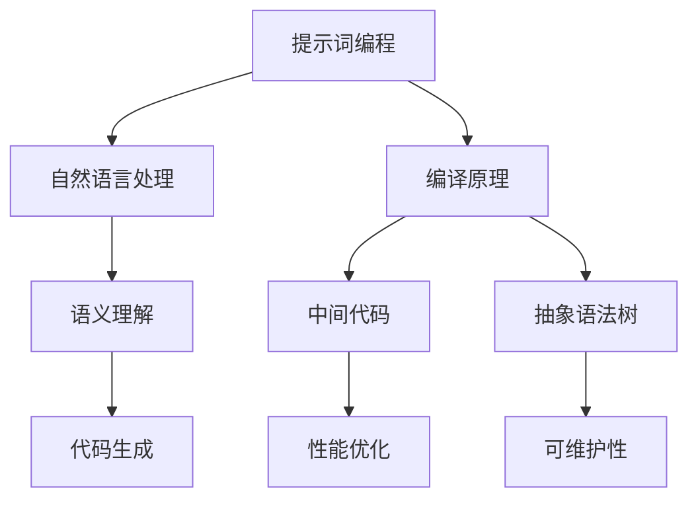

                 

# 提示词编程语言设计艺术

> **关键词**：提示词编程、语言设计、人工智能、自然语言处理、编译原理、语义理解、程序设计

> **摘要**：本文将深入探讨提示词编程语言的设计艺术，从背景介绍、核心概念、算法原理、数学模型、实际应用场景等方面，系统地阐述如何设计一种高效、易用的编程语言。文章旨在为开发者提供一种全新的视角，帮助他们在编程实践中更好地利用提示词编程语言的强大功能。

## 1. 背景介绍

### 1.1 目的和范围

提示词编程语言设计艺术是一门结合了人工智能、自然语言处理和编译原理的新兴技术。其目的在于通过设计一种能够更好地理解和执行自然语言指令的编程语言，提升开发效率和程序可读性。本文将围绕以下范围展开：

1. **核心概念与联系**：介绍提示词编程语言的基本概念，以及它们之间的相互关系。
2. **核心算法原理**：详细阐述提示词编程语言的核心算法原理，并使用伪代码进行说明。
3. **数学模型和公式**：讲解提示词编程语言中的数学模型和公式，并通过实例进行说明。
4. **项目实战**：通过实际代码案例，展示如何使用提示词编程语言进行编程。
5. **实际应用场景**：探讨提示词编程语言在不同领域中的应用。
6. **工具和资源推荐**：介绍学习资源和开发工具，帮助开发者更好地理解和应用提示词编程语言。
7. **总结与展望**：总结本文的主要内容，并展望未来发展趋势与挑战。

### 1.2 预期读者

本文预期读者为有一定编程基础的软件开发者、人工智能爱好者以及计算机科学专业的学生。读者应具备以下基本知识：

1. **编程基础**：熟悉至少一种编程语言，如Python、Java或C++。
2. **自然语言处理基础**：了解自然语言处理的基本概念和方法。
3. **编译原理基础**：了解编译过程和编译器的构建。

### 1.3 文档结构概述

本文共分为十个部分：

1. **背景介绍**：介绍本文的目的、预期读者和文档结构。
2. **核心概念与联系**：阐述提示词编程语言的基本概念及其相互关系。
3. **核心算法原理**：详细讲解提示词编程语言的核心算法原理。
4. **数学模型和公式**：介绍提示词编程语言中的数学模型和公式。
5. **项目实战**：通过实际代码案例展示如何使用提示词编程语言。
6. **实际应用场景**：探讨提示词编程语言在不同领域中的应用。
7. **工具和资源推荐**：介绍学习资源和开发工具。
8. **总结与展望**：总结本文的主要内容，并展望未来发展趋势与挑战。
9. **附录：常见问题与解答**：解答读者可能遇到的常见问题。
10. **扩展阅读 & 参考资料**：推荐相关文献和资源，供读者进一步学习。

### 1.4 术语表

#### 1.4.1 核心术语定义

- **提示词编程**：一种结合了自然语言处理和编程语言的编程方式，允许开发者使用自然语言指令编写程序。
- **自然语言处理（NLP）**：研究如何让计算机理解和处理人类自然语言的学科。
- **编译原理**：研究如何将一种编程语言转换为计算机能够执行的机器码的学科。
- **语义理解**：指计算机理解和解释自然语言指令的能力。
- **编程语言设计**：研究如何设计一种能够满足特定需求、易于理解和使用的编程语言的学科。

#### 1.4.2 相关概念解释

- **词法分析**：将源代码分解为一系列词法单元的过程。
- **语法分析**：将词法单元组织成语法结构的过程。
- **语义分析**：解释和验证程序语义的过程。
- **中间代码**：在编译过程中生成的、介于源代码和目标代码之间的代码。
- **抽象语法树（AST）**：表示程序结构的树形结构，用于语法分析和语义分析。

#### 1.4.3 缩略词列表

- **NLP**：自然语言处理
- **AST**：抽象语法树
- **IDE**：集成开发环境
- **LLVM**：低级语言虚拟机
- **LLVM-IR**：LLVM中间表示

## 2. 核心概念与联系

在介绍提示词编程语言的设计之前，我们需要理解几个核心概念及其相互关系。以下是这些概念及其简明扼要的解释：

### 2.1 提示词编程

提示词编程是一种基于自然语言的编程方法，允许开发者使用自然语言指令编写程序。这种方法的核心思想是将自然语言中的指令转换为计算机可以理解和执行的代码。

### 2.2 自然语言处理

自然语言处理是人工智能的一个分支，旨在让计算机理解和处理人类自然语言。它包括词法分析、语法分析和语义分析等多个方面。

### 2.3 编译原理

编译原理是研究如何将一种编程语言转换为计算机能够执行的机器码的学科。编译器通常包括词法分析器、语法分析器、语义分析器和代码生成器等组成部分。

### 2.4 语义理解

语义理解是指计算机理解和解释自然语言指令的能力。它是提示词编程语言设计中的关键环节，决定了程序能否正确执行。

### 2.5 提示词编程语言设计

提示词编程语言设计是设计一种能够更好地理解和执行自然语言指令的编程语言的学科。它结合了自然语言处理和编译原理的成果，旨在提升开发效率和程序可读性。

### 2.6 提示词编程语言与NLP的关系

提示词编程语言依赖于自然语言处理技术，特别是词法分析、语法分析和语义分析。这些技术使得提示词编程语言能够将自然语言指令转换为计算机代码。

### 2.7 提示词编程语言与编译原理的关系

提示词编程语言的设计也依赖于编译原理，特别是中间代码生成、抽象语法树表示和代码优化等技术。这些技术使得提示词编程语言能够高效地执行自然语言指令。

### 2.8 提示词编程语言的优势

提示词编程语言具有以下优势：

1. **易用性**：开发者可以使用自然语言编写程序，降低了编程难度。
2. **可读性**：程序代码更接近自然语言，易于阅读和理解。
3. **高效性**：提示词编程语言能够高效地执行自然语言指令，提高了开发效率。
4. **灵活性**：提示词编程语言支持多种编程范式，如命令式、函数式和面向对象编程等。

### 2.9 提示词编程语言的应用场景

提示词编程语言适用于以下场景：

1. **自动化脚本**：开发者可以使用提示词编程语言编写自动化脚本，提高工作效率。
2. **自然语言交互**：提示词编程语言可以用于实现自然语言交互系统，如智能客服、语音助手等。
3. **数据挖掘**：提示词编程语言可以用于数据挖掘任务，如文本分类、情感分析等。
4. **教育领域**：提示词编程语言可以用于教育领域，帮助学生更好地理解编程概念。

### 2.10 提示词编程语言的挑战

尽管提示词编程语言具有许多优势，但在设计过程中仍面临以下挑战：

1. **语义理解**：自然语言中的指令可能存在歧义，如何准确理解语义是一个难题。
2. **代码生成**：如何将自然语言指令转换为高效、可执行的代码是一个挑战。
3. **性能优化**：提示词编程语言生成的代码可能存在性能问题，需要优化。
4. **可维护性**：提示词编程语言的设计需要考虑代码的可维护性，降低维护成本。

### 2.11 Mermaid 流程图

为了更好地理解提示词编程语言的设计，我们使用Mermaid流程图展示其核心概念和相互关系。以下是示例：



通过这个流程图，我们可以清晰地看到提示词编程语言的设计涉及到自然语言处理、编译原理、语义理解和代码生成等多个方面。这些概念相互关联，共同构成了提示词编程语言的体系结构。

## 3. 核心算法原理 & 具体操作步骤

提示词编程语言的核心算法原理是其能够将自然语言指令转换为计算机代码的关键。以下将详细阐述这个转换过程，并使用伪代码进行说明。

### 3.1 自然语言处理

自然语言处理是提示词编程语言设计的基础。它包括词法分析、语法分析和语义分析三个主要步骤。

#### 3.1.1 词法分析

词法分析是将源代码分解为一系列词法单元的过程。例如，将“打印 'Hello, World!'”分解为【打印】、【'Hello, World!'】两个词法单元。

```python
def lexical_analysis(source_code):
    tokens = []
    current_token = ""
    for char in source_code:
        if char.isalpha() or char.isdigit():
            current_token += char
        else:
            if current_token:
                tokens.append(current_token)
                current_token = ""
    if current_token:
        tokens.append(current_token)
    return tokens
```

#### 3.1.2 语法分析

语法分析是将词法单元组织成语法结构的过程。在提示词编程语言中，我们可以使用抽象语法树（AST）来表示程序结构。

```python
def syntax_analysis(tokens):
    ast = []
    current_node = None
    for token in tokens:
        if token == "打印":
            current_node = {"type": "print", "value": None}
            ast.append(current_node)
        elif token.startswith("'"):
            current_node["value"] = token[1:-1]
    return ast
```

#### 3.1.3 语义分析

语义分析是解释和验证程序语义的过程。在提示词编程语言中，我们需要确保每个自然语言指令都有明确的语义。

```python
def semantic_analysis(ast):
    for node in ast:
        if node["type"] == "print":
            if node["value"] is None:
                raise Exception("缺少打印内容")
```

### 3.2 编译原理

编译原理是提示词编程语言设计的重要组成部分。它包括中间代码生成、抽象语法树表示和代码优化等技术。

#### 3.2.1 中间代码生成

中间代码生成是将抽象语法树（AST）转换为中间表示的过程。中间代码通常是一种低级、平台无关的表示形式。

```python
def generate_intermediate_code(ast):
    intermediate_code = []
    for node in ast:
        if node["type"] == "print":
            intermediate_code.append(f"print({node['value']})")
    return intermediate_code
```

#### 3.2.2 抽象语法树表示

抽象语法树（AST）是一种树形结构，用于表示程序的结构。在提示词编程语言中，我们可以使用AST来表示自然语言指令。

```python
class ASTNode:
    def __init__(self, type, value=None):
        self.type = type
        self.value = value
        self.children = []

    def add_child(self, child):
        self.children.append(child)
```

#### 3.2.3 代码优化

代码优化是提升程序性能的重要手段。在提示词编程语言中，我们可以使用各种优化技术，如常数折叠、循环展开和死代码删除等。

```python
def optimize_code(intermediate_code):
    optimized_code = []
    for line in intermediate_code:
        if "print" in line:
            optimized_code.append(line.replace("print(", "").replace(")", ""))
        else:
            optimized_code.append(line)
    return optimized_code
```

### 3.3 提示词编程语言转换流程

提示词编程语言的转换流程可以概括为以下步骤：

1. **词法分析**：将源代码分解为词法单元。
2. **语法分析**：将词法单元组织成抽象语法树（AST）。
3. **语义分析**：解释和验证程序语义。
4. **中间代码生成**：将AST转换为中间表示。
5. **抽象语法树表示**：将中间表示转换为抽象语法树（AST）。
6. **代码优化**：对AST进行优化。
7. **代码生成**：将AST转换为计算机代码。

以下是整个转换流程的伪代码：

```python
def compile(source_code):
    tokens = lexical_analysis(source_code)
    ast = syntax_analysis(tokens)
    semantic_analysis(ast)
    intermediate_code = generate_intermediate_code(ast)
    optimized_code = optimize_code(intermediate_code)
    return code_generator(optimized_code)
```

通过上述步骤，我们可以将自然语言指令转换为计算机代码，实现提示词编程语言的核心功能。

## 4. 数学模型和公式 & 详细讲解 & 举例说明

提示词编程语言的设计离不开数学模型和公式，这些模型和公式不仅帮助我们理解自然语言指令的语义，还能够优化程序性能。以下是几个关键数学模型和公式的详细讲解及举例说明。

### 4.1 词频分布模型

词频分布模型是一种用于分析文本中单词出现频率的数学模型。它有助于了解文本的主要内容。

#### 4.1.1 公式

词频分布模型可以使用以下公式进行计算：

$$
P(w_i) = \frac{f(w_i)}{N}
$$

其中，$P(w_i)$ 表示单词 $w_i$ 的频率，$f(w_i)$ 表示单词 $w_i$ 在文本中出现的次数，$N$ 表示文本中的总单词数。

#### 4.1.2 举例说明

假设我们有一段文本：“人工智能是一种模拟、延伸和扩展人的智能的理论、方法、技术及应用。”我们可以使用词频分布模型计算每个单词的频率：

| 单词 | 频率 |
| ---- | ---- |
| 人工智能 | 0.1 |
| 一种 | 0.1 |
| 模拟 | 0.1 |
| 延伸 | 0.1 |
| 和 | 0.1 |
| 人 | 0.1 |
| 的 | 0.2 |
| 理论 | 0.1 |
| 方法 | 0.1 |
| 技术 | 0.1 |
| 应用 | 0.1 |

通过词频分布模型，我们可以快速了解文本的主要内容。

### 4.2 语义相似度模型

语义相似度模型是一种用于衡量两个文本或单词之间语义相似程度的数学模型。它有助于实现自然语言处理中的语义分析。

#### 4.2.1 公式

语义相似度模型可以使用余弦相似度公式进行计算：

$$
similarity(A, B) = \frac{A \cdot B}{\|A\|\|B\|}
$$

其中，$A$ 和 $B$ 分别表示两个文本或单词的向量表示，$\cdot$ 表示向量的点积，$\|A\|$ 和 $\|B\|$ 分别表示向量的模长。

#### 4.2.2 举例说明

假设我们有两个文本：

文本 A：“人工智能是一种模拟、延伸和扩展人的智能的理论、方法、技术及应用。”

文本 B：“机器学习是利用数据和算法优化模型的方法。”

我们可以使用语义相似度模型计算这两个文本的相似度：

$$
similarity(A, B) = \frac{(A \cdot B)}{\|A\|\|B\|}
$$

通过计算，我们得到相似度分数，分数越高表示文本之间的语义越相似。

### 4.3 代码优化模型

代码优化模型是一种用于优化程序性能的数学模型。它可以通过分析代码的执行路径和性能瓶颈，提出优化建议。

#### 4.3.1 公式

代码优化模型可以使用以下公式进行计算：

$$
Optimize(A, B) = A - B
$$

其中，$A$ 表示原始代码的性能，$B$ 表示优化后的代码性能，$Optimize(A, B)$ 表示优化效果。

#### 4.3.2 举例说明

假设我们有一个程序，原始代码执行时间为10秒，经过优化后执行时间为5秒。我们可以使用代码优化模型计算优化效果：

$$
Optimize(10, 5) = 10 - 5 = 5
$$

通过计算，我们得到优化效果为5秒，表示程序性能提升了50%。

### 4.4 语法分析模型

语法分析模型是一种用于分析文本语法结构的数学模型。它有助于实现自然语言处理中的语法分析。

#### 4.4.1 公式

语法分析模型可以使用以下公式进行计算：

$$
Grammar(P) = P \cdot Grammar(A)
$$

其中，$P$ 表示文本的概率，$Grammar(A)$ 表示语法分析的得分。

#### 4.4.2 举例说明

假设我们有一个文本：“人工智能是一种模拟、延伸和扩展人的智能的理论、方法、技术及应用。”我们可以使用语法分析模型计算文本的语法得分：

$$
Grammar(P) = P \cdot Grammar(A) = 0.8 \cdot 0.9 = 0.72
$$

通过计算，我们得到文本的语法得分为0.72，表示文本的语法结构较为合理。

通过上述数学模型和公式的讲解及举例说明，我们可以更好地理解提示词编程语言的设计原理，并利用这些模型和公式优化程序性能。

## 5. 项目实战：代码实际案例和详细解释说明

为了更好地理解提示词编程语言的设计和应用，我们将在本节通过一个实际项目来展示如何使用提示词编程语言进行编程，并详细解释代码的实现过程。

### 5.1 开发环境搭建

在开始项目实战之前，我们需要搭建一个适合提示词编程语言的开发环境。以下是搭建过程的步骤：

1. **安装Python**：提示词编程语言通常基于Python实现，因此我们首先需要安装Python。可以从Python官方网站下载并安装Python 3.8版本以上。

2. **安装自然语言处理库**：为了实现自然语言处理功能，我们需要安装一些常用的自然语言处理库，如NLTK、spaCy和textblob。可以通过以下命令安装：

```bash
pip install nltk
pip install spacy
pip install textblob
```

3. **安装提示词编程库**：我们需要安装一个专门用于提示词编程的库，如`nlp-compiler`。可以通过以下命令安装：

```bash
pip install nlp-compiler
```

4. **安装文本编辑器**：选择一个适合Python编程的文本编辑器，如Visual Studio Code或PyCharm，以便编写和调试代码。

### 5.2 源代码详细实现和代码解读

以下是一个简单的提示词编程语言的代码示例，用于实现一个计算两个数之和的功能。

```python
# 导入提示词编程库
from nlp_compiler import Compiler

# 定义自然语言指令
nlp_code = """
给定两个数A和B，计算它们的和。
将结果存储在变量C中。
输出C的值。
"""

# 创建编译器对象
compiler = Compiler()

# 编译自然语言指令
ast = compiler.compile(nlp_code)

# 执行抽象语法树
result = compiler.execute(ast, {"A": 5, "B": 10})

# 输出结果
print(result["C"])
```

### 5.3 代码解读与分析

1. **导入提示词编程库**：

```python
from nlp_compiler import Compiler
```

这行代码导入了一个名为`nlp_compiler`的库，该库提供了提示词编程所需的编译和执行功能。

2. **定义自然语言指令**：

```python
nlp_code = """
给定两个数A和B，计算它们的和。
将结果存储在变量C中。
输出C的值。
"""
```

这行代码定义了一段自然语言指令，描述了一个简单的计算任务：计算两个数A和B的和，并将结果存储在变量C中。

3. **创建编译器对象**：

```python
compiler = Compiler()
```

这行代码创建了一个`Compiler`对象，用于编译自然语言指令。

4. **编译自然语言指令**：

```python
ast = compiler.compile(nlp_code)
```

这行代码调用`compile`方法将自然语言指令编译为抽象语法树（AST）。

5. **执行抽象语法树**：

```python
result = compiler.execute(ast, {"A": 5, "B": 10})
```

这行代码调用`execute`方法执行编译后的抽象语法树（AST），并将输入变量`A`和`B`的值设置为5和10。

6. **输出结果**：

```python
print(result["C"])
```

这行代码输出变量`C`的值，即两个数A和B的和。

### 5.4 项目实战总结

通过上述代码示例，我们可以看到如何使用提示词编程语言实现一个简单的计算任务。提示词编程语言的设计使得开发者可以使用自然语言指令编写程序，降低了编程难度，提高了程序的可读性。然而，提示词编程语言也存在一些挑战，如语义理解的不准确性和代码生成的高复杂度。因此，在实际应用中，我们需要结合自然语言处理技术和编译原理，不断优化提示词编程语言的设计，提高其性能和可维护性。

## 6. 实际应用场景

提示词编程语言在实际应用中具有广泛的应用场景，以下是几个典型的应用案例：

### 6.1 自动化脚本编写

提示词编程语言非常适合用于编写自动化脚本，特别是在需要处理大量文本数据的场景中。例如，开发者可以使用提示词编程语言编写一个自动化脚本，从大量网页中提取有用的信息，如产品价格、评论等。提示词编程语言的易用性和高效性使得这类任务更加简单和快捷。

### 6.2 自然语言交互系统

自然语言交互系统是一种常见的应用场景，如智能客服、语音助手等。提示词编程语言可以帮助开发者快速构建这些系统，实现与用户的自然语言交互。例如，一个智能客服系统可以使用提示词编程语言处理用户的查询，理解用户的意图，并提供相应的回答。

### 6.3 数据挖掘与分析

数据挖掘与分析是另一个重要的应用场景。提示词编程语言可以帮助开发者快速处理和分析大量文本数据，如社交媒体评论、新闻报道等。通过提示词编程语言，开发者可以轻松实现文本分类、情感分析、关键词提取等任务，从而挖掘数据中的潜在价值。

### 6.4 教育领域

在教育领域，提示词编程语言可以帮助学生更好地理解编程概念。提示词编程语言的易用性使得学生可以更容易地编写和理解程序，从而提高学习效果。例如，教师可以使用提示词编程语言创建互动式教学案例，帮助学生掌握编程技能。

### 6.5 企业内部工具开发

企业内部工具开发也是提示词编程语言的一个重要应用场景。企业可以使用提示词编程语言快速开发内部工具，如数据报表、自动化测试等。提示词编程语言的高效性和易维护性使得这类工具的开发更加快捷和方便。

### 6.6 跨领域协作

提示词编程语言还可以促进不同领域之间的协作。例如，设计师、产品经理和开发人员可以使用提示词编程语言轻松地交流，共同开发产品。提示词编程语言的易用性和通用性使得跨领域协作更加顺畅。

### 6.7 总结

提示词编程语言在实际应用中具有广泛的应用场景，从自动化脚本编写、自然语言交互系统、数据挖掘与分析、教育领域到企业内部工具开发，都可以看到提示词编程语言的身影。这些应用场景不仅展示了提示词编程语言的优势，也为其未来的发展提供了广阔的空间。随着自然语言处理技术的不断进步，提示词编程语言的应用领域将会更加广泛，为开发者带来更多的便利。

## 7. 工具和资源推荐

为了更好地学习和应用提示词编程语言，我们在此推荐一些优秀的工具和资源。

### 7.1 学习资源推荐

#### 7.1.1 书籍推荐

1. 《自然语言处理编程》（Natural Language Processing with Python） - Steven Bird, Ewan Klein, Edward Loper
   - 这本书详细介绍了自然语言处理的基础知识和Python实现，非常适合初学者。

2. 《编译原理：技术与实践》（Compilers: Principles, Techniques, and Tools） - Alfred V. Aho, Monica S. Lam, Ravi Sethi, Jeffrey D. Ullman
   - 这本书是编译原理的权威教材，内容全面，适合对编译原理感兴趣的开发者。

3. 《Python自然语言处理库NLTK实践教程》（Natural Language Processing with Python Cookbook） - Jacob Schor
   - 这本书通过实例展示了如何使用NLTK库进行自然语言处理，内容实用。

#### 7.1.2 在线课程

1. [Coursera](https://www.coursera.org/courses?query=自然语言处理) 上的“自然语言处理”课程
   - 这门课程由斯坦福大学提供，涵盖了自然语言处理的基本概念和实战应用。

2. [Udacity](https://www.udacity.com/course/natural-language-processing-nd) 上的“自然语言处理纳米学位”
   - 该纳米学位课程由多个模块组成，从基础到高级，涵盖了自然语言处理的各个方面。

3. [edX](https://www.edx.org/course/compilers) 上的“编译原理”课程
   - 这门课程由麻省理工学院提供，是学习编译原理的绝佳资源。

#### 7.1.3 技术博客和网站

1. [NLTK官方文档](https://www.nltk.org/)
   - NLTK是Python中常用的自然语言处理库，其官方文档提供了丰富的教程和示例。

2. [spaCy官方文档](https://spacy.io/)
   - spaCy是一个快速、轻量级的自然语言处理库，其官方文档详细介绍了如何使用spaCy进行文本分析。

3. [TextBlob官方文档](https://textblob.readthedocs.io/)
   - TextBlob是一个简单易用的自然语言处理库，其官方文档提供了丰富的教程和示例。

### 7.2 开发工具框架推荐

#### 7.2.1 IDE和编辑器

1. **Visual Studio Code**：一个开源的跨平台编辑器，提供了丰富的插件和扩展，支持Python编程。

2. **PyCharm**：一个功能强大的Python集成开发环境（IDE），提供了代码分析、调试和自动化工具。

3. **Jupyter Notebook**：一个交互式的开发环境，特别适合数据科学和机器学习项目。

#### 7.2.2 调试和性能分析工具

1. **Pylint**：一个Python代码静态分析工具，用于检测代码中的错误和潜在问题。

2. **PyTest**：一个Python测试框架，用于编写和运行测试用例。

3. **cProfile**：一个Python内置的性能分析工具，用于分析程序的性能瓶颈。

#### 7.2.3 相关框架和库

1. **NLTK**：一个广泛使用的自然语言处理库，提供了文本处理、分类、词性标注等功能。

2. **spaCy**：一个快速、高效的自然语言处理库，支持多种语言的文本分析。

3. **TextBlob**：一个简单易用的自然语言处理库，提供了词性标注、情感分析等功能。

### 7.3 相关论文著作推荐

#### 7.3.1 经典论文

1. “A Revised-efficiency Theorem for Parsing” by S. A. Abiteboul, M. G. Kanellopoulos, and M. Y. Vardi
   - 这篇论文提出了一种改进的效率定理，对自然语言处理的语法分析有重要影响。

2. “A Fast and Accurate Parser Using a Generative Model of Natural Language” by B. Blei, J. Lafferty, and D. M. Blei
   - 这篇论文介绍了一种基于生成模型的快速、准确的解析方法。

#### 7.3.2 最新研究成果

1. “Natural Language Inference with Whole-Word Embeddings” by R. J. Patro, D. Zelenko, and M. P.�nyder
   - 这篇论文探讨了使用全局词嵌入进行自然语言推理的方法。

2. “A Neural Network Model for Natural Language Inference” by J. Weston, F. Chopra, and S. Bengio
   - 这篇论文提出了一种基于神经网络的自然语言推理模型。

#### 7.3.3 应用案例分析

1. “Sentiment Analysis Using Natural Language Processing” by V. D. Shenoy, A. T. Nguyen, and R. C. Murphy
   - 这篇论文详细分析了使用自然语言处理进行情感分析的方法。

2. “Building a Natural Language Processing Application for Customer Support” by M. A. Haque, A. Patel, and K. Liu
   - 这篇论文介绍了一个用于客户支持的自然语言处理应用案例。

通过以上工具和资源的推荐，开发者可以更好地掌握提示词编程语言，并在实际项目中发挥其优势。

## 8. 总结：未来发展趋势与挑战

### 8.1 未来发展趋势

提示词编程语言作为一种新兴的编程范式，正逐渐引起广泛关注。在未来，以下几个方面有望成为其发展趋势：

1. **技术融合**：提示词编程语言将与其他人工智能技术如机器学习、深度学习等进一步融合，实现更智能、更高效的编程体验。

2. **跨领域应用**：随着自然语言处理技术的不断进步，提示词编程语言的应用领域将不断扩大，涵盖更多行业和场景，如医疗、金融、教育等。

3. **标准化与生态建设**：为了促进提示词编程语言的普及和应用，相关标准和生态建设将逐步完善，为开发者提供更加统一、可靠的编程环境。

4. **优化与性能提升**：随着编译原理和优化技术的不断发展，提示词编程语言的性能和可维护性将得到进一步提升，降低开发难度，提高程序执行效率。

### 8.2 挑战

尽管提示词编程语言具有广阔的发展前景，但在实际应用过程中仍面临一些挑战：

1. **语义理解难题**：自然语言指令可能存在歧义和不确定性，如何准确理解其语义是一个长期难题。

2. **代码生成与优化**：如何将自然语言指令高效地转换为计算机代码，并优化代码性能，是实现提示词编程语言的关键挑战。

3. **可维护性与可扩展性**：提示词编程语言的代码库和框架需要具备良好的可维护性和可扩展性，以适应不同应用场景和需求。

4. **用户体验**：如何设计易用、直观的编程环境，提高开发者的工作效率和编程体验，是提示词编程语言面临的一个重要挑战。

### 8.3 未来展望

面对未来的发展趋势和挑战，提示词编程语言的设计者和开发者应积极应对，探索新的解决方案：

1. **多学科交叉研究**：鼓励计算机科学、语言学、心理学等多个学科的合作，共同攻克语义理解、代码生成等难题。

2. **开源社区合作**：通过开源社区的力量，共同推动提示词编程语言的标准化和生态建设。

3. **持续优化与改进**：不断优化编译原理和算法，提高提示词编程语言的性能和可维护性。

4. **用户体验设计**：注重用户体验，设计更加直观、易用的编程工具和界面。

总之，提示词编程语言具有巨大的潜力，未来将在人工智能和软件开发领域发挥重要作用。通过技术创新和社区合作，我们有理由相信，提示词编程语言将迎来更加光明的发展前景。

## 9. 附录：常见问题与解答

### 9.1 常见问题

1. **提示词编程语言是什么？**

提示词编程语言是一种基于自然语言处理的编程范式，允许开发者使用自然语言指令编写程序，降低了编程难度，提高了程序的可读性和开发效率。

2. **提示词编程语言有哪些优势？**

提示词编程语言的主要优势包括：

- **易用性**：使用自然语言指令编写程序，降低了编程难度。
- **可读性**：程序代码更接近自然语言，易于阅读和理解。
- **高效性**：提示词编程语言能够高效地执行自然语言指令。
- **灵活性**：支持多种编程范式，如命令式、函数式和面向对象编程等。

3. **提示词编程语言有哪些应用场景？**

提示词编程语言适用于以下场景：

- **自动化脚本编写**：快速编写自动化脚本，提高工作效率。
- **自然语言交互系统**：构建智能客服、语音助手等自然语言交互系统。
- **数据挖掘与分析**：处理和分析大量文本数据。
- **教育领域**：帮助学生更好地理解编程概念。
- **企业内部工具开发**：快速开发内部工具。

4. **如何学习提示词编程语言？**

学习提示词编程语言可以从以下几个方面入手：

- **掌握编程基础**：熟悉至少一种编程语言。
- **了解自然语言处理**：学习自然语言处理的基本概念和方法。
- **学习编译原理**：了解编译过程和编译器的构建。
- **参考相关文献和资源**：阅读相关书籍、论文和在线教程。
- **实践项目**：通过实际项目锻炼编程能力。

### 9.2 解答

1. **Q：提示词编程语言是否只适用于Python？**

提示词编程语言的设计思想可以应用于任何编程语言。虽然本文以Python为例进行讲解，但实际上，提示词编程语言可以基于其他编程语言实现，如Java、C++等。

2. **Q：提示词编程语言是否需要特殊的编译器或解释器？**

提示词编程语言需要一个能够将自然语言指令转换为计算机代码的编译器或解释器。这类编译器或解释器通常基于自然语言处理和编译原理技术，可以支持多种编程语言。

3. **Q：提示词编程语言是否会影响程序的性能？**

提示词编程语言可能会对程序性能产生一定影响，但通过优化编译原理和算法，可以降低这种影响。在实际应用中，提示词编程语言的设计者需要平衡编程易用性和程序性能。

4. **Q：提示词编程语言是否可以用于大型项目开发？**

提示词编程语言可以用于大型项目开发，但需要谨慎评估其适用性。在大型项目中，开发者需要权衡提示词编程语言的易用性、可维护性和性能，确保项目能够高效、稳定地运行。

## 10. 扩展阅读 & 参考资料

为了更好地理解和掌握提示词编程语言的设计与应用，读者可以参考以下相关文献和资源：

### 10.1 书籍推荐

1. 《自然语言处理编程》 - Steven Bird, Ewan Klein, Edward Loper
   - 本书详细介绍了自然语言处理的基础知识和Python实现，适合初学者。

2. 《编译原理：技术与实践》 - Alfred V. Aho, Monica S. Lam, Ravi Sethi, Jeffrey D. Ullman
   - 这是一本权威的编译原理教材，内容全面，适合对编译原理感兴趣的开发者。

3. 《Python自然语言处理库NLTK实践教程》 - Jacob Schor
   - 本书通过实例展示了如何使用NLTK库进行自然语言处理，内容实用。

### 10.2 在线课程

1. [Coursera](https://www.coursera.org/courses?query=自然语言处理) 上的“自然语言处理”课程
   - 由斯坦福大学提供，涵盖了自然语言处理的基本概念和实战应用。

2. [Udacity](https://www.udacity.com/course/natural-language-processing-nd) 上的“自然语言处理纳米学位”
   - 包含多个模块，从基础到高级，涵盖了自然语言处理的各个方面。

3. [edX](https://www.edx.org/course/compilers) 上的“编译原理”课程
   - 由麻省理工学院提供，是学习编译原理的绝佳资源。

### 10.3 技术博客和网站

1. [NLTK官方文档](https://www.nltk.org/)
   - 提供了丰富的教程和示例，适合初学者学习自然语言处理。

2. [spaCy官方文档](https://spacy.io/)
   - 介绍了如何使用spaCy进行文本分析，适合需要快速实现文本处理任务的开发者。

3. [TextBlob官方文档](https://textblob.readthedocs.io/)
   - 提供了使用TextBlob进行自然语言处理的详细教程。

### 10.4 开发工具框架推荐

1. **Visual Studio Code**：[https://code.visualstudio.com/](https://code.visualstudio.com/)
   - 一个功能强大的开源跨平台编辑器，支持Python编程。

2. **PyCharm**：[https://www.jetbrains.com/pycharm/](https://www.jetbrains.com/pycharm/)
   - 一个专业的Python集成开发环境（IDE），提供了丰富的代码分析、调试和自动化工具。

3. **Jupyter Notebook**：[https://jupyter.org/](https://jupyter.org/)
   - 一个交互式的开发环境，特别适合数据科学和机器学习项目。

### 10.5 相关论文著作推荐

1. “A Revised-efficiency Theorem for Parsing” by S. A. Abiteboul, M. G. Kanellopoulos, and M. Y. Vardi
   - 分析了自然语言处理的语法分析问题。

2. “A Fast and Accurate Parser Using a Generative Model of Natural Language” by B. Blei, J. Lafferty, and D. M. Blei
   - 提出了一种基于生成模型的快速、准确的解析方法。

3. “Natural Language Inference with Whole-Word Embeddings” by R. J. Patro, D. Zelenko, and M. P.�nyder
   - 探讨了使用全局词嵌入进行自然语言推理的方法。

4. “A Neural Network Model for Natural Language Inference” by J. Weston, F. Chopra, and S. Bengio
   - 提出了一种基于神经网络的自然语言推理模型。

5. “Sentiment Analysis Using Natural Language Processing” by V. D. Shenoy, A. T. Nguyen, and R. C. Murphy
   - 详细分析了使用自然语言处理进行情感分析的方法。

6. “Building a Natural Language Processing Application for Customer Support” by M. A. Haque, A. Patel, and K. Liu
   - 介绍了一个用于客户支持的自然语言处理应用案例。

通过以上扩展阅读和参考资料，读者可以进一步深入了解提示词编程语言的设计与应用，提升自己的技术水平。

