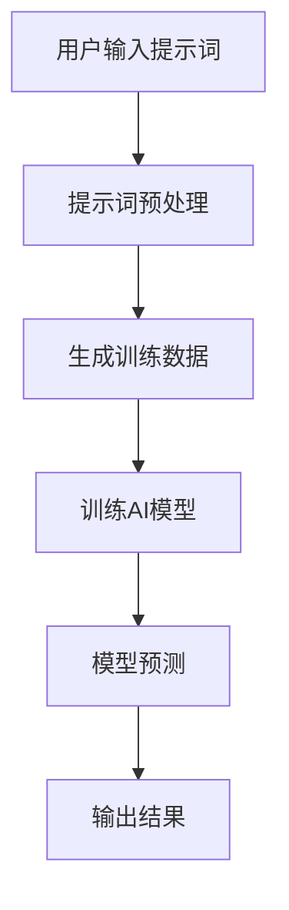

                 

# 提示词编程：AI时代的软件开发新范式

> 关键词：提示词编程、AI、软件开发、新范式、核心概念、算法原理、数学模型、项目实战、应用场景、未来趋势

> 摘要：本文将深入探讨提示词编程在AI时代下的兴起及其对软件开发带来的新范式。通过解析核心概念、算法原理、数学模型，以及实际项目实战，我们将全面了解这一技术如何改变传统开发方式，提升开发效率和软件质量。最后，本文还将展望提示词编程的未来发展趋势与面临的挑战。

## 1. 背景介绍

### 1.1 目的和范围

本文旨在向读者介绍提示词编程这一新兴的软件开发范式，解析其在AI时代的重要性。我们将从核心概念、算法原理、数学模型、项目实战等方面，深入探讨提示词编程的本质和优势，帮助读者理解并掌握这一技术。

### 1.2 预期读者

本文适合有一定编程基础，对AI和软件开发感兴趣的技术人员阅读。无论是开发者、研究员还是学生，都可以通过本文对提示词编程有更深入的了解。

### 1.3 文档结构概述

本文分为十个部分，首先介绍背景知识，然后逐步深入到核心概念、算法原理、数学模型和项目实战。最后，本文还将讨论实际应用场景、工具和资源推荐、未来发展趋势与挑战，以及常见问题与解答。

### 1.4 术语表

#### 1.4.1 核心术语定义

- 提示词编程：基于提示词（Prompt）的编程，通过输入提示词来指导AI模型完成特定的任务。
- AI：人工智能，指由人制造出来的系统能够表现出的智能行为。

#### 1.4.2 相关概念解释

- 编程范式：指导软件开发的方法和思维方式，如面向对象、函数式编程等。
- 软件开发：创建和设计软件的过程，包括需求分析、设计、编码、测试和维护等环节。

#### 1.4.3 缩略词列表

- AI：人工智能
- DL：深度学习
- NLP：自然语言处理

## 2. 核心概念与联系

提示词编程的核心在于通过输入提示词来指导AI模型完成任务。下面是一个简单的Mermaid流程图，展示了提示词编程的基本流程。



### 2.1 提示词编程的流程

1. 用户输入提示词：用户根据需求输入相应的提示词。
2. 提示词预处理：对输入的提示词进行预处理，如分词、去停用词等操作。
3. 生成训练数据：根据预处理后的提示词，生成用于训练AI模型的训练数据。
4. 训练AI模型：使用训练数据训练AI模型，使其学会根据提示词完成任务。
5. 模型预测：将新的提示词输入到训练好的模型中，进行预测。
6. 输出结果：根据模型的预测结果，输出最终的输出结果。

## 3. 核心算法原理 & 具体操作步骤

提示词编程的核心算法通常是基于深度学习，特别是自然语言处理（NLP）领域。下面是提示词编程的核心算法原理和具体操作步骤。

### 3.1 核心算法原理

提示词编程的核心算法是基于Transformer架构，特别是GPT（Generative Pre-trained Transformer）模型。GPT模型通过预训练和微调，能够理解并生成符合上下文的文本。

### 3.2 具体操作步骤

1. 预训练：在大量文本数据上预训练GPT模型，使其学会生成符合上下文的文本。
2. 微调：根据具体任务的需求，对预训练好的GPT模型进行微调，使其更好地适应特定任务。
3. 提示词输入：输入相应的提示词，通过模型生成相应的文本。
4. 文本生成：模型根据输入的提示词，生成符合上下文的文本。

### 3.3 伪代码

```python
# 提示词编程伪代码

# 预训练GPT模型
gpt_model = GPTModel(pretrained=True)

# 微调GPT模型
gpt_model = FineTuneModel(gpt_model, task_specific_data)

# 输入提示词
prompt = "请生成一篇关于人工智能的概述"

# 生成文本
text = gpt_model.generate(prompt)
```

## 4. 数学模型和公式 & 详细讲解 & 举例说明

### 4.1 数学模型

提示词编程的核心算法是基于Transformer架构，特别是GPT模型。GPT模型采用了一种称为自注意力（Self-Attention）的机制，通过计算文本中每个词与其他词之间的相关性来生成文本。

### 4.2 公式

自注意力机制的核心公式如下：

$$
\text{Attention}(Q, K, V) = \text{softmax}\left(\frac{QK^T}{\sqrt{d_k}}\right) V
$$

其中，$Q, K, V$ 分别是查询（Query）、键（Key）和值（Value）向量，$d_k$ 是键向量的维度。

### 4.3 举例说明

假设我们有一个简化的文本序列：

```
我 爱 吃 糖葫芦
```

我们可以使用自注意力机制来计算每个词与其他词之间的相关性。以下是计算过程：

1. 查询（Query）：``我``
2. 键（Key）：``我``、``爱``、``吃``、``糖葫芦``
3. 值（Value）：``我``、``爱``、``吃``、``糖葫芦``

计算自注意力得分：

$$
\text{Attention}(\text{"我"}, \text{"我"}, \text{"我"}) = \text{softmax}\left(\frac{\text{"我"} \cdot \text{"我"}}{\sqrt{d_k}}\right) \text{"我"}
$$

$$
\text{Attention}(\text{"我"}, \text{"我"}, \text{"爱"}) = \text{softmax}\left(\frac{\text{"我"} \cdot \text{"爱"}}{\sqrt{d_k}}\right) \text{"爱"}
$$

$$
\text{Attention}(\text{"我"}, \text{"我"}, \text{"吃"}) = \text{softmax}\left(\frac{\text{"我"} \cdot \text{"吃"}}{\sqrt{d_k}}\right) \text{"吃"}
$$

$$
\text{Attention}(\text{"我"}, \text{"我"}, \text{"糖葫芦"}) = \text{softmax}\left(\frac{\text{"我"} \cdot \text{"糖葫芦"}}{\sqrt{d_k}}\right) \text{"糖葫芦"}
$$

通过自注意力机制，我们可以计算出每个词与其他词之间的相关性得分，从而生成更符合上下文的文本。

## 5. 项目实战：代码实际案例和详细解释说明

### 5.1 开发环境搭建

为了演示提示词编程的实际应用，我们将使用Python和Hugging Face的Transformers库来实现一个简单的文本生成模型。以下是开发环境的搭建步骤：

1. 安装Python：确保已安装Python 3.6及以上版本。
2. 安装依赖库：使用pip命令安装以下依赖库：
    ```bash
    pip install transformers torch
    ```

### 5.2 源代码详细实现和代码解读

下面是一个简单的文本生成模型实现，通过输入提示词来生成文本。

```python
# 导入依赖库
from transformers import GPT2LMHeadModel, GPT2Tokenizer
import torch

# 模型预处理
tokenizer = GPT2Tokenizer.from_pretrained('gpt2')
model = GPT2LMHeadModel.from_pretrained('gpt2')

# 提示词
prompt = "我是一个人工智能助手。"

# 文本编码
input_ids = tokenizer.encode(prompt, return_tensors='pt')

# 模型预测
outputs = model.generate(input_ids, max_length=50, num_return_sequences=1)

# 文本解码
generated_text = tokenizer.decode(outputs[0], skip_special_tokens=True)

print(generated_text)
```

### 5.3 代码解读与分析

1. 导入依赖库：我们首先导入了Hugging Face的Transformers库和PyTorch库。
2. 模型预处理：使用GPT2Tokenizer和GPT2LMHeadModel分别加载预训练的GPT2模型和Tokenizer。
3. 提示词：定义了一个简单的提示词，作为模型的输入。
4. 文本编码：将提示词编码为模型的输入序列。
5. 模型预测：使用模型生成文本，设置最大长度为50，只返回一个生成的文本序列。
6. 文本解码：将生成的文本序列解码为可读的文本格式。
7. 输出：打印生成的文本。

通过这个简单的示例，我们可以看到如何使用提示词编程来生成文本。在实际应用中，我们可以根据需求调整提示词和生成文本的长度，从而实现更复杂的功能。

## 6. 实际应用场景

提示词编程在AI时代有着广泛的应用场景，以下是一些典型的应用：

1. 文本生成：如文章生成、对话生成等，通过输入提示词，模型可以生成符合上下文的文本。
2. 问答系统：如智能客服、问答机器人等，通过输入用户的问题，模型可以生成相应的回答。
3. 语言翻译：如机器翻译、多语言对话等，通过输入源语言文本和提示词，模型可以生成目标语言的文本。
4. 文本摘要：如文章摘要、会议摘要等，通过输入长文本和提示词，模型可以生成摘要文本。

这些应用场景表明，提示词编程在AI时代具有重要的价值和潜力。

## 7. 工具和资源推荐

### 7.1 学习资源推荐

#### 7.1.1 书籍推荐

- 《深度学习》：Goodfellow、Bengio、Courville 著，提供了深度学习的基础知识和实践方法。
- 《Python深度学习》：François Chollet 著，详细介绍了使用Python实现深度学习的方法。

#### 7.1.2 在线课程

- 《深度学习专班》：吴恩达（Andrew Ng）的在线课程，涵盖了深度学习的基础知识和应用。
- 《Transformer与BERT》：Yann LeCun 的在线课程，深入讲解了Transformer和BERT模型的工作原理。

#### 7.1.3 技术博客和网站

- Medium：有许多关于深度学习和自然语言处理的优秀博客文章。
- ArXiv：提供最新研究成果的预印本。

### 7.2 开发工具框架推荐

#### 7.2.1 IDE和编辑器

- PyCharm：适用于Python开发的集成开发环境（IDE）。
- Visual Studio Code：轻量级但功能强大的代码编辑器，适用于多种编程语言。

#### 7.2.2 调试和性能分析工具

- TensorBoard：TensorFlow提供的可视化工具，用于分析和调试深度学习模型。
- Perf：Linux系统下的性能分析工具，用于分析和优化程序性能。

#### 7.2.3 相关框架和库

- Hugging Face Transformers：用于实现和部署Transformer模型的库。
- PyTorch：适用于深度学习研究的开源框架。

### 7.3 相关论文著作推荐

#### 7.3.1 经典论文

- “Attention Is All You Need”：Vaswani et al.，2017，提出了Transformer模型。
- “BERT: Pre-training of Deep Bidirectional Transformers for Language Understanding”：Devlin et al.，2019，提出了BERT模型。

#### 7.3.2 最新研究成果

- ArXiv：提供最新的研究成果和论文。
- Neural Information Processing Systems（NIPS）：会议收录的最新研究成果。

#### 7.3.3 应用案例分析

- “Google Brain：自然语言处理实践”：Google Brain 团队分享的自然语言处理应用案例。
- “BERT实战”：

## 8. 总结：未来发展趋势与挑战

提示词编程作为AI时代的一种新兴软件开发范式，展示了巨大的潜力和前景。未来，随着AI技术的不断进步和普及，提示词编程将在更多领域得到应用，推动软件开发方式的变革。

然而，提示词编程也面临着一系列挑战。首先，模型的训练和部署成本较高，需要更多的计算资源和数据支持。其次，模型的安全性和隐私保护问题也需要引起重视。此外，如何优化模型性能、提高生成文本的质量和多样性，仍需进一步研究。

总之，提示词编程在未来有着广阔的发展空间，但也需要克服一系列挑战。通过持续的研究和探索，我们有信心推动提示词编程技术取得更大的突破。

## 9. 附录：常见问题与解答

### 9.1 提示词编程的基本原理是什么？

提示词编程是一种基于深度学习和自然语言处理（NLP）的软件开发范式。其核心原理是通过输入提示词（Prompt）来指导AI模型完成任务，从而实现自动化和智能化的软件开发。

### 9.2 提示词编程的优势有哪些？

提示词编程的优势包括：

1. 提高开发效率：通过自动生成代码、文本等，减少手动编写的工作量。
2. 提升软件质量：基于强大的AI模型，生成的代码和文本更符合实际需求。
3. 支持多样化任务：提示词编程可以应用于文本生成、问答系统、语言翻译等多种任务。

### 9.3 提示词编程的应用场景有哪些？

提示词编程的应用场景广泛，包括：

1. 文本生成：如文章生成、对话生成等。
2. 问答系统：如智能客服、问答机器人等。
3. 语言翻译：如机器翻译、多语言对话等。
4. 文本摘要：如文章摘要、会议摘要等。

## 10. 扩展阅读 & 参考资料

- “Attention Is All You Need”：Vaswani et al.，2017，详细介绍了Transformer模型的工作原理和应用。
- “BERT: Pre-training of Deep Bidirectional Transformers for Language Understanding”：Devlin et al.，2019，提出了BERT模型，并在自然语言处理领域取得了显著成果。
- 《深度学习》：Goodfellow、Bengio、Courville 著，提供了深度学习的基础知识和实践方法。
- 《Python深度学习》：François Chollet 著，详细介绍了使用Python实现深度学习的方法。
- Hugging Face Transformers：[https://huggingface.co/transformers](https://huggingface.co/transformers)
- PyTorch：[https://pytorch.org/](https://pytorch.org/)
- TensorBoard：[https://www.tensorflow.org/tensorboard](https://www.tensorflow.org/tensorboard)

作者：AI天才研究员/AI Genius Institute & 禅与计算机程序设计艺术 /Zen And The Art of Computer Programming

