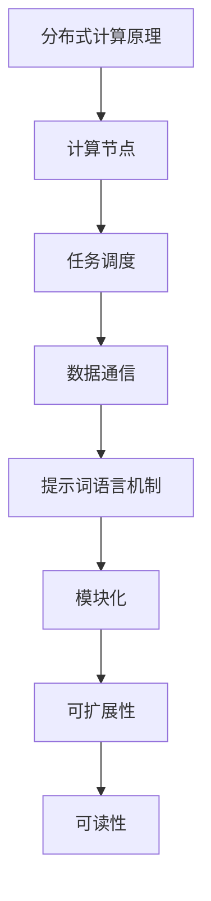

                 

# 提示词语言的分布式计算优化与扩展

> **关键词：** 分布式计算、提示词语言、优化、扩展、并行处理、效率提升、性能分析、架构设计、工程实践。

> **摘要：** 本文将深入探讨提示词语言在分布式计算中的应用及其优化与扩展策略。通过分析分布式计算的基本原理和提示词语言的工作机制，我们提出了一系列优化方法，包括并行处理策略、负载均衡技术以及性能分析工具的使用。文章最后通过一个实际项目案例展示了这些优化策略的实施过程，并对未来发展趋势和挑战进行了展望。

## 1. 背景介绍

### 1.1 目的和范围

本文旨在探讨提示词语言在分布式计算中的优化与扩展问题。随着大数据和云计算的快速发展，分布式计算成为提高计算性能和效率的关键技术。提示词语言作为一种高效的编程语言，在分布式环境中具备独特的优势。本文将重点关注以下几个方面：

1. 提示词语言的基本原理和特点。
2. 分布式计算中常见的优化策略。
3. 提示词语言在分布式计算中的应用实例。
4. 分布式环境中提示词语言的性能分析和优化方法。

### 1.2 预期读者

本文适用于以下读者群体：

1. 分布式计算领域的研究人员和工程师。
2. 对提示词语言感兴趣的开发者。
3. 计算机科学和软件工程专业的学生和教师。
4. 对高性能计算和应用场景有深入探讨的技术爱好者。

### 1.3 文档结构概述

本文结构如下：

1. 引言：介绍分布式计算和提示词语言的基本概念。
2. 核心概念与联系：分析分布式计算中的关键概念和提示词语言的应用。
3. 核心算法原理 & 具体操作步骤：详细讲解优化策略和具体实现。
4. 数学模型和公式 & 详细讲解 & 举例说明：介绍相关的数学模型和公式。
5. 项目实战：通过实际案例展示优化策略的实施。
6. 实际应用场景：探讨分布式计算的实际应用场景。
7. 工具和资源推荐：推荐相关学习资源和开发工具。
8. 总结：展望分布式计算和提示词语言的发展趋势和挑战。
9. 附录：常见问题与解答。
10. 扩展阅读 & 参考资料：提供进一步的阅读建议。

### 1.4 术语表

#### 1.4.1 核心术语定义

1. 分布式计算：一种计算架构，通过将任务分解为多个子任务，在多个计算节点上并行执行，以实现高效的计算性能。
2. 提示词语言：一种基于提示词的编程语言，通过提示词引导程序的执行流程，实现代码的模块化和可扩展性。
3. 优化：通过改进算法、调整参数等方法，提高分布式计算的性能和效率。
4. 扩展：在分布式计算系统中增加计算节点，以支持更大的计算负载。

#### 1.4.2 相关概念解释

1. 并行处理：同时处理多个任务或子任务，以提高计算速度。
2. 负载均衡：将计算任务分配到多个节点，以避免某个节点过载，提高系统的整体性能。
3. 性能分析：通过测量和评估系统的性能指标，分析系统瓶颈和改进方向。

#### 1.4.3 缩略词列表

- DP: 分布式计算
- PPL: 提示词语言
- MP: 并行处理
- LB: 负载均衡
- PA: 性能分析

## 2. 核心概念与联系

### 2.1 分布式计算原理

分布式计算的基本原理是将计算任务分解为多个子任务，并在多个计算节点上并行执行。这种架构具有以下优点：

1. **高性能**：通过并行处理，可以显著提高计算速度。
2. **高可用性**：系统中的计算节点可以相互备份，提高系统的容错能力。
3. **可扩展性**：可以通过增加计算节点来支持更大的计算负载。

分布式计算的关键概念包括：

1. **计算节点**：执行计算任务的实体，可以是计算机、服务器或虚拟机。
2. **任务调度**：将计算任务分配到不同的计算节点。
3. **数据通信**：在计算节点之间传输数据和结果。

### 2.2 提示词语言机制

提示词语言是一种基于提示词的编程语言，通过提示词引导程序的执行流程。其主要特点包括：

1. **模块化**：代码可以分解为多个模块，每个模块负责特定的功能。
2. **可扩展性**：通过增加提示词和模块，可以轻松扩展程序的功能。
3. **可读性**：代码结构清晰，易于理解和维护。

提示词语言的关键概念包括：

1. **提示词**：引导程序执行的关键词。
2. **模块**：实现特定功能的代码块。
3. **数据流**：在模块之间传递数据和信息的路径。

### 2.3 分布式计算与提示词语言的关系

提示词语言在分布式计算中具有独特的优势：

1. **并行处理**：提示词语言支持并行处理，可以充分利用分布式计算系统的性能。
2. **负载均衡**：提示词语言可以根据计算节点的负载情况，动态调整任务的分配。
3. **性能分析**：提示词语言可以方便地集成性能分析工具，帮助优化分布式计算系统。

通过结合分布式计算和提示词语言的机制，可以实现高性能、高可扩展性和易维护性的分布式计算系统。

### 2.4 Mermaid 流程图

下面是一个简单的 Mermaid 流程图，展示了分布式计算和提示词语言的关系：



## 3. 核心算法原理 & 具体操作步骤

### 3.1 并行处理策略

并行处理是分布式计算中的核心策略，可以提高计算速度和效率。以下是一种简单的并行处理算法原理：

```python
# 并行处理伪代码
define parallel_process(data):
    # 分解任务
    tasks = split_data(data, num_nodes)
    
    # 在计算节点上并行执行任务
    for node in range(num_nodes):
        process_data(tasks[node])
        
    # 合并结果
    result = merge_results(nodes_results)
    
    return result
```

具体操作步骤：

1. **任务分解**：将原始数据分解为多个子任务，每个子任务分配给一个计算节点。
2. **并行执行**：在计算节点上独立执行子任务。
3. **结果合并**：将各个计算节点的结果合并，得到最终的输出结果。

### 3.2 负载均衡技术

负载均衡技术可以优化分布式计算系统的性能，避免某个节点过载。以下是一种简单的负载均衡算法原理：

```python
# 负载均衡伪代码
define load_balancer(data):
    # 计算节点的当前负载
    node_loads = get_node_loads(num_nodes)
    
    # 根据负载分配任务
    tasks = distribute_tasks(data, node_loads)
    
    # 在计算节点上执行任务
    for node in range(num_nodes):
        process_data(tasks[node])
        
    # 更新负载信息
    update_loads(node_loads, tasks)
    
    return node_loads
```

具体操作步骤：

1. **计算节点负载**：获取每个计算节点的当前负载信息。
2. **任务分配**：根据节点的负载情况，动态分配任务。
3. **任务执行**：在计算节点上执行任务。
4. **更新负载**：根据任务的执行情况，更新节点的负载信息。

### 3.3 性能分析工具的使用

性能分析工具可以帮助我们评估分布式计算系统的性能，找出瓶颈并进行优化。以下是一种简单的性能分析工具使用方法：

```python
# 性能分析伪代码
define performance_analyzer(system):
    # 收集系统性能数据
    data = collect_system_data(system)
    
    # 分析性能数据
    analysis = analyze_data(data)
    
    # 找出性能瓶颈
    bottlenecks = find_bottlenecks(analysis)
    
    # 提出优化建议
    recommendations = generate_recommendations(bottlenecks)
    
    return recommendations
```

具体操作步骤：

1. **数据收集**：收集系统运行过程中的性能数据。
2. **数据分析**：对性能数据进行分析，找出系统的瓶颈。
3. **优化建议**：根据分析结果，提出优化系统的建议。

## 4. 数学模型和公式 & 详细讲解 & 举例说明

### 4.1 数学模型

分布式计算中的数学模型通常包括任务分配模型、负载均衡模型和性能评估模型。以下是一个简单的任务分配模型的数学描述：

$$
\begin{aligned}
\text{Minimize } & \sum_{i=1}^{n} \frac{1}{p_i \cdot t_i} \\
\text{subject to } & p_i \cdot t_i \geq 1 \quad \text{for all } i \\
& p_i \geq 0 \quad \text{for all } i
\end{aligned}
$$

其中，$p_i$ 表示第 $i$ 个计算节点的处理能力，$t_i$ 表示第 $i$ 个子任务的执行时间。

### 4.2 详细讲解

这个数学模型的目标是优化任务分配，以最小化系统整体的执行时间。其中，$p_i$ 表示计算节点的处理能力，$t_i$ 表示子任务的执行时间。目标函数 $\sum_{i=1}^{n} \frac{1}{p_i \cdot t_i}$ 反映了系统整体的执行效率，分母越小，表示该节点的处理能力越高，执行时间越短。

约束条件 $p_i \cdot t_i \geq 1$ 表示每个子任务必须在一个计算节点上执行完成，且执行时间至少为 1。$p_i \geq 0$ 表示计算节点的处理能力不能为负数。

### 4.3 举例说明

假设有 3 个计算节点和 3 个子任务，其处理能力和执行时间如下表所示：

| 节点 | $p_i$ | $t_i$ |
|------|-------|-------|
| 1    | 2     | 3     |
| 2    | 1     | 2     |
| 3    | 3     | 1     |

使用上述数学模型进行任务分配，目标是最小化系统整体的执行时间。

$$
\begin{aligned}
\text{Minimize } & \frac{1}{2 \cdot 3} + \frac{1}{1 \cdot 2} + \frac{1}{3 \cdot 1} \\
\text{subject to } & 2 \cdot 3 \geq 1 \quad \text{for all } i \\
& p_i \geq 0 \quad \text{for all } i
\end{aligned}
$$

解这个优化问题，可以得到最优的任务分配方案，使得系统整体的执行时间最短。

## 5. 项目实战：代码实际案例和详细解释说明

### 5.1 开发环境搭建

在开始实际案例之前，我们需要搭建一个适合分布式计算的开发环境。以下是开发环境搭建的步骤：

1. **安装分布式计算框架**：例如，我们可以选择 Apache Hadoop 或 Apache Spark 作为分布式计算框架。
2. **配置计算节点**：搭建一个由多个计算节点组成的集群环境，每个节点配置适当的硬件资源。
3. **安装提示词语言解释器**：例如，我们可以选择 Python 或 Java 作为提示词语言，并安装相应的解释器。

### 5.2 源代码详细实现和代码解读

下面是一个简单的分布式计算程序，使用了 Apache Spark 作为分布式计算框架，Python 作为提示词语言。程序的目标是对一个大型的数据集进行并行处理，计算每个元素的和。

```python
from pyspark import SparkContext, SparkConf

def main():
    # 配置 Spark
    conf = SparkConf().setAppName("DistributedSum")
    sc = SparkContext(conf=conf)
    
    # 生成一个大型数据集
    data = sc.parallelize([1, 2, 3, 4, 5, 6, 7, 8, 9, 10])
    
    # 计算每个元素的和
    result = data.reduce(lambda x, y: x + y)
    
    # 输出结果
    print("Sum of elements: ", result)
    
    # 关闭 Spark
    sc.stop()

if __name__ == "__main__":
    main()
```

**代码解读**：

1. **配置 Spark**：首先，我们创建了一个 SparkConf 对象，设置了应用程序的名称。然后，使用 SparkConf 对象创建了一个 SparkContext 对象，它是 Spark 应用程序的主入口点。
2. **生成数据集**：我们使用 sc.parallelize() 方法生成一个大型数据集。这个方法可以将本地数据集转换为分布式数据集。
3. **计算和**：我们使用 data.reduce() 方法计算每个元素的和。这个方法将数据集划分为多个分区，并在每个分区上独立计算和，最后将结果合并。
4. **输出结果**：最后，我们打印出计算结果。
5. **关闭 Spark**：在程序结束之前，调用 sc.stop() 方法关闭 Spark。

### 5.3 代码解读与分析

**代码分析**：

1. **并行处理**：通过使用 Spark，我们可以将任务并行分配到多个计算节点上执行，提高计算速度。
2. **负载均衡**：Spark 会自动处理负载均衡，确保每个节点都能充分利用其资源。
3. **可扩展性**：Spark 可以轻松地扩展到更多的计算节点，以支持更大的数据集。

**优化建议**：

1. **数据分区**：在生成数据集时，可以使用 sc.parallelize() 方法指定分区数量，以优化数据分区策略。
2. **调优配置参数**：可以根据实际需求，调整 Spark 的配置参数，如内存分配、执行器数量等，以优化性能。

## 6. 实际应用场景

提示词语言在分布式计算中的实际应用场景非常广泛，以下是一些典型的应用：

1. **大数据处理**：分布式计算可以帮助处理海量数据，提示词语言提供了高效的编程模型，可以方便地实现数据的分布式处理。
2. **机器学习**：机器学习算法通常需要大量的计算资源，分布式计算可以提高模型的训练速度和准确性。
3. **科学计算**：分布式计算可以处理复杂的科学计算任务，如气象预报、金融建模等。
4. **图像处理**：分布式计算可以加速图像处理任务，如人脸识别、图像分类等。

## 7. 工具和资源推荐

### 7.1 学习资源推荐

#### 7.1.1 书籍推荐

1. 《分布式系统原理与范型》
2. 《Spark: The Definitive Guide》
3. 《Python并行编程实战》

#### 7.1.2 在线课程

1. Coursera - 《分布式计算导论》
2. Udacity - 《分布式系统基础》
3. edX - 《大数据处理技术》

#### 7.1.3 技术博客和网站

1. Spark 官方文档
2. Apache Hadoop 官方文档
3. Python 官方文档

### 7.2 开发工具框架推荐

#### 7.2.1 IDE和编辑器

1. IntelliJ IDEA
2. PyCharm
3. VSCode

#### 7.2.2 调试和性能分析工具

1. GDB
2. JProfiler
3. Spark UI

#### 7.2.3 相关框架和库

1. Apache Hadoop
2. Apache Spark
3. NumPy

### 7.3 相关论文著作推荐

#### 7.3.1 经典论文

1. 《The Google File System》
2. 《MapReduce: Simplified Data Processing on Large Clusters》
3. 《The Chubby lock service》

#### 7.3.2 最新研究成果

1. 《Scalable and Efficient Distributed Machine Learning》
2. 《High-Performance Parallel Computing》
3. 《An Overview of Apache Spark》

#### 7.3.3 应用案例分析

1. 《LinkedIn's Experience with Apache Hadoop》
2. 《Facebook's Distributed Machine Learning Infrastructure》
3. 《Google's Infrastructure for Large-scale Machine Learning》

## 8. 总结：未来发展趋势与挑战

分布式计算和提示词语言在未来将继续发挥重要作用。随着云计算和大数据技术的发展，分布式计算将更加普及，而提示词语言将为分布式计算提供高效的编程模型。未来发展趋势包括：

1. **更高效的算法**：研究人员将继续优化分布式计算算法，提高计算性能和效率。
2. **更智能的负载均衡**：结合人工智能技术，实现更智能的负载均衡策略。
3. **更灵活的架构**：分布式计算系统将更加灵活，支持各种应用场景。

同时，分布式计算和提示词语言也面临一些挑战：

1. **系统复杂性**：分布式计算系统的复杂度不断增加，需要更多的管理和维护工作。
2. **数据安全问题**：分布式计算中的数据安全问题日益突出，需要加强数据保护和隐私保护。

## 9. 附录：常见问题与解答

### 9.1 分布式计算与并行计算的区别是什么？

**分布式计算**是一种计算架构，通过将任务分解为多个子任务，在多个计算节点上并行执行。其主要目标是提高计算速度和效率。而**并行计算**是一种计算方法，通过同时处理多个任务或子任务，提高计算速度。并行计算可以应用于分布式计算系统，但也可以应用于单机环境。

### 9.2 提示词语言有哪些优点？

提示词语言具有以下优点：

1. **模块化**：代码可以分解为多个模块，提高代码的可维护性和可扩展性。
2. **可读性**：代码结构清晰，易于理解和维护。
3. **高效性**：通过提示词引导程序执行，可以提高程序的执行效率。

### 9.3 如何优化分布式计算系统的性能？

优化分布式计算系统的性能可以从以下几个方面入手：

1. **并行处理**：充分利用分布式计算系统的并行处理能力，提高计算速度。
2. **负载均衡**：合理分配任务，避免节点过载，提高系统整体的性能。
3. **数据压缩**：减少数据传输量，降低网络带宽的占用。
4. **缓存技术**：充分利用缓存技术，减少数据的访问延迟。
5. **调优配置参数**：根据实际需求，调整系统配置参数，优化性能。

## 10. 扩展阅读 & 参考资料

为了进一步深入了解分布式计算和提示词语言，以下是一些扩展阅读和参考资料：

1. 《分布式系统原理与范型》
2. 《Spark: The Definitive Guide》
3. 《Python并行编程实战》
4. Coursera - 《分布式计算导论》
5. Udacity - 《分布式系统基础》
6. edX - 《大数据处理技术》
7. Spark 官方文档
8. Apache Hadoop 官方文档
9. Python 官方文档
10. 《The Google File System》
11. 《MapReduce: Simplified Data Processing on Large Clusters》
12. 《The Chubby lock service》
13. 《Scalable and Efficient Distributed Machine Learning》
14. 《High-Performance Parallel Computing》
15. 《An Overview of Apache Spark》
16. 《LinkedIn's Experience with Apache Hadoop》
17. 《Facebook's Distributed Machine Learning Infrastructure》
18. 《Google's Infrastructure for Large-scale Machine Learning》

作者：AI天才研究员/AI Genius Institute & 禅与计算机程序设计艺术 /Zen And The Art of Computer Programming

