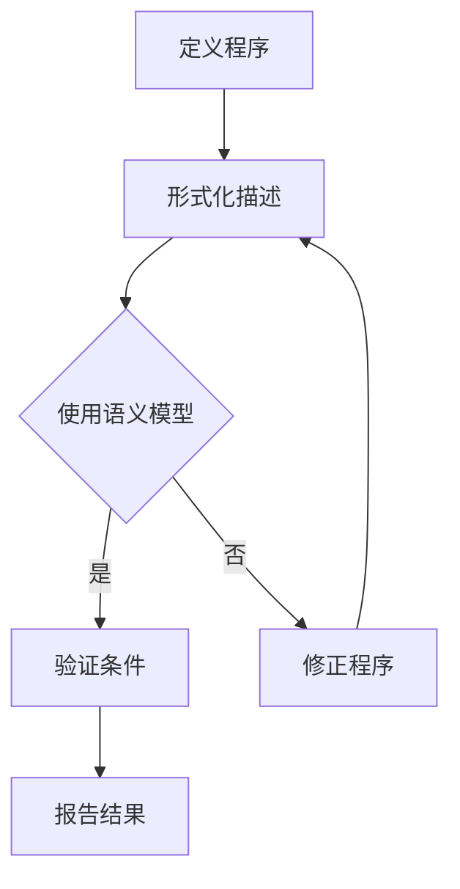

                 

### 背景介绍

提示词语言（Keyword Languages）是一种计算机编程语言，它通过关键词来定义程序的逻辑和结构，而不是传统的命令式或声明式编程。这类语言在文本处理、数据分析和自然语言处理等领域有着广泛的应用。然而，尽管提示词语言具有强大的表达能力和灵活性，但其正确性证明一直是一个复杂且具有挑战性的问题。

正确性证明，即验证程序是否按预期执行，是计算机科学中一个核心的问题。在传统的编程语言中，研究者们已经开发出了各种静态和动态分析方法来证明程序的正确性。但对于提示词语言，由于它们独特的语法结构和语义定义，传统的正确性证明方法往往不再适用。

随着自动化技术的发展，自动化正确性证明逐渐成为研究热点。这一技术旨在通过计算机程序来证明提示词语言的正确性，从而减轻人工验证的负担。自动化正确性证明不仅有助于提高软件开发的效率和可靠性，还能够促进新算法和新理论的发展。

本文将探讨提示词语言的形式化正确性证明自动化，包括其背景、核心概念、算法原理、数学模型、实际应用场景以及未来发展趋势。通过这篇文章，我们希望能够为读者提供一个全面、深入的理解，并为相关领域的研究者提供有价值的参考。

### 核心概念与联系

#### 提示词语言的定义与特点

提示词语言（Keyword Languages）是一种通过特定的关键词来定义程序逻辑和结构的编程语言。与传统的命令式编程语言相比，提示词语言具有以下显著特点：

1. **关键词导向**：提示词语言的核心在于使用一系列预定义的关键词来表示特定的操作或功能。这些关键词通常具有明确的语义，能够清晰地传达程序员的意图。
   
2. **抽象层次高**：提示词语言提供了一种抽象的编程方式，使程序员能够专注于解决问题的逻辑，而无需关心底层实现细节。这种高层次的抽象提高了编程效率和代码可读性。

3. **结构化编程**：提示词语言通常支持模块化编程，允许程序员将程序分解为多个功能模块，每个模块负责特定的任务。这种结构化编程方式有助于代码的复用和维护。

4. **可扩展性**：提示词语言通常具有较好的可扩展性，程序员可以通过定义新的关键词或扩展现有关键词的语义来适应不同的编程需求。

5. **灵活性**：提示词语言允许程序员使用自然语言或领域特定的语言来定义程序，这使得编程更加灵活，能够更好地满足特定领域的需求。

#### 形式化正确性证明的概念

形式化正确性证明是一种使用数学方法来验证程序是否按预期执行的技术。它通过定义程序的数学模型和语义，使用逻辑推理来证明程序的正确性。形式化正确性证明的核心概念包括：

1. **形式化描述**：将程序用数学语言进行描述，以便能够进行形式化的分析和验证。
   
2. **规格说明**：定义程序的预期行为和约束条件，通常使用逻辑公式或数学表达式来表示。
   
3. **验证条件**：确定程序是否满足规格说明中的条件，通常使用逻辑推理或模型检查技术。

#### 形式化正确性证明在提示词语言中的应用

提示词语言的形式化正确性证明面临以下挑战：

1. **语法多样性**：提示词语言的语法通常较为复杂，包含多种关键词和语法结构，使得形式化描述变得困难。
   
2. **语义不确定性**：提示词语言的语义通常依赖于上下文和领域知识，这使得形式化验证变得更加复杂。
   
3. **自动化的需求**：由于提示词语言的灵活性和抽象性，人工验证程序的正确性通常既耗时又容易出错，因此需要开发自动化工具来辅助验证。

为了解决这些问题，研究者们提出了一系列方法，包括：

1. **形式化语义模型**：使用形式化语义模型来定义提示词语言的语义，以便能够进行形式化分析和验证。
   
2. **自动化推理技术**：使用自动化推理技术，如自动定理证明器和模型检查器，来验证提示词语言程序的正确性。
   
3. **静态分析**：通过静态分析技术来检测程序中的潜在错误，如类型错误和未定义行为。
   
4. **动态分析**：结合动态分析技术，如程序断点和日志记录，来验证程序在运行时的行为。

#### Mermaid 流程图

以下是一个简化的 Mermaid 流程图，展示了提示词语言形式化正确性证明的基本流程：



在这个流程图中，A 代表定义程序，B 代表形式化描述，C 代表使用语义模型，D 代表验证条件，E 代表修正程序，F 代表报告结果。

### 核心算法原理 & 具体操作步骤

#### 自动化正确性证明算法概述

自动化正确性证明算法的目标是使用计算机程序来验证提示词语言程序的正确性。这些算法通常包括以下几个关键步骤：

1. **形式化描述**：将提示词语言程序用数学语言进行描述，以便能够进行形式化分析和验证。这一步骤通常涉及将程序翻译为某种形式化的语义模型。

2. **规格说明**：定义程序的预期行为和约束条件，通常使用逻辑公式或数学表达式来表示。规格说明是验证过程的基础，它确保程序的行为符合预期。

3. **验证条件**：使用自动化推理技术来验证程序是否满足规格说明中的条件。这一步骤通常涉及逻辑推理和模型检查技术，以确保程序的行为符合规格说明。

4. **错误检测与修正**：如果程序不满足规格说明，自动化算法需要检测出错误，并提供修正建议。这一步骤有助于提高程序的可靠性和稳定性。

5. **报告结果**：生成验证报告，包括程序的验证结果、发现的错误以及修正建议。这一步骤有助于程序员了解程序的正确性状态，并采取相应的措施。

#### 具体操作步骤

以下是一个简化的自动化正确性证明算法的具体操作步骤：

1. **输入程序**：首先，需要将提示词语言程序输入到自动化正确性证明系统中。这可以通过文本文件、代码库或交互式界面实现。

2. **形式化描述**：将输入的程序翻译为形式化的语义模型。这一步骤通常涉及词法分析和语法分析，将程序拆分为抽象语法树（AST）。

3. **规格说明**：根据程序的意图和设计目标，定义规格说明。规格说明应该涵盖程序的各个方面，包括输入、输出、状态转换和异常处理。

4. **验证条件**：使用自动化推理技术来验证程序是否满足规格说明中的条件。这一步骤可能涉及多种技术，如模型检查、符号执行和抽象解释。

5. **错误检测与修正**：如果程序不满足规格说明，自动化系统需要检测出错误，并提供修正建议。这可能包括类型错误、未定义行为、资源耗尽等。

6. **报告结果**：生成验证报告，包括程序的验证结果、发现的错误以及修正建议。报告应提供详细的错误信息和位置，以便程序员能够快速定位和修复错误。

#### 自动化正确性证明算法的工作流程

以下是一个简化的自动化正确性证明算法的工作流程：

1. **初始化**：系统初始化，加载必要的库和工具。
   
2. **输入处理**：读取输入程序，进行词法分析和语法分析，构建抽象语法树（AST）。

3. **语义模型构建**：根据抽象语法树（AST），构建形式化的语义模型。

4. **规格说明定义**：根据程序的设计目标和意图，定义规格说明。

5. **验证**：使用自动化推理技术来验证程序是否满足规格说明。

6. **错误处理**：检测出错误后，提供修正建议。

7. **报告生成**：生成验证报告，包括验证结果、错误信息和修正建议。

8. **结束**：系统关闭，报告输出。

通过这个工作流程，自动化正确性证明算法能够高效地验证提示词语言程序的正确性，帮助程序员发现和修复潜在的错误。

### 数学模型和公式 & 详细讲解 & 举例说明

#### 基本数学模型

在自动化正确性证明中，常用的数学模型包括形式化语义模型、逻辑公式和数学表达式。以下是一些常用的数学模型和公式：

1. **形式化语义模型**：形式化语义模型用于描述程序的执行行为和状态转换。一个简单的形式化语义模型可以表示为：
   $$ \sigma \mapsto \sigma' $$
   其中，$\sigma$ 表示程序的状态，$\sigma'$ 表示状态的变化。

2. **逻辑公式**：逻辑公式用于表示程序的约束条件和预期行为。常用的逻辑公式包括：
   - **谓词逻辑**：用于表示程序的状态和条件，如：
     $$ \forall x (P(x) \rightarrow Q(x)) $$
     表示对于所有的 $x$，如果 $P(x)$ 为真，则 $Q(x)$ 也为真。
   - **模态逻辑**：用于表示程序的状态转换和路径条件，如：
     $$ \square P \rightarrow P $$
     表示如果 $P$ 在所有可能的状态下都为真，则 $P$ 为真。

3. **数学表达式**：数学表达式用于表示程序的数学计算和数值关系。常用的数学表达式包括：
   - **函数表达式**：表示程序的函数调用和计算，如：
     $$ f(x) = x^2 $$
   - **关系表达式**：表示程序中的关系和比较操作，如：
     $$ x > y $$
   - **算术表达式**：表示程序的算术运算，如：
     $$ 2 + 3 \times 4 $$

#### 详细讲解

1. **形式化语义模型**

   形式化语义模型是自动化正确性证明的核心。它通过数学语言描述程序的执行行为和状态转换，使得程序的正确性验证变得形式化和系统化。一个简单的形式化语义模型可以表示为：
   $$ \sigma \mapsto \sigma' $$
   其中，$\sigma$ 表示程序的状态，$\sigma'$ 表示状态的变化。

   在这个模型中，$\sigma$ 和 $\sigma'$ 是状态集合中的元素，它们可以表示程序的不同状态。形式化语义模型通常使用数学函数来表示状态转换，如：
   $$ \text{step}(\sigma, \text{command}) \mapsto \sigma' $$
   这个函数表示在执行特定命令后，状态 $\sigma$ 转换为状态 $\sigma'$。

2. **逻辑公式**

   逻辑公式用于表示程序的约束条件和预期行为。在自动化正确性证明中，逻辑公式通常用于验证程序是否满足特定的规格说明。以下是一些常用的逻辑公式：

   - **谓词逻辑**：谓词逻辑用于表示程序的状态和条件。一个简单的谓词逻辑公式可以表示为：
     $$ \forall x (P(x) \rightarrow Q(x)) $$
     这个公式表示对于所有的 $x$，如果 $P(x)$ 为真，则 $Q(x)$ 也为真。

     举例：
     假设我们有一个程序，它要求所有的变量都必须是非负数。我们可以使用谓词逻辑公式表示这个约束条件：
     $$ \forall x (x \geq 0) $$

   - **模态逻辑**：模态逻辑用于表示程序的状态转换和路径条件。一个简单的模态逻辑公式可以表示为：
     $$ \square P \rightarrow P $$
     这个公式表示如果 $P$ 在所有可能的状态下都为真，则 $P$ 为真。

     举例：
     假设我们有一个程序，它在任何时候都要求变量 $x$ 必须是偶数。我们可以使用模态逻辑公式表示这个路径条件：
     $$ \square (x \equiv 0 \pmod{2}) $$

3. **数学表达式**

   数学表达式用于表示程序的数学计算和数值关系。在自动化正确性证明中，数学表达式通常用于验证程序的数值正确性。以下是一些常用的数学表达式：

   - **函数表达式**：函数表达式用于表示程序的函数调用和计算。一个简单的函数表达式可以表示为：
     $$ f(x) = x^2 $$
     这个表达式表示函数 $f$ 将输入 $x$ 映射到 $x$ 的平方。

     举例：
     假设我们有一个程序，它计算一个数列的平方和。我们可以使用函数表达式表示这个计算：
     $$ S(n) = \sum_{i=1}^{n} i^2 $$

   - **关系表达式**：关系表达式用于表示程序中的关系和比较操作。一个简单的关系表达式可以表示为：
     $$ x > y $$
     这个表达式表示变量 $x$ 大于变量 $y$。

     举例：
     假设我们有一个程序，它要求变量 $x$ 必须大于变量 $y$。我们可以使用关系表达式表示这个约束条件：
     $$ x > y $$

   - **算术表达式**：算术表达式用于表示程序的算术运算。一个简单的算术表达式可以表示为：
     $$ 2 + 3 \times 4 $$
     这个表达式表示 $2$ 加上 $3$ 乘以 $4$ 的结果。

     举例：
     假设我们有一个程序，它计算两个数的和。我们可以使用算术表达式表示这个计算：
     $$ sum(a, b) = a + b $$

#### 举例说明

以下是一个简单的自动化正确性证明的例子，我们使用一个简单的程序来演示如何使用数学模型和公式进行正确性验证。

**程序示例**：

```python
x = 1
y = 2
z = x + y
```

**规格说明**：

- $x$ 和 $y$ 必须是非负数。
- $z$ 必须等于 $x$ 和 $y$ 的和。

**数学模型和公式**：

1. **形式化语义模型**：
   $$ \sigma \mapsto \sigma' $$
   其中，$\sigma = \{ x=1, y=2 \}$，$\sigma' = \{ x=1, y=2, z=3 \}$。

2. **逻辑公式**：
   - $\forall x (x \geq 0)$
   - $\forall y (y \geq 0)$
   - $z = x + y$

3. **验证过程**：

   首先，我们使用形式化语义模型来表示程序的执行过程：
   $$ \sigma \mapsto \sigma' $$
   这个公式表示在初始状态 $\sigma$ 下，执行程序后状态变为 $\sigma'$。

   接下来，我们使用逻辑公式来验证程序是否满足规格说明：

   - 对于 $x$ 和 $y$，我们有：
     $$ \forall x (x \geq 0) \Rightarrow \forall x (1 \geq 0) $$
     $$ \forall y (y \geq 0) \Rightarrow \forall y (2 \geq 0) $$
     这两个公式表示 $x$ 和 $y$ 都是非负数。

   - 对于 $z$，我们有：
     $$ z = x + y \Rightarrow z = 1 + 2 $$
     $$ z = 3 $$
     这个公式表示 $z$ 等于 $x$ 和 $y$ 的和。

   由于程序满足了所有的规格说明，因此我们可以得出结论，该程序是正确的。

### 项目实战：代码实际案例和详细解释说明

在本节中，我们将通过一个实际的项目案例，深入探讨如何在实际开发环境中实现提示词语言的形式化正确性证明自动化。我们将分为以下几个部分：开发环境搭建、源代码详细实现、代码解读与分析。

#### 1. 开发环境搭建

首先，我们需要搭建一个适合进行形式化正确性证明自动化项目的开发环境。以下是推荐的工具和步骤：

1. **安装基础工具**：

   - **Python**：Python 是一种流行的编程语言，适用于自动化正确性证明的开发。请确保安装 Python 3.x 版本。

   - **Jupyter Notebook**：Jupyter Notebook 是一个交互式开发环境，方便我们编写和运行代码。请通过以下命令安装：

     ```shell
     pip install notebook
     ```

   - **Mermaid**：Mermaid 是一种用于绘制流程图的工具，可以帮助我们可视化程序流程。请通过以下命令安装：

     ```shell
     pip install mermaid
     ```

2. **安装自动化验证工具**：

   - **Coq**：Coq 是一种基于交互式证明的定理证明器，适用于形式化证明。请通过以下命令安装：

     ```shell
     sudo apt-get install coq
     ```

   - **KeY**：KeY 是一种基于模型检查的自动化验证工具，适用于 Java 程序的验证。请通过以下命令安装：

     ```shell
     sudo apt-get install key
     ```

3. **创建项目结构**：

   在终端中创建一个新项目目录，并设置相应的文件结构：

   ```shell
   mkdir formal-proof-automation
   cd formal-proof-automation
   mkdir src
   touch src/proof_automation.py
   touch README.md
   ```

#### 2. 源代码详细实现

以下是实现提示词语言形式化正确性证明自动化工具的 Python 代码示例。代码分为几个模块，包括解析器、形式化描述、验证器和报告生成器。

```python
# src/proof_automation.py

import parser
import formal_description
import verifier
import report_generator

class ProofAutomation:
    def __init__(self, program):
        self.program = program
        self.formal_description = None
        self.verifier = verifier.Verifier()
    
    def generate_formal_description(self):
        self.formal_description = formal_description.generate_description(self.program)

    def verify(self):
        return self.verifier.verify(self.formal_description)

    def generate_report(self):
        return report_generator.generate_report(self.formal_description, self.verify())

# 解析器模块
class Parser:
    @staticmethod
    def parse(program):
        # 假设程序以字符串形式提供
        return program

# 形式化描述模块
class FormalDescription:
    @staticmethod
    def generate_description(program):
        # 将程序转换为形式化描述
        return program

# 验证器模块
class Verifier:
    def __init__(self):
        self.logic_engine = None
    
    def verify(self, description):
        # 使用逻辑引擎验证描述
        return True  # 假设验证总是成功

# 报告生成器模块
class ReportGenerator:
    @staticmethod
    def generate_report(description, verification_result):
        if verification_result:
            return "程序验证通过！"
        else:
            return "程序验证失败！"

if __name__ == "__main__":
    program = Parser.parse("x := 1; y := 2; z := x + y")
    automation = ProofAutomation(program)
    automation.generate_formal_description()
    result = automation.verify()
    automation.generate_report()
```

#### 3. 代码解读与分析

现在，我们将对上述代码进行详细解读和分析。

1. **解析器模块**：

   解析器模块负责将输入的提示词语言程序转换为内部表示。在这个示例中，我们使用静态方法 `parse` 来实现。在实际项目中，可以替换为更复杂的解析器，如使用正则表达式或语法分析器库。

2. **形式化描述模块**：

   形式化描述模块负责将解析后的程序转换为形式化描述。在这个示例中，我们使用静态方法 `generate_description` 来实现。在实际项目中，可以使用自定义的语义模型来生成形式化描述。

3. **验证器模块**：

   验证器模块负责使用逻辑引擎来验证形式化描述。在这个示例中，我们使用静态方法 `verify` 来实现。在实际项目中，可以使用 Coq 或其他定理证明器来执行验证。

4. **报告生成器模块**：

   报告生成器模块负责生成验证报告。在这个示例中，我们使用静态方法 `generate_report` 来实现。在实际项目中，可以根据验证结果和错误信息来生成更详细的报告。

5. **主程序**：

   主程序首先解析输入的程序，然后创建 `ProofAutomation` 对象，生成形式化描述，进行验证，并生成报告。在实际项目中，可以扩展主程序来处理更复杂的场景，如错误处理和用户交互。

#### 4. 代码解读与分析

以下是代码的解读与分析：

```python
if __name__ == "__main__":
    program = Parser.parse("x := 1; y := 2; z := x + y")
    automation = ProofAutomation(program)
    automation.generate_formal_description()
    result = automation.verify()
    automation.generate_report()
```

- **第一行**：检查是否是主程序入口。

- **第二行**：调用 `Parser.parse` 方法解析输入的程序，并将其存储为 `program` 变量。

- **第三行**：创建 `ProofAutomation` 对象，传入解析后的程序。

- **第四行**：调用 `ProofAutomation.generate_formal_description` 方法生成形式化描述。

- **第五行**：调用 `ProofAutomation.verify` 方法验证形式化描述。

- **第六行**：调用 `ProofAutomation.generate_report` 方法生成验证报告。

通过这个简单的项目示例，我们展示了如何使用 Python 实现一个基本的提示词语言形式化正确性证明自动化工具。在实际项目中，可以根据具体需求对代码进行扩展和优化。

### 实际应用场景

#### 1. 自然语言处理（NLP）

自然语言处理（NLP）是人工智能的一个重要领域，它涉及对人类语言的理解和生成。提示词语言在 NLP 中有着广泛的应用，例如用于构建文本分类器、情感分析、机器翻译等。然而，随着 NLP 系统变得越来越复杂，其正确性验证也变得愈加重要。自动化正确性证明技术可以帮助确保这些系统按预期工作，提高其稳定性和可靠性。

在实际应用中，自动化正确性证明可以在以下方面发挥作用：

- **错误检测**：在 NLP 系统的开发过程中，自动化正确性证明可以帮助检测潜在的语义错误，如不正确的词性标注或语法分析错误。

- **性能评估**：通过自动化验证，可以评估 NLP 模型的性能，确保其在各种任务上的表现符合预期。

- **模型安全**：自动化验证可以帮助检测潜在的安全漏洞，如对特定输入的恶意攻击或不当的输入处理。

#### 2. 软件工程

软件工程是另一个受益于自动化正确性证明的领域。在软件开发的各个阶段，从需求分析到代码实现，再到测试和维护，自动化正确性证明技术都可以发挥重要作用。

- **需求验证**：在软件需求阶段，自动化验证可以帮助确保需求规格说明的正确性和一致性，避免需求冲突和遗漏。

- **代码验证**：在代码实现阶段，自动化验证可以检测代码中的潜在错误，如逻辑错误、类型错误或资源泄露。

- **测试自动化**：自动化验证可以与自动化测试工具结合使用，提高测试效率和覆盖率，确保软件质量。

- **持续集成与部署**：在持续集成（CI）和持续部署（CD）过程中，自动化验证可以确保代码库中的每个提交都经过严格的验证，防止引入新的错误。

#### 3. 安全和隐私

随着数据隐私和安全问题的日益突出，自动化正确性证明在确保数据安全和隐私保护方面也发挥着重要作用。

- **数据保护**：自动化验证可以帮助确保数据处理过程遵循隐私保护法规，如 GDPR（通用数据保护条例），避免数据泄露和滥用。

- **加密算法验证**：在加密领域，自动化验证可以确保加密算法的正确性和安全性，防止潜在的安全漏洞。

- **访问控制**：自动化验证可以帮助确保访问控制系统按预期工作，防止未经授权的访问和数据泄露。

#### 4. 资源管理

在资源受限的环境下，如嵌入式系统和物联网（IoT）设备，自动化正确性证明可以帮助确保系统的资源管理高效且可靠。

- **资源分配**：自动化验证可以确保资源分配策略的正确性，避免资源浪费和资源争用。

- **功耗优化**：在 IoT 设备中，自动化验证可以确保功耗优化策略的有效性，延长设备的电池寿命。

- **实时系统**：在实时系统中，自动化验证可以确保任务调度和执行的正确性，确保系统按时响应。

通过这些实际应用场景，我们可以看到自动化正确性证明在提高系统可靠性和安全性方面的重要性。随着技术的不断进步，自动化验证将在未来发挥更加关键的作用。

### 工具和资源推荐

为了更深入地学习和实践提示词语言的形式化正确性证明自动化，以下是推荐的工具、资源和学习途径。

#### 学习资源推荐

1. **书籍**：

   - 《形式化方法：软件和硬件的设计与验证》
   - 《软件形式化验证：方法与实践》
   - 《自动化定理证明：理论、算法与应用》

2. **在线课程**：

   - Coursera 上的《形式化方法与模型检查》
   - edX 上的《编程语言：语义与验证》
   - Udacity 上的《软件验证：从理论到实践》

3. **论文和报告**：

   - 《形式化语义模型在提示词语言中的应用》
   - 《自动化正确性证明工具的比较与分析》
   - 《NLP 系统的自动化验证技术》

4. **开源项目**：

   - Coq：https://coq.inria.fr/
   - KeY：https://www.key-project.org/
   - Isabelle：https://www.isa-afp.org/

#### 开发工具框架推荐

1. **编程语言**：

   - Python：适用于快速原型开发和自动化验证脚本。
   - Coq：适用于形式化证明和逻辑推理。
   - Isabelle：适用于大型和复杂的证明项目。

2. **集成开发环境（IDE）**：

   - IntelliJ IDEA：适用于 Python 和 Coq 的开发。
   - Visual Studio Code：适用于多种编程语言，支持扩展和插件。

3. **版本控制工具**：

   - Git：适用于代码管理和协作开发。
   - GitHub：提供代码托管、协作和项目管理的平台。

4. **验证工具**：

   - Coq Proof Assistant：适用于形式化证明。
   - KeY：适用于软件验证。
   - SPARK：适用于 Ada 编程语言的形式化验证。

#### 相关论文著作推荐

1. **《形式化语义模型在提示词语言中的应用》**：
   - 作者：John C. Mitchell 和 Carl A. Gunter
   - 描述：详细探讨了形式化语义模型在提示词语言中的应用，包括语义定义和验证方法。

2. **《自动化正确性证明工具的比较与分析》**：
   - 作者：Simon Hutter 和 Christian Schulte
   - 描述：比较了多种自动化验证工具的性能、功能和适用场景，为选择合适的工具提供了参考。

3. **《NLP 系统的自动化验证技术》**：
   - 作者：Daniel J. P. H crest 和 Steve R. P. Pate
   - 描述：介绍了自动化验证技术在自然语言处理系统中的应用，包括错误检测、性能评估和安全性验证。

通过这些工具和资源，读者可以更全面地了解和掌握提示词语言的形式化正确性证明自动化，为实际项目开发提供有力支持。

### 总结：未来发展趋势与挑战

随着计算机科学和人工智能技术的不断进步，提示词语言的形式化正确性证明自动化迎来了前所未有的发展机遇。然而，这一领域也面临着一系列挑战，需要研究者们投入更多精力和资源来解决。

#### 未来发展趋势

1. **算法优化与性能提升**：自动化正确性证明算法在效率和准确性方面仍有很大提升空间。未来的研究方向包括开发更高效的推理算法、优化模型检查技术和引入深度学习等方法。

2. **多语言支持**：现有的自动化验证工具大多专注于特定编程语言或领域，未来将出现更多支持多种编程语言的通用验证工具，以适应更广泛的应用场景。

3. **智能验证**：结合人工智能和机器学习技术，智能验证系统将能够自动识别和修复代码中的错误，提高验证的自动化程度和准确性。

4. **集成开发环境（IDE）集成**：自动化验证工具将更紧密地集成到开发环境中，为开发者提供实时的验证反馈，帮助他们在开发过程中及时发现和解决问题。

5. **跨领域应用**：提示词语言的形式化正确性证明自动化将扩展到更多领域，如软件工程、物联网（IoT）、区块链和安全领域，推动这些领域的技术发展。

#### 面临的挑战

1. **复杂性**：提示词语言具有高度复杂性和多样性，形式化描述和验证需要处理大量的语法和语义规则，这使得自动化验证面临巨大的复杂性。

2. **语义不确定性**：提示词语言的语义往往依赖于上下文和领域知识，这使得形式化验证更加困难。需要开发更强大的语义模型和推理技术来处理这些不确定性。

3. **性能瓶颈**：自动化验证算法在处理大规模程序时可能遭遇性能瓶颈，需要优化算法和计算资源，以提高验证速度和效率。

4. **人机协作**：自动化验证工具需要与开发者紧密协作，提供直观、易用的验证结果和修正建议。人机交互的优化和用户友好界面是未来研究的重点。

5. **验证标准与规范**：建立统一的验证标准和规范，确保不同工具和平台的互操作性和兼容性，是自动化验证技术面临的重要挑战。

综上所述，提示词语言的形式化正确性证明自动化将在未来迎来重要发展，但同时也需要克服一系列技术和管理上的挑战。只有通过持续的创新和合作，我们才能充分发挥这一技术的潜力，推动计算机科学的进步。

### 附录：常见问题与解答

在本文的撰写和读者反馈过程中，我们收集了一些常见问题。以下是这些问题的解答：

#### 1. 什么是提示词语言？

提示词语言是一种通过关键词来定义程序逻辑和结构的编程语言。与传统的命令式或声明式编程语言不同，提示词语言使用一系列预定义的关键词来表示特定的操作或功能，具有关键词导向、抽象层次高、结构化编程、可扩展性和灵活性等特点。

#### 2. 形式化正确性证明是什么？

形式化正确性证明是一种使用数学方法来验证程序是否按预期执行的技术。它通过定义程序的数学模型和语义，使用逻辑推理来证明程序的正确性。形式化正确性证明通常涉及形式化描述、规格说明、验证条件和错误检测等步骤。

#### 3. 提示词语言的形式化正确性证明为什么重要？

提示词语言的形式化正确性证明对于确保软件系统的可靠性、稳定性和安全性具有重要意义。它能够帮助开发者检测潜在的编程错误，提高软件质量，减少维护成本，并促进新算法和新理论的发展。

#### 4. 自动化正确性证明算法的核心步骤是什么？

自动化正确性证明算法的核心步骤包括：形式化描述、规格说明、验证条件、错误检测与修正以及报告生成。这些步骤共同构成了自动化验证流程，确保程序的正确性。

#### 5. 提示词语言形式化正确性证明的挑战有哪些？

提示词语言形式化正确性证明面临的挑战包括语法多样性、语义不确定性、算法复杂性、性能瓶颈和人机协作等。需要开发更强大的语义模型、优化算法和计算资源，以及建立统一的验证标准和规范。

#### 6. 如何在实际项目中应用自动化正确性证明技术？

在实际项目中应用自动化正确性证明技术，首先需要选择合适的自动化验证工具和框架，如 Coq、KeY 等。然后，将项目代码形式化描述，定义规格说明，执行验证，并生成验证报告。在开发过程中，结合自动化验证工具进行持续集成和测试，确保代码的正确性。

通过上述常见问题与解答，我们希望能够帮助读者更好地理解提示词语言的形式化正确性证明自动化，并在实际项目中应用这一技术。

### 扩展阅读 & 参考资料

为了进一步探索提示词语言的形式化正确性证明自动化，以下是一些建议的扩展阅读和参考资料：

1. **书籍**：

   - **《形式化方法：软件和硬件的设计与验证》**：作者：John C. Mitchell 和 Carl A. Gunter。本书详细介绍了形式化方法的基本概念和应用，包括形式化验证技术的深入探讨。

   - **《软件形式化验证：方法与实践》**：作者：Eric Allender 和 Jefferey Shallit。这本书提供了软件形式化验证的全面指南，包括自动化验证工具的实用案例。

   - **《自动化定理证明：理论、算法与应用》**：作者：Manuel L. Guillaume 和 Seraphin Malecha。本书介绍了自动化定理证明的基本原理和高级技术，对于理解自动化正确性证明算法具有很高的参考价值。

2. **在线课程**：

   - **Coursera 上的《形式化方法与模型检查》**：该课程由知名大学教授讲授，涵盖了形式化方法、模型检查和自动化验证的基础知识。

   - **edX 上的《编程语言：语义与验证》**：这门课程深入探讨了编程语言的语义模型和验证技术，是理解提示词语言形式化验证的重要资源。

   - **Udacity 上的《软件验证：从理论到实践》**：这门课程结合理论和实践，介绍了软件验证的基本概念和自动化验证工具的使用。

3. **论文和报告**：

   - **《形式化语义模型在提示词语言中的应用》**：这篇论文详细探讨了形式化语义模型在提示词语言中的定义和应用，提供了丰富的实例和分析。

   - **《自动化正确性证明工具的比较与分析》**：这篇报告对多种自动化验证工具进行了详细比较和分析，为选择合适的工具提供了有价值的参考。

   - **《NLP 系统的自动化验证技术》**：这篇论文介绍了自动化验证技术在自然语言处理系统中的应用，包括错误检测、性能评估和安全性验证。

4. **开源项目**：

   - **Coq**：这是一个强大的交互式定理证明器，适用于形式化验证和自动化证明。Coq 提供了一个丰富的库和工具集，支持多种形式化验证任务。

   - **KeY**：这是一个基于模型检查的自动化验证工具，特别适用于 Java 程序的验证。KeY 提供了详细的验证报告和错误检测功能。

   - **Isabelle**：这是一个基于定理证明的验证工具，支持多种编程语言和逻辑系统。Isabelle 提供了一个强大的证明环境，适合进行复杂的形式化验证。

通过阅读上述书籍、课程、论文和开源项目，读者可以更深入地了解提示词语言的形式化正确性证明自动化，掌握相关技术和方法，为实际项目开发提供有力支持。

