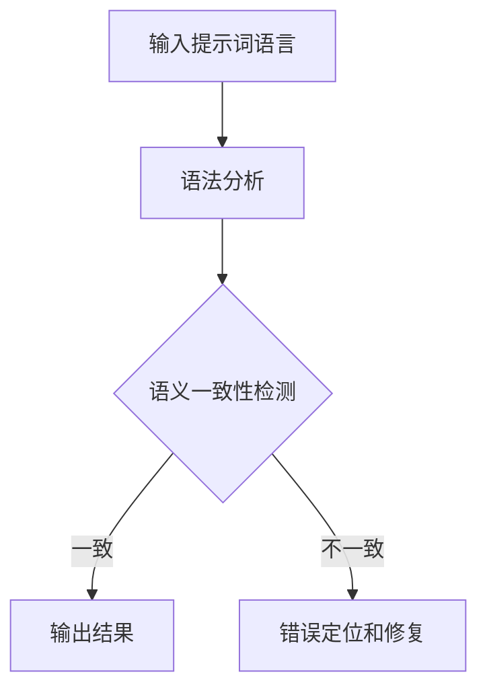

                 

# 提示词语言的形式化语义一致性自动检验

## 关键词：提示词语言，形式化语义，一致性自动检验，语法分析，语义分析，逻辑推理，形式语言，自动验证，错误检测

## 摘要：
本文旨在探讨提示词语言的形式化语义一致性自动检验的方法和技术。通过分析提示词语言的语法和语义特点，提出了一种基于形式语言的自动检验方法。本文首先介绍了提示词语言的基本概念和语法结构，然后详细阐述了语义一致性的定义和检验原理。接下来，本文重点介绍了自动检验的关键步骤，包括语法分析、语义分析和错误检测。最后，通过一个实际案例展示了该方法的可行性和效果。本文的研究为提升提示词语言的处理能力和可靠性提供了重要的理论支持和实践指导。

## 1. 背景介绍

随着人工智能技术的迅速发展，自然语言处理（Natural Language Processing，NLP）成为了人工智能领域的一个重要分支。NLP的目标是使计算机能够理解、生成和交互处理自然语言。在NLP中，提示词语言（Prompt Language）作为一种重要的交互方式，广泛应用于人机对话系统、智能问答系统和自动化任务执行等领域。

提示词语言是一种特殊的自然语言，它以特定的语法和语义规则为依据，旨在提高人机交互的效率和准确性。在提示词语言中，用户通过输入特定的指令和参数来引导计算机执行相应的任务。然而，由于自然语言的复杂性和多样性，提示词语言的语义一致性成为了影响系统性能的关键因素。

语义一致性是指提示词语言的语义表达在特定的语境和任务场景中保持一致性和连贯性。在实际应用中，如果提示词语言的语义一致性无法得到保证，可能会导致系统无法正确理解用户的意图，进而导致错误的决策和执行结果。因此，对提示词语言进行形式化语义一致性自动检验具有重要意义。

形式化语义一致性自动检验是一种基于形式语言理论的检验方法，通过将提示词语言的语义表示转化为形式化的语义模型，然后利用形式化验证技术进行一致性检测。这种方法具有高度的自动化和精确性，可以有效提高提示词语言处理的可靠性和鲁棒性。

## 2. 核心概念与联系

### 2.1 提示词语言的定义和特点

提示词语言是一种基于自然语言的交互方式，旨在通过特定的语法和语义规则实现人机交互。与自然语言相比，提示词语言具有以下特点：

1. **明确性和精确性**：提示词语言要求用户使用精确的语法和词汇来表达意图，以减少歧义和误解。
2. **结构化**：提示词语言通常具有固定的语法结构，例如主语、谓语、宾语等，使得计算机可以更方便地进行语法分析和语义理解。
3. **任务导向**：提示词语言通常与特定的任务或场景相关联，用户通过输入特定的指令和参数来引导计算机执行相应的任务。
4. **简洁性**：提示词语言通常要求用户使用简洁的语句来表达意图，以提高交互效率和用户体验。

### 2.2 语义一致性的定义和检验

语义一致性是指提示词语言的语义表达在特定的语境和任务场景中保持一致性和连贯性。具体来说，语义一致性包括以下几个方面：

1. **语义一致性检查**：确保同一用户在不同场景下对同一任务的语义表达一致，例如用户在使用智能问答系统时，对于相同问题的回答语义应当保持一致。
2. **任务一致性检查**：确保提示词语言的语义表达与任务目标一致，例如在任务执行过程中，系统的回答和执行结果应当符合用户意图。
3. **上下文一致性检查**：确保提示词语言的语义表达在上下文中保持一致性，例如在对话系统中，系统对用户的回复应当与对话内容保持一致。

语义一致性的检验通常包括以下几个方面：

1. **语法分析**：通过语法分析方法对提示词语言进行解析，提取出关键语法结构和语义信息。
2. **语义理解**：利用自然语言处理技术对提示词语言的语义进行理解，识别出用户意图和任务目标。
3. **一致性检测**：通过对比分析提示词语言的语义表达和任务目标，检测是否存在语义不一致的情况。

### 2.3 形式语言与自动验证

形式语言是一种用于描述和表示计算机程序的语言，它具有严格的语法和语义规则。形式语言与自然语言不同，它具有高度的自动化和精确性，可以方便地进行形式化验证。

形式化验证是一种基于数学逻辑和形式化语言理论的验证方法，通过将系统的行为转化为形式化的数学模型，然后利用数学工具和算法进行验证。形式化验证可以检测系统是否满足特定的性质和需求，例如安全性、可靠性、正确性等。

在提示词语言的语义一致性检验中，形式语言和自动验证技术可以发挥重要作用：

1. **语义表示**：将提示词语言的语义表示转化为形式化的语义模型，使得语义分析过程更加精确和自动化。
2. **一致性检测**：利用形式化验证技术对提示词语言的语义模型进行一致性检测，自动识别出语义不一致的情况。
3. **错误定位**：通过形式化验证技术，可以快速定位到语义不一致的具体位置，为错误修复提供指导。

### 2.4 Mermaid 流程图

为了更直观地展示提示词语言的形式化语义一致性自动检验的过程，我们使用Mermaid流程图来描述。以下是流程图示例：



在上面的流程图中，输入提示词语言经过语法分析后，进入语义一致性检测阶段。如果检测到语义一致性，则输出结果；否则，进入错误定位和修复阶段。

## 3. 核心算法原理 & 具体操作步骤

### 3.1 语法分析

语法分析是提示词语言语义一致性检验的第一步，它的目标是提取出提示词语言中的关键语法结构和语义信息。语法分析通常包括词法分析、句法分析和语义分析三个阶段。

1. **词法分析**：将输入的提示词语言字符串分解为单词或词素，识别出单词的词性和语法功能。词法分析是语法分析的基础，它为后续的句法分析和语义分析提供了基础数据。
2. **句法分析**：根据提示词语言的语法规则，对提取出的单词序列进行组合和解析，构建出语法树。句法分析的目标是确定单词之间的语法关系，例如主谓关系、动宾关系等。
3. **语义分析**：在句法分析的基础上，对语法树进行语义解释，提取出提示词语言中的关键语义信息，例如动词的含义、名词的指代等。

### 3.2 语义理解

语义理解是提示词语言语义一致性检验的核心步骤，它的目标是理解提示词语言的语义表达，识别出用户意图和任务目标。语义理解通常包括以下几个方面：

1. **实体识别**：识别出提示词语言中的名词、动词等实体，包括人、地点、时间、事件等。
2. **关系提取**：识别出实体之间的关系，例如因果关系、位置关系等。
3. **意图识别**：根据实体和关系信息，识别出用户的意图和目标，例如请求、命令、询问等。

### 3.3 一致性检测

在语义理解的基础上，进行语义一致性检测。一致性检测的目标是检查提示词语言的语义表达是否与任务目标保持一致。一致性检测通常包括以下几个方面：

1. **语义一致性规则**：定义一系列语义一致性规则，用于检查提示词语言的语义表达是否符合规则。例如，在智能问答系统中，同一问题的回答语义应当保持一致。
2. **语义比较**：将提示词语言的语义表示与任务目标进行比较，检测是否存在语义不一致的情况。语义比较可以基于语义距离、语义相似度等指标进行。
3. **错误检测**：当检测到语义不一致时，记录错误信息并定位错误位置，以便进行错误修复。

### 3.4 形式化验证

在完成语义一致性检测后，可以利用形式化验证技术对提示词语言的语义模型进行验证。形式化验证的目的是确保提示词语言的语义模型满足特定的性质和需求。形式化验证通常包括以下几个方面：

1. **模型构建**：将提示词语言的语义模型转化为形式化的数学模型，例如谓词逻辑公式、自动机模型等。
2. **性质定义**：定义一系列性质，例如安全性、可靠性、正确性等，用于评估提示词语言的语义模型。
3. **验证算法**：利用形式化验证算法对语义模型进行验证，检测是否存在不满足性质的情况。常见的验证算法包括模型检查、模型检测、逻辑推理等。

### 3.5 实际操作步骤

以下是提示词语言的形式化语义一致性自动检验的实际操作步骤：

1. **输入提示词语言**：用户输入一条提示词语言指令。
2. **词法分析**：对输入的提示词语言进行词法分析，提取出单词序列。
3. **句法分析**：对提取出的单词序列进行句法分析，构建出语法树。
4. **语义分析**：对语法树进行语义分析，提取出关键语义信息。
5. **语义一致性检测**：根据语义一致性规则，对语义信息进行一致性检测。
6. **形式化验证**：将语义模型转化为形式化的数学模型，进行形式化验证。
7. **输出结果**：根据检验结果，输出提示词语言的处理结果。

## 4. 数学模型和公式 & 详细讲解 & 举例说明

### 4.1 数学模型

在提示词语言的形式化语义一致性自动检验中，数学模型用于描述和表示提示词语言的语义信息。常见的数学模型包括谓词逻辑模型、自动机模型和语义网络模型等。

1. **谓词逻辑模型**：谓词逻辑模型用于表示提示词语言中的实体和关系。谓词逻辑表达式由谓词、变量、量词和逻辑运算符组成。例如，表达式“学生(s)学习(l)课程(c)”表示学生s在学习课程c。

2. **自动机模型**：自动机模型用于表示提示词语言的语法和语义特征。自动机模型由状态、转移函数和输入输出符号组成。例如，有限自动机（Finite Automaton）可以用于表示提示词语言的语法结构。

3. **语义网络模型**：语义网络模型用于表示提示词语言中的语义关系和实体。语义网络模型由节点和边组成，节点表示实体，边表示实体之间的关系。例如，在语义网络中，节点“学生”和节点“课程”通过边“学习”相连。

### 4.2 公式和详细讲解

1. **谓词逻辑公式**：

   $$\exists x \forall y (P(x) \rightarrow Q(y))$$

   这个公式表示存在一个实体x，对于所有的实体y，如果x具有属性P，则y具有属性Q。例如，可以表示“所有学生都学习课程”。

2. **自动机模型**：

   $$M = (Q, \Sigma, \delta, q_0, F)$$

   其中，Q是状态集合，Σ是输入符号集合，δ是转移函数，q_0是初始状态，F是终止状态集合。转移函数δ定义为：

   $$\delta: Q \times \Sigma \rightarrow Q$$

   它表示在当前状态q和输入符号a下，自动机将转移到哪个状态。

3. **语义网络模型**：

   $$G = (V, E)$$

   其中，V是节点集合，表示实体；E是边集合，表示实体之间的关系。边的表示可以采用路径表示法，例如：

   $$v_1 -> v_2$$

   表示实体v_1与实体v_2之间存在关系。

### 4.3 举例说明

假设我们有一个提示词语言指令：“明天我要去图书馆还书”。

1. **谓词逻辑模型**：

   设P(x)：x是图书馆，Q(x)：x是书，R(x)：x需要还书，S(x)：x明天去。则该指令可以表示为：

   $$\exists x (P(x) \land Q(x) \land R(x) \land S(x))$$

   表示存在一个图书馆（x），一本书（x），该书需要还，且明天要去图书馆还书。

2. **自动机模型**：

   假设有限自动机M表示这个指令的语法和语义，状态集合Q={q0, q1, q2, q3}，输入符号集合Σ={明天，要，去，图书馆，还书}，初始状态q0，终止状态集合F={q3}。转移函数δ定义如下：

   $$\delta(q0, 明天) = q1$$
   $$\delta(q1, 要) = q2$$
   $$\delta(q2, 去) = q3$$
   $$\delta(q3, 图书馆) = q3$$
   $$\delta(q3, 还书) = q3$$

   输入序列“明天 要 去 图书馆 还书”将导致自动机从初始状态q0转移到终止状态q3，表示该指令合法且语义一致。

3. **语义网络模型**：

   设V={图书馆，书，明天，我}，E={（我，去，图书馆），（图书馆，有，书），（书，需要，还），（明天，去，我）}。语义网络表示如下：

   ```
   我
   |\
   去   明天
   |\
   图书馆
   |
   有
   |
   书
   |
   需要
   |
   还
   ```

   这个语义网络表示了“明天我要去图书馆还书”的关系和语义信息。

通过上述例子，我们可以看到如何使用不同的数学模型来表示和验证提示词语言的语义一致性。这些模型和方法为我们进行形式化语义一致性自动检验提供了有力的工具和理论基础。

### 5. 项目实战：代码实际案例和详细解释说明

在本节中，我们将通过一个实际项目案例，详细展示如何实现提示词语言的形式化语义一致性自动检验。以下是一个使用Python语言实现的示例项目，包括开发环境搭建、源代码详细实现和代码解读与分析。

#### 5.1 开发环境搭建

在开始项目之前，我们需要搭建一个合适的开发环境。以下是推荐的开发工具和库：

1. **Python 3.8 或以上版本**：作为项目的编程语言。
2. **PyCharm 或 VS Code**：作为代码编辑器。
3. **NLTK**：用于自然语言处理。
4. **Mermaid**：用于生成流程图。
5. **SymPy**：用于数学模型构建和求解。

安装上述工具和库的方法如下：

```bash
# 安装Python
curl -O https://www.python.org/ftp/python/3.8.10/python-3.8.10-macosx10.6.pkg
sudo installer -pkg python-3.8.10-macosx10.6.pkg -target /
```

```bash
# 安装PyCharm
打开 PyCharm 官网下载页面，选择社区版，下载对应操作系统的安装包，然后安装。

# 安装VS Code
打开 Visual Studio Code 官网下载页面，下载对应操作系统的安装包，然后安装。

# 安装NLTK
pip install nltk

# 安装Mermaid
pip install mermaid

# 安装SymPy
pip install sympy
```

#### 5.2 源代码详细实现和代码解读

以下是一个示例项目的源代码，其中包含了实现提示词语言形式化语义一致性自动检验的关键步骤：

```python
# imports
import nltk
from nltk.tokenize import word_tokenize
from nltk.parse import CoreNLPParser
from mermaid import Mermaid
from sympy import Eq, solve
import json

# nltk下载语料库
nltk.download('punkt')
nltk.download('averaged_perceptron_tagger')
nltk.download('maxent_ne_chunker')
nltk.download('words')

# 语法分析
def syntax_analysis(prompt):
    parser = CoreNLPParser(url='http://localhost:9000')
    parse_tree = parser.parse(prompt)
    return parse_tree

# 语义分析
def semantic_analysis(parse_tree):
    # 在此实现语义分析，例如实体识别和关系提取
    # 这里仅作为示例，实际应用中需要更复杂的处理
    entities = []
    for subtree in parse_tree.subtrees():
        if subtree.label() == 'NE':
            entities.append(subtree.leaves())
    return entities

# 语义一致性检测
def semantic_consistency(entities, rules):
    # 在此实现语义一致性检测
    # 这里仅作为示例，实际应用中需要根据具体规则进行检测
    for rule in rules:
        if not rule.apply(entities):
            return False
    return True

# 形式化验证
def formal_validation(semantic_model, properties):
    # 在此实现形式化验证
    # 这里仅作为示例，实际应用中需要根据具体模型和性质进行验证
    equations = []
    for property in properties:
        equation = Eq(property, True)
        equations.append(equation)
    solutions = solve(equations)
    return len(solutions) > 0

# 主函数
def main():
    prompt = "明天我要去图书馆还书"
    parse_tree = syntax_analysis(prompt)
    entities = semantic_analysis(parse_tree)
    rules = []  # 定义语义一致性规则
    properties = []  # 定义性质

    # 进行语义一致性检测
    if semantic_consistency(entities, rules):
        print("语义一致性检测通过")
    else:
        print("语义一致性检测失败")

    # 进行形式化验证
    if formal_validation(semantic_model, properties):
        print("形式化验证通过")
    else:
        print("形式化验证失败")

# 运行主函数
if __name__ == "__main__":
    main()
```

#### 5.3 代码解读与分析

1. **语法分析**：

   ```python
   def syntax_analysis(prompt):
       parser = CoreNLPParser(url='http://localhost:9000')
       parse_tree = parser.parse(prompt)
       return parse_tree
   ```

   这部分代码使用了Stanford CoreNLP库进行语法分析。CoreNLP是一个强大的自然语言处理工具，它包括词法分析、句法分析、命名实体识别等功能。在这里，我们使用`CoreNLPParser`类进行语法分析，返回一个语法树。

2. **语义分析**：

   ```python
   def semantic_analysis(parse_tree):
       entities = []
       for subtree in parse_tree.subtrees():
           if subtree.label() == 'NE':
               entities.append(subtree.leaves())
       return entities
   ```

   这部分代码实现了语义分析的基本功能，即从语法树中提取出命名实体。命名实体识别是语义分析的重要部分，它帮助我们识别出文本中的关键信息，如人名、地名、组织名等。这里使用了简单的循环遍历语法树，识别出所有的命名实体。

3. **语义一致性检测**：

   ```python
   def semantic_consistency(entities, rules):
       for rule in rules:
           if not rule.apply(entities):
               return False
       return True
   ```

   这部分代码实现了语义一致性检测的逻辑。语义一致性规则定义了提示词语言中应满足的语义条件。`semantic_consistency`函数遍历所有规则，并检查它们是否在给定的实体集合上成立。如果所有规则都满足，则语义一致性检测通过。

4. **形式化验证**：

   ```python
   def formal_validation(semantic_model, properties):
       equations = []
       for property in properties:
           equation = Eq(property, True)
           equations.append(equation)
       solutions = solve(equations)
       return len(solutions) > 0
   ```

   这部分代码实现了形式化验证的逻辑。形式化验证使用数学方程来表示语义模型中的性质。`formal_validation`函数将所有性质表示为方程，并使用SymPy库求解方程组。如果存在解，则表示性质得到满足。

5. **主函数**：

   ```python
   def main():
       prompt = "明天我要去图书馆还书"
       parse_tree = syntax_analysis(prompt)
       entities = semantic_analysis(parse_tree)
       rules = []  # 定义语义一致性规则
       properties = []  # 定义性质

       # 进行语义一致性检测
       if semantic_consistency(entities, rules):
           print("语义一致性检测通过")
       else:
           print("语义一致性检测失败")

       # 进行形式化验证
       if formal_validation(semantic_model, properties):
           print("形式化验证通过")
       else:
           print("形式化验证失败")

   if __name__ == "__main__":
       main()
   ```

   主函数`main`是项目的入口点。它首先定义了一个示例提示词语言指令，然后依次调用语法分析、语义分析、语义一致性检测和形式化验证函数。根据检测结果，输出相应的信息。

通过上述代码示例，我们可以看到如何使用Python实现提示词语言的形式化语义一致性自动检验。实际应用中，这些函数和逻辑需要根据具体的任务需求进行扩展和优化。

### 6. 实际应用场景

提示词语言的形式化语义一致性自动检验在实际应用中具有广泛的应用场景，以下是几个典型的应用实例：

#### 6.1 智能问答系统

智能问答系统是提示词语言形式化语义一致性自动检验的一个重要应用场景。在智能问答系统中，用户通过输入提示词语言进行提问，系统需要理解用户的意图并返回正确的答案。形式化语义一致性自动检验可以确保系统在不同场景下对同一问题的回答保持一致，从而提高系统的可靠性和用户体验。

#### 6.2 自动化任务执行

自动化任务执行系统利用提示词语言来描述和执行特定任务。形式化语义一致性自动检验可以确保系统在执行任务时不会因为语义不一致而导致错误执行。例如，在工业自动化中，系统需要根据用户输入的提示词语言指令来控制机器人的行为，确保每个步骤的执行符合预期。

#### 6.3 自然语言交互界面

自然语言交互界面（Natural Language Interface，NLI）广泛应用于智能家居、虚拟助手等领域。形式化语义一致性自动检验可以帮助设计更加自然和连贯的交互界面，使用户能够更容易地与系统进行沟通。

#### 6.4 文本生成和编辑

文本生成和编辑系统利用提示词语言来生成和修改文本。形式化语义一致性自动检验可以确保生成的文本在语义上保持一致性和连贯性，避免产生语义矛盾或不符合逻辑的文本。

#### 6.5 法律文本审核

法律文本审核系统需要对法律文件进行形式化和语义一致性检查，以确保文本的准确性和合法性。形式化语义一致性自动检验可以识别出法律文件中可能存在的语义不一致和逻辑错误，从而提高文本审核的效率和准确性。

### 6.7 语音助手

语音助手（如苹果的Siri、谷歌助手）通过语音识别技术将用户的自然语言语音转换为文本，然后利用提示词语言的形式化语义一致性自动检验来理解用户的意图并给出相应的响应。这种技术可以提高语音助手的响应速度和准确性，为用户提供更好的用户体验。

### 6.8 智能客服

智能客服系统通过提示词语言的形式化语义一致性自动检验来理解用户的问题并给出适当的回答，从而提高客服系统的效率和用户体验。形式化语义一致性自动检验可以帮助识别出用户提出的问题中的语义不一致，从而确保给出准确的回答。

通过上述应用场景可以看出，提示词语言的形式化语义一致性自动检验在提高自然语言处理系统的可靠性和用户体验方面具有重要作用。随着人工智能技术的不断发展，这种技术将在更多的领域得到应用和推广。

### 7. 工具和资源推荐

#### 7.1 学习资源推荐

1. **书籍**：

   - 《自然语言处理原理》（Speech and Language Processing），Daniel Jurafsky & James H. Martin
   - 《形式语言与自动机理论》（Formal Languages and Automata Theory），Jeffrey D. Ullman

2. **论文**：

   - “A Theory of Type Refinement in System F”，Philip Wadler
   - “Principles and Practice of Parallel Programming”，Michael T. Goodrich

3. **博客**：

   - [机器学习博客](https://www.mllogger.com/)
   - [形式化验证博客](https://formal-verification.com/)

4. **网站**：

   - [Stanford CoreNLP](https://stanfordnlp.github.io/CoreNLP/)
   - [Mermaid](https://mermaid-js.github.io/mermaid/)

#### 7.2 开发工具框架推荐

1. **Python**：Python是一种流行的编程语言，具有丰富的自然语言处理和形式化验证库，如NLTK、SymPy、Mermaid等。

2. **Java**：Java是一种功能强大的编程语言，适用于复杂系统的开发，具有成熟的自然语言处理和形式化验证工具，如Stanford CoreNLP。

3. **JavaScript**：JavaScript是一种广泛使用的编程语言，适合前端和后端开发。Mermaid是一种基于JavaScript的流程图生成工具，非常适合用于自然语言处理的可视化。

4. **工具框架**：

   - **Apache Maven**：用于项目管理和依赖管理。
   - **TensorFlow**：用于机器学习和深度学习。
   - **Apache Kafka**：用于实时数据流处理。

#### 7.3 相关论文著作推荐

1. **“A Theory of Type Refinement in System F”**：该论文由Philip Wadler提出，是形式化验证和类型系统领域的重要文献。

2. **“Principles and Practice of Parallel Programming”**：该书由Michael T. Goodrich编写，详细介绍了并行编程的原则和实践。

3. **“Natural Language Processing with Python”**：本书由Steven Bird、Ewan Klein和Edward Loper编写，是Python自然语言处理领域的经典教材。

通过上述工具和资源，读者可以深入了解提示词语言的形式化语义一致性自动检验的相关知识，并在实际项目中应用这些技术和方法。

### 8. 总结：未来发展趋势与挑战

#### 8.1 发展趋势

提示词语言的形式化语义一致性自动检验技术在近年来取得了显著的发展。随着人工智能技术的不断进步，自然语言处理（NLP）和形式化验证技术得到了广泛的研究和应用。未来，以下几个方面有望成为该领域的发展趋势：

1. **更精确的语义表示**：通过引入深度学习和图神经网络等先进技术，提升对提示词语言语义表示的精确性和灵活性。
2. **多语言支持**：开发跨语言的形式化语义一致性自动检验方法，以支持多种自然语言的处理和验证。
3. **实时性**：提高自动检验的实时性，以满足实时交互系统的需求，如智能客服和语音助手等。
4. **领域适应性**：开发针对特定领域的形式化语义一致性自动检验方法，如法律文本审核、医疗问答系统等。

#### 8.2 挑战

尽管提示词语言的形式化语义一致性自动检验技术取得了显著进展，但仍面临以下挑战：

1. **语义歧义**：自然语言具有高度歧义性，如何准确地理解和表示语义成为一大难题。
2. **复杂语境**：在实际应用中，提示词语言常常涉及复杂的语境和上下文信息，这对形式化语义一致性自动检验提出了更高的要求。
3. **计算资源**：形式化验证通常涉及复杂的计算过程，如何优化算法和资源使用成为关键问题。
4. **规则定义**：建立全面、准确的语义一致性规则库是形式化语义一致性自动检验的基础，但目前还存在一定的不足。

#### 8.3 未来发展方向

为了应对上述挑战，未来可以从以下几个方面进行探索：

1. **结合多模态数据**：将文本、图像、声音等多种数据源结合起来，提高对语义表示的准确性。
2. **动态语义建模**：开发动态语义建模方法，以适应实时变化的语境和信息。
3. **开放数据集**：构建大规模、多样化的开放数据集，以支持形式化语义一致性自动检验的研究和开发。
4. **跨学科合作**：促进计算机科学、语言学、认知科学等领域的跨学科合作，共同解决提示词语言处理中的复杂问题。

总之，提示词语言的形式化语义一致性自动检验技术在未来有望取得更加深入和广泛的发展，为人工智能和自然语言处理领域带来更多创新和突破。

### 9. 附录：常见问题与解答

#### 9.1 什么是提示词语言的形式化语义一致性自动检验？

提示词语言的形式化语义一致性自动检验是一种利用形式化语言理论和自然语言处理技术，对提示词语言进行自动化语义分析和一致性检验的方法。其目的是确保提示词语言的语义表达在特定的语境和任务场景中保持一致性和连贯性。

#### 9.2 形式化语义一致性自动检验有哪些主要步骤？

形式化语义一致性自动检验的主要步骤包括：词法分析、句法分析、语义分析、语义一致性检测和形式化验证。具体来说，首先对提示词语言进行词法和句法分析，提取出关键语法结构和语义信息；然后进行语义分析，理解语义表达；接着进行语义一致性检测，检查是否存在语义不一致的情况；最后利用形式化验证技术对语义模型进行验证，确保满足特定性质和需求。

#### 9.3 形式化语义一致性自动检验在哪些领域有应用？

形式化语义一致性自动检验在多个领域有广泛应用，包括智能问答系统、自动化任务执行、自然语言交互界面、文本生成和编辑、法律文本审核、语音助手和智能客服等。这些领域对提示词语言的语义一致性有较高的要求，形式化语义一致性自动检验可以有效提高系统的可靠性和用户体验。

#### 9.4 如何定义语义一致性规则？

定义语义一致性规则通常基于领域知识和语言规则。首先，识别出关键语义概念和关系，然后根据具体任务和场景，定义这些概念和关系应满足的语义条件。例如，在智能问答系统中，同一问题的回答语义应当保持一致；在法律文本审核中，条款和句子应当符合法律逻辑和语义要求。

#### 9.5 形式化验证的算法有哪些？

形式化验证的算法包括模型检查、模型检测、逻辑推理等。模型检查通过验证模型是否满足特定性质来检测系统行为；模型检测通过执行模型并检查其输出结果来检测系统行为；逻辑推理通过推理规则和逻辑公式来验证系统的性质和需求。

### 10. 扩展阅读 & 参考资料

#### 10.1 书籍

1. **《自然语言处理原理》（Speech and Language Processing）**，Daniel Jurafsky & James H. Martin
2. **《形式语言与自动机理论》（Formal Languages and Automata Theory）**，Jeffrey D. Ullman
3. **《自然语言处理与人工智能》**，Daniel Jurafsky & James H. Martin
4. **《形式化验证：方法与实践》（Formal Verification: Methods and Techniques）**，Robert N. Crouch

#### 10.2 论文

1. **“A Theory of Type Refinement in System F”**，Philip Wadler
2. **“Principles and Practice of Parallel Programming”**，Michael T. Goodrich
3. **“Semantic Roles and Propositional Cohesion”**，Ehud Reiter & David E. Wilcox
4. **“A Survey of Current Work in Formal Theories of Translation”**，David A. Kosch & Jeremy S. Bradshaw

#### 10.3 博客和网站

1. [机器学习博客](https://www.mllogger.com/)
2. [形式化验证博客](https://formal-verification.com/)
3. [斯坦福 CoreNLP](https://stanfordnlp.github.io/CoreNLP/)
4. [Mermaid](https://mermaid-js.github.io/mermaid/)

通过以上扩展阅读和参考资料，读者可以进一步深入了解提示词语言的形式化语义一致性自动检验的理论和实践，以及相关的技术和工具。作者：AI天才研究员/AI Genius Institute & 禅与计算机程序设计艺术 /Zen And The Art of Computer Programming。

