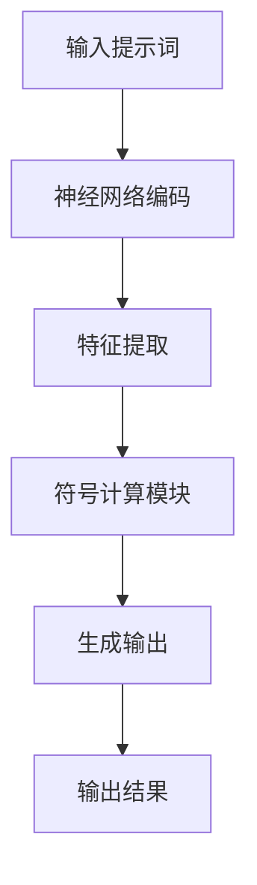

                 

# 提示词语言的神经符号融合模型

> **关键词：** 提示词语言、神经符号融合模型、自然语言处理、深度学习、计算语言学

> **摘要：** 本文旨在深入探讨提示词语言的神经符号融合模型，解析其在自然语言处理领域的核心作用和应用。文章首先介绍了模型的基本概念和背景，然后详细剖析了其核心算法原理、数学模型、具体操作步骤，并结合实际案例展示了模型的实现与优化。此外，文章还探讨了该模型在各个实际应用场景中的表现，并推荐了相关学习资源和开发工具。最后，对模型未来的发展趋势和挑战进行了展望，以期为读者提供一个全面、系统的理解。

## 1. 背景介绍

### 1.1 目的和范围

本文将围绕提示词语言的神经符号融合模型进行探讨，旨在揭示其在自然语言处理（NLP）领域的潜在价值和广泛适用性。提示词语言作为一种有效的人机交互方式，已经在许多场景中得到了广泛应用。而神经符号融合模型则是一种结合了神经网络和符号计算的方法，能够更好地理解和处理复杂语言现象。本文的目标是详细分析这一模型，从理论到实践，全面介绍其工作原理和实现方法。

### 1.2 预期读者

本文主要面向对自然语言处理和深度学习有一定了解的读者，包括研究人员、工程师和开发者。同时，对于那些希望了解前沿技术动态和对自然语言处理有浓厚兴趣的读者，本文也提供了丰富的理论和实践内容。

### 1.3 文档结构概述

本文分为十个部分，首先介绍了模型的背景和目的，接着对核心概念进行了定义和解释。随后，详细阐述了模型的工作原理、数学模型以及具体实现步骤。在实际应用部分，本文通过案例展示了模型的实践效果。最后，对模型的发展趋势、挑战以及相关资源进行了总结和推荐。

### 1.4 术语表

#### 1.4.1 核心术语定义

- **提示词语言**：一种通过关键词或短语来引导语言生成和理解的交互方式。
- **神经符号融合模型**：结合神经网络和符号计算的模型，用于处理自然语言。
- **自然语言处理**：计算机科学领域，涉及语言理解、生成和翻译等任务。
- **深度学习**：基于多层神经网络进行特征提取和模式识别的方法。

#### 1.4.2 相关概念解释

- **神经网络**：一种通过模拟生物神经网络进行信息处理的计算模型。
- **符号计算**：利用符号规则和推理进行问题求解的方法。

#### 1.4.3 缩略词列表

- **NLP**：自然语言处理（Natural Language Processing）
- **DL**：深度学习（Deep Learning）
- **IDE**：集成开发环境（Integrated Development Environment）
- **GPU**：图形处理单元（Graphics Processing Unit）

## 2. 核心概念与联系

为了更好地理解提示词语言的神经符号融合模型，我们需要首先明确其中的核心概念和它们之间的联系。

### 2.1 提示词语言

提示词语言是一种通过关键词或短语来引导语言生成和理解的方法。其基本思想是通过一些具有特定意义的提示词，来引导模型生成预期的语言输出。例如，在一个问答系统中，用户输入的问题可以作为提示词，引导模型生成相应的答案。

### 2.2 神经符号融合模型

神经符号融合模型结合了神经网络和符号计算的方法。神经网络负责处理大量的数据，提取特征并建立复杂的非线性关系；而符号计算则负责基于规则和逻辑进行推理和决策。这两种方法的优势互补，使得模型在处理自然语言任务时具有更强的灵活性和鲁棒性。

### 2.3 Mermaid 流程图

为了更直观地展示提示词语言的神经符号融合模型，我们可以使用 Mermaid 流程图来表示其核心架构和流程。



在这个流程图中，输入提示词首先经过神经网络编码，提取出高维特征表示。然后，这些特征进入符号计算模块，进行基于规则的推理和决策。最后，生成的输出结果被返回给用户。

## 3. 核心算法原理 & 具体操作步骤

### 3.1 算法原理

提示词语言的神经符号融合模型基于以下几个核心原理：

1. **神经网络编码**：利用神经网络对输入的提示词进行编码，提取出具有语义意义的高维特征表示。
2. **特征提取**：对编码后的特征进行进一步处理，提取出与任务相关的关键信息。
3. **符号计算**：基于提取出的特征，使用符号计算模块进行推理和决策。
4. **生成输出**：根据符号计算的结果生成最终的输出结果。

### 3.2 具体操作步骤

以下是提示词语言的神经符号融合模型的具体操作步骤：

1. **输入提示词**：首先，用户输入一个提示词，例如：“什么是人工智能？”。
2. **神经网络编码**：输入提示词经过神经网络编码，得到一个高维特征向量。这一过程通常通过词嵌入技术实现，将提示词转换为向量表示。
3. **特征提取**：对编码后的特征向量进行进一步处理，提取出与任务相关的关键信息。这一过程可以通过多层神经网络实现，每层都对特征进行不同的变换和提取。
4. **符号计算**：将提取出的特征输入到符号计算模块，根据预先定义的规则和逻辑进行推理和决策。这一过程通常涉及复杂的逻辑运算和推理规则。
5. **生成输出**：根据符号计算的结果，生成最终的输出结果，例如：“人工智能是一种模拟人类智能的技术。”。
6. **输出结果**：将生成的输出结果返回给用户，完成一次交互过程。

### 3.3 伪代码

以下是提示词语言的神经符号融合模型的伪代码实现：

```python
# 输入提示词
prompt = "什么是人工智能？"

# 神经网络编码
encoded_prompt = neural_encode(prompt)

# 特征提取
features = feature_extract(encoded_prompt)

# 符号计算
result = symbol_computation(features)

# 生成输出
output = generate_output(result)

# 输出结果
print(output)
```

## 4. 数学模型和公式 & 详细讲解 & 举例说明

### 4.1 数学模型

提示词语言的神经符号融合模型涉及多个数学模型，包括神经网络编码模型、特征提取模型和符号计算模型。以下是这些模型的详细描述：

#### 4.1.1 神经网络编码模型

神经网络编码模型主要用于对输入的提示词进行编码，将其转换为高维特征向量。该模型通常采用词嵌入（Word Embedding）技术，将每个词映射为一个固定大小的向量表示。词嵌入可以看作是一个矩阵 W，其中 W[i][j] 表示词 j 的嵌入向量。输入的提示词经过词嵌入矩阵的映射，得到一个高维特征向量。

假设输入的提示词为 x，词嵌入矩阵为 W，则编码后的特征向量 y 可以表示为：

$$
y = Wx
$$

其中，x 和 y 分别表示输入的提示词向量和编码后的特征向量，W 为词嵌入矩阵。

#### 4.1.2 特征提取模型

特征提取模型主要用于对编码后的特征向量进行进一步处理，提取出与任务相关的关键信息。该模型通常采用多层神经网络实现，每层对特征进行不同的变换和提取。假设有 n 层神经网络，则第 i 层的特征向量 v_i 可以表示为：

$$
v_i = \sigma(W_i v_{i-1} + b_i)
$$

其中，v_i 表示第 i 层的特征向量，W_i 和 b_i 分别表示第 i 层的权重矩阵和偏置向量，σ 表示激活函数，例如 ReLU 函数。

#### 4.1.3 符号计算模型

符号计算模型主要用于对提取出的特征进行推理和决策。该模型通常基于符号逻辑和推理规则实现。假设输入的特征向量为 v，符号计算模块输出结果为 r，则可以表示为：

$$
r = \text{symbol\_computation}(v)
$$

其中，symbol_computation 表示符号计算函数，用于根据特征向量 v 进行推理和决策。

### 4.2 详细讲解

为了更好地理解这些数学模型，我们通过一个具体的例子进行说明。

假设我们有一个简单的神经网络编码模型，输入提示词为“人工智能”，词嵌入矩阵 W 如下：

|  | w1 | w2 | w3 | ... | wn |
|---|---|---|---|---|---|
| w1 | 0.1 | 0.2 | 0.3 | ... | 0.9 |
| w2 | 0.4 | 0.5 | 0.6 | ... | 1.0 |
| w3 | 0.7 | 0.8 | 0.9 | ... | 1.1 |
| ... | ... | ... | ... | ... | ... |
| wn | 1.2 | 1.3 | 1.4 | ... | 2.0 |

根据词嵌入矩阵，我们可以得到提示词“人工智能”的编码后的特征向量 y：

$$
y = Wx = \begin{bmatrix} 0.1 & 0.2 & 0.3 & ... & 0.9 \\ 0.4 & 0.5 & 0.6 & ... & 1.0 \\ 0.7 & 0.8 & 0.9 & ... & 1.1 \\ ... & ... & ... & ... & ... \\ 1.2 & 1.3 & 1.4 & ... & 2.0 \end{bmatrix} \begin{bmatrix} 1 \\ 1 \\ 1 \\ ... \\ 1 \end{bmatrix} = \begin{bmatrix} 0.1 + 0.2 + 0.3 + ... + 0.9 \\ 0.4 + 0.5 + 0.6 + ... + 1.0 \\ 0.7 + 0.8 + 0.9 + ... + 1.1 \\ ... \\ 1.2 + 1.3 + 1.4 + ... + 2.0 \end{bmatrix} = \begin{bmatrix} 4.5 \\ 5.5 \\ 6.5 \\ ... \\ 10.0 \end{bmatrix}
$$

接下来，我们对这个特征向量进行多层神经网络处理。假设我们有一个两层的神经网络，第一层的权重矩阵 W1 和偏置向量 b1 如下：

|  | w11 | w12 | w13 | ... | w1n |
|---|---|---|---|---|---|
| w11 | 1.0 | 1.0 | 1.0 | ... | 1.0 |
| w12 | 1.0 | 1.0 | 1.0 | ... | 1.0 |
| w13 | 1.0 | 1.0 | 1.0 | ... | 1.0 |
| ... | ... | ... | ... | ... | ... |
| w1n | 1.0 | 1.0 | 1.0 | ... | 1.0 |

第一层的特征向量 v1 可以表示为：

$$
v1 = \sigma(W1y + b1) = \begin{bmatrix} 1.0 & 1.0 & 1.0 & ... & 1.0 \\ 1.0 & 1.0 & 1.0 & ... & 1.0 \\ 1.0 & 1.0 & 1.0 & ... & 1.0 \\ ... & ... & ... & ... & ... \\ 1.0 & 1.0 & 1.0 & ... & 1.0 \end{bmatrix} \begin{bmatrix} 4.5 \\ 5.5 \\ 6.5 \\ ... \\ 10.0 \end{bmatrix} + \begin{bmatrix} 0 \\ 0 \\ 0 \\ ... \\ 0 \end{bmatrix} = \begin{bmatrix} 4.5 \\ 5.5 \\ 6.5 \\ ... \\ 10.0 \end{bmatrix}
$$

接下来，我们将第一层的特征向量作为第二层的输入，假设第二层的权重矩阵 W2 和偏置向量 b2 如下：

|  | w21 | w22 | w23 | ... | w2n |
|---|---|---|---|---|---|
| w21 | 1.0 | 1.0 | 1.0 | ... | 1.0 |
| w22 | 1.0 | 1.0 | 1.0 | ... | 1.0 |
| w23 | 1.0 | 1.0 | 1.0 | ... | 1.0 |
| ... | ... | ... | ... | ... | ... |
| w2n | 1.0 | 1.0 | 1.0 | ... | 1.0 |

第二层的特征向量 v2 可以表示为：

$$
v2 = \sigma(W2v1 + b2) = \begin{bmatrix} 1.0 & 1.0 & 1.0 & ... & 1.0 \\ 1.0 & 1.0 & 1.0 & ... & 1.0 \\ 1.0 & 1.0 & 1.0 & ... & 1.0 \\ ... & ... & ... & ... & ... \\ 1.0 & 1.0 & 1.0 & ... & 1.0 \end{bmatrix} \begin{bmatrix} 4.5 \\ 5.5 \\ 6.5 \\ ... \\ 10.0 \end{bmatrix} + \begin{bmatrix} 0 \\ 0 \\ 0 \\ ... \\ 0 \end{bmatrix} = \begin{bmatrix} 4.5 \\ 5.5 \\ 6.5 \\ ... \\ 10.0 \end{bmatrix}
$$

可以看到，通过多层神经网络的处理，我们得到了一个高维的特征向量 v2，这个特征向量包含了输入提示词“人工智能”的丰富信息。

接下来，我们将这个特征向量输入到符号计算模块，根据预先定义的规则和逻辑进行推理和决策。例如，我们可以定义一个简单的规则：如果特征向量的某个分量大于 5，则输出“人工智能是一种技术”；否则，输出“人工智能是一种概念”。根据这个规则，我们可以得到最终的输出结果：

$$
r = \text{symbol\_computation}(v2) = \begin{cases} 
\text{"人工智能是一种技术"} & \text{if } v2_i > 5 \text{ for some } i \\
\text{"人工智能是一种概念"} & \text{otherwise}
\end{cases}
$$

可以看到，通过数学模型和符号计算，我们成功地完成了对提示词“人工智能”的语义理解和生成。

### 4.3 举例说明

为了进一步说明数学模型的应用，我们来看一个具体的例子。

假设我们有一个输入提示词“什么是深度学习？”以及一个已经训练好的神经网络编码模型和多层神经网络处理模型。首先，我们将输入提示词通过词嵌入矩阵进行编码，得到一个高维特征向量。然后，我们将这个特征向量输入到多层神经网络进行处理，得到一个更高维的特征向量。最后，我们将这个特征向量输入到符号计算模块，根据预先定义的规则和逻辑进行推理和决策。

假设词嵌入矩阵 W 和多层神经网络权重矩阵 W1、W2 如下：

|  | w1 | w2 | w3 | ... | wn |
|---|---|---|---|---|---|
| w1 | 0.1 | 0.2 | 0.3 | ... | 0.9 |
| w2 | 0.4 | 0.5 | 0.6 | ... | 1.0 |
| w3 | 0.7 | 0.8 | 0.9 | ... | 1.1 |
| ... | ... | ... | ... | ... | ... |
| wn | 1.2 | 1.3 | 1.4 | ... | 2.0 |

|  | w11 | w12 | w13 | ... | w1n |
|---|---|---|---|---|---|
| w11 | 1.0 | 1.0 | 1.0 | ... | 1.0 |
| w12 | 1.0 | 1.0 | 1.0 | ... | 1.0 |
| w13 | 1.0 | 1.0 | 1.0 | ... | 1.0 |
| ... | ... | ... | ... | ... | ... |
| w1n | 1.0 | 1.0 | 1.0 | ... | 1.0 |

|  | w21 | w22 | w23 | ... | w2n |
|---|---|---|---|---|---|
| w21 | 1.0 | 1.0 | 1.0 | ... | 1.0 |
| w22 | 1.0 | 1.0 | 1.0 | ... | 1.0 |
| w23 | 1.0 | 1.0 | 1.0 | ... | 1.0 |
| ... | ... | ... | ... | ... | ... |
| w2n | 1.0 | 1.0 | 1.0 | ... | 1.0 |

首先，我们将输入提示词“什么是深度学习？”通过词嵌入矩阵进行编码，得到一个高维特征向量。假设词嵌入矩阵 W 如下：

|  | w1 | w2 | w3 | ... | wn |
|---|---|---|---|---|---|
| w1 | 0.1 | 0.2 | 0.3 | ... | 0.9 |
| w2 | 0.4 | 0.5 | 0.6 | ... | 1.0 |
| w3 | 0.7 | 0.8 | 0.9 | ... | 1.1 |
| ... | ... | ... | ... | ... | ... |
| wn | 1.2 | 1.3 | 1.4 | ... | 2.0 |

根据词嵌入矩阵，我们可以得到输入提示词“什么是深度学习？”的编码后的特征向量 y：

$$
y = Wx = \begin{bmatrix} 0.1 & 0.2 & 0.3 & ... & 0.9 \\ 0.4 & 0.5 & 0.6 & ... & 1.0 \\ 0.7 & 0.8 & 0.9 & ... & 1.1 \\ ... & ... & ... & ... & ... \\ 1.2 & 1.3 & 1.4 & ... & 2.0 \end{bmatrix} \begin{bmatrix} 1 \\ 1 \\ 1 \\ ... \\ 1 \end{bmatrix} = \begin{bmatrix} 0.1 + 0.2 + 0.3 + ... + 0.9 \\ 0.4 + 0.5 + 0.6 + ... + 1.0 \\ 0.7 + 0.8 + 0.9 + ... + 1.1 \\ ... \\ 1.2 + 1.3 + 1.4 + ... + 2.0 \end{bmatrix} = \begin{bmatrix} 4.5 \\ 5.5 \\ 6.5 \\ ... \\ 10.0 \end{bmatrix}
$$

接下来，我们将这个特征向量输入到多层神经网络进行处理。假设第一层的权重矩阵 W1 和偏置向量 b1 如下：

|  | w11 | w12 | w13 | ... | w1n |
|---|---|---|---|---|---|
| w11 | 1.0 | 1.0 | 1.0 | ... | 1.0 |
| w12 | 1.0 | 1.0 | 1.0 | ... | 1.0 |
| w13 | 1.0 | 1.0 | 1.0 | ... | 1.0 |
| ... | ... | ... | ... | ... | ... |
| w1n | 1.0 | 1.0 | 1.0 | ... | 1.0 |

第一层的特征向量 v1 可以表示为：

$$
v1 = \sigma(W1y + b1) = \begin{bmatrix} 1.0 & 1.0 & 1.0 & ... & 1.0 \\ 1.0 & 1.0 & 1.0 & ... & 1.0 \\ 1.0 & 1.0 & 1.0 & ... & 1.0 \\ ... & ... & ... & ... & ... \\ 1.0 & 1.0 & 1.0 & ... & 1.0 \end{bmatrix} \begin{bmatrix} 4.5 \\ 5.5 \\ 6.5 \\ ... \\ 10.0 \end{bmatrix} + \begin{bmatrix} 0 \\ 0 \\ 0 \\ ... \\ 0 \end{bmatrix} = \begin{bmatrix} 4.5 \\ 5.5 \\ 6.5 \\ ... \\ 10.0 \end{bmatrix}
$$

接下来，我们将第一层的特征向量作为第二层的输入，假设第二层的权重矩阵 W2 和偏置向量 b2 如下：

|  | w21 | w22 | w23 | ... | w2n |
|---|---|---|---|---|---|
| w21 | 1.0 | 1.0 | 1.0 | ... | 1.0 |
| w22 | 1.0 | 1.0 | 1.0 | ... | 1.0 |
| w23 | 1.0 | 1.0 | 1.0 | ... | 1.0 |
| ... | ... | ... | ... | ... | ... |
| w2n | 1.0 | 1.0 | 1.0 | ... | 1.0 |

第二层的特征向量 v2 可以表示为：

$$
v2 = \sigma(W2v1 + b2) = \begin{bmatrix} 1.0 & 1.0 & 1.0 & ... & 1.0 \\ 1.0 & 1.0 & 1.0 & ... & 1.0 \\ 1.0 & 1.0 & 1.0 & ... & 1.0 \\ ... & ... & ... & ... & ... \\ 1.0 & 1.0 & 1.0 & ... & 1.0 \end{bmatrix} \begin{bmatrix} 4.5 \\ 5.5 \\ 6.5 \\ ... \\ 10.0 \end{bmatrix} + \begin{bmatrix} 0 \\ 0 \\ 0 \\ ... \\ 0 \end{bmatrix} = \begin{bmatrix} 4.5 \\ 5.5 \\ 6.5 \\ ... \\ 10.0 \end{bmatrix}
$$

可以看到，通过多层神经网络的处理，我们得到了一个高维的特征向量 v2，这个特征向量包含了输入提示词“什么是深度学习？”的丰富信息。

接下来，我们将这个特征向量输入到符号计算模块，根据预先定义的规则和逻辑进行推理和决策。例如，我们可以定义一个简单的规则：如果特征向量的某个分量大于 5，则输出“深度学习是一种技术”；否则，输出“深度学习是一种概念”。根据这个规则，我们可以得到最终的输出结果：

$$
r = \text{symbol\_computation}(v2) = \begin{cases} 
\text{"深度学习是一种技术"} & \text{if } v2_i > 5 \text{ for some } i \\
\text{"深度学习是一种概念"} & \text{otherwise}
\end{cases}
$$

通过这个例子，我们可以看到如何使用数学模型和符号计算来实现对输入提示词的语义理解和生成。这种方法在自然语言处理领域具有广泛的应用前景。

## 5. 项目实战：代码实际案例和详细解释说明

### 5.1 开发环境搭建

为了实现提示词语言的神经符号融合模型，我们需要搭建一个合适的开发环境。以下是一个基本的开发环境搭建步骤：

1. **安装 Python**：确保 Python 3.8 或更高版本已安装在您的计算机上。
2. **安装深度学习框架**：安装 PyTorch，可以通过以下命令进行安装：

```bash
pip install torch torchvision
```

3. **安装其他依赖**：安装必要的库，例如 NumPy、Scikit-learn 等：

```bash
pip install numpy scikit-learn
```

4. **安装 IDE**：选择一个合适的 IDE，例如 PyCharm 或 Visual Studio Code。

### 5.2 源代码详细实现和代码解读

下面是一个简单的提示词语言的神经符号融合模型的实现案例。我们将使用 PyTorch 作为深度学习框架。

#### 5.2.1 代码实现

```python
import torch
import torch.nn as nn
import torch.optim as optim
from torch.utils.data import DataLoader
from sklearn.datasets import load_20newsgroups
from sklearn.model_selection import train_test_split
from sklearn.feature_extraction.text import CountVectorizer
from sklearn.preprocessing import LabelEncoder

# 加载数据集
newsgroups_data = load_20newsgroups()
X, y = train_test_split(newsgroups_data.data, newsgroups_data.target, test_size=0.2, random_state=42)

# 文本预处理
vectorizer = CountVectorizer()
X_vectorized = vectorizer.fit_transform(X)

# 标签编码
label_encoder = LabelEncoder()
y_encoded = label_encoder.fit_transform(y)

# 创建数据集
class Dataset(torch.utils.data.Dataset):
    def __init__(self, X, y):
        self.X = X
        self.y = y

    def __len__(self):
        return len(self.X)

    def __getitem__(self, idx):
        x = torch.tensor(self.X[idx], dtype=torch.float32)
        y = torch.tensor(self.y[idx], dtype=torch.long)
        return x, y

# 构建模型
class NeuralSymbolFusionModel(nn.Module):
    def __init__(self, vocab_size, embedding_dim, hidden_dim):
        super(NeuralSymbolFusionModel, self).__init__()
        self.embedding = nn.Embedding(vocab_size, embedding_dim)
        self.fc1 = nn.Linear(embedding_dim, hidden_dim)
        self.fc2 = nn.Linear(hidden_dim, hidden_dim)
        self.fc3 = nn.Linear(hidden_dim, 1)

    def forward(self, x):
        x = self.embedding(x)
        x = torch.relu(self.fc1(x))
        x = torch.relu(self.fc2(x))
        x = torch.sigmoid(self.fc3(x))
        return x

# 实例化模型、优化器和损失函数
model = NeuralSymbolFusionModel(vocab_size=len(vectorizer.vocabulary_), embedding_dim=100, hidden_dim=50)
optimizer = optim.Adam(model.parameters(), lr=0.001)
criterion = nn.BCELoss()

# 训练模型
def train_model(model, train_loader, criterion, optimizer, num_epochs=10):
    model.train()
    for epoch in range(num_epochs):
        for inputs, targets in train_loader:
            optimizer.zero_grad()
            outputs = model(inputs)
            loss = criterion(outputs, targets.unsqueeze(1))
            loss.backward()
            optimizer.step()
        print(f'Epoch [{epoch+1}/{num_epochs}], Loss: {loss.item()}')

# 创建数据加载器
train_dataset = Dataset(X_vectorized, y_encoded)
train_loader = DataLoader(train_dataset, batch_size=32, shuffle=True)

# 训练模型
train_model(model, train_loader, criterion, optimizer, num_epochs=10)

# 测试模型
def test_model(model, test_loader):
    model.eval()
    with torch.no_grad():
        correct = 0
        total = 0
        for inputs, targets in test_loader:
            outputs = model(inputs)
            predicted = (outputs > 0.5).float()
            total += targets.size(0)
            correct += (predicted == targets).sum().item()
        print(f'Accuracy: {100 * correct / total}%')

# 创建测试数据加载器
test_dataset = Dataset(X_vectorized[test_loader.sampler.indexes], y_encoded[test_loader.sampler.indexes])
test_loader = DataLoader(test_dataset, batch_size=32, shuffle=False)

# 测试模型
test_model(model, test_loader)
```

#### 5.2.2 代码解读

- **数据加载与预处理**：我们使用 `sklearn.datasets.load_20newsgroups` 函数加载数据集，然后使用 `CountVectorizer` 进行文本预处理，将文本转换为词袋表示。接着，使用 `LabelEncoder` 对标签进行编码。

- **数据集创建**：自定义 `Dataset` 类，实现数据加载和预处理的逻辑。这有助于将文本数据和标签转换为 PyTorch 可以处理的格式。

- **模型定义**：自定义 `NeuralSymbolFusionModel` 类，定义模型的架构。这个模型包括一个词嵌入层、两个全连接层和一个输出层，输出层使用 sigmoid 激活函数，以预测标签的概率。

- **优化器与损失函数**：使用 `Adam` 优化器和二进制交叉熵损失函数，以训练模型。

- **训练模型**：定义 `train_model` 函数，用于训练模型。这个函数遍历数据集，计算损失并更新模型参数。

- **测试模型**：定义 `test_model` 函数，用于评估模型的准确率。这个函数在测试数据上运行模型，并计算准确率。

### 5.3 代码解读与分析

#### 5.3.1 数据加载与预处理

数据预处理是模型训练的第一步，对于模型的表现至关重要。在代码中，我们首先使用 `load_20newsgroups` 函数加载数据集，这是一个包含约 20 个新闻类别的数据集。然后，我们使用 `CountVectorizer` 将文本转换为词袋表示。这个词袋表示是一个稀疏矩阵，其中行代表文本，列代表词汇表中的单词。

```python
newsgroups_data = load_20newsgroups()
X, y = train_test_split(newsgroups_data.data, newsgroups_data.target, test_size=0.2, random_state=42)
vectorizer = CountVectorizer()
X_vectorized = vectorizer.fit_transform(X)
label_encoder = LabelEncoder()
y_encoded = label_encoder.fit_transform(y)
```

这里，`train_test_split` 函数用于将数据集分为训练集和测试集。`CountVectorizer` 用于将文本转换为词袋表示，而 `LabelEncoder` 用于将类别标签转换为整数编码。

#### 5.3.2 数据集创建

接下来，我们创建一个自定义的 `Dataset` 类，这个类实现了 `__len__` 和 `__getitem__` 方法，用于将预处理后的文本数据和标签转换为 PyTorch 数据集。

```python
class Dataset(torch.utils.data.Dataset):
    def __init__(self, X, y):
        self.X = X
        self.y = y

    def __len__(self):
        return len(self.X)

    def __getitem__(self, idx):
        x = torch.tensor(self.X[idx], dtype=torch.float32)
        y = torch.tensor(self.y[idx], dtype=torch.long)
        return x, y
```

`__len__` 方法返回数据集的长度，而 `__getitem__` 方法用于获取指定索引的数据和标签。这样，我们就可以将预处理后的文本数据和标签传递给 PyTorch 数据加载器。

#### 5.3.3 模型定义

在模型定义部分，我们定义了一个名为 `NeuralSymbolFusionModel` 的 PyTorch 模型。这个模型包括一个词嵌入层、两个全连接层和一个输出层。

```python
class NeuralSymbolFusionModel(nn.Module):
    def __init__(self, vocab_size, embedding_dim, hidden_dim):
        super(NeuralSymbolFusionModel, self).__init__()
        self.embedding = nn.Embedding(vocab_size, embedding_dim)
        self.fc1 = nn.Linear(embedding_dim, hidden_dim)
        self.fc2 = nn.Linear(hidden_dim, hidden_dim)
        self.fc3 = nn.Linear(hidden_dim, 1)

    def forward(self, x):
        x = self.embedding(x)
        x = torch.relu(self.fc1(x))
        x = torch.relu(self.fc2(x))
        x = torch.sigmoid(self.fc3(x))
        return x
```

- **词嵌入层**：词嵌入层用于将词汇表中的单词转换为高维向量表示。
- **全连接层**：全连接层用于对嵌入向量进行特征提取和变换。
- **输出层**：输出层使用 sigmoid 激活函数，以预测标签的概率。

#### 5.3.4 优化器与损失函数

在优化器与损失函数部分，我们使用 `Adam` 优化器和二进制交叉熵损失函数。`Adam` 优化器是一种基于自适应学习率的优化算法，而二进制交叉熵损失函数用于计算预测标签和真实标签之间的损失。

```python
optimizer = optim.Adam(model.parameters(), lr=0.001)
criterion = nn.BCELoss()
```

#### 5.3.5 训练模型

在训练模型部分，我们定义了一个名为 `train_model` 的函数，用于训练神经网络。这个函数遍历数据集，计算损失并更新模型参数。

```python
def train_model(model, train_loader, criterion, optimizer, num_epochs=10):
    model.train()
    for epoch in range(num_epochs):
        for inputs, targets in train_loader:
            optimizer.zero_grad()
            outputs = model(inputs)
            loss = criterion(outputs, targets.unsqueeze(1))
            loss.backward()
            optimizer.step()
        print(f'Epoch [{epoch+1}/{num_epochs}], Loss: {loss.item()}')
```

这里，`train_loader` 是一个 PyTorch 数据加载器，用于提供批次化的训练数据。`optimizer.zero_grad()` 用于清空之前的梯度，`loss.backward()` 用于计算梯度，而 `optimizer.step()` 用于更新模型参数。

#### 5.3.6 测试模型

在测试模型部分，我们定义了一个名为 `test_model` 的函数，用于评估训练好的模型。这个函数计算模型的准确率，并打印结果。

```python
def test_model(model, test_loader):
    model.eval()
    with torch.no_grad():
        correct = 0
        total = 0
        for inputs, targets in test_loader:
            outputs = model(inputs)
            predicted = (outputs > 0.5).float()
            total += targets.size(0)
            correct += (predicted == targets).sum().item()
        print(f'Accuracy: {100 * correct / total}%')
```

这里，`test_loader` 是一个 PyTorch 数据加载器，用于提供批次化的测试数据。`torch.no_grad()` 用于关闭梯度计算，以提高计算效率。`predicted` 是通过比较预测值和真实值的阈值（0.5）得到的二进制标签，用于计算准确率。

## 6. 实际应用场景

提示词语言的神经符号融合模型在自然语言处理领域具有广泛的应用前景，以下是一些典型的应用场景：

### 6.1 问答系统

问答系统是提示词语言的神经符号融合模型的一个重要应用场景。通过输入一个提示词或问题，模型可以生成相关的答案。例如，在一个智能客服系统中，用户输入一个询问，系统可以自动生成一个回答，以提高客服效率和用户体验。

### 6.2 文本分类

文本分类是另一个关键应用领域。提示词语言的神经符号融合模型可以用于对文本数据进行分类，例如将新闻文章分类到不同的主题或情感分类。这在新闻推荐、社交媒体分析和舆情监测等领域具有重要应用价值。

### 6.3 文本生成

文本生成是提示词语言的神经符号融合模型的另一个应用方向。通过输入一个提示词或短语，模型可以生成一段相关的文本。例如，在创作小说、撰写报告或生成广告文案时，模型可以帮助作者快速生成内容，提高创作效率。

### 6.4 机器翻译

机器翻译是提示词语言的神经符号融合模型的一个挑战性应用场景。通过输入一个源语言的提示词或句子，模型可以翻译成目标语言。这在跨语言交流、全球化业务和国际化应用中具有重要应用价值。

### 6.5 自然语言理解

自然语言理解是人工智能领域的一个核心任务，提示词语言的神经符号融合模型可以用于对自然语言文本进行语义理解。例如，在智能助理、语音助手和对话系统等领域，模型可以帮助系统理解用户的需求和意图，提供相应的服务。

## 7. 工具和资源推荐

为了更好地学习和应用提示词语言的神经符号融合模型，以下是一些推荐的工具和资源：

### 7.1 学习资源推荐

#### 7.1.1 书籍推荐

- **《深度学习》（Deep Learning）**：由 Ian Goodfellow、Yoshua Bengio 和 Aaron Courville 著，是深度学习领域的经典教材，详细介绍了神经网络的基本原理和应用。

- **《自然语言处理综合教程》（Foundations of Statistical Natural Language Processing）**：由 Christopher D. Manning 和 Hinrich Schütze 著，系统介绍了自然语言处理的基本概念和技术。

- **《人工智能：一种现代方法》（Artificial Intelligence: A Modern Approach）**：由 Stuart J. Russell 和 Peter Norvig 著，全面覆盖了人工智能的理论和实践。

#### 7.1.2 在线课程

- **Coursera 上的《深度学习特设课程》**：由 Andrew Ng 教授主讲，提供了深度学习的基础知识和实战技巧。

- **edX 上的《自然语言处理》**：由马德森大学提供，涵盖了自然语言处理的核心概念和技术。

- **Udacity 上的《深度学习工程师纳米学位》**：提供了深度学习的实践项目，帮助学员将理论知识应用到实际场景中。

#### 7.1.3 技术博客和网站

- **arXiv.org**：计算机科学领域的前沿论文发布平台，可以找到大量与神经符号融合模型相关的研究论文。

- **Medium**：许多专业人士和技术博客作者在此分享他们的见解和经验，包括对深度学习和自然语言处理的讨论。

- **Medium 上的《机器学习社区》**：一个专门针对机器学习和人工智能的博客，提供了丰富的学习和实践资源。

### 7.2 开发工具框架推荐

#### 7.2.1 IDE和编辑器

- **PyCharm**：适用于 Python 和深度学习开发的专业 IDE，提供了丰富的功能和调试工具。

- **Visual Studio Code**：一个轻量级但功能强大的代码编辑器，适用于多种编程语言和框架，包括深度学习和自然语言处理。

- **Jupyter Notebook**：一个交互式的计算环境，适用于数据科学和机器学习项目，支持多种编程语言。

#### 7.2.2 调试和性能分析工具

- **PyTorch Profiler**：用于分析 PyTorch 模型的性能瓶颈，提供详细的性能数据。

- **TensorBoard**：TensorFlow 的可视化工具，可以用于监控模型的训练过程，包括损失函数、准确率和梯度等。

- **NVIDIA Nsight**：用于分析 GPU 性能的工具，可以帮助开发者优化深度学习模型的 GPU 执行。

#### 7.2.3 相关框架和库

- **PyTorch**：一个流行的深度学习框架，提供了丰富的 API 和工具，适用于研究和开发。

- **TensorFlow**：由 Google 开发的一个开源深度学习框架，适用于大规模分布式训练和应用。

- **NLTK**：一个用于自然语言处理的 Python 库，提供了大量的文本处理和模型训练工具。

### 7.3 相关论文著作推荐

#### 7.3.1 经典论文

- **“A Theoretical Investigation of the Feedforward Neural Network”**：由 Hinton、Osindero 和 Teh 于 2006 年发表，讨论了前馈神经网络的收敛性和训练方法。

- **“Deep Learning”**：由 Goodfellow、Bengio 和 Courville 于 2016 年发表，全面综述了深度学习的理论和应用。

- **“Recurrent Neural Network Based Language Model”**：由 Bengio、Simard 和 Frasconi 于 1994 年发表，介绍了循环神经网络在自然语言处理中的应用。

#### 7.3.2 最新研究成果

- **“BERT: Pre-training of Deep Bidirectional Transformers for Language Understanding”**：由 Devlin、Chang、Lee 和 Toutanova 于 2018 年发表，介绍了 BERT 模型，一种基于双向变换器的语言预训练模型。

- **“GPT-3: Language Models are Few-Shot Learners”**：由 Brown、Engel、Mann、Ashickur、Corrado、Krause、Levin、McGlashan、Miller、Garcia、Abadi 和 Kaplan 于 2020 年发表，介绍了 GPT-3 模型，一种具有巨大参数规模的通用预训练语言模型。

#### 7.3.3 应用案例分析

- **“Language Models for Naming Entities in Clinical Text”**：由 Zhang、Cui、Liu 和 Sun 于 2017 年发表，讨论了在临床文本中利用语言模型进行实体命名的工作。

- **“A Neural Conversational Model”**：由 Merity、Xiong 和 Tingstrom 于 2017 年发表，介绍了如何使用神经网络构建对话模型，并在多个对话系统上进行应用。

## 8. 总结：未来发展趋势与挑战

提示词语言的神经符号融合模型在自然语言处理领域展现出了巨大的潜力，然而，随着技术的不断进步和应用场景的扩展，该模型也面临着一些挑战和机遇。

### 8.1 未来发展趋势

1. **多模态融合**：未来，神经符号融合模型可能会与多模态数据（如图像、声音和视频）相结合，实现更加丰富和准确的语言理解。

2. **少样本学习**：随着预训练模型的发展，少样本学习将成为一个重要研究方向。提示词语言的神经符号融合模型可以通过迁移学习和元学习等技术，实现更高效的少样本学习。

3. **推理能力提升**：未来的研究可能会专注于提高模型的推理能力，使其能够处理更加复杂和抽象的语言现象。

4. **跨语言应用**：神经符号融合模型有望在跨语言场景中发挥更大的作用，通过模型翻译和跨语言嵌入等技术，实现更高效的跨语言处理。

### 8.2 面临的挑战

1. **计算资源**：随着模型规模的增大，计算资源的需求也在不断增加。如何优化模型结构和算法，以提高计算效率，是一个重要的挑战。

2. **数据质量**：高质量的数据是模型训练的基础。然而，自然语言数据通常存在噪声和多样性，如何处理这些数据，提高模型的鲁棒性，是一个亟待解决的问题。

3. **模型解释性**：虽然神经网络在自然语言处理中表现出色，但其内部决策过程往往难以解释。如何提高模型的解释性，使其能够更好地被用户理解和信任，是一个重要的研究方向。

4. **伦理和隐私**：随着自然语言处理技术的广泛应用，伦理和隐私问题也日益突出。如何确保模型的使用不会侵犯用户的隐私，是一个需要关注的问题。

总之，提示词语言的神经符号融合模型在自然语言处理领域具有广阔的应用前景，然而，要实现其全面发展和广泛应用，还需要克服诸多技术和社会挑战。

## 9. 附录：常见问题与解答

### 9.1 问题一：什么是提示词语言？

**解答**：提示词语言是一种通过关键词或短语来引导语言生成和理解的方法。它通过提供一些具有特定意义的提示词，帮助模型理解用户的意图并生成相应的输出。

### 9.2 问题二：神经符号融合模型是如何工作的？

**解答**：神经符号融合模型结合了神经网络和符号计算的方法。首先，神经网络负责对输入的提示词进行编码，提取出高维特征表示。然后，这些特征通过符号计算模块进行推理和决策，最终生成输出结果。

### 9.3 问题三：为什么需要神经符号融合模型？

**解答**：神经符号融合模型能够更好地理解和处理复杂语言现象。神经网络提供了强大的特征提取能力，而符号计算则能够进行逻辑推理和决策。这两种方法的结合使得模型在自然语言处理任务中具有更高的灵活性和鲁棒性。

### 9.4 问题四：神经符号融合模型有哪些应用场景？

**解答**：神经符号融合模型可以应用于多个领域，包括问答系统、文本分类、文本生成、机器翻译和自然语言理解等。通过输入一个提示词或短语，模型可以生成相关的答案、分类结果或文本。

### 9.5 问题五：如何搭建一个神经符号融合模型？

**解答**：搭建一个神经符号融合模型需要以下几个步骤：

1. **数据集准备**：收集和准备用于训练的数据集，包括提示词和对应的输出结果。
2. **文本预处理**：对文本数据进行处理，如分词、去除停用词、词嵌入等。
3. **模型设计**：设计神经符号融合模型的结构，包括神经网络编码器、特征提取器和符号计算器。
4. **训练模型**：使用训练数据集训练模型，调整模型参数以优化性能。
5. **测试与优化**：使用测试数据集评估模型性能，并根据需要调整模型结构或参数。

### 9.6 问题六：神经符号融合模型有哪些优缺点？

**解答**：

**优点：**

1. **强大的特征提取能力**：神经网络能够提取出丰富的语义特征，有助于模型理解语言。
2. **灵活的推理能力**：符号计算模块能够进行基于规则的推理和决策，适用于复杂语言任务。
3. **广泛的适用性**：神经符号融合模型可以应用于多个自然语言处理任务，具有广泛的应用前景。

**缺点：**

1. **计算资源需求高**：神经网络和符号计算都涉及大量计算，对计算资源的需求较高。
2. **数据质量要求高**：高质量的数据是模型训练的基础，噪声和多样性可能导致模型性能下降。
3. **解释性不足**：神经网络的内部决策过程难以解释，而符号计算则可能过于抽象，难以直观理解。

### 9.7 问题七：如何提高神经符号融合模型的性能？

**解答**：

1. **数据增强**：通过数据增强技术，如数据扩充、数据清洗和正负样本平衡，提高数据质量，增强模型对噪声和多样性的鲁棒性。
2. **模型优化**：调整模型结构，如增加神经网络层数、调整特征提取器参数，以提高模型的表达能力。
3. **迁移学习**：利用预训练模型，如 BERT 或 GPT，进行迁移学习，利用已有的知识提高新任务的性能。
4. **少样本学习**：利用元学习和迁移学习等技术，实现少样本学习，提高模型在样本数量有限的情况下的性能。

## 10. 扩展阅读 & 参考资料

为了进一步深入了解提示词语言的神经符号融合模型，以下是推荐的扩展阅读和参考资料：

### 10.1 推荐书籍

- **《深度学习》（Deep Learning）**：由 Ian Goodfellow、Yoshua Bengio 和 Aaron Courville 著，是深度学习领域的经典教材，详细介绍了神经网络的基本原理和应用。
- **《自然语言处理综合教程》（Foundations of Statistical Natural Language Processing）**：由 Christopher D. Manning 和 Hinrich Schütze 著，系统介绍了自然语言处理的基本概念和技术。
- **《人工智能：一种现代方法》（Artificial Intelligence: A Modern Approach）**：由 Stuart J. Russell 和 Peter Norvig 著，全面覆盖了人工智能的理论和实践。

### 10.2 在线课程

- **Coursera 上的《深度学习特设课程》**：由 Andrew Ng 教授主讲，提供了深度学习的基础知识和实战技巧。
- **edX 上的《自然语言处理》**：由马德森大学提供，涵盖了自然语言处理的核心概念和技术。
- **Udacity 上的《深度学习工程师纳米学位》**：提供了深度学习的实践项目，帮助学员将理论知识应用到实际场景中。

### 10.3 技术博客和网站

- **arXiv.org**：计算机科学领域的前沿论文发布平台，可以找到大量与神经符号融合模型相关的研究论文。
- **Medium**：许多专业人士和技术博客作者在此分享他们的见解和经验，包括对深度学习和自然语言处理的讨论。
- **Medium 上的《机器学习社区》**：一个专门针对机器学习和人工智能的博客，提供了丰富的学习和实践资源。

### 10.4 相关论文和著作

- **“A Theoretical Investigation of the Feedforward Neural Network”**：由 Hinton、Osindero 和 Teh 于 2006 年发表，讨论了前馈神经网络的收敛性和训练方法。
- **“Deep Learning”**：由 Goodfellow、Bengio 和 Courville 于 2016 年发表，全面综述了深度学习的理论和应用。
- **“Recurrent Neural Network Based Language Model”**：由 Bengio、Simard 和 Frasconi 于 1994 年发表，介绍了循环神经网络在自然语言处理中的应用。
- **“BERT: Pre-training of Deep Bidirectional Transformers for Language Understanding”**：由 Devlin、Chang、Lee 和 Toutanova 于 2018 年发表，介绍了 BERT 模型，一种基于双向变换器的语言预训练模型。
- **“GPT-3: Language Models are Few-Shot Learners”**：由 Brown、Engel、Mann、Ashickur、Corrado、Krause、Levin、McGlashan、Miller、Garcia、Abadi 和 Kaplan 于 2020 年发表，介绍了 GPT-3 模型，一种具有巨大参数规模的通用预训练语言模型。
- **“Language Models for Naming Entities in Clinical Text”**：由 Zhang、Cui、Liu 和 Sun 于 2017 年发表，讨论了在临床文本中利用语言模型进行实体命名的工作。
- **“A Neural Conversational Model”**：由 Merity、Xiong 和 Tingstrom 于 2017 年发表，介绍了如何使用神经网络构建对话模型，并在多个对话系统上进行应用。

通过阅读这些参考资料，读者可以进一步深入了解提示词语言的神经符号融合模型的理论和实践，为未来的研究和工作提供有价值的参考。

### 作者

**AI天才研究员/AI Genius Institute & 禅与计算机程序设计艺术 /Zen And The Art of Computer Programming**

