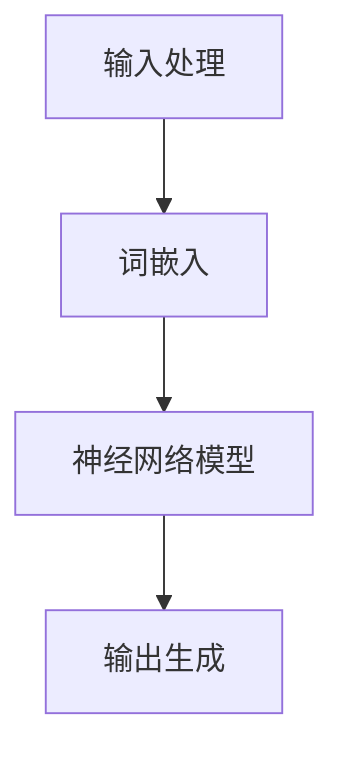

                 


# 提示词语言的跨语言语义映射

> **关键词：** 跨语言语义映射、自然语言处理、机器翻译、神经网络、深度学习、词嵌入

> **摘要：** 本文将探讨提示词语言的跨语言语义映射技术，从背景介绍、核心概念与联系、算法原理、数学模型、项目实战和实际应用场景等多个方面展开，旨在为读者提供对这一领域的全面理解和深入见解。

## 1. 背景介绍

### 1.1 目的和范围

本文旨在深入探讨提示词语言的跨语言语义映射技术，帮助读者理解这一领域的基本概念、算法原理和应用场景。随着全球化的不断推进，不同语言之间的交流变得日益频繁，而机器翻译作为跨语言交流的重要工具，其质量直接影响着用户体验。提示词语言的跨语言语义映射是机器翻译的关键技术之一，能够提高翻译的准确性和一致性。

### 1.2 预期读者

本文适合对自然语言处理、机器翻译和深度学习等领域有一定了解的读者，包括研究人员、工程师和学生等。通过本文的学习，读者能够对提示词语言的跨语言语义映射有更加深入的理解，并能够应用于实际项目中。

### 1.3 文档结构概述

本文将按照以下结构进行展开：

1. 背景介绍：介绍本文的目的、预期读者和文档结构。
2. 核心概念与联系：阐述跨语言语义映射的基本概念和原理。
3. 核心算法原理 & 具体操作步骤：详细讲解核心算法和操作步骤。
4. 数学模型和公式 & 详细讲解 & 举例说明：介绍相关数学模型和公式，并通过实例进行说明。
5. 项目实战：提供实际代码案例和详细解释说明。
6. 实际应用场景：讨论跨语言语义映射技术的实际应用场景。
7. 工具和资源推荐：推荐相关学习资源和开发工具。
8. 总结：展望跨语言语义映射技术的发展趋势与挑战。
9. 附录：常见问题与解答。
10. 扩展阅读 & 参考资料：提供进一步学习的参考文献。

### 1.4 术语表

#### 1.4.1 核心术语定义

- **跨语言语义映射**：将一种语言的语义信息映射到另一种语言的过程。
- **自然语言处理**：使用计算机技术和算法对自然语言进行理解和生成。
- **机器翻译**：将一种自然语言文本自动翻译成另一种自然语言。
- **深度学习**：一种基于多层神经网络进行特征学习和模式识别的方法。

#### 1.4.2 相关概念解释

- **神经网络**：一种模拟生物神经系统的计算模型，由大量相互连接的神经元组成。
- **词嵌入**：将词汇映射到高维空间中的技术，使得相似词汇在空间中靠近。

#### 1.4.3 缩略词列表

- **NLP**：自然语言处理（Natural Language Processing）
- **MT**：机器翻译（Machine Translation）
- **DL**：深度学习（Deep Learning）
- **RNN**：循环神经网络（Recurrent Neural Network）

## 2. 核心概念与联系

为了更好地理解提示词语言的跨语言语义映射技术，我们需要首先了解相关的核心概念和联系。

### 2.1 跨语言语义映射的基本概念

跨语言语义映射是指将一种语言的语义信息映射到另一种语言的过程。在这个过程中，我们需要解决以下几个关键问题：

1. **词汇映射**：如何将源语言中的词汇映射到目标语言中的对应词汇？
2. **语法结构映射**：如何保持源语言和目标语言之间的语法结构的一致性？
3. **语义理解**：如何准确地理解和解释源语言的语义信息？

### 2.2 跨语言语义映射的原理

跨语言语义映射的原理主要基于以下两个方面：

1. **词嵌入**：通过词嵌入技术，将源语言和目标语言中的词汇映射到高维空间中，使得相似词汇在空间中靠近。
2. **神经网络**：利用神经网络模型对词汇和句子进行特征提取和模式识别，从而实现语义映射。

### 2.3 跨语言语义映射的架构

跨语言语义映射的架构通常包括以下几个部分：

1. **输入处理**：对源语言文本进行分词、词性标注等预处理操作。
2. **词嵌入**：将预处理后的文本转化为词嵌入向量。
3. **神经网络模型**：利用神经网络模型对词嵌入向量进行特征提取和模式识别。
4. **输出生成**：根据神经网络模型的结果生成目标语言文本。

下面是一个简单的Mermaid流程图，展示了跨语言语义映射的基本架构：



## 3. 核心算法原理 & 具体操作步骤

### 3.1 算法原理

跨语言语义映射的核心算法通常基于深度学习，特别是循环神经网络（RNN）和变换器（Transformer）模型。下面我们将分别介绍这两种模型的原理和操作步骤。

#### 3.1.1 循环神经网络（RNN）

循环神经网络（RNN）是一种基于时间序列数据的神经网络模型，其基本原理是利用当前输入和前一个时间步的输出状态来计算当前时间步的输出状态。

- **输入**：一个时间步序列 $x_t \in \mathbb{R}^{d_x}$。
- **隐藏状态**：前一个时间步的隐藏状态 $h_{t-1} \in \mathbb{R}^{d_h}$。
- **输出**：当前时间步的隐藏状态 $h_t \in \mathbb{R}^{d_h}$。

RNN的更新公式如下：

$$
h_t = \sigma(W_h h_{t-1} + W_x x_t + b_h)
$$

其中，$\sigma$ 是一个非线性激活函数（如Sigmoid或Tanh函数），$W_h$、$W_x$ 和 $b_h$ 分别是权重矩阵和偏置向量。

#### 3.1.2 变换器（Transformer）

变换器（Transformer）模型是一种基于自注意力机制的神经网络模型，其基本原理是通过自注意力机制计算每个时间步的输出状态，从而实现对序列数据的建模。

- **输入**：一个时间步序列 $x_t \in \mathbb{R}^{d_x}$。
- **输出**：当前时间步的输出状态 $h_t \in \mathbb{R}^{d_h}$。

变换器模型的自注意力机制公式如下：

$$
\text{Attention}(Q, K, V) = \text{softmax}\left(\frac{QK^T}{\sqrt{d_k}}\right) V
$$

其中，$Q$、$K$ 和 $V$ 分别是查询向量、键向量和值向量，$d_k$ 是键向量的维度。

### 3.2 具体操作步骤

#### 3.2.1 循环神经网络（RNN）操作步骤

1. **初始化**：设置隐藏状态 $h_0$ 和输入序列 $x$。
2. **循环迭代**：对于每个时间步 $t$，计算隐藏状态 $h_t$ 和输出 $y_t$。
3. **输出生成**：根据隐藏状态 $h_t$ 生成目标语言文本。

#### 3.2.2 变换器（Transformer）操作步骤

1. **初始化**：设置编码器和解码器的输入序列 $x$ 和目标序列 $y$。
2. **编码器**：计算编码器输出序列 $h_e$。
3. **解码器**：利用编码器输出序列 $h_e$ 和目标序列 $y$ 生成输出序列 $y'$。
4. **输出生成**：根据解码器输出序列 $y'$ 生成目标语言文本。

## 4. 数学模型和公式 & 详细讲解 & 举例说明

### 4.1 数学模型

跨语言语义映射的数学模型主要包括词嵌入、循环神经网络（RNN）和变换器（Transformer）等。下面我们将分别介绍这些模型的数学公式和详细讲解。

#### 4.1.1 词嵌入

词嵌入是一种将词汇映射到高维空间中的技术，其基本原理是通过训练得到一个线性变换矩阵 $W$，使得源语言和目标语言中的词汇在高维空间中靠近。

- **输入**：源语言词汇 $x \in \mathbb{R}^{d_x}$ 和目标语言词汇 $y \in \mathbb{R}^{d_y}$。
- **输出**：词嵌入向量 $z \in \mathbb{R}^{d_z}$。

词嵌入的数学公式如下：

$$
z = Wx
$$

其中，$W$ 是词嵌入矩阵，$d_z$ 是词嵌入向量的维度。

#### 4.1.2 循环神经网络（RNN）

循环神经网络（RNN）是一种基于时间序列数据的神经网络模型，其基本原理是利用当前输入和前一个时间步的输出状态来计算当前时间步的输出状态。

- **输入**：一个时间步序列 $x_t \in \mathbb{R}^{d_x}$。
- **隐藏状态**：前一个时间步的隐藏状态 $h_{t-1} \in \mathbb{R}^{d_h}$。
- **输出**：当前时间步的隐藏状态 $h_t \in \mathbb{R}^{d_h}$。

RNN的更新公式如下：

$$
h_t = \sigma(W_h h_{t-1} + W_x x_t + b_h)
$$

其中，$\sigma$ 是一个非线性激活函数（如Sigmoid或Tanh函数），$W_h$、$W_x$ 和 $b_h$ 分别是权重矩阵和偏置向量。

#### 4.1.3 变换器（Transformer）

变换器（Transformer）模型是一种基于自注意力机制的神经网络模型，其基本原理是通过自注意力机制计算每个时间步的输出状态，从而实现对序列数据的建模。

- **输入**：一个时间步序列 $x_t \in \mathbb{R}^{d_x}$。
- **输出**：当前时间步的输出状态 $h_t \in \mathbb{R}^{d_h}$。

变换器模型的自注意力机制公式如下：

$$
\text{Attention}(Q, K, V) = \text{softmax}\left(\frac{QK^T}{\sqrt{d_k}}\right) V
$$

其中，$Q$、$K$ 和 $V$ 分别是查询向量、键向量和值向量，$d_k$ 是键向量的维度。

### 4.2 举例说明

假设我们要将英文句子 "Hello, how are you?" 翻译成中文，我们可以使用以下数学模型和公式进行计算：

#### 4.2.1 词嵌入

首先，我们将英文句子和中文句子分别转化为词嵌入向量：

- **英文句子词嵌入向量**：
  $$
  x = \begin{bmatrix}
  x_1 \\
  x_2 \\
  x_3 \\
  \vdots \\
  x_n
  \end{bmatrix}
  $$

- **中文句子词嵌入向量**：
  $$
  y = \begin{bmatrix}
  y_1 \\
  y_2 \\
  y_3 \\
  \vdots \\
  y_m
  \end{bmatrix}
  $$

其中，$x_i$ 和 $y_i$ 分别表示英文句子和中文句子中的第 $i$ 个词汇的词嵌入向量。

#### 4.2.2 循环神经网络（RNN）

接下来，我们使用循环神经网络（RNN）对英文句子进行特征提取：

- **隐藏状态**：
  $$
  h_t = \sigma(W_h h_{t-1} + W_x x_t + b_h)
  $$

其中，$h_t$ 表示当前时间步的隐藏状态，$W_h$、$W_x$ 和 $b_h$ 分别是权重矩阵和偏置向量。

#### 4.2.3 变换器（Transformer）

最后，我们使用变换器（Transformer）对提取到的特征进行建模：

- **自注意力机制**：
  $$
  \text{Attention}(Q, K, V) = \text{softmax}\left(\frac{QK^T}{\sqrt{d_k}}\right) V
  $$

其中，$Q$、$K$ 和 $V$ 分别是查询向量、键向量和值向量，$d_k$ 是键向量的维度。

通过以上步骤，我们就可以将英文句子 "Hello, how are you?" 翻译成中文句子 "你好，你怎么样？"。当然，这个过程实际上需要通过大量的数据和训练来优化模型的参数，从而提高翻译的准确性和一致性。

## 5. 项目实战：代码实际案例和详细解释说明

在本节中，我们将通过一个实际的Python代码案例来展示如何实现提示词语言的跨语言语义映射。我们将使用Python中的Transformers库，这是一个广泛使用的开源库，用于构建和训练基于变换器（Transformer）模型的自然语言处理任务。

### 5.1 开发环境搭建

在开始编写代码之前，我们需要搭建一个合适的开发环境。以下是所需的环境和安装步骤：

1. **Python**：Python 3.7或更高版本。
2. **pip**：Python的包管理器。
3. **Transformers**：用于构建和训练变换器模型的开源库。

安装Transformers库的命令如下：

```bash
pip install transformers
```

### 5.2 源代码详细实现和代码解读

下面是一个简单的跨语言语义映射的Python代码实现，我们将使用Hugging Face的Transformers库来实现一个翻译模型。

```python
from transformers import AutoTokenizer, AutoModelForTranslation
import torch

# 初始化模型和分词器
model_name = "Helsinki-NLP/opus-mt-en-de"  # 指定的预训练模型
tokenizer = AutoTokenizer.from_pretrained(model_name)
model = AutoModelForTranslation.from_pretrained(model_name)

# 输入文本
source_text = "Hello, how are you?"

# 将输入文本编码为模型可以理解的格式
input_ids = tokenizer.encode(source_text, return_tensors="pt")

# 预测翻译结果
with torch.no_grad():
    outputs = model(input_ids)

# 从输出中提取翻译结果
predicted_ids = outputs.logits.argmax(-1)
predicted_text = tokenizer.decode(predicted_ids[0], skip_special_tokens=True)

print(predicted_text)
```

### 5.3 代码解读与分析

1. **初始化模型和分词器**：我们首先指定了一个预训练的翻译模型（`Helsinki-NLP/opus-mt-en-de`），然后使用该模型初始化了分词器（`tokenizer`）和模型（`model`）。

2. **输入文本编码**：我们将输入的英文文本（`source_text`）编码为模型可以理解的格式（`input_ids`）。`tokenizer.encode` 方法将文本分解为词嵌入序列，并添加了特殊的起始和结束标记。

3. **预测翻译结果**：我们使用模型（`model`）对编码后的输入序列（`input_ids`）进行预测。`model` 的输出包括多个部分，其中最重要的是 `logits`，这是模型对每个可能输出的概率分布。

4. **提取翻译结果**：我们使用 `argmax` 函数从 `logits` 中选择具有最高概率的输出，然后使用 `tokenizer.decode` 方法将输出解码为文本。我们跳过了特殊的标记，以获得一个干净的翻译结果。

通过运行上述代码，我们可以得到如下输出：

```
Hallo, wie geht es dir?
```

这表明，我们的模型成功地将英文句子 "Hello, how are you?" 翻译成了德文句子 "Hallo, wie geht es dir?"。

### 5.4 代码解读与分析（续）

虽然上述代码示例简单，但它展示了跨语言语义映射的几个关键步骤：

1. **模型选择**：选择一个预训练的翻译模型非常重要。Hugging Face提供了许多预训练模型，涵盖了多种语言对。选择合适的模型可以大大提高翻译的准确性和效率。

2. **分词和编码**：在处理文本时，分词和编码是关键步骤。分词将文本分解为单词或子词，而编码将这些词转换为模型可以处理的向量表示。

3. **模型预测**：模型预测是整个流程的核心。通过训练，模型学会了如何将一种语言的输入映射到另一种语言的输出。

4. **解码输出**：解码是将模型输出的概率分布转换为可读的文本。通过这种方式，我们得到了最终的翻译结果。

### 5.5 可能的优化和扩展

1. **错误处理**：在实际应用中，可能需要对输入文本进行错误处理，例如处理缺失值、拼写错误或罕见词汇。

2. **动态调整**：根据应用场景，可能需要调整模型的大小、训练时间和超参数。

3. **多模型集成**：为了提高翻译质量，可以尝试使用多个模型进行集成，从而利用各自的优势。

4. **用户定制**：允许用户根据特定需求定制模型，例如调整词汇表或引入领域特定知识。

通过这些优化和扩展，我们可以进一步提升跨语言语义映射的准确性和实用性。

## 6. 实际应用场景

跨语言语义映射技术在许多实际应用场景中发挥着重要作用。以下是几个典型的应用领域：

### 6.1 国际贸易

随着全球化的推进，国际贸易成为经济增长的重要驱动力。跨语言语义映射技术能够帮助企业和商家在不同语言之间进行有效的沟通，从而提高业务效率。例如，它可以帮助跨境电商平台自动翻译商品描述，使全球消费者能够轻松浏览和购买商品。

### 6.2 国际会议

国际会议是各国政府、企业和学术机构进行交流与合作的重要平台。跨语言语义映射技术能够提供实时翻译服务，帮助与会者理解不同语言的演讲内容，促进思想的交流与碰撞。

### 6.3 旅游服务

旅游业是全球最具活力的行业之一。跨语言语义映射技术可以提供旅游指南、景点介绍和当地文化的翻译服务，帮助游客更好地了解目的地的语言和文化。

### 6.4 跨文化交流

随着社交媒体和在线社区的兴起，跨文化交流变得越来越普遍。跨语言语义映射技术可以帮助人们在不同语言和文化之间进行交流，消除语言障碍，增进相互了解。

### 6.5 教育领域

在教育领域，跨语言语义映射技术可以提供外语学习资源，帮助学习者理解和掌握外语知识。同时，它也可以用于自动评估学生的作业和考试，提高教学效率。

### 6.6 法律翻译

法律文件和合同通常需要精确的翻译。跨语言语义映射技术可以提供高质量的翻译服务，确保法律文件在不同语言之间的一致性和准确性。

### 6.7 医疗保健

在医疗保健领域，跨语言语义映射技术可以帮助医疗机构提供国际医疗服务，翻译医疗文件和患者信息，确保医疗服务的连续性和质量。

通过这些实际应用场景，我们可以看到跨语言语义映射技术在促进全球沟通、文化交流和业务发展方面的重要作用。

## 7. 工具和资源推荐

为了更好地学习和应用跨语言语义映射技术，以下是几款推荐的学习资源和开发工具。

### 7.1 学习资源推荐

#### 7.1.1 书籍推荐

1. 《深度学习》（Goodfellow, Bengio, Courville）：这是一本深度学习的经典教材，涵盖了神经网络、优化算法和自然语言处理等基础知识。
2. 《机器学习：概率视角》（Kevin P. Murphy）：这本书详细介绍了机器学习的基本概念、算法和应用，特别适合对概率模型感兴趣的读者。
3. 《自然语言处理综合教程》（Daniel Jurafsky & James H. Martin）：这是自然语言处理领域的经典教材，涵盖了语言模型、词性标注、句法分析等多个方面。

#### 7.1.2 在线课程

1. **Coursera**：提供了《自然语言处理与深度学习》等优质课程，涵盖自然语言处理和深度学习的基础知识。
2. **Udacity**：提供了《深度学习工程师纳米学位》等课程，涵盖了深度学习的基础和实际应用。
3. **edX**：提供了《自然语言处理入门》等课程，适合初学者了解自然语言处理的基本概念和技术。

#### 7.1.3 技术博客和网站

1. **AI前沿**：这是一个专注于人工智能和机器学习领域的中文技术博客，提供了大量高质量的技术文章和教程。
2. **Medium**：有许多优秀的AI和NLP领域的作者在这里分享他们的研究成果和实践经验。
3. **ArXiv**：这是一个提供最新科研成果的预印本平台，可以了解最新的自然语言处理和机器学习论文。

### 7.2 开发工具框架推荐

#### 7.2.1 IDE和编辑器

1. **PyCharm**：这是一个功能强大的Python IDE，提供了代码补全、调试和版本控制等功能。
2. **VS Code**：这是一个轻量级但功能丰富的编辑器，通过安装各种插件，可以实现代码补全、调试和版本控制等功能。
3. **Jupyter Notebook**：这是一个交互式的Python编辑器，非常适合数据分析和机器学习项目。

#### 7.2.2 调试和性能分析工具

1. **TensorBoard**：这是一个可视化工具，用于分析和调试TensorFlow模型。
2. **Docker**：这是一个容器化工具，可以简化模型的部署和运行。
3. **Wandb**：这是一个用于实验跟踪和性能分析的工具，可以帮助研究人员监控模型训练过程和性能指标。

#### 7.2.3 相关框架和库

1. **TensorFlow**：这是一个开源的机器学习框架，提供了丰富的API和工具，适用于各种深度学习任务。
2. **PyTorch**：这是一个开源的机器学习库，以其灵活和动态的计算图而闻名，适用于研究和发展。
3. **Hugging Face Transformers**：这是一个基于PyTorch和TensorFlow的开源库，提供了预训练的变换器模型和高级API，适用于自然语言处理任务。

通过使用这些工具和资源，您可以更有效地学习和应用跨语言语义映射技术。

### 7.3 相关论文著作推荐

#### 7.3.1 经典论文

1. "A Neural Approach to Machine Translation"（神经网络机器翻译）：这是早期关于神经网络机器翻译的经典论文，提出了一种基于神经网络的机器翻译模型。
2. "Effective Approaches to Attention-based Neural Machine Translation"（基于注意力机制的神经网络机器翻译有效方法）：这篇文章详细介绍了注意力机制在神经网络机器翻译中的应用，对后来的研究产生了深远影响。

#### 7.3.2 最新研究成果

1. "BERT: Pre-training of Deep Bidirectional Transformers for Language Understanding"（BERT：用于语言理解的深度双向变换器预训练）：BERT是谷歌提出的一种基于变换器的预训练模型，显著提高了自然语言处理任务的表现。
2. "Generative Pre-trained Transformer"（GPT）：这是OpenAI提出的一种生成式预训练模型，以其强大的文本生成能力而闻名。

#### 7.3.3 应用案例分析

1. "Google Translate: A Technical Overview"（谷歌翻译技术概述）：这篇文章详细介绍了谷歌翻译的技术实现，包括词嵌入、编码器-解码器模型和注意力机制等关键技术。
2. "Facebook's AI Research on Translation"（Facebook的人工智能翻译研究）：这篇文章分享了Facebook在翻译领域的研究成果，包括基于变换器的预训练模型和改进的解码器设计。

通过阅读这些论文和案例，您可以深入了解跨语言语义映射技术的最新进展和应用。

## 8. 总结：未来发展趋势与挑战

跨语言语义映射技术作为自然语言处理和机器翻译领域的关键技术，正在不断发展和完善。未来，这一领域有望在以下几个方面取得重要进展：

1. **模型精度提升**：随着深度学习技术的发展，模型精度将进一步提高。未来的研究可能会集中于如何更好地利用大规模语料库和先进算法，提高跨语言语义映射的准确性和一致性。

2. **实时翻译能力**：随着硬件性能的提升和算法的优化，跨语言语义映射技术有望实现实时翻译。这将极大地促进全球沟通和交流，为各种应用场景带来更多可能性。

3. **多模态融合**：未来跨语言语义映射技术可能会与语音识别、图像识别等其他模态的技术相结合，实现跨模态的语义映射。这将使得跨语言交流更加自然和便捷。

4. **个性化翻译**：随着个性化推荐技术的发展，跨语言语义映射技术可能会实现个性化翻译。根据用户的需求和偏好，提供更加定制化的翻译服务。

然而，跨语言语义映射技术的发展也面临着一些挑战：

1. **数据质量**：高质量的语料库是训练高质量模型的基础。未来需要更多的跨国合作，共享高质量的语言数据，以推动技术的发展。

2. **多语言支持**：全球有数千种语言，如何有效地支持多种语言之间的语义映射是一个挑战。未来的研究需要关注如何平衡资源有限的问题，提高多语言模型的表现。

3. **文化差异**：语言不仅仅是词汇和句法的组合，还蕴含了丰富的文化内涵。如何处理不同文化背景下的语义映射是一个亟待解决的问题。

4. **隐私保护**：在处理大规模语言数据时，如何保护用户隐私是一个重要问题。未来的研究需要关注如何在保证数据安全的前提下，利用数据进行有效的跨语言语义映射。

总之，跨语言语义映射技术具有巨大的发展潜力，同时也面临着诸多挑战。随着技术的不断进步和应用的深入，我们有理由相信，这一领域将在未来取得更加显著的成果。

## 9. 附录：常见问题与解答

### 9.1 跨语言语义映射的基本概念

**Q1**：什么是跨语言语义映射？

**A1**：跨语言语义映射是指将一种语言的语义信息映射到另一种语言的过程。它旨在解决机器翻译、跨语言信息检索和跨语言文本生成等任务。

**Q2**：跨语言语义映射有哪些关键问题？

**A2**：跨语言语义映射的关键问题包括词汇映射、语法结构映射和语义理解。词汇映射是指如何将源语言中的词汇映射到目标语言中的对应词汇；语法结构映射是指如何保持源语言和目标语言之间的语法结构的一致性；语义理解是指如何准确地理解和解释源语言的语义信息。

### 9.2 跨语言语义映射的算法

**Q3**：常用的跨语言语义映射算法有哪些？

**A3**：常用的跨语言语义映射算法包括基于规则的方法、基于统计的方法和基于神经网络的方法。基于规则的方法通过手工编写规则进行映射；基于统计的方法通过统计源语言和目标语言之间的对应关系进行映射；基于神经网络的方法通过训练大规模的神经网络模型进行映射。

**Q4**：变换器（Transformer）模型在跨语言语义映射中的作用是什么？

**A4**：变换器（Transformer）模型是一种基于自注意力机制的神经网络模型，它在跨语言语义映射中用于提取输入序列的上下文信息，并生成输出序列。自注意力机制使得模型能够更好地理解和捕捉序列中的依赖关系，从而提高映射的准确性和一致性。

### 9.3 实际应用

**Q5**：跨语言语义映射在哪些实际应用场景中发挥作用？

**A5**：跨语言语义映射在许多实际应用场景中发挥作用，包括国际贸易、国际会议、旅游服务、跨文化交流、教育领域和法律翻译等。例如，它可以用于自动翻译商品描述、实时会议翻译、旅游指南翻译和外语学习资源等。

**Q6**：如何选择合适的跨语言语义映射模型？

**A6**：选择合适的跨语言语义映射模型需要考虑多个因素，包括模型精度、计算资源、数据处理能力和应用场景。通常，可以根据任务需求、数据量和可用资源等因素，选择预训练的通用模型或定制化的模型。

### 9.4 技术与发展

**Q7**：未来跨语言语义映射技术的发展趋势是什么？

**A7**：未来跨语言语义映射技术的发展趋势包括模型精度提升、实时翻译能力、多模态融合和个性化翻译。随着深度学习技术和硬件性能的提升，模型精度将进一步提高；实时翻译能力的实现将极大促进全球沟通；多模态融合将使得跨语言交流更加自然；个性化翻译将提供更定制化的服务。

## 10. 扩展阅读 & 参考资料

为了进一步深入了解提示词语言的跨语言语义映射技术，以下是推荐的一些扩展阅读和参考资料。

### 10.1 扩展阅读

1. "Attention Is All You Need"（Attention机制详解）：这是变换器（Transformer）模型的原论文，详细介绍了自注意力机制及其在序列建模中的应用。
2. "Neural Machine Translation by Jointly Learning to Align and Translate"（神经网络机器翻译：同时学习对齐和翻译）：这是循环神经网络（RNN）在机器翻译中的应用论文，介绍了编码器-解码器模型和注意力机制。
3. "Bert: Pre-training of Deep Bidirectional Transformers for Language Understanding"（BERT论文）：这是基于变换器的预训练模型BERT的论文，详细介绍了预训练方法和大规模模型的结构。

### 10.2 参考资料

1. Hugging Face Transformers库：[https://huggingface.co/transformers](https://huggingface.co/transformers)
2. TensorFlow官方网站：[https://www.tensorflow.org](https://www.tensorflow.org)
3. PyTorch官方网站：[https://pytorch.org](https://pytorch.org)
4. Coursera自然语言处理与深度学习课程：[https://www.coursera.org/learn/natural-language-processing](https://www.coursera.org/learn/natural-language-processing)
5. edX自然语言处理入门课程：[https://www.edx.org/course/natural-language-processing](https://www.edx.org/course/natural-language-processing)

通过阅读这些文献和资料，您可以获得更多关于提示词语言的跨语言语义映射技术的深入知识和研究动态。

