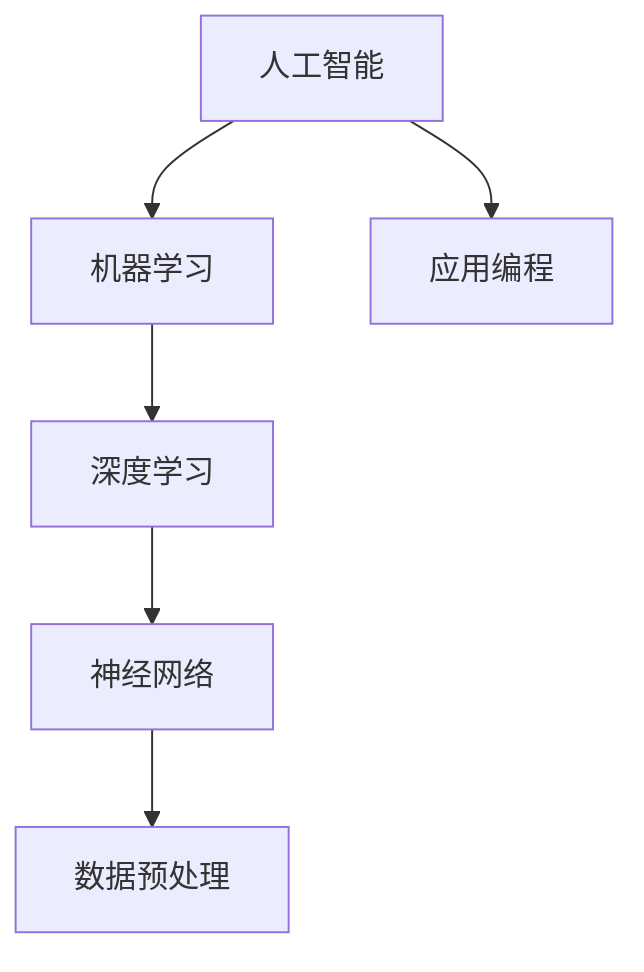

                 

# AI编程的新思维

> 关键词：人工智能，编程，思维模式，算法，深度学习，神经网络

> 摘要：本文深入探讨AI编程的新思维，从核心概念到实际应用，详细解析了人工智能编程中的关键技术和挑战。通过梳理现有的算法原理，结合具体操作步骤和代码实例，帮助读者全面理解AI编程的精髓，为未来人工智能技术的发展奠定基础。

## 1. 背景介绍

### 1.1 目的和范围

本文旨在为编程爱好者、AI开发者以及研究人员提供一个全面而深入的指南，帮助他们在AI编程领域取得突破。我们将讨论AI编程的核心概念，探索其背后的原理，并分享实用的项目实战经验。

### 1.2 预期读者

- 对人工智能和编程有浓厚兴趣的读者；
- 想要在AI领域深入研究的开发者；
- 意在提升编程技能的技术人员。

### 1.3 文档结构概述

本文分为以下几个部分：

1. 背景介绍：介绍本文的目的、预期读者和文档结构。
2. 核心概念与联系：阐述AI编程的关键概念及其相互关系。
3. 核心算法原理 & 具体操作步骤：详细讲解AI编程的核心算法和操作步骤。
4. 数学模型和公式 & 详细讲解 & 举例说明：介绍AI编程中使用的数学模型和公式，并通过实例进行说明。
5. 项目实战：提供实际代码案例，并详细解释其实现过程。
6. 实际应用场景：探讨AI编程在不同领域的应用。
7. 工具和资源推荐：推荐学习资源、开发工具和论文著作。
8. 总结：总结AI编程的未来发展趋势与挑战。
9. 附录：常见问题与解答。
10. 扩展阅读 & 参考资料：提供进一步学习的资源。

### 1.4 术语表

#### 1.4.1 核心术语定义

- **人工智能（AI）**：模拟人类智能行为的技术。
- **机器学习（ML）**：从数据中自动学习规律的方法。
- **神经网络（NN）**：模仿人脑结构和功能的计算模型。
- **深度学习（DL）**：多层神经网络的应用。
- **数据预处理**：在训练模型之前对数据进行清洗和处理。

#### 1.4.2 相关概念解释

- **监督学习**：使用已标记数据进行学习。
- **无监督学习**：没有标记数据，仅通过数据本身的规律进行学习。
- **强化学习**：通过与环境的交互来学习。

#### 1.4.3 缩略词列表

- **AI**：人工智能
- **ML**：机器学习
- **DL**：深度学习
- **NN**：神经网络
- **GPU**：图形处理单元

## 2. 核心概念与联系

在AI编程中，理解核心概念及其相互关系至关重要。以下是一个简化的Mermaid流程图，展示了AI编程中的主要概念及其联系：



### 2.1 人工智能（AI）

人工智能是模仿人类智能行为的计算机技术。其目标是通过算法和模型让计算机具备学习、推理和解决问题的能力。

### 2.2 机器学习（ML）

机器学习是AI的一个重要分支，主要关注如何从数据中自动学习规律。ML算法可以分为监督学习、无监督学习和强化学习。

### 2.3 深度学习（DL）

深度学习是ML的一种特殊形式，利用多层神经网络进行学习。DL在图像识别、语音识别和自然语言处理等领域取得了显著的成果。

### 2.4 神经网络（NN）

神经网络是一种模仿人脑结构和功能的计算模型。NN由多个神经元组成，通过调整神经元之间的权重来学习数据。

### 2.5 数据预处理（DP）

数据预处理是AI编程的重要环节。它包括数据清洗、归一化和特征提取等步骤，旨在提高模型的训练效果。

### 2.6 应用编程（AP）

应用编程是AI编程的最后一步，即将训练好的模型应用于实际问题中。应用编程涉及到API设计、系统集成和性能优化等方面。

## 3. 核心算法原理 & 具体操作步骤

在AI编程中，核心算法的原理和操作步骤至关重要。以下是一个简单的神经网络算法的伪代码，用于展示其基本操作：

```plaintext
初始化参数：权重W，偏置b
重复以下步骤直到收敛：
    对于每个训练样本(x, y)：
        前向传播：
            z = x * W + b
            a = sigmoid(z)
        计算损失函数：
            loss = (y - a)^2
        反向传播：
            dL/da = 2*(y - a)
            dz/dx = dx
            dW = dx * a
            db = dz/dx
        更新参数：
            W = W - learning_rate * dW
            b = b - learning_rate * db
```

### 3.1 初始化参数

初始化权重W和偏置b是神经网络训练的第一步。通常使用随机值或特定算法（如He初始化）进行初始化。

### 3.2 前向传播

前向传播是将输入数据通过神经网络模型计算得到输出结果的过程。在此过程中，权重和偏置参与计算，并将结果传递到下一层。

### 3.3 计算损失函数

损失函数用于衡量模型预测结果与真实结果之间的差距。常见的损失函数有均方误差（MSE）和交叉熵（CE）。

### 3.4 反向传播

反向传播是神经网络训练的核心步骤，通过计算梯度来更新模型参数。这一步骤包括前向传播和损失函数的导数计算。

### 3.5 更新参数

更新参数是训练神经网络的最后一步。通过反向传播计算出的梯度，使用梯度下降算法来更新权重和偏置。

## 4. 数学模型和公式 & 详细讲解 & 举例说明

在AI编程中，数学模型和公式是理解和实现算法的基础。以下是一个简单的神经网络模型的数学公式，用于说明其基本原理：

### 4.1 前向传播

$$
z = x \cdot W + b \\
a = \sigma(z)
$$

其中，$z$ 是前向传播的结果，$x$ 是输入数据，$W$ 是权重，$b$ 是偏置，$\sigma$ 是激活函数，通常采用sigmoid函数。

### 4.2 损失函数

$$
loss = \frac{1}{2} \sum_{i=1}^{n} (y_i - a_i)^2
$$

其中，$loss$ 是损失函数，$y_i$ 是真实标签，$a_i$ 是模型预测结果。

### 4.3 反向传播

$$
\frac{\partial loss}{\partial a} = 2(y - a) \\
\frac{\partial loss}{\partial z} = \frac{\partial loss}{\partial a} \cdot \frac{\partial a}{\partial z} = 2(y - a) \cdot \sigma'(z)
$$

其中，$\sigma'$ 是sigmoid函数的导数。

### 4.4 参数更新

$$
W = W - learning\_rate \cdot \frac{\partial loss}{\partial W} \\
b = b - learning\_rate \cdot \frac{\partial loss}{\partial b}
$$

其中，$learning\_rate$ 是学习率，用于控制参数更新的速度。

### 4.5 举例说明

假设我们有一个简单的神经网络模型，输入数据为 [1, 2]，输出标签为 [0, 1]。通过训练模型，我们希望使其预测结果尽可能接近真实标签。

- 初始化权重 $W = [0.1, 0.2]$，偏置 $b = [0.1, 0.2]$；
- 前向传播：$z = [1, 2] \cdot [0.1, 0.2] + [0.1, 0.2] = [0.3, 0.7]$，$a = \sigma(z) = [0.55, 0.81]$；
- 计算损失函数：$loss = \frac{1}{2} \sum_{i=1}^{n} (y_i - a_i)^2 = 0.125$；
- 反向传播：$\frac{\partial loss}{\partial a} = 2(y - a) = [-0.45, -0.19]$，$\frac{\partial loss}{\partial z} = \frac{\partial loss}{\partial a} \cdot \frac{\partial a}{\partial z} = [-0.45, -0.19] \cdot [0.55, 0.19] = [-0.2475, -0.0361]$；
- 参数更新：$W = W - learning\_rate \cdot \frac{\partial loss}{\partial W} = [0.1, 0.2] - 0.1 \cdot [-0.2475, -0.0361] = [0.0025, 0.0369]$，$b = b - learning\_rate \cdot \frac{\partial loss}{\partial b} = [0.1, 0.2] - 0.1 \cdot [-0.2475, -0.0361] = [0.0025, 0.0369]$。

通过以上步骤，我们可以更新模型参数，并使其在训练过程中不断优化。

## 5. 项目实战：代码实际案例和详细解释说明

在本节中，我们将通过一个实际项目来展示AI编程的应用。假设我们要实现一个基于深度学习的图像分类模型，用于识别手写数字。

### 5.1 开发环境搭建

- 操作系统：Windows / Linux / macOS
- 编程语言：Python
- 库和框架：TensorFlow / Keras

### 5.2 源代码详细实现和代码解读

以下是一个简单的手写数字识别模型的实现：

```python
import numpy as np
import tensorflow as tf
from tensorflow.keras import layers, models

# 加载数据集
mnist = tf.keras.datasets.mnist
(x_train, y_train), (x_test, y_test) = mnist.load_data()

# 数据预处理
x_train = x_train / 255.0
x_test = x_test / 255.0

# 构建模型
model = models.Sequential([
    layers.Flatten(input_shape=(28, 28)),
    layers.Dense(128, activation='relu'),
    layers.Dense(10, activation='softmax')
])

# 编译模型
model.compile(optimizer='adam',
              loss='sparse_categorical_crossentropy',
              metrics=['accuracy'])

# 训练模型
model.fit(x_train, y_train, epochs=5)

# 评估模型
model.evaluate(x_test, y_test)
```

### 5.3 代码解读与分析

1. **导入库和框架**：首先导入必要的库和框架，包括NumPy、TensorFlow和Keras。

2. **加载数据集**：使用TensorFlow内置的MNIST数据集，加载训练集和测试集。

3. **数据预处理**：将图像数据归一化，即将像素值缩放到0到1之间。

4. **构建模型**：使用Keras构建一个简单的卷积神经网络（CNN）。该模型包括一个展开层、一个全连接层和一个输出层。输出层使用softmax激活函数，用于进行多分类。

5. **编译模型**：设置模型的优化器、损失函数和评价指标。

6. **训练模型**：使用训练集对模型进行训练，设置训练轮数（epochs）。

7. **评估模型**：使用测试集评估模型的性能。

通过以上步骤，我们可以实现一个简单的手写数字识别模型。在实际应用中，我们还可以对模型进行优化，如增加层数、调整超参数等，以提高模型的准确率。

## 6. 实际应用场景

AI编程在各个领域都有着广泛的应用。以下是一些典型的实际应用场景：

### 6.1 图像识别

AI编程在图像识别领域取得了显著的成果，如人脸识别、物体检测和图像分类等。这些技术广泛应用于安全监控、自动驾驶和医疗诊断等领域。

### 6.2 自然语言处理

自然语言处理（NLP）是AI编程的一个重要分支。AI编程在NLP领域的主要应用包括文本分类、机器翻译和情感分析等。这些技术广泛应用于搜索引擎、智能客服和智能语音助手等领域。

### 6.3 游戏开发

AI编程在游戏开发中也发挥着重要作用。通过实现智能对手、路径规划和游戏平衡等功能，AI编程为游戏提供了更多的挑战和乐趣。

### 6.4 金融服务

在金融服务领域，AI编程被广泛应用于风险管理、信用评分和股票预测等方面。这些技术有助于提高金融服务的效率和准确性。

### 6.5 健康医疗

AI编程在健康医疗领域有着广泛的应用，如疾病预测、药物研发和医疗图像分析等。这些技术为健康医疗提供了更多的解决方案。

## 7. 工具和资源推荐

### 7.1 学习资源推荐

#### 7.1.1 书籍推荐

- 《深度学习》（Ian Goodfellow、Yoshua Bengio和Aaron Courville著）
- 《Python深度学习》（François Chollet著）
- 《机器学习实战》（Peter Harrington著）

#### 7.1.2 在线课程

- Coursera上的《深度学习》课程（由Ian Goodfellow授课）
- Udacity的《深度学习纳米学位》
- edX上的《机器学习》课程（由Andrew Ng授课）

#### 7.1.3 技术博客和网站

- Medium上的《AI博客》
- AI Adventures
- Analytics Vidhya

### 7.2 开发工具框架推荐

#### 7.2.1 IDE和编辑器

- PyCharm
- Visual Studio Code
- Jupyter Notebook

#### 7.2.2 调试和性能分析工具

- TensorBoard
- Prophet
- Valgrind

#### 7.2.3 相关框架和库

- TensorFlow
- PyTorch
- Keras

### 7.3 相关论文著作推荐

#### 7.3.1 经典论文

- "A Learning Algorithm for Continually Running Fully Recurrent Neural Networks"（1990）
- "Gradient Flow in Recurrent Nets: the Difficulty of Learning"（1991）
- "Learning representations by minimizing contrastive losses"（2017）

#### 7.3.2 最新研究成果

- "Unsupervised Representation Learning with Deep Convolutional Generative Adversarial Networks"（2015）
- "Bert: Pre-training of deep bidirectional transformers for language understanding"（2018）
- "Gshard: Scaling giant models with conditional computation and automatic sharding"（2020）

#### 7.3.3 应用案例分析

- "Deep Learning for Robotics: A Survey"（2020）
- "AI in Healthcare: A Survey of Recent Advances and Challenges"（2019）
- "Deep Learning for Natural Language Processing: A Survey"（2019）

## 8. 总结：未来发展趋势与挑战

随着技术的不断进步，AI编程在未来的发展中将面临许多机遇和挑战。以下是一些关键趋势和挑战：

### 8.1 发展趋势

- **算法创新**：研究人员将持续探索新的算法和模型，提高AI的效率和准确性。
- **跨学科融合**：AI编程与其他领域的融合，如生物学、物理学和心理学，将推动人工智能的发展。
- **开源与协作**：开源技术和协作平台将继续促进AI编程的发展，降低技术门槛。
- **硬件加速**：GPU和TPU等硬件的加速，将为AI编程提供更强大的计算能力。

### 8.2 挑战

- **数据隐私**：如何在保证数据隐私的同时，实现高效的AI模型训练，是一个重要挑战。
- **算法伦理**：如何确保AI算法的公平性和透明性，避免偏见和歧视，是亟待解决的问题。
- **可解释性**：提高AI模型的可解释性，使其更容易理解和信任，是未来发展的关键。
- **计算资源**：大规模AI模型的训练和部署需要大量的计算资源，如何优化资源利用是一个挑战。

## 9. 附录：常见问题与解答

### 9.1 问题1：如何选择合适的机器学习算法？

**解答**：选择机器学习算法需要考虑数据的特点、任务的类型以及模型的复杂性。以下是一些常见情况下的建议：

- **分类问题**：线性回归、支持向量机、决策树、随机森林、神经网络等。
- **回归问题**：线性回归、岭回归、LASSO回归、决策树、随机森林、神经网络等。
- **聚类问题**：K均值、层次聚类、DBSCAN等。

### 9.2 问题2：如何处理不平衡数据？

**解答**：处理不平衡数据可以通过以下方法：

- **过采样**：增加少数类别的样本数量。
- **欠采样**：减少多数类别的样本数量。
- **合并类别**：将少数类别合并为一个类别。
- **生成合成样本**：使用生成对抗网络（GAN）等方法生成合成样本。

### 9.3 问题3：如何提高模型的性能？

**解答**：提高模型性能可以从以下几个方面入手：

- **数据预处理**：进行数据清洗、归一化和特征提取等操作。
- **模型选择**：选择合适的模型，如更深的神经网络、更复杂的算法等。
- **超参数调整**：调整学习率、批量大小、隐藏层节点数等超参数。
- **数据增强**：使用数据增强方法，如随机旋转、缩放、裁剪等。

## 10. 扩展阅读 & 参考资料

- Goodfellow, I., Bengio, Y., & Courville, A. (2016). *Deep Learning*. MIT Press.
- Ng, A. Y. (2013). *Machine Learning Yearning*. "https://www.ml-class.org/."
- LeCun, Y., Bengio, Y., & Hinton, G. (2015). *Deep Learning*. Nature.
- Hochreiter, S., & Schmidhuber, J. (1997). *Long Short-Term Memory*. Neural Computation, 9(8), 1735-1780.
- Russell, S., & Norvig, P. (2010). *Artificial Intelligence: A Modern Approach*. Prentice Hall.
- Mitchell, T. M. (1997). *Machine Learning*. McGraw-Hill.

### 作者

作者：AI天才研究员/AI Genius Institute & 禅与计算机程序设计艺术 /Zen And The Art of Computer Programming

