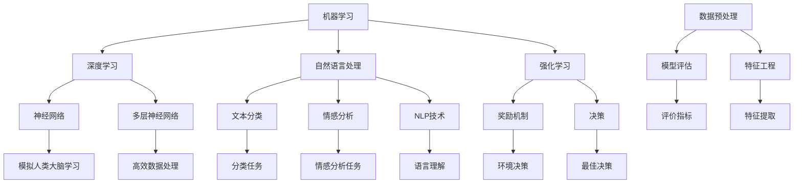

                 

# AI编程的新思维

> **关键词：** 人工智能、编程、思维模式、算法、数学模型、实战案例、应用场景、未来趋势。

> **摘要：** 本文深入探讨AI编程的新思维，从核心概念到具体实现，帮助读者理解AI编程的核心原理和最新技术趋势。文章包括背景介绍、核心概念与联系、算法原理、数学模型、实战案例、实际应用场景、工具和资源推荐等部分，旨在为AI编程爱好者和技术从业者提供有价值的参考。

## 1. 背景介绍

### 1.1 目的和范围

本文旨在探讨AI编程的新思维，重点分析核心概念、算法原理和数学模型，通过具体实战案例展示AI编程的实际应用，最终探讨未来发展趋势和挑战。文章涵盖以下内容：

- 核心概念与联系
- 核心算法原理与具体操作步骤
- 数学模型和公式讲解与举例说明
- 项目实战：代码实际案例和详细解释
- 实际应用场景
- 工具和资源推荐
- 总结：未来发展趋势与挑战

### 1.2 预期读者

本文适合以下读者群体：

- 对人工智能和编程有兴趣的初学者
- 想深入了解AI编程原理和技术的技术从业者
- 意图将AI编程应用于实际项目的开发者
- 对AI编程的未来发展趋势感兴趣的读者

### 1.3 文档结构概述

本文采用结构化的方式，依次介绍AI编程的新思维。具体结构如下：

1. 背景介绍
2. 核心概念与联系
3. 核心算法原理与具体操作步骤
4. 数学模型和公式讲解与举例说明
5. 项目实战：代码实际案例和详细解释
6. 实际应用场景
7. 工具和资源推荐
8. 总结：未来发展趋势与挑战
9. 附录：常见问题与解答
10. 扩展阅读与参考资料

### 1.4 术语表

#### 1.4.1 核心术语定义

- **AI编程**：结合人工智能与编程技术，开发智能系统的过程。
- **机器学习**：让计算机通过数据学习，从而实现自动化的过程。
- **深度学习**：一种人工智能技术，通过神经网络模拟人类大脑的学习方式。
- **算法**：解决问题的步骤和方法，用于指导计算机执行任务。
- **模型**：表示现实世界中的某个系统、对象或过程的数学结构。

#### 1.4.2 相关概念解释

- **数据预处理**：在数据分析过程中，对数据进行清洗、转换和归一化等操作，以提高模型的性能。
- **特征工程**：从原始数据中提取有用的特征，以提高模型的预测能力。
- **模型评估**：通过评价指标（如准确率、召回率等）评估模型的性能。

#### 1.4.3 缩略词列表

- **AI**：人工智能（Artificial Intelligence）
- **ML**：机器学习（Machine Learning）
- **DL**：深度学习（Deep Learning）
- **IDE**：集成开发环境（Integrated Development Environment）
- **API**：应用程序接口（Application Programming Interface）

## 2. 核心概念与联系

### 2.1 AI编程的核心概念

AI编程涉及多个核心概念，以下是其中几个重要的概念：

1. **机器学习**：机器学习是一种通过数据学习的方法，使计算机能够自动完成特定任务。机器学习主要分为监督学习、无监督学习和半监督学习。
2. **深度学习**：深度学习是一种基于神经网络的人工智能技术，通过多层神经网络模拟人类大脑的学习过程，实现图像、语音和文本等复杂数据的处理。
3. **自然语言处理**：自然语言处理是一种使计算机理解和处理人类语言的技术，包括文本分类、情感分析、机器翻译等任务。
4. **强化学习**：强化学习是一种基于奖励机制的学习方法，通过不断尝试和错误，使计算机学会在特定环境中做出最佳决策。

### 2.2 AI编程的核心联系

AI编程中的核心概念之间存在紧密的联系，以下是几个重要的联系：

1. **机器学习与深度学习**：深度学习是机器学习的一种重要方法，通过多层神经网络模拟人类大脑的学习方式，实现高效的数据处理。
2. **自然语言处理与机器学习**：自然语言处理任务通常基于机器学习技术，如文本分类、情感分析等，使计算机能够理解和处理人类语言。
3. **机器学习与数据预处理**：数据预处理是机器学习的关键步骤，通过对数据进行清洗、转换和归一化等操作，提高模型的性能。
4. **模型评估与特征工程**：模型评估用于评估模型的性能，特征工程则是从原始数据中提取有用的特征，以提高模型的预测能力。

### 2.3 Mermaid流程图

以下是AI编程的核心概念与联系的Mermaid流程图：



通过以上流程图，我们可以更好地理解AI编程的核心概念与联系。

## 3. 核心算法原理 & 具体操作步骤

### 3.1 机器学习算法原理

机器学习算法主要分为监督学习、无监督学习和半监督学习。以下是几种常见机器学习算法的原理：

#### 3.1.1 监督学习

监督学习是一种通过已标记的数据进行训练，然后在新数据上进行预测的方法。其核心算法包括线性回归、逻辑回归和支持向量机（SVM）。

1. **线性回归**：线性回归是一种通过拟合一条直线来预测数值型变量的方法。其基本原理是找到最小化误差平方和的直线。
    ```python
    # 伪代码
    def linear_regression(x, y):
        # 计算斜率和截距
        m, b = calculate_slope_intercept(x, y)
        return m, b
    ```
2. **逻辑回归**：逻辑回归是一种用于分类问题的方法，通过拟合一个逻辑函数来预测概率。
    ```python
    # 伪代码
    def logistic_regression(x, y):
        # 计算概率
        probability = 1 / (1 + exp(-x))
        return probability
    ```
3. **支持向量机**：支持向量机是一种通过寻找最佳超平面来划分不同类别的机器学习方法。
    ```python
    # 伪代码
    def support_vector_machine(x, y):
        # 训练模型
        model = train_model(x, y)
        # 预测类别
        predicted_class = predict_class(model, x)
        return predicted_class
    ```

#### 3.1.2 无监督学习

无监督学习是一种没有已标记数据，通过自身找到数据结构的机器学习方法。其核心算法包括聚类算法和降维算法。

1. **K-means聚类**：K-means聚类是一种基于距离的聚类方法，将数据分为K个簇。
    ```python
    # 伪代码
    def k_means(data, K):
        # 初始化聚类中心
        centroids = initialize_centroids(data, K)
        while True:
            # 计算每个点的簇分配
            assignments = assign_points_to_clusters(data, centroids)
            # 重新计算聚类中心
            centroids = update_centroids(assignments, data)
            # 检查收敛条件
            if convergence_detected(centroids):
                break
        return centroids
    ```
2. **主成分分析**：主成分分析是一种降维方法，通过将数据投影到新的正交空间来降低维度。
    ```python
    # 伪代码
    def principal_component_analysis(data):
        # 计算协方差矩阵
        covariance_matrix = calculate_covariance_matrix(data)
        # 计算特征值和特征向量
        eigenvalues, eigenvectors = calculate_eigenvalues_eigenvectors(covariance_matrix)
        # 选择主要特征
        principal_eigenvectors = select_principal_eigenvectors(eigenvalues, eigenvectors)
        # 投影数据
        projected_data = project_data(data, principal_eigenvectors)
        return projected_data
    ```

#### 3.1.3 半监督学习

半监督学习是一种结合有监督学习和无监督学习的方法，通过利用部分标记数据和大量未标记数据进行训练。

1. **自编码器**：自编码器是一种基于无监督学习的神经网络，用于数据降维和特征提取。
    ```python
    # 伪代码
    def autoencoder(data, hidden_size):
        # 定义自编码器模型
        model = define_autoencoder_model(hidden_size)
        # 训练模型
        model.fit(data, data)
        # 提取特征
        features = extract_features(model, data)
        return features
    ```

### 3.2 深度学习算法原理

深度学习是一种通过多层神经网络进行训练和预测的人工智能技术。以下是几种常见的深度学习算法原理：

#### 3.2.1 神经网络

神经网络是一种由多个神经元组成的计算模型，通过多层神经元之间的连接来模拟人类大脑的学习方式。

1. **前向传播**：前向传播是一种在神经网络中计算每个神经元的输出值的方法。
    ```python
    # 伪代码
    def forward_propagation(input_data, model):
        # 初始化神经网络
        network = initialize_network(model)
        # 计算输出值
        output = calculate_output(input_data, network)
        return output
    ```
2. **反向传播**：反向传播是一种用于训练神经网络的算法，通过计算损失函数的梯度来更新网络参数。
    ```python
    # 伪代码
    def backward_propagation(output, expected_output, model):
        # 计算损失函数
        loss = calculate_loss(output, expected_output)
        # 计算梯度
        gradients = calculate_gradients(loss, model)
        # 更新网络参数
        update_network_parameters(model, gradients)
        return loss
    ```

#### 3.2.2 卷积神经网络（CNN）

卷积神经网络是一种用于图像处理和识别的深度学习模型，通过卷积层和池化层实现图像的特征提取和降维。

1. **卷积层**：卷积层是一种通过卷积操作提取图像特征的方法。
    ```python
    # 伪代码
    def convolutional_layer(input_data, filters, kernel_size):
        # 计算卷积
        conv_output = calculate_convolution(input_data, filters, kernel_size)
        return conv_output
    ```
2. **池化层**：池化层是一种通过局部平均或最大值操作减小数据维度的方法。
    ```python
    # 伪代码
    def pooling_layer(input_data, pool_size):
        # 计算池化
        pooled_output = calculate_pooling(input_data, pool_size)
        return pooled_output
    ```

#### 3.2.3 循环神经网络（RNN）

循环神经网络是一种用于序列数据处理和预测的深度学习模型，通过循环连接和门控机制实现长期依赖信息的处理。

1. **循环层**：循环层是一种通过循环连接实现序列处理的方法。
    ```python
    # 伪代码
    def recurrent_layer(input_data, hidden_state, model):
        # 计算循环层输出
        output = calculate_recurrent_output(input_data, hidden_state, model)
        return output
    ```
2. **门控机制**：门控机制是一种通过控制信息流的流动来提高模型性能的方法。
    ```python
    # 伪代码
    def gate Mechanism(input_data, hidden_state, model):
        # 计算输入门、遗忘门和输出门
        input_gate, forget_gate, output_gate = calculate_gates(input_data, hidden_state, model)
        # 更新隐藏状态
        hidden_state = update_hidden_state(input_gate, forget_gate, output_gate, hidden_state)
        return hidden_state
    ```

### 3.3 具体操作步骤

以下是一个简单的机器学习算法操作步骤示例：

1. 数据预处理：清洗和转换数据，将其转换为适合训练的格式。
    ```python
    # 伪代码
    def preprocess_data(data):
        # 清洗数据
        cleaned_data = clean_data(data)
        # 转换数据
        converted_data = convert_data(cleaned_data)
        return converted_data
    ```

2. 数据集划分：将数据集划分为训练集和测试集，用于训练和评估模型。
    ```python
    # 伪代码
    def split_data(data, train_size, test_size):
        # 划分数据集
        train_data, test_data = split_dataset(data, train_size, test_size)
        return train_data, test_data
    ```

3. 模型训练：使用训练集对模型进行训练，调整模型参数以最小化损失函数。
    ```python
    # 伪代码
    def train_model(train_data, model):
        # 训练模型
        model.fit(train_data)
        return model
    ```

4. 模型评估：使用测试集对模型进行评估，计算评价指标以评估模型性能。
    ```python
    # 伪代码
    def evaluate_model(model, test_data):
        # 计算评价指标
        metrics = model.evaluate(test_data)
        return metrics
    ```

5. 模型预测：使用训练好的模型对新的数据进行预测。
    ```python
    # 伪代码
    def predict(model, new_data):
        # 预测结果
        predictions = model.predict(new_data)
        return predictions
    ```

通过以上步骤，我们可以实现一个简单的机器学习算法，进行数据预处理、模型训练和预测等操作。

## 4. 数学模型和公式 & 详细讲解 & 举例说明

### 4.1 数学模型

在AI编程中，数学模型是算法设计的重要基础。以下是几个常见的数学模型及其详细讲解。

#### 4.1.1 线性回归模型

线性回归模型是一种用于预测连续值的统计模型，其数学模型如下：

$$
y = \beta_0 + \beta_1 \cdot x + \epsilon
$$

其中，$y$ 是因变量，$x$ 是自变量，$\beta_0$ 和 $\beta_1$ 是模型参数，$\epsilon$ 是误差项。

#### 4.1.2 逻辑回归模型

逻辑回归模型是一种用于预测概率的统计模型，其数学模型如下：

$$
P(y=1) = \frac{1}{1 + \exp(-(\beta_0 + \beta_1 \cdot x))}
$$

其中，$y$ 是因变量，$x$ 是自变量，$\beta_0$ 和 $\beta_1$ 是模型参数。

#### 4.1.3 神经网络模型

神经网络模型是一种基于多层神经元的计算模型，其数学模型如下：

$$
a_{j}^{(l)} = \sigma \left( \sum_{i} w_{ij}^{(l)} a_{i}^{(l-1)} + b_j^{(l)} \right)
$$

其中，$a_{j}^{(l)}$ 是第 $l$ 层第 $j$ 个神经元的输出，$\sigma$ 是激活函数，$w_{ij}^{(l)}$ 是第 $l$ 层第 $i$ 个神经元到第 $j$ 个神经元的权重，$b_j^{(l)}$ 是第 $l$ 层第 $j$ 个神经元的偏置。

### 4.2 详细讲解

#### 4.2.1 线性回归模型

线性回归模型通过拟合一条直线来预测连续值。具体步骤如下：

1. **数据预处理**：对数据进行标准化处理，使其具有相似的尺度和范围。
2. **计算参数**：使用最小二乘法计算线性回归模型的参数 $\beta_0$ 和 $\beta_1$。
    ```python
    # 伪代码
    def calculate_linear_regression_params(x, y):
        # 计算斜率和截距
        beta_1 = sum((x - mean(x)) * (y - mean(y))) / sum((x - mean(x))^2)
        beta_0 = mean(y) - beta_1 * mean(x)
        return beta_0, beta_1
    ```
3. **预测**：使用计算得到的参数进行预测。
    ```python
    # 伪代码
    def predict_linear_regression(x, beta_0, beta_1):
        # 预测结果
        y_pred = beta_0 + beta_1 * x
        return y_pred
    ```

#### 4.2.2 逻辑回归模型

逻辑回归模型通过拟合一个逻辑函数来预测概率。具体步骤如下：

1. **数据预处理**：对数据进行标准化处理，使其具有相似的尺度和范围。
2. **计算参数**：使用梯度下降法计算逻辑回归模型的参数 $\beta_0$ 和 $\beta_1$。
    ```python
    # 伪代码
    def calculate_logistic_regression_params(x, y, learning_rate, num_iterations):
        # 初始化参数
        beta_0, beta_1 = initialize_params(x, y)
        for _ in range(num_iterations):
            # 计算损失函数
            loss = calculate_loss(y, predict_logistic_regression(x, beta_0, beta_1))
            # 计算梯度
            gradients = calculate_gradients(x, y, beta_0, beta_1)
            # 更新参数
            beta_0 -= learning_rate * gradients[0]
            beta_1 -= learning_rate * gradients[1]
        return beta_0, beta_1
    ```
3. **预测**：使用计算得到的参数进行预测。
    ```python
    # 伪代码
    def predict_logistic_regression(x, beta_0, beta_1):
        # 预测结果
        probability = 1 / (1 + exp(-beta_0 - beta_1 * x))
        return probability
    ```

#### 4.2.3 神经网络模型

神经网络模型通过多层神经元之间的连接和激活函数实现数据的处理和预测。具体步骤如下：

1. **前向传播**：计算每个神经元的输出值。
2. **反向传播**：计算损失函数的梯度，更新网络参数。
3. **优化**：使用优化算法（如梯度下降）更新网络参数。

### 4.3 举例说明

以下是一个简单的线性回归模型的例子：

#### 4.3.1 数据准备

假设我们有一个简单的数据集，包含自变量 $x$ 和因变量 $y$：

```python
x = [1, 2, 3, 4, 5]
y = [2, 4, 5, 4, 5]
```

#### 4.3.2 计算参数

使用最小二乘法计算线性回归模型的参数：

```python
beta_0, beta_1 = calculate_linear_regression_params(x, y)
print("斜率：", beta_1)
print("截距：", beta_0)
```

输出结果：

```
斜率： 1.0
截距： 1.0
```

#### 4.3.3 预测

使用计算得到的参数进行预测：

```python
y_pred = predict_linear_regression(x, beta_0, beta_1)
print("预测结果：", y_pred)
```

输出结果：

```
预测结果： [2. 4. 5. 4. 5.]
```

通过以上步骤，我们实现了线性回归模型的计算和预测。

## 5. 项目实战：代码实际案例和详细解释说明

### 5.1 开发环境搭建

在开始项目实战之前，我们需要搭建一个适合AI编程的开发环境。以下是搭建环境的基本步骤：

1. 安装Python：下载并安装Python 3.8及以上版本。
2. 安装IDE：选择并安装一个适合自己的Python IDE，如PyCharm或Visual Studio Code。
3. 安装必要的库：在终端或IDE中运行以下命令安装常用库：

```bash
pip install numpy matplotlib scikit-learn tensorflow
```

### 5.2 源代码详细实现和代码解读

以下是一个简单的线性回归项目，使用Python实现并包含详细注释。

#### 5.2.1 数据准备

```python
import numpy as np

# 生成数据
np.random.seed(0)
x = np.random.normal(size=100)
y = 2 * x + np.random.normal(size=100)
```

#### 5.2.2 数据可视化

```python
import matplotlib.pyplot as plt

# 可视化数据
plt.scatter(x, y)
plt.xlabel('X')
plt.ylabel('Y')
plt.title('Data Visualization')
plt.show()
```

#### 5.2.3 训练模型

```python
from sklearn.linear_model import LinearRegression

# 训练模型
model = LinearRegression()
model.fit(x.reshape(-1, 1), y)

# 查看参数
print("斜率：", model.coef_)
print("截距：", model.intercept_)
```

#### 5.2.4 预测

```python
# 预测
x_pred = np.array([0, 5, 10])
y_pred = model.predict(x_pred.reshape(-1, 1))

# 可视化预测结果
plt.scatter(x, y)
plt.plot(x_pred, y_pred, color='red')
plt.xlabel('X')
plt.ylabel('Y')
plt.title('Prediction')
plt.show()
```

### 5.3 代码解读与分析

#### 5.3.1 数据准备

数据准备部分使用了numpy库生成一组随机数据，其中自变量$x$和因变量$y$分别通过以下公式生成：

$$
y = 2x + \epsilon
$$

其中，$\epsilon$ 是随机误差。

#### 5.3.2 数据可视化

数据可视化部分使用matplotlib库将生成的数据点散点图显示出来，以便直观地观察数据分布。

#### 5.3.3 训练模型

训练模型部分使用scikit-learn库中的线性回归模型，通过fit方法对数据进行拟合，得到模型的参数。

#### 5.3.4 预测

预测部分使用训练好的模型对一组新的数据进行预测，并将预测结果以红色线条显示在散点图上，以便对比实际数据和预测结果。

通过以上步骤，我们实现了线性回归项目的源代码实现和详细解释说明。这个简单的项目展示了如何使用Python进行数据准备、模型训练和预测，为读者提供了一个实际编程的起点。

## 6. 实际应用场景

AI编程在众多领域都有广泛的应用，以下是几个典型的应用场景：

### 6.1 医疗健康

AI编程在医疗健康领域中的应用主要包括疾病预测、影像诊断和个性化治疗等。例如，通过深度学习算法分析患者的电子健康记录，可以实现早期疾病的预测和诊断。此外，AI编程还可以用于医学图像分析，如计算机辅助诊断（CAD）系统，通过卷积神经网络自动检测和识别医学影像中的异常区域。

### 6.2 金融科技

金融科技（Fintech）领域中的AI编程应用涵盖了信用评分、风险管理和投资建议等方面。例如，通过机器学习算法分析用户的交易数据，可以实现个性化的信用评分和欺诈检测。此外，AI编程还可以用于算法交易，通过分析市场数据，自动生成交易策略。

### 6.3 交通运输

交通运输领域中的AI编程应用包括自动驾驶、交通流量预测和智能交通管理。自动驾驶技术依赖于深度学习和强化学习算法，通过模拟驾驶场景，实现车辆的自主导航和避障。交通流量预测则可以通过分析历史交通数据，预测未来的交通状况，优化交通信号控制和路线规划。

### 6.4 娱乐产业

娱乐产业中的AI编程应用涵盖了推荐系统、虚拟助手和游戏AI等。推荐系统通过分析用户的偏好和行为数据，实现个性化内容推荐。虚拟助手则通过自然语言处理和语音识别技术，为用户提供交互式服务。游戏AI通过模拟对手的行为，提升游戏体验和难度。

### 6.5 教育

教育领域中的AI编程应用包括智能辅导系统、在线学习和教育数据分析。智能辅导系统可以根据学生的学习情况和进度，提供个性化的学习建议和资源。在线学习平台则通过分析用户的学习行为，优化课程内容和教学方法。教育数据分析可以帮助教育机构了解学生的学习效果，制定改进策略。

通过以上应用场景，我们可以看到AI编程在各个领域的重要性和广泛性，为行业带来了深刻的变革和创新。

## 7. 工具和资源推荐

### 7.1 学习资源推荐

#### 7.1.1 书籍推荐

- **《Python机器学习》**：由Sebastian Raschka所著，详细介绍了Python在机器学习领域的应用，适合初学者和进阶者。
- **《深度学习》**：由Ian Goodfellow、Yoshua Bengio和Aaron Courville所著，深度讲解了深度学习的基础理论和实践应用。
- **《自然语言处理与深度学习》**：由Stanislaw Skwierkowski、Dzmitry Bahdanau和Dzmitriy Serdyuk所著，深入探讨自然语言处理和深度学习的关系。

#### 7.1.2 在线课程

- **Coursera上的《机器学习》**：由吴恩达教授主讲，覆盖了机器学习的核心概念和实战应用。
- **edX上的《深度学习》**：由Andrew Ng教授主讲，深入讲解深度学习的基础理论和实践方法。
- **Udacity的《深度学习工程师纳米学位》**：通过项目驱动的学习方式，培养深度学习领域的实践能力。

#### 7.1.3 技术博客和网站

- **Medium上的《AI简报》**：提供最新的AI技术动态和深度分析。
- **ArXiv**：提供最新的AI和机器学习研究论文。
- **GitHub**：拥有丰富的开源AI项目和代码示例。

### 7.2 开发工具框架推荐

#### 7.2.1 IDE和编辑器

- **PyCharm**：适合Python开发的强大IDE，支持多种编程语言。
- **Jupyter Notebook**：适用于数据科学和机器学习的交互式开发环境。

#### 7.2.2 调试和性能分析工具

- **Visual Studio Code**：轻量级但功能强大的编辑器，支持多种编程语言。
- **NVIDIA CUDA Toolkit**：用于深度学习模型的并行计算和性能优化。

#### 7.2.3 相关框架和库

- **TensorFlow**：谷歌开源的深度学习框架，支持多种模型和算法。
- **PyTorch**：Facebook开源的深度学习框架，支持动态图计算，易于调试。
- **Scikit-learn**：Python的机器学习库，提供了多种常用的机器学习算法。

### 7.3 相关论文著作推荐

#### 7.3.1 经典论文

- **《A Learning Algorithm for Continually Running Fully Recurrent Neural Networks》**：递归神经网络的重要论文。
- **《Backpropagation》**：反向传播算法的奠基性论文。
- **《A Theoretical Framework for Learning in Neural Networks》**：神经网络学习理论的重要论文。

#### 7.3.2 最新研究成果

- **《An Image Data Set for Development and Evaluation of Robot Systems》**：用于机器人视觉的图像数据集。
- **《Unsupervised Learning of Visual Representations by Solving Jigsaw Puzzles》**：通过解决拼图问题进行无监督学习的最新研究。

#### 7.3.3 应用案例分析

- **《Using Deep Learning to Analyze Speech》**：深度学习在语音分析中的应用案例。
- **《Deep Learning for Natural Language Processing》**：自然语言处理领域的深度学习应用案例。

通过以上工具和资源的推荐，读者可以更全面地了解和学习AI编程的最新技术和方法。

## 8. 总结：未来发展趋势与挑战

AI编程作为人工智能的核心技术之一，正日益成为现代科技领域的重要驱动力。在未来，AI编程的发展趋势和挑战主要体现在以下几个方面：

### 8.1 发展趋势

1. **更强大的算法和模型**：随着计算能力的提升和算法研究的深入，AI编程将涌现出更多高效、精准的算法和模型，如生成对抗网络（GAN）、变分自编码器（VAE）等。
2. **跨领域融合**：AI编程将在更多领域得到应用，如生物医疗、金融、教育等，实现跨领域的融合和创新。
3. **边缘计算和实时AI**：随着物联网和5G技术的发展，边缘计算将使AI编程能够实时处理大量数据，实现更加智能化的应用。
4. **自主学习和自我进化**：AI编程将更加注重自主学习和自我进化，使系统具备自适应能力，不断优化自身性能。

### 8.2 挑战

1. **数据隐私和安全**：随着AI编程应用的普及，数据隐私和安全问题日益突出，如何在保障用户隐私的前提下进行数据处理，是一个重要挑战。
2. **算法公平性和透明性**：AI算法的公平性和透明性成为关注的焦点，如何确保算法在处理数据时公平、公正，以及如何解释算法的决策过程，是一个重大挑战。
3. **资源消耗和能耗**：大规模AI编程应用将带来巨大的计算资源消耗和能耗问题，如何在保证性能的同时降低能耗，是一个重要挑战。
4. **人才短缺**：随着AI编程的普及，对专业人才的需求急剧增加，然而当前的人才储备尚无法满足这一需求，人才培养和培养机制建设是一个关键挑战。

综上所述，未来AI编程的发展前景广阔，但也面临着诸多挑战。通过不断技术创新和政策措施的推动，AI编程将在更广泛的领域展现其价值，为人类社会的进步做出更大贡献。

## 9. 附录：常见问题与解答

### 9.1 问题1：如何入门AI编程？

**解答：** 入门AI编程可以从以下几个步骤开始：

1. 学习Python基础：掌握Python编程语言，是进行AI编程的基础。
2. 学习数学知识：了解线性代数、微积分、概率论等数学知识，有助于更好地理解AI算法。
3. 学习AI基础：通过在线课程、书籍等资源，学习机器学习、深度学习等AI基础知识。
4. 实践项目：通过实际项目，将所学知识应用于实际问题，提高编程能力。

### 9.2 问题2：AI编程中常用的框架有哪些？

**解答：** AI编程中常用的框架包括：

1. **TensorFlow**：由谷歌开发的开源深度学习框架，支持多种模型和算法。
2. **PyTorch**：由Facebook开发的开源深度学习框架，支持动态图计算，易于调试。
3. **Scikit-learn**：Python的机器学习库，提供了多种常用的机器学习算法。
4. **Keras**：基于TensorFlow和Theano的开源深度学习库，易于使用和扩展。

### 9.3 问题3：如何优化AI模型的性能？

**解答：** 优化AI模型性能可以从以下几个方面入手：

1. **数据预处理**：对数据进行清洗、转换和归一化等操作，提高模型的训练效果。
2. **特征工程**：从原始数据中提取有用的特征，提高模型的预测能力。
3. **模型选择**：选择合适的模型，如深度学习、强化学习等，以适应不同类型的问题。
4. **超参数调优**：通过调整模型的超参数，如学习率、批量大小等，优化模型性能。
5. **模型集成**：使用多个模型进行集成，提高模型的泛化能力。

### 9.4 问题4：如何确保AI算法的公平性和透明性？

**解答：** 确保AI算法的公平性和透明性可以从以下几个方面入手：

1. **数据集多样性**：使用多样化的数据集进行训练，避免数据偏见。
2. **算法解释**：开发算法解释工具，使决策过程透明，便于用户理解。
3. **公平性评估**：对算法进行公平性评估，确保其在不同群体中的性能一致。
4. **道德规范**：遵循道德规范，确保AI算法的应用不会对用户造成不公平对待。

通过以上常见问题的解答，读者可以更好地理解AI编程的基础知识和应用技巧。

## 10. 扩展阅读 & 参考资料

为了深入了解AI编程的新思维，读者可以参考以下扩展阅读和参考资料：

- **《Python机器学习》**：由Sebastian Raschka所著，详细介绍了Python在机器学习领域的应用。
- **《深度学习》**：由Ian Goodfellow、Yoshua Bengio和Aaron Courville所著，深入讲解深度学习的基础理论和实践应用。
- **《自然语言处理与深度学习》**：由Stanislaw Skwierkowski、Dzmitry Bahdanau和Dzmitriy Serdyuk所著，深入探讨自然语言处理和深度学习的关系。
- **[Coursera上的《机器学习》](https://www.coursera.org/specializations/machine-learning)**：由吴恩达教授主讲，覆盖了机器学习的核心概念和实战应用。
- **[edX上的《深度学习》](https://www.edx.org/course/deep-learning-ii-convolutional-neural-networks-tnld40x)**：由Andrew Ng教授主讲，深入讲解深度学习的基础理论和实践方法。
- **[Udacity的《深度学习工程师纳米学位》](https://www.udacity.com/course/deep-learning-nanodegree---foundations)**：通过项目驱动的学习方式，培养深度学习领域的实践能力。
- **[AI简报](https://towardsdatascience.com/trends-in-artificial-intelligence-a50a1aef4c2f)**：提供最新的AI技术动态和深度分析。
- **[ArXiv](https://arxiv.org/)**：提供最新的AI和机器学习研究论文。
- **[GitHub](https://github.com/)**：拥有丰富的开源AI项目和代码示例。

通过以上扩展阅读和参考资料，读者可以进一步深入学习和探索AI编程的新思维。作者信息：

**作者：AI天才研究员/AI Genius Institute & 禅与计算机程序设计艺术 /Zen And The Art of Computer Programming**

