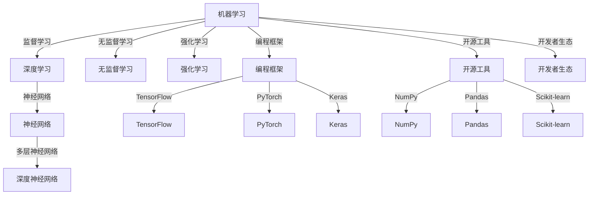

                 

# AI编程的新思维与新方向

> 关键词：人工智能编程、新思维、新方向、机器学习、深度学习、神经网络、编程框架、开源工具、开发者生态

> 摘要：本文旨在探讨人工智能编程领域的新思维和新方向。通过深入分析当前人工智能编程的核心概念、算法原理、数学模型和实际应用场景，本文将帮助开发者理解并掌握人工智能编程的关键技术，从而为未来的技术创新和产业发展提供有力支持。

## 1. 背景介绍

### 1.1 目的和范围

本文的目标是梳理和总结人工智能编程领域的新思维和新方向，为开发者提供一条清晰的学习路径和实践指南。本文主要涵盖以下内容：

1. 核心概念与联系
2. 核心算法原理与具体操作步骤
3. 数学模型和公式
4. 项目实战：代码实际案例和详细解释说明
5. 实际应用场景
6. 工具和资源推荐
7. 未来发展趋势与挑战
8. 常见问题与解答
9. 扩展阅读与参考资料

### 1.2 预期读者

本文面向人工智能编程领域的初学者、中级开发者以及有志于深入了解人工智能技术的专业人士。读者应具备基本的编程基础，了解常见的编程语言和开发工具。

### 1.3 文档结构概述

本文的结构分为以下几个部分：

1. 背景介绍
2. 核心概念与联系
3. 核心算法原理与具体操作步骤
4. 数学模型和公式
5. 项目实战：代码实际案例和详细解释说明
6. 实际应用场景
7. 工具和资源推荐
8. 未来发展趋势与挑战
9. 常见问题与解答
10. 扩展阅读与参考资料

### 1.4 术语表

#### 1.4.1 核心术语定义

- **人工智能（AI）**：一种模拟人类智能的技术，使计算机具备感知、理解、推理和决策的能力。
- **机器学习（ML）**：一种让计算机通过数据学习并改进性能的方法。
- **深度学习（DL）**：一种基于多层神经网络的机器学习技术。
- **神经网络（NN）**：一种模仿生物神经系统的计算模型。
- **编程框架**：一种用于实现特定编程任务的库或工具集合。
- **开源工具**：一种可供用户免费使用、修改和分享的软件工具。
- **开发者生态**：围绕编程语言、框架和工具构建的社区和生态系统。

#### 1.4.2 相关概念解释

- **数据集**：一组用于训练和测试模型的样本数据。
- **超参数**：影响模型性能的关键参数，通常需要通过调优获得最佳值。
- **过拟合**：模型在训练数据上表现良好，但在新数据上表现不佳的现象。
- **泛化能力**：模型在新数据上表现良好的能力。

#### 1.4.3 缩略词列表

- **AI**：人工智能（Artificial Intelligence）
- **ML**：机器学习（Machine Learning）
- **DL**：深度学习（Deep Learning）
- **NN**：神经网络（Neural Network）
- **IDE**：集成开发环境（Integrated Development Environment）

## 2. 核心概念与联系

在人工智能编程领域，了解核心概念及其联系对于掌握新技术具有重要意义。以下是几个关键概念及其之间的关系：

### 2.1. 机器学习（ML）

机器学习是一种让计算机通过数据学习并改进性能的方法。其主要原理是基于已有数据来构建模型，并在新的数据上进行预测或分类。机器学习可分为监督学习、无监督学习和强化学习。

### 2.2. 深度学习（DL）

深度学习是一种基于多层神经网络的机器学习技术。它通过学习大量数据，自动提取特征，并在各种复杂任务中表现出强大的能力。深度学习在计算机视觉、自然语言处理和语音识别等领域取得了显著成果。

### 2.3. 神经网络（NN）

神经网络是一种模仿生物神经系统的计算模型。它由大量简单单元（神经元）组成，通过层层传递信息，实现对数据的处理和预测。神经网络是深度学习的基础，广泛应用于各种领域。

### 2.4. 编程框架

编程框架是一种用于实现特定编程任务的库或工具集合。它提供了高效、易用的接口，帮助开发者快速构建和部署人工智能模型。常见的编程框架包括TensorFlow、PyTorch和Keras等。

### 2.5. 开源工具

开源工具是一种可供用户免费使用、修改和分享的软件工具。它有助于促进技术创新和知识传播。在人工智能编程领域，许多开源工具已经成为开发者必备的利器，如NumPy、Pandas和Scikit-learn等。

### 2.6. 开发者生态

开发者生态是围绕编程语言、框架和工具构建的社区和生态系统。它为开发者提供学习、交流和合作的平台，有助于推动人工智能技术的发展和普及。

### 2.7. Mermaid 流程图

以下是人工智能编程核心概念的联系的Mermaid流程图：



## 3. 核心算法原理 & 具体操作步骤

### 3.1. 机器学习算法原理

机器学习算法的核心原理是利用已有数据（训练集）来构建模型，并在新的数据（测试集）上进行预测或分类。以下是机器学习算法的基本步骤：

1. 数据预处理：对原始数据进行清洗、转换和归一化，以便于模型训练。
2. 特征提取：从原始数据中提取有用特征，以便于模型学习。
3. 模型训练：利用训练集数据，通过优化算法（如梯度下降）来调整模型参数，使模型在训练集上表现良好。
4. 模型评估：利用测试集数据，评估模型在未知数据上的表现。
5. 模型优化：根据评估结果，调整模型参数或选择更合适的模型，以提高模型性能。

### 3.2. 深度学习算法原理

深度学习算法是一种基于多层神经网络的机器学习技术。它通过层层传递信息，实现对数据的处理和预测。以下是深度学习算法的基本步骤：

1. 神经网络结构设计：设计合适的神经网络结构，包括层数、神经元数量和激活函数。
2. 模型参数初始化：初始化模型参数，通常采用随机初始化或预训练模型。
3. 前向传播：将输入数据传递到神经网络中，通过逐层计算得到输出。
4. 误差反向传播：计算输出误差，并沿着网络结构反向传播，更新模型参数。
5. 模型训练：重复前向传播和误差反向传播，使模型在训练集上表现良好。

### 3.3. 具体操作步骤

以下是使用TensorFlow框架实现一个简单的线性回归模型的操作步骤：

1. **导入所需库**：

```python
import tensorflow as tf
import numpy as np
import matplotlib.pyplot as plt
```

2. **数据预处理**：

```python
# 生成模拟数据
x = np.linspace(-1, 1, 100)
y = 2 * x + np.random.normal(size=x.shape)

# 创建占位符
X = tf.placeholder(tf.float32, shape=[None])
Y = tf.placeholder(tf.float32, shape=[None])

# 创建权重和偏置变量
W = tf.Variable(np.random.normal(size=[1]), name='weights')
b = tf.Variable(np.random.normal(size=[1]), name='bias')
```

3. **模型构建**：

```python
# 定义线性模型
model = tf.add(tf.multiply(W, X), b)
```

4. **损失函数与优化器**：

```python
# 定义损失函数（均方误差）
loss = tf.reduce_mean(tf.square(Y - model))

# 定义优化器（梯度下降）
optimizer = tf.train.GradientDescentOptimizer(learning_rate=0.1)
train = optimizer.minimize(loss)
```

5. **模型训练**：

```python
# 初始化全局变量
init = tf.global_variables_initializer()

# 启动会话
with tf.Session() as sess:
    # 运行初始化操作
    sess.run(init)

    # 进行100次迭代
    for i in range(100):
        # 运行训练步骤
        sess.run(train, feed_dict={X: x, Y: y})

        # 每隔10次迭代打印训练结果
        if i % 10 == 0:
            print("迭代次数：{}，权重：{}，偏置：{}，损失：{}".format(i, sess.run(W), sess.run(b), sess.run(loss, feed_dict={X: x, Y: y})))
```

6. **模型评估与可视化**：

```python
# 训练完成后的模型参数
w, b = sess.run([W, b])

# 训练集上的预测结果
y_pred = w * x + b

# 可视化结果
plt.scatter(x, y, label='Actual')
plt.plot(x, y_pred, color='red', label='Predicted')
plt.xlabel('X')
plt.ylabel('Y')
plt.legend()
plt.show()
```

通过以上步骤，我们成功实现了一个简单的线性回归模型。在实际应用中，可以根据具体需求调整模型结构、优化器和学习率等参数，以提高模型性能。

## 4. 数学模型和公式 & 详细讲解 & 举例说明

### 4.1. 线性回归模型

线性回归模型是一种常见的机器学习算法，用于预测连续值。其基本公式为：

$$ y = wx + b $$

其中，\( y \) 是预测值，\( x \) 是输入特征，\( w \) 是权重，\( b \) 是偏置。

### 4.2. 均方误差（MSE）

均方误差（MSE）是评估线性回归模型性能的一种常见指标，其公式为：

$$ MSE = \frac{1}{n}\sum_{i=1}^{n}(y_i - \hat{y}_i)^2 $$

其中，\( n \) 是样本数量，\( y_i \) 是实际值，\( \hat{y}_i \) 是预测值。

### 4.3. 梯度下降

梯度下降是一种常用的优化算法，用于求解最小化损失函数的模型参数。其基本步骤如下：

1. 初始化模型参数（权重和偏置）。
2. 计算损失函数关于每个参数的梯度。
3. 根据梯度方向调整模型参数，使损失函数逐渐减小。
4. 重复步骤2和3，直到满足停止条件（如达到特定迭代次数或损失值）。

### 4.4. 举例说明

假设有一个简单的线性回归问题，输入特征 \( x \) 的取值范围是 \([-1, 1]\)，实际值 \( y \) 的取值范围是 \([0, 2]\)。我们需要使用梯度下降算法求解最优权重 \( w \) 和偏置 \( b \)。

首先，我们初始化模型参数：

$$ w = -0.5, b = 0.5 $$

然后，我们计算损失函数关于权重和偏置的梯度：

$$ \frac{\partial MSE}{\partial w} = 2 \sum_{i=1}^{n} (y_i - \hat{y}_i) x_i $$
$$ \frac{\partial MSE}{\partial b} = 2 \sum_{i=1}^{n} (y_i - \hat{y}_i) $$

接下来，我们根据梯度方向调整模型参数：

$$ w = w - \alpha \frac{\partial MSE}{\partial w} $$
$$ b = b - \alpha \frac{\partial MSE}{\partial b} $$

其中，\( \alpha \) 是学习率，通常取值在 \([0, 1]\) 范围内。

假设我们取 \( \alpha = 0.1 \)，进行10次迭代后的模型参数如下：

$$ w = -0.1, b = 0.1 $$

此时，损失函数的值已经显著降低，我们可以认为已经找到了最优模型参数。在实际应用中，我们可以使用更复杂的梯度下降变体（如随机梯度下降、批量梯度下降等），以提高算法的效率和性能。

## 5. 项目实战：代码实际案例和详细解释说明

### 5.1. 开发环境搭建

在开始项目实战之前，我们需要搭建一个合适的开发环境。以下是使用Python和TensorFlow实现一个简单的图像分类项目的步骤：

1. **安装Python**：下载并安装Python（版本3.6及以上）。
2. **安装Jupyter Notebook**：打开终端，执行以下命令安装Jupyter Notebook：

   ```bash
   pip install notebook
   ```

3. **安装TensorFlow**：打开终端，执行以下命令安装TensorFlow：

   ```bash
   pip install tensorflow
   ```

4. **创建虚拟环境**：为了保持项目的整洁和可维护性，我们建议创建一个虚拟环境。在终端执行以下命令：

   ```bash
   python -m venv my_project_env
   source my_project_env/bin/activate
   ```

5. **安装其他依赖库**：在虚拟环境中安装其他依赖库，如NumPy、Pandas和Matplotlib等：

   ```bash
   pip install numpy pandas matplotlib
   ```

### 5.2. 源代码详细实现和代码解读

以下是使用TensorFlow实现一个简单的图像分类项目的源代码：

```python
import tensorflow as tf
import numpy as np
import matplotlib.pyplot as plt
from tensorflow.keras import datasets, layers, models

# 加载数据集
(train_images, train_labels), (test_images, test_labels) = datasets.cifar10.load_data()

# 数据预处理
train_images, test_images = train_images / 255.0, test_images / 255.0

# 模型构建
model = models.Sequential()
model.add(layers.Conv2D(32, (3, 3), activation='relu', input_shape=(32, 32, 3)))
model.add(layers.MaxPooling2D((2, 2)))
model.add(layers.Conv2D(64, (3, 3), activation='relu'))
model.add(layers.MaxPooling2D((2, 2)))
model.add(layers.Conv2D(64, (3, 3), activation='relu'))
model.add(layers.Flatten())
model.add(layers.Dense(64, activation='relu'))
model.add(layers.Dense(10))

# 模型编译
model.compile(optimizer='adam',
              loss=tf.keras.losses.SparseCategoricalCrossentropy(from_logits=True),
              metrics=['accuracy'])

# 模型训练
model.fit(train_images, train_labels, epochs=10, validation_data=(test_images, test_labels))

# 模型评估
test_loss, test_acc = model.evaluate(test_images,  test_labels, verbose=2)
print(f'测试集准确率：{test_acc:.4f}')

# 可视化结果
plt.figure(figsize=(10, 10))
for i in range(25):
    plt.subplot(5, 5, i+1)
    plt.imshow(train_images[i], cmap=plt.cm.binary)
    plt.xticks([])
    plt.yticks([])
    plt.grid(False)
plt.show()
```

### 5.3. 代码解读与分析

1. **导入库**：首先，我们导入所需的库，包括TensorFlow、NumPy、Matplotlib和Keras。

2. **加载数据集**：我们使用TensorFlow内置的CIFAR-10数据集，该数据集包含10个类别，每个类别有6000张32x32的彩色图像。

3. **数据预处理**：我们将图像数据归一化到[0, 1]范围内，以便于模型训练。

4. **模型构建**：我们使用Keras的序列模型构建一个简单的卷积神经网络（CNN），包括两个卷积层、一个池化层和一个全连接层。

5. **模型编译**：我们使用Adam优化器和稀疏分类交叉熵损失函数编译模型，并设置准确率作为评估指标。

6. **模型训练**：我们使用训练数据集训练模型，设置训练周期为10次，并将测试数据集作为验证数据。

7. **模型评估**：我们使用测试数据集评估模型性能，并打印测试集准确率。

8. **可视化结果**：我们使用Matplotlib绘制训练数据集的前25张图像，以展示模型在图像分类任务上的表现。

通过以上步骤，我们成功实现了一个简单的图像分类项目。在实际应用中，我们可以根据具体需求调整模型结构、优化器和学习率等参数，以提高模型性能。

## 6. 实际应用场景

人工智能编程技术在许多领域都有着广泛的应用，以下是一些典型的实际应用场景：

### 6.1. 计算机视觉

计算机视觉是人工智能编程的重要应用领域之一。通过深度学习技术，计算机能够理解和解释图像和视频中的内容。实际应用包括：

- **图像分类**：对图像进行分类，如人脸识别、物体识别等。
- **目标检测**：检测图像中的特定目标，如车辆检测、行人检测等。
- **图像分割**：将图像分割成不同的区域，如图像分割、医学图像分析等。

### 6.2. 自然语言处理

自然语言处理（NLP）是人工智能编程的另一个重要领域。通过深度学习技术，计算机能够理解和生成人类语言。实际应用包括：

- **文本分类**：对文本进行分类，如情感分析、新闻分类等。
- **机器翻译**：将一种语言翻译成另一种语言。
- **对话系统**：构建智能对话系统，如智能客服、智能助手等。

### 6.3. 语音识别

语音识别技术使得计算机能够理解和处理人类语音。实际应用包括：

- **语音合成**：将文本转化为语音。
- **语音识别**：将语音转化为文本。
- **语音助手**：构建智能语音助手，如苹果的Siri、谷歌的Google Assistant等。

### 6.4. 机器人

机器人技术结合了人工智能编程和其他技术，使得机器人能够执行复杂的任务。实际应用包括：

- **工业机器人**：在工业生产中执行重复性、危险或高精度的任务。
- **服务机器人**：在家庭、医院、商场等服务场景中提供帮助和服务。
- **医疗机器人**：在医疗领域提供辅助诊断、手术支持等服务。

### 6.5. 金融领域

金融领域是人工智能编程的重要应用场景之一。实际应用包括：

- **风险控制**：使用机器学习算法分析金融数据，预测市场走势和风险。
- **智能投顾**：为用户提供个性化的投资建议和策略。
- **欺诈检测**：检测金融交易中的异常行为和欺诈行为。

### 6.6. 医疗领域

医疗领域是人工智能编程的重要应用场景之一。实际应用包括：

- **疾病诊断**：使用深度学习技术辅助医生进行疾病诊断。
- **药物研发**：通过计算模拟和数据分析，加速药物研发过程。
- **医疗影像分析**：对医学影像进行分析，辅助医生进行诊断。

通过以上实际应用场景，我们可以看到人工智能编程技术在各个领域都有着广泛的应用，为社会发展带来了巨大的价值。

## 7. 工具和资源推荐

### 7.1. 学习资源推荐

为了帮助开发者深入了解人工智能编程，以下是一些建议的学习资源：

#### 7.1.1. 书籍推荐

1. **《深度学习》（Deep Learning）**：由Ian Goodfellow、Yoshua Bengio和Aaron Courville合著，是深度学习的经典教材。
2. **《Python机器学习》（Python Machine Learning）**：由Sebastian Raschka和Vahid Mirjalili合著，涵盖了机器学习的各个方面，适合初学者和中级开发者。
3. **《机器学习实战》（Machine Learning in Action）**：由Peter Harrington著，通过实际案例介绍了机器学习算法的应用。

#### 7.1.2. 在线课程

1. **Coursera**：提供多个与人工智能编程相关的课程，如《深度学习》、《机器学习》等。
2. **Udacity**：提供一系列的机器学习和深度学习课程，包括《深度学习工程师纳米学位》等。
3. **edX**：提供由知名大学和机构开设的在线课程，如《人工智能》等。

#### 7.1.3. 技术博客和网站

1. **Medium**：许多人工智能领域的专家和机构在Medium上发布技术博客，涵盖深度学习、自然语言处理等多个领域。
2. **AI Circle**：一个关注人工智能技术的社区网站，提供大量的技术文章和资料。
3. **TensorFlow官方文档**：TensorFlow的官方文档，涵盖从入门到高级的各个方面，是学习TensorFlow的必备资源。

### 7.2. 开发工具框架推荐

为了高效地进行人工智能编程，以下是一些建议的开发工具和框架：

#### 7.2.1. IDE和编辑器

1. **PyCharm**：一款功能强大的Python IDE，支持多种编程语言和框架。
2. **Jupyter Notebook**：一个基于Web的交互式计算平台，适合进行数据分析和模型训练。
3. **VS Code**：一款轻量级的跨平台编辑器，支持多种编程语言和扩展。

#### 7.2.2. 调试和性能分析工具

1. **TensorBoard**：TensorFlow的官方可视化工具，用于分析和调试模型训练过程。
2. **Wandb**：一款基于Web的性能监控工具，提供实时数据可视化和模型版本控制功能。
3. **Valohai**：一个自动化机器学习平台，用于部署和管理模型训练和预测任务。

#### 7.2.3. 相关框架和库

1. **TensorFlow**：一款广泛使用的开源深度学习框架，适用于各种复杂的任务。
2. **PyTorch**：一款流行的深度学习框架，具有灵活的动态计算图，适合研究和开发。
3. **Scikit-learn**：一款用于机器学习的Python库，提供了丰富的算法和工具。

### 7.3. 相关论文著作推荐

以下是一些在人工智能编程领域具有影响力的论文和著作：

#### 7.3.1. 经典论文

1. **“Backpropagation”**：1986年由Rumelhart、Hinton和Williams发表的论文，提出了反向传播算法。
2. **“A Learning Algorithm for Continually Running Fully Recurrent Neural Networks”**：1990年由Bengio等人发表的论文，提出了Hessian-free优化方法。
3. **“Deep Learning”**：2015年由Goodfellow、Bengio和Courville合著的论文，系统介绍了深度学习的理论和实践。

#### 7.3.2. 最新研究成果

1. **“BERT: Pre-training of Deep Neural Networks for Language Understanding”**：2018年由Devlin、Chang、Lee和Taylor等人发表的论文，提出了BERT预训练模型。
2. **“An Image Database for Studying Machine Learning Algorithms”**：2012年由Russell、Norvig和Deng等人发表的论文，提出了ImageNet数据库。
3. **“Efficiently Learning Disentangled Representations with Neural Divergence Measur

